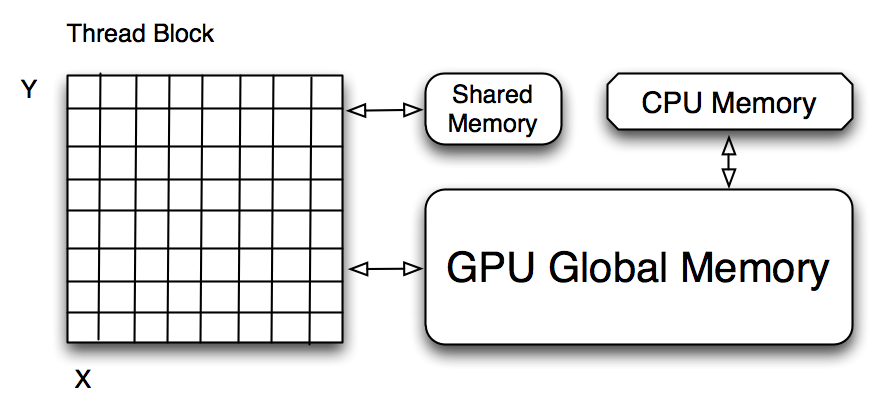

:author: Andrew Cron
:email: ajc40@stat.duke.edu
:institution: Duke University

:author: Wes McKinney
:email: wesmckinn@gmail.com
:institution: Duke University

---------------------------------------------------------
gpustats: GPU Library for Statistical Computing in Python
---------------------------------------------------------

.. class:: abstract

   In this talk we will discuss **gpustats**, a new Python library for
   assisting in "big data" statistical computing applications,
   particularly Monte Carlo-based inference algorithms. The library
   provides a general code generation / metaprogramming framework for
   easily implementing discrete and continuous probability density
   functions and random variable samplers. These functions can be
   utilized to achieve more than 100x speedup over their CPU
   equivalents. We will demonstrate their use in an Bayesian MCMC
   application and discuss avenues for future work.

.. class:: keywords

   GPU, CUDA, OpenCL, Python, statistical inference, statistics,
   metaprogramming, sampling, Markov Chain Monte Carlo (MCMC), PyMC,
   big data

Introduction
------------

Due to the high theoretical computational power and low cost of
graphical processing units (GPUs), researchers and scientists in a
wide variety of fields have become interested in applying them within
their problem domains. A major catalyst for making GPUs widely
accessible was the development of the general purpose GPU computing
frameworks, [CUDA]_ and [OpenCL]_, which enable the user to implement
general numerical algorithms in a simple extension of the C language
to run on the GPU. In this paper, we will restrict our technical
discussion to the CUDA architecture for NVIDIA cards, while later
commenting on CUDA versus OpenCL.

As CUDA and OpenCL provide a C API for GPU programming, significant
portions of the development process can be quite low level and require
large amounts of boilerplate code. To address this problem, [PyCUDA]_
and [PyOpenCL]_ provide a high-level Python interface to the APIs,
while also streamlining the process of writing and testing new GPU
functions, or *kernels*. PyCUDA and PyOpenCL compile GPU kernels on
the fly and upload them to the card; this eliminates the need to
recompile a C executable with each code iteration. The result is a
much more rapid and user-friendly GPU development experience, as the
libraries take care of much of the boilerplate code for interacting
with the GPU. They also provide seamless integration with [NumPy]_,
which allows GPU functionality to integrate easily within a larger
NumPy-based computing application. And, since code is compiled on the
fly, it is relatively straightforward to implement metaprogramming
approaches to dynamically generate customized GPU kernels within a
Python program.

In this paper we will discuss some of the challenges of GPU computing
and how GPUs can be applied to statistical inference applications. We
will further show how PyCUDA and PyOpenCL are ideal for implementing
certain kinds of statistical computing functions on the GPU.

Development Challenges in GPU Computing
---------------------------------------

While a CPU may have 4 or 8 cores, a latest generation GPU may have
256, 512, or even more computational cores. However, the GPU memory
architecture is highly specialized to so-called single instruction
multiple data (SIMD) problems. This generally limits the usefulness of
GPUs to highly parallelizable data processing applications. The
developer writes a function, known as a *kernel*, to process a unit of
data. The kernel function is then executed once for each unit or chunk
of data.

The GPU has a large single *global* memory store (typically 512MB to
4GB) from which data sets can be written and read by the CPU. However,
each group, or *block*, of threads are assigned a small piece
(typically 16K to 64K) of ultra low-latency *shared* cache memory
which is orders of magnitude faster than the global memory. Therefore,
the main challenge for the developer, outside of writing the kernel
function, is structuring the computation to optimally utilize each
thread block's shared memory and minimizing reads from and writes to
the global memory. Careful coordination of the threads is required to
transfer memory efficiently from global to shared. We will not get
into the low-level details of this process but instead refer the
interested reader to the CUDA API guide ([NvidiaGuide]_). See Figure
:ref:`gpuschematic` for a rough diagram of the computing architecture.

As a larger computation is divided up into a *grid* of thread blocks, a typical
CUDA kernel will therefore take the following structure:

* Coordinate threads within a block to transfer relevant data for block from
  global to shared memory
* Perform computation using (fast) shared memory
* Coordinate threads to transfer results back into global memory

   Mock-up of GPU computing architecture :label:`gpuschematic`

Computational Challenges in Likelihood-based Statistical Inference
------------------------------------------------------------------

In most standard and Bayesian statistical models, a probability
distribution (or family of distributions) is assumed for each
realization of the data. For example, the errors (residuals) in a
linear regression problem are assumed to be normally distributed with
mean 0 and some variance :math:`\sigma^2`. In a standard statistical
inference problem, given a set of distributional assumptions the task
is to estimate the parameters of those distributions. Under this
setup, we can write down the *joint likelihood* for the data in
mathematical terms

.. math::
   :label: likelihood

   p(x_1, \dots, x_n | \Theta) = \Pi_{i=1}^n p(x_i | \Theta),

where :math:`\Theta` represents the unknown parameters of the model, and
:math:`p(x_i | \Theta)` is the probability density for observation
:math:`x_i`. This representation assumes that the data are independent and
identically distributed. For example, we may wish to estimate the mean
:math:`\mu` and variance :math:`\sigma^2` of a normally distributed population,
in which case :math:`\Theta = (\mu, \sigma^2)` and

.. math::
   :label: normpdf

   p(x_i | \mu, \sigma^2) = \frac{1}{\sqrt{2 \pi \sigma^2}}
   e^{-(x_i-\mu)^2/2\sigma^2}

In many statistical inference algorithms, the "goodness of fit" of the
parameters :math:`\Theta` is evaluated based on the full data likelihood
:ref:`likelihood`. It is common to use the logged likelihood function as
:ref:`likelihood` decomposes into a sum of log densities and secondly this
reduces numerical precision problems.

Many numerical algorithms for fitting these likelihood-based models, especially
Monte Carlo-based, involve evaluating the log-likelihood function over thousands
of iterations. Thus as the size of the observed data grows, computational
expense grows *as least* linearly in the number of data points. As above, if the
data are assumed to be independently generated, the quantity :math:`\log p(x_i |
\Theta)` for each observation :math:`x_i` can be evaluated in parallel then
summed to compute the full log-likelihood. This becomes a very natural setting
for GPUs, and it is quite easy for GPUs to perform even better than large CPU
clusters because of the large number of computing cores and very low memory
latency. Suchard et al. studied these advantages in the Bayesian mixture model
setting and found very promising results (100x speedup) on graphics cards that
are now 2 years old ([JCGS]_).

Another source of significant computation in statistical applications which we
will address is that of generating draws from random variables. In many
algorithms (e.g. Bayesian Markov Chain Monte Carlo methods), large data sets may
require generating thousands or millions of random variables from various
probability distributions at each iteration of the algorithm.

Challenges of GPU Computing in Statistical Inference
----------------------------------------------------

As mentioned above, a CUDA or OpenCL programmer must be very mindful of the
memory architecture of the GPU. There are multiple memory management issues to
address, i.e. in CUDA parlance

* *Coalescing* transactions between global and shared memory; this is,
  coordinating groups of typically 16 to 32 threads to copy a contiguous chunk
  of 64 or 128 bytes in a single transation
* Avoiding shared memory *bank conflicts*, i.e. threads competing for read/write
  access to a shared memory address

To make this more concrete, let's consider the task of implementing the log of
the normal probability density function (pdf) :ref:`normpdf`. Given a data set
with :math:`N` observations, we wish to evaluate the pdf on each point for a set
of parameters, i.e. the mean :math:`\mu` and variance :math:`\sigma^2`. Thus,
all that needs to be passed to the GPU is the data set and the parameters. A C
function which can compute the log pdf for a single data point is

.. code-block:: c

   float log_normal_pdf(float* x, float* params) {
      float std = params[1];
      float xstd = (*x - params[0]) / std;
      return - (xstd * xstd) / 2 - 0.5 * LOG_2_PI
             - log(std);
   }

In practice, one would hope that implementing a new probability density such as
this would be as simple as writing this 4-line function. Unfortunately, to
achieve optimal performance, the majority of one's attention must be focused on
properly addressing the above data coordination / cache optimization
problems. Thus, the full form of a GPU kernel implementing a pdf is typically as
follows:

* Coordinate threads to copy (coalesce, if possible) data needed for thread
  block to shared memory
* Similarly copy parameters needed by thread back to shared memory
* Each thread computes a density result for a single data point, writing
  results to shared memory
* Copy/coalesce resulting density values back to global memory

Fortunately, the function signature for the vast majority of probability density
functions of interest is the same, requiring only *data* and *parameters*. While
the actual pdf function is very simple, the rest of the code is much more
involved. Since the kernels are structurally the same, we would be interested in
a way to reuse the code for steps 1, 2, and 4, which will likely be nearly
identical for most of the functions. Were we programming in C, doing so would be
quite difficult. But, since we have PyCUDA/PyOpenCL at our disposal,
metaprogramming techniques can be utilized to do just that, as we will later
discuss.

With respect to probability densities, we will make a brief distinction between
*univariate* (observations are a single floating point value) and *multivariate*
(vector-valued observations) distributions. In the latter case, the dimension of
each observation (the length of each vector) typically must be passed as
well. Otherwise, multivariate densities (e.g. multivariate normal) are handled
similarly.

In a more general framework, we might wish to evaluate the pdf for multiple
parameters at once, e.g. :math:`(\mu_1, \sigma^2_1), \dots, .. (\mu_K,
\sigma^2_K)`. In other words, :math:`N * K` densities need to be computed. A
naive but wasteful approach would be to make :math:`K` roundtrips to the GPU for
each of the :math:`K` sets of parameters. A better approach is to divide the
data / parameter combinations among the GPU grid to maximize data reuse via the
shared memory and perform all :math:`N * K` density computations in a single GPU
kernel invocation. This introduces the additional question of how to divide the
problem among thread blocks viz. optimally utilizing shared memory. As the
available GPU resources are device specific, we would wish to dynamically
determine the optimal division of labor among thread blocks based on the GPU
being used.

Avoiding *bank conflicts* as mentioned above is a somewhat thorny issue as it
depends on the thread block layout and memory access pattern. It turns out in
the **gpustats** framework that bank conflicts can be avoided with multivariate
data by ensuring that the data dimension is not a multiple of 16. Thus, some
data sets must be *padded* with arbitrary data to avoid this problem, while
passing the true data dimension to the GPU kernel. If this is not done, bank
conflicts will lead to noticably degraded performance. We are hopeful that such
workarounds can be avoided with future versions of GPU memory architecture.

For sampling random variables on the GPU, the process is reasonably
similar. Just as with computing the density function, sampling requires the same
parameters for each distribution to be passed. Many distributions can be derived
by transforming draws from a uniform random variable on the interval [0,
1]. Thus, for such distributions it makes most sense to precompute uniform draws
(either using the CPU or the GPU) and pass these precomputed draws to the GPU
kernel. However, there are widely-used distributions, such as the gamma
distribution, which are commonly sampled via *adaptive rejection sampling*. With
this algorithm, the number of uniform draws needed to produce a single sample is
not known *a priori*. Thus, such distributions would be very difficult to sample
on the GPU.

Metaprogramming: probability density kernels and beyond
-------------------------------------------------------

The **gpustats** Python library leverages the compilation-on-the-fly
capabilities of PyCUDA and metaprogramming techniques to simplify the process of
writing new GPU kernels for computing probability density functions, samplers,
and other related statistical computing functionality. As described above in the
normal distribution case, one would hope that writing a new density function
would amount to writing the simple ``log_normal_pdf`` function and having the
untidy global-shared cache management problem taken care of by the
library. Additionally, we would like to have a mechanism for computing
transformed versions of existing kernels. For example, ``log_normal_pdf`` could
be transformed to the unlogged density by applying the exponent function.

To solve these problems, we have developed a prototype object-oriented
code generation framework to make it easy to develop new kernels with
minimal effort by the statistical user. We do so by taking advantage
of the string templating functionality of Python and the CUDA API's
support for inline functions on the GPU. These inline functions are
known as device functions, marked by ``__device__``. Since the data
transfer / coalescing problem needs to be only solved once for each
variety of kernel, we can use templating to generate a custom kernel
for each new device function implementing a new probability
density. It is then simple to enable elementwise transformations of
existing device functions, e.g. taking the ``exp`` of a logged
probability density. In the **gpustats** framework, the code for
implementing the logged and unlogged normal pdf is as follows:

.. code-block:: python

   _log_pdf_normal = """
    __device__ float %(name)s(float* x, float* params) {
      // mean stored in params[0]
      float std = params[1];

      // standardize
      float xstd = (*x - params[0]) / std;
      return - (xstd * xstd) / 2 - 0.5f * LOG_2_PI
             - log(std);
    }
   """
   log_pdf_normal = DensityKernel('log_pdf_normal',
                                  _log_pdf_normal)
   pdf_normal = Exp('pdf_normal', log_pdf_normal)

The **gpustats** code generator will, at import time, generate a CUDA source
file to be compiled on the fly by PyCUDA. Note that the ``%(name)s`` template is
there to enable the device function to be given an appropriate (and
non-conflicting) name in the generated source code, given that multiple versions
of a single device function may exist. For example, the ``Exp`` transform
generates a one-line device function taking the ``exp`` of the logged density
function.

Python interface and device-specific optimization
-------------------------------------------------

Further work is needed to interface with the generated PyCUDA ``SourceModule``
instance. For example, the data and parameters need to be prepared in
``ndarray`` objects in the form that the kernel expects them. Since all of the
univariate density functions, for example, have the same function signature,
it's relatively straightforward to create a generic function taking care of this
often tedious process. Thus, implementing a new density function requires only
passing the appropriate function reference to the generic *invoker*
function. Here we show what the function implementing the normal (logged and
unlogged) pdf on multiple sets of parameters looks like:

.. code-block:: python

    def normpdf_multi(x, means, std, logged=True):
        if logged:
            cu_func = mod.get_function('log_pdf_normal')
        else:
            cu_func = mod.get_function('pdf_normal')
        packed_params = np.c_[means, std]
        return _univariate_pdf_call(cu_func, x,
                                    packed_params)

Inside the above ``_univariate_pdf_call`` function, the attributes of the
GPU device in use are examined to dynamically determine the thread block size
and grid layout that will maximize the shared memory utilization. This is
definitely an area where much time could be invested to determine a more
"optimal" scheme.

Reusing data stored on the GPU
------------------------------

Since the above algorithms may be run repeatedly on the same data set, leaving a
data set stored on the GPU global device memory is a further important
optimization. Indeed, the time required to copy a large block of data to the GPU
may be quite significant compared with the time required to execute the kernel.

Fortunately, PyCUDA and PyOpenCL have a ``GPUArray`` class which mimics its
CPU-based NumPy counterpart ``ndarray``, with the data being stored on the
GPU. Thus, in functions like the above, the user can pass in a ``GPUArray`` to
the function which will circumvent any copying of data to the GPU. Similarly,
functions like ``normpdf_multi`` above can be augmented with an option to return
a ``GPUArray`` instead of an ``ndarray``. This is useful as in some algorithms
the results of a density calculation may be immediately used for sampling random
variables on the GPU. Avoiding roundtrips to the GPU device memory can result in
a significant boost in performance, especially with smaller data sets.

Some basic benchmarks
---------------------

We show some benchmarks for the univariate and multivariate normal probability
density functions, both with and without using ``GPUArray`` to use data already
stored on the GPU. These were carried out with a very modest NVIDIA GTS 250
desktop card, which has 128 CUDA cores (latest generation cards have up to
512). The CPU benchmarks were done on a standard Intel Core i7 930 processor. As
you will see, the speedups with larger data sets can be quite dramatic. The
reported numbers below are the *speedup*, i.e. the ratio of CPU average runtime
divided by GPU average runtime.

**Univariate Normal PDF**: "Single" indicates that the density values were only
computed for a single mean and variance. "Multi" indicates that they were
computed for 8 (an arbitrary number) sets of means and variances in one
shot. The column header indicates the number of data points.

::

                      1e3     1e4     1e5     1e6
    Single            0.2234  1.268   7.951   23.05
    Single (GPUArray) 0.2407  1.291   9.359   38.72
    Multi             1.46    7.035   26.19   43.73
    Multi  (GPUArray) 1.79    8.354   30.79   49.26

**Multivariate Normal PDF**: For this distribution, we used a streamlined C
implementation of the density function (nearly identical code to the CUDA
kernel) for benchmarking purposes so that it's an apples-to-apples
comparison. For the data dimension we chose 15, again arbitrarily. Here we can
really see an even greater impact of reusing data on the GPU:

::

                      1e3     1e4     1e5     1e6
    Single            0.6998  4.167   12.55   14.09
    Single (GPUArray) 0.8465  6.03    32.59   64.12
    Multi             3.126   18.41   60.18   63.89
    Multi  (GPUArray) 3.135   19.8    74.39   82

.. Application: Bayesian Normal Mixture Modeling
.. ---------------------------------------------

Application: PyMC integration
-----------------------------

Low-hanging fruit for GPU integration in big data applications would be in
[PyMC]_. This is a library for implementing Bayesian Markov Chain Monte Carlo
(MCMC) algorithms. The user describes the generative process for a data set and
places prior distributions on the parameters of the generative process. PyMC
then uses the well-known Metropolis-Hastings algorithm to approximate samples
from the posterior distribution of the parameters given the observed data. A key
step in Metropolis-Hastings is the proposal step in which new parameter values
are selected via some *proposal distribution*, which is typically based on a
symmetric random walk but may be more sophisticated. A new proposed value
:math:`\theta^*` for :math:`\theta` is accepted or rejected based on the
*acceptance ratio*

.. math::

   a^* = \frac{p(\theta^*) p(x | \theta^*) p(\theta^* | \theta)}
   {p(\theta) p(x | \theta) p(\theta | \theta^*)},

where :math:`p(\theta)` is the prior density for :math:`\theta`, :math:`p(x |
\theta)` is the likelihood, and :math:`p(\theta | \theta^*)` is the proposal
density. Understanding the details of how and why this algorithm works is not
important for the scope of this paper. What is important is the fact that the
quantity :math:`p(x | \theta)` is recomputed typically thousands of times to
compute samples from the model. If the data :math:`x` is very large, then the
majority of the runtime of the MCMC may be spent recomputing the data likelihood
for different parameters.

Enabling all of the PyMC distributions to run in *GPU mode* (so that likelihoods
are computed on the GPU) would be very simple as soon as the probability density
functions are implemented inside **gpustats**. Based on the above benchmarks, it
is clear that integrating **gpustats** with PyMC could significantly reduce the
overall runtime of many MCMC models on large data sets.

Conclusions and future work
---------------------------

As **gpustats** currently uses PyCUDA it can only be used with NVIDIA graphics
cards. OpenCL, however, provides a parallel computing framework which can be
executed on NVIDIA and ATI cards as well as on CPUs. Thus, it will make sense to
enable the **gpustats** code generator to emit OpenCL code in the near
future. As PyOpenCL is developed in lockstep with PyCUDA, altering the Python
interface code to use PyOpenCL should not be too onerous. Using OpenCL currently
has drawbacks for statistical applications: most significantly the lack of a
pseudorandom number generator equivalent in speed and quality to [CURAND]_. For
simulation-based applications this can make a big impact. We are hopeful that
this issue will be resolved in the next year or two.

Another important addition which would be important to some users is to enable
multiple GPUs to be run in parallel to extract even better performance. While
this would introduce more latency for small datasets and likely be unnecessary,
for processing large data sets, the overhead of calling out to 3 GPUs, for
example, would likely be much less than the computation time. Ideally code could
be seamlessly run on multiple GPUs.

Note that **gpustats** is still in prototype stages, so its API will be highly
subject to change. We are hoping to generate interest in this development
direction as it could be highly impactful in boosting Python's status as a
desirable statistical computing environment for big data. An end goal would be
to reimplement most of the probability distributions (densities, samplers, etc.)
in **scipy.stats** on the GPU and to fully integrate these where possible
throughout PyMC and other related libraries.

Another interesting avenue, but perhaps of less importance for Python
programmers, would be the generation of wrapper interfaces to the generated CUDA
or OpenCL source module for other programming languages, such as R. However,
without the easy-to-use PyCUDA and PyOpenCL bindings this would likely be a
fairly significant undertaking.

References
----------

.. [CUDA] NVIDIA Corporation. CUDA GPU computing framework
      http://www.nvidia.com/object/cuda_home_new.html

.. [OpenCL] Kronos Group. OpenCL parallel programming framework
      http://www.khronos.org/opencl/

.. [JCGS] M. Suchard, Q. Wang, C. Chan, J. Frelinger, A. Cron and M. West.
      *Understanding GPU programming for statistical computation: Studies
      in massively parallel massive mixtures.* Journal of Computational
      and Graphical Statistics 19 (2010): 419-438
      http://pubs.amstat.org/doi/abs/10.1198/jcgs.2010.10016

.. [NvidiaGuide] NVIDIA Corporation. *Nvidia CUDA: Programming Guide.* (2010),
         http://developer.download.nvidia.com/compute/cuda/3_0/toolkit/docs/NVIDIA_CUDA_ProgrammingGuide.pdf

.. [CURAND] NVIDIA Corporation. CURAND Random Number Generator
         http://developer.download.nvidia.com/compute/cuda/3_2/toolkit/docs/CURAND_Library.pdf

.. [PyMC] C. Fonnesbeck, A. Patil, D. Huard,
          *PyMC: Markov Chain Monte Carlo for Python*,
          http://code.google.com/p/pymc/

.. [NumPy] T. Oliphant,
           http://numpy.scipy.org

.. [SciPy] E. Jones, T. Oliphant, P. Peterson,
           http://scipy.org

.. [PyCUDA] A. Klöckner,
        http://mathema.tician.de/software/pycuda

.. [PyOpenCL] A. Klöckner,
          http://mathema.tician.de/software/pyopencl
