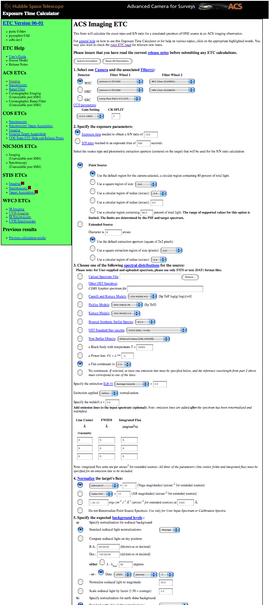
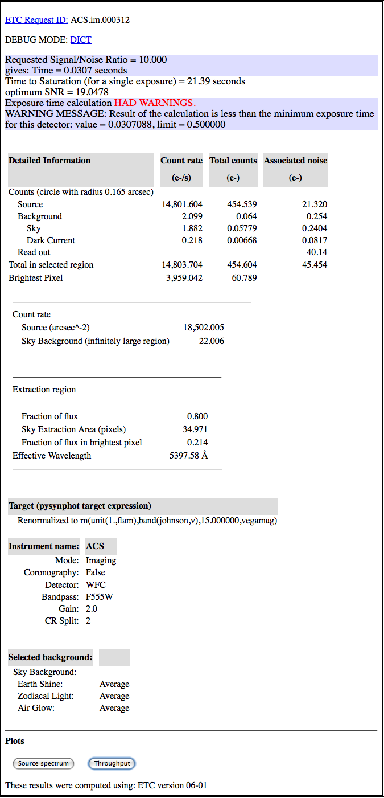
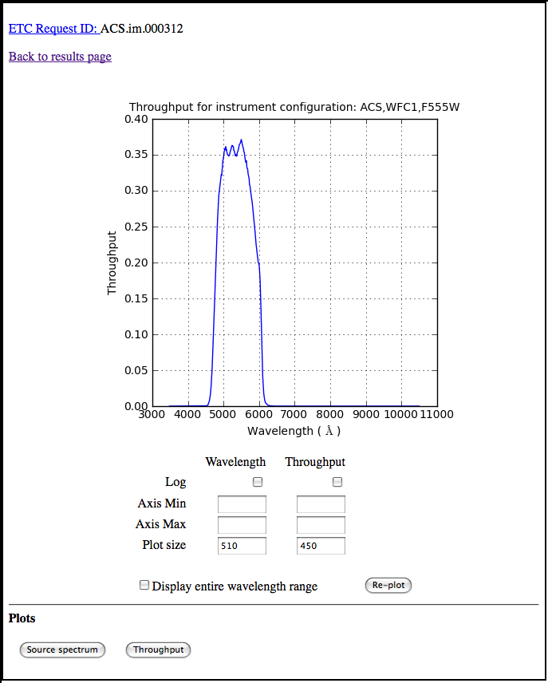

:author: Perry Greenfield
:email: perry@stsci.edu
:institution: Space Telescope Science Institute

:author: Ivo Busko
:email: busko@stsci.edu
:institution: Space Telescope Science Institute

:author: Rosa Diaz
:email: rdiaz@stsci.edu
:institution: Space Telescope Science Institute

:author: Vicki Laidler
:email: laidler@stsci.edu
:institution: Computer Sciences Corporation, Space Telescope Science Institute

:author: Todd Miller
:email: jmiller@stsci.edu
:institution: Space Telescope Science Institute

:author: Mark Sienkiewicz
:email: sienkiew@stsci.edu
:institution: Space Telescope Science Institute

:author: Megan Sosey
:email: sosey@stsci.edu
:institution: Space Telescope Science Institute

----------------------------------------------
Rebuilding the Hubble Exposure Time Calculator
----------------------------------------------

.. class:: abstract

 An Exposure Time Calculator (ETC) is an invaluable web tool for astronomers wishing to submit proposals to use the Hubble Space Telescope (HST). It provide a means of estimating how much telescope time will be needed to observe a specified source to the required accuracy.

 The current HST ETC was written in Java and has been used for several proposing cycles, but for various reasons has become difficult to maintain and keep reliable. Last year we decided a complete rewrite--in Python, of course--was needed and began an intensive effort to develop a well-tested replacement before the next proposing cycle this year.

 This paper will explain what the ETC does and outline the challenges involved in developing a new implementation that clearly demonstrates that it gets the right answers and meet the needed level of reliability (astronomers get cranky when the calculator stops working on the day before the proposal deadline). The new ETC must be flexible enough to enable quick updates for new features and accommodate changing data about HST instruments. The architecture of the new system will allow Python-savvy astronomers to use the calculation engine directly for batch processing or science exploration.

 Testing is a very large component of this effort, and we discuss how we use existing test cases, as well as new systematic test generators to properly explore parameter space for doing test comparisons, and a locally developed test management system, Pandokia, to monitor and efficiently analyze thousands of complex test cases.

Introduction
------------

Observing time on the Hubble Space Telescope (HST) is quite valuable. One orbit of observing time (typically 45 or less minutes of on-target time) costs on the order of $100K. Understandably, no one would like to waste that. As a result, understanding how much time is needed to accomplish the planned science is important. Asking for too little or too much will result in wasted telescope resources. Hence, the need for exposure time calculators.

ETCs are used to answer important questions such as: how long must I observe to achieve a desired signal-to-noise ratio, or what signal-to-noise ratio can I expect for a planned observation? Computing these quantities requires specifying many input parameters. These fall into few basic categories.

- What instrument will be used? What kind of observing mode (e.g., imaging, spectroscopy, coronography, or target acquisition). What filters or gratings? What detector parameters?
- What kind of source? In particular, what are the spectral details of the source. Any dust extinction or redshifts involved?
- How bright is the source? How is the brightness to be specified?
- How much area around image or spectral feature do you plan to use to extract signal? Is it a point source or is it extended?
- What kinds of sky background levels do you expect?

All of these choices affect the answer. Some of them involve many possible options.

In the past, peak ETC request rates averaged 10 calculations per minute. Although much computation is involved for each request, the request rate is never terribly high.

History
-------

Despite the clear utility of ETCs they were not part of the original HST software plan, and it was several years before they were officially supported. A number of precursors arose from essentially grass-roots efforts. By the late 1990s web-based CGI ETCs, most written in C, had begun appearing for some of the HST instruments. Around 2000 an effort to provide an integrated GUI-based proposing environment was started. Since ETCs share many of the input parameters with the proposing tools, it was believed that it made sense to integrate these tools into one GUI application, and a large effort was begun to do just that. It was based on a prototype application developed in Java by NASA (The Science Expert Assistant [Gro00]_) and became the Astronomers Proposal Tool (APT, http://apt.stsci.edu).

Despite the original intent to develop an integrated application, it was eventually judged that a web-based interface was much more important, and at that point the ETC functionality began a voyage out of the APT GUI and eventually became an entirely separate application again. In the process, it had become much more complicated because of the intrinsic complexity of the design driven by the GUI interface. Over time much of the GUI heritage was removed, but it still had many lingering effects on the code and its design.

The addition of support for more instruments and modes, along with pressure to meet proposal deadlines, led to increasing complexity and inconsistencies, particularly with regard to testing and installations. Unrealized to many, it was quickly becoming unmaintainable. For the Cycle 16 proposal
period (HST runs a roughly annual proposal cycle), it worked reasonably well and was quite reliable. That all changed in Cycle 17, where we experienced server hangs approximately every 5 minutes when under peak load. Many months of work to improve the reliability of the server actually ended up with worse reliability. Even worse, the cycle of making a change, and then delivering and testing the change could take weeks or months leading to an unacceptably long iteration cycle.

At this point an evaluation was made of the underlying problems. These consisted of:

 - Large code base. The number of Java lines of code had grown to over 130K and was viewed as unnecessarily complex.
 - Database inflexibility. Information was being stored in it that made it impossible to run more than one instance or version of an ETC on a given machine, leading to testing and installation complications.
 - Lack of automated build and testing. Installations involved many manual, context-dependent steps
 - It was difficult to run tests and to examine results.
 - Tests were represented in many different formats and require much massaging by the software to run.
 - Test results varied from one system to another because of database issues.
 - Lack of tests of javascript functionality.
 - Resource leaks could hang server.
 - Uncaught exceptions would hang server.
 - Instrument parameters located in many different locations in different kinds of files.

Rebuilding
----------

Rather than try to fix these with the existing code base, we decided to re-implement the ETCs in Python. This was partly because we (Science Software Branch) write relatively little software in Java now and have comparatively little expertise in it, Additionally, one of the key tools used by the ETC (pysynphot [Lai08]_) is written in Python, so interactions with the ETC would be simplified. Rewriting the entire code base solely in Python also dramatically decreased the overall length of the code.

A rewrite was begun in April 2009 with a proof of concept computational prototype. After approval to go ahead in June, a major effort began to design and implement a new system. The new design had a number of requirements it had to meet:

- One step install
- Ability to support multiple installations on the same computer
- Consistent test scheme
- Nightly regression testing
- Separation of web and compute functionality
- Ability to script ETC calculations from Python without a web server
- Use of standard Apache/Database server schemes to handle failover and load balancing
- Simple database structure
- Concentrate instrument information in one place
- Use automatic test generation for better parameter space coverage
- No XML
- No cached results
- It had to be ready for Cycle 19 proposal preparation
- Minimal changes to the user interface
- Dispense with interactive form features that weren't working well in the old ETCs

Django was used for the web framework and user interface. Our use of its features is fairly light, but even so, it made the web side of the system fairly easy. Taking a lesson from the past ETC, we made the use of Django's database as simple as possible. One goal was to minimize the need to change the database schemas during operations. Since ETCs take many parameters for the sources and the instruments, there are many potential fields for a database, and it is likely that many of these would change or be added. Yet there is rarely any need to query the database for values of these fields. For those occasions, it would probably be best to specially create a new database for such queries. All the input and output information is encapsulated in a string which is then stored in the database.

Validation Testing
------------------

The validation of the new ETCs is simpler in one aspect: we only need match the results of the previous ETC, even if we believe the previous results are incorrect.  Any identified discrepancies believed to be errors in the original code were identified as such and noted for later work. If there is time for the instrument groups to address the issue, waivers for differences can be obtained. 

It might seem counter-intuitive to use this approach, but it works well in our environment.  The software developers cannot always authoritatively answer scientific questions, so we often rely on the appropriate instrument group.  But they are not always available to answer our questions quickly due to other priorities.

By using the old ETC as a reference, we can remove the instrument group from our work flow.  This reduces their workload, because they are not directly involved in the new development.  As software developers, it reduces our cycle time to test a new feature:  Instead of asking a scientist to manually perform a detailed analysis of a result, we can simply compare it to the same result from a system that has previously been accepted as correct. 

Our target for the maximum difference was generally 1%, though we were permitted to allow differences as much as 5% from the HST project if helpful for meeting the schedule.

On the other hand, migrating the existing tests proved more work than expected because of the many forms such tests took, and the many issues in determining the proper mapping of test parameters to the old and new ETCs. The typical test migration process was to start with custom code to handle any special cases for parameter migration, run a batch test case migration, run the tests, and from the errors, fix migration errors and iterate until all remaining errors were purely computational issues.

The reference results from the old ETC were obtained by running it through its web interface using the mechanize module. The most important information on the result was the ID of the request, which was then used to retrieve the very extensive log files that were generated on the server side which contained the values of the final results and many intermediate values. These also proved invaluable in tracking down where results diverged between the old and the new.

The old ETC had tests in two basic forms (with many variations in details). Some appeared as XML files with one test per file. Others as CSV files, with one test per row. In both cases most were generated manually. We desired a more systematic way of testing parameter space, so a special module was written to generate test cases automatically. In this way we can define whole sets of tests by providing specific lists of parameter values for specific parameters and construct combination of parameter sets by using tools to generate specific test sets by varying one parameter at a time  (akin to traveling along parameter axes), or by generating all combinations (filling the parameter space with a grid of points). One can combine subspaces of parameters in analogous ways. There is a mechanism to make concatenating disjoint sets of parameters that correspond to radio button subsets easy.

We have nightly regression tests running more than 8000 cases a night. Initially the reference results are those taken from the old ETC. Once commissioning is complete, the reference results will be a snapshot of the new ETC results to ensure that future software updates do not change the results in unexpected ways. Table 1 shows an example of a single night's run.

+-------------------+-------+------+------+-------+
| Daily             | count | pass | fail | error |
|                   |       |      |      |       |
| (2010-05-13)      |       |      |      |       |
+-------------------+-------+------+------+-------+
|                   |  8705 | 7234 |  865 |   606 |
+-------------------+-------+------+------+-------+
| engine/*          |  7068 | 5794 |  668 |   606 |
+-------------------+-------+------+------+-------+
| server/*          |  1626 | 1429 |  197 |     0 |
+-------------------+-------+------+------+-------+
| web/*             |    11 |   11 |    0 |     0 |
+-------------------+-------+------+------+-------+
| Engine Only       | count | pass | fail | error |
+-------------------+-------+------+------+-------+
|                   |  7068 | 5794 |  668 |   606 |
+-------------------+-------+------+------+-------+
| engine.*          |     2 |    2 |    0 |     0 |
+-------------------+-------+------+------+-------+
| migrated/*        |  6963 | 5690 |  668 |   605 |
+-------------------+-------+------+------+-------+
| spider/*          |   103 |  102 |    0 |     1 |
+-------------------+-------+------+------+-------+

Table 1: The report of test results from one night's test run. Count refers to the number of tests in that category; pass refers to the number that run and match the expected results to within the specified threshold; fail refers to the number of tests that produce results but do not match all results to the required threshold; and error indicates the number of tests that fail to produce all necessary results.

Current Status
--------------

To date all of the supported instrument modes have been implemented as far as the calculation engine goes.  Most reporting and plotting functionality is in place. Nearly all migrated tests run, though there are still discrepancies being resolved for a few modes. These discrepancies are expected to be understood within a month. The new ETC has approximately 22K lines of code in the web and engine components. A further 5K lines of code were written to support the testing effort. This includes conversion of test data, running tests of the old ETC, comparing results, etc. The new ETC uses a similar form interface, and generates output pages similar (though not identical) to that of the previous ETC.

Figure 1 shows an example of an input form. Figure 2 shows the results obtained from that form, and Figure 3 shows plots of related information associated with those results.

Figure 1. Part of the input form for the Advanced Camera for Surveys. This shows most of the choices available to users.

Figure 2. The results page for the input parameters shown in Figure 1.

Figure 3. One of the plot options for the results shown in Figure 2. In this case the instrument throughput is shown as a function of wavelength for the selected observing mode.

Plans
-----

The ETC must be operational by December of this year. Future activities include web security analysis, load testing, through-the-browser tests (manual and automatic), and documentation.

This ETC framework will be the basis of the James Webb Space Telescope ETCs. JWST is expected to be launched in 2015. Work has begun on understanding what features will be needed for JWST that don't already exist for the HST ETCs. Besides providing the instrument performance information, it is already clear that much more sophisticated sky background models will be needed to be developed to determine which of several detector operations modes will yield the best signal-to-noise ratio.

Furthermore, JWST has requirements to schedule observations at times that do not degrade signal-to-noise too much (due to varying sky background levels that depend on the time of year the target is observed). As such, the scheduling system will need to obtain this information from the ETC. There is also a desire for the proposal preparation tool to be able to use the ETC to determine the optimal detector operating mode for each exposure.

We will be importing all the data regarding instrument performance as it relates to ETC calculations into our Calibration Data tracking system (not possible with the older ETC because of the dispersed  nature of the data).

The ETC also provides tables of results to the observatory scheduling system which helps detect when bright sources may pose a health and safety hazard to the instrument in use.

The ETC computational engine will be made available with an Open Source License (BSD/MIT) when the production version is completed.

Conclusions
-----------

The rewrite has resulted in a far smaller and consistent code base. More importantly, we can test on the same system that is used operationally. The cycle of building, delivering, and testing the software now can be done in hours instead of weeks giving us far greater ability to fix problems and add enhancements. Django, and our pre-existing tools (matplotlib, pysynphot, pandokia) greatly facilitated this effort. We will be in a much better position to adapt to JWST ETC requirements.

There were certainly general lessons to be learned from this experience and other work we've done. In coming up with this list, we are generalizing about some issues that didn't necessarily affect this project. Among them:

- There is a big difference between scientific programming as most scientists do it, and what is needed for operational purposes. The following table contrasts some of the differences in approach that one usually sees. This isn't to say that scientists couldn't benefit from some of the approaches and tools for operational software (often they could), it's just that that they usually don't use them. These differences result in important management issues discussed later.

+------------------------+---------------------------+
| Scientist              | Operations                |
+------------------------+---------------------------+
| Ad-hoc changes to      | One code base to          |
| handle various needs   | handle all needed         |
|                        | alternatives              |
+------------------------+---------------------------+
| Corner cases often     | Special cases given       |
| ignored                | more attention            |
+------------------------+---------------------------+
| Little attention to    | Much more attention       |
| user interface         | to user interface         |
+------------------------+---------------------------+
| Minimal error checking | Extensive error checking  |
+------------------------+---------------------------+
| No version control     | Version Control           |
+------------------------+---------------------------+
| No unit or regression  | Extensive tests           |
| tests                  |                           |
+------------------------+---------------------------+
| Minimal documentation  | More extensive            |
|                        | documentation             |
+------------------------+---------------------------+
| Refactoring rare       | Hopefully not...          |
+------------------------+---------------------------+

 - Databases are a double-edged sword. They clearly have important uses, particularly for web applications. On the other hand, they introduce a number of strong constraints on flexibility and ease of distribution. Think carefully about what you use them for and when you really need it.
 - Resist temptation to continually put new features over internal coherence. Refactor when needed.
 - Routine builds and testing are extremely important. The installation process needs to be as automatic as possible.
 - Test on the same machine (or as identical an environment as possible) to be used for operations (at least a subset of the full tests).
 - No matter how much analysis you do up front about the design, you probably won't get it right. Be ready to redo it when you face the real world.
 - It has to work for all cases, not just the common ones. Even crazy input parameters must at least give a useful error message that will help the user identify the problem.

Complicating the interface between the astronomers and developers is the fact that many astronomers have written programs for their research purposes, but have never had to write programs for distribution or operational settings, and have never had to support software they have written. As a result many astronomers do not appreciate the effort required to produce reliable and distributable software that can be used by individuals or complex systems. That effort is typically up to an order of magnitude more than needed to get software that works for their particular need. It is not unusual to see astronomers become frustrated at the effort required for implementation when they think they could have done it in one fifth the time. As important as any programming, software engineering, or management technique, is the management of the expectations of such customers, and resistance against such expectations driving software into an unmaintainable state.

References
----------

.. [Gro00] S. R. Grosvenor, C. Burkhardt, A. Koratkar, M. Fishman, K. R. Wolf,
          J. E. Jones, L. Ruley. *The Scientist's  Expert Assistant Demonstration*,
          Astronomical Data Analysis Software and Systems, IV, 216, 695-698.
.. [Lai08] V. Laidler, P. Greenfield, I. Busko, R. Jedrzejewski.
          *Pysynphot: A Python Re-Implementation of a  Legacy App in Astronomy*,
          Proceedings of  the 7th Python in Science Conference, 2008, 36-38
 an unmaintainable state.

References
----------

.. [Gro00] S. R. Grosvenor, C. Burkhardt, A. Koratkar, M. Fishman, K. R. Wolf,
          J. E. Jones, L. Ruley. *The Scientist's  Expert Assistant Demonstration*,
          Astronomical Data Analysis Software and Systems, IV, 216, 695-698.
.. [Lai08] V. Laidler, P. Greenfield, I. Busko, R. Jedrzejewski.
          *Pysynphot: A Python Re-Implementation of a 