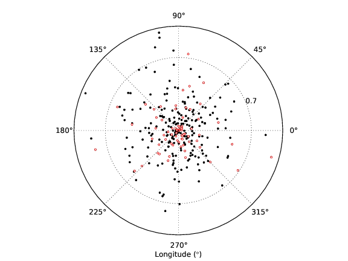
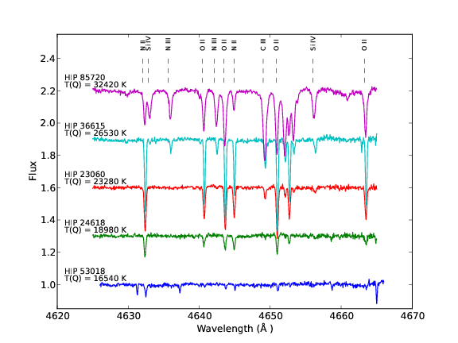
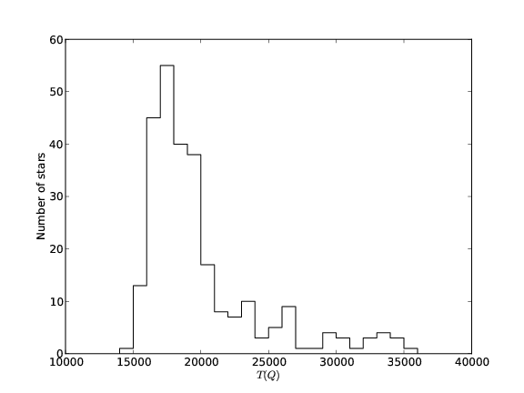
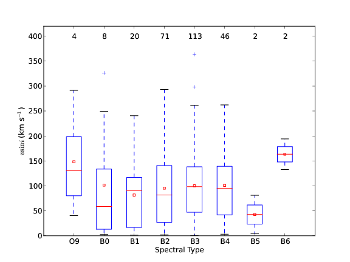
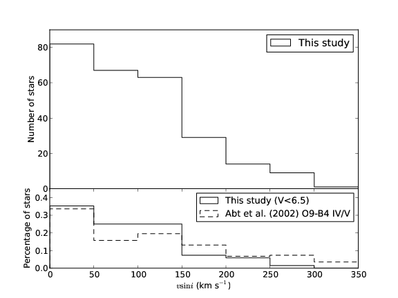
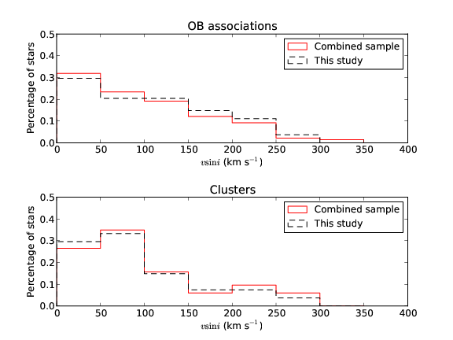

:author: Gustavo Braganca
:email: ga.braganca@gmail.com
:institution: Observatorio Nacional, Brazil

:author: Simone Daflon
:email: daflon@on.br
:institution: Observatorio Nacional, Brazil

:author: Katia Cunha
:email: cunha@email.noao.edu
:institution: Observatorio Nacional, Brazil; National Optical Astronomy Observatory, University of Arizona, U. S. A.

:author: Thomas Bensby
:email: tbensby@astro.lu.se
:institution: Lund Observatory, Sweden

:author: Sally Oey
:email: msoey@umich.edu
:institution: University of Michigan, U. S. A.

:author: Gregory Walth
:email: gwalth@email.arizona.edu
:institution: Steward Observatory, U. S. A.

--------------------------------------------------------------------
Using Python to Study Rotational Velocity Distributions of Hot Stars
--------------------------------------------------------------------

.. class:: abstract

   Stars are a fundamental pieces that compose our Universe. By 
   studying them we can better comprehend the environment in which we 
   live. On this work, we have studied a sample of almost 350 nearby OB 
   stars and have  characterized them in aspects of their temperature 
   and projected rotational velocity.
   
   Python is a robust language with a steep learning curve, i.e. one 
   can make rapid progress with it. In this proceeding, we will be 
   discussing our  progress in learning Python at the same time in 
   which the research were being made.

.. class:: keywords

   Astronomy, Stars, Galactic Disk
   
Introduction
------------

The study of O and B stars are an important key to understand how star 
formation occurs. When these stars born, they have the greatest mass, 
temperature and rotation. Their mass can achieve **.....**, their 
temperatures, **....**, and rotation up to 400 km/s. 

By definition, a star is born when it start synthetizing Hydrogen into
Helium through nuclear fusion. The star perform this nucleosynthesis 
during somewhat 90% of their life. When stars are at this stage, they 
are called dwarfs. Most of the studied stars of this work are dwarfs. 
Due to their young age, dwarf stars do not have lost too much of their 
mass, and so, the most of their stellar properties are kept unchanged. 
This help us understand how this stars formed.

Stars are born inside molecular clouds, and, usually, a molecular cloud 
can generate several stars. After their formation, these stars compose 
a stellar association, that, in its infancy, is still gravitationally 
bounded. With their unchanged properties, it is possible to trace the 
membership of these stars and then verify if some stars are from the 
same association.

The Python programming language is very well suited to scientific 
studies. The scipy, numpy and matplotlib are the basic packages to 
start doing scientific research using python. Also, on the last years, 
it has been widely adopted on the Astronomic community. Because this, 
several packages are being translated to python or just being created. 
The existence of these packages are one of the reasons that attracted 
us to use python on our research. Its easy learning and its script 
nature are other reasons as well. The script nature allows the 
researcher to have a dynamic workflow and not to loose too much time 
with debugging and compiling.

On this proceedings, we relate how we used python on our research. A 
more profound scientific analysis can be found at [Brag12]_.

Research development
--------------------

Initial stages
~~~~~~~~~~~~~~

As we have said before, stars usually are born in groups. Because of 
that, a great majority of them are binaries or belongs to multiple 
systems. For a spectroscopic study, as was this, the only problem 
occurs when the spectrum of one observation have two or more objects. 
Since the study of these stars were outside the scope of our project, 
we selected those stars on our sample to further discard them. But 
before discarding them, we used Python to visualize our sample and the 
distribution of these objects. We used the matplotlib package to do a 
polar plot of our objects in Galactic coordinates:

.. code-block:: python

   import numpy as np
   import matplotlib.pyplot as plt
   
   # Distance projected on the Galactic plane
   proj_dist = distance_vector * np.cos(latitude_vector)
   
   plt.polar(longitude_vector, proj_dist, 'k.')
   for i in binary_list:
       for j in range(len(coordinate_list)):
           #Compare stellar IDs
           if i == coordinate_list[j, 0]:     
               plt.plot(longitude_vector[j], 
                        proj_dist[j], 
                        'wo', ms=3, mec='r')  
                        
               
And the resulting plot is showed in Figure :ref:`coords`.                 
                        

   Polar plot showing the positions of the sample stars projected onto 
   the Galactic plane. The plot is centered on the Sun. The open red 
   circles are spectroscopic binaries/multiple systems identified in 
   our sample. :label:`coords`
   
Our sample is composed of high-resolution spectroscopic observations. 
Sample spectra are shown
in Figure :ref:`spectra` in the spectral region between 4625 and 
4665 Angstrom, which contains spectral lines of C, N, O, and Si.
To analyse the spectra images we have used `IRAF <http://iraf.noao.
edu/>`__ (Image and Reduction Analysis Facility), which is a suite of 
softwares to handle astronomic images developed by the NOAO [1]_. 
We had to do several tasks on our spectra (e.g. cut it in a certain 
wavelength and normalization) to prepare our sample to further 
analysis. Some of these tsaks had to be done manully on a one-by-on 
basis, but some other were automated. The automation ould have bnn 
done using the IRAF scripting, but fortunately, the STSCI [2]_ has 
developed a python wrapper for IRAF called `PyRAF <http://www.stsci.
edu/institute/software_hardware/pyraf>`__.
For example, we show how we used IRAF task SCOPY to cut images from a 
list using pyRAF:

.. [1] National Optical Astronomy Observatory
.. [2] Space Telescope Science Institute

   Example spectra of five sample stars in the region 4625-4665 
   Angstrom. Some spectral lines are identified. The spectra were 
   arbitrarily displaced in intensity for better viewing.
   :label:`spectra`

.. code-block:: python

   from pyraf import iraf
   
   iraf.noao.onedspec.scopy.w1 = 4050  # Starting wavelength
   iraf.noao.onedspec.scopy.w2 = 4090  # Ending wavelength
   
   for name in list_of_stars:
       # Spectrum to be cut
       iraf.noao.onedspec.scopy.input = name
       # Nanme of resulting spectrum
       result = name.split('.fits')[0] + '_cut.fits'
       iraf.noao.onedspec.scopy.output = result
       # Execute
       iraf.noao.onedspec.scopy(mode = 'h')

We also have performed a spectral classification on the stars and, 
since this was not done using Python, more information can be obtained 
on the original paper. 

Effective temperature through photometric calibration
~~~~~~~~~~~~~~~~~~~~~~~~~~~~~~~~~~~~~~~~~~~~~~~~~~~~~

We have obtained effective temperature (Teff) from a calibration 
presentend in [Mass89]_ that uses the photometric reddening-free 
parameter index  :math:`Q` ([John58]_). 

A histogram showing the distribution of effective temperatures for OB 
stars with available photometry is shown in Figure :ref:`TqHist`.
The effective temperatures of the target sample peak around 17,000 K, 
with most stars being cooler than 28,000 K.
                        

   Histogram showing the distribution of effective temperatures for the 
   studied sample. :label:`TqHist`
    
Projected rotational velocities
~~~~~~~~~~~~~~~~~~~~~~~~~~~~~~~

We have obtained projected rotational velocities (:math:`v\sin i`) for 
266 stars of our sample (after rejecting spectroscopic 
binaries/multiple systems) using measurements of full width at half 
measure of He I lines and interpolation in a synthetic grid from 
[Dafl07]_.
We do not used Python to obtain :math:`v\sin i`, so, for more 
information, we suggest the reader to look in the original paper. 
However, for the analysis we used Python, specially the matplotlib 
package for visualization analysis and the Scipy.stats package to 
statistics analysis.

The boxplot is a great plot to compare several distributions side by 
side. On this work, we used a boxplot to analyze the :math:`v\sin i` 
for each spectral type subset, as can be seen on Figure :ref:`boxplot`. 

   Box plot for the studied stars in terms of the spectral type. 
   The average :math:`v\sin i` for the stars in each spectral type bin 
   is roughly constant, even considering the least populated bins. 
   :label:`boxplot`
   
The code used to plot it was:

.. code-block:: python

   import matplotlib.pyplot as plt
   
   #Start boxplot
   bp = plt.boxplot(box, notch=0)
   # Define color of medians
   plt.setp(bp['medians'], color='red')
   # Add small box on the mean values
   plt.scatter(range(1,9), mean_vector, 
               c='w', marker='s', edgecolor='r')
   # Set labl for the axis
   plt.xlabel(u'Spectral Type')
   plt.ylabel(r'$v\sin i$ (km s$^{-1}$)')
   # Set limit for the axis
   plt.axis([0, 9, 0, 420])
   # Set spectral types on the x-axis 
   plt.xticks(range(1,9), ['O9', 'B0', 'B1', 
              'B2', 'B3', 'B4', 'B5', 'B6'])
   # Put a text with the number of objects on each bin
   [plt.text(i+1, 395, WSint(length[i]), fontsize=12,
    horizontalalignment='center') for i in range(0,8)]
   # Save figure
   plt.savefig('boxplot.eps') 

And the distribution of :math:`v\sin i` for the stars of our sample is 
presented on Figure :ref:`vsiniDist`. The distribution has
a modest peak at low :math:`v\sin i` (:math:`\sim0–50` km/s) but it is 
overall flat (a broad distribution) for :math:`v\sin i` roughly between 
0 and 150 km/s ; the number of stars drops for higher values of
:math:`v\sin i`. [Abt02] provide the cornerstone work of the 
distributions of projected rotational velocities of the so-called 
field OB stars. To compare our sample with Abt's, we subselected our 
sample on magnitude and Abt's sample in spectral type. Both 
distributions are shown on bottom panel of Figure :ref:`vsiniDist`. 
The code used to build this plot follows:

   Histogram of :math:`v\sin i` distribution of our sample on the top 
   panel. The bottom panel compares the normalized distribution of a 
   subsample of stars in our sample with a magnitude cut in 
   :math:`V = 6.5` and a sample with 312 field stars (spectral types 
   O9–B4 IV/V) culled from [Abt02]_.
   :label:`vsiniDist`
   
.. code-block:: python   
   
   # Plot vsini distribution
   # Top Panel
   ax1 = plt.subplot2grid((3, 1),(0, 0), rowspan = 2)
   #Create histogram
   ax1.hist(vsini_vector, np.arange(0,400,50), 
            histtype = 'step', ec='black', 
            color='white', label = 'This study')
   # Configure aesthetics
   ax1.set_ylabel(r'Number of stars')
   ax1.legend(loc = 'upper right')
   ax1.set_xticks([])
   ax1.set_yticks(range(0,100,20))
   # Bottom Panel
   # Plot our sample subselected on V < 6.5
   ax2 = plt.subplot2grid((3, 1), (2, 0))
   # Set weights to obtain a normalized distribution
   weights = np.zeros_like(brighter_than_65) + 
             1./brighter_than_65.size
   # Plot Abt's subselected sample 
   ax2.hist(brighter_than_65, np.arange(0, 400, 50), 
            weights = weights, histtype = 'step', 
            ec='black', color='white', 
            label = 'This study (V<6.5)')
   # Set weights to obtain a normalized distribution         
   weights = np.zeros_like(abtS)+1./abtS.size         
   ax2.hist(abtS, np.arange(0,400,50), weights = weights, 
            histtype = 'step', ec='black', color='white', 
            ls= 'dashed', 
            label = 'Abt et al. (2002) O9-B4 IV/V')
   # Configure aesthetics and save
   ax2.set_xlabel(r'$v\sin i$ (km s$^{-1}$)')
   ax2.set_ylabel(r'Percentage of stars')
   ax2.legend(loc = 'upper right',prop={'size':13})
   ax2.set_yticks(np.arange(0,0.5,0.1))
   ax2.set_ylim([0,0.45])
   plt.subplots_adjust(hspace=0)
   plt.savefig('vsini_distribution.eps')
     
   
There is evidence that there is real differences between the 
:math:`v\sin i` distributions of cluster members when compared to 
field ([Wolf07]_, [Huan08]_); there are fewer slow rotators in the 
clusters when compared to 
the field or the stars in clusters tend to rotate faster.    
Using literature results, we separated our sample on three different 
categories accordingly to the star's membership: field, 
cluster, association and runaway. 
We have merged our sample with that of [Dafl07]_ in which their results 
were obtained using the same methodology than ours.
We present on Figure :ref:`ClusterAssociation` the distributions of 
stars belonging to clusters and from associations.

   Distribution of :math:`v\sin i` for the studied samples of OB 
   association (top panel) and cluster members (lower panel) are shown 
   as red dashed line histograms.
   The black solid line histograms represent the combined sample: stars 
   in this study plus 143 star members of clusters and associations 
   from [Dafl07]_. Both studies use the same methodology to derive 
   :math:`v\sin i`.
   :label:`ClusterAssociation`
   

We have used the Kolmogorov-Smirnov (KS) statistics to test the null 
hypothesis that memberships subsamples are drawn from the same
population. For this we used the `ks_2samp 
<http://docs.scipy.org/doc/scipy/reference/generated/scipy.stats.
ks_2samp.html#scipy.stats.ks_2samp>`__ 
task available on the 
`scipy.stats <http://docs.scipy.org/doc/scipy/reference/stats.html>`__ 
package. The resulting values are available on Table 
:ref:`mtable`. Note that, any differences
between the distributions of clusters and associations in this
study are not so clear and may not be statistically significant;
larger studies are needed. Also, the runaway subsample  seems to be 
more associated with the dense cluster environments, as expected
from a dynamical ejection scenario. 

.. table:: Resulting values for the KS test for the membership
           groups. :label:`mtable`

   +-------------+-------+-------------+---------+---------+
   |             | Field | Association | Cluster | Runaway |
   +-------------+-------+-------------+---------+---------+
   | Field       |   --  |    92%      |   88%   |   18%   |
   +-------------+-------+-------------+---------+---------+
   | Association |   92% |    --       |   50%   |   40%   |
   +-------------+-------+-------------+---------+---------+
   | Cluster     |   88% |    50%      |   --    |   71%   |
   +-------------+-------+-------------+---------+---------+      
   | Runaway     |  18%  |    40%      |   71%   |   --    |
   +-------------+-------+-------------+---------+---------+
   

Conclusions
-----------

We have investigated a sample of 350 OB stars from the nearby Galactic 
disk. Our focus were to realize a first characterization of this sample. 
We obtained effective temperature using a photometric calibration and 
determined that the the temperature distribution peak around 17,000 K, 
with most stars being cooler than 28,000 K. 

We calculated the projected 
rotational velocities using the full width at half measure of He I 
lines and found that the distribution has
a modest peak at low :math:`v\sin i` (:math:`\sim0–50` km/s) but it is 
overall flat (a broad distribution) for :math:`v\sin i` roughly between 
0 and 150 km/s ; the number of stars drops for higher values of
:math:`v\sin i`. 

We subselected our sample on membership basis and, when the OB 
association and cluster populations are compared with the field sample, 
it is found that the latter has a larger fraction of slowest rotators,
as previously shown by other works. In fact, there seems to be
a gradation from cluster to OB association to field in :math:`v\sin i`
distribution.

We have constantly used Pyhton on the development of this work. On our 
view the advantages of Python are the facility of learning, the robust 
packages for science and data analysis, a plot package that renders 
beautiful plots in a fast and easy way, and the increase of packages 
for the astronomic community.

Acknowledgments
~~~~~~~~~~~~~~~

We warmly thank Marcelo Borges, Catherine Garmany, John
Glaspey, and Joel Lamb for fruitful discussion that greatly improved 
the original work. 
G.A.B. thanks the hospitality of University of
Michigan and of NOAO on his visit and also thanks all 
Python developers for their great work. G.A.B. also acknowledges 
Conselho Nacional de
Desenvolvimento Cientifico e Tecnologico (CNPq-Brazil) and Coordenacao 
de Aperfoiçamento de Pessoas de Nível Superior
(CAPES - Brazil) for his fellowship.
T.B. was funded by grant
No. 621-2009-3911 from the Swedish Research Council (VR).
M.S.O. and T.B. were supported in part by NSF-AST0448900.
M.S.O. warmly thanks NOAO for the hospitality of a sabbatical
visit. K.C. acknowledges funding from NSF grant AST-907873.
This research has made use of the SIMBAD database, operated
at CDS, Strasbourg, France.

References
----------

.. [Abt02]  Abt, H. A., Levato, H., Grosso, M., Astrophysical Journal, 
            573: 359, 2002
.. [Brag12] Braganca, G. A, et al., Astronomical Journal, 144:130, 2012. 
.. [Dafl07] Daflon, S., Cunha, K., de Araujo, F. S. W., & Przybilla, 
            N., Astronomical Journal, 134:1570, 2007
.. [John58] Johnson, H. L., Lowell Obs. Bull., 4:37, 1958
.. [Huan08] Huang, W., & Gies, D. R., Astronomical Journal, 683: 1045, 
            2008
.. [Mass89] Massey, P., Silkey, M., Garmany, C. D., Degioia-Eastwood, 
            K., Astronomical Journal, 97:107, 1989,
.. [Wolf07] Wolff, S. C., Strom, S. E., Dror, D., & Venn, K., 
            Astronomical Journal, 133:1092, 2007
