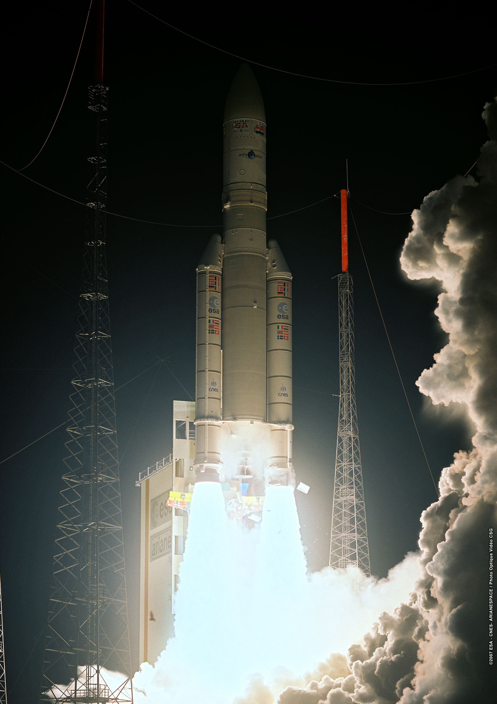
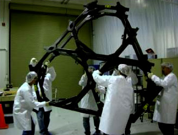
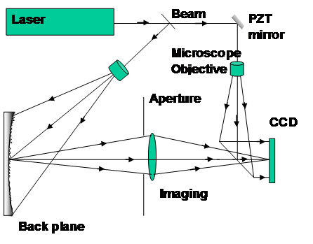
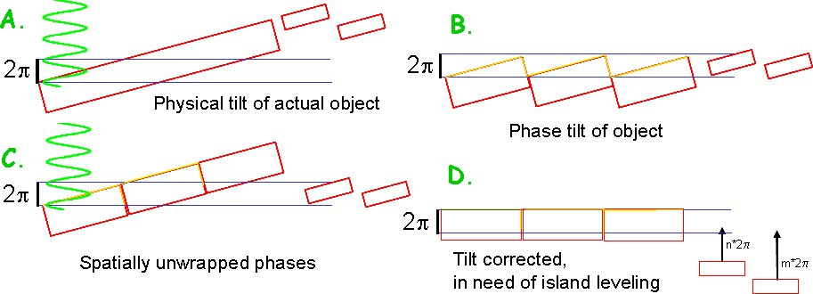
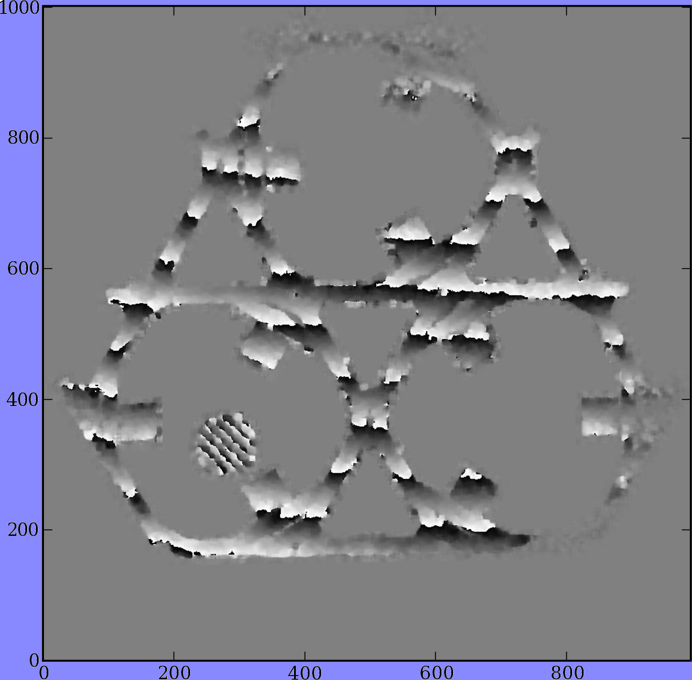
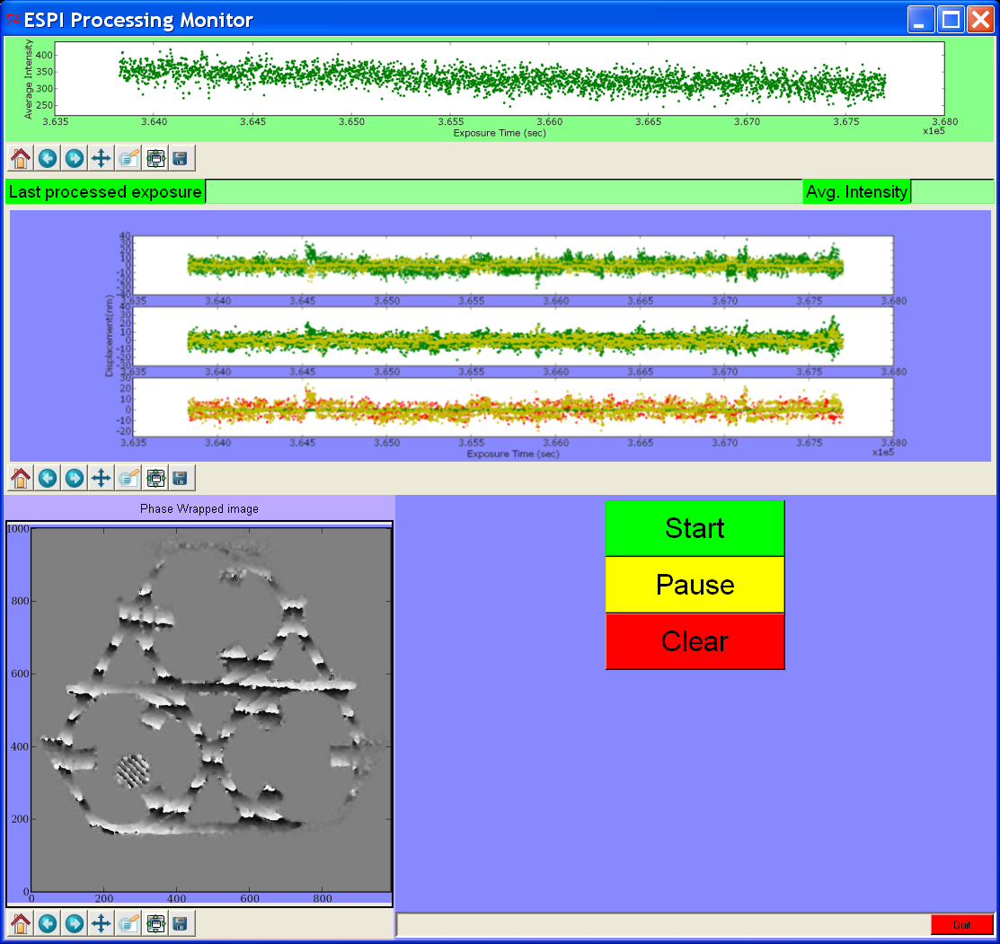
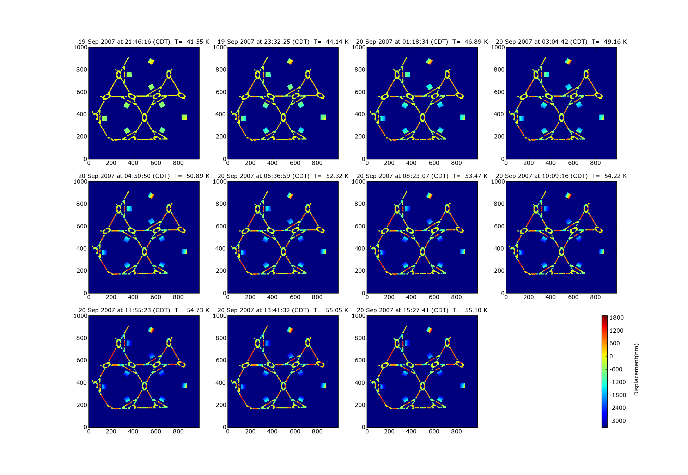

:author: Warren J. Hack
:email: hack@stsci.edu
:institution: Space Telescope Science Institute

:author: Perry Greenfield
:email: perry@stsci.edu
:institution: Space Telescope Science Institute

:author: Babak Saif
:email: saif@stsci.edu
:institution: Space Telescope Science Institute

:author: Bente Eegholm
:email: bente.h.eegholm@nasa.gov
:institution: Space Telescope Science Institute

------------------------------------------------
Using Python with Smoke and JWST Mirrors
------------------------------------------------

.. class:: abstract

    We will describe how the Space Telescope Science Institute is
    using Python in support of the next large space telescope, the James Webb
    Space Telescope (JWST). We will briefly describe the 6.5 meter
    segmented-mirror infra-red telescope, currently planned for a
    2014 launch, and its science goals.  Our experience with Python
    has already been employed to study the variation of the mirror
    and instrument support structures during cyrogenic cool-down from
    ambient temperatures to 30 Kelvin with accuracies better than
    10 nanometers using a speckle interferometer. Python was used to
    monitor, process (initially in near real-time) and analyze over 15
    TB of data collected. We are currently planning a metrology test
    that will collect 10 TB of data in 7 minutes. 
    We will discuss the advantages of using
    Python for each of these projects.

.. class:: keywords

    astronomy, telescope, NASA, measure, real-time, big data

Introduction
------------

  An Ariane 5 launch similar to the launcher that will be used to 
  place JWST into orbit about the L2 point, the orbital position 
  that keeps the Sun behind the Earth all the time as viewed from JWST. 
  Photo: ESA.

The James Webb Space Telescope (JWST) will be NASA's next Great
Observatory.  It will be an infrared-optimized telescope with a
6.5m primary mirror made up of 18-separate segments 
which will be launched no sooner than 2015
by an Ariane 5 into an orbit at the second Langragian (L2) point. 
This orbital position, about 1.5 million km
from the Earth, keeps the Sun behind the Earth at all times making it easier 
to shield the telescope and keep it cool.  
The Hubble Space Telescope (HST), by comparison,
is a telescope in a 570km high orbit with a solid 2.4m primary mirror
optimized for UV and optical observations.   A lot of effort will go
into building and testing JWST, as it did with HST, to get it to work 
as desired and as reliably as possible once launched. However, unlike HST, 
there will not be any possibility of performing a repair mission.  
The primary structure of JWST will be made of
carbon-fiber composites in order to be lightweight enough for launch
while still providing the necessary strength and rigidity to support
such a large set of mirrors and instrument packages. The primary mirror itself 
will be composed of 18 separate hexagonal segments. 
These segments will be mounted 
onto a backplane with actuators that will allow the segments
to be aligned to match one common optical surface that represents 
a single mirror with a diameter of 6.5m.

  Engineers move the Backplane Stability Test Article (BSTA) into position for the thermal vacuum test. This test piece represents a section of the backplane that will support only 3 of the 18 mirror segments of the primary mirror for JWST.

A test article, the Backplane Stability Test Article (BSTA),
was manufactured using the same materials, techniques, and design
principles being developed for constructing the entire telescope.
Extensive thermal-vacuum chamber testing was conducted on the BSTA to
verify that it will meet the stringent requirements necessary for JWST
to work; specifically, that it will remain stable to within 38nm over
the orbital operational temperature range of 30-60K.  These tests
required the development of specialized software to collect and
process all the necessary data. Such software was written in Python
and is described in the following sections.

Testing the BSTA
----------------

NASA required a test that demonstrated the stability of this
engineering article and which verified that the design and
construction techniques will work to meet the requirements of the
telescope: namely, that it will remain stable to within 68nm from
30-50K (-405 to -370 :math:`^{\circ}\mathrm{F}`).  They also wished to track the
structural changes from ambient (~295K) to cryogenic temperatures
(~30K) in order to better understand the accuracy of their structural
models.  The primary test equipment, a special interferometer,
did have software to take measurements, but that software was not
suited for the needs of this test. This required the development of specialized
software to support the test.

Normal interferometry is used with optical elements where the  
reflected or transmitted laser signal remains spatially coherent over  
large areas. Speckle interferometry is intended to be used with non- 
optical surfaces, that is, surfaces that are optically rough on very  
small spatial scales. When illuminated by a laser, such surfaces  
typically show "speckles" that result from random points where the   
reflections from the surface are relatively coherent (as compared to  
the darker areas where the reflections mostly cancel out through  
interference). While the phase of speckles varies randomly from one spot on the article to the next, and thus cannot be used for any spatial comparison from  
a single image, how the phase for a specific speckle changes, does  
indicate how the surface is moving relative to the laser; in this way  
speckle interferometers can be used to determine how surfaces are  
changing in time. The BSTA, although intended to hold JWST mirror  
segments, has no optical surfaces of its own. In order to understand  
how the structure changed with temperature it was necessary to use 
the Electronic Speckle Pattern Interferometer (ESPI).
  
The ESPI laser illuminates the surface of the BSTA,
then recombines the reflected signal with a reference beam split from the same
laser pulse, to create an interferometric map of the surface speckles.
As the structure moves, the speckles change phase reflecting the
change in interference between the incident and reference laser pulses.
However, those phases cycle from :math:`-\pi` to :math:`\pi` and back
as the surface continues to move. This required the use of phase
unwrapping across the surface, spatial phase unwrapping, using an
algorithm developed by the manufacturers of the ESPI.

  Schematic of ESPI showing how the ESPI measures the change in the object due to thermal or mechanical stress by tracking the speckles' phase change on the surface.

As the surface tilted during the test, it produced fringes where
the phases across the structure would transition from :math:`\pi`
to :math:`-\pi`. This tilt needed to be removed in order to allow
us to measure the relative changes from one region of the structure
to another.

  Schematic showing how bulk tilt introduces multiple :math:`2\pi` 
  variations across the structure and how it gets corrected in processing,
  allowing for relative variations to be measured across the surface as 
  described in "Testing the BSTA".
  

Since the measured phase is ambiguous by multiples of :math:`2\pi`,
special techniques are required to remove these ambiguities. One is
to presume that continuous surfaces have continuous phase, and any
discontinuities on continuous surfaces are due to phase wrapping. Thus
such discontinuities can be "unwrapped" to produce spatially continuous
phase variations. Another presumption is that even though the general
position and tilt of the entire structure may change greatly from one
exposure to another, the relative phase shape of the structure will
not change rapidly in time once bulk tilt and displacement are removed.

The following figures show the consequent phase wraps when a surface
has any significant tilt. One can perform spatial phase unwrapping
on spatially contiguous sections. Gross tilts are fit to the largest
contiguous sections, and then the average tilt is removed (as well
as the average displacement). However, there are areas of interest
(the mirror pad supports) which are discontiguous and as a result
possibly several factors of :math:`2\pi` offset in reality as a result of the
tilt, and thus improperly corrected when tilts are removed. Since
these areas are assumed to change slowly in time, temporal phase
unwrapping is applied to these areas.

  A sample ESPI image illustrating the fringes that build up due to bulk tilts.  These fringes get "unwrapped" to produce spatially contiguous phase variations across the surface of the object.

The entire ESPI system, hardware and software, was built by 4D
Technologies under the guidance of one of our team members, Babak.
The commercial software from 4D Technologies that came with the  ESPI
hardware had algorithms for performing the spatial unwrapping using
a GUI interface for interactive operation.  This interface, though,
was unable to support the needs of the test; namely, that it would
need to continuously take 5 images/second for 24 hours/day for up
to 6 weeks at a time. Thus, we needed to write our own specialized
software to support the test.

Python to the Rescue
--------------------

Many of the requirements for any software that needed to be written
were unknowable, not just unknown, for a number of reasons. No test
had ever been conducted like this before, so there was no experience
to draw upon to foresee what problems may arise during the test. Concerns
ranged from whether the laser output could be maintained at a stable
level over such a long period of time given that the output was 
dependent on the ambient temperature
of the test facility.  This drove the requirement to monitor in 
near-real-time the laser intensity as measured from the observations 
themselves. These results were compared with occasional checks of 
the laser output using burn paper in the laser path, creating a bit 
of smoke in the process, to insure that the monitoring was accurately
tracking the health of the laser.

We also had no certainty about what phase-unwrapping algorithms were going
to work until the test actually started. Test conditions such as 
residual vibrations in the test rig could seriously impact our ability
to measure the surface changes we were after and potentially require
changes to how the phase-unwrapping algorithms needed to be applied.
It was only after the test started that these effects would be known, 
requiring the ability to update the data acquisition and processing
code on the fly to accommodate the quality of the test data.

Finally, the code had to be easily adaptable and capable of handling 
massive amounts of data in as close to real time as possible! 
Python offered the best possible choice for addressing these 
challenges in supporting
this test.  It allowed us to develop code rapidly to adjust for the
test conditions during the test with minimal impact.  The plotting and
array-handling libraries, specifically matplotlib and numpy, 
proved robust and fast enough to keep up
with the near-real-time operations. The commercial software that
came with ESPI hardware had also been written in Python and C, so
Python allowed us to interface to that code to run our own custom
processing code using the commercial algorithms for data acquisition
and phase-unwrapping.

Our data acquisition system used custom code to automate the operation
of the commercial software used to interface with the ESPI camera. This
module was run under the commercial software's own Python environment
in order to most easily access their camera's API and stored the
images in real time on a storage server. The remainder of the
processing required the use of the Python API to the commercial
software's functions to perform the phase unwrapping. As a result
of this extended processing, the remainder of the code could only
process and monitor the results of every 5th image taken during the
test. This monitoring was performed using a custom Tkinter GUI which
provided plots of a couple of key processing results, and an image
display of the latest processed image, all using matplotlib.

  This snapshot of the ESPI Monitoring GUI in operation illustrates the near-real-time monitoring plots and image display used to track the health of the laser and quality of the data and subsequent processing.

This data processing pipeline was set up using 4 PCs and a 15Tb storage
server. A separate PC was dedicated to each of the processing steps;
namely, data acquisition, initial phase unwrapping, measuring of
regions, and monitoring of the processing.  This distributed system
was required in order to support the data acquisition rate for the
test: 5 1004x996 pixel images per second for 24 hours a day for 6
uninterrupted weeks.   A total of approximately 11Tb of raw data
was eventually acquired during the test. These raw observations were later
reprocessed several times using the original set of 4 PCs from the
test as well as additional PCs all running simultaneously to refine
the results in much less than real time using all the lessons learned
while the test was in progress. This reprocessing effort represented the 
simplest possible case of parallel processing, where separate sets of data
could be processed independently on separate systems. No other use of 
parallel processing techniques was implemented for the test or 
subsequent reprocessing.

Results
-------

BSTA data analysis measured the slope of the data, expansion due to temperature, with an RMS of 25.2nm/K,
well within the 36.8nm/K requirement for meeting NASA's goals. These
measurements were based on calibrations which had RMS values less
than 5 nm around the measured slope.

  Mosaic of sample processed measurements of the BSTA as the temperature changed from 40K to 60K, matching the operational temperature range of JWST. This mosaic illustrates how the structure was measured to change as the temperature changed.

Python allowed for rapid development of a near-real-time processing
pipeline spread across multiple systems which we were able to
revise quickly as needed during the test.  The fact that the commercial software
was written using Python also allowed us to interface with it
to use their C-based algorithms for data acquisition
and phase-unwrapping.  Equally importantly, we were able to implement
changes in the processing algorithms while the test was underway to
address aspects of the data quality that were not expected when the
test began. This software, though, can not be distributed as it was
designed explicitly to support the JWST tests alone.  The success of
this test, though, resulted in establishing the ESPI as a resource
for later tests, and this software will be used as the framework for
supporting additional tests of JWST in the coming years.

Future Tests
------------

The development of the software for the ESPI tests validated its utility
to measure the shape of structures to nanometer accuracies.  Additional
testing of the actual structure built for use in supporting all 18 segments 
of the primary mirror for JWST will require this level of accuracy, albeit
under very different testing conditions.  A new test to map the actual 
positions and orientations of each of the mirror segments will use an 
upgraded version of the ESPI to monitor the mirror segments after they 
have been mounted on the backplane of the telescope.  This test will 
validate that the actuators controlling the position of each mirror segment
can be controlled sufficiently to align all the segments to 
create a single optical surface.  

This test will require adjusting the mirror positions, then taking up to a
thousand images a second for a short period of time to verify the newly 
updated positions. Such a test can easily generate 10Tb of 
imaging data in only 7 minutes.  The Python software we developed for 
previous ESPI tests will be used as the basis for the data acquisition and
data processing systems for this new test, including synthesizing data from
additional measuring devices.  The only way to keep up with
this test will be to use multiple systems processing data in parallel to 
process the data quickly enough to allow the test to proceed as needed, much
as we did with the reprocessing of the original ESPI data.  In short, Python's 
rapid development capabilities, fast array handling, and ability to run the same
code on multiple systems in parallel will be critical to the success of 
this new test.
