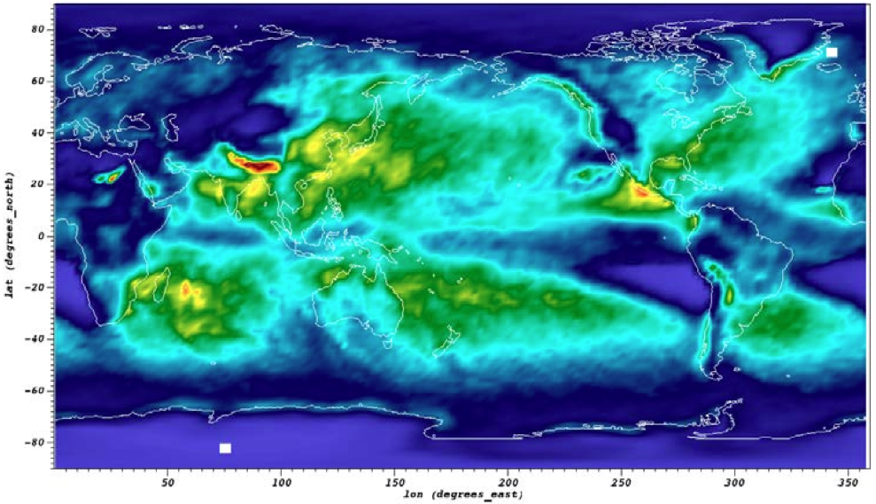
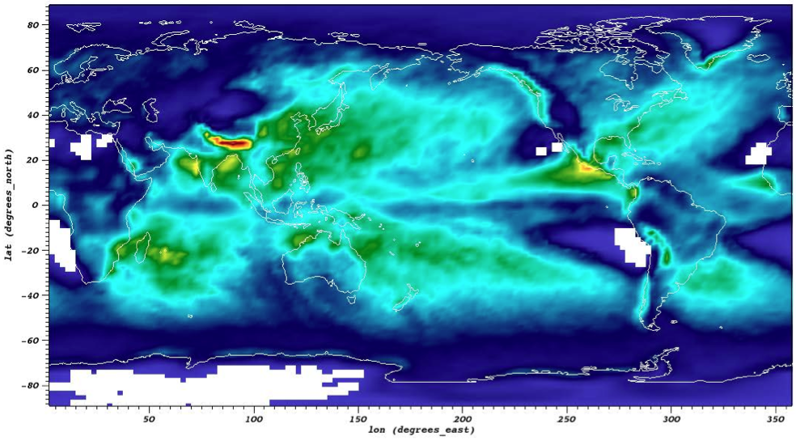

:author: Hari Krishnan
:email: hkrishnan@lbl.gov
:institution: Lawrence Berkeley National Laboratory

:author: Cyrus Harrison
:email: cyrush@llnl.gov
:institution: Lawrence Livermore National Laboratory

:author: Brad Whitlock
:email: whitlock2@llnl.gov
:institution: Lawrence Livermore National Laboratory

:author: David Pugmire
:email: pugmire@ornl.gov
:institution: Oak Ridge National Laboratory

:author: Hank Childs
:email: hchilds@lbl.gov
:institution: Lawrence Berkeley National Laboratory/The University of Oregon

---------------------------------------------------------------------------
Exploring Collaborative HPC Visualization Workflows using VisIt and Python
---------------------------------------------------------------------------

.. class:: abstract
    As High Performance Computing (HPC) environments expand to address 
    the larger computational needs of massive simulations and specialized 
    data analysis and visualization routines, the complexity of these 
    environments brings many challenges for scientists hoping to capture 
    and publish their work in a reproducible manner. Collaboration using 
    HPC resources is a particularly difficult aspect of the research 
    process to capture. This is also the case for HPC visualization, 
    even though there has been an explosion of technologies and tools 
    for sharing in other contexts.

    Practitioners aiming for reproducibility would benefit from collaboration 
    tools in this space that support the ability to automatically capture 
    multi-user collaborative interactions.  For this work, we modified VisIt, 
    an open source scientific visualization platform, to provide an 
    environment aimed at addressing these shortcomings.  This short paper 
    focuses on two exploratory features added to VisIt:

    1. We enhanced VisIt's infrastructure expose a JSON API to clients over 
    WebSockets.  The new JSON API enables VisIt clients on web-based and 
    mobile platforms.  This API also enables multi-user collaborative 
    visualization sessions.  These collaborative visualization sessions 
    can record annotated user interactions to Python scripts that can be 
    replayed to reproduce the session in the future, thus capturing not 
    only the end product but the step-by-step process used to create the 
    visualization.

    2. We have also added support for new Python \& R programmable pipelines 
    which allow users to easily execute their analysis scripts within 
    VisIt's parallel infrastructure. The goal of this new functionality 
    is to provide users familiar with of Python and R with an easier path 
    to embed their analysis within VisIt.

    Finally, to showcase how these new features enable reproducible science, we present a workflow that demonstrates a Climate Science use case.

.. class:: keywords

   python, reproducibility, collaboration, scripting

Introduction
------------

Reproducibility is one of the main principles of the scientific method.
Without reproducibility, experimental trials that confirm or deny a given
hypothesis cannot be confirmed by other scientists, potentially creating concerns
about the validity of initial results.

.. %
.. %The scientific simulation community has long strived for reproducible simulations,
.. %despite challenges stemming from variations in algorithm, implementation,
.. %external libraries, and even hardware differences, such as floating point
.. %precision.
.. 
.. %By accounting for many possible sources of difference, simulation results are
.. %usually consistent over a variety of configurations.
.. %

Visualization often plays a role in the scientific method;
when exploring data sets, scientists form 
hypotheses about phenomena in the data, 
design experiments by setting up visualization parameters, and then
carry out the experiment by applying visualization algorithms.
The resulting visualizations then confirm or deny each hypothesis.
However, since this process is regularly carried out in an ad hoc manner and
in rapid succession,
reproducibility is often a secondary concern.

.. %
.. %less of an emphasis is placed on reproducibility than with scientific simulations.
.. %

Consequently, the outputs from visualization and analysis routines often
lack the information about how they were generated, and thus how to 
interpret the results.

.. %
.. %The story is even worse from a reproducibility perspective.
.. %

In favorable circumstances, the initial scientist performing the analysis either
took notes or remembers the details of the experiment, and theoretically
would be able to reproduce it.
But following scientists regularly do not have this information.
Although they can view the resulting visualizations,
and make educated guesses about how the data was processed, 
reproducing the result is very difficult.
This is particularly true because visualization routines
have many 'knobs' that control how they execute.

Beginning approximately one decade ago, the visualization community
increased its emphasis on including provenance as part of
the visualization process.  
For example, the VisTrails system [silva2007provenance]_, an 
early provenance advocate, produced the necessary information 
to recreate everything about a given visualization.
This represented a leap forward in the problem, 
since the ad hoc and rapid nature of visualization-based
exploration could now be automatically accounted for.
However, provenance is still far from being commonplace,
and only rarely do scientists broadcast their exact steps
for creating some results.

Further, provenance is only one component of the larger problem.
Knowing the parameters that went into a visualization is important,
but these parameters are much less meaningful when the program
used to generate the results is no longer available.
This is especially problematic when "one-off" programs are generated
to create a specific visualization, a common scenario when
people are performing novel analysis.
After one-off programs generates the necessary visualizations, their
code often quickly atrophies or is lost altogether.
Finally, such programs are rarely accessible to following scientists who
recreate the experiment.

Following these observations, 
the research described in this paper depends on the following
premises:

Enduring visualization frameworks are crucial for maintaining
reproducibility.

- We also note that focusing on a single application -- as opposed to many one-offs for many problems -- allows for significantly more resources to be allocated to development, allowing the application to be maintainable, reliable, shareable, and to have important reproducibility features, i.e., provenance.

- These frameworks must provide constructs that enable novel and complex analyses.

With this research, we explored adding a flexible, Python-based infrastructure
to an existing visualization framework.

.. %a system that 
.. %provided rich constructs which could be seamlessly combined.
.. %

Our Python system is made up of rich, composable operations that enable
the development of new, novel analyses that can then be reincorporated
into the visualization framework.
This approach enables the specialized analysis typically
reserved for one-off applications to be handled within
one application, significantly increasing the
capabilities available to scientists.
In this paper,  we describe the system, as well as a use case in 
climate science.

Finally, leading-edge simulation science increasingly involves large
teams with diverse backgrounds, and these teams need to be able to
analyze data in collaborative settings.
But collaborative analysis complicates the provenance tracking that is
necessary for reproducibility.
Our system is able to perform this tracking and we describe how it functions.

Related Work
------------------

.. %IPython \& VisTrails immediately come to mind
.. %Other Collab viz? (SAGE from EVL?)
.. %we should also ref last years paper, as an overview of Python in VisIt.
.. %state what they are good at: collaboration, provenance, reproducible tools
.. %state what they are not: vis capable, scalable toolset, integrate in other non pythonized environments.
.. %Tools we provide extend Python support to embed functionality in other languages and work environments?

.. %todo{Cyrus: Rel work related to the `spectra of reprod research'}

There is growing interest in the practice of reproducible research. Open source software, virtualization, and cloud computing platforms  have enabled workflows that can be adopted by scientific peers with very low barriers to entry [res_cloud]_,[web_repro]_. Increased interest in reproducibility also is driven by notable research retractions such as Herndon, Ash and Pollin's re-analysis [herndon_debtgrowth]_ of Reinhart and Rogoff's work [gtod]_. Conclusions from the original analysis were adopted as a high profile economic policy driver, raising concerns about the potential impact of analysis errors.

The spectra of approaches to reproducible research is quite broad.  In one of the most comprehensive examples, [Brown2012]_ the authors provide a companion website to their paper where they released their analysis source code, latex paper source, their data, and a turn-key virtual machine-based workflow that allows anyone to regenerate the bulk of the analysis used for the research. In many contexts, each of these steps alone poses a significant challenge. Beyond source code sharing there are several software development environments that support presentation of a computational narrative via a notebook concept. These include IPython [ipython]_ Notebook, Sage [sage]_, Matlab, Maple, and Wolfram Mathematica.

.. %Data sharing is also a key component.  \todo{Cyrus: The Earth Systems Grid Federation as a success story}

.. %\todo{In an HPC context, challenges are amplified, slate is still blank}

There are many rich visualization frameworks that provide constructs
and interface concepts understood by users.
For this work, we decided to extend VisIt [HPV_VisIt]_, in no small
part because of its support of Python in its parallelized server [vscipy2012]_.
Other examples of such frameworks are ParaView [HPV_PV]_, FieldView [FieldView]_,
and EnSight [EnSight]_.
From the perspective of a flexible infrastructure for creating custom
analyses out of existing primitives, the most comparable work is that
of iPython [ipython]_ and VisTrails [silva2007provenance]_.  Our work

is unique in that we have melded a rich visualization framework with
a flexible infrastructure for developing new analyses, creating an
environment that offers extensibility, usability, and long-term reproducibility.

System
-------

VisIt is a richly-featured, massively-parallel data analysis and visualization application. VisIt is composed of several cooperating components, each with their own functions within the system. The main component is a central viewer which displays results and acts as a state manager coordinating the different components. Plotted results are generated by a compute server component that reads files, executes data flow networks, and sends results back to the viewer. There are also different clients, including: a graphical user interface, Python language interface, and Java language interface. The Python and Java language interfaces allow for complex analysis programs to be built on top of VisIt's infrastructure.

We extended VisIt's existing ability to support multiple simultaneous clients by adding support for Web-based clients, which typically connect on demand. The viewer is able to listen for inbound socket connections from Web clients and establish communication with them using technologies such as WebSockets. We created new proxy classes in various languages such as JavaScript to expose   functions that enable a client to control VisIt. These proxy classes enable the creation of lightweight, custom Web applications that dynamically connect to existing VisIt viewer sessions forming the core of the infrastructure needed to enable collaborative visualization across a range of devices.

.. %1. What is VisIt? How does it communicate, what does it need to run and what is the response?
.. %2. We have added infrastructure components that enable lightweight clients. The clients communicate over JSON, making it language portable. This allows VisIt to provide a collaboration environment.
.. %3. We have added scripting support within the VisIt visualization pipeline. Supports Python \& R functionality.
.. %4. Reproducibility: How can users replay and share their work environment?

JSON API
~~~~~~~~~

VisIt normally uses a binary protocol to communicate among components. We enhanced VisIt to also support communication using JavaScript Object Notation (JSON), which allows objects to be represented in an easy to use ASCII form. JSON is widely supported in browsers and Python, eliminating the need for custom client code to transmit and decode VisIt's binary protocol. Using JSON as the mechanism for exchanging objects between VisIt and Web clients enables other novel capabilities. For instance, since  JSON objects also communicate the names of fields in addition the field values, we can traverse the JSON objects to automatically create input property panels or provide automatically generated classes.

.. %VisIt handshake protocol \& how communication is handled.
.. %Providing collaboration services within this API.

Scripting API
~~~~~~~~~~~~~~

[vscipy2012]_ introduced VisIt's Python Filter Runtime, which embeds a Python interpreter into each MPI Task of VisIt's compute engine. This functionality allows users to write Python scripts that access low-level mesh data strucutres within VisIt's distributed-memory parallel pipelines. The initial Python Filter Runtime exposed two of VisIt's building blocks to Python programmers:

1. *Python Expressions*, filters which calculate derived quantities on an existing mesh.
2. *Python Queries*, filters which summarize data from an existing mesh.

Building on this infrastructure we extended the use of the Python Filter Runtime 
into the context of VisIt's Operators, which are filters that implement general data transformations. 

This functionality is implemented in a new Scripting Operator and is supported by a Python-based Scripting API. The API allows users to easily compose several Python and R data analysis scripts into a sub-pipeline within VisIt.  The goal of this new API is to provide users familiar with Python and R an easier path to embed their analysis within VisIt. 
To achieve this goal, the Scripting API attempts to shield the user from VisIt's internal filter and contract abstractions and places a focus on writing streamlined analysis routines. This is in contrast to VisIt's Python Expressions and Queries, which require user to understand these abstractions to write filters using Python. 

Scripting sub-pipelines are coordinated using a Python dataflow network module. 
Our Scripting infrastructure leverages the dataflow network's filter graph abstraction to insert additional filters which handle data transformations between VisIt's internal VTK based data model the data structures used in scripts. Python user scripts can process both  Python wrapped VTK datasets and field values as numpy arrays. The module uses Rpy2 to execute scripts written in R. In this context numpy arrays are the primary data structure interface between Python and R scripts. The module also uses a topological sort to ensure proper script execution precedence and provides reference counting and storage of intermediate results. This ensures that user scripts are executed efficiently. 

To support distributed-memory parallel algorhtims, both Python and R scripts have access to a MPI context.

.. In Python scripts MPI calls are suppored via {mpicom, or mpi4py?}. In R scripts MPI is supported via pbdMPI\cite{pbdMPI}.todo{can you run citation() on pdbMPI to get the proper bibtext}

Reproducibility
~~~~~~~~~~~~~~~~

Each of the clients connected to the VisIt viewer can send commands and state intended to drive the VisIt session. These multiple input streams are consolidated into a single input stream in the viewer that lets the different clients perform actions. As actions are performed, they can cause changes in state that need to be sent back to clients. When new state is sent back to the various clients, they are free to respond as required, depending on their function. For example, when the GUI receives new state, it updates the controls in its windows to reflect the new state from the viewer. When the Python interface receives new state, it transforms the state back into the requisite Python commands needed to cause the state change and logs the commands to a log file that can be replayed later. This same infrastructure is used to record actions taken by the GUI into corresponding Python code that can reproduce the same GUI actions. We have extended VisIt's Python recording mechanism so it annotates the generated Python code with the identity of the user who caused the command to be generated. This increases the available visualization provenance information while still producing a log file that can be replayed to restore the state of the system in a future VisIt session. We have also extended VisIt's Python interface with a new WriteScript function that can write Python code to reproduce the exact state of the visualization system. This produces Python code that is much more concise, requiring far fewer visualization operations to be performed to restore VisIt's state. We envision being able to build on this capability to produce streamlined applications that can set up their plots based on the output from the WriteScript function.

Evaluation
-----------

    Extreme precipitation analysis done on an ensemble of two CAM5.1 control runs over 1959-2007 using Generalized Extreme Value Analysis (Top), and Peaks-over-Threshold (Bottom) :label:`fig:ExtremeValues`

The collaboration we have had with climate scientists has proven to
be a rich test-bed for the exploration of this workflow. The
collaboration began with the integration of VisIt and R to do
parallel statistical analysis on very large climate data sets using
large HPC resources. Initially,
several different extreme value analysis algorithms were implemented
and incorporated into VisIt as built-in operations. As we worked with
the climate scientists, and statisticians, it became clear that a more
flexible framework where aribtrary analyses could be easily scripted
and experimented with would prove valuable.  It would also make it
easier for scientists to collaborate, verify various techniques, and
make reproducibility much more easy.

Figure :ref:`fig:ExtremeValues` shows estimated 20-year annual return
values that would occur once every 20 years on average, using
Generalized Extreme Value, and Peaks-over-Threshold, respectively. The
analyses were done on an ensemble of two CAM5.1 control runs over the
period of 1959-2007 of daily precipitation.

These analyses required a kernel to be executed at each spatial
location using precpitation values over all of the time steps. This
was supported using the API call
\textbf{ForEachLocation(user-kernel)}. The VisIt infrastructure will
parallelize the computation required to read in all of the 
time steps, and aggregate all the time values for each location. The
user supplied kernel is then executed using the vector of time-values
as input.  Another API call is made to write the analysis results out
in the desired format, in this case, NETCDF.  For both the examples
shown in Figure :ref:`fig:ExtremeValues`, the same API call was made
with different user-defined kernels.

Using this capability has several advantages. First, it makes it much
easier for domain scientists to experiment with different analysis
techniques. Large, parallel visualization frameworks are complex,
large pieces of source code, and domain scientists will rarely have
the experience to make changes to perform the analysis. This framework
allows the scientists to focus on the environment they are most
familiar with, analysis kernels written in R or Python, and leave the
details of efficient parallel processing of large scientific data to
the visualization framework developers. And second, it makes comparison
and reproducibility much easier since the required elements are just
the R or Python kernel code written by the domain scientists.
The results can be shared and verified independent of VisIt by
execution of the kernel in either Python or R environments on the
same, or additional data.

Conclusions and Future Work
----------------------------

Reproducibility is an important element of the scientific method, since it enables the
confirmation of experimental trials that confirm or deny a hypothesis, and visualization
is a common mechanism for evaluating experiments.
Hence, it is important that visualizations be carried out in a reproducible manner.
With this work, we demonstrated that it is possible to extend a richly featured
visualization framework with flexible analysis routines in a way that supports
reproducibility, and we also demonstrated how capable such a system can be.
Further, we considered the problem of collaborative analysis, which is increasingly needed as scientific teams
are more and more often made up of large teams.
Python was a key element to our success.
Since many packages already have Python interfaces, it expedited incorporation
of packages like R, and provided a familiar setting for users wanting to develop
new interfaces.

References
----------

.. [silva2007provenance] Silva, Claudio T and Freire, Juliana and Callahan, Steven P.
  *Provenance for visualizations: Reproducibility and beyond*,
  Computing in Science \& Engineering 82--89, 2007, IEEE.

.. [vscipy2012]
  Harrison, Cyrus and Krishnan, Hari. *Python's Role in VisIt*,
  Proceedings of the eleventh annual Scientific Computing with Python Conference (SciPy 2012).

.. [gtod] Reinhart, Carmen M. and Rogoff, Kenneth S. *Growth in a Time of Debt*,
    American Economic Review, 573-78, September, 2010

.. [ipython] Perez, Fernando and Granger, Brian E.,
  *{IP}ython: a {S}ystem for {I}nteractive {S}cientific {C}omputing*,
  {C}omput. {S}ci. {E}ng., 21-29 May, 2007.

.. [sage]
  {W.A. Stein and others,
  *{S}age {M}athematics {S}oftware ({V}ersion x.y.z)*

.. [repo_research_intro]
    Fomel, S. and Claerbout, J.F.
    *Guest Editors' Introduction: Reproducible Research*,
    Computing in Science Engineering 2009, pages={5-7}

.. [herndon_debtgrowth]
   Herndon, Thomas and Ash, Michael and Pollin, Robert
   *Does High Public Debt Consistently Stifle Economic Growth? A Critique of Reinhart and Rogoff*, April, 2013

.. [Brown2012]
  Brown, C Titus and Howe, Adina and Zhang, Qingpeng and Pyrkosz, Alexis B and Brom, Timothy H
  *A Reference-Free Algorithm for Computational Normalization of Shotgun Sequencing Data*, 2012

.. [web_repro]
    Pieter Van Gorp and Steffen Mazanek.
    *SHARE: a web portal for creating and sharing executable research papers*,
    Proceedings of the International Conference on Computational Science, 
    \{ICCS\} 2011 589 - 597, 2011

.. [res_cloud]
 Van Gorp, Pieter and Grefen, Paul
 *Supporting the internet-based evaluation of research software with cloud infrastructure*, Softw. Syst. Model. 11--28, Feb 2012

.. [HPV_VisIt]
  Hank Childs, Eric Brugger, Brad Whitlock, Jeremy Meredith, Sean Ahern, David Pugmire, Kathleen Biagas, Mark Miller, Cyrus Harrison, Gunther H. Weber, Hari Krishnan, Thomas Fogal, Allen Sanderson, Christoph Garth, E. Wes Bethel, David Camp,  Oliver R\"{u}bel, Marc Durant, Jean M. Favre,  and Paul Navr\'{a}til}.
  *VisIt: An End-User Tool For Visualizing and Analyzing Very Large Data*,
  High Performance Visualization---Enabling Extreme-Scale Scientific Insight, 357-372, Oct 2012

.. [HPV_PV]
  Utkarsh Ayachit, Berk Geveci, Kenneth Moreland, John Patchett, and Jim Ahrens,
  *The ParaView Visualization Application*,
  High Performance Visualization---Enabling Extreme-Scale Scientific Insight, 383-400, Oct 2012

.. [EnSight]
  *EnSight User Manual*,
  Computational Engineering International, Inc. December, 2009

.. [FieldView]
 Steve M. Legensky.  *Interactive investigation of fluid mechanics data sets*,
 VIS '90: Proceedings of the 1st conference on Visualization '90
 435--439, San Francisco, California, IEEE Computer Society Press

