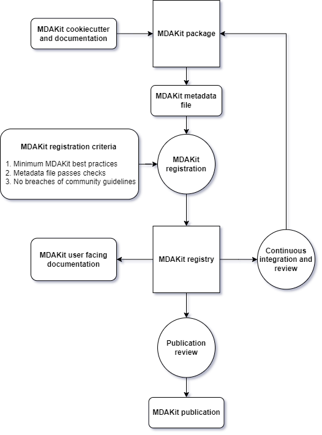
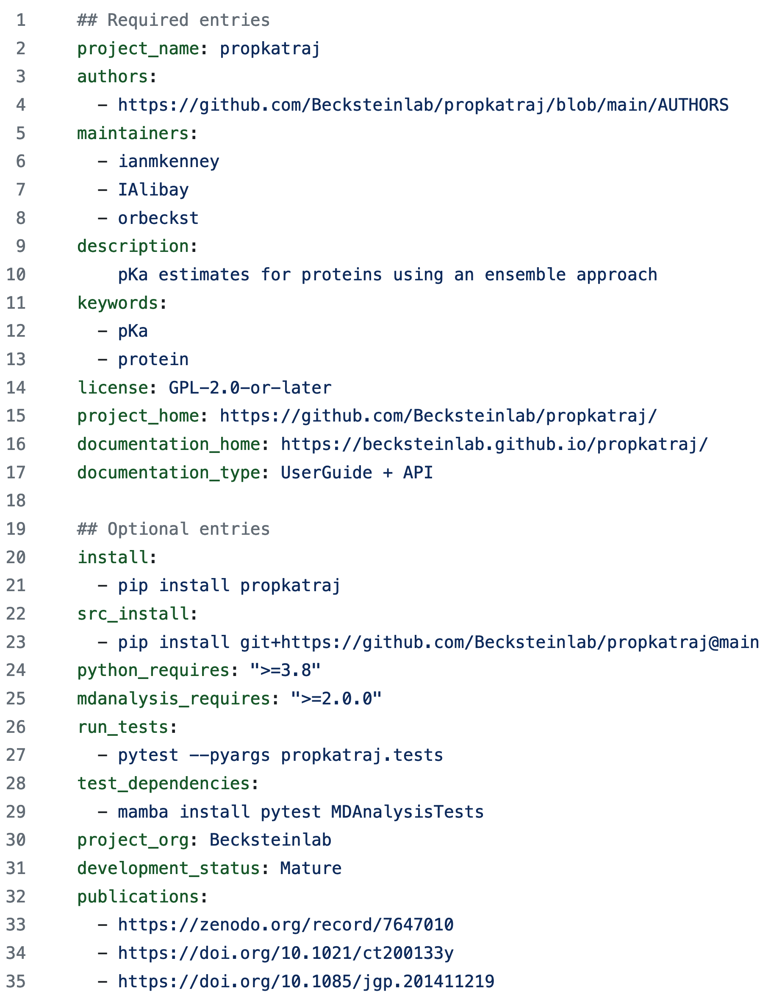
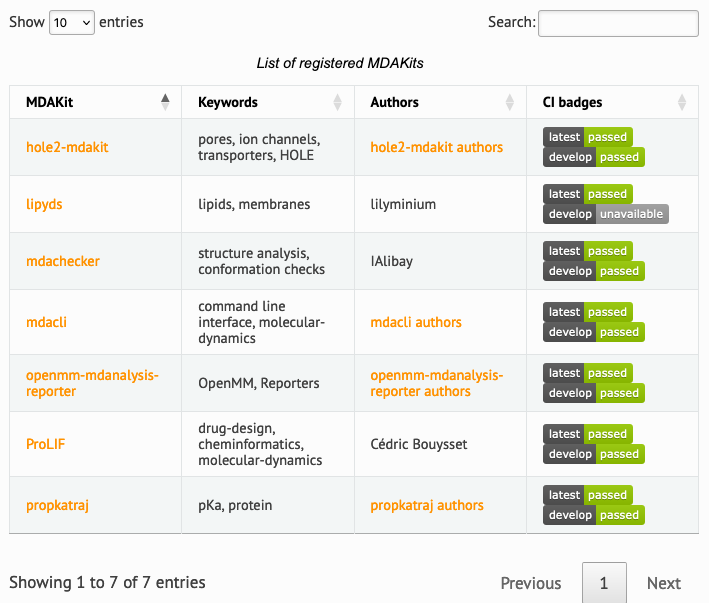

.. -*- mode: rst; mode: visual-line; fill-column: 9999; coding: utf-8 -*-

:author: Irfan Alibay
:email: IAlibay@mdanalysis.org 
:institution: Open Molecular Software Foundation, Irvine, CA, USA
:orcid: 0000-0001-5787-9130   
:equal-contributor:
:corresponding:

:author: Lily Wang
:email: lily@mdanalysis.org
:institution: Open Molecular Software Foundation, Irvine, CA, USA
:orcid: 0000-0002-6095-6704
:equal-contributor:
	
:author: Fiona Naughton
:email: fiona@mdanalysis.org
:institution: Cardiovascular Research Institute, University of California, San Francisco, San Francisco, CA, USA
:orcid: 0000-0003-0162-1346
:equal-contributor:

:author: Ian Kenney
:email: ikenney@asu.edu
:institution: Arizona State University, Tempe, AZ, USA
:orcid: 0000-0002-9749-8866
:equal-contributor:
	      
:author: Jonathan Barnoud
:email: jonathan@barnoud.net
:institution: Centro Singular de Investigación en Tecnoloxías Intelixentes, Santiago de Compostela, Spain
:orcid: 0000-0003-0343-7796
	      
:author: Richard J Gowers
:email: richard@mdanalysis.org
:institution: Open Molecular Software Foundation, Irvine, CA, USA
:orcid: 0000-0002-3241-1846
	      
:author: Oliver Beckstein
:email: obeckste@asu.edu
:institution: Arizona State University, Tempe, AZ, USA
:orcid: 0000-0003-1340-0831
	      
:bibliography: references

.. Standard reST tables do not properly build and the first header column is lost.
.. We therefore use raw LaTeX tables. However, booktabs is not automatically included
.. unless rest2latex sees a table so we have to add it here manually.
.. latex::
   :usepackage: booktabs

.. latex::
   :usepackage: xparse

.. role:: nameref(raw)
   :format: latex

.. role:: textref(raw)
   :format: latex

.. raw:: latex

   \newcommand{\DUrolenameref}[1]{\nameref{#1}}

   \newcommand \customref[2]{\hyperref[#1]{#2}}

   \NewDocumentCommand \DUroletextref { >{\SplitArgument{1}{|}}m }{%
      \customref#1%
   }

.. I need it to say \hyperref{label}{other}

.. definitions (like \newcommand)

.. |Calpha| replace:: :math:`\mathrm{C}_\alpha`

=======================================================================
 MDAKits: A Framework for FAIR-Compliant Molecular Simulation Analysis
=======================================================================

.. class:: abstract

   The reproducibility and transparency of scientific findings are widely recognized as crucial for promoting scientific progress.
   However, when it comes to scientific software, researchers face many barriers and few incentives to ensure that their software is open to the community, thoroughly tested, and easily accessible.
   To address this issue, the `MDAKits` framework has been developed, which simplifies the process of creating toolkits for the MDAnalysis simulation analysis package (https://www.mdanalysis.org/) that follow the basic principles of FAIR (findability, accessibility, interoperability, and reusability).
   The MDAKit framework provides a cookiecutter template, best practices documentation, and a continually validated registry.
   Registered kits are continually tested against the latest release and development version of the MDAnalysis library and their code health indicated with badges.
   Users can browse the registry frontend (https://mdakits.mdanalysis.org/) to find new packages, learn about associated publications, and assess the package health in order to make informed decisions about using a MDAKit in their own research.
   The criteria for registering an MDAKit (open source, version controlled, documentation, tests) are similar to the criteria required for publishing a paper in a software journal, so we encourage and support publication in, e.g., the Journal of Open Source Software, creating further academic incentive for researchers to publish code.
   Through the MDAKits framework, we aim to foster the creation of a diverse ecosystem of sustainable community-driven downstream tools for MDAnalysis and hope to provide a blueprint for a model for growing communities around other scientific packages.

.. class:: keywords

   Molecular Dynamics Simulations, Python, MDAnalysis, eco-system

Introduction
~~~~~~~~~~~~

.. _`sec-FAIR`:

Scientific code frequently fails to meet FAIR tenets, impeding scientific progress
----------------------------------------------------------------------------------

Software has become increasingly essential to research. In many areas, it underlies fundamental tasks such as generating, processing, analyzing, storing, visualizing, and communicating the key results and insights ultimately published. Despite this, software is typically not central to the publication peer review process in many scientific fields. Consequently, scientific code frequently fails to meet the basic tenets of FAIR: findability, accessibility, interoperability, and reusability :cite:`chue_hong_fair_2021,wilkinson_fair_2016`. 
With the publication of “The FAIR Guiding Principles for scientific data management and stewardship” in 2016 and the follow-up FAIR Principles for Research Software in 2022, it has become increasingly acknowledged that abiding by the principles of FAIR is crucial to promoting robust, reproducible, and efficient scientific discovery and innovation  :cite:`chue_hong_fair_2021,wilkinson_fair_2016`. We believe that extending FAIR principles to include open-source software not only significantly advances that goal, but furthermore is necessary for transparent research. Open sharing of code brings a number of substantial benefits to the scientific community. For example, scientists can accurately replicate a given methodology or re-use previous code, reducing duplication of effort and reducing the risk of implementation errors. Indeed, the molecular simulation community in particular has made a concerted effort over recent years to encourage the open sharing of scientific codes :cite:`walters_code_2020`. For example, as of July 2022, over 4700 GitHub repositories containing Python code that makes use of MDAnalysis :cite:`michaud-agrawal_mdanalysis_2011, gowers_mdanalysis_2016` have been made publicly available.

However, simply sharing code is not sufficient to fulfill FAIR guidelines. In fact, making software FAIR compliant requires significant investment and often expert knowledge on the part of the developers, especially if the code was written specifically for a particular research project. For example, the Python ecosystem is so dynamic that it is common for research code to rapidly become obsolete or unusable if a new version of a key library is released. To fulfill the Reusability tenet of FAIR alone, code should include documentation, version control, and dependency management. Ideally, it would also include unit tests, examples, and packaging. Even when code is released in reference to a publication, it often falls short of ideal FAIR standards. A short survey of publications in Scopus :cite:`noauthor_scopus_nodate` and the Journal of Open Source Software :cite:`noauthor_journal_nodate` over 2017–-2021 identified that out of a total 720 papers citing MDAnalysis :cite:`michaud-agrawal_mdanalysis_2011, gowers_mdanalysis_2016`, only 43 linked to code available on a version control platform such as GitHub, GitLab, or Bitbucket. Of these, only 18 met the requirements of best practices: they implemented unit tests, comprehensive documentation, and some means of installation.

Two major factors contribute to the lack of open-source FAIR compliant code. Firstly, code is typically written by scientists with no formal training or support in programming, for whom implementing FAIR principles can pose an intimidating and tedious barrier. Secondly, despite the substantial investment of effort and time required to implement best practices, publishing FAIR software is not typically appreciated with academic recognition or reward. Fostering a culture of open-source FAIR software requires addressing both.

.. _`sec-centralization`:

Centralized open-source packages such as MDAnalysis offer a limited solution
----------------------------------------------------------------------------

One solution is to consolidate scientific code around a small number of large, central packages. MDAnalysis :cite:`michaud-agrawal_mdanalysis_2011, gowers_mdanalysis_2016` is a widely-used open-source Python library for molecular simulation data. With over 16 years of development by more than 160 developers, MDAnalysis has refined its code base to offer a mature, robust, flexible API that offers a range of high-performance tools to extract, manipulate, and analyze data from the majority of common simulation formats. MDAnalysis tools have been used for a variety of scientific applications ranging from exploring protein-ligand interactions :cite:`alibay_ialibaymdrestraintsgenerator_2021, kokh_workflow_2020, bouysset_prolif_2021`, to understanding lipid behavior :cite:`wilson_investigating_2021, smith_lipyphilic_2021`, to assessing the behavior of novel materials :cite:`gowers_kugupukugupu_2021, loche_maicos_2022`. 

Until recently, MDAnalysis encouraged users to contribute their code back into the library to make it available to others. Notable examples of this include the waterdynamics :cite:`araya-secchi_characterization_2014` and ENCORE :cite:`tiberti_encore_2015` analysis modules. This approach of encouraging code to be contributed to a central package has also been successfully taken by packages such as cpptraj :cite:`roe_ptraj_2013` and the GROMACS tools :cite:`abraham_gromacs_2015`. It has a number of key advantages for users and the original developers:

- MDAnalysis can ensure that the code follows best practices (including documentation and tests).
- Code is promoted and made freely accessible to all MDAnalysis users.
- Maintenance, support, and potential updates are performed by the experienced MDAnalysis developer team, ensuring that the contributed code remains functional even while the other parts of the library change. The original developers can thus focus on other work.

However, the many costs of this approach can, under some conditions, result in unsustainable, untenable disadvantages:

- Ensuring that the code follows best practices often requires long review periods and strict code-style adherence, thus slowing down the availability of the new code in a released version of the package.
- The necessity of keeping the API stable between major releases precludes quick releases of breaking changes. In general, a mature package such as MDAnalysis has a slow release cycle, so new features and bug fixes can take months to become available in new releases.
- As MDAnalysis implicitly agrees to maintain any code that we release, a certain level of understanding and expertise is required from the maintainers. If the core developer team lacks expertise in a specific discipline or subdiscipline, adding new code in these areas introduces a substantial maintenance burden should the original code contributors not be available to help with maintenance. Consequently, it is impractical to include recently released or cutting-edge techniques in the core library.
- Introducing new package dependencies incurs software stack maintenance costs for many users who may not require this additional code.
- Code contributors lose complete control of their code.

The many disadvantages listed above can severely limit the usefulness of centralizing code around one monolithic package. Indeed, encountering these issues when attempting to expand the core MDAnalysis library attests that this approach is not the most suited for the MDAnalysis community.

.. _`sec-ecosystemadvantages`:

Implementing an ecosystem of downstream packages for more sustainable progress
------------------------------------------------------------------------------

We believe that a sustainable alternative solution is for communities such as MDAnalysis to encourage, educate, and foster researchers in their efforts towards developing individual software. We have developed a program of structured technical assistance to help researchers implement best practices and publish their code within a growing ecosystem of toolkits that we have called `MDAKits` (MDAnalysis Toolkits). We have also developed a platform called the "MDAKit registry" (https://mdakits.mdanalysis.org/mdakits.html) where packages that meet certain standards are advertised to the community. The MDAKit ecosystem builds on the success of other community packages such as PLUMED’s PLUMED-NEST :cite:`bonomi_promoting_2019`, AiiDA’s plugin registry :cite:`noauthor_aiida_nodate`, or the napari-hub :cite:`chan_zuckerberg_initiative_napari_nodate` of plugins for the napari image viewer :cite:`sofroniew_napari_2022`, all of which list available tools that are known to work in their respective user communities.

Our technical assistance begins with cookiecutter templates and example repositories. Here we model best practices, promote the use of helpful tools, e.g., for checking code coverage, and reduce the work required to set up processes such as continuous integration, versioned documentation, packaging and deployment. Developers can also reach out to the MDAnalysis community for feedback, technical assistance, or even make connections with new co-developers and potential users. Decoupled from MDAnalysis’s release cycle, developers are able to introduce new changes as required, keeping complete control over their code-base. Joining an MDAnalysis registry allows for frequent and streamlined communication between MDAnalysis and downstream developers, allowing developers to be efficiently forewarned about potential breaking changes.

Although establishing such an ecosystem of MDAnalysis-supported packages requires substantial investment from MDAnalysis developers, this approach is nonetheless likely to be far more sustainable than centralizing around a super-package. Offering technical assistance to individual developers in implementing best practices constitutes a large part of the effort; however, this level has thus far proven much lower than the effort associated with adding additional functionality to the core MDAnalysis library, and we believe that it will continue to remain so. Furthermore, as the ecosystem grows, we hope that an increasing portion of the community will participate in taking care of the packages and registry, and that the culture of following best practices and publishing code will gain momentum in itself. 

In part, we hope that this momentum will be driven by users and user expectations. Users of the MDAnalysis ecosystem gain huge benefit from the MDAKit registry. They are able to see new software as it gets added, rather than having to comb through literature or rely on developers advertising the code themselves. They are also able to easily verify the current development status of a package and whether it is being actively maintained and passing tests with both released and in-development versions of MDAnalysis. In the future, the registry could contain information about the health of a given codebase, such as whether it contains unit tests and sufficient documentation. Packages on the registry also come with easy-to-find instructions on how to easily install and run a given package, significantly lowering the technical barrier to use and experimentation. As the maintenance remains the burden of the package owners, unfortunately the risk remains that packages on the registry may eventually become out-of-date, which is indeed one of the major disadvantages of this approach. However, the registry significantly increases the likelihood that packages will reach users who will become sufficiently motivated to contribute or take over their maintenance and development.

In the rest of this document we outline our expectations for MDAKits in terms of best practices and how we implement their registration and continuous validation.

.. _`sec-mdakitframework`:

The MDAKit framework
~~~~~~~~~~~~~~~~~~~~

   Workflow diagram of the MDAKit framework.
   Starting from the creation of an MDAKit package, with the help of documentation and the MDAKit cookiecutter, the package then goes through the process of being added to the MDAKit registry, undergoing continuous validation and review and eventually reaching the stage of publication.
   :label:`fig:workflow`

The MDAKit framework (Fig. :ref:`fig:workflow`) is designed to be a complete workflow to help and incentivize developers to go from the initial stages of package development all the way through to the long term maintenance of a mature codebase, while adhering to best practices.

.. _`sec-maingoals`:

Main goals
----------

As such, the main goals of the proposed MDAKit framework are:

1. To help as many packages as possible implement best practices and develop user communities.
2. To ensure that members of the MDAnalysis community can easily identify new packages of interest and know to what extent they are suitable for production use.
3. To improve contacts between MDAnalysis core library developers and those developing packages using MDAnalysis.
4. To encourage participation from the community at all steps of the process.

We wish to state three main points that the framework is *not* designed for early on:

1. The MDAKit framework is not intended to restrict the packages which can participate. It is our view that all packages at any stage of their development are of value to the community. As such, we aim for framework components to be as non-blocking as possible.
2. It is not the intention of any parts of this framework to take ownership of the packages which participate within it. The original code developers retain full ownership and responsibility for their packages and may optionally participate in any part of this framework.
3. We also do not want to block future contributions to the core library. If new code in MDAKits prove particularly popular, and the MDAKit developers are amenable to contributing these back into the core library, the MDAnalysis team will work with them to integrate additional functionality into MDAnalysis itself

.. _`sec-overviewframework`:   

Overview of the framework
-------------------------

The MDAKit framework (Fig. :ref:`fig:workflow`) is a multi-step process. In the first step of the MDAKit framework, developers create an initial package which is intended to achieve a set purpose of their choice. To help with this process, MDAnalysis provides a cookiecutter template specifically for MDAKits :cite:`wang_cookiecutter_nodate`, alongside documentation on best practices and how to optimally use the MDAnalysis API. An overview of what we consider to be best practices for the contents of MDAKit packages is included in Section :nameref:`sec-definitions`. We note that at this point MDAKits are not expected to fully adhere to best practices, but should at least meet the minimum requirements defined in Section :nameref:`sec-definitions` before moving to the next step along this process.

Once a package is suitably developed, code owners are encouraged to add the details of their code to the “MDAKit registry” which advertises their package to the MDAnalysis community and offer continual validation and review tools to help with package maintenance. Section :nameref:`sec-registry` contains more information about the MDAKit registry, including the registration process (Section :nameref:`sec-registration`). Briefly, the registration process involves submitting a metadata file to the registry that contains essential information about the MDAKit, such as where the source code is provided, who the code authors are, and how to install the MDAKit. The contents of this metadata file is reviewed both by automatic code checks and the MDAnalysis developer team before being  added to the registry. We want to highlight  that this process does not include checks on scientific validity or code health. In fact, none of the processes in this framework account for the scientific validity of the MDAKits. While members of the community are free to offer help, scientific or technical validity is beyond the scope of what is feasible with the MDAnalysis registry.

Upon registration, the MDAKit is automatically advertised to the MDAnalysis community (see Section :nameref:`sec-advertising`). In the first instance this amounts to a set of auto-generated pages which will expose the details in the metadata file provided in the registration step. Additional tags and badges will also be included which reflect the current status and health of the package. Examples include:

- whether or not it is compatible with the latest versions of MDAnalysis
- what percentage of the codebase is covered by unit tests
- what type or extent of documentation is provided
- what Python versions are currently supported.

This status information is provided as part of checks done during the continual validation and review steps (see Sections :nameref:`sec-continualvalidation` and :nameref:`sec-continualreview`) of the framework. These steps involve a mix of regularly scheduled automatic (e.g., linters and unit test execution) checks and more infrequent manual (e.g., code reviews) processes. It is our intention that code health analysis will help developers maintain and improve their codes, as well as suitably warn potential users about issues they may encounter when using a given codebase.

Where possible, the framework encourages a code review process to be carried out by members of the MDAnalysis community. The aim here is to work with developers in identifying potential areas of improvements for both MDAKits and the core MDAnalysis library (see Sections :nameref:`sec-continualreview` and :nameref:`sec-feedingback`). We aim to tie this process closely to the review processes of journals such as the Journal of Open Source Software :cite:`noauthor_journal_nodate`, which would help lower the barrier towards and encourage an eventual publication (Section :nameref:`sec-publication`).

.. _`sec-definitions`:

Defining MDAKits: best practice package features
------------------------------------------------

Here we list requirements that we believe MDAKits should strive to fulfill in order to meet best practices in Python package usability and maintenance. To help with implementing these, a cookiecutter is provided which offers a template for potential MDAKits to follow :cite:`wang_cookiecutter_nodate`. We want to emphasize again that the aim of the MDAKit project is to encourage best practices whilst also minimizing barriers to sharing code where possible. Therefore, only a minimal set of requirements listed here as *required* are necessary for MDAKits to be included in the MDAKit registry. Similarly, we do not mean to enforce the label of MDAKit on any package; the process is fully optional and the code owners may choose to associate themselves with it.

All MDAKits must implement the features on the list of **required features** in order to become registered:

* Code in the package *uses MDAnalysis* (:nameref:`sec-usesmdanalysis`).
* Open source code is published under an *OSI approved license* (:nameref:`sec-opensource`).
* Code is *versioned* and provided in an *accessible version-controlled repository* (:nameref:`sec-versioning`).
* Code *authors and maintainers are clearly designated* (:nameref:`sec-authors`).
* *Documentation* is provided (:nameref:`sec-documentation`).
* *Tests and continuous integration* are present (:nameref:`sec-tests`).

The following are **highly recommended features**:

* Code is *installable as a standard package* (:nameref:`sec-packaging`).
* Information on *bug reporting, user discussions, and community guidelines* is made available (:nameref:`sec-community`).

.. _`sec-usesmdanalysis`:

Code using MDAnalysis (required)
++++++++++++++++++++++++++++++++

This is the base requirement of all MDAKits. The intent of the MDAKit framework is to support packages existing downstream from the MDAnalysis core library. MDAKits should therefore contain code using MDAnalysis components which are intended by the package authors to address the MDAKit’s given purpose.

.. _`sec-opensource`:

Open source code under an OSI approved license (required)
+++++++++++++++++++++++++++++++++++++++++++++++++++++++++

The core aim of MDAKits is to encourage the open sharing of codes to potential users within the MDAnalysis community and beyond. To achieve this, we require that codes under this framework be released as open source. Here we define open source as being under an Open Source Initiative (OSI) approved license :cite:`open_source_initiative_licenses_nodate`.

As of writing, the MDAnalysis library is currently licensed under GPLv2+ :cite:`noauthor_gnu_nodate`. Due to limitations with this license type, we cannot currently recommend other licenses than GPLv2+ for codes importing MDAnalysis. However, we hope to relicense to a less restrictive license. In this event, MDAKits will be able to adopt a wider range of OSI approved licenses.

.. _`sec-versioning`:

Versioning and provision under an accessible version-controlled repository (required)
+++++++++++++++++++++++++++++++++++++++++++++++++++++++++++++++++++++++++++++++++++++

The ability to clearly identify changes in a codebase is crucial to enabling reproducible science. By referencing a specific release version, it is possible to trace back any bug fixes or major changes which could lead to a difference in results obtained with a later version of the same codebase. Whilst we encourage the use of Semantic Versioning ("semver") :cite:`preston-werner_semantic_nodate`, any PEP440 :cite:`noauthor_pep_nodate-1` compliant versioning specification, would be suitable for MDAKits.

Beyond versioning releases, it is also crucial to be able to develop code in a sustainable and collaborative manner. The most popular way of achieving this is through the use of version control through Git :cite:`noauthor_git_nodate`. We require all MDAKits to be held in a publicly facing version controlled repository such as GitHub :cite:`github_inc_github_2022`, GitLab :cite:`gitlab_inc_gitlab_2022`, or Bitbucket :cite:`atlassian_bitbucket_2022`.

.. _`sec-authors`:

Designated code authors and maintainers (required)
++++++++++++++++++++++++++++++++++++++++++++++++++

In order for users to be able to contact the code owners and maintainers, all MDAKits should clearly list their authors and a means of contacting the persons responsible for maintaining the codebase. To incentivize and recognize contributors throughout the life of a project, we recommend the use of a version controlled “authors” file which lists the authors to a codebase over time.

.. _`sec-documentation`:

Documentation (required)
++++++++++++++++++++++++

Describing what a given code does and how to use it is a key component of open sharing. Ideally a package would include a complete description of the entire codebase, including both API documentation and some kind of user guide with worked examples on how the code could be used in certain scenarios. Whilst this is recommended as best practices for an MDAKit, we recognize that this is not  always feasible, especially in the early stages of development. Therefore, the minimum requirement for MDAKits is to have a readme file which details the key aspects of the MDAKit, such as what it is intended to do, how to install it, and a basic usage example.

For best practices, we strongly recommend using docstrings (see PEP 257 :cite:`noauthor_pep_nodate`) to document code components and using a tool such as ReadTheDocs :cite:`read_the_docs_inc_read_2022` to build, version and host documentation in a user-friendly manner. We also recommend using duecredit :cite:`halchenko_duecreditduecredit_2021` to provide the correct attributions to a given method if it has been published previously.

.. _`sec-tests`:

Tests and continuous integration (required)
+++++++++++++++++++++++++++++++++++++++++++

Testing is a critical component to ensure that code behaves as intended. Not only does it prevent erroneous coding, but it also assures users that the code they rely on is working as intended. We require at least a single regression test for major functionality to qualify for the registry (i.e. if a toolkit implements a new analysis method, at least one test that checks to see if the analysis code yields the expected value on provided data;  regression tests can often double as example documentation).

Ideally one should do full unit testing of the contents of a code, ensuring that not only a specific outcome is reached, but also that each smaller component works. As part of best practices, we highly recommend implementing tests using a framework such as pytest :cite:`krekel_pytest-devpytest_2004` for executing tests and codecov :cite:`codecov_llc_codecov_2022` to capture which lines are covered by the tests. We strongly encourage that a minimum of at least 80\% of the code lines be covered by tests. 

To ensure that tests are run regularly, the recommended best practice is to implement a continuous integration pipeline that performs the tests every time new code is introduced. We encourage the use of free pipelines such as GitHub Actions :cite:`github_inc_github_2022-2` to implement continuous integration.

.. _`sec-packaging`:

Packaging
+++++++++

Providing a standard means of installing code as a package is important to ensure that other code can correctly link to (i.e., ``import`` in the case of Python) and use its contents. Whilst it can be easy to expect users to simply read a Python script, look at its required dependencies, and install them manually, this can quickly become unreasonable should the code grow beyond a single file. Additionally, the lack of clearly defined versions, including the intended Python versions, can lead to inoperable code.

As best practices we heavily encourage the use of setuptools :cite:`noauthor_pypasetuptools_2022` or an alternative such as poetry :cite:`noauthor_poetry_nodate` for package installation. We also encourage that packages be available on common package repositories such as PyPi :cite:`noauthor_pypi_nodate` and conda-forge :cite:`conda-forge_community_conda-forge_2015`. The use of such repositories and their respective package managers can significantly lower the barrier to installing a package, enabling new users to rapidly get started using it.

.. _`sec-community`:

Bug reporting, user discussions, and community guidelines
+++++++++++++++++++++++++++++++++++++++++++++++++++++++++

To help maintain and grow the project, it is important to specify where users can raise any issues they might have about the project or simply ask questions about its operation. To achieve this, we recommend at the very least adding documentation that points users to an issue tracker.

Key to successfully building a user community is ensuring that there are proper guidelines in place for how users will interact with a project :cite:`grossfield_how_2021`. As best practices we recommend making a code of conduct available that defines how users should interact with developers and each other within a project. It is also advised to provide information on how users can contribute to the project as part of its documentation.

.. _`sec-registry`:

The MDAKit registry
~~~~~~~~~~~~~~~~~~~

As defined in Section :nameref:`sec-mdakitframework`, once MDAKits are created, we encourage that they be added to the MDAKit registry. The registry not only provides a platform to advertise MDAKits to the MDAnalysis user community at the web page https://mdakits.mdanalysis.org/, but also offers tools and workflows to help packages improve and continue to be maintained. Here we describe the various processes that occur within the registry. We note that we expect the exact details of how these processes are implemented to evolve over time based on feedback from MDAKit developers and other members of the MDAnalysis community.

.. _`sec-registrycontents`:

MDAKit registry contents
------------------------

The main aim of the registry is to hold information about MDAKits. The contents of the registry therefore center around a list of packages and the metadata associated with each MDAKit. This metadata s the form of two files: one containing user-provided information on the package contents (see Section :nameref:`sec-registration`), and the other a set of mostly auto-generated details indicating the code health of the package (see Section :nameref:`sec-advertising`). 

This metadata is used for two purposes: continuous integration testing and documentation. Continuous testing, helper methods and workflows are used to regularly install MDAKits and run their test suite (if available) to check if they still work as intended. Should the tests fail, package maintainers will be automatically contacted and failure information will be recorded in the code health metadata to inform users. For the registry documentation, the metadata is used to provide user-facing information about the various MDAKits in the registry, their contents, how to install them, and their current status as highlighted by continuous integration tests. The registry will also include further information and user guides on the MDAKit framework, helping developers implement the contents of this whitepaper.

.. _`sec-registration`:

Registering MDAKits
-------------------

A key feature of the MDAKit framework is the process of adding MDAKits to the registry. As previously defined, our intent is to offer a low barrier to entry and have packages be registered early in their development cycles. This allows developers to benefit from the MDAKit registry validation and review processes early on, hopefully lowering the barrier to further improvements and encouraging early user interactions and feedback.
 
From an MDAKit developer standpoint, the registration process involves opening a pull request against the MDAKit registry adding a new YAML file with metadata about the project. The metadata, as detailed in Fig. :ref:`fig:metadatapropkatraj`, contains information such as the MDAKit description, source code location, install instructions, how to run tests, and where to find usage documentation. Complete details about the metadata file specification will be provided in the MDAKit registry documentation.

   YAML metadata file for an MDAKit entry of the propkatraj package, stored as ``mdakits/propkatraj/metadata.yaml`` in the registry repository.
   :label:`fig:metadatapropkatraj`

After a pull request is opened, the MDAnalysis developers review the contents of the submission based on the following criteria:

1. If the required features for MDAKits are met (Section :nameref:`sec-definitions`), that is:
   
   1. Does the MDAKit contain code using MDAnalysis?
   2. Is the MDAKit license appropriate?
   3. Is the MDAKit code offered through a suitable version-controlled platform?
   4. Are the MDAKit authors and maintainers clearly designated in the metadata file?
   5. Is there at least minimal documentation in place detailing the MDAKit and its functionality?
   6. Are there at least minimal regression tests available within the MDAKit code?

2. If the metadata file passes linting and integration checks
3. That there are no potential breaches of community guidelines
   
Once the criteria are fulfilled the metadata is merged and the MDAKit is considered registered. Updates to the MDAKit metadata can be carried out at any time after registration by opening pull requests to change the metadata file contents.

.. _`sec-advertising`:

Advertising MDAKits
-------------------

Registered MDAKits are automatically added to the registry’s public facing documentation at https://mdakits.mdanalysis.org/mdakits.html. This involves an indexable list of entries for all registered MDAKits. Each entry displays available information from the provided metadata, e.g., what the MDAKit does, any relevant keywords, how to obtain the source code, how to install the package, and where to find relevant documentation. Alongside this information is also a set of badges which describe the current health of the codebase, allowing users to rapidly identify which packages are currently active, and their level of code maturity. This includes information such as which MDAnalysis library versions the package is compatible with. We further plan to add more infromation, such as how much test coverage the package has, what type of MDAnalysis API extensions are provided (e.g., using base classes such as AnalysisBase or ReaderBase), and whether integration tests are currently failing.

Information about MDAKits is continually updated, either through automatic checks or manual additions provided by package owners updating the metadata files. As we aim for the MDAKit registry to be immutable (aside from special cases covered by Section :nameref:`sec-removal`), should an MDAKit stop being maintained, it will not be removed from the index but instead labeled as abandoned.

.. _`sec-continualvalidation`:

Continual validation
--------------------

The MDAKit registry implements workflows to validate the code health of registered packages. This mostly centers around a test matrix that regularly runs to check if the latest MDAKit release can be installed and if unit tests pass with both the latest release of MDAnalysis and the development version. Should tests fail regularly, an issue will be automatically raised on the MDAKit registry issue tracker contacting the package maintainers and letting them know of the failure. The auto-generated code health metadata for the MDAKit will also be updated to reflect whether or not the tests are currently failing or passing.

In the future we hope to expand these tests to include more historical releases of the MDAKits and the MDAnalysis library, checks for different architectures (non-x86), and operating systems. We may also expand the checks to consider the cross-compatibility of MDAKits with each other, offering insights on which packages can be safely used together.

.. _`sec-continualreview`:

Continual review
----------------

To help package growth and improvements, it is our goal for the registry to become a platform that allows members of the MDAnalysis community to offer feedback on MDAKits over the lifetime of their inclusion on the registry. Unfortunately, as MDAnalysis developers can only devote limited time towards the registry, offering regularly scheduled comprehensive reviews of packages is too large an undertaking to be practical.

Instead, we aim to use a system of badges and achievements to push packages towards gradual improvements. For example, we may offer an achievement that encourages MDAKits to use high performance PBC-aware distance routines defined in `MDAnalysis.lib.distances` instead of relying on NumPy’s `linalg` method to find the distance between two points. Once MDAKit owners believe that they have suitably updated their code to match this, they can open a pull request highlighting these changes and have developers review these smaller, more focused updates.

MDAKit users will also be encouraged to provide feedback, request improvements, and report bug fixes. However, this should happen outside the scope of the registry; instead, we will ask for users to use the MDAKit’s own issue tracker for these.

.. _`sec-feedingback`:

Feeding back into the MDAnalysis library
----------------------------------------

The existence of the MDAKits framework does not preclude the addition of new codes and methods to the core MDAnalysis library. The MDAKit registry, and especially the ongoing review process, provides a platform for MDAnalysis and MDAKit developers to interact and work together to identify common goals and areas of improvements for both upstream and downstream packages. In particular, MDAnalysis developers will work with MDAKit developers to see if any popular MDAKit methods, components or other means to improve core method performance and lower the barrier to downstream package development can and should be implemented back into the core MDAnalysis library.

.. _`sec-publication`:

Towards publication
-------------------

We have laid out a number of best practices here that we encourage MDAKits to fulfill. These essentially amount to the majority of the contribution criteria for submissions to software-focused journals such as the Journal Open Source Software (JOSS) :cite:`noauthor_journal_nodate`. In order to incentivize developers, we heavily encourage MDAKits to consider submission to a journal such as JOSS :cite:`noauthor_journal_nodate` once they meet the required levels of best practices. To aid in this process, the MDAnalysis developers will in the first instance work with journal editors at JOSS to create a streamlined process to submit MDAKits as JOSS entries :cite:`noauthor_submitting_2018`. The details of this process are still under development.

.. _`sec-removal`:

Raising issues, concerns, and paths to registry removal
-------------------------------------------------------

If community members (users, developers or otherwise) have concerns about an MDAKit, we primarily encourage them to raise issues on the MDAKit’s issue tracker. However, in situations where the MDAKit maintainers cannot respond, or if the concern relates to code of conduct breaches, MDAnalysis developers may step in. If an MDAKit has systemic issues with its correctness, the MDAKit may be given special annotations warning users about the issues before using the code. We generally view the MDAKit registry as a permanent record, and avoid removing packages after registration even if they become fully obsolete. However, we reserve the right to remove packages at our discretion in specific cases, notably code of conduct breaches and violation of the GitHub terms of service :cite:`github_inc_github_2022-1`.

.. _`sec-maintenance`:

Long term registry maintenance and support
------------------------------------------

As with most MDAnalysis projects, long-term support for the MDAKit framework and especially the registry is expected to be carried out by contributors from the MDAnalysis community. Members of the MDAnalysis core development team lead the maintenance of the registry and are also responsible for passing judgment on serious events such as code of conduct breaches. In the long term, we hope that any gains in popularity of the MDAKits framework are accompanied by an increase in community involvement in reviews and other maintenance tasks.

Examples of MDAKits
~~~~~~~~~~~~~~~~~~~

The web frontend of the registry (Fig. :ref:`fig:registryfrontend`) provides a searchable database of packages.
At the moment, seven MDAKits are registered that already showcase the breadth of specialized tools for the analysis of biomolecular simulations.
For example, *mdacli* provides a commandline interface to analysis tools in MDAnalysis itself. *openmm-mdanalysis-reporter* enhances the interoperability with the popular OpenMM MD engine. *hole2-mdakit* interfaces with the legacy HOLE2 program for the analysis of pores and tunnels in proteins such as ion channels :cite:`smart_hole_1996, stelzl_flexible_2014`. The *lipyds* package provides a suite of tools for the analysis of biological membranes in simulations :cite:`wilson_investigating_2021`. *ProLIF* quantitatively analyzes the interactions between small molecules such as drugs and biomolecules (protein, nucleic acids) :cite:`bouysset_prolif_2021`.

   Web front end of the searchable MDAKit registry with registered MDAKits. Badges indicate code health based on continuous validation against the latest release and development version of the MDAnalysis library.
   :label:`fig:registryfrontend`

.. _`sec-conclusions`:

Conclusions
~~~~~~~~~~~

In this document we outline our plans to implement an MDAnalysis framework, termed MDAKits, to assist and incentivize the creation of FAIR-compliant packages that use and extend MDAnalysis. We describe the current state of scientific code, which is typically published either in independent repositories of varying quality, or as additions to a large, monolithic package. We summarize the limitations of each approach that result in code that falls short of FAIR principles, or may end up impractical to sustain as a long-term strategy. We propose the MDAKits framework as an alternative solution to support developers in creating new packages, guiding them through the process of achieving best practices and FAIR compliance.

In Section :nameref:`sec-mdakitframework` we lay out the aims and structure of an MDAKit, summarizing the minimal and optimal requirements that we think necessary to build sustainable, reusable software. These include publishing code under a suitable open-source license, the use of version control, comprehensive documentation, thorough unit tests, and packaging the software following modern best practices. In Section :nameref:`sec-definitions` we outline our vision and implementation of the MDAKit registry, a public facing repository that promotes MDAKits to the MDAnalysis community. The MDAKit registry offers regular checks and reviews in order to help improve and maintain the listed MDAKits. We describe a structured workflow that begins from the initial registration of MDAKits and reaches as far as eventual publication in software-focused journals such as JOSS.

This document is just the first step and broad guide to our vision of developing a rich, diverse software ecosystem, and we are still in the early stages of implementing MDAKits. While we expect that we may need to revisit and refine our strategy to best serve the needs of the community, we believe that the fundamental framework outlined here will bring great benefit to the software written and used by scientists, and thereby empower transparent and reproducible research. 

Acknowledgments
~~~~~~~~~~~~~~~

We gratefully acknowledge the 163 developers and countless community members who have contributed to the MDAnalysis project over the last 16 years and NumFOCUS for its support as our fiscal sponsor.

This work is made possible thanks to a grant from the Chan-Zuckerberg Initiative (grant number 2021-237663), supporting MDAnalysis and the MDAKit project under an EOSS4 award.

Jonathan Barnoud has received financial support from the Agencia Estatal de Investigación (Spain) (REFERENCIA DEL PROYECTO / AEI / CÓDIGO AXUDA), the Xunta de Galicia - Consellería de Cultura, Educación e Universidade (Centro de investigación de Galicia accreditation 2019-2022 ED431G-2019/04 and Reference Competitive Group accreditation 2021-2024, CÓDIGO AXUDA) and the European Union (European Regional Development Fund - ERDF).

References
~~~~~~~~~~

.. links
.. -----
.. _numpy: https://numpy.org/
.. _MDAnalysis: https://www.mdanalysis.org
.. _MDAnalysis User Guide: https://userguide.mdanalysis.org/stable/contributing_code.html
.. _conda: https://conda.io/
