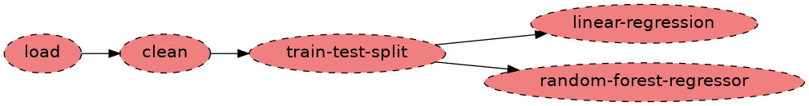
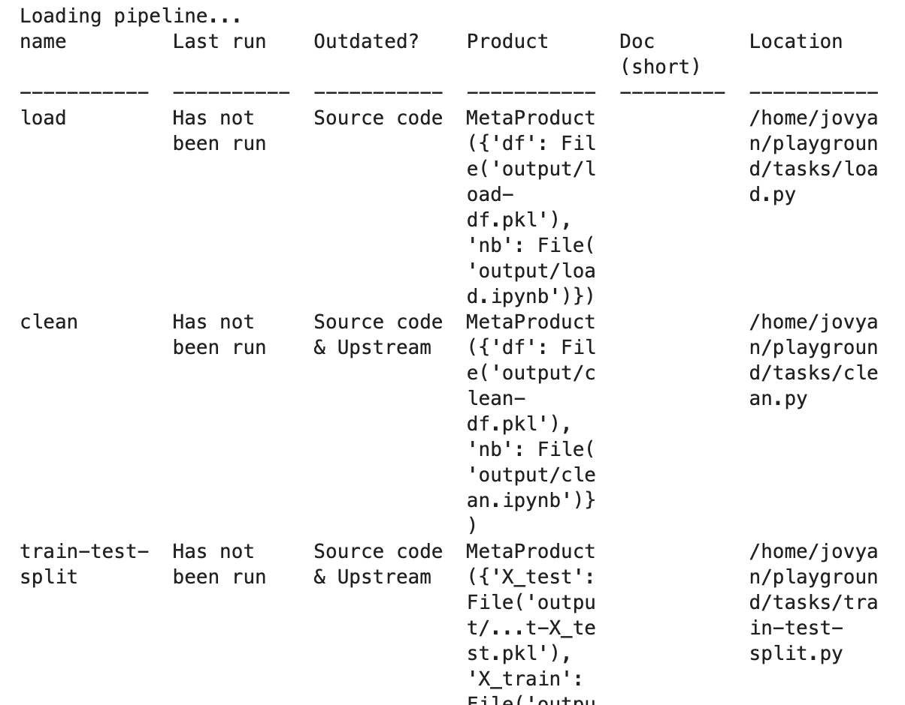
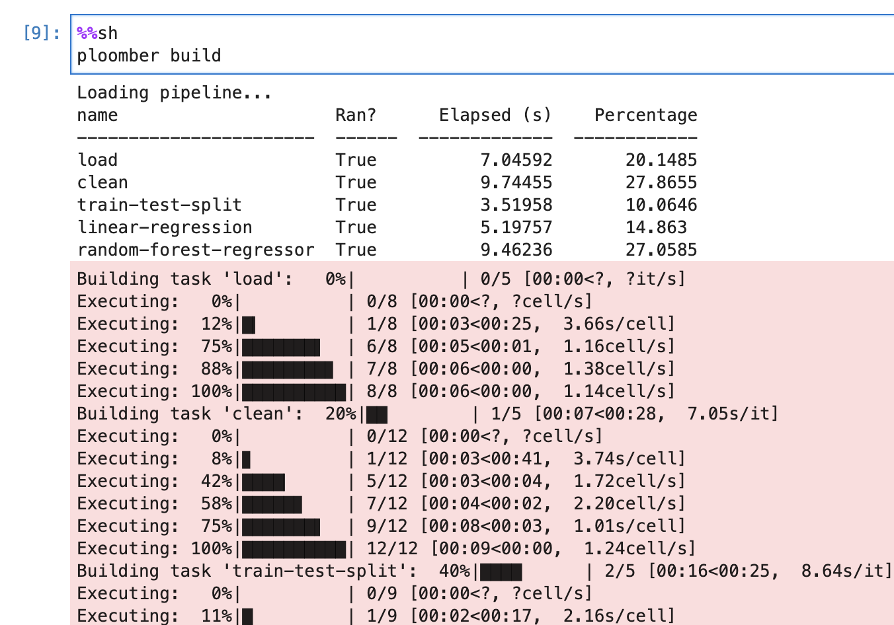
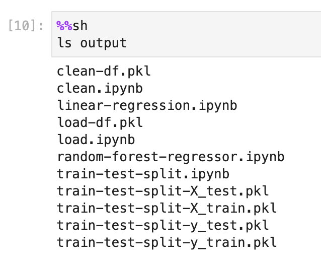
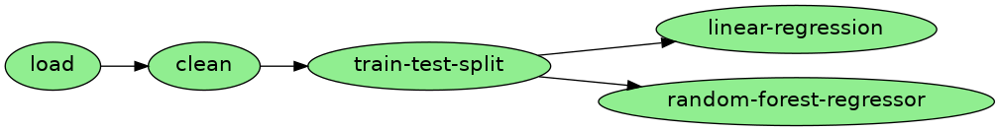
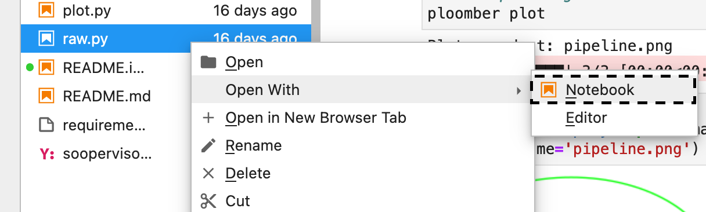
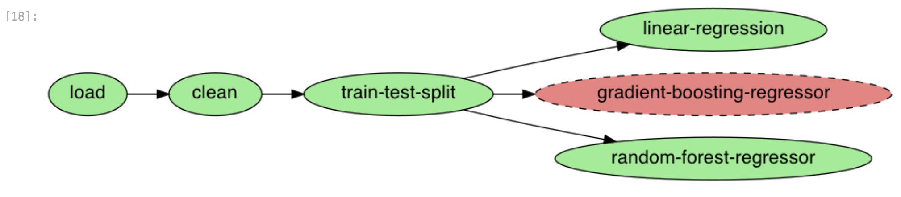
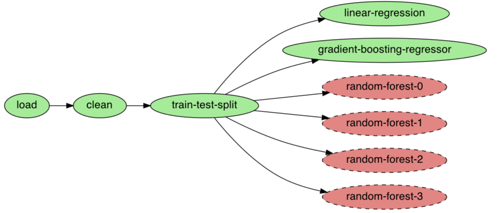

:author: Ido Michael
:email: ido@ploomber.io
:institution: Ploomber

Keeping your Jupyter notebook code quality bar high (and production ready) with Ploomber
========================================================================================

This paper walks through this `interactive tutorial <https://github.com/idomic/ploomber-workshop>`_.
It is highly recommended running this interactively so it's easier to follow and see the results in real-time.
There's a binder link in there as well, so you can launch it instantly.

1. Introduction
---------------

Notebooks are an excellent environment for data exploration: they allow
us to write code interactively and get visual feedback, providing an
unbeatable experience for understanding our data.

However, this convenience comes at a cost; if we are not careful about
adding and removing code cells, we may have an irreproducible notebook.
Arbitrary execution order is a prevalent problem: a `recent
analysis <https://blog.jetbrains.com/datalore/2020/12/17/we-downloaded-10-000-000-jupyter-notebooks-from-github-this-is-what-we-learned/>`_
found that about 36% of notebooks on GitHub did not execute in linear
order. To ensure our notebooks run, we must continuously test them to
catch these problems.

A second notable problem is the size of notebooks: the more cells we
have, the more difficult it is to debug since there are more variables
and code involved.

Software engineers typically break down projects into multiple steps and
test continuously to prevent broken and unmaintainable code. However,
applying these ideas for data analysis requires extra work; multiple
notebooks imply we have to ensure the output from one stage becomes the
input for the next one. Furthermore, we can no longer press “Run all
cells” in Jupyter to test our analysis from start to finish.

**Ploomber provides all the necessary tools to build multi-stage,
reproducible pipelines in Jupyter that feel like a single notebook.**
Users can easily break down their analysis into multiple notebooks and
execute them all with a single command.

2. Refactoring a legacy notebook
--------------------------------

If you already have a python project in a single notebook, you can use our tool
`Soorgeon <https://github.com/ploomber/soorgeon>`__ to automatically
refactor it into a `Ploomber <https://github.com/ploomber/ploomber>`__
pipeline. Soorgeon statically analyzes your code, cleans up unnecessary imports,
and makes sure your monolithic notebook is broken down into smaller components.
It does that by scanning the markdown in the notebook and analyzing the headers;
each H2 header in our example is marking a new self-contained task. In addition,
it can transform a notebook to a single-task pipeline and then the user can split
it into smaller tasks as they see fit.

To refactor the notebook, we use the ``soorgeon refactor`` command:

.. code:: sh

   soorgeon refactor nb.ipynb

After running the refactor command, we can take a look at the local directory
and see that we now have multiple python tasks which that are ready for production:

.. code:: sh

   ls playground

We can see that we have a few new files. ``pipeline.yaml`` contains the
pipeline declaration, and ``tasks/`` contains the *stages* that Soorgeon
identified based on our H2 Markdown headings:

.. code:: sh

   ls playground/tasks

One of the best ways to onboard new people and explain what each workflow is doing
is by plotting the pipeline (note that we’re now using ``ploomber``, which
is the framework for developing pipelines):

.. code:: sh

   ploomber plot

This command will generate the plot below for us, which will allow us to stay up to date
with changes that are happening in our pipeline and get the current status of
tasks that were executed or failed to execute.



   In this pipeline none of the tasks were executed - it's all red.


Soorgeon correctly identified the *stages* in our original ``nb.ipynb``
notebook. It even detected that the last two tasks
(``linear-regression``, and ``random-forest-regressor``) are independent
of each other!

We can also get a summary of the pipeline with ``ploomber status``:

.. code:: sh

   cd playground
   ploomber status



   In here we can see the status of each of our pipeline's tasks, runtime and location.


3. The ``pipeline.yaml`` file
-----------------------------

To develop a pipeline, users create a ``pipeline.yaml`` file and declare
the tasks and their outputs as follows:

.. code:: yaml

   tasks:
     - source: script.py
       product:
         nb: output/executed.ipynb
         data: output/data.csv

     # more tasks here...

The previous pipeline has a single task (``script.py``) and generates
two outputs: ``output/executed.ipynb`` and ``output/data.csv``. You may
be wondering why we have a notebook as an output: Ploomber converts
scripts to notebooks before execution; hence, our script is considered
the source and the notebook a byproduct of the execution. Using scripts
as sources (instead of notebooks) makes it simpler to use git. However,
this does not mean you have to give up interactive development since
Ploomber integrates with Jupyter, allowing you to edit scripts as
notebooks.

In this case, since we used ``soorgeon`` to refactor an existing
notebook, we did not have to write the ``pipeline.yaml`` file.


4. Building the pipeline
------------------------

Let’s build the pipeline (this will take ~30 seconds):

.. code:: sh

   cd playground
   ploomber build

We can see which are the tasks that ran during this command, how long they took to execute,
and the contributions of each task to the overall pipeline execution runtime.



   Here we can see the build outputs


Navigate to ``playground/output/`` and you’ll see all the outputs: the
executed notebooks, data files and trained model.

.. code:: sh

   ls playground/output



   These are the post build artifacts


In this figure, we can see all of the data that was collected during the pipeline,
any artifacts that might be useful to the user, and some of the execution history
that is saved on the notebook's context.

5. Testing and quality checks
-----------------------------

** Open `tasks/train-test-split.py` as a notebook by right-clicking on it and then `Open With` -> `Notebook` and add the following code after the cell with `# noqa`:

.. code:: python

    # Sample data quality checks after loading the raw data
    # Check nulls
    assert not df['HouseAge'].isnull().values.any()

    # Check a specific range - no outliers
    assert df['HouseAge'].between(0,100).any()

    # Exact expected row count
    assert len(df) == 11085


** We'll do the same for `tasks/linear-regression.py`, open the file and add the tests:

.. code:: python

    # Sample tests after the notebook ran
    # Check task test input exists
    assert Path(upstream['train-test-split']['X_test']).exists()

    # Check task train input exists
    assert Path(upstream['train-test-split']['y_train']).exists()

    # Validating output type
    assert 'pkl' in upstream['train-test-split']['X_test']

Adding these snippets will allow us to validate that the data we're looking for exists
and has the quality we expect. For instance, in the first test we're checking
there are no missing rows, and that the data sample we have are for houses up to 100
years old.

In the second snippet, we're checking that there are train and test inputs which
are crucial for training the model.

6. Maintaining the pipeline
---------------------------

Let’s look again at our pipeline plot:

.. code:: python

   Image('playground/pipeline.png')




The arrows in the diagram represent input/output dependencies
and depict the execution order. For example, the first task (``load``) loads
some data, then ``clean`` uses such data as input and processes it, then
``train-test-split`` splits our dataset into training and test sets. Finally,
we use those datasets to train a linear regression and a random forest
regressor.

Soorgeon extracted and declared this dependencies for us, but if we want
to modify the existing pipeline, we need to declare such dependencies.
Let’s see how.

We can also see that the pipeline is green, meaning all of the tasks in it have
been executed recently.

7. Adding a new task
--------------------

Let’s say we want to train another model and decide to try `Gradient
Boosting
Regressor <https://scikit-learn.org/stable/modules/generated/sklearn.ensemble.GradientBoostingRegressor.html#sklearn.ensemble.GradientBoostingRegressor>`__.
First, we modify the ``pipeline.yaml`` file and add a new task:

Open ``playground/pipeline.yaml`` and add the following lines at the end


.. code:: yaml

   - source: tasks/gradient-boosting-regressor.py
     product:
       nb: output/gradient-boosting-regressor.ipynb

Now, let’s create a base file by executing ``ploomber scaffold``:

.. code:: sh

   cd playground
   ploomber scaffold

This is the output of the command:
```
Found spec at 'pipeline.yaml'
Adding /Users/ido/ploomber-workshop/playground/
tasks/
gradient-boosting-regressor.py...
Created 1 new task sources.
```

We can see it created the task sources for our new task, we just have to fill
those in right now.


Let's see how the plot looks now:

.. code:: sh

   cd playground
   ploomber plot

.. figure:: images/new-task.png
   :alt: new-task

   Now we see an independent new task

You can see that Ploomber recognizes the new file, but it does not have
any dependency, so let’s tell Ploomber that it should execute after
``train-test-split``:


Open ``playground/tasks/gradient-boosting-regressor.py`` as a notebook by right-clicking on it and then ``Open With`` -> ``Notebook``:
^^^^^^^^^^^^^^^^^^^^^^^^^^^^^^^^^^^^^^^^^^^^^^^^^^^^^^^^^^^^^^^^^^^^^^^^^^^^^^^^^^^^^^^^^^^^^^^^^^^^^^^^^^^^^^^^^^^^^^^^^^^^^^^^^^^^^^



   lab-open-with-notebook

At the top of the notebook, you’ll see the following:

.. code:: python

   upstream = None

This special variable indicates which tasks should execute before the
notebook we're currently working on. In this case, we want to get
training data so we can train our new model so we change the
``upstream`` variable:

.. code:: python

   upstream = ['train-test-split']

Let's generate the plot again:

.. code:: sh

   cd playground
   ploomber plot



   The new task is attached to the pipeline


Ploomber now recognizes our dependency declaration!

Open ``playground/tasks/gradient-boosting-regressor.py`` as a notebook by right-clicking on it and then ``Open With`` -> ``Notebook`` and add the following code:
^^^^^^^^^^^^^^^^^^^^^^^^^^^^^^^^^^^^^^^^^^^^^^^^^^^^^^^^^^^^^^^^^^^^^^^^^^^^^^^^^^^^^^^^^^^^^^^^^^^^^^^^^^^^^^^^^^^^^^^^^^^^^^^^^^^^^^^^^^^^^^^^^^^^^^^^^^^^^^^^^

.. code:: python

   from pathlib import Path
   import pickle

   import seaborn as sns
   from sklearn.ensemble import GradientBoostingRegressor

   y_train = pickle.loads(

       Path(upstream['train-test-split']['y_train']).read_bytes()
   )
   y_test = pickle.loads(

       Path(upstream['train-test-split']['y_test']).read_bytes()
   )
   X_test = pickle.loads(

       Path(upstream['train-test-split']['X_test']).read_bytes()
   )
   X_train = pickle.loads(

       Path(upstream['train-test-split']['X_train']).read_bytes()
   )

   gbr = GradientBoostingRegressor()
   gbr.fit(X_train, y_train)

   y_pred = gbr.predict(X_test)
   sns.scatterplot(x=y_test, y=y_pred)


8. Incremental builds
---------------------

Data workflows require a lot of iteration. For example, you may want to
generate a new feature or model. However, it's wasteful to re-execute
every task with every minor change. Therefore, one of Ploomber's core
features is incremental builds, which automatically skip tasks whose
source code hasn't changed.

Run the pipeline again:

.. code:: sh

   cd playground
   ploomber build

You can see that only the ``gradient-boosting-regressor`` task ran!

Incremental builds allow us to iterate faster without keeping track of
task changes.

Check out
``playground/output/
gradient-boosting-regressor.ipynb``,

which contains the output notebooks with the model evaluation plot.


9. Parallel execution and Ploomber cloud execution
--------------------------------------------------

This section can run locally or on the cloud.
To setup the cloud we'll need to register for an `api key <https://docs.ploomber.io/en/latest/cloud/index.html>`_

Ploomber cloud allows you to scale your experiments into the cloud without provisioning machines and without dealing with infrastrucutres.

Open `playground/pipeline.yaml` and add the following code instead of the source task:

.. code:: yaml

    - source: tasks/random-forest-regressor.py


This is how your task should look like in the end

.. code:: yaml

    - source: tasks/random-forest-regressor.py
      name: random-forest-
      product:
        nb: output/random-forest-regressor.ipynb
      grid:
            # creates 4 tasks (2 * 2)
            n_estimators: [5, 10]
            criterion: [gini, entropy]


In addition, we'll need to add a flag to tell the pipeline to execute in parallel.
Open `playground/pipeline.yaml` and add the following code above the `-tasks` section (line 1):

yaml

# Execute independent tasks in parallel
executor: parallel


.. code:: sh

   ploomber plot




   We can see this pipeline has multiple new tasks.


.. code:: sh

   ploomber build

10. Execution in the cloud
--------------------------

When working with datasets that fit in memory, running your pipeline is
simple enough, but sometimes you may need more computing power for your
analysis. Ploomber makes it simple to execute your code in a distributed
environment without code changes.


Check out `Soopervisor <https://soopervisor.readthedocs.io>`_, the
package that implements exporting Ploomber projects in the cloud with
support for:

-  `Kubernetes (Argo Workflows) <https://soopervisor.readthedocs.io/en/latest/tutorials/kubernetes.html>`_
-  `AWS Batch <https://soopervisor.readthedocs.io/en/latest/tutorials/aws-batch.html>`_
-  `Airflow <https://soopervisor.readthedocs.io/en/latest/tutorials/airflow.html>`_

11. Resources
-------------

Thanks for taking the time to go through this tutorial! We hope you
consider using Ploomber for your next project. If you have any questions
or need help, please reach out to us! (contact info below).

Here are a few resources to dig deeper:

-  `GitHub <https://github.com/ploomber/ploomber>`_
-  `Documentation <https://ploomber.readthedocs.io/>`_
-  `Code examples <https://github.com/ploomber/projects>`_
-  `JupyterCon 2020 talk <https://www.youtube.com/watch?v=M6mtgPfsA3M>`_
-  `Argo Community Meeting talk <https://youtu.be/FnpXyg-5W_c>`_
-  `Pangeo Showcase talk (AWS Batch demo) <https://youtu.be/XCgX1AszVF4>`_
-  `Jupyter project <https://jupyter.org/>`_

10. Contact
-----------

-  `Twitter  <https://twitter.com/ploomber>`__
-  `Join us on Slack <http://ploomber.io/community>`__
-  `E-mail us <contact@ploomber.io>`__
