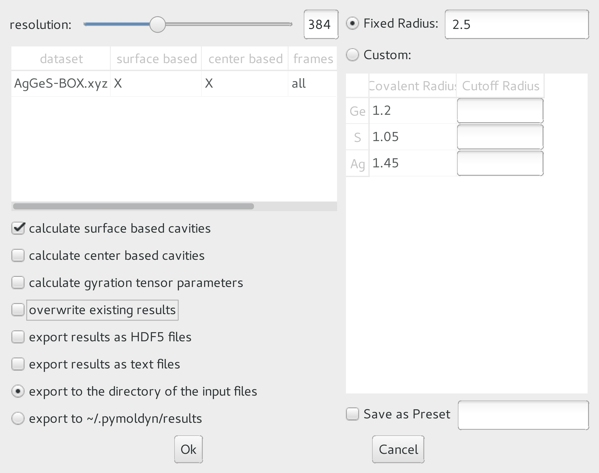

.. ########################## Preamble begin ###################################

.. |_| unicode:: 0xA0
   :trim:

.. |...| raw:: latex

    \ldots

.. |A| raw:: latex

    \AA{}

.. |noindent| raw:: latex

    \noindent

.. role:: angstrom

.. raw:: latex

    \newcommand{\DUroleangstrom}[1]{\mbox{#1~\AA}}

.. role:: refa

.. raw:: latex

    \newcommand{\DUrolerefa}[1]{\ref{#1}(a)}

.. role:: refb

.. raw:: latex

    \newcommand{\DUrolerefb}[1]{\ref{#1}(b)}

.. role:: emph

.. raw:: latex

    \newcommand{\DUroleemph}[1]{\emph{#1}}

.. ########################## Preamble end #####################################

:author: Ingo Heimbach
:email: i.heimbach@fz-juelich.de
:institution: PGI-1 and PGI/JCNS-TA, Forschungszentrum Jülich, D-52425 Jülich
:corresponding:

:author: Florian Rhiem
:email: f.rhiem@fz-juelich.de
:institution: PGI-1 and PGI/JCNS-TA, Forschungszentrum Jülich, D-52425 Jülich

:author: Fabian Beule
:email: f.beule@fz-juelich.de
:institution: PGI-1 and PGI/JCNS-TA, Forschungszentrum Jülich, D-52425 Jülich

:author: David Knodt
:email: david.knodt@iais.Fraunhofer.de
:institution: PGI-1 and PGI/JCNS-TA, Forschungszentrum Jülich, D-52425 Jülich

:author: Josef Heinen
:email: j.heinen@fz-juelich.de
:institution: PGI-1 and PGI/JCNS-TA, Forschungszentrum Jülich, D-52425 Jülich

:author: Robert O. Jones
:email: r.jones@fz-juelich.de
:institution: PGI-1 and PGI/JCNS-TA, Forschungszentrum Jülich, D-52425 Jülich

:video: https://pgi-jcns.fz-juelich.de/pub/media/pymoldyn_algorithms.mp4

#################################################################################################
pyMolDyn: Identification, structure, and properties of cavities in condensed matter and molecules
#################################################################################################

.. class:: abstract

    pyMolDyn is an interactive viewer of atomic systems defined in a unit
    cell and is particularly useful for crystalline and amorphous materials.
    It identifies and visualizes cavities (vacancies, voids) in simulation
    cells corresponding to all seven 3D Bravais lattices, makes no
    assumptions about cavity shapes, allows for atoms of different size, and
    locates the cavity centers (the centers of the largest spheres not
    including an atom center). We define three types of cavity and develop a
    method based on the *split and merge* algorithm to calculate all
    three. The visualization of the cavities uses the *marching cubes*
    algorithm. The program allows one to calculate and export pair
    distribution functions (between atoms and/or cavities), as well as
    bonding and dihedral angles, cavity volumes and surface areas, and
    measures of cavity shapes, including asphericity, acylindricity, and
    relative shape anisotropy. The open source Python program is based on
    ``GR framework`` and ``GR3`` routines and can be used to
    generate high resolution graphics and videos.

.. class:: keywords

    Cavity shape, volume, and surface area; Python; marching cubes; split and merge

.. .. figure:: graphic.eps
..     :align: center
..     :figclass: w
..
..     Empty regions (vacancies, cavities, voids) of, for example, a disordered
..     or crystalline material or a molecule, can influence or even dominate
..     its properties. It is, however, difficult to
..     determine |---| or even define |---| such empty regions. pyMolDyn is a Python
..     program that calculates and visualizes such regions (for several
..     definitions) and determines important properties, including the cavity
..     centers, volumes, and surface areas, as well as several shape
..     parameters.

Introduction
############

The properties of many materials are influenced significantly or even
dominated by the presence of empty regions, referred to as cavities,
vacancies, or voids. In phase change materials, for example, they play
an essential role in the rapid and reversible transformation between
amorphous and crystalline regions of chalcogenide semiconductors.
:cite:`AJ07,AJ08,AJ12` In soft matter, such as polymers, cavities can
lead to structural failure and are often crucial for diffusion of small
molecules. Voids caused by radiation (neutrons, x-rays) can lead to
dramatic changes in the strength of materials. It is essential to
provide efficient algorithms and programs to visualize cavities in the
course of computer simulations. We describe here methods developed in
the context of phase change materials, where the empty regions are
rarely larger than a few atomic volumes, and the term "vacancy" is
also in common use. :cite:`LE11b` The approach will be useful in other
contexts. The present manuscript is an updated and corrected version
of :cite:`Hetal17`.

Geometrical algorithms to identify cavities have a long history in the
discussion of disordered materials. Bernal :cite:`Be64` discussed liquid
structures in terms of space-filling polyhedra and noted that "holes"
or "pseudonuclei" would occur in general. Finney :cite:`Fi70` extended
this analysis by using the Dirichlet :cite:`Di50` or Voronoi :cite:`Vo08`
construction, where space is divided into regions bounded by planes that
bisect interatomic vectors perpendicularly. This construction for a
crystalline solid leads to the well-known Wigner-Seitz cell. The
polyhedron associated with an atom is the smallest surrounding the atom
in question, and its structural features (volume, number of vertexes,
etc.) can be used for identification and characterization. A small
Voronoi polyhedron indicates an interstitial defect, and a local
assembly of large polyhedra could imply the existence of a cavity. This
approach has been used to analyze defect structures in simulations of
radiation damage :cite:`CL85` and the motion of vacancies in colloids,
:cite:`LAC13` although the coordination number (the number of faces of
the Voronoi cell) is not necessarily a convenient measure of their
positions. :cite:`LAC13` Similar techniques have been applied to the
distinction between solute and solvent in a liquid, such as hydrated
peptide molecules. :cite:`Vetal11`

Delaunay triangulation, :cite:`De34` a division of space closely related
to the Dirichlet-Voronoi analysis, has been used to identify the
"unoccupied space" :cite:`AMS92` or "cavities" :cite:`VBM15` in
polymer systems and to analyze their connectivity, and it has been
used to analyze the normal modes in a molecular dynamics simulation of a
glass. :cite:`LMNS00` Efficient programs are available for performing
Voronoi analyses (see, for example, Ref. :cite:`Ry09`) and its extension
to Voronoi :math:`S`-surfaces, which are appropriate for systems with atoms of
different sizes. :cite:`MVLG06,VNP` Ref. :cite:`MVLG06` contains many
references to physical applications of Dirichlet-Voronoi-Delaunay
analyses. The present work and the above approaches focus on the
geometrical arrangement resulting from a simulation, rather than
determining other physical quantities such as local atomic pressures.
:cite:`LN88`

In the following section, we define essential terms and describe the
analysis, based on the "split and merge" :cite:`HP76` and "marching
cubes" :cite:`LC87,NY06` algorithms, that we have used to study three
definitions of cavities:

-   Regions (sometimes referred to as "domains") where each point
    is outside spheres centered on the atoms. The radii of the spheres are
    generally element-dependent, but an equal cutoff for all elements
    (:angstrom:`2.5`) was chosen in a study of Ge/Sb/Te phase change materials.
    :cite:`LE11b`

-   "Center-based" cavities resulting from a Dirichlet-Voronoi
    construction using the atomic positions and the cavity *centers*.

-   "Surface-based" cavities, :cite:`AJ07` where the boundaries are
    determined by Dirichlet-Voronoi constructions from each point on the
    domain surface to neighboring atoms, have been used in numerous studies
    of phase change materials. :cite:`AJ12,CBP10,KAJ14`

The code, the ways to access it, and the online documentation are
described below, and an application demonstrates some of its features.

Definitions and Algorithms
##########################

Essential input for a calculation of cavities and their properties is
the location of the atoms, which is often provided as a list of
coordinates and atom types within an appropriate unit cell. However,
the *definition* of a cavity is not unique and is a prerequisite
for any study. Calculation of pair distribution functions involving
cavities (with atoms and with other cavities) means that we must also
associate appropriate coordinates with the *center* of each cavity.
We now define cavities and describe how we calculate their centers.

Cavity domains and cavity centers
=================================

The first step is the discretization of the simulation cell by creating
a cuboid grid containing the cell bounding box and a surrounding layer,
which enables periodic boundary condition to be implemented effectively.
The *resolution* :math:`d_{\textrm{max}}` refers to the number of
points along the longest edge, and two units are added at each end of
each cell edge. Each grid point outside the cell has one equivalent
point inside. If there are more than one equivalent inside points, we
choose the one closest to the origin or |---| if this is still
ambiguous |---| search for the smallest component in the order :math:`x`, :math:`y`,
:math:`z`. Outside points are labeled with the index of the translation
vector pointing to the equivalent inside point. This step depends only
on the cell shape and the resolution of the discrete grid, and the
results can be cached and used for other data files.

As shown in Fig. :refa:`cav12`, we now construct spheres centered on
each atom with radii specified for each atom type (element). In earlier
work on alloys of Ge/Sb/Te :cite:`AJ07,AJ12` and Ag/In/Sb/Te,
:cite:`Metal11` the radius was chosen to be the same (:angstrom:`2.8`) for all
elements [:math:`r_{\rm C}` in Fig. :refa:`cav12`]. Points outside the
simulation cell are replaced by equivalent points inside. All points
outside these spheres form "cavity domains" [yellow in Fig.
:refa:`cav12`], and the "cavity center" [X in the 2D scheme
:refb:`cav12`] is the center of the largest sphere that does not
overlap a neighboring atom. It is possible, for example in unusually
long, thin cavities, that more than one point satisfy this condition
approximately equally well, so that the center can switch between them
as a simulation proceeds.

Some structures are unusually sensitive to the choice of cutoff radius
:math:`r_{\rm C}` and/or resolution, particularly when the cavity domains are
very small, and it is essential to carry out detailed tests before
performing production runs. The program provides a warning when one or
more cavity domains consist of a single cell of the discretization grid.
The calculation should be repeated with a higher resolution to increase
the number of numerically stable cavity domains.

Domains and center-based cavities
=================================

A knowledge of the positions of the atoms and the cavity center enables
us to perform a Dirichlet-Voronoi construction (see above) leading to
the cavities shown as red in Fig. :refb:`cav12`. Overlapping cavities
from different domains are merged to form "multicavities", and the
volumes and surface areas of cavities and cavity domains are determined
as follows.

Points in domains are grouped together by applying the *split and
merge* algorithm, :cite:`HP76` which consists of three main steps for
periodic cells. First, the discrete grid is split recursively into
subgrids until they contain either atoms or domain points. Subgrids
containing atom points are not needed to determine the domains and are
ignored. During the split phase the direct neighbors of each subgrid are
recorded, and neighboring subgrid points are then merged to form the
cavity domains. As noted above, these domains can be identified as
cavities by choosing an appropriate cutoff radius. :cite:`LE11b`

Center-based cavities comprise points that are closer to domain centers
than to any atom, and their construction requires points inside atomic
spheres for which there is an atom no farther away than the largest
atomic sphere radius. The grid is split into cubes with sides of at
least this length, for which only atoms and surface or center points
inside neighboring cubes are relevant. If a point is closer to the
center of cavity domain :math:`i` than to the nearest atom, it is marked as
part of cavity :math:`i`. In the case of multicavities, intersections are
detected by checking the neighboring points of the surface of a cavity.
If two such points belong to different cavities, the two cavities are
parts of a common multicavity.

The surface of each domain, cavity, or multicavity is important for
calculating the surface area and for visualization, and it is determined
by applying a variation of the *marching cubes* algorithm
:cite:`LC87,NY06` to new grids based on those derived above. Each grid
contains the bounding box of a cavity domain or multicavity, and each
point in the grid is assigned the number of neighboring points inside
the domain or cavity. The algorithm then constructs a surface containing
all points with a non-zero count. Neighboring grid points are grouped
together into disjoint cubes, and points with a count of 1 are found by
interpolation along the edges and connected to form triangles. The set
of all such triangles is the surface of a domain or cavity.

Surface-based cavities
======================

The surface-based cavity [red in Fig. :refa:`cav12`] can be determined
as for center-based cavities, except that the Dirichlet-Voronoi
construction is performed from each point of the domain surface to the
neighboring atoms.

Analysis of structure and cavities
==================================
:label:`anal`

A range of quantities can be calculated for the atomic structure
(including bond and dihedral angles) and for each of the above
definitions of cavity. In addition to the volume :math:`V_{\rm C}`, surface
area, and location of the center, we calculate the characteristic radius
:math:`r_{\rm char}=(3V_{\rm C}/4\pi)^{1/3}`, which is the radius of a
spherical cavity with volume :math:`V_{\rm C}`. We also evaluate and export
pair distribution functions (PDF) between all atom types and/or cavity
centers. Continuous representations can be generated using Gaussian,
Epanechnikov, :cite:`Ep69` compact, triangular, box, right box, and left
box window functions. The corresponding kernels are listed in the online
documentation, and the default bandwidth :math:`\sigma` is 0.4 in all cases.
Following earlier work, :cite:`AMS92,VBM15,TS85` we calculate the
volume-weighted gyration tensor **R**, which describes the second
moment of the coordinates (:math:`x`, :math:`y`, :math:`z`) of points inside a cavity

.. math::

    \mathbf{R} =\frac{1}{V_{\rm C}}
    \begin{pmatrix}
        \overline{xx} & \overline{xy} & \overline{xz} \\
        \overline{yx} & \overline{yy} & \overline{yz} \\
        \overline{zx} & \overline{zy} & \overline{zz}
    \end{pmatrix} .

Here :math:`\overline{xx}=\sum_j^{n_c} v_j x_jx_j`, :math:`\overline{xy}=
\sum_j^{n_c} v_j x_jy_j`, |...|, :math:`v_j` is the volume of cell :math:`j`, and
:math:`n_c` is the number of cells in cavity C. :math:`(x_j, y_j, z_j)` are the
Cartesian coordinates of the center of cell :math:`j` relative to the centroid
or center of gyration of the cavity, which differs in general from the
center defined above. Measures of the size and shape of individual
cavities are the squared radius of gyration :math:`R_g^2`, the asphericity
:math:`\eta`, the acylindricity :math:`c`, and the relative shape anisotropy
:math:`\kappa^2`. These are defined as

.. math::
    :type: eqnarray

    R_g^2 &=& \lambda_1 + \lambda_2 + \lambda_3 \\
    \eta  &=& \big(\lambda_1-0.5(\lambda_2+\lambda_3)\big)/(\lambda_1+\lambda_2+ \lambda_3) \\
    c &=& (\lambda_2-\lambda_3)/(\lambda_1+\lambda_2+\lambda_3)\\
    \kappa^2 &=& \big(\eta^2 + 0.75 c^2\big)/R_g^4 ,

where :math:`\lambda_1`, :math:`\lambda_2`, and :math:`\lambda_3` are the ordered
eigenvalues of :math:`\mathbf{R}` (:math:`\lambda_1\ge\lambda_2\ge\lambda_3`).

These quantities provide compact information about the symmetry and
overall shape of a cavity and have been useful in the context of
diffusants in polymers. :cite:`AMS92` The asphericity is always
non-negative and is zero only when the cavity is symmetric with respect
to the three coordinate axes, e.g. for a spherically symmetric or a
cubic cavity. The acylindricity is zero when the cavity is symmetric
with respect to two coordinate axes, e.g., for a cylinder. The relative
shape anisotropy is bounded by zero (spherical symmetry) and unity (all
points collinear). The calculation of these shape parameters requires
particular care (and more computer time) when cavities cross the
boundaries of the unit cell, and the default is not to calculate these
parameters. The parameters are also not calculated for (infinite)
cavities that span the simulation cell, and a warning is issued in this
case.

Description of the Code
#######################
:label:`code`

The program ``pyMolDyn`` is written in Python (2.7.13), uses the
graphical user interface Qt 5.8.0, the Python module PyQt5 (5.8.2), and
the ``GR Framework`` and ``GR3`` packages (0.24.0)
:cite:`HRH15` for 2D- and 3D-graphics, respectively. It has been tested
with NumPy (1.12.1). Numerically intensive sections are written in C,
compiled using Apple Clang 8.1.0 (macOS) or gcc 4.2.1
(Linux) and embedded using ``ctypes`` and extension modules. A
ready-to-use bundle for OS |_| X (Mavericks, Yosemite, El Capitan) and macOS
Sierra is provided at:

|noindent| `<http://pgi-jcns.fz-juelich.de/pub/downloads/software/pyMolDyn.dmg>`_

|noindent| with installation scripts and a package repository for Linux
[Debian 8 (Jessie), Ubuntu 16.04 LTS (Xenial Xerus), Centos 7.2, Fedora
25, and OpenSUSE Leap 42.2] at:

|noindent| `<https://pgi-jcns.fz-juelich.de/portal/pages/pymoldyn-main.html>`_

|noindent| Documentation is available in the same directory under
`pymoldyn-doc.html <https://pgi-jcns.fz-juelich.de/portal/pages/pymoldyn-doc.html>`_,
with links to the graphical user and command line interfaces. The source
code is available via the public git repository:

|noindent| `<http://github.com/sciapp/pyMolDyn>`_.

The program supports unit cells of all seven 3D Bravais lattices:
triclinic (TRI), monoclinic (MON), orthorhombic (ORT), tetragonal (TET),
rhombohedral (RHO), hexagonal (HEX), and cubic (CUB). These cells and
the parameters required for their definition are shown in Fig.
:ref:`bravais`. The bond length cutoffs in all visualizations are  15\%
longer than the sum of the covalent radii of the elements.
:cite:`OB,Cetal08` The default colors for the elements are those used in
Jmol/JSmol :cite:`Jmol` and other programs ("CPK", Corey-Pauling-Koltun).
:cite:`SF`

Each frame to be analyzed requires input in the ``.xyz``-form,
which can be read by Jmol/JSmol and other packages. The first lines of
an  ``.xyz`` file are typically::

    <number of atoms>
    <comment>
    <element> <X> <Y> <Z>
    ...

|noindent| where ``element`` is the symbol for the element in question,
e.g. ``SB`` or ``TE``, and ``<X>``, ``<Y>``,
and ``<Z>`` are the Cartesian coordinates of the first atom.
For each atom there is an input line with its coordinates. In
``pyMolDyn``, the second (usually comment) line provides the
necessary information concerning the Bravais lattice and its parameters.
In the case of a hexagonal lattice with :math:`a=17.68942` and :math:`c=22.61158`
(in |A|), for example, we write:

|noindent| ``HEX 17.68943 22.61158``

|noindent|  Additional comments on the first line (after the number of
atoms and a space) or the second line are ignored, and the space may be
used to store additional information.

Application
###########
:label:`appl`

The use of ``pyMolDyn`` is described in detail in the online
documentation (see links above). To illustrate its usage, we take the
attached input file `AgGeS-Box.xzy <https://raw.githubusercontent.com/sciapp/pyMolDyn/develop/data/AgGeS-BOX.xyz>`_,
which shows a result of a 500-atom simulation of an amorphous alloy
of Ag, Ge, and S (:math:`\textrm{Ag}_{100}\textrm{Ge}_{168}\textrm{S}_{232}`)
in a cubic box of size :angstrom:`21.799`. :cite:`Aetal15` The first
three lines of the input are then::

    500
    CUB 21.799
    AG -7.738 ...

At this point, clicking "pyMolDyn/Preferences" (OS |_| X, macOS) or
"File/Settings" (Linux) allows changes to be made to the default
colors for background (black), bounding box (white), bonds (grey),
domains (green), and center-based (brown) and surface-based cavities
(blue), as well as the cutoff value :math:`r_{\rm C}` for calculating
surface-based cavities. The default is :angstrom:`2.8` for all atoms (we use
:angstrom:`2.5` in the present application because of the relatively small
sulfur atoms), but distinct cutoff radii may be chosen for each element.
To guide this choice, the covalent radii for the elements present are
provided when setting up the calculation. The resolution can be set by
the user and is 384 in the present application. The program is started
with the command::

    pymoldyn

The choice of file can be made after clicking "Open", after which
"Calculate" leads to the window shown in Fig. :ref:`pymol1`.

The resolution and other quantities can then be changed as needed in the
appropriate box, after which "OK" starts the calculation and leads to
the screen shown in Fig. :ref:`pymol2`.

The program allows the generation of high-resolution images for
publications and presentations, as well as creating videos that
illustrate changes in structure (and cavities) as a function of time.
Statistics generated by the program include surface areas and volumes
(and the surface/volume ratio) of all cavities and domains, pair
distribution functions and partial PDF, the distributions of bond types
and of bond and dihedral angles, as well as the shape parameters
discussed above. Pair distribution functions can be calculated and
represented using seven window functions, and properties of individual
atoms and cavities may be filtered. This information is available
graphically, as an ASCII file, or as hdf5 output. For more details, see
`<https://pgi-jcns.fz-juelich.de/portal/pages/pymoldyn-gui.html>`_

A batch (command line interface) version is useful for generating
multiple frames needed for videos and can be called via ::

    pymoldyn --batch <filename>

Further information concerning the batch version is provided in
`<https://pgi-jcns.fz-juelich.de/portal/pages/pymoldyn-cli.html>`_

Concluding Remarks
##################

The open source program ``pyMolDyn`` identifies cavities
(vacancies, voids) in periodic systems of atoms in a unit cell with one
of the seven 3D Bravais lattices. The program makes no assumptions about
cavity shapes, allows for atoms of different sizes, and it calculates
cavities defined in three ways: (a) "domains" determined by excluding
spherical regions around each atom, (b) "center-based" cavities
determined by Dirichlet-Voronoi constructions for atoms and cavity
centers, and (c) Dirichlet-Voronoi constructions for atoms and points of
domain surfaces ("surface-based" cavities). The "split and merge"
and "marching cubes" algorithms are utilized. Surface areas, volumes,
characteristic radii, and shape parameters (asphericity, acylindricity,
relative shape anisotropy) of all cavities can be calculated, along with
distribution functions for all pairs of elements and cavities. The
program is based on the GR3 and GR framework software :cite:`HRH15` and
allows the production of high-resolution figures and videos. The input
files use the ``.xyz`` format used in Jmol/JSmol and other
packages.

The size of systems that can be calculated depends on the number of
atoms, the necessary resolution, and on the computing hardware
(processor, memory) used. Systems with 500 atoms and a resolution of 512
points in a cubic unit cell can be computed in minutes on a laptop
computer with modest (4 |_| GB) memory, and we have used the batch version
on an array of cores to generate the data needed for high-resolution
videos of several minutes length (10000 frames). Extensions to simplify
calculations for isolated molecules and to allow the easy use of
many-core, large memory computers are being implemented. We welcome
suggestions and contributions to this ongoing project. Full details are
available on `<https://pgi-jcns.fz-juelich.de/portal/pages/pymoldyn-main.html>`_.

Acknowledgments
===============

We thank numerous colleagues, particularly J. Akola, for suggestions and
contributions. The program was developed to analyze the results of
simulations of phase change materials carried out on supercomputers in
the Forschungszentrum Jülich. We are grateful for computer time
provided for this purpose by the JARA-HPC Vergabegremium on the JARA-HPC
partition of JUQUEEN and for time granted on JUROPA and JURECA at the
Jülich Supercomputer Centre.

References
##########

.. [AJ07] Akola, J. and Jones, R. |_| O., *Phys. Rev. B*
          **2007**, *76*, 235201.

.. [AJ08] Akola, J. and Jones, R. |_| O., *J. Phys.: Condens.
          Matter* **2008**, *20*, 465103.

.. [AJ12] Akola, J. and Jones, R. |_| O., *Phys. Status Solidi B*
          **2012**, *249*, 1851 |--| 1860.

.. [LE11b] Lee, T. |_| H. and Elliott, S. |_| R., *Phys. Rev. B*
           **2011**, *84*, 094124.

.. [Hetal17] I. Heimbach, F. Rhiem, F. Beule, D. Knodt, J. Heinen and R. |_| O. Jones, *J. Comput. Chem.*
             **2017**, *38*, 389–394.

.. [Be64] Bernal, J. |_| D., *Proc. R. Soc. A* **1964**,
          *280*, 299 |--| 322.

.. [Fi70] Finney, J. |_| L., *Proc. R. Soc A* **1970**,
          *319*, 479 |--| 493.

.. [Di50] Lejeune |_| Dirichlet, G., *J. Reine Angew. Mathematik*
          **1850**, *40*, 209 |--| 227.

.. [Vo08] Voronoï, G., *J. Reine Angew. Mathematik*
          **1908**, *134*, 198 |--| 287.

.. [CL85] Chaki, T. |_| K. and Li, J. |_| C. |_| M., *Philos. Mag. B* **1985**,
          *51*, 557 |--| 565.

.. [LAC13] Laghaei, R., Asher, S. |_| A. and Coalson, R. |_| D., *J.
           Phys. Chem. B* **2013**, *117*, 5271 |--| 5279.

.. [Vetal11] Voloshin, V. |_| P., Medvedev, N. |_| N., Andrews, M. |_| N.,
             Burri, R. |_| R., Winter, R. and Geiger, A., *J. Phys. Chem. B*
             **2011**, *115*, 14217 |--| 14228.

.. [De34] Delaunay, B., *Bulletin de l'Académie des Sciences de l'URSS.
          Classe des sciences mathématiques et naturelles* **1934**,
          *6*, 793 |--| 800.

.. [AMS92] Arizzi, S., Mott, P. |_| H. and Suter, U. |_| W., *J. Polym.
           Sci., Part B: Polym. Phys.* **1992**, *30*, 415 |--| 426.

.. [VBM15] Voyiatzis, E., Böhm, M. |_| C. and Müller-Plathe,
           F., *Comput. Phys. Commun.* **2015**, *196*, 247 |--| 254.

.. [LMNS00] Luchnikov, V. |_| A., Medvedev, N. |_| N., Naberukhin, Y. |_| I.
            and Schober, H. |_| R., *Phys. Rev. B* **2000**, *62*,
            3181 |--| 3189.

.. [Ry09] Rycroft, C., *Voro++: a three-dimensional Voronoi
          cell library in C++*, United States Department of Energy, 2009.
          `<http://www.osti.gov/scitech/servlets/purl/946741>`_

.. [MVLG06] Medvedev, N. |_| N., Voloshin, V. |_| P., Luchnikov, V. |_| A. and
            Gavrilova, M. |_| L., *J. Comput. Chem.* **2006**, *27*,
            1676 |--| 1692.

.. [VNP] VNP program: Calculation of the Voronoi :math:`S`-network
         (Additively weighted Voronoi Diagram),
         `<http://www.kinetics.nsc.ru/mds/?Software:VNP>`_

.. [LN88] Laakkonen, J. and Nieminen, R. |_| M., *J. Phys. C: Solid
          St. Phys.* **1988**, *21*, 3663 |--| 3685.

.. [HP76] Horowitz, S. |_| L. and Pavlidis, T., *J. ACM*
          **1976**, *23*,  368 |--| 388.

.. [LC87] Lorensen, W. |_| E. and Cline, H. |_| E., *SIGGRAPH Comput.
          Graph.* **1987**, *21*, 163 |--| 169.

.. [NY06] Newman, T. |_| S. and Yi, H., *Computers & Graphics*
          **2006**, *30*, 854 |--| 879.

.. [CBP10] Caravati, S., Bernasconi, M. and Parrinello, M., *Phys. Rev. B*
           **2010**, *81*, 014201.

.. [KAJ14] Kalikka, J., Akola, J. and Jones, R. |_| O., *Phys. Rev. B*
           **2014**, *90*, 184109.

.. [Metal11] Matsunaga, T., Akola, J., Kohara, S., Honma, T.,
             Kobayashi, K., Ikenaga, E., Jones, R. |_| O., Yamada, N., Takata, M. and
             Kojima, R., *Nature Mater.* **2011**, *10*, 129 |--| 134.

.. [Ep69] Epanechnikov, V. |_| A., *Theory Probabl. Appl.*
          **1969**, *14*, 153 |--| 158.

.. [TS85] Theodorou, D. |_| N. and Suter, U. |_| W., *Macromolecules
          (Washington, DC, U.S.)*, **1985**, *18*, 1206 |--| 1214.

.. [HRH15] Heinen, J., Rhiem, F., Felder, C., Beule, F., Brandl,
           G., Dück, M., Goblet, M., Heimbach, I., Kaiser, D., Klinkhammer, P.,
           Knodt, D., Nesselrath, R., Westphal, E. and Winkler, J., GR |---| a
           universal framework for visualization applications, 2015.
           `<http://gr-framework.org>`_

.. [OB] Open babel file: element.txt,
        `<http://sourceforge.net/p/openbabel/code/5041/tree/openbabel/trunk/data/element.txt>`_

.. [Cetal08] Cordero, B., Gomez, V., Platero-Prats, A. |_| E., Reves,
             M., Echeverria, J., Cremades, E., Barragan, F. and Alvarez, S.,
             *Dalton Trans.* **2008**, 2832 |--| 2838.

.. [Jmol] Jmol: an open-source Java viewer for chemical
          structures in 3D, `<http://www.jmol.org>`_
          or `<http://wiki.jmol.org/>`_.
          JSmol is an implementation of Jmol that does not require Java and runs
          on any web browser supporting HTML5.

.. [SF] Jmol colors, `<http://jmol.sourceforge.net/jscolors/>`_

.. [Aetal15] Akola, J., Beuneu, B., Jones, R. |_| O., Jóvári, P.,
             Kaban, I., Kolář, J., Voleská, I. and Wágner, T., *J.
             Phys.: Condens. Matter* **2015**, *27*, 485304.

.. figure:: figure1.pdf
    :align: center
    :figclass: wp

    Construction for a 2D geometry of (a) "cavity domain"
    (yellow, cutoff radius :math:`r_{\rm C}`) and "surface-based cavity" (red),
    (b) cavity center (X) and "center-based" cavity (red).
    :label:`cav12`

.. figure:: figure2.pdf
    :align: center
    :figclass: wp

    The unit cells of the seven 3D Bravais lattices, together
    with the parameters that define them.
    :label:`bravais`

    Window prior to setting parameters for calculation.
    :label:`pymol1`

.. figure:: figure4.png
    :align: center
    :figclass: wp
    :scale: 15%

    Visualization of structure of Ag/Ge/S (silver: Ag, green: Ge, yellow: S)
    and surface-based cavities (blue).
    :label:`pymol2`
