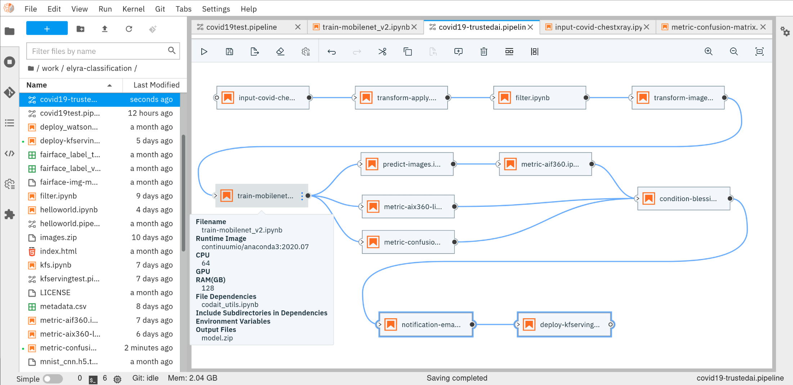

:author: Romeo Kienzler
:email: romeo.kienzler@ch.ibm.com
:institution: IBM, Center for Open Source Data and AI Technologies (CODAIT)

:author: Ivan Nesic
:email: ivan.nesic@usb.ch
:institution: University Hospital of Basel
:orcid: 0000-0002-4373-8860

---------------------------------------------------------------
CLAIMED, a visual and scalable component library for Trusted AI
---------------------------------------------------------------

.. class:: abstract

   We propose an Open Source low code / no code tool suite for data science supporting rapid
   prototyping with visual editing and 
   jupyter notebooks, seamless scaling during development and deployment (including GPU), 
   pre-build components for various business domains, support for the complete python and 
   R tooling including Apache Spark, TensorFlow, PyTorch, pandas and scikit-learn,
   straightforward extensibility (anything which runs in a Docker container), 
   reproducibility of work, data lineage and collaboration support.
   More specifically we provide CLAIMED, the component library for AI, Machine Learning, ETL
   and Data Science driven by the JupyterLab extension "Elyra Pipeline Editor", a framework
   agnostic Low Code pipeline editor currently supporting local execution, Airflow and KubeFlow.
   To exemplify its use,
   we show an exemplary workflow composed exclusively from components in CLAIMED, to train,
   evaluate and deploy a deep learning model
   that determines if CT scans are positive for COVID-19.
   

.. class:: keywords

    Kubernetes, Kubeflow, JupyterLab, Elyra, KFServing, TrustedAI,
    AI Explainability, AI Fairness, AI Adversarial Robustness

Introduction
============

Monolithic scripts are often used in prototyping. For production deployments, tools like 
Slurm [slurm]_, Snakemake [snakemake]_, QSub [qsub]_, HTCondor [htcondor]_, Apache Nifi [nifi]_,
NodeRED [nodered]_, KNIME [knime]_, Galaxy [galaxy]_, 
Reana [reana]_, WEKA [weka]_, Rabix [rabix]_, Nextflow [nextflow]_, OpenWDL [openwdl]_, CWL [cwl]_
or Cromwell [cromwell]_. 
We found that these tools, even when used in conjunction, support only a subset of our requirements:

- low code / no code environment for rapid prototyping with visual editing and jupyter notebooks
- seamless scaling during development and deployment
- GPU support
- pre-build components for various business domains
- support for the complete python and R tooling including Apache Spark,
  TensorFlow, PyTorch, pandas and scikit-learn
- seamless extensibility
- reproducibility of work
- data lineage
- collaboration support
- component UI from metadata

Therefore we have built an extensible component library to be used in low code / no code
environments called CLAIMED, the visual
**C**\ omponent **L**\ ibrary for **AI**, **M**\ achine Learning,
**E**\ TL and **D**\ ata Science. In the following section we elaborate on the implementation
details.

Implementation
==============

Before we can elaborate on how the requirements have been addressed in CLAIMED and how the
exemplary workflow has been implemented, we need to introduce some
terms and technology in the technology breakdown.

Technology breakdown
--------------------

Containerization and Kubernetes
~~~~~~~~~~~~~~~~~~~~~~~~~~~~~~~

Virtualization opened up a lot of potential for managing the
infrastructure, mainly the ability to run different operating systems on
the same hardware at the same time. Next step of isolation can be
performed for each of the microservices running on the server, but
instead of managing access rights and resources on the host operating
system, we can containerize these in separate packages with their own
environments. Practical effect of this is that we are running each of
the microservices as if they have their own dedicated virtual machine,
but without the overhead of such endeavour. This is accomplished by
running containers on top of the host operating system. An example of
the containerization platform is Docker.

Containerization made it possible to run a large number of containers,
which introduced the need of their orchestration. This means something,
and hopefully not someone, needs to constantly take care that the system
is in the desired state, it needs to scale up or down, manage
communication between containers, schedule them, manage authentications,
balance the load etc. Although there are other options like Docker
Swarm, Kubernetes is the market leader in this domain. It was donated to
Cloud Native Computing Foundation (CNCF) [cncf]_ by Google,
which means a lot of Google’s know-how and years of
experience went into it. The system can run on public, on-premises or on
hybrid clouds. On-prem installation is very important for institutions
dealing with sensitive data. For IBM, Kubernetes is also strategic,
joining CNCF, having moved all Watson Services to Kubernetes and aquired
RedHat, IBM is now 3rd largest committer to Kubernetes [ibmcncf]_.

Deep Learning with TensorFlow
~~~~~~~~~~~~~~~~~~~~~~~~~~~~~

TensorFlow is the second incarnation of the Google Brain project’s scalable
distributed training and inference system named DistBelief
[tf]_. It supports myriad of hardware platforms, from
mobile phones to GPU/TPU clusters, for both training and inference. It
can even run in browser on the client’s side, without the data ever
leaving the machine. Apart from being a valuable tool in research, it is
also being used in demanding production environments. On a development
side, representing machine learning algorithms in a tree-like structures
makes it a very good expression interface. Lastly, on the performance vs
usability side, both eager and graph modes are supported. Meaning
debugging is much simpler in the first case, and if there is the need
for speed, one can use the latter.

Kubeflow
~~~~~~~~

Kubeflow [kubeflow]_ is a machine learning pipeline management and execution system
running as first class citizen on top of Kubernetes. Besides making use
of Kubernetes scalability it allows for reproducible work as machine
learning pipelines and the results and intermediate artifacts of their
executions are stored in a meta data repository.

Elyra
~~~~~~~~~~~~~~~~

Elyra [elyra]_ started as a set of extensions for the JupyterLab ecosystem.
Here we concentrate on the pipeline editor of Elyra which allows for
expression of machine learning workflows using a drag’n’drop editor and
send them for execution on top of different engines like Kubeflow or
Airflow. This allows for non-programmers to read and understand but also
create machine learning workflows. Elyra also supports visualizing
such pipelines in the browser (e.g. from a github repository).

JupyterLab
~~~~~~~~~~

JupyterLab [jupyter]_ is one of the most popular development environments for data
science. Therefore we started to support JupyterLab first. But the
pipeline editor of Elyra will be supported in other environments as
well, VSCode being next on the list.

AI Explainability
~~~~~~~~~~~~~~~~~

Besides their stunning performance, deep learning models face a lot of
resistance for production usage because they are considered to be a
black box. Technically deep learning models are a
series of non-linear feature space transformations, it is hard to understand the
individual processing steps a deep learning network performs.
Techniques exist to look over a deep learning model’s shoulder. The one
we are using here is called LIME [lime]_. LIME takes the
existing classification model and permutes images taken from the
validation set (therefore the real class label is known) as long as a
misclassification is happening. That way LIME can be used to create heat
maps as image overlays to indicate regions of images which are most
relevant for the classifier to perform best. In other words, we identify
regions of the image the classifier is looking at.

As Fig. :ref:`limefig` illustrates, the most relevant areas in an image
for classifying for COVID-19 are areas containing bones over lung tissue
which indicates a problem with that particular classifier.

.. figure:: lime2.png

   Example on how LIME helps to identify classification relevant
   areas of an image. :label:`limefig`

AI Fairness and Bias
~~~~~~~~~~~~~~~~~~~~

So what is bias? "Bias is a disproportionate weight in
favor of or against an idea or thing, usually in a way that is
closed-minded, prejudicial, or
unfair [bias]_. So here we have it. We want
our model to be fair and unbiased towards protected attributes like
gender, race, age, socioeconomic status, religion and so on. So wouldn't
it be easy to just not "give" the model those data during training? It
turns out that it isn’t that simple. Protected attributes are often
encoded in other attributes. For example, race, religion and
socioeconomic status are latently encoded in attributes like zip code,
contact method or types of products purchased. Fairness assessment and
bias detection is an art on it’s own. Luckily a huge number of single
number metrics exist to assess bias in data and models. Here, we are
using the AIF360 [aif360]_ library which IBM donated to
the Linux Foundation AI and therefore is under open governance.

AI Adversarial Robustness
~~~~~~~~~~~~~~~~~~~~~~~~~

Another pillar of Trusted AI is adversarial robustness. As researchers
found out, adversarial noise can be introduced in data (data poisoning)
or models (model poisoning) to influence models decisions in favor of
the adversarial. Libraries like the Adversarial Robustness Toolbox
ART [art]_ support all state-of-the-art attacks and
defenses.

Requirements and System Architecture 
------------------------------------

Execution Engine
~~~~~~~~~~~~~~~~
An execution engine takes a pipeline description and executes it on top
of physical machines reading source data and creating output data.
The following requirements have been defined for an suitable execution
engine.

- Kubernetes Support

  We defined Kubernetes as the lowest layer of abstraction because that
  way the executor layer is agnostic of the underlying IaaS 
  architecture. We can consume Kubernetes aaS like offered by a variety
  of Cloud providers like IBM, Amazon, Google, Microsoft, OVH or Linode.
  A lot of workload in this particular project is outsourced to SciCore
  - a scientific computing data center part of the Swiss Personalized
  Health Network and the Swiss Institute of Bioinformatics which runs
  on OpenStack and provides Kubernetes as part of it (Magnum). On prem
  of the University Hospital Basel RedHat OpenShift is used. In addition,
  Kubernetes provides better resource utilization if multiple
  pipelines are run in parallel on the system.

- GPU support

  GPU support is essential since a large fraction of the workload is
  training of deep learning neural networks on TensorFlow and PyTorch.
  Training those models on CPU doesn't make sense economically and
  ecologically

- Component Library

  An execution engine is nice to have but if it comes with pre-defined,
  ready to use components it is a huge plus. KubeFlow for example 
  has components for parallel training of TensorFlow models (TFJob), 
  parallel execution of Apache Spark jobs as a pipeline step,
  parallel Hyperparameter tuning (Katib) and model serving (KFServing/
  KNative)

- Reproducibility

  From a legal perspective (of course not limited to) is is often
  necessary to reconstruct a certain decision, model or output
  dataset for verification and audit. Therefore the ability to clone
  and re-run a pipeline is a critical requirement.

- Data Lineage

  Although a subset of reproducibility, Data Lineage is a crucial
  feature when it comes to visualizing the changes datasets went
  through the pipeline execution. Although in KubeFlow there is
  (not yet) a visual tool available - it is the only engine which
  stores all intermediate results to a central storage for later
  investigation.

================== == == ===== == ==== ======== =====
Requirement        KF AF Slurm SM Qsub HTCondor Reana
================== == == ===== == ==== ======== =====
Kubernetes Support X  X  O     X  O    X        X
GPU support        X  X  X     X  X    X        X
Component Library  X  O  O     O  O    O        O
Reproducibility    X  X  O     X  O    X        X
Data Lineage       X  O  O     O  O    O        X
================== == == ===== == ==== ======== =====

System Implementation and Demo Use Case
=======================================

A TrustedAI image classification pipeline
-----------------------------------------

As already mentioned previously, pipelines are a great way to introduce
reproducibility, scaling, auditability and collaboration in machine
learning. Pipelines are often a central part of a ML-Ops strategy. This
especially holds for TrustedAI pipelines since reproducibility and
auditability are even more important there. Figure :ref:`pipeline`
illustrates the exemplary TrustedAI pipeline we have built using the
component library and figure :ref:`kfp` is a screenshot taken from
Kubeflow displaying the pipeline after finishing it’s run.

   The exemplary TrustedAI pipeline for the health care use case. :label:`pipeline`

Pipeline Components
-------------------

In the following different categories of pipeline components are
exemplified using components used in the Trusted AI image classification
pipeline.

Input Components
~~~~~~~~~~~~~~~~

In this particular case, we’re pulling data directly from a GitHub
repository via a public and permanent link. We just pull the
metadata.csv and images folder. The component library will contain a
component for each different type of data source like files and
databases.

.. figure:: kfp.png

   The pipeline once executed in Kubeflow. :label:`kfp`

Transform Components
~~~~~~~~~~~~~~~~~~~~

Sometimes, transformations on the metadata (or any other structured
dataset) are necessary. Therefore, we provide a generic transformation
component - in this case we just used it to change to format of the
categories as the original file contained forward slashes which made it
hard to use on the file system. We just need to specify the column name
and function to be applied on that column.

Filter Components
~~~~~~~~~~~~~~~~~

Similar to changing content of rows in a data set also removing rows is
a common task in data engineering - therefore the filter stage allows
for exactly that. It is enough to provide a predicate - in this case the
predicate ``~metadata.filename.str.contains('.gz')`` removes invalid
images.

Image Transformer Components
~~~~~~~~~~~~~~~~~~~~~~~~~~~~

.. figure:: images_folder_tree.png

   De facto standard in folder structure for image classification data. :label:`imgdir`

The de facto standard for labeled image data is putting images into one
folder per class/category. But in this particular case, the raw data
isn’t in the required format. It’s just a folder full of images and
their properties are described in a separate CSV file. In addition to
the class (or label) - finding in this case - this CSV file also
contains information on the gender and age. So first, we just use the
information on the finding label given in the CSV file and arrange the
images in the appropriate folder structure, as illustrated in
Fig. :ref:`imgdir`

Training Components
~~~~~~~~~~~~~~~~~~~

Understanding, defining and training deep learning models is an art on
it’s own. Training a deep learning image classification model requires a
properly designed neural network architecture. Luckily, the community
trends towards predefined model architectures, which are parameterized
through hyper-parameters. At this stage, we are using the MobileNetV2, a
small deep learning neural network architecture with the set of the most
common parameters. It ships with the TensorFlow distribution - ready to
use, without any further definition of neurons or layers. As shown in
figure :ref:`trainingstage`, only a couple of parameters
need to be specified.

Although possible, hyper-parameter search is not considered in this
processing stage as we want to make use of KubeFlow’s hyper-parameter
search capabilities leveraged through Katib [katib]_ in
the future.

.. figure:: trainstage.png

   Source code of the wrapped training component. :label:`trainingstage`

Evaluation Components
~~~~~~~~~~~~~~~~~~~~~

Besides define, compile and fit, a model needs to be evaluated before it
goes into production. Evaluating classification performance against the
target labels has been state-of-the-art since the beginning of machine
learning, therefore we have added components like confusion matrix. But
taking TrustedAI measures into account is a newly emerging practice.
Therefore, components for AI Fairness, AI Explainability [aix360]_ and AI
Adversarial Robustness have been added to the component library.

Blessing Components
~~~~~~~~~~~~~~~~~~~

In Trusted AI it is important to obtain a blessing of assets like
generated data, model or report to be published and used by other
subsystems or humans. Therefore, a blessing component uses the results
of the evaluation components to decide if the assets are ready for
publishing.

Publishing Components
~~~~~~~~~~~~~~~~~~~~~

Depending on the asset type, publishing means either persisting a data
set to a data store, deploying a machine learning model for consumption
of other subsystems or publishing a report to be consumed by humans.
Here, we exemplify this category by a KFServing [kfserving]_ component which
publishes the trained TensorFlow deep learning model to Kubernetes.
KFServing, on top of KNative, is particular interesting as it draws from
Kubernetes capabilities like canary deployment and scalability (including
scale to zero) in addition to built-in Trusted AI functionality.

Future Work
===========

As of now, at least one representative component for each category has
been released. Components are added to the library on a daily basis. The
next components to be published are: Parallel Tensorflow Training with
TFJob, Parallel Hyperparameter Tuning with Katib and Parallel Data
Processing with Apache Spark. In addition, the next release of Elyra
(v.2.3.0) will improve component’s configuration options rendering
capabilities, e.g. support for check-boxes and drop down menus and
facilitated integration of exiting, containerized applications into the
library without needing to wrap them in jupyter notebooks or python
scripts.

Conclusion
==========

We’ve build and proposed a trustable, low-code, scalable and open source
visual AI pipeline system on top of many de facto standard components
used by the machine learning community. Using KubeFlow Pipelines
provides reproducability and auditability. Using Kubernetes provides
scalability and standardization. Using Elyra for visual development
provides ease of use, such that all internal and external stakeholders
are empowered to audit the system in all dimensions.

References
----------
.. [bias] Steinbock, Bonnie (1978). *Speciesism and the Idea of Equality*, Philosophy, 53 (204): 247–256, doi:10.1017/S0031819100016582

.. [aif360] AI Fairness 360 Toolkit, https://github.com/Trusted-AI/AIF360. Last accessed 18 Feb 2021

.. [aix360] AI Explainability 360 Toolkit, https://github.com/Trusted-AI/AIX360 Last accessed 18 Feb 2021

.. [elyra] Elyra AI, https://github.com/elyra-ai. Last accessed 18 Feb 2021

.. [kubernetes] Kubernetes, https://kubernetes.io/. Last accessed 18 Feb 2021

.. [jupyter] JupyterLab, https://jupyter.org/. Last accessed 18 Feb 2021

.. [kfserving] KFServing, https://www.kubeflow.org/docs/components/serving/kfserving Last accessed 18 Feb 2021

.. [lime] Marco Tulio Ribeiro et al. *"Why Should I Trust You?": Explaining the Predictions of Any Classifier*, Proceedings of the 22nd ACM SIGKDD International Conference on Knowledge Discovery and Data Mining, San Francisco, CA, USA, pp. 1135–1144 (2016), doi:10.1145/2939672.2939778

.. [kubeflow] https://www.kubeflow.org/ Last accessed 18 Feb 2021

.. [katib] Katib, https://github.com/kubeflow/katib. Last accessed 18 Feb 2021

.. [tf] Martín Abadi et al. *TensorFlow: Large-Scale Machine Learning on Heterogeneous Distributed Systems*, arXiv:1603.04467v2, March 2016

.. [art] Adversarial Robustness Toolbox, https://github.com/Trusted-AI/adversarial-robustness-toolbox. Last accessed 18 Feb 2021

.. [ibmcncf] IBM joining CNCF, https://developer.ibm.com/technologies/containers/blogs/ibms-dedication-to-open-source-and-its-involvement-with-the-cncf Last accessed 18 Feb 2021

.. [cncf] Cloud Native Computing Foundation, https://www.cncf.io. Last accessed 18 Feb 2021

.. [complib] https://github.com/elyra-ai/component-library

.. [ect] https://github.com/cloud-annotations/elyra-classification-training/tree/developer_article

.. [slurm] https://slurm.schedmd.com/documentation.html

.. [snakemake] https://snakemake.github.io/

.. [qsub] https://en.wikipedia.org/wiki/Qsub

.. [htcondor] https://research.cs.wisc.edu/htcondor/

.. [galaxy] https://galaxyproject.org/

.. [reana] https://reanahub.io/

.. [nifi] https://nifi.apache.org/

.. [nodered] https://nodered.org/

.. [knime] https://www.knime.com/

.. [weka] https://www.cs.waikato.ac.nz/ml/weka/

.. [rabix] https://rabix.io/

.. [nextflow] https://www.nextflow.io/

.. [openwdl] https://openwdl.org/

.. [cwl] https://www.commonwl.org/

.. [cromwell] https://cromwell.readthedocs.io/en/stable/
