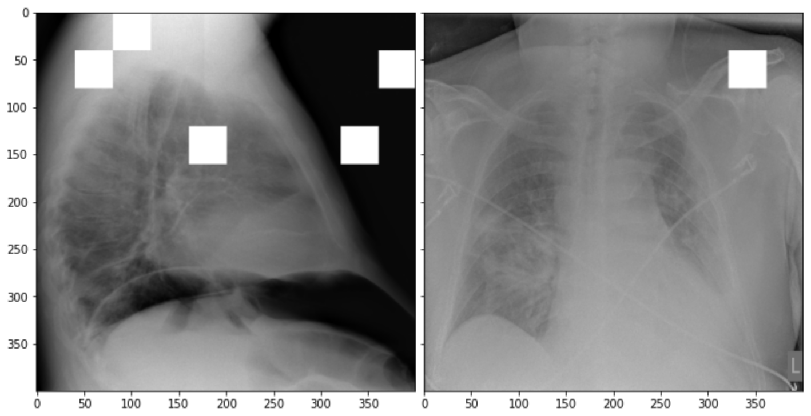
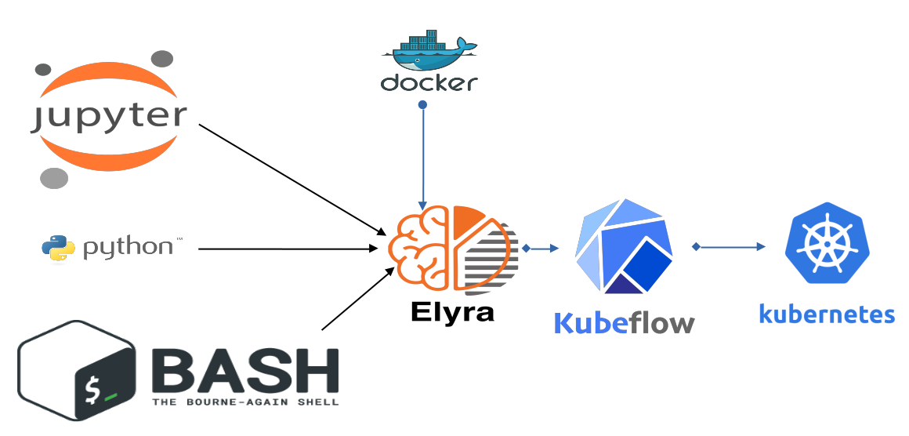
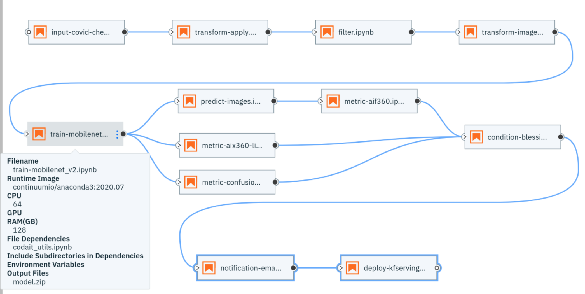
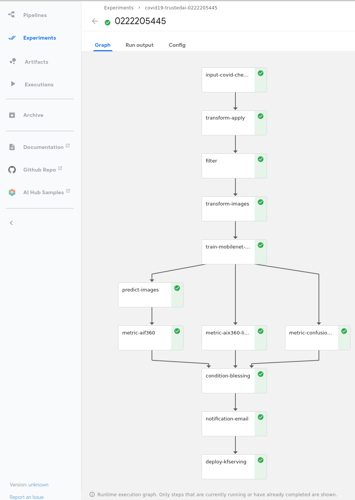
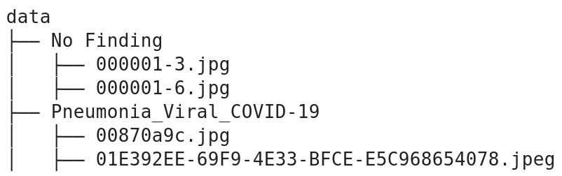
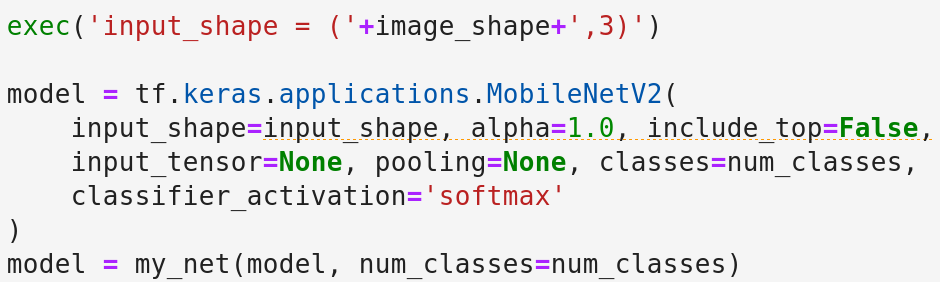

:author: Romeo Kienzler
:email: romeo.kienzler@ch.ibm.com
:institution: IBM, Center for Open Source Data and AI Technologies (CODAIT)

:author: Ivan Nesic
:email: ivan.nesic@usb.ch
:institution: University Hospital of Basel
:orcid: 0000-0002-4373-8860

---------------------------------------------------------------
CLAIMED, a visual and scalable component library for Trusted AI
---------------------------------------------------------------

.. class:: abstract

   CLAIMED is a component library for artificial intelligence, machine learning,
   "extract, transform, load" processes and data science.
   The goal is to enable low-code/no-code rapid prototyping by providing
   ready-made components for various business domains,
   supporting various computer languages, working on various data flow editors and
   running on diverse execution engines.
   To demonstrate its utility, we constructed a workflow composed exclusively of CLAIMED components.
   For this purpose, we made use of a publicly available CT scans dataset [covidata]_
   and created a deep learning model, which is supposed to classify exams as either
   COVID-19 positive or negative. The pipeline was built with Elyra's Pipeline Visual Editor,
   with support for local, Airflow and Kubeflow execution.

.. class:: keywords

    Kubernetes, Kubeflow, JupyterLab, Elyra, KFServing, TrustedAI,
    AI Explainability, AI Fairness, AI Adversarial Robustness

Introduction
============

Monolithic scripts are often used for prototyping, but for production deployments, we need tools like
Slurm [slurm]_, Snakemake [snakemake]_, QSub [qsub]_, HTCondor [htcondor]_, Apache Nifi [nifi]_,
NodeRED [nodered]_, KNIME [knime]_, Galaxy [galaxy]_, 
Reana [reana]_, WEKA [weka]_, Rabix [rabix]_, Nextflow [nextflow]_, OpenWDL [openwdl]_, CWL [cwl]_
or Cromwell [cromwell]_.
We found that these tools, even when used in conjunction, support only a subset of our requirements:

- low-code / no-code environment for rapid prototyping with visual editing and jupyter notebooks
- seamless scaling during development and deployment
- GPU support
- pre-build components for various business domains
- support for the complete python and R tooling including Apache Spark,
  TensorFlow, PyTorch, pandas and scikit-learn
- seamless extensibility
- reproducibility of work
- data lineage
- collaboration support

Therefore we have built an extensible component library to be used in low-code / no-code
environments called CLAIMED - the visual
**C**\ omponent **L**\ ibrary for **A**\rtificial **I**\nteligence (AI), **M**\achine Learning (ML),
**E**\xtract, Transform, Load (ETL) and **D**\ ata Science.
In the following section we elaborate on the implementation
details followed by a description of an exemplary pipeline to showcase
the capabilities of CLAIMED. We continue on to elaborate on different ideas
how CLAIMED can be improved in the "Future Work" section, finally followed by the conclusion.

Implementation
==============

Before we address how CLAIMED fulfills the previously defined requirements and how the
exemplary workflow has been constructed, we will introduce some terms and technologies.

Technology breakdown
--------------------

Containerization and Kubernetes
~~~~~~~~~~~~~~~~~~~~~~~~~~~~~~~

Virtualization opened up a lot of potential for managing the
infrastructure, mainly the ability to run different operating systems on
the same hardware at the same time. Next step of isolation can be
performed for each of the microservices running on the server, but
instead of managing access rights and resources on the host operating
system, we can containerize these in separate packages with their own
environments. Practical effect of this is that we are running each of
the microservices as if they have their own dedicated virtual machine,
but without the overhead of such endeavour. This is accomplished by
running containers on top of the host operating system. An example of
the containerization platform is Docker.

With the opportunity to run a vast number of containers, arose the need
of their orchestration. The system needs to be constantly monitored and adjusted so
that it stays in a desired state. Containers need to be scaled up and down,
the communication has to be managed, they have to be scheduled,
authentication needs to be managed, there is the need for load balancing etc.
There are multiple optins on the market, but Kubernetes is the market leader in this domain.
It was donated to Cloud Native Computing Foundation (CNCF) [cncf]_ by Google,
which means a lot of Google’s know-how and years of experience went into it.
The system can run on public, on-premises or on hybrid clouds.
On-premises installation is very important for institutions
dealing with sensitive data. For IBM, Kubernetes is also strategic. 
This is mainly because Kubernetes enables the hybrid cloud scenario 
backed by an open source common runtime capable of transparently moving workload
across different on-premises, remote and cloud data centers seamlessly.
Besides acting as a Kubernetes runtime provider in the cloud and - 
through the acquisition of RedHat - becoming the major vendor for 
on-premises Kubernetes, IBM is now able to deliver software solutions
- so called "Cloud Paks" - on top of Kubernetes, making them run everywhere.
Therefore, IBM joined CNCF [ibmcncf]_, moved all Watson Services to Kubernetes
and acquired RedHat. This makes IBM the 3rd largest committer to
Kubernetes.

Deep Learning with TensorFlow
~~~~~~~~~~~~~~~~~~~~~~~~~~~~~

TensorFlow is the second incarnation of the Google Brain project’s scalable
distributed training and inference system named DistBelief
[tf]_. It supports myriad of hardware platforms, from
mobile phones to GPU/TPU clusters, for both training and inference. It
can even train and run models in browser, without the data ever
leaving the user's environment. Apart from being a valuable tool in research domain, it is
also being used in demanding production environments. On a development
side, representing machine learning algorithms in tree-like structures
makes it a good expression interface. Lastly, on the performance vs
usability side, both graph and eager modes are supported. Eager mode allows for
easier debugging since the code is executed in Python control flow, as opposed to
the TensorFlow specific graph control flow [tfeager]_.
The advantages of graph mode is usage in distributed training, performance
optimization and production deployment.
In-depth analysis of these two modes can be found here [tfbook]_.

Kubeflow
~~~~~~~~

Kubeflow [kubeflow]_ is a machine learning pipeline management and execution system
running as first class citizen on top of Kubernetes. Beside making use
of Kubernetes scalability, it allows for reproducible work as machine
learning pipelines, the results and intermediate artifacts of the
executions are stored in a metadata repository.

Elyra
~~~~~~~~~~~~~~~~

Elyra [elyra]_ started as a set of extensions for the JupyterLab ecosystem.
Here we concentrate on the pipeline editor, which allows for
expression of machine learning workflows using a drag and drop editor and
send them for execution on top of different execution engines like Kubeflow or
Airflow. This means non-programmers can understand and create machine 
learning workflows on their own. Elyra also supports visualizing
such pipelines in the browser (e.g. from a github repository).

JupyterLab
~~~~~~~~~~

JupyterLab [jupyter]_ is one of the most popular development environments for data
science. Therefore Elyra started to support JupyterLab first. But the
pipeline editor of Elyra will be supported in other environments as
well, VSCode [vscode]_ being next on the list.

AI Explainability
~~~~~~~~~~~~~~~~~

Despite the good performance, deep learning models are viewed as
being black box approaches.
Technically, deep learning models are a series of non-linear feature
space transformations, but an intuitive understanding of each of the
individual processing steps is not trivial.
There are techniques with which we can look over a deep learning model’s shoulder.
The one we are using is called LIME [lime]_. LIME takes the
existing classification model and permutes images taken from the
validation set (therefore the real class label is known to LIME) as long as a
misclassification is happening. That way LIME can be used to create heat
maps as image overlays to indicate regions of images which are most
relevant for the classifier. In other words, we identify
regions of the image the classifier is looking at.

As Fig. :ref:`limefig` illustrates, the most relevant areas in an image
for classifying for COVID-19 are areas containing bones over lung tissue
which indicates a problem with that particular classifier.

   Example on how LIME helps to identify classification relevant
   areas of an image. :label:`limefig`

AI Fairness and Bias
~~~~~~~~~~~~~~~~~~~~

"Bias is a disproportionate weight in
favor of or against an idea or thing, usually in a way that is
closed-minded, prejudicial, or unfair" [bias]_. But what we want from 
our model is to be fair and unbiased towards protected attributes like 
race, age, socioeconomic status, religion and so on. So wouldn't
it be easier if we just "hid" those columns from the model during the training?
Unfortunately the problem is convoluted. Protected attributes are often
encoded inside the other attributes (latent features).
For example, race, religion and
socioeconomic status are latently encoded in attributes like zip codes,
contact methods or types of products purchased. Therefore, fairness assessment and
bias detection is quite challenging. Luckily, a huge number of single
number metrics exist to assess bias in data and models. Here, we are
using the AIF360 [aif360]_ library. IBM donated it to
the Linux Foundation AI, which puts it under open governance.

AI Adversarial Robustness
~~~~~~~~~~~~~~~~~~~~~~~~~

Another pillar of Trusted AI is adversarial robustness. For example, 
as researchers found out, adversarial noise can be introduced in data (data poisoning)
or models (model poisoning) to influence models decisions in favor of
the adversarial. Libraries like the Adversarial Robustness Toolbox
ART [art]_ support all state-of-the-art attacks and
defenses.

Requirements and System Architecture 
------------------------------------
In the following section we cover the system architecture and
it's requirements. There are two major components:
execution engine and integrated tools.

Execution Engine
~~~~~~~~~~~~~~~~
An execution engine takes a pipeline description and executes it on top
of physical machines, reads source data and creates output data.
The following requirements have been defined in order to assess the
adequacy of the execution engine.

- Kubernetes Support

  We defined Kubernetes as the lowest layer of abstraction because that
  way the executor layer is agnostic of the underlying Infrastructure as a service (IaaS)
  architecture. In addition, Kubernetes provides better resource utilization if multiple
  pipelines are run in parallel on the system. We can consume Kubernetes as a service (aaS)
  offered by a variety of Cloud providers like IBM, Amazon, Google, Microsoft, OVH or Linode.
  A lot of workload for this particular project has been envisioned to be outsourced
  to SciCore [scicore]_ - a scientific computing data center part of the Swiss Personalized
  Health Network (SPHN) [sphn]_ and the Swiss Institute of Bioinformatics [sib]_. Best to our knowledge,
  their cluster runs on OpenStack and provides Kubernetes as part of it (Magnum).
  University Hospital of Basel has on-premises RedHat OpenShift platform.

- GPU support

  GPU support is essential since a large fraction of the workload is
  training of deep learning neural networks with TensorFlow and PyTorch.
  Training those models on CPU doesn't make sense economically and
  ecologically.

- Component Library

  Predefined, ready to use components, are convenient to use,
  they save time and, if well tested, reduce the probability of an error.
  Kubeflow for example has components for parallel training of TensorFlow models (TFJob),
  parallel execution of Apache Spark jobs as a pipeline step,
  parallel hyperparameter tuning (Katib) and model serving (KFServing/
  KNative)

- Reproducibility

  From a legal point of view, in certain domains, it is
  necessary to reconstruct a certain decision, model or output
  dataset for verification and audit. Therefore the ability to reproduce
  and re-run a pipeline is a critical requirement. Of course,
  there are other examples where this is imperative, like in science.

- Data Lineage

  Although a subset of reproducibility, Data Lineage is a crucial
  feature when it comes to visualizing the changes the datasets went
  through during the pipeline execution.

.. table:: Fulfilment of requirements for execution engines. (Abbreviations: KF=Kubeflow, AF=Airflow, SM=Snakemake) :label:`engxreq`

    ================== == == ===== == ==== ======== =====
    Requirement        KF AF Slurm SM Qsub HTCondor Reana
    ================== == == ===== == ==== ======== =====
    Kubernetes Support X  X        X       X        X
    GPU support        X  X  X     X  X    X        X
    Component Library  X
    Reproducibility    X  X        X       X        X
    Data Lineage       X                            X
    ================== == == ===== == ==== ======== =====

Integrated tools
~~~~~~~~~~~~~~~~
Integrated tools are tools which include a visual data flow editor,
a component library and an execution engine.
Prominent candidates in the open source space are Apache Nifi,
NodeRED, KNIME and Galaxy.

The following additional requirements have been defined for a suitable
tool:

- Low-Code/No-Code/Visual Editing

  Citizen data scientists (in our demo example, medical doctors) need to
  work with the tool, so visual editing is necessary. But apart from
  being a visual editing tool, support for creating custom
  pipeline components on the fly using R and python is necessary
  as well.

- Jupyter Notebooks

  Researchers in general like to implement tasks in jupyter notebooks.
  This makes support for JupyterLab, as well as having an
  easy way of making Jupyter notebooks part of the data processing pipeline,
  a key requirement.

.. table:: Fulfilment of requirements for integrated tools. :label:`toolxreq`

    ================== ==== ======= ===== ====== =====
    Requirement        Nifi NodeRED KNIME Galaxy Elyra
    ================== ==== ======= ===== ====== =====
    Kubernetes Support                    X      X
    GPU support                           X      X
    Component Library  X    X       X     X      X
    Reproducibility    X            X     X      X
    Data Lineage       X                  X      X
    Visual Editing     X    X       X     X      X
    Jupyter Notebooks                            X
    ================== ==== ======= ===== ====== =====

Final technology choice
~~~~~~~~~~~~~~~~~~~~~~~
As it can be seen from the tables :ref:`engxreq` and :ref:`toolxreq`,
only Kubeflow on the execution engine side, and Elyra as the
integrated tool are capable of covering all of the requirements.
Therefore we select this pair as our primary technology choice.

Elyra's pipeline editor supports drag and drop functionality, for adding arbitrary
scripts (shell, R, python) and Jupyter notebooks to the canvas.
Each script gets a container image assigned to be executed in.
At the moment, Elyra supports pipeline submissions to Airflow and Kubeflow.

Together with Kubeflow and JupyterLab (where Elyra runs as an extension),
all our requirements are fulfilled.

   Runtime architecture of CLAIMED. :label:`architecture`

As it can be seen on Figure :ref:`architecture`, Elyra -  specifically
the pipeline editor of the Elyra Extension to JupyterLab - allows
for visually building data pipelines with a set of assets like
notebooks and scripts dragged onto a canvas and transparently published
to Kubeflow, as a Kubeflow pipeline.

The only thing missing is a set of re-usable notebooks for different
kinds of tasks and this is where CLAIMED comes in. We've published CLAIMED
as an open source library [complib]_. In the next sections we
will introduce the demo use case, along with how components found in CLAIMED
have been used to implement this pipeline.

System Implementation and Demo Use Case
=======================================

A TrustedAI image classification pipeline
-----------------------------------------

As mentioned, pipelines are a great way to introduce
reproducibility, scaling, auditability and collaboration in machine
learning. Pipelines are often a central part of a MLOps strategy. This
holds for TrustedAI pipelines too, since reproducibility and
auditability are even more important in this case. Figure :ref:`pipeline`
illustrates the exemplary TrustedAI pipeline we have built using the
component library and Figure :ref:`kfp` is a screenshot taken from
Kubeflow displaying the pipeline after finishing it’s run.

   The exemplary TrustedAI pipeline for the health care use case. :label:`pipeline`

Pipeline Components
-------------------

This section exemplifies each existing category with at
least one component which has been used for this particular pipeline. 
There are also other components that are not part of the pipeline,
so they haven't been shown here.
Please note that the core feature of our software is threefold:

- the CLAIMED component library
- Elyra with it's capability to use CLAIMED to create a pipeline 
  and push it to Kubeflow
- the pipeline itself

Input Components
~~~~~~~~~~~~~~~~

There are input components for different types
of data source, like files and databases.

In this particular case, we’re pulling data directly from the GitHub
repository via a public and permanent link [covidata]_. We only pull the
metadata.csv and images directory.

   The pipeline once executed in Kubeflow. :label:`kfp`

Transform Components
~~~~~~~~~~~~~~~~~~~~

Sometimes, transformations on the metadata, or any other structured
dataset, are necessary. Therefore, we provide a generic transformation
component - in the example, we just used it to change to format of the
categories as the original file contained forward slashes which made it
hard to use on the underlying operating system. This is performed by
simply specifying a column name and a function that is to be applied.

Filter Components
~~~~~~~~~~~~~~~~~

Similar to changing content of rows in a dataset, removing rows is also
a common task in data engineering. The filter stage allows doing exactly that.
It is enough to provide a predicate - specifically for our case the
predicate ``~metadata.filename.str.contains('.gz')`` removes invalid
images.

Image Transformer Components
~~~~~~~~~~~~~~~~~~~~~~~~~~~~

   Example of directory structure supported by TensorFlow Dataset API. :label:`imgdir`

One supported standard for the conversion of image datasets into the TensorFlow's
dataset supported format, is to organize images into directories representing
their classes [tfimgprep]_. TensorFlow Dataset is an API that
allows for a convenient way to create datasets from various input data,
apply transformations and preprocessing steps and make iteration over
the data easier and memory efficient [tfdataset]_.

In our example, the data isn’t in the required format. It is organized as
a directory full of images and alongside it is a CSV file which defines the
attributes. Available attributes are exam finding, sex and age,
from which we only require the finding for our example.
The images are then arranged by following the previously
described directory structure, as illustrated by Fig. :ref:`imgdir`.
After performing this step, the data can be consumed by the Tensorflow Dataset API.

Training Components
~~~~~~~~~~~~~~~~~~~

Understanding, defining and training deep learning models is not a simple task.
Training a deep learning image classification model requires a
properly designed neural network architecture. Luckily, the community
trends towards predefined model architectures, which are parameterized
through hyper-parameters. At this stage, we are using the MobileNetV2, a
small deep learning neural network architecture with the set of the most
common parameters. It ships with the TensorFlow distribution - ready to
use, without any further definition of neurons or layers. As shown in
figure :ref:`trainingstage`, only a couple of parameters
need to be specified.

Although possible, hyper-parameter search is not considered in this
processing stage. The rason being, we want to make use of Kubeflow’s hyper-parameter
search capabilities leveraged through Katib [katib]_ in
the future.

   Source code of the wrapped training component. :label:`trainingstage`

Evaluation Components
~~~~~~~~~~~~~~~~~~~~~

A model needs to be evaluated before it
goes into production. Evaluating classification performance against the
target labels has been a common metric since the early days of machine learning,
therefore we have also developed evaluation components, with confusion matrix
support for instance. But taking TrustedAI measures into account is a newly emerging practice.
Therefore, components for AI Fairness, AI Explainability [aix360]_ and AI
Adversarial Robustness have been also added to the component library.

Blessing Components
~~~~~~~~~~~~~~~~~~~

In Trusted AI (but not limited to) it is important to obtain a blessing of assets like
generated data, model or report to be published and used by other
subsystems or humans. Therefore, a blessing component uses the results
of the evaluation components to decide if the assets are ready for
publishing.

Publishing Components
~~~~~~~~~~~~~~~~~~~~~

Depending on the asset type, publishing means either persisting a dataset to
a data store, deploying a machine learning model for consumption
of other subsystems, or publishing a report to be consumed by humans.
Here, we exemplify this category by a KFServing [kfserving]_ component which
publishes the trained TensorFlow deep learning model to Kubernetes.
KFServing, on top of KNative, is particularly interesting as it draws from
Kubernetes capabilities, like canary deployment and scalability (including
scale to zero), in addition to built-in Trusted AI functionality.

Future Work
===========
We have financial support to add functionality to CLAIMED in multiple
dimensions. Below we give a summary of the next steps.

Extend component library
------------------------

To this date, at least one representative component for each category has
been released. Components are added to the library on a regular basis. 
The components due to be published are: Parallel Tensorflow Training with
TFJob, Parallel Hyperparameter Tuning with Katib and Parallel Data
Processing with Apache Spark.

Component exporter for Kubeflow
-------------------------------

Containerizing notebooks and scripts is a frequent task in the data science community.
In our environment, this involves attaching the arbitrary assets,
like jupyter notebooks and scripts, to a container image and then
transpiling a Kubeflow component out of it.
We are currently in the process of implementing a tool that would facilitate this workflow.
The name of the tool is C3 [c3]_, and it stands for CLAIMED component compiler.

Import/Export of components to/from Galaxy
------------------------------------------
As seen in Table 2,
Galaxy covers a majority of our requirements already.
Unfortunately, Galaxy components - called "tools" - are very skewed 
towards genomics.
Adding new components and extending functionality onto other domains would make
the tool interesting for a wider audience.
Reverse is also true, the existing component library Galaxy is extensive,
well established and tested. It makes sense to automatically transpile
those tools as components into CLAIMED. We are currently looking into
adding import/export support between CLAIMED and Galaxy into C3.

UX improvements of the Elyra pipeline editor
--------------------------------------------

The components are isolated, so only explicitly shared information can be put into context for
all of them. In order for the components' executor, e.g. Kubflow, to do this,
it must be provided a configuration. We envision for Elyra to automatically deduce
interesting parameters from the code and from the environment, upon which it would create
dynamic forms. For example, fields like checkboxes and dropdowns where one can select
input and output files mentioned in the code. Currently, only environment variables
are provided in a rudimentary UI with one text field per variable.
One proposal is to introduce an optional configuration block to the scripts and notebooks.
It would then be interpreted by Elyra and the appropriate UI would be rendered.

One successful example of such implementation is Galaxy's UI [galaxy_ui]_.
A complex UI behavior is expressed by XML configuration. So we are also exploring an
option of either using Galaxy's XML Schema or defining a new one and support the
transformation from one into the other.

Add CWL support to the Elyra pipeline editor
--------------------------------------------

CWL is a powerful workflow expression language supported already by
various tools we've evaluated. Currently, Elyra uses its own, 
proprietary pipeline representation format. Addin support of CWL to Elyra would
improve interoperability between different software components. 
For example, Reana, execution engine used in the particle physics community, and Galaxy
partially already support CWL. This means it would be possible export
pipelines from Elyra to Reana, without the need of transpiling the pipeline.
Alternatively, Elyra could integrate export and import of CWL into its pipeline editor.

Import 3rd party component libraries
------------------------------------
Since the only thing needed for something to become a CLAIMED component
is to be wrapped in a container image and assigned some meta data,
it is possible for 3rd party component libraries like those from KNIME or
Nifi and to be imported into CLAIMED.
This also holds true for Kubeflow components.
It is also possible to wrap different components from KNIME, Nifi or
similar tools in this manner and use it within Elyra, as well as in
the other execution engines CLAIMED supports.

Create more (exemplary) pipelines
---------------------------------
At the moment, CLAIMED ships with three exemplary pipelines. The health
care inspired TrustedAI pipeline which was covered in this paper,
a pipeline to visualize and predict soil temperature from a historic
data set and an IoT sensor data analysis pipeline. The next pipeline
in line is a genomics pipeline for the Swiss Institute of
Bioinformatics affiliates University Hospital Berne/Berne University
and potentially for particle physics at CERN.

Conclusion
==========
We’ve build a trustable, low-code, scalable and open source
component library, targeting visual data pipeline systems. We've
showcased the library's capabilities by building a domain specific pipeline
on  Elyra, an emerging visual pipeline editor and running it on widely used
Kubeflow execution engine. We believe that future import/export functionality of
CLAIMED will improve reproducibility of data centric work even further.

References
----------

.. [art] Maria-Irina Nicolae, Mathieu Sinn, Minh Ngoc Tran, Beat Buesser, Ambrish Rawat, Martin Wistuba, Valentina Zantedeschi, Nathalie Baracaldo, Bryant Chen, Heiko Ludwig, Ian M. Molloy, Ben Edwards *Adversarial Robustness Toolbox*, arXiv:1807.01069, November 2019

.. [aif360] Rachel K. E. Bellamy et al. *AI Fairness 360: An Extensible Toolkit for Detecting, Understanding, and Mitigating Unwanted Algorithmic Bias*, arXiv:1810.01943, October 2018

.. [aix360] Vijay Arya et al. One Explanation Does Not Fit All: A Toolkit and Taxonomy of AI Explainability Techniques, arXiv:1909.03012, September 2019

.. [bias] Steinbock, Bonnie (1978). *Speciesism and the Idea of Equality*, Philosophy, 53 (204): 247–256, doi:10.1017/S0031819100016582

.. [cncf] Cloud Native Computing Foundation, https://www.cncf.io. Last accessed 18 Feb 2021

.. [complib] https://github.com/elyra-ai/component-library

.. [elyra] Elyra AI, https://github.com/elyra-ai. Last accessed 18 Feb 2021

.. [kubernetes] David Bernstein et al. *Containers and Cloud: From LXC to Docker to Kubernetes*, IEEE Cloud Computing (Volume: 1, Issue: 3), September 2014) 

.. [jupyter] Thomas Kluyver et al. *Jupyter Notebooks – a publishing format for reproducible computational workflows*, Positioning and Power in Academic Publishing: Players, Agents and Agendas, 87-90, doi:10.3233/978-1-61499-649-1-87, 2016

.. [kfserving] Clive Cox and Dan Sun and Ellis Tarn and Animesh Singh and Rakesh Kelkar and David Goodwin, *Serverless inferencing on Kubernetes*,  Workshop on "Challenges in Deploying and Monitoring Machine Learning System" at ICML 2020 

.. [lime] Marco Tulio Ribeiro et al. *"Why Should I Trust You?": Explaining the Predictions of Any Classifier*, Proceedings of the 22nd ACM SIGKDD International Conference on Knowledge Discovery and Data Mining, San Francisco, CA, USA, pp. 1135–1144 (2016), doi:10.1145/2939672.2939778

.. [kubeflow] Debo Dutta and Xinyuan Huang, *Consistent Multi-Cloud AI Lifecycle Management with Kubeflow*, OpML, 2019

.. [katib] George et al. *A Scalable and Cloud-Native Hyperparameter Tuning System*, arXiv:2006.02085, June 2020

.. [tf] Martín Abadi et al. *TensorFlow: Large-Scale Machine Learning on Heterogeneous Distributed Systems*, arXiv:1603.04467v2, March 2016

.. [ibmcncf] IBM joining CNCF, https://developer.ibm.com/technologies/containers/blogs/ibms-dedication-to-open-source-and-its-involvement-with-the-cncf Last accessed 18 Feb 2021

.. [ect] https://github.com/cloud-annotations/elyra-classification-training/tree/developer_article

.. [slurm] https://slurm.schedmd.com/documentation.html

.. [snakemake] https://snakemake.github.io/

.. [qsub] https://en.wikipedia.org/wiki/Qsub

.. [htcondor] https://research.cs.wisc.edu/htcondor/

.. [galaxy] Enis Afgan et al. *The Galaxy platform for accessible, reproducible and collaborative biomedical analyses: 2018 update*, Nucleic Acids Research, (46):W537-W544, doi:10.1093/nar/gky379, July 2018

.. [reana] Tibor Šimko et al. *REANA: A System for Reusable Research Data Analyses*, 23rd International Conference on Computing in High Energy and Nuclear Physics (CHEP 2018), (214):06034, doi:10.1051/epjconf/201921406034, September 2019

.. [nifi] https://nifi.apache.org/

.. [nodered] https://nodered.org/

.. [knime] https://www.knime.com/

.. [weka] https://www.cs.waikato.ac.nz/ml/weka/

.. [rabix] https://rabix.io/

.. [nextflow] https://www.nextflow.io/

.. [openwdl] https://openwdl.org/

.. [cwl] https://www.commonwl.org/

.. [cromwell] https://cromwell.readthedocs.io/en/stable/

.. [covidata] Joseph Paul Cohen et al. *COVID-19 Image Data Collection: Prospective Predictions Are the Future*, arXiv:2006.11988, 2020

.. [tfeager] https://www.tensorflow.org/guide/eager/

.. [tfdataset] https://www.tensorflow.org/api_docs/python/tf/data/Dataset

.. [tfimgprep] https://www.tensorflow.org/api_docs/python/tf/keras/preprocessing/image_dataset_from_directory

.. [galaxy_ui] https://github.com/bgruening/galaxytools/blob/c1027a3f78bca2fd8a53f076ef718ea5adbf4a8a/tools/sklearn/pca.xml#L75

.. [c3] https://github.com/romeokienzler/c3

.. [tfbook] https://www.oreilly.com/library/view/whats-new-in/9781492073727/

.. [vscode] https://code.visualstudio.com/

.. [scicore] https://scicore.unibas.ch/

.. [sphn] https://sphn.ch/

.. [sib] https://www.sib.swiss/
