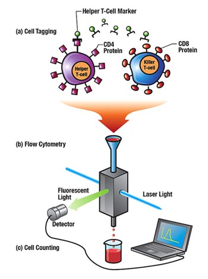
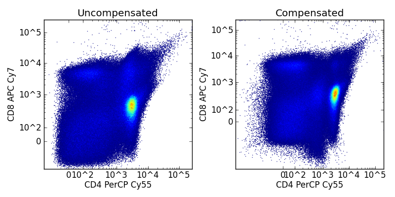
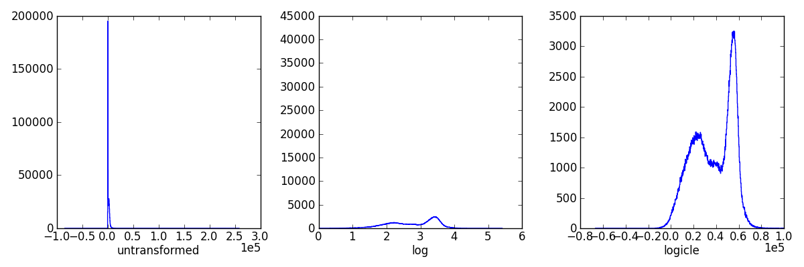
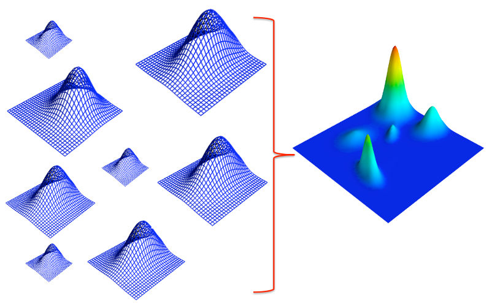
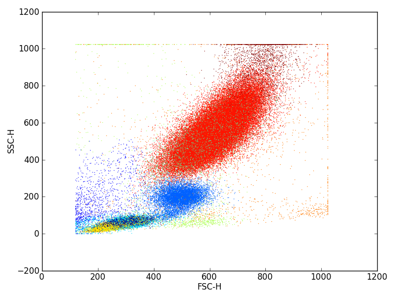
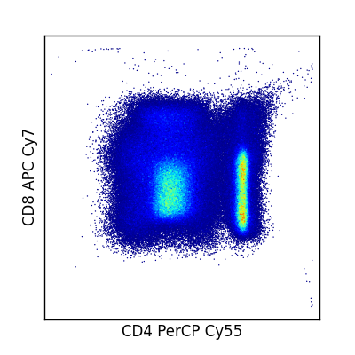

:author: Jacob Frelinger
:email: jacob.frelinger@duke.edu
:institution: Duke University

:author: Adam Richards
:email: adam.richards@duke.edu
:institution: Duke University

:author: Cliburn Chan
:email: cliburn.chan@duke.edu
:institution: Duke University

-----------------------------------------
Fcm - A python library for flow cytometry
-----------------------------------------

.. class:: abstract

   Flow cytometry has the ability to measure multiple parameters of a
   heterogeneous mix of cells at single cell resolution.  This has lead flow
   cytometry to become an integral tool in immunology and biology.  Most flow
   cytometry analysis is performed in expensive proprietary software packages,
   and few opensource tool exist for working with flow cytometry data.
   In this paper we present `fcm`, an BSD licensed python library for
   traditional gating based analysis in addition to newer model based analysis
   methods.

.. class:: keywords

   Flow Cytometry, Model-based Analysis, Automation, Biology, Immunology

Introduction
------------

.. background on flow

Flow cytometry (FCM) has become an integral tool in immunology and biology due to the
ability of FCM to measure cell properties at the single cell level for
thousands to millions of cells in a high throughput manner.  In FCM,
cells are typically labeled with monoclonal antibodies to cell surface
or intracellular proteins. The monoclonal antibodies are conjugated to
different fluorochromes that emit specific wavelengths of light when
excited by lasers. These cells are then streamed single file via a
capillary tube where they may be excited by multiple lasers. Cells
scatter the laser light in different ways depending on their size and
granularity, and excited fluorochromes emit light of characteristic
wavelengths.  Scattered light is recorded in forward and side scatter detectors,
and specific fluorescent emission light is recorded into separate
channels.  Since each fluorescent dye is attached to specific cell markers by
monoclonal antibodies, the intensity of emitted light is a measure of the
number of bound antibodies of that specificity [Herzenberg2006]_ . The
data recorded for each cell is known as an event, although events may
sometimes also represent cell debris or clumps.
Modern instruments can resolve about a dozen fluorescent emissions
simultaneously and hence measure the levels of a dozen different
markers per cell - further increase in resolution is limited by the
spectral overlap (spillover) between fluorescent dyes.

.. traditional gating based analysis and other tools
.. ie the why of fcm

   
   Diagram of how events are recorded in a flow cytometer provided by
   lanl.gov :label:`flow`

Analysis of FCM data has traditionally relied on expert interpretation
of scatter plots known as dot plots that show the scattered light or
fluorescence intensity for each cell depicted as a point. Expert
operators examine these two dimensional dot plots in sequence and
manually define boundaries around cell subsets of interest in each
projection. The regions demarcated by these boundaries are known as
gates, and the cell subsets of interest may require multiple levels of
gates to identify.  Much work is needed train expert operators to
standardize gate placement and minimize variance. Maecker et al [Maecker2005]_ found
a significant source of variability in a multi-center study was due to
variability in gating.  New technologies have the potential to greatly
increase the number of simultaneous markers that can be resolved
with FCM.  Inductively coupled plasma mass spectrometry [Ornatsky2006]_ replaces the
fluorescent dyes with stable heavy metal isotopes and fluorescent detection
with mass spectrometry.  This eliminates the spectral overlap (spillover) from
fluorescent dyes allowing a significantly increased number of markers to be
resolved simultaneously.

With the increasing number of markers that can be resolved
simultaneously, there has been an increasing interest in automated methods of
cell subset identification. While there is need for such tools, with the
exception of the R BioConductor package, few open source
packages exist for doing both traditional analysis and automated analysis.
The majority of open source packages simply extract flow events into
tabular/csv formats, losing all metadata and providing no additional tools for
analysis.  `fcm` attempts to resolve this by providing methods for working
with flow data in both gating-based and model-based methods.  

.. write project goals

The goals in writing `fcm`  [fcm]_ are to provide a general-purpose python library for working with
flow cytometry data.  Targeted uses include interactive data exploration with
[ipython]_, building pipelines for batch data analysis, and
development of GUI and web based applications.  In this paper we will explore
the basics of working with flow cytometry data using `fcm` and how to use fcm
to perform analysis using both gating and model based methods.

Loading, compensating and transforming data
-------------------------------------------

.. basics of loading and fcmdata object

Flow cytometry samples that have been prepared and run through a flow cytometer
generate flow cytometry standard (FCS) files, consisting of metadata about the
sample,  the reagents and instrument used, together with the scatter and
fluorescent values for each event captured in the sample acquisition.  These
binary FCS files are then used to perform quality control and analysis of the
data, typically with specialized proprietary software.

In `fcm`, the `loadFCS()` function will read in version 2 or 3 FCS files and
return a `FCMdata` object.  `FCMdata` objects contain the recorded scatter and
fluorescent marker values for each event in an underlying numpy array, along
with the associated metadata stored in the FCS file. In the FCS specification,
metdata is stored in separate text, header and analysis sections in the
original FCS file,  and these can be accessed within a `FCMdata` instance from
`FCMdata.notes.text`, `FCMdata.notes.header`, and `FCMdata.notes.analysis`
respectively using either attribute or dictionary lookup conventions. The
`FCMdata` object provides a few methods to directly manipulate the event data
extracted from the FCS file, but mostly simply delegates to the underlying
numpy array storing the event data matrix. Conveniently, this allows `FCMdata`
objects to perform numpy array methods, such as `mean()` or `std()`, and
also allows `FCMdata` objects to be passed to functions expecting numpy arrays.
In addition to traditional numpy array indexing, the text names of channels can
be used to access channels too.

.. code-block:: python
        
        In [1]: import numpy as np

        In [2]: import fcm

        In [3]: x = fcm.loadFCS('62851.fcs')

        In [4]: x.channels[7]
        Out[4]: 'AViD'
        
        In [5]: np.all(x[:,7] == x[:,'AViD'])
        Out[5]: True
        

When processing cells and acquiring data, often the emission spectra of
fluorescent dyes overlap with neighboring channels.  This spillover of light
needs to be corrected in a process called compensation that attempts
to remove the additional signal from neighboring channels.  Using a
compensation matrix that describes the amount of spillover from each channel
into others, `fcm` will by default apply compensation at the time of
loading data, but this default behavior can be suppressed and
compensation performed at a later time if necessary. The spillover or compensation
matrix is typically found in the `FCMdata.notes.text` metadata,  and `loadFCS()` will
default to compensating using that matrix if another is not specified.

   Compensation changes the data via matrix multiplication operation to reduce the spillover from other
   markers into each channel and can improve the resolution of individual cell
   populations. :label:`compfig`

Since FCM fluorescent data typically approximately follows a lognormal
distribution, data is often transformed
into log or log-like scales.  `fcm` supports both log transforms and logicle
[Parks2005]_ transforms as methods of `FCMdata` objects.  `loadFCS()` will
default to the logicle transform if the data is on the correct scale, that is
if P#R value in the text segment is 262144. Figure :ref:`transformfig` illustrates the
effects that transforming has on the distribution of events in each
fluorescent channel.

   Illustration of the effects of logicle and log transform on CD3 AmCyan
   fluorescent from a FCS file from the EQAPOL data set.
   :label:`transformfig`

Gating Analysis
---------------

In gating based analysis, the objective is to identify specific cellular
subsets by sequentially drawing boundary regions, called gates, in a succession
of one dimensional and two dimensional plots to select the cellular subsets of
interest.  Each successive gate captures increasingly specific cellular
subsets.  Once the required populations have been identified, summary
statistics, typically mean or frequency, can easily be computed to compare
with other populations.

`fcm` provides several gating objects to assist in traditional gating analysis
of FCS files.  Gate objects provided by `fcm` include `PolygonGate`, defining a
region of interest by a set of vertices of the boundary of the region,
`QuadrantGate`, dividing a two-dimensional projection into four quadrants
defined by the point of intersection of all four quadrants, `ThresholdGate`, a
region defined by all points above or below a point in a single parameter, and
an `IntervalGate`, the set of points between two points in a single parameter.
In addition to traditional gates, `fcm` provides additional gate like filters,
`DropChannel`, to remove unwanted columns from a view, and `Subsample`, that
use a python slice objects to filter events.  `FCMdata` objects `gate()` method can be
used to apply gate objects in successive manner as it returns the updated
`FCMdata` object allowing chaining of `gate()` calls, like so: 

.. code-block:: python

        FCMdata.gate(g1).gate(g2).gate(g3)

which is equivalent to the following three lines of code:

.. code-block:: python

        FCMdata.gate(g1)
        FCMdata.gate(g2)
        FCMdata.gate(g3)

In `fcm`, gating `FCMdata` object does not produce new `FCMdata` objects, but
rather each `FCMdata` object maintains a tree of each gated populations.
Moving between nodes of the tree, accomplished by the `FCMdata.visit()`
method, selects which events are retured on array lookup, using `numpy`'s efficient
indexing to generate views.  This allows `FCMdata` objects to contain an entire
analysis in a single object and reduces the need to keep multiple large high
dimensional arrays in memory.

Model Based Analysis
---------------------

As a result of the increasing dimensionality of FCM data resulting from
technological advances, manual analysis is increasingly complex and
time-consuming. Therefor there is much interest in finding automated methods of
analyzing flow data.  Model based analysis is an approach to automate and
increase reproducibility in the analysis of flow data by the use of statistical
models fitted to the data.  With the appropriate multivariate statistical
models, data fitting can be naturally performed on the full dimensionality,
allowing analysis to scale well with the increasing number of parameters in
flow cytometry. Mixture models are one such model based method.  Mixture models
are often chosen due to their ability to use multiple simpler distributions
added together to describe a much more complex distribution as seen in figure
:ref:`mixturemodel`.

    Mixture models are comprised of multiple simpler distributions.  These
    simpler distributions are added together to describe more complex
    distributions.  Using these simpler distributions, in this case
    multivariate normal distributions, it becomes possible to describe
    very complex distributions.
    :label:`mixturemodel`

`fcm` provides several model based methods for identifying cell subsets, the
simplest method being k-means classification, and more advanced methods based
on the use of mixtures of Gaussians for data fitting.  The general procedure
for fitting a data set to a statistical model consists of creating a
`FCMmodel` object containing hyper-parameters, followed by calling its `fit`
method on a collection of (or just one) `FCMdata` objects to generate 
`ModelResult` objects. Each `ModelResult` object holds the estimated parameters of
the statistical model -- a `KMeans` object representing the centroid locations
in a k-means model, or a `DPMixture` object representing the estimated
weights, means and covariances for Gaussian mixture models.  These objects can
then be used to classify arbitrary datasets or to explore the estimated model
parameters.

Gaussian mixture models describe events as coming from a mixture of multiple
multivariate Gaussian distributions, where an event :math:`x` comes from each
Gaussian component with probability :math:`\pi_i`, the weight.  Hence the overall
probability is

.. math::

        p(x|\pi, \mu, \sigma) = \sum_{i=1}^{k} \pi_i N(x|\mu_i, \sigma_i)

where N is a Gaussian, and :math:`x` can be assigned to the Gaussian component
with the highest probability.  `fcm` provides two related mixture models to
fit data from the [dpmix]_ package, which is capable of using [gpustats]_ to
utilize GPU cards for efficient estimation of mixture parameters.  The two
models are `DPMixtureModel` and `HDPMixtureModel`, describing a truncated
Dirichlet process mixture model, and a hierarchical truncated Dirichlet
process mixture model.  

`DPMixtureModel` has two methods of estimating parameters of the model for a
given dataset, the first using Markov chain monte carlo (MCMC) and the second
using Bayesian expectation maximization (BEM).  Sensible defaults for
hyperparameters have been chosen that in our experience perform satisfactorily
on all FCS data samples we have analyzed.

.. code-block:: python
   :linenos:

   import fcm
   import fcm.statistics as stats
   import pylab

   #load FCS file
   data = fcm.loadFCS('3FITC_4PE_004.fcs')

   #ten component model fit using BEM for
   # 100 iterations
   dpmodel = stats.DPMixtureModel(10, niter=100,
       type='BEM')
   
   # estimate parameters printing every 10 iterations
   results = dpmodel.fit(data,verbose=10)
   
   #assign data to components
   c = results.classify(data)
   
   # plot data coloring by label
   pylab.scatter(data[:,0], data[:,1], c=c,
       s=1, edgecolor='none')

   pylab.xlabel(data.channels[0])
   pylab.ylabel(data.channels[1])
   
   
The above code labels each event by color to the cluster it belongs to as seen in
figure :ref:`bem`

    Events in a sample data set clustered by DPMixtureModel using Bayesian EM
    :label:`bem`

`HDPMixtureModel` fits multiple data sets simultaneously so as to identify a
hierarchical model that fits all datasets such that component means and
covariance are common to all fitted samples but the weights of components are
specific for each sample.  Since `HDPMixtureModel` estimates multiple datasets
simultaneously, a list of `DPMixture` objects is returned corresponding to
each of the `FCMdata` objects passed to `HDPMixureMode.fit()`.  

Visualization
-------------

By using packages like [matplotlib]_ it becomes easy to recreate the typical
plots flow cytometry analysts are used to seeing.  Convenience functions for
several common plot types have been included in the `fcm.graphics` sub-package.
The common pseudocolor dotplot is handled by the function
`fcm.graphics.pseudocolor()` 

.. code-block:: python
    :linenos:

    import fcm
    import fcm.graphics as graph
    x = fcm.loadFCS('B6901GFJ-08_CMV pp65.fcs')
    graph.pseudocolor(x, [('CD4 PerCP Cy55','CD8 APC Cy7')])

The above code produces the plot like that seen in figure :ref:`heatmap`

    Pseudo-color heatmap produced by `fcm.graphics.heatmap` function showing
    CD4 versus CD8. :label:`heatmap`

Another common plot is overlay histograms, which is provided by
`fcm.graphics.hist()`

.. code-block:: python
    :linenos:

    import fcm
    import fcm.graphics as graph
    from glob import glob
    xs =[fcm.loadFCS(x) for x in glob('B6901GFJ-08_*.fcs')]
    graph.hist(xs,3, display=True)

The code above will produce the histogram seen in figure :ref:`hist`

.. figure:: hist.png

    Overlay histogram of three samples from the EQAPOL data set. :label:`hist`

More examples of flow cytometry graphics can be seen in the gallery at
http://packages.python.org/fcm/gallery.

Conclusion and future work
--------------------------

..   Used internally for data analysis by cytostream
..   Used for exploratory data analysis of data sets from HIV/AIDS, cancer and solid-organ transplantation studies
..   Used for pipelined analysis of data from Duke CFAR, EQAPOL and CIMT programs
..   Future - mass flow, imaging flow, time series analysis
..   Continued integration with flow standards - e.g. GatingML, new 3.1 and 4.0 containers
..   etc

Currently `fcm` is approaching its 1.0 release, providing a stable API for
development and we feel `fcm` is ready for wider usage in the scientific community.
Internally we use `fcm` for EDA for data sets from HIV/AIDS, caner, and
solid-organ transplantation studies.  In addition we have developed pipelines
for batch analysis of large numbers of FCS files from the Duke Center for AIDS
Research, External Quality Assurance Program Oversight Laboratory (EQAPOL),
and the Association for Cancer Immunotherapy (CIMT). We have also developed a
graphical tool to assist immunologist to perform model based analysis
[cytostream]_.  Our hope is that `fcm` can fill a need in the biomedical
community and facilitate the growth of python as a tool suited for scientific
programming.

With the growing complexity of flow cytometry data, we foresee an increased
need for computational tools.  Current mass-spec based flow cytometers are
capable of resolving many more parameters than current fluorescent based
cytometers, necessitating improved tools for analysis.  Imaging cytometers,
which take digital images of events as they pass through the detection apparatus,
will also produce a wealth of additional information about each event based on
analyzing the images generated.  These technologies will necessitate improved
tools to analyze data generated by these newer cytometers.  Our hope is that
`fcm` can meet these needs and continue to grow to address these needs, with
specific goals of developing tools to facilitate cross sample comparison and
time series of flow data.  

The next generation of the FCS file standard, Analytical Cytometry
Standard,  has been proposed, using NetCDF as the format for event storage.
The ACS file will be a container allowing storage of much more than the
current FCS limitations of event and textual metadata.  Thanks to the
availability of several good libraries for dealing with NetCDF, and the
associated xml and image files proposed to be included in the ACS container,
adding support for the finalized version of ACS standard should not be
difficult.    Gating-ML, an XML format proposed with ACS for describing gates and thier
placement, has been gaining popularity.  We are exploring how best to
implement readers and writers for Gating-ML    

Acknowledgements
----------------

We are thankful to Kent Weinhold and the Duke SORF flow core, and the
statistics group led by Mike West at Duke University for many helpful
discussions.  Research supported by National Institutes of Health
(RC1AI086032-01, UL1RR024128 Cliburn Chan).

References
----------
.. [fcm] Frelinger J, Richards A, Chan C, http://code.google.com/p/py-fcm/

.. [Herzenberg2006] Herzenberg LA, Tung J et al (2006),
                *Interpreting flow cytometry data: a guide for the perplexed*,
                Nat Immunol 7(7):681-685 
.. [Maecker2005] Maecker HT, Frey T et al (2007),
                *Standardization of cytokine flow cytometry assays*,
                BMC Immunol 6:13

.. [Ornatsky2006] Ornatsky O, Baranov VI et al (2006),
                *Multiple cellular antigent detection by ICP-MS*,
                J Immunol Methods 308(1-2):68-76

.. [ipython] Pérez F, Granger BE, IPython: A System for
                Interactive Scientific Computing, Computing in Science and
                Engineering, vol. 9, no. 3, pp. 21-29, May/June 2007,
                doi:10.1109/MCSE.2007.53. URL: http://ipython.org

.. [Parks2005] Parks, D. R., Roederer, M. and Moore, W. A. (2006),
                *A new “Logicle” display method avoids deceptive effects
                of logarithmic scaling for low signals and compensated data*,
                Cytometry, 69A: 541–551. doi: 10.1002/cyto.a.20258

.. [dpmix] Cron A, https://github.com/andrewcron/dpmix

.. [gpustats] Cron A and McKinney W, https://github.com/dukestats/gpustats

.. [matplotlib] Hunter JD, (2007), *Matplotlib: A 2D Graphics
                Environment*, Computing in Science & Engineering 9, 90 (2007)

.. [cytostream] Richards A, http://code.google.com/p/cytostream/
