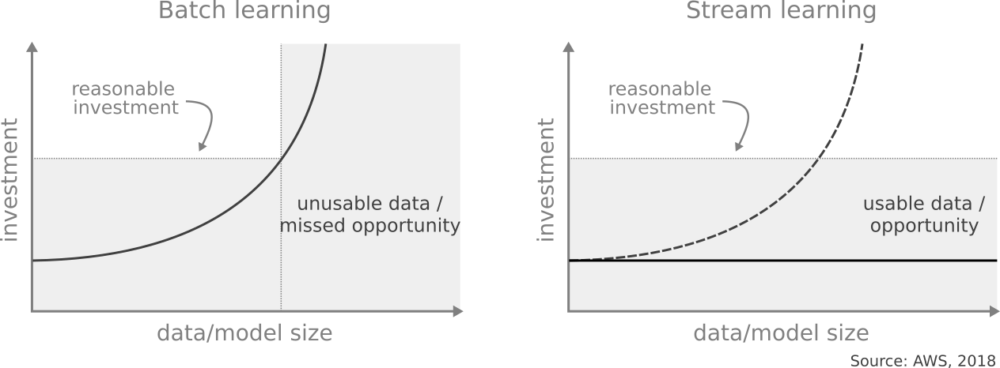
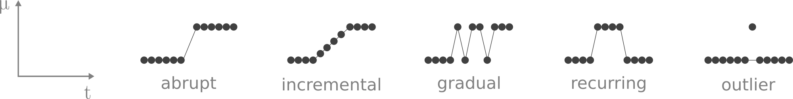
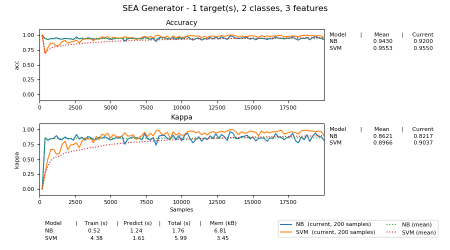
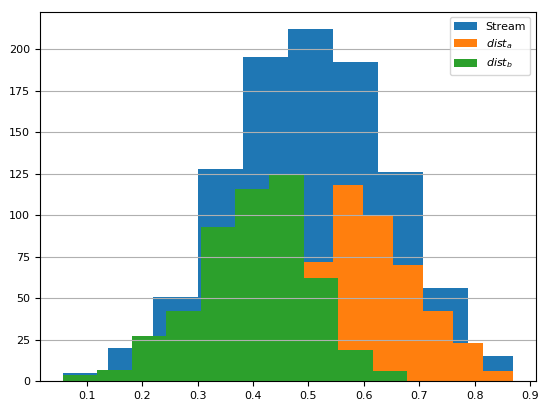
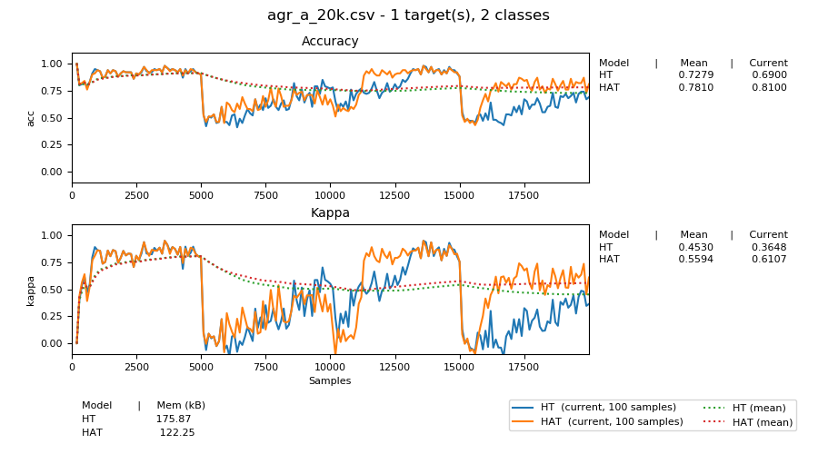

:author: Jacob Montiel
:email: jacob.montiel@waikato.ac.nz
:institution: Department of Computer Science, University of Waikato
:orcid: 0000-0003-2245-0718

:bibliography: bibliography

:video: https://youtu.be/sw85SCv847Y

-----------------------------------
Learning from evolving data streams
-----------------------------------

.. class:: abstract

   Ubiquitous data poses challenges on current machine learning systems to store, handle and analyze data at scale.
   Traditionally, this task is tackled by dividing the data into (large) batches. Models are trained on a data batch
   and then used to obtain predictions.  As new data becomes available, new models are created which may contain
   previous data or not. This training-testing cycle is repeated continuously. Stream learning is an active field where
   the goal is to learn from infinite data streams. This gives rise to additional challenges to those found in the
   traditional batch setting: First, data is not stored (it is infinite), thus models are exposed only once to single
   samples of the data, and once processed those samples are not seen again. Models shall be ready to provide
   predictions at any time. Compute resources such as memory and time are limited, consequently, they shall be carefully
   managed. The data can drift over time and models shall be able to adapt accordingly.
   This is a key difference with respect to batch learning, where data is assumed static and models will fail in the
   presence of change. Model degradation is a side-effect of batch learning in many real-world applications requiring
   additional efforts to address it. This papers provides a brief overview of the core concepts of machine learning for
   data streams and describes scikit-multiflow, an open-source Python library specifically created for machine
   learning on data streams. scikit-multiflow is built to serve two main purposes: easy to design and run
   experiments, easy to extend and modify existing methods.

.. class:: keywords

   machine learning, data streams, concept drift, scikit, open-source

Introduction
------------

The minimum pipeline in machine learning is composed of: (1) data collection and processing, (2) model training, and
(3) model deployment. Conventionally, data is collected and processed in batches. Although this approach is
state-of-the-art in multiple applications, it is not suitable in the context of evolving data streams. The batch
learning approach assumes that data is sufficiently large and accessible. This is not the case in streaming data where
data is available one sample at a time, and storing it is impractical given its (theoretically) infinite nature.
In addition, non-stationary environments require to run the pipeline multiple times in order to minimize model
degradation, in other words maintain optimal performance. This is especially challenging in fast-changing environments
where efficient and effective adaptation is vital.

As a matter of fact, multiple real-world machine learning applications exhibit the characteristics of evolving data
streams, in particular we can mention:

- Financial markets generate huge volumes of data daily. For instance, the New York Stock Exchange captures 1
  terabyte of information each day [#]_. Depending on the state of such markets and multiple external factors data
  can become obsolete quickly rendering it useless for creating accurate models. Predictive models must be
  able to adapt fast to be useful in this dynamic environment.
- Predictive maintenance. The contribution of IoT to the digital universe is substantial. Data only from embedded
  systems accounted for 2% of the world’s data in 2013, and is expected to hit 10% by 2020 [#]_. IoT sensors are used to
  monitor the health of multiple systems, from complex systems such as airplanes to simpler ones such as household
  appliances. Predictive systems are required to react fast to prevent disruptions from malfunctioning elements.
- Online fraud detection. The speed of reaction of an automatic system is also an important factor in multiple
  applications. As a case in point, VisaNet has a capacity (as of June 2019) to handle more than 65,000 transactions
  per second [#]_. Fraud detection in online banking involves additional challenges beside data collection and
  processing. Fraud detection systems must adapt quickly to changes such as consumer behavior (for example during
  holidays), the stability of the financial markets, as well as the fact that attackers constantly change their
  behavior to beat these systems.
- Supply chain. Several sectors use automatic systems in their supply chain to cope with the demand for products
  efficiently. However, the COVID-19 pandemic brought to attention the fragility of these systems to sudden changes,
  e.g., in less than 1 week, products related to the pandemic such as face masks filled the top 10 searched terms in
  Amazon [#]_. Many automatic systems failed to cope with change resulting in the disruption in the supply chain.
- Climate change. Environmental science data is a quintessential example of the five *v*'s of big data: volume,
  velocity, variety, veracity, and value. In particular, NASA’s Earth Science Data and Information System project, holds
  24 petabytes of data in its archive and distributed 1.3 billion files in 2017 [#]_. Understanding environmental data
  has many implications in our daily lives, e.g., food production can be severally impacted by climate change,
  disruption of the water cycle has resulted in a rise of heavy rains with the associated risk of floodings. IoT sensors
  are now making environmental data available at a faster rate and machine learning systems must adapt to this new norm.

.. [#] How Big Data Has Changed Finance, Trevir Nath, Investopedia, June 2019.
.. [#] The Digital Universe of Opportunities: Rich Data and the Increasing Value of the Internet of Things, IDC, April 2014.
.. [#] Visa fact sheet, July 2019.
.. [#] Our weird behavior during the pandemic is messing with AI models. Will Douglas Heaven. MIT Technology Review. May 11, 2020.
.. [#] Big data goes green, Neil Savage, Nature Index 2018 Earth and Environmental Sciences, June 2018

   Batch learning systems are characterized by the investment in resources like memory and training time as the volume
   of data increases. Once a *reasonable investment threshold* is reached, data becomes unusable turning into a missed
   opportunity. On the other hand, efficient management of resources makes stream learning an interesting alternative
   for big data applications. :label:`fig:investment`

As shown in the previous examples, dynamic environments pose an additional set of challenges to batch learning systems.
Model degradation is a predominant problem in multiple real-world applications. As enough data has been generated and
collected, proactive users might decide to train their models to make sure that they agree with the current data. This
is complicated for two reasons: First, batch models (in general) are not able to use new data into account, so the
machine learning pipeline must be run multiples times as data is collected over time. Second, the decision for such an
action is not trivial and involves multiple aspects. For example, should a new model be trained only on new data? This
depends on the amount of variation in the data. Small variations might not be enough to justify retraining and
re-deploying a model. This is why a reactive approach is predominantly employed in the industry. Model degradation is
monitored and corrective measures are enforced if a user-defined threshold is exceeded (accuracy, type I, and type II
errors, etc.). Fig. :ref:`fig:investment` depicts another important aspect to consider, the tradeoff between the
investment in resources such as memory and time (and associated cost) and the pay-off in predictive performance. In
stream learning, resource-wise efficiency is fundamental, predictive models not only must be accurate but also must be
able to handle theoretically infinite data streams. Models must fit in memory no matter the amount of data seen
(constant memory). Additionally, training time is expected to grow sub-linearly with respect to the volume of data
processed. New samples must be processed as soon as they become available so it is vital to process them as fast as
possible to be ready for the next sample in the stream.

Machine learning for streaming data
-----------------------------------

Formally, the task of supervised learning from evolving data streams is defined as follows. Consider a stream of data
:math:`S=\{(\vec{x}_t,y_t)\} | t = 1,\ldots,T` where :math:`T \rightarrow \infty`. Input :math:`\vec{x}_t` is a feature
vector and :math:`y_t` the corresponding target where :math:`y` is continuous in the case of regression and discrete
for classification. The objective is to predict the target :math:`\hat{y}` for an unknown sample :math:`\vec{x}`. For
illustrative purposes, this paper focuses on the classification task.

In stream learning, models are trained incrementally, one sample at a time, as new samples :math:`(\vec{x}_t,y_t)`
become available. Since streams are theoretically infinite, the training phase is non-stop and predictive models are
continuously updating their internal state in agreement with incoming data. This is fundamentally different from the
batch learning approach, where models have access to all (available) data during training. As previously mentioned, in
the stream learning paradigm, predictive models must be resource-wise efficient. For this purpose, a set of requirements
:cite:`Bifet2011DataStreamMining` must be fulfilled by streaming methods:

- **Process one sample at a time, and inspect it only once.** The assumption is that there is not enough time nor
  space to store multiple samples, failing to meet this requirement implies the risk of missing incoming data.
- **Use a limited amount of memory.** Data streams are assumed infinite, thus storing data for further processing is
  impractical.
- **Work in a limited amount of time.** In other words, avoid bottlenecks generated by time-consuming tasks which in
  the long run could make the algorithm fail.
- **Be ready to predict at any point.** Stream models are continuously *updated* and must be able to provide predictions
  at any point in time.

Concept drift
+++++++++++++

A challenging element of dynamic environments is the chances that the underlying relationship between features
:math:`X` and target(s) :math:`\vec{y}` can evolve (change) over time. This phenomenon is known as **Concept Drift**.
Real concept drift is defined as changes in the posterior distribution of the data :math:`p(\vec{y}|X)`. Real concept
drift means that the unlabeled data distribution does not change, whereas data evolution refers to the unconditional
data distribution :math:`p(X)`. In batch learning, the joint distribution of data :math:`p(X,\vec{y})` is, in general,
assumed to remain stationary. In the context of evolving data streams, concept drift is defined between two points in
time :math:`t_o, t_1` as

   Drift patterns depicted as the change of mean data values over time. Note that an outlier is not a change but
   *noise* in the data. This figure is based on :cite:`Gama2014Survey`. :label:`fig:driftpatterns`

.. math::

   p_{t_0}(X,\vec{y}) \neq p_{t_1}(X,\vec{y})

Concept drift is known to harm learning  :cite:`Gama2014Survey`. The following patterns, shown in Fig.
:ref:`fig:driftpatterns`, are usually considered:

- **Abrupt.** When a new concept is immediately introduced. The transition between concepts is minimal. In this case,
  adaptation time is vital since the old concept becomes is no longer valid.
- **Incremental.** It can be interpreted as the transition from an old concept into a new concept where intermediate
  concepts appear during the transition.
- **Gradual.** When old and new concepts concur within the transition period. It can be challenging since both concepts
  are somewhat valid during the transition.
- **Recurring.** If an old concept is seen again as the stream progresses. For example, when the data corresponds to a
  periodic phenomenon such as the circadian rhythm.
- **Outliers.** Not to be confused with true drift. A drift detection method must be robust to noise, in other words,
  minimize the number of false positives in the presence of outliers or noise.

Although the continuous learning nature of stream methods provides some robustness to concept drift, specialized methods
have been proposed to detect drift. Multiple methods have been proposed in the literature, :cite:`Gama2014Survey`
provides a thorough survey of this topic. In general, the goal of drift detection methods is to accurately detect
changes in the data distribution while showing robustness to noise and being resources-wise efficient.
Drift-aware methods use specialized detection mechanisms to react faster and efficiently to drift. For example, the
*Hoeffding Tree* algorithm :cite:`Domingos2000HT`, a kind of decision tree for data streams, does not handle concept
drift explicitly, whereas the *Hoeffding Adaptive Tree* :cite:`Bifet2009HAT` uses *ADaptive WINdowing* (*ADWIN*)
:cite:`Bifet2007ADWIN` to detect drifts. If a drift is detected at a given branch, an alternate branch is created and
eventually replaces the original branch if it shows better performance on new data.

*ADWIN*, a popular drift detection method with mathematical guarantees, keeps a variable-length window of recent items;
guaranteeing that there has been no change in the data distribution within the window. Internally, two sub-windows
:math:`(W_0, W_1)` are used to determine if a change has happened. With each new item observed, the average values of
items in :math:`W_0` and :math:`W_1` are compared to confirm that they correspond to the same distribution. If the
distribution equality no longer holds, then an alarm signal is raised indicating that drift has occurred. Upon
detecting a drift, :math:`W_0` is replaced by :math:`W_1` and a new :math:`W_1` is initialized.

Performance evaluation
++++++++++++++++++++++

Predictive performance :math:`P` of a given model :math:`h` is usually measured using some loss function :math:`\ell`
that evaluates the difference between expected (true) class labels :math:`y` and the predicted class labels
:math:`\hat{y}`.

.. math::

   P(h) = \ell(y,\hat{y})

A popular and straightforward loss function for classification is the *zero-one loss function* which corresponds to the
notion of whether the model made a mistake or not when predicting.

.. math::

   \ell(y,\hat{y}) = \begin{cases} 0, & y = \hat{y} \\
                                  1, & y \neq \hat{y}
                     \end{cases}

Due to the incremental nature of stream leaning methods, special considerations are used to evaluate their performance.
Two prevalent methods in the literature are *holdout* :cite:`kohavi1995cv` and *prequential*
:cite:`dawid1984prequential` evaluation. Holdout evaluation is a popular method in both batch and stream learning where
testing is performed on an independent set of samples. On the other hand, prequential evaluation, is specific to the
stream setting. In prequential evaluation, tests are performed on new data samples *before* they are used to train
(update) the model. The benefit of this approach is that all samples are used for both test and training.

This is just a brief overview of machine learning for streaming data. However, it is important to mention that the
field of machine learning for streaming data covers other tasks such as regression, clustering, anomaly detection, to
name a few. We direct the reader to :cite:`Gomes2017` for an extensive and deeper description of this field, the
state-of-the-art, and its active challenges.

The scikit-multiflow package
----------------------------

scikit-mutliflow :cite:`skmultiflow` is a machine learning library for multi-output/multi-label and stream data written
in Python. Developed as free and open-source software and distributed under the BSD 3-Clause
License. Following the **SciKits** philosophy, scikit-multiflow extends the existing set of tools for scientific
purposes. It features a collection of state-of-the-art methods for classification, regression, concept drift detection
and anomaly detection, alongside a set of data generators and evaluators. scikit-multiflow is designed to seamlessly
interact with *NumPy* :cite:`NumPy` and *SciPy* :cite:`SciPy`. Additionally, it contributes to the democratization of
stream learning by leveraging the popularity of the Python language. scikit-multiflow is mainly written in Python, and
some core elements are written in *Cython* :cite:`Cython` for performance.

scikit-multiflow is intended for users with different levels of expertise. Its conception and development follow two
main objectives:

1. Easy to design and run experiments. This follows the need for a platform that allows fast prototyping and
   experimentation. Complex experiments can be easily performed using evaluation classes. Different data streams and
   models can be analyzed and benchmarked under multiple conditions, and the amount of code required from the
   user is kept to the minimum.
2. Easy to extend existing methods. Advanced users can create new capabilities by extending or modifying existing
   methods. This way users can focus on the details of their work rather than on the overhead when working
   from scratch

scikit-multiflow is not intended as a stand-alone solution for machine learning. It integrates with other Python
libraries such as *Matplotlib* :cite:`Matplotlib` for plotting, *scikit-learn* :cite:`scikit-learn`  for incremental
learning [#]_ compatible with the streaming setting, *Pandas* :cite:`Pandas` for data manipulation, *Numpy* and *SciPy*
for numerical and scientific computations. However, it is important to note that scikit-multiflow does not extend
*scikit-learn*, whose main focus in on batch learning. A key difference is that estimators in scikit-multiflow are
incremental by design and training is performed by calling multiple times the :code:`partial_fit()` method. The
majority of estimators implemented in scikit-multiflow are instance-incremental, meaning single instances are used to
update their internal state. A small number of estimators are batch-incremental, where mini-batches of data are used.
On the other hand, calling :code:`fit()` multiple times on a scikit-learn estimator will result in it overwriting its
internal state on each call.

.. [#] Only a small number of methods in scikit-learn are incremental.

As of version 0.5.0, the following sub-packages are available:

- :code:`anomaly_detection`: anomaly detection methods.
- :code:`data`: data stream methods including methods for batch-to-stream conversion and generators.
- :code:`drift_detection`: methods for concept drift detection.
- :code:`evaluation`: evaluation methods for stream learning.
- :code:`lazy`: methods in which generalization of the training data is delayed until a query is received, e.g.,
  neighbors-based methods such as kNN.
- :code:`meta`: meta learning (also known as ensemble) methods.
- :code:`neural_networks`: methods based on neural networks.
- :code:`prototype`: prototype-based learning methods.
- :code:`rules`: rule-based learning methods.
- :code:`transform`: perform data transformations.
- :code:`trees`: tree-based methods,

In a nutshell
-------------

In this section, we provide a quick overview of different elements of scikit-multiflow and show how to easily define
and run experiments in scikit-multiflow. Specifically, we provide examples of classification and drift detection.

Architecture
++++++++++++

Here we describe the basic components of scikit-multiflow. The ``BaseSKMObject`` class is the base class. All estimators
in scikit-multiflow are created by extending the base class and the corresponding task-specific mixin(s):
``ClassifierMixin``, ``RegressorMixin``, ``MetaEstimatorMixin`` and ``MultiOutputMixin``.

The ``ClassifierMixin`` defines the following methods:

* ``partial_fit`` -- Incrementally train the estimator with the provided labeled data.
* ``fit`` -- Interface used for passing training data as batches. Internally calls ``partial_fit``.
* ``predict`` -- Predict the class-value for the passed unlabeled data.
* ``predict_proba`` -- Calculates the probability of a sample pertaining to a given class.

During a learning task, three main tasks are performed: data is provided by the stream, the estimator is trained on
incoming data, the estimator performance is evaluated. In scikit-multiflow, data is represented by the ``Stream``
class, where the ``next_sample()`` method is used to request new data. The ``StreamEvaluator`` class provides an easy
way to set-up experiments. Implementations for holdout and prequential evaluation methods are available. A stream
and one or more estimators can be passed to an evaluator.

Classification task
+++++++++++++++++++

In this example, we will use the SEA generator. A stream generator does not store any data but generates it on demand.
The ``SEAGenerator`` class creates data corresponding to a binary classification problem. The data contains 3 numerical
features, from which only 2 are relevant for learning [#]_. We will use the data from the generator to train a
Naive Bayes classifier. For compactness, the following examples do not include import statements, and external
libraries are referenced by standard aliases.

As previously mentioned, a popular method to monitor the performance of stream learning methods is the prequential
evaluation. When a new data sample ``(X, y)`` arrives: 1. Predictions are obtained for the new data sample (X) to
evaluate how well the model performs. 2. Then the new data sample ``(X, y)`` is used to train the model so it updates
its internal state. The prequential evaluation can be easily implemented as a loop:

.. [#] Some data generators and estimators use random numbers generators. When set, the ``random_state`` parameter enforces reproducible results.

.. code-block:: python

   stream = SEAGenerator(random_state=1)
   classifier = NaiveBayes()

   n_samples = 0
   correct_cnt = 0
   max_samples = 2000

   # Prequential evaluation loop
   while n_samples < max_samples and \
   stream.has_more_samples():
       X, y = stream.next_sample()
       # Predict class for new data
       y_pred = classifier.predict(X)
       if y[0] == y_pred[0]:
           correct_cnt += 1
       # Partially fit (train) model with new data
       classifier.partial_fit(X, y)
       n_samples += 1

   print('{} samples analyzed.'.format(n_samples))
   print('Accuracy: {}'.format(correct_cnt / n_samples))

   > 2000 samples analyzed.
   > NaiveBayes classifier accuracy: 0.9395

The previous example shows that the Naive Bayes classifier achieves an accuracy of 93.95% after processing all the
samples. However, learning from data streams is a continuous task and a best-practice is to monitor the performance of
the model at different points of the stream. In this example, we use an instance of the ``Stream`` class as it provides
the ``next_sample()`` method to request data and the returned data is a tuple of ``numpy.ndarray``. Thus, the above
loop can be easily modified to read from other data structures such as ``numpy.ndarray`` or ``pandas.DataFrame``. For
real-time applications where data is actually represented as a stream (e.g. Google's protocol buffers), the ``Stream``
class can be extended to wrap the necessary code to interact with the stream.

   Performance comparison between ``NaiveBayes`` and ``SGDClassifier`` using the ``EvaluatePrequential``
   class. :label:`fig:prequential`

The prequential evaluation method is implemented in the ``EvaluatePrequential`` class. This class provides extra
functionalities including:

- Easy setup of different evaluation configurations
- Selection of different performance metrics
- Visualization of performance over time
- Ability to benchmark multiple models concurrently
- Saving evaluation results to a csv file

We can run the same experiment on the SEA data. This time we compare two classifiers: ``NaiveBayes`` and
``SGDClassifier`` (linear SVM with SGD training). We use the ``SGDClassifier`` in order to demonstrate the
compatibility with incremental methods from scikit-learn.

.. code-block:: python

   stream = SEAGenerator(random_state=1)
   nb = NaiveBayes()
   svm = SGDClassifier()
   # Setup the evaluation
   metrics = ['accuracy', 'kappa',
              'running_time', 'model_size']
   eval = EvaluatePrequential(show_plot=True,
                              max_samples=20000,
                              metrics=metrics)
   # Run the evaluation
   eval.evaluate(stream=stream, model=[nb, svm],
                        model_names=['NB', 'SVM']);

We set two metrics to measure predictive performance: accuracy and kappa statistics :cite:`cohen1960coefficient` (for
benchmarking classification accuracy under class imbalance, compares the models accuracy against that of a random
classifier). During the evaluation, a dynamic plot displays the performance of both estimators over the stream, Fig.
:ref:`fig:prequential`. Once the evaluation is completed, a summary is displayed in the terminal. For this example and
considering the evaluation configuration::

   Processed samples: 20000
   Mean performance:
   NB - Accuracy     : 0.9430
   NB - Kappa        : 0.8621
   NB - Training time (s)  : 0.56
   NB - Testing time  (s)  : 1.31
   NB - Total time    (s)  : 1.87
   NB - Size (kB)          : 6.8076
   SVM - Accuracy     : 0.9560
   SVM - Kappa        : 0.8984
   SVM - Training time (s)  : 4.70
   SVM - Testing time  (s)  : 1.73
   SVM - Total time    (s)  : 6.43
   SVM - Size (kB)          : 3.4531

In Fig. :ref:`fig:prequential`, we observe the evolution of both estimators as they are trained on data from the stream.
Although ``NaiveBayes`` has better performance at the beginning of the stream, ``SGDClassifier`` eventually outperforms
it. In the plot we show performance at multiple points, measured by the given metric (accuracy, kappa, etc.) in two
ways: *Mean* corresponds to the average performance on all data seen previously, resulting in a smooth line. *Current*
indicates the performance over a sliding window with the latest data from the stream, The size of the sliding window can
be defined by the user and is useful to analyze the 'current' performance of an estimator. In this experiment, we also
measure resources in terms of time (training + testing) and memory. ``NaiveBayes``is faster and uses slightly more
memory. On the other hand, ``SGDClassifier`` is slower and has a smaller memory footprint.

Concept drift detection
+++++++++++++++++++++++

For this example, we will generate a synthetic data stream. The first 1000 samples of the stream contain a sequence
from a normal distribution with :math:`\mu_a=0.8`, :math:`\sigma_a=0.05`, followed by 1000 samples from a normal
distribution with :math:`\mu_b=0.4`, :math:`\sigma_b=0.2`, and the last 1000 samples from a normal distribution with
:math:`\mu_c=0.6`, :math:`\sigma_c=0.1`. The distribution of data in the described synthetic stream is shown in Fig.
:ref:`fig:drift`.

   Synthetic data simulating a drift. The stream is composed by two distributions of 500 samples. :label:`fig:drift`

   Benchmarking the Hoeffding Tree vs the Hoeffding Adaptive Tree on presence of drift. :label:`fig:trees`

.. code-block:: python

   random_state = np.random.RandomState(12345)
   dist_a = random_state.normal(0.8, 0.05, 1000)
   dist_b = random_state.normal(0.4, 0.02, 1000)
   dist_c = random_state.normal(0.6, 0.1, 1000)
   stream = np.concatenate((dist_a, dist_b, dist_c))

We will use the ADaptive WINdowing (ADWIN) drift detection method. The goal is to detect that drift has occurred after
samples 1000 and 2000 in the synthetic data stream.

.. code-block:: python

   drift_detector = ADWIN()

   for i, val in enumerate(stream_int):
      drift_detector.add_element(val)
      if drift_detector.detected_change():
         print('Change detected at index {}'.format(i))

         drift_detector.reset()

   > Change detected at index 1055
   > Change detected at index 2079

Impact of drift on learning
+++++++++++++++++++++++++++

Concept drift can have a significant impact on predictive performance if not handled properly. Most batch models will
fail in the presence of drift as they are essentially trained on different data. On the other hand, stream learning
methods continuously update themselves and can adapt to new concepts. Furthermore, drift-aware methods use change
detection methods to trigger mitigation mechanisms if a change in performance is detected.

In this example, we compare two popular stream models: the ``HoeffdingTreeClassifier``, and its drift-aware version,
the ``HoeffdingAdaptiveTreeClassifier``.

For this example, we will load the data from a csv file using the ``FileStream`` class. The data corresponds to the
output of the ``AGRAWALGenerator`` with 3 gradual drifts at the 5k, 10k, and 15k marks. A gradual drift means that the
old concept is gradually replaced by a new one, in other words, there exists a transition period in which the two
concepts are present.

.. code-block:: python

   stream = FileStream("agr_a_20k.csv")
   ht = HoeffdingTreeClassifier(),
   hat = HoeffdingAdaptiveTreeClassifier()
   # Setup the evaluation
   metrics = ['accuracy', 'kappa', 'model_size']
   eval = EvaluatePrequential(show_plot=True,
                              metrics=metrics,
                              n_wait=100)
   # Run the evaluation
   eval.evaluate(stream=stream, model=[hy, hat],
                 model_names=['HT', 'HAT']);

The summary of the evaluation is::

   Processed samples: 20000
   Mean performance:
   HT - Accuracy     : 0.7279
   HT - Kappa        : 0.4530
   HT - Size (kB)          : 175.8711
   HAT - Accuracy     : 0.8070
   HAT - Kappa        : 0.6122
   HAT - Size (kB)          : 122.0986

The result of this experiment is shown in Fig. :ref:`fig:trees`. During the first 5K samples, we see that both methods
behave in a very similar way, which is expected as the ``HoeffdingAdaptiveTreeClassifier`` essentially works as the
``HoeffdingTreeClassifier`` when there is no drift. At the 5K mark, the first drift is observable by the sudden drop in
the performance of both estimators. However, notice that the ``HoeffdingAdaptiveTreeClassifier`` has the edge and
recovers faster. The same behavior is observed after the drift in the 15K mark. Interestingly, after the drift at 10K,
the ``HoeffdingTreeClassifier`` is better for a small period but is quickly overtaken. In this experiment, we can also
see that the *current* performance evaluation provides richer insights on the performance of each estimator. It is
worth noting the difference in memory between these estimators. The ``HoeffdingAdaptiveTreeClassifier`` achieves better
performance while requiring less space in memory. This indicates that the branch replacement mechanism triggered by
ADWIN has been applied, resulting in a less complex tree structure representing the data.

Real-time applications
++++++++++++++++++++++

We recognize that previous examples use static synthetic data for illustrative purposes. However, the goal is to
work on real-world streaming applications where data is continuously generated and must be processed in real-time. In
this context, scikit-multiflow is designed to interact with specialized streaming tools, providing flexibility to the
users to deploy streaming models and tools in different environments. For instance, an IoT architecture on an
edge/fog/cloud computing environment is proposed in :cite:`cao2019`. This architecture is designed to capture, manage,
process, analyze, and visualize IoT data streams. In this architecture, scikit-multiflow is the stream machine learning
library inside the processing and analytics block.

In the following example, we show how we can leverage existing Python tools to interact with dynamic data. We use
*Streamz* [#]_ to get data from Apache Kafka. The data from the stream is used to incrementally train, one sample at a
time, a ``HoeffdingTreeClassifier`` model. The output on each iteration is a boolean value indicating if the model
correctly classified the last sample from the stream.

.. [#] https://github.com/python-streamz/streamz

.. code-block:: python

   from streamz import Stream
   from skmultiflow.trees import HoeffdingTreeClassifier

   @Stream.register_api()
   class extended(Stream):
       def __init__(self, upstream, model, **kwargs):
           self.model = model
           super().__init__(upstream, **kwargs)

       def update(self, x, who=None):
           # Tuple x represents one data sample
           # x[0] is the features array and
           # x[1] is the target label
           y_pred = self.model.predict(x[0])
           # incrementally learn the current sample
           self.model.partial_fit(x[0], x[1])
           # output indicating if the model
           # correctly classified the sample
           self._emit(y_pred == x[1])

   s_in = Stream.from_kafka(**config)
   ht = HoeffdingTreeClassifier()

   s_learn = s.map(read).extended(model=ht)
   out = s_learn.sink_to_list()

   s_in.start()

Alternatively, we could define two nodes, one for training and one for predicting. In this case, we just need to make
sure that we maintain the *test-then-train* order.

Get scikit-multiflow
++++++++++++++++++++

scikit-multiflow work with Python 3.5+ and can be used on Linux, macOS, and Windows. The source code is publicly
available in GitHub. The stable release version is available via ``conda-forge`` (recommended) and ``pip``:

.. code-block:: console

   $ conda install -c conda-forge scikit-multiflow

   $ pip install -U scikit-multiflow

The latest development version is available in the project's repository:
https://github.com/scikit-multiflow/scikit-multiflow. Stable and development versions are also available as ``docker``
images.

Conclusions and final remarks
-----------------------------

In this paper, we provide a brief overview of machine learning for data streams. Stream learning is an alternative to
standard batch learning in dynamic environments where data is continuously generated (potentially infinite) and data is
non-stationary but evolves (concept drift).  We present examples of applications and describe the challenges and
requirements of machine learning techniques to be used on streaming data effectively and efficiently.

We describe scikit-multiflow, an open-source machine learning library for data streams in Python. The design
of scikit-multiflow is based on two principles: to be easy to design and run experiments, and to be easy to extend and
modify existing methods. We provide a quick overview of the core elements of scikit-multiflow and show how it can be
used for the tasks of classification and drift detection.

Acknowledgments
---------------

The author is particularly grateful to Prof. Albert Bifet from the Department of Computer Science at the University of
Waikato for his continuous support. We also thank Saulo Martiello Mastelini from the Institute of Mathematics and
Computer Sciences at the University of São Paulo, for his active collaboration on scikit-multiflow and his valuable
work as one of the maintainers of the project. We thank interns who have helped in the development of scikit-multiflow
and the open-source community which motivates and contributes in the continuous improvement of this project. We
gratefully acknowledge the reviewers from the SciPy 2020 conference for their constructive comments.
