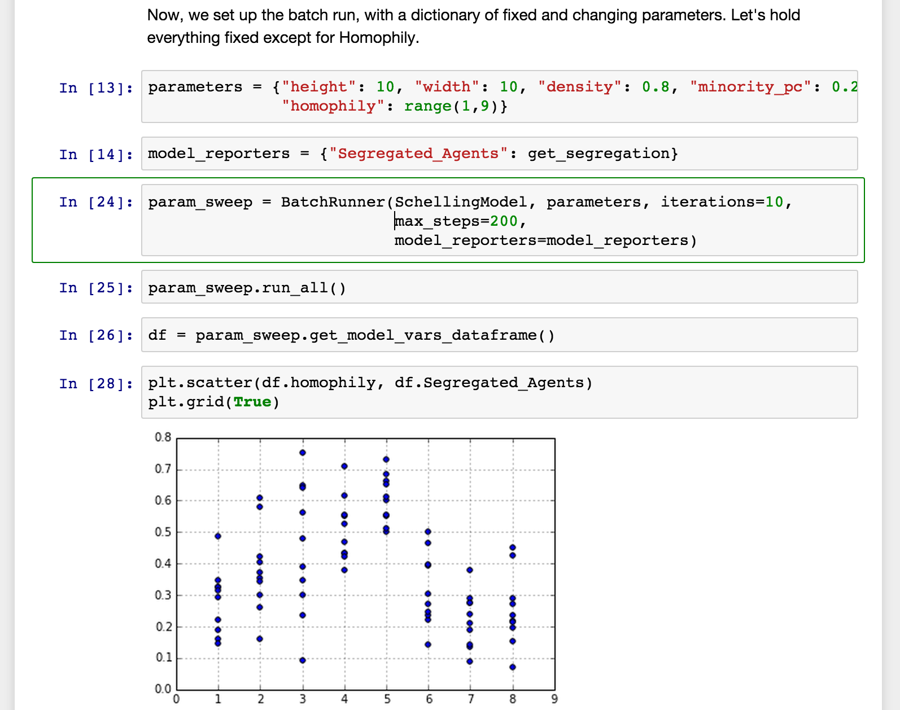
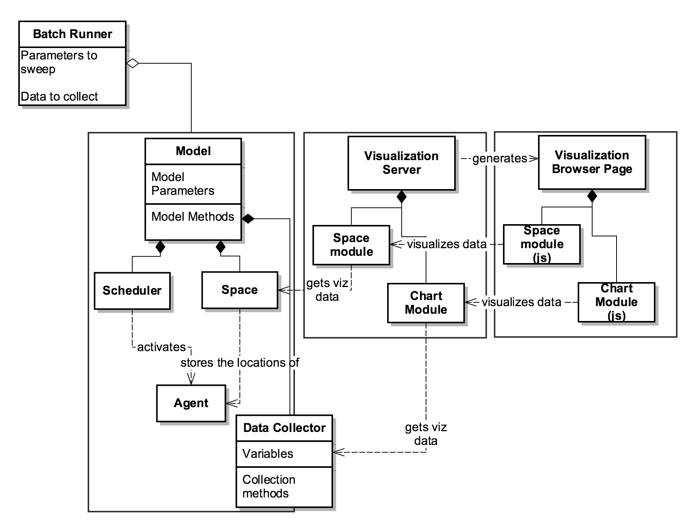
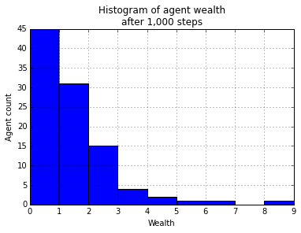
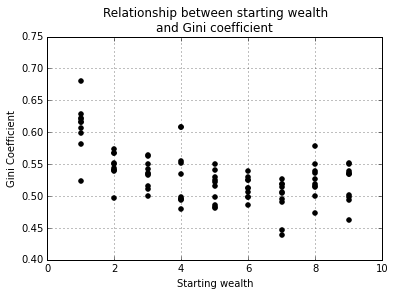
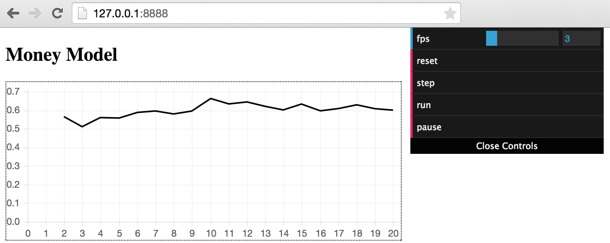

:author: David Masad
:email: david.masad@gmail.com
:institution: Department of Computational Social Science, George Mason University

:author: Jacqueline Kazil
:email: jackies@email.net
:institution: Department of Computational Social Science, George Mason University

----------------------------------------
Mesa: An Agent-Based Modeling Framework
----------------------------------------

.. class:: abstract
  
  Mesa is a new ABM framework for Python and it's gonna be the best. Some more words will go here. Words words words about what Mesa is and how cool it is. Seriously, pretty cool, even if it isn't really done yet.

.. class:: keywords

    agent based modeling, complexity, simulation

Introduction
------------

*Talk a little about what ABMs are in general, who uses them, and why we should care*

There are currently several tools and frameworks in wide use for agent-based modeling: particularly NetLogo [Wilensky99]_, Repast [North13]_, and MASON [Luke05]_. From our perspective, all of these share a key weakness: none of them use Python. This is not just a matter of parochial preference (though it is certainly that as well). In recent years Python has become an increasingly popular language for scientific computing [Perez2011]_, supported by a mature and growing ecosystem of tools for analysis and modeling. Python is widely considered a more natural, easy-to-learn language than Java, which is used for Repast and MASON; and unlike NetLogo's custom scripting language, Python is a widely-used general purpose programming language. Furthermore, unlike the other frameworks, Python allows us to analyze model output data interactively without exporting them to a different tool. Despite these advantages, and despite several partial efforts (e.g. [Zvoleff2013]_, [Sayama2013]_), there is not yet a Python agent-based modeling framework. Mesa is intended to fill this gap. 

Designing a new framework from the ground up also allowed us to implement features we found lacking in other frameworks. For example, as we explain in more detail below, other ABM frameworks tend to use a single agent activation regime by default; in Mesa, we implement several scheduler classes and require the user to specify which one is being used. We also implement several useful tools to facilitate model analysis: a data collector (present only in Repast) and a batch runner (available in Repast and NetLogo only via menu-driven systems), both of which can export their results directly to pandas [CITE] dataframes for immediate analysis. 

  A Mesa model run and analyzed inside of an IPython Notebook. :label:`fig1`

.. figure:: browser_screenshot.png

  A Mesa model visualized in a browser window. :label:`fig2`

While interactive data analysis is important, direct visualization of every model step is also an important part of agent-based modeling, both for debugging, and for developing an intuition of the dynamics that emerge from the model. Mesa facilitiates such live visualization as well. It avoids issues of system-specific GUI dependencies by using the browser as a front-end, giving framework and model developers access to the full range of modern JavaScript data visualization tools.

In the remainder of this paper, we will present Mesa's architecture and core features. To illustrate their use, we will describe and build a simple agent-based model. This model is drawn from econophysics, and its core is as follows: *The model consists of some number of agents, all of whom begin with 1 unit of money. At every step of the model, an agent gives 1 unit of money (if they have it) to some other agent.* Despite its simplicity, this model yields results that are often unexpected to those not familiar with it. For our purposes, it also easily demonstrates Mesa's core featurs.

Architecture
-------------

**Overview**

The guiding princinple of Mesa's architecture is modularity. Mesa makes minimal assumptions about the form a model will take. For example, while many models have spatial components, many others -- particularly economic models, such as [] -- do not; while some models may involve multiple separate spaces. Similarly, visualizations which display each step of a model may be a critical component of some models and completely unneccessary for others. Thus Mesa aims to offer a set of components that can be easily combined and extended to build different kinds of models.

We divide the modules into three overall categories: modeling, analysis and visualization. The modeling components are the core of what's needed to build a model: a **Model** class to store model-level parameters and serve as a container for the rest of the components; one or more **Agent** classes which describe the model agents; most likely a **scheduler** which controls the agent activation regime, and handles time in the model in general, and components describing the **space** and/or **network** the agents are situated in. The analysis components are the **data collectors** used to record data from each model run, and **batch runners** for automating multiple runs and parameter sweeps. Finally, the visualization components are used to map from a model object to one or more visual representations, either as plain-text or via a server interface to a browser window.

   Simplified UML diagram of Mesa architecture. :label:`fig3`

To begin building the model described above, let us first create two classes: one for the model object itself, and one for each model agent. The model's parameter is the number of agents, and each agent has a single variable: how much money it currently has. Each agent also has a single action: give a unit of money to another agent.

.. code-block:: python
  
  from mesa import Model, Agent

  class MoneyAgent(Agent):
    """ An agent with fixed initial wealth."""
    def __init__(self, unique_id):
      # Each agent should have a unique_id
      self.unique_id = unique_id 
      self.wealth = 1

  class MoneyModel(Model):
    """A model with some number of agents."""
    def __init__(self, N):
      self.num_agents = N
      # The scheduler will be added here
      self.create_agents()

    def create_agents(self):
      """Method to create all the agents."""
      for i in range(self.num_agents):
        a = MoneyAgent(i)
        # Now what? See below.

**Scheduler**

The scheduler is a model component which deserves special attention. Unlike systems dynamics models, and dynamical systems more generally, time in agent-based models is almost never continuous; ABMs are, at bottom, discrete-event simulations. Thus, scheduling the agents' activation is particularly important. First, some terminology. Many models distinguish between a step or tick of the model, and an activation of a single agent, with multiple agent activations in each step of the model. There are numerous possible scheduling regimes used in agent-based modeling, including:

  * Synchronious or simultaneous activation, where all agents act simultaneously. In practice, this is generally implemented by recording each agent's decision one at a time, but not altering the state of the model until all agents have decided.
  * Uniform activation, where all agents are activated in the same order each step of the model. 
  * Random activation, where each agent is activated each step of the model, but the order in which they are activated is randomized for each step.
  * Random interval activation, where the interval between each activation is drawn from a random distribution (most often Poisson). In this regime, there is no set model step; instead, the model maintains an internal 'clock' and schedule which determines which agent will be activated at which time on the internal clock. 
  * More exotic activation regimes may be used as well, such as agents needing to spend resources to activate more frequently.

The activation regime can have a substantial effect on the behavior of a simulation [CITE], yet many ABM frameworks do not make it easy to change. For example, NetLogo defaults to a random activation system, while MASON's scheduler is uniform by default. By separating out the scheduler into a separate, extensible class, Mesa both requires modelers to specify their choice of activation regime, and makes it easy to change and observe the results. Additionally, the scheduler object serves as the model's storage struture for active agents.

All scheduler classes share a few standard method conventions, in order to make them both simple to use and seamlessly interchangable. Schedulers are instantiated with the model object they belong to. Agents are added to the schedule using the ``add_agent`` method, and removed using **remove_agent**. Agents can be added at the very beginning of a simulation, or any time in the middle -- e.g. as they are born from other agents' reproduction. 

The **step** method runs one step of the *model*, activating agents accordingly. It is here that the schedulers primarily differ from one another. For example, the uniform **BaseScheduler** simply loops through the agents in the order they were added, while **RandomActivation** shuffles their order prior to looping.

Each agent is assumed to have a **step()** method, which receives the model state as its sole argument. This is the method that the scheduler calls in order to activate each agent.

The scheduler maintains two variables determining the model clock. **steps** counts how many steps of the model have occured, while **time** tracks the model's simulated clock time. Many models will only utilize **steps**, but a model using Poisson activation, for example, will track both separately, with steps counting individual agent activations and **time** the scheduled model time of the most recent activation. Some models may implement particular schedules simulating real time: for example, **time** may attempt to simulate real-world time, where agent activations simulate them as they engage in different activities of different durations based on the time of day.

Now, let's implement that in our example model. We add a ``RandomActivation`` scheduler to the model, and add each created agent to it. We also need to implement the agents' ``step`` method, which the scheduler calls by default. Finally,   The new code looks like this:

.. code-block:: python

  from mesa.time import RandomActivation

  class MoneyAgent(Agent):
    # ...

    def step(self, model)
      """Give money to another agent."""
      if self.wealth > 0:
        # Pick a random agent
        other = random.choice(model.schedule.agents)
        # Give them 1 unit money
        other.wealth += 1
        self.wealth -= 1

  class MoneyModel(Model):

    def __init__(self, N):
      self.num_agents = N
      # Adding the scheduler:
      self.schedule = RandomActivation(self)
      self.create_agents()

    def create_agents(self):
      """Method to create all the agents."""
      for i in range(self.num_agents):
        a = MoneyAgent(i)
        # Now add the agent to the schedule:
        self.schedule.add(a)

    def step(self):
      self.schedule.step()

    def run_model(self, steps):
      """The model has no end condition
        so the user needs to specify how long to run"""
      for _ in range(steps):
        self.step()

**Data Collection**

An agent-based model is not particularly useful if there is no way to see the behaviors and outputs it produces. Generally speaking, there are two ways of extracting these: visualization, which allows for observation and qualitative examination (and which we will discuss below), and quantitative data collection. In order to facilitate the latter option, we provide a generic **Data Collector** class, which can store and export data from most models without needing to be subclassed.

The data collector stores three categories of data: *model-level* variables, *agent-level variables*, and *tables* which are a catch-all for everything else. Model- and agent-level variables are added to the data collector along with a function for collecting them. Model-level collection functions take a model object as an input, while agent-level collection functions take an agent object as an input; both then return a value computed from the model or each agent at their current state. When the data collector's **collect** method is called, with a model object as its argument, it applies each model-level collection function to the model, and stores the results in a dictionary, associating the current value with the current step of the model. Similarly, the method applies each agent-level collection function to each agent currently in the schedule, associating the resulting value with the step of the model, and the agent's unique ID. The Data Collector may be placed within the model class itself, with the collect method running as part of the model step; or externally, with additional code calling it every step or every $N$ steps of the model. 

The third category, *tables*, is used for logging by the model or the agents rather than fixed collection by the data collector itself. Each table consists of a set of columns, stored as dictionaries of lists. The model or agents can then append records to a table according to their own internal logic. This can be used to log specific events (e.g. every time an agent is killed), and data associated with them (e.g. agent lifespan at destruction), particularly when these events do not necessarily occur every step. 

Internally, the data collector stores all variables and tables in Python's standard dictionaries and lists. This reduces the need for external dependencies, and allows the data to be easily exported to JSON or CSV. However, one of the goals of Mesa is facilitating integration with Python's larger scientific and data-analysis ecosystems, and thus the data collector also includes methods for exporting the collected data to pandas [CITE] DataFrames. This allows rapid, interactive processing of the data, easy charting, and access to the full range of statistical and machine-learning tools that are compatible with pandas.

To continue our example, we use a data collector to collect the wealth of each agent at the end of every step. The additional code this requires can look like this:

.. code-block:: python
  
  from mesa.datacollector import DataCollector

  class MoneyModel(Model):
  
    def __init__(self, N):
      # ... everything above
      ar = {"Wealth": lambda a: a.wealth}
      self.dc = DataCollector(agent_reporters=ar)

    def step(self):
      self.dc.collect(self)
      self.schedule.step()
      

We now have enough code to run the model, get some data out of it, and analyze it.

.. code-block:: python

  # Create a model with 100 agents
  model = MoneyModel(100)
  # Run it for 1,000 steps:
  model.run_model(1000)
  # Get the data as a DataFrame
  wealth_history = model.dc.get_agent_vars_dataframe()
  # wealth_history indexed on Step and AgentID, and...
  # ...has Wealth as one data column
  wealth_history.reset_index(inplace=True)
  # Plot a histogram of final wealth
  wealth_history[wealth_history.Step==999].\
    Wealth.hist(bins=range(10))

An example of the output of this code is shown in Figure :ref:`fig4`. Notice that this simple rule produces an extremely skewed wealth distribution -- in fact, this is approximate

  Example of model output histogram, with labels added. :label:`fig4`

**Batch Runner**

Since most ABMs are stochastic, a single model run gives us only one particular realization of the process the model describes. Furthermore, the questions we want to use ABMs to answer are often about how a particular parameter drives the behavior of the entire system -- requiring multiple model runs with multiple parameter values. In order to facilitate this, Mesa provides the **BatchRunner** class. Like the DataCollector, it does not need to be subclassed in order to conduct parameter sweeps on most models.

The Batch Runner is instantiated with a model class, and a dictionary mapping names of model parameters to either a single value, or a list or range of values. Like the Data Collector, it is also instantiated with dictionaries mapping model- and agent-level variable names to functions used to collect them. The Batch Runner uses the *product* combination generator included in Python's *itertools* library to generate all possible combinations of the parameter values provided. For each combination, the batch collector instantiates a model instance with those parameters, and runs the model until it terminates or a set number of steps has been reached. Once the model terminates, the batch collector runs the reporter functions, collecting data on the model run and storing it along with the relevant parameters. Like the Data Collector, the batch runner can then export the resulting datasets to pandas dataframes.

Suppose we want to know whether the skewed wealth distribution in our example model is dependent on initial starting wealth. To do so, we modify the model code itself, and implement a ``get_gini`` method to compute the model's Gini coefficient. (In the interest of space, these modifications are left as an exercise to the reader, or are available in the full model code online). The following code sets up and runs a ``BatchRunner`` testing starting wealth values between 1 and 9, with 10 runs at each. Each run continues for 1,000 steps, as above.

.. code-block:: python

  param_values = {"N": 100, "starting_wealth": range(1,10)}
  model_reporter={"Gini": compute_gini}
  batch = BatchRunner(MoneyModel, param_values, 
                      10, 1000, model_reporter)
  batch.run_all()
  out = batch.get_model_vars_dataframe()
  plt.scatter(df.starting_wealth, df.Gini)

Output from this code is shown in Figure :ref:`fig5`.

  Example of batch run scatter-plot, with labels added. :label:`fig5`

Visualization
--------------

Mesa uses a browser window to visualize its models. This avoids both the developers and the users needing to deal with cross-system GUI programming; more importantly, perhaps, it gives us access to the universe of advanced JavaScript-based data visualization tools. The in-browser visualization is inspire by AgentScript [Densmore2012], an in-browser agent-based modeling framework. The entire visualization system is divided into two parts: the server side, and the client side. The server runs the model, and at each step extracts data from it to visualize, which it sends to the client as JSON via a WebSocket connection. The client receives the data, and uses JavaScript to actually draw the data onto the screen for the user.

Mesa already includes a set of pre-built visualization elements which can be deployed with minimal setup. For example, to create a visualization of the example model which displays a live chart of the Gini coefficient at each step, we can use the included ``ChartModule``.

.. code-block:: python

  from mesa.visualization.ModularVisualization \
    import ModularServer
  from mesa.visualization.modules import ChartModule

  # The Chart Module gets a model-level variable 
  # from the model's data collector
  chart_element = ChartModule([{"Label": "Gini", 
                              "Color": "Black"}], 
                              data_collector_name='dc')
  # Create a server to visualize MoneyModel
  server = ModularServer(MoneyModel, 
                        [chart_element], 
                        "Money Model", 100)
  server.launch()

Running this code launches the server. To access the actual visualization, open your favorite browser (ideally Chrome) to http://127.0.0.1:8888/ . This shows the visualization, along with the controls used to reset the model, advance it by one step, or run it at the designated frame-rate. After several ticks, the browser window will look something like Figure :ref:`fig6`.

  Example of the browser visualization. :label:`fig6`

The actual visualization is done by the visualization modules. Conceptually, each module consists of a server-side and a client-side element. The server-side element is a Python object implementing a ``render`` method, which takes a model instance as an argument and returns a JSON object with the information needed to visualize some part of the model. This might be as simple as a single number representing some model-level statistic, or as complicated as a list of JSON objects, each encoding the position, shape, color and size of an agent on a grid. 

The client-side element is a JavaScript class, which implements a ``render`` method of its own. This method receives the JSON data created by the Python element, and renders it in the browser. This can be as simple as updating the text in a particular HTML paragraph, or as complicated as drawing all the shapes described in the aforementioned list. The object also implements a ``reset`` method, used to reset the visualization element when the model is reset. Finally, the object creates the actual necessary HTML elements in its constructor, and does any other initial setup necessary.

Obviously, the two sides of each visualization must be designed in tandem. They result in one Python class, and one JavaScript ``.js`` file. The path to the JavaScript file is a property of the Python class, meaning that a particular object does not need to include it separately. Mesa includes a variety of pre-built elements, and they are easy to extend or add to.

The ``ModularServer`` class manages the various visualization modules, and is meant to be generic to most models and modules. A visualization is created by instantiating a ``ModularServer`` object with a model class, one or more ``VisualizationElement`` module objects, and model parameters (if necessary). The ``launch()`` method then launches a Tornado server, using templates to insert the JavaScript code specified by the modules to create the client page. The application uses Tornado's coroutines to run the model in parallel with the server itself, so that the model running does not block the serving of the page and the WebSocket data. For each step of the model, each module's ``render`` method extracts the visualization data and stores it in a list. That list item is then sent to the client via WebSocket when the request for that step number is received.

Let us create a simple histogram, with a fixed set of bins, for visualizing the distribution of wealth as the model runs. It requires JavaScript code, in `HistogramModule.js` and a Python class. Below is an abbreviated version of both.

.. code-block:: javascript

  var HistogramModule = function(bins) {
    // Create the appropiate tag, stored in canvas
    $("body").append(canvas);
    // ... Chart.js boilerplate removed 
    var chart = new Chart(context).Bar(data, options);

    this.render = function(data) {
      for (var i in data)
        chart.datasets[0].bars[i].value = data[i];
      chart.update();
    };

    this.reset = function() {
      chart.destroy();
      chart = new Chart(context).Bar(data, options);
      };
    };

Next, the Python class uses ``Chart.min.js`` (included with the Mesa package) and the new ``HistogramModule.js`` file we created above, which is located in the same directory as the Python code. In this case, our module's ``render`` method ix extremely specific for this model alone. The code looks like this.

.. code-block:: python

  class HistogramModule(VisualizationElement):
    package_includes = ["Chart.min.js"]
    local_includes = ["HistogramModule.js"]

    def __init__(self, bins):
      self.bins = bins
      new_element = "new HistogramModule({})"
      new_element = new_element.format(bins)
      self.js_code = "elements.push(" + new_element + ");"

  def render(self, model):
    wealth_vals = [a.wealth 
                   for a in model.schedule.agents]
    hist = np.histogram(wealth_vals, 
                        bins=self.bins)[0]
    return [int(x) for x in hist]

Finally, we can add the element to our visualization server object:

.. code-block:: python

  histogram_element = HistogramModule(range(10))
  server = ModularServer(MoneyModel, [histogram_element], 
                         "MoneyModel", 100)
  server.launch()

Conclusions and Future Work
----------------------------

Mesa provides a versatile framework for building, analyzing and visualizing agent-based models. It seeks to fill the ABM-shaped hole in the scientific Python ecosystem, while bringing together powerful features found in disparate other modeling frameworks and introducing some of its own. Both Mesa's schedule architecture and in-browser visualization are, to the best of our knowledge, unique among major ABM frameworks.  

References
-----------
.. [Wilensky99] Wilensky, Uri. NetLogo. Evanston, IL: Center for Connected Learning and Computer-Based Modeling, Northwestern University, 1999.
.. [North13] North, Michael J., Nicholson T. Collier, Jonathan Ozik, Eric R. Tatara, Charles M. Macal, Mark Bragen, and Pam Sydelko. “Complex Adaptive Systems Modeling with Repast Simphony.” Complex Adaptive Systems Modeling 1, no. 1 (March 13, 2013): 3. doi:10.1186/2194-3206-1-3.
.. [Luke05] Luke, Sean, Claudio Cioffi-Revilla, Liviu Panait, Keith Sullivan, and Gabriel Balan. “Mason: A Multiagent Simulation Environment.” Simulation 81, no. 7 (2005): 517–27.
.. [Perez2011] Pérez, Fernando, Brian E. Granger, and John D. Hunter. “Python: An Ecosystem for Scientific Computing.” Computing in Science & Engineering 13, no. 2 (March 1, 2011): 13–21. doi:10.1109/MCSE.2010.119.
.. [Zvoleff2013] Zvoleff, Alex. PyABM Toolkit. http://azvoleff.com/pyabm.html. 
.. [Sayama2013] Sayama, Hiroki. “PyCX: A Python-Based Simulation Code Repository for Complex Systems Education.” Complex Adaptive Systems Modeling 1, no. 1 (March 13, 2013): 1–10. doi:10.1186/2194-3206-1-2.

