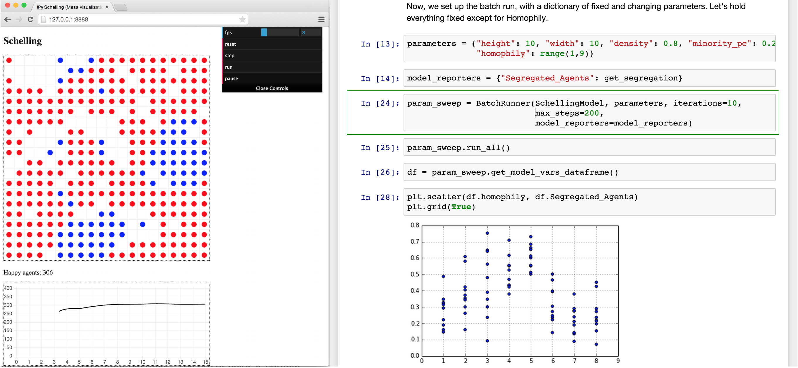
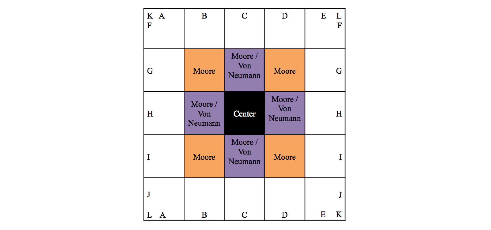
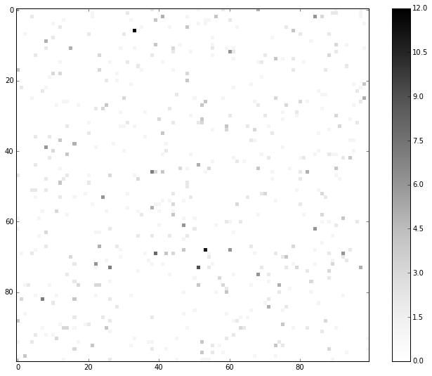

:author: David Masad
:email: david.masad@gmail.com, jackiekazil@gmail.com
:institution: Department of Computational Social Science, George Mason University

:author: Jacqueline Kazil
:email: jackiekazil@gmail.com
:institution: Department of Computational Social Science, George Mason University

----------------------------------------
Mesa: An Agent-Based Modeling Framework
----------------------------------------

.. class:: abstract

  Agent-based modeling is a computational methodology used in social science, biology, and other fields, which involves simulating the behavior and interaction of many autonomous entities, or agents, over time. There is currently a hole in this area in  Python’s robust and growing scientific ecosystem. Mesa is a new open-source, Apache 2.0 licensed package meant to fill that gap. It allows users to quickly create agent-based models using built-in core components (such as agent schedulers and spatial grids) or customized implementations; visualize them using a browser-based interface; and analyze their results using Python’s data analysis tools. Its goal is to be a Python 3-based alternative to other popular frameworks based in other languages such as NetLogo, Repast, or MASON. Since the framework is being built from scratch it is able to incorporate lessons from other tools. In this paper, we present Mesa's core features and demonstrate them with a simple example model. [#]_

.. class:: keywords

    agent-based modeling, multi-agent systems, cellular automata, complexity, modeling, simulation

Introduction
------------

Agent-based modeling involves simulating the behavior and interaction of many autonomous entities, or agents, over time. Agents are objects that have rules and states, and act accordingly with each step of the simulation [Axtell2000]_. These agents may represent individual organisms, humans, entire organizations, or abstract entities.  Robert Axtell, one of the early scholars of agent-based models (ABMs), identified the following advantages [Axtell2000]_:

1. Unlike other modeling approaches, ABMs capture the path as well as the solution, so one can analyze the system's dynamic history.
2. Most social processes involve spatial or network attributes, which ABMs can incorporate explicitly.
3. When a model (A) produces a result (R), one has established a sufficiency theorem, meaning *R* if *A*.

.. [#] Mesa is available on GitHub at https://github.com/projectmesa/mesa

To understand the utility of agent-based modeling, consider one of the earliest and best-known models, created by Thomas Schelling. Schelling wanted to test the theory that segregated neighborhoods can arise not just by active racism, but due to only a mild preference for neighbors of the same ethnicity  [Schelling1971]_. The model consists of majority-group and minority-group agents living on a grid, who have a preference for only several neighbors of the same group. When that preference is not met, they move to a different grid cell. The model demonstrates that even a mild preference for same-group neighbors leads to a dramatic degree of segregation. This is an example of the *emergence* of a higher-order phenomena from the interactions of lower-level entities, and demonstrates the link between agent-based modeling and complexity theory, and complex adaptive systems in particular [Miller2009]_.

There are currently several tools and frameworks in wide use for agent-based modeling [#]_, particularly NetLogo [Wilensky1999]_, Repast [North2013]_, and MASON [Luke2005]_. From our perspective, all of these share a key weakness: they do not use Python. This is not just a matter of parochial preference. In recent years, Python has become an increasingly popular language for scientific computing [Perez2011]_, supported by a mature and growing ecosystem of tools for analysis and modeling. Python is widely considered a more natural, easy-to-use language than Java, which is used for Repast and MASON; and unlike NetLogo's custom scripting language, Python is a general purpose programming language. Furthermore, unlike the other frameworks, Python allows interactive analysis of model output data, through the IPython Notebook [Perez2007]_ or similar tools. Despite these advantages, and despite several partial efforts ( e.g. [Zvoleff2013]_, [Sayama2013]_), a Python agent-based modeling framework does not yet exist. Mesa is intended to fill this gap.

.. [#] Throughout this paper, and in Mesa's documentation more broadly, we use the term 'agent-based model' to encompass a wide range of related computational models as well, such as multi-agent systems, cellular automata and individual-based model.

Mesa is a new open-source, Apache 2.0 licensed Python package that allows users to quickly create agent-based models using built-in core components (such as agent schedulers and spatial grids) or customized implementations; visualize them using a browser-based interface; and analyze their results using Python’s data analysis tools.

Designing a new framework from the ground up also allows us to implement features not found in existing frameworks. For example, as we explain in more detail below, other ABM frameworks tend to use a single agent activation regime by default; in Mesa, we implement several agent schedulers and require the modeler to specify which one is being used. We also implement several useful tools to accelerate common model analysis tasks: a data collector (present only in Repast) and a batch runner (available in Repast and NetLogo only via menu-driven systems), both of which can export their results directly to *pandas* [McKinney2011]_ data frame format for immediate analysis.

  A Mesa implementation of the Schelling segregation model, being visualized in a browser window and analyzed in an IPython notebook. :label:`fig1`

While interactive data analysis is important, direct visualization of every model step is also a key part of agent-based modeling, both for debugging, and for developing an intuition of the dynamics that emerge from the model. Mesa facilitates such live visualization as well. It avoids issues of system-specific GUI dependencies by using the browser as a front-end, giving framework and model developers access to the full range of modern JavaScript data visualization tools.

In the remainder of this paper, we will present Mesa's architecture and core features. To illustrate their use, we will describe and build a simple agent-based model, drawn from econophysics and presenting a statistical mechanics approach to wealth distribution [Dragulescu2002]_. The core of the model is as follows: *there are some number of agents, all of whom begin with 1 unit of money. At every step of the model, an agent gives 1 unit of money (if they have it) to some other agent.* Despite its simplicity, this model yields results that are often unexpected to those not familiar with it. For our purposes, it also easily demonstrates Mesa's core features.

Architecture
-------------

Overview
~~~~~~~~~~~~

The guiding principle of Mesa's architecture is modularity. Mesa makes minimal assumptions about the form a model will take. For example, while many models have spatial components, many others do not, while some may involve multiple separate spaces. Similarly, visualizations which display each step of a model may be a critical component of some models and completely unnecessary for others. Thus Mesa aims to offer a set of components that can be easily combined and extended to build different kinds of models.

We divide the modules into three overall categories: modeling, analysis and visualization. The modeling components are the core of what's needed to build a model: a **Model** class to store model-level parameters and serve as a container for the rest of the components; one or more **Agent** classes which describe the model agents; most likely a **scheduler** which controls the agent activation regime, and handles time in the model in general, and components describing the **space** and/or **network** the agents are situated in. The analysis components are the **data collectors** used to record data from each model run, and **batch runners** for automating multiple runs and parameter sweeps. Finally, the visualization components are used to map from a model object to one or more visual representations via a server interface to a browser window. Figure :ref:`fig2` shows a simple UML diagram of a typical Mesa model.

.. figure:: mesa_diagram.png

   Simplified UML diagram of Mesa architecture. :label:`fig2`

To begin building the example model described above, we first create two classes: one for the model object itself, and one the model agents. The model's one parameter is the number of agents, and each agent has a single variable: how much money it currently has. Each agent also has only a single action: give a unit of money to another agent. (The numbers in comments of the code below correspond to notes under the code block).

.. code-block:: python

  from mesa import Model, Agent

  class MoneyAgent(Agent):
    """ An agent with fixed initial wealth."""
    def __init__(self, unique_id):
      self.unique_id = unique_id                   # 1.
      self.wealth = 1

  class MoneyModel(Model):
    """A model with some number of agents."""
    def __init__(self, N):
      self.num_agents = N
      # The scheduler will be added here
      self.create_agents()

    def create_agents(self):
      """Method to create all the agents."""
      for i in range(self.num_agents):
        a = MoneyAgent(i)
        # Now what? See below.

1. Each agent should have a unique identifier, stored in the ``unique_id`` field.

Scheduler
~~~~~~~~~~~

The scheduler is a model component which deserves special attention. Unlike systems dynamics models, and dynamical systems more generally, time in agent-based models is almost never continuous; ABMs are, at bottom, discrete-event simulations. Thus, scheduling the agents' activation is particularly important, and the activation regime can have a substantial effect on the behavior of a simulation [Comer2014]_. Many ABM frameworks do not make this easy to change. For example, NetLogo defaults to a random activation system, while MASON's scheduler is uniform by default. By separating out the scheduler into a separate, extensible class, Mesa both requires modelers to specify their choice of activation regime, and makes it easy to change and observe the results. Additionally, the scheduler object serves as the model's storage structure for active agents.

Many models distinguish between a step (sometimes called a tick) of the model, and an activation of a single agent. A step of the model generally involves the activation of one or more agents, and frequently of all of the agents. There are numerous possible scheduling regimes used in agent-based modeling, including:

  * Synchronous or simultaneous activation, where all agents act simultaneously. In practice, this is generally implemented by recording each agent's decision one at a time, but not altering the state of the model until all agents have decided.
  * Uniform activation, where all agents are activated in the same order each step of the model.
  * Random activation, where each agent is activated each step of the model, but the order in which they are activated is randomized for each step.
  * Random interval activation, where the interval between each activation is drawn from a random distribution (most often Poisson). In this regime, there is no set model step; instead, the model maintains an internal 'clock' and schedule which determines which agent will be activated at which time on the internal clock.
  * More exotic activation regimes may be used as well, such as agents needing to spend resources to activate more frequently.

All scheduler classes share a few standard method conventions, in order to make them both simple to use and seamlessly interchangeable. Schedulers are instantiated with the model object they belong to. Agents are added to the schedule using the ``add`` method, and removed using ``remove``. Agents can be added at the very beginning of a simulation, or any time during its run -- e.g. as they are born from other agents' reproduction.

The ``step`` method runs one step of the *model*, activating agents accordingly. It is here that the schedulers primarily differ from one another. For example, the uniform ``BaseScheduler`` simply loops through the agents in the order they were added, while ``RandomActivation`` shuffles their order prior to looping.

Each agent is assumed to have a ``step`` method of its own, which receives the model state as its sole argument. This is the method that the scheduler calls in order to activate each agent.

The scheduler maintains two variables determining the model clock. ``steps`` counts how many steps of the model have occurred, while ``time`` tracks the model's simulated clock time. Many models will only utilize ``steps``, but a model using Poisson activation, for example, will track both separately, with steps counting individual agent activations and ``time`` the scheduled model time of the most recent activation. Some models may implement particular schedules simulating real time: for example, ``time`` may attempt to simulate real-world time, where agent activations simulate them as they engage in different activities of different durations based on the time of day.

Now, let's implement a schedule in our example model. We add a ``RandomActivation`` scheduler to the model, and add each created agent to it. We also need to implement the agents' ``step`` method, which the scheduler calls by default. With these additions, the new code looks like this:

.. code-block:: python

  from mesa.time import RandomActivation

  class MoneyAgent(Agent):
    # ...

    def step(self, model):
      """Give money to another agent."""
      if self.wealth > 0:
        # Pick a random agent
        other = random.choice(model.schedule.agents)
        # Give them 1 unit money
        other.wealth += 1
        self.wealth -= 1

  class MoneyModel(Model):

    def __init__(self, N):
      self.num_agents = N
      # Adding the scheduler:
      self.schedule = RandomActivation(self)       # 1.
      self.create_agents()

    def create_agents(self):
      """Method to create all the agents."""
      for i in range(self.num_agents):
        a = MoneyAgent(i)
        self.schedule.add(a)

    def step(self):
      self.schedule.step()                         # 2.

    def run_model(self, steps):
      for _ in range(steps):                       # 3.
        self.step()

1. Scheduler objects are instantiated with their Model object, which they then pass to the agents at each step.
2. The scheduler's ``step`` method activates the ``step`` methods of all the agents that have been added to it, in this case in random order.
3. Because the model has no inherent end conditions, the user must specify how many steps to run it for.

Space
~~~~~~~~

Many agent-based models have a spatial element. In spatial models, agents may have fixed positions or move around, and interact with their immediate neighbors or with agents and other objects nearby. The space may be abstract (as in many cellular automata), or represent many possible scales, from a single building to a region to the entire world. The majority of models use two-dimensional  spaces, which is how Mesa's current space modules are implemented. Many abstract model spaces are toroidal (doughnut-shaped), meaning that the edges 'wrap around' to the opposite edge. This prevents model artifacts from arising at the edges, which have fewer neighbors than other locations.

Mesa currently implements two broad classes of space: grid, and continuous. Grids are discrete spaces, consisting of rectangular cells; agents and other objects may only be in a particular cell (or, with some additional coding, potentially span multiple cells), but not between cells. In continuous space, in contrast, agents can have any arbitrary coordinates. Both types of space assume by default that agents store their location as an (x, y) tuple named ``pos``.

There are several specific grid classes, all of which inherit from a root `Grid` class. At its core, a grid is a two-dimensional array with methods for getting the neighbors of particular cells, adding and removing agents, etc. The default ``Grid`` class does not enforce what each cell may contain. However, ``SingleGrid`` ensures that each cell contains at most one object, while ``MultiGrid`` explicitly makes each cell be a set of 0 or more objects. There are two kinds of cell neighborhoods: The first is a cell's *Moore* neighborhood that is the 8 cells surrounding it, including the diagonals; the second is the *Von Neumann* neighborhood which is only the 4 cells immediately above, below, and to its left and right. Which neighborhood type to use will vary based on the specifics of each model, and are specified in Mesa by an argument to the various neighborhood methods.

   Grid topology. Moore and Von Neumann neighborhoods of radius 1; in a torus, lettered edges connect to one another. :label:`fig3`

The ``ContinuousSpace`` class also inherits from ``Grid``, and uses the grid as a way of speeding up neighborhood lookups; the number of cells and the arbitrary limits of the space are provided when the space is created, and are used internally to map between spatial coordinates and grid cells. Neighbors here are defined as all agents within an arbitrary distance of a given point. To find the neighbors of a given point, ``ContinuousSpace`` only measures the distance for agents in cells intersecting with a circle of the given radius.

To add space to our example model, we can have the agents wander around a grid; instead of giving a unit of money to any random agent, they pick an agent in the same cell as themselves. This means that multiple agents are allowed in each cell, requiring a ``MultiGrid``.

.. code-block:: python

  from mesa.space import MultiGrid

  class MoneyModel(Model):
    def __init__(self, N, width, height, torus):
      self.grid = MultiGrid(height, width, torus)  # 1.
      # ... everything else

    def create_agents(self):
      for i in range(self.num_agents):
        # ... everything above
        x = random.randrange(self.grid.width)
        y = random.randrange(self.grid.width)
        self.grid.place_agent(a, (x, y))           # 2.

    class MoneyAgent(Agent):
      # ...
      def move(self, model):
        """Take a random step."""
        grid = model.grid
        x, y = self.pos
        possible_steps = grid.get_neighborhood(x, y,
          moore=True, include_center=True)         # 3.
        choice = random.choice(possible_steps)
        grid.move_agent(self, choice)              # 4.

      def give_money(self, model):
        grid = model.grid
        pos = [self.pos]
        others = grid.get_cell_list_contents(pos)  # 5.
        if len(others) > 1:
          other = random.choice(others)
          other.wealth += 1
          self.wealth -= 1

      def step(self, model):
        self.move(model)
        if self.wealth > 0:
          self.give_money(model)

1. The arguments needed to create a new grid are its width, height, and a boolean for whether it is a torus or not.
2. The ``place_agent`` method places the given object in the grid cell specified by the ``(x, y)`` tuple, and assigns that tuple to the agent's ``pos`` property.
3. The ``get_neighborhood`` method returns a list of coordinate tuples for the appropriate neighbors of the given coordinates. In this case, it's getting the Moore neighborhood (including diagonals) and includes the center cell. The agent decides where to move by choosing one of those tuples at random. This is a good way of handling random moves, since it still works for agents on an edge of a non-toroidal grid, or if the grid itself is hexagonal.
4. the ``move_agent`` method works like ``place_agent``, but removes the agent from its current location before placing it in its new one.
5. This is a helper method which returns the contents of the entire list of cell tuples provided. It's not strictly necessary here; the alternative would be: ``x, y = self.pos; others = grid[y][x]`` (note that grids are indexed y-first).

Once the model has been run, we can create a static visualization of the distribution of wealth across the grid using the ``coord_iter`` iterator, which allows us to loop over the contents and coordinates of all cells in the grid, with output shown in figure :ref:`fig4`.

.. code-block:: python

  wealth_grid = np.zeroes(model.grid.width,
                          model.grid.height)
  for cell in model.grid.coord_iter():
    cell_content, x, y = cell
    cell_wealth = sum(a.wealth for a in cell_content)
    wealth_grid[y][x] = cell_wealth
  plt.imshow(wealth_grid, interpolation='nearest')

  Example of spatial wealth distribution across the grid. :label:`fig4`

Data Collection
~~~~~~~~~~~~~~~~~

An agent-based model is not particularly useful if there is no way to see the behaviors and outputs it produces. Generally speaking, there are two ways of extracting these: visualization, which allows for observation and qualitative examination (and which we will discuss later in this paper), and quantitative data collection. In order to facilitate the latter option, we provide a generic ``DataCollector`` class, which can store and export data from most models without needing to be subclassed.

The data collector stores three categories of data: *model-level* variables, *agent-level variables*, and *tables* which are a catch-all for everything else. Model- and agent-level variables are added to the data collector along with a function for collecting them. Model-level collection functions take a model object as an input, while agent-level collection functions take an agent object as an input. Both then return a value computed from the model or each agent at their current state. When the data collector's ``collect`` method is called, with a model object as its argument, it applies each model-level collection function to the model, and stores the results in a dictionary, associating the current value with the current step of the model. Similarly, the method applies each agent-level collection function to each agent currently in the schedule, associating the resulting value with the step of the model, and the agent's unique ID. The data collector may be placed within the model class itself, with the collect method running as part of the model step; or externally, with additional code calling it every step or every *N* steps of the model.

The third category, *tables*, is used for logging by the model or the agents rather than fixed collection by the data collector itself. Each table consists of a set of columns. The model or agents can then append records to a table according to their own internal logic. This can be used to log specific events (e.g. every time an agent is killed), and data associated with them (e.g. agent lifespan at destruction), particularly when these events do not necessarily occur every step.

Internally, the data collector stores all variables and tables in Python's standard dictionaries and lists. This reduces the need for external dependencies, and allows the data to be easily exported to JSON or CSV. However, one of the goals of Mesa is facilitating integration with Python's larger scientific and data-analysis ecosystems, and thus the data collector also includes methods for exporting the collected data to *pandas* data frames. This allows rapid, interactive processing of the data, easy charting, and access to the full range of statistical and machine-learning tools that are compatible with pandas.

To continue our example, we use a data collector to collect the wealth of each agent at the end of every step. The additional code this requires can look like this:

.. code-block:: python

  from mesa.datacollector import DataCollector

  class MoneyModel(Model):

    def __init__(self, N):
      # ... everything above
      ar = {"Wealth": lambda a: a.wealth}
      self.dc = DataCollector(agent_reporters=ar)

    def step(self):
      self.dc.collect(self)
      self.schedule.step()

We now have enough code to run the model, get some data out of it, and analyze it.

.. code-block:: python

  # Create a model with 100 agents
  model = MoneyModel(100)
  # Run it for 1,000 steps:
  model.run_model(1000)
  # Get the data as a DataFrame
  wealth_history = model.dc.get_agent_vars_dataframe()
  # wealth_history indexed on Step and AgentID, and...
  # ...has Wealth as one data column
  wealth_history.reset_index(inplace=True)
  # Plot a histogram of final wealth
  wealth_history[wealth_history.Step==999].\
    Wealth.hist(bins=range(10))

An example of the output of this code is shown in Figure :ref:`fig5`. Notice that this simple rule, where agents give one another 1 unit of money at random, produces an extremely skewed wealth distribution -- in fact, this is approximately a Boltzmann distribution, which characterizes at least some real-world wealth distributions [Dragulescu2001]_.

.. figure:: model_sample_hist.png

  Example of model output histogram, with labels added. :label:`fig5`

Batch Runner
~~~~~~~~~~~~~

Since most ABMs are stochastic, a single model run gives us only one particular realization of the process the model describes. Furthermore, the questions we want to use ABMs to answer are often about how a particular parameter drives the behavior of the entire system -- requiring multiple model runs with different parameter values. In order to facilitate this, Mesa provides the ``BatchRunner`` class. Like the DataCollector, it does not need to be subclassed in order to conduct parameter sweeps on most models.

``BatchRunner`` is instantiated with a model class, and a dictionary mapping names of model parameters to either a single value, or a list or range of values. Like the data collector, it is also instantiated with dictionaries mapping model- and agent-level variable names to functions used to collect them. The batch runner uses the ``product`` combination generator included in Python's ``itertools`` library to generate all possible combinations of the parameter values provided. For each combination, the batch collector instantiates a model instance with those parameters, and runs the model until it terminates or a set number of steps has been reached. Once the model terminates, the batch collector runs the reporter functions, collecting data on the completed model run and storing it along with the relevant parameters. Like the data collector, the batch runner can then export the resulting datasets to pandas data frames.

Suppose we want to know whether the skewed wealth distribution in our example model is dependent on initial starting wealth. To do so, we modify the model code to allow for variable starting wealth, and implement a ``get_gini`` method to compute the model's Gini coefficient. (In the interest of space, these modifications are left as an exercise to the reader, or are available in the full model code online). The following code sets up and runs a ``BatchRunner`` testing starting wealth values between 1 and 9, with 10 runs at each. Each run continues for 1,000 steps, as above.

.. code-block:: python

  param_values = {"N": 100,
                  "starting_wealth": range(1,10)}
  model_reporter={"Gini": compute_gini}
  batch = BatchRunner(MoneyModel, param_values,
                      10, 1000, model_reporter)
  batch.run_all()
  out = batch.get_model_vars_dataframe()
  plt.scatter(df.starting_wealth, df.Gini)

Output from this code is shown in Figure :ref:`fig6`.

.. figure:: model_sample_scatter.png

  Example of batch run scatter-plot, with labels added. :label:`fig6`

Visualization
--------------

Mesa uses a browser window to visualize its models. This avoids both the developers and the users needing to deal with cross-system GUI programming; more importantly, perhaps, it gives us access to the universe of advanced JavaScript-based data visualization tools. The entire visualization system is divided into two parts: the server side, and the client side. The server runs the model, and at each step extracts data from it to visualize, which it sends to the client as JSON via a WebSocket connection. The client receives the data, and uses JavaScript to actually draw the data onto the screen for the user. The client front-end also includes a GUI controller, allowing the user to start a model run, pause it, advance it by one step, reset the model, and set the desired frame-rate.

Mesa already includes a set of pre-built visualization elements which can be deployed with minimal setup. For example, to create a visualization of the example model which displays a live chart of the Gini coefficient at each step, we can use the included ``ChartModule``.

.. code-block:: python

  from mesa.visualization.ModularVisualization \
    import ModularServer
  from mesa.visualization.modules import ChartModule

  # The Chart Module gets a model-level variable
  # from the model's data collector
  chart_element = ChartModule([{"Label": "Gini",
                        "Color": "Black"}],
                        data_collector_name='dc')  # 1.
  # Create a server to visualize MoneyModel
  server = ModularServer(MoneyModel,               # 2.
                        [chart_element],
                        "Money Model", 100)
  server.launch()

1. We instantiate a visualization element object: ChartModule, which plots model-level variables being collected by the model's data collector as specified by the "Labels" provided. ``data_collector_name`` is the name of the actual DataCollector variable, so the module knows where to find the values.
2. The server is instantiated with the model class; a list of visualization elements (in this case, there's only the one element), a model name, and model arguments (in this case, just the agent count).

Running this code launches the server. To access the actual visualization, open your favorite browser (ideally Chrome) to http://127.0.0.1:8888/ . This displays the visualization, along with the controls used to reset the model, advance it by one step, or run it at the designated frame-rate. After several ticks, the browser window will look something like Figure :ref:`fig7`.

.. figure:: browser_screenshot.png

  Example of the browser visualization. :label:`fig7`

The actual visualization is done by the visualization modules. Conceptually, each module consists of a server-side and a client-side element. The server-side element is a Python object implementing a ``render`` method, which takes a model instance as an argument and returns a JSON-ready object with the information needed to visualize some part of the model. This might be as simple as a single number representing some model-level statistic, or as complicated as a list of JSON objects, each encoding the position, shape, color and size of an agent on a grid.

The client-side element is a JavaScript class, which implements a ``render`` method of its own. This method receives the JSON data created by the Python element, and renders it in the browser. This can be as simple as updating the text in a particular HTML paragraph, or as complicated as drawing all the shapes described in the aforementioned list. The object also implements a ``reset`` method, used to reset the visualization element when the model is reset. Finally, the object creates the actual necessary HTML elements in its constructor, and does any other initial setup necessary.

Obviously, the two sides of each visualization must be designed in tandem. They result in one Python class, and one JavaScript ``.js`` file. The path to the JavaScript file is a property of the Python class, meaning that a particular object does not need to include it separately. Mesa includes a variety of pre-built elements, and they are easy to extend or add to.

The ``ModularServer`` class manages the various visualization modules, and is meant to be generic to most models and modules. A visualization is created by instantiating a ``ModularServer`` object with a model class, one or more ``VisualizationElement`` objects, and model parameters (if necessary). The ``launch()`` method then launches a Tornado server, using templates to insert the JavaScript code specified by the modules to create the client page. The application uses Tornado's coroutines to run the model in parallel with the server itself, so that the model running does not block the serving of the page and the WebSocket data. For each step of the model, each module's ``render`` method extracts the visualization data and stores it in a list. That list item is then sent to the client via WebSocket when the request for that step number is received.

Let us create a simple histogram, with a fixed set of bins, for visualizing the distribution of wealth as the model runs. It requires JavaScript code, in `HistogramModule.js` and a Python class. Below is an abbreviated version of both.

.. code-block:: javascript

  var HistogramModule = function(bins) {
    // Create the appropriate tag, stored in canvas
    $("body").append(canvas);                     // 1.
    // ... Chart.js boilerplate removed
    var chart = new Chart(context).Bar(data, options);

    this.render = function(data) {                // 2.
      for (var i in data)
        chart.datasets[0].bars[i].value = data[i];
      chart.update();
    };

    this.reset = function() {                     // 3.
      chart.destroy();
      chart = new Chart(context).Bar(data, options);
      };
    };

1. This block of code functions as the object's constructor. It adds and saves a ``canvas`` element to the HTML page body, and creates a *Chart.js* bar chart inside of it.
2. The ``render`` method takes a list of numbers as an input, and assigns each to the corresponding bar of the histogram.
3. To ``reset`` the histogram, this code destroys the chart and creates a new one with the same parameters.

Next, the Python class tells the front-end to include ``Chart.min.js`` (included with the Mesa package) and the new ``HistogramModule.js`` file we created above, which is located in the same directory as the Python code [#]_. In this case, our module's ``render`` method is extremely specific for this model alone. The code looks like this.

.. [#] While the best practice in web development is to host static files (e.g. JavaScript) separately, Mesa is not set up to this way, as the models are currently small and run only locally. As we scale the Mesa framework, we expect that the ability to pull in external javascript files to be part of the optimization process.

.. code-block:: python

  class HistogramModule(VisualizationElement):
    package_includes = ["Chart.min.js"]
    local_includes = ["HistogramModule.js"]

    def __init__(self, bins):
      self.bins = bins
      new_element = "new HistogramModule({})"      # 1.
      new_element = new_element.format(bins)
      self.js_code = "elements.push("              # 2.
      self.js_code += new_element +");"

  def render(self, model):
    wealth_vals = [a.wealth
                   for a in model.schedule.agents]
    hist = np.histogram(wealth_vals,
                        bins=self.bins)[0]
    return [int(x) for x in hist]

1. This line, and the line below it, prepare the code for actually inserting the visualization element; creating a new element, with the bins as an argument.
2. ``js_code`` is a string of JavaScript code to be run by the front-end. In this case, it takes the code for creating a visualization element and inserts it into the front-end's ``elements`` list of visualization elements.

Finally, we can add the element to our visualization server object:

.. code-block:: python

  histogram_element = HistogramModule(range(10))
  server = ModularServer(MoneyModel,
                         [histogram_element],
                         "MoneyModel", 100)
  server.launch()

Conclusions and Future Work
----------------------------

Mesa provides a versatile framework for building, analyzing and visualizing agent-based models. It seeks to fill the ABM-shaped hole in the scientific Python ecosystem, while bringing together powerful features found in other modeling frameworks and introducing some of its own. Both Mesa's schedule architecture and in-browser visualization are, to the best of our knowledge, unique among major ABM frameworks.

Despite this, Mesa is very much a work in progress. We intend to implement several key features in the near future, including inter-agent networks and the corresponding visualization, a better system to set model runs' random seed, and tools for reading and writing model states to disk. The server-side visualization is also structured so as to allow video-style scrubbing forwards and backwards through a model run, and we hope to implement this feature soon as well. In the longer term, we hope to add tools for geospatial simulations, and for easier distribution of a batch run or even a single model run across multiple cores or in a cluster. We also intend to iteratively continue to add to Mesa's documentation, increase its efficiency, and improve the visualization quality.

We also hope to continue to leverage Mesa's open-source nature. As more researchers utilize Mesa, they will identify opportunities for improvement and additional features, hopefully contribute them to the main repository. More models will generate reference code or additional stand-alone modules, which in turn will help provide a larger library of reusable modeling components that have been validated both in terms of their code and scientific assumptions.

We are happy to introduce Mesa to the world with this paper; it marks not the end of a research effort, but the beginning of an open, collaborative process to develop and expand a new tool in Python's scientific ecosystem.

Acknowledgements
--------------------

Mesa is an open-source project, and we are happy to acknowledge major code contributors Kim Furuya, Daniel Weitzenfeld, and Eugene Callahan.

References
-----------
.. [Axtell2000] Axtell, Robert. “Why agents?: on the varied motivations for agent computing in the social sciences.” Center on Social and Economic Dynamics. The Brookings Institution. (2000).
.. [Comer2014] Comer, Kenneth W. “Who Goes First? An Examination of the Impact of Activation on Outcome Behavior in Agent-Based Models.” George Mason University, 2014. http://gradworks.umi.com/36/23/3623940.html.
.. [Dragulescu2001] Drăgulescu, Adrian, and Victor M. Yakovenko. “Exponential and Power-Law Probability Distributions of Wealth and Income in the United Kingdom and the United States.” Physica A: Statistical Mechanics and Its Applications 299, no. 1 (2001): 213–21.
.. [Dragulescu2002] Drăgulescu, Adrian A., and Victor M. Yakovenko. “Statistical Mechanics of Money, Income, and Wealth: A Short Survey.” arXiv Preprint Cond-mat/0211175, 2002. http://arxiv.org/abs/cond-mat/0211175.
.. [Luke2005] Luke, Sean, Claudio Cioffi-Revilla, Liviu Panait, Keith Sullivan, and Gabriel Balan. “Mason: A Multiagent Simulation Environment.” Simulation 81, no. 7 (2005): 517–27.
.. [McKinney2011] McKinney, Wes. “Pandas: A Foundational Python Library for Data Analysis and Statistics.” Python for High Performance and Scientific Computing, 2011, 1–9.
.. [Miller2009] Miller, John H., and Scott E. Page. “Complex Adaptive Systems: An Introduction to Computational Models of Social Life.” Princeton University Press, 2009.
.. [North2013] North, Michael J., Nicholson T. Collier, Jonathan Ozik, Eric R. Tatara, Charles M. Macal, Mark Bragen, and Pam Sydelko. “Complex Adaptive Systems Modeling with Repast Simphony.” Complex Adaptive Systems Modeling 1, no. 1 (March 13, 2013): 3. doi:10.1186/2194-3206-1-3.
.. [Perez2007] Fernando Pérez, Brian E. Granger. “IPython: A System for Interactive Scientific Computing.” Computing in Science and Engineering, vol. 9, no. 3, pp. 21-29, May/June 2007, doi:10.1109/MCSE.2007.53. URL: http://ipython.org
.. [Perez2011] Pérez, Fernando, Brian E. Granger, and John D. Hunter. “Python: An Ecosystem for Scientific Computing.” Computing in Science & Engineering 13, no. 2 (March 1, 2011): 13–21. doi:10.1109/MCSE.2010.119.
.. [Sayama2013] Sayama, Hiroki. “PyCX: A Python-Based Simulation Code Repository for Complex Systems Education.” Complex Adaptive Systems Modeling 1, no. 1 (March 13, 2013): 1–10. doi:10.1186/2194-3206-1-2.
.. [Schelling1971] Schelling, Thomas C. “Dynamic models of segregation.” Journal of Mathematical Sociology 1.2 (1971): 143-186.
.. [Wilensky1999] Wilensky, Uri. “NetLogo.” Evanston, IL: Center for Connected Learning and Computer-Based Modeling, Northwestern University, 1999.
.. [Zvoleff2013] Zvoleff, Alex. “PyABM Toolkit." http://azvoleff.com/pyabm.html.

