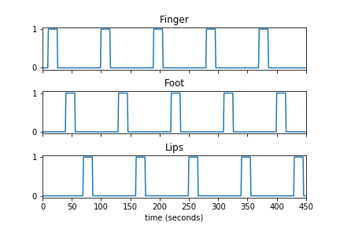
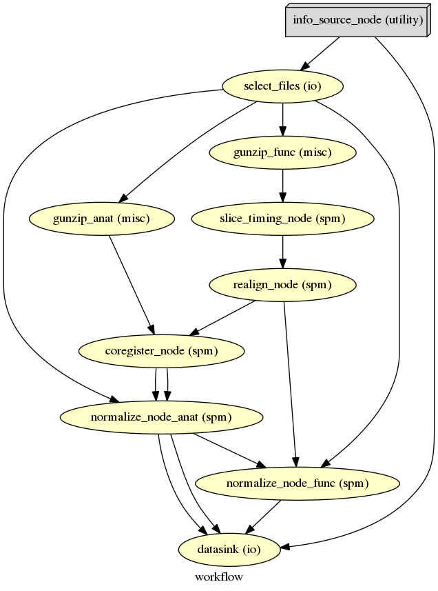
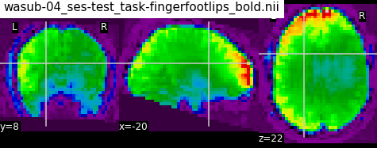
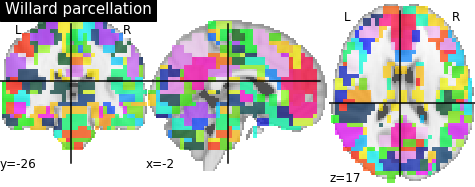
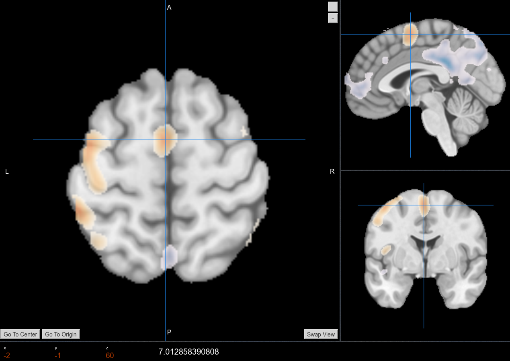
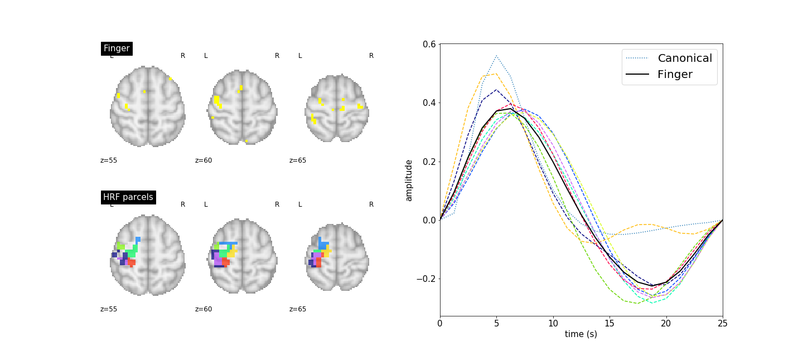

:author: Jaime Arias
:email: jaime.arias@inria.fr
:institution: Inria, MISTIS, Univ. Grenoble Alpes, LJK, F-38000 Grenoble, France
:corresponding:
:equal-contributor:

:author: Philippe Ciuciu
:email: philippe.ciuciu@cea.fr
:institution: CEA/NeuroSpin and Inria Saclay, Parietal, France
:equal-contributor:

:author: Michel Dojat
:email: michel.dojat@univ-grenoble-alpes.fr
:institution: Inserm, U1216, F-38000 Grenoble, France
:institution: Univ. Grenoble Alpes, GIN, F-38000 Grenoble, France
:equal-contributor:

:author: Florence Forbes
:email: florence.forbes@inria.fr
:institution: Inria, MISTIS, Univ. Grenoble Alpes, LJK, F-38000 Grenoble, France
:equal-contributor:

:author: Aina Frau-Pascual
:email: aina.frau-pascual@inria.fr
:institution: Inria, MISTIS, Univ. Grenoble Alpes, LJK, F-38000 Grenoble, France
:equal-contributor:

:author: Thomas Perret
:email: thomas.perret@grenoble-inp.org
:institution: Inria, MISTIS, Univ. Grenoble Alpes, LJK, F-38000 Grenoble, France
:equal-contributor:

:author: Jan M. Warnking
:email: jan.warnking@univ-grenoble-alpes.fr
:institution: Inserm, U1216, F-38000 Grenoble, France
:institution: Univ. Grenoble Alpes, GIN, F-38000 Grenoble, France
:equal-contributor:

:bibliography: biblio

----------------------------------------------------------------------------------------------------------------
PyHRF: A Python Library for the Analysis of fMRI Data Based on Local Estimation of Hemodynamic Response Function
----------------------------------------------------------------------------------------------------------------

.. class:: abstract

   Functional Magnetic Resonance Imaging (fMRI) is a neuroimaging technique
   that allows the non-invasive study of brain function. It is based on the
   hemodynamic changes induced by cerebral activity following sensory or
   cognitive stimulation. The measured signal depends on the variation of blood
   oxygenation level (BOLD signal) which is related to brain activity:
   a decrease in deoxyhemoglobin induces an increase in BOLD signal. In fact,
   the signal is convoluted by the Hemodynamic Response Function (HRF) whose
   exact form is unknown and fluctuates with various parameters such as age,
   brain region or physiological conditions.

   In this paper we present PyHRF, a software to analyze fMRI data using
   a joint detection-estimation (JDE) approach. It jointly detects cortical
   activation and estimates the HRF. In contrast to existing tools, PyHRF
   estimates the HRF instead of considering it as constant in the entire brain,
   improving thus the reliability of the results. Here, we present an overview
   of the package and showcase its performance with a real case in order to
   demonstrate that PyHRF is a suitable tool for clinical applications.

.. class:: keywords

   BOLD response, fMRI, hemodynamic response function

Introduction
------------

Neuroimaging techniques, as functional Magnetic Resonance Imaging (fMRI), allow
the *in vivo* study of brain function by measuring the changes induced by
cerebral activity following sensory or cognitive stimulation. For more than
20 years, the blood-oxygen-level-dependent (BOLD) fMRI modality has being the
technique most used by neuroscientists to map the main functional regions of
the brain.

BOLD signal :cite:`Ogawa:1990` reflects the changes in oxygen concentration in
the blood. Briefly, when brain activity occurs, oxygen is locally consumed by
neurons and its concentration in the blood decreases (see Fig.
:ref:`boldchain`). Therefore, an inflow of oxygenated blood is achieved to
replenish the tissue, increasing local blood oxygen concentration in veins and
capillaries, and then BOLD signal diminution. Oxygenated and deoxygenated
bloods have different magnetic properties. Thus, BOLD signal is an indirect
measure of cerebral activity based on physiological changes in oxygen
consumption, cerebral blood flow and blood volume.

.. figure:: figures/bold_chain.pdf
   :align: center
   :figclass: htb

   fMRI BOLD signal :cite:`Ogawa:1990`. The BOLD signal measures the local
   changes in blood oxygenation. This ratio changes during brain activity.
   :label:`boldchain`

.. INFO: I put the figure here in order to display it on the top of the second page.

.. figure:: figures/rois_hrfs.pdf
   :align: center
   :scale: 25%
   :figclass: wt

   HRF computed using PyHRF from BOLD data in several parcels belonging to
   visual, auditory and motor regions, respectively from left to right.
   :label:`hrfs`

BOLD is non-invasive, non-ionizing, and gives access *in vivo* to brain
activity with a relatively high spatial resolution. It is highly dependent of
the hemodynamic response function (HRF) of the brain. BOLD does not give access
to true physiological parameters such as cerebral blood flow or cerebral blood
volume, but rather measures a mixture of these quantities that is difficult to
untangle. In this regard, BOLD is a very interesting tool in neuroscience, but
in general it is not widely used for clinical applications because the impact
of physiopathological situation on HRF is unknown, hampering the BOLD signal
interpretation. For instance, it cannot detect chronic changes in the baseline
states :cite:`Buxton:2013`, as it is the case of normal ageing
:cite:`Fabiani:2014` and pathologies like Alzheimer's disease
:cite:`Cantin:2011` or Stroke :cite:`Attye:2014`.

Most used open source libraries for the analysis of fMRI data (*e.g.,* SPM
[#]_, FSL [#]_) consider the HRF as constant in all the brain and the same for
all subjects. However, several works (see :cite:`Badillo13` for a survey) show
that the HRF changes across different regions of the brain and across
individuals, increasing thus the possibility of obtaining false negatives and
decreasing the reliability of the results. The software PyHRF
:cite:`Vincent:2014` was developed to overcome the above limitation by
analyzing fMRI data using a joint detection-estimation (JDE) approach.

.. [#] SPM official website: http://www.fil.ion.ucl.ac.uk/spm/software/

.. [#] FSL official website: https://fsl.fmrib.ox.ac.uk/fsl/fslwiki/

In the JDE approach, the detection of the cortical activation is achieved
together with the estimation of the unknown HRF response by analyzing
non-smoothed data.  This detection-estimation is calculated on different
parcels of interest paving the cerebral volume.  Therefore, PyHRF allows to
navigate throughout the brain and to focus on regions of interest during the
experiment in order to visualize the activations and their temporal behavior
through the estimated HRF. Over the last years, efforts have been made in terms
of image processing, user-friendliness and usability of the PyHRF package to
make it more easy to use by non experts and clinicians.

Next, we present the PyHRF package. Then we illustrate its use on real fMRI
data.  Finally, we conclude by discussing directions of current/future work.
An online jupyter notebook containing the results presented here can be found
at http://www.pyhrf.org/scipy2017_notebook.

PyHRF
-----

PyHRF (http://www.pyhrf.org) is an open source tool implemented in Python that
allows to jointly detect activation and estimate (JDE) the hemodynamic response
function (HRF) :cite:`Makni08`, which gives the temporal changes in the BOLD
effect induced by brain activity.  This estimation is not easy in
a *voxel-wise* manner :cite:`Ciuciu03`, and a spatial structure was added to
JDE :cite:`Vincent10` in order to get reliable estimates. In this regard, HRF
estimation in JDE is *parcel-wise* and an input parcellation is required.
However, the use of the Markov Chain Monte Carlo (MCMC) method for estimation
added a huge computational load to the solution, leading to the development of
a faster method to deal with the parameter estimation.  Thus, a variational
expectation maximization (VEM) solution :cite:`Chaari13` was implemented.

JDE aims at improving activation detection by capturing the correct
hemodynamics, since using the wrong HRF function could hide existing
activations. The use of a canonical HRF is usually sufficient for activation
detection. However, HRF functions have been found to have different shapes in
different regions :cite:`Handwerker04`, and to have different delays in
specific populations :cite:`Badillo13`. They change depending on pathologies
such as stenosis. Fig. :ref:`hrfs` shows some HRF functions estimated using
PyHRF from BOLD data on a healthy adult acquired in a block-design setting with
visual, auditory and motor experimental conditions.  The parcels correspond to
regions of the brain that are known induce evoked activity in response to these
experimental conditions.

Standard methods (*e.g.,* GLM), with the posterior classical statistics
applied, give statistical parametric maps (SPM) that describe the significance
of the activation in each region. JDE is a Bayesian approach and estimates, for
each parameter, posterior probability functions. For this reason, we can
compute posterior probability maps (PPMs) from the outputs of PyHRF. These PPMs
are not directly comparable to the classical SPM maps, but give a similar
measure of significance of activation. For instance, in Fig. :ref:`spmvsppm` we
show the SPM and PPM maps for a visual experimental condition in the same data
used for Fig. :ref:`hrfs`. We use the package Nilearn
(http://nilearn.github.io) to generate the brain maps presented in this
document.

.. INFO: I use raw latex to display two subfigures

.. raw:: latex

   \begin{figure}[!htb]
   \centering
   \hspace{-12mm} (a) \hspace{36mm} (b) \\[3mm]
   \includegraphics[width=0.2\textwidth]{figures/visual_ppm.pdf}\hspace{5mm}
   \includegraphics[width=0.2\textwidth]{figures/visual_pvalue.pdf}
   \caption{PPM (a) and SPM (b) maps computed with JDE and GLM, respectively. Scale is logarithmic.} \DUrole{label}{spmvsppm}
   \end{figure}

In Fig. :ref:`pyhrf` we present the inputs and the outputs of PyHRF for the
analysis of BOLD data. It needs as inputs the data volume (BOLD), the
experimental paradigm, and a parcellation of the brain. After running the JDE
algorithm, the outputs will consist of HRF functions per parcel, BOLD effect
maps per experimental condition, and posterior probability maps (PPMs) per
condition. In the next section, we will describe in more details these elements
and how to use PyHRF.

.. figure:: figures/pyhrf4bold.pdf
   :align: center
   :scale: 50%
   :figclass: w

   Inputs and outputs of PyHRF when analyzing BOLD data. :label:`pyhrf`

Example of Use
--------------

To illustrate the use of PyHRF, we will describe the steps needed for the
analysis of BOLD data. A jupyter notebook containing the complete code is
available at http://www.pyhrf.org/scipy2017_notebook.

Getting fMRI BOLD Data
~~~~~~~~~~~~~~~~~~~~~~

First of all, we need to get our fMRI BOLD data. In this running example, we
will analyze the dataset used in :cite:`Gorgolewski2013`. This dataset
(``ds000114``) is open shared and it can be downloaded from
https://openfmri.org/dataset/ds000114/. For convenience, we implemented the
method ``get_from_openfmri`` that uses the library ``fetchopenfmri``
(https://github.com/wiheto/fetchopenfmri) to download datasets from the site
``openfmri``.

.. code-block:: python

    >>> dataset_path = get_from_openfmri('114', '~/data')
    Dataset ds000114 already exists
    /home/jariasal/data/openfmri/ds000114_R2.0.1

Briefly, in this dataset ten healthy subjects in their fifties were scanned
twice using an identical experimental paradigm. This paradigm consists of five
task-related fMRI time series: finger, foot and lip movement; overt verb
generation; covert verb generation; overt word repetition; and landmark tasks.
For the sake of simplicity, we will focus our analysis only on motor tasks
(*i.e.,* finger, foot and lips movement). Fig. :ref:`paradigm` shows the
paradigm containing only the three tasks mentioned above. As we can see, in the
experimental paradigm tasks do not overlap each other and stimuli are presented
to the subject during a certain time (*i.e.,* block paradigm).

   Experimental paradigm of the dataset ``ds000114``. We show only the motor
   tasks of the dataset (finger, foot and lips movement). :label:`paradigm`

fMRI BOLD Preprocessing
~~~~~~~~~~~~~~~~~~~~~~~

Once we have the BOLD volumes, we need to apply some transformations to the
images in order to correct for possible errors that may occur along the
acquisition.  For instance, a BOLD volume (*e.g.,* a whole brain) is usually
not built at once but using a series of successively measured 2D slices. Each
slice take some time to acquire, so slices are observed at different time
points, leading to suboptimal statistical analysis.

We use the library ``Nipype`` (https://github.com/nipy/nipype) to define and
apply our preprocessing pipeline. This library allows to use  robust tools,
such as SPM and FSL, in an easy manner. The proposed workflow (see Fig.
:ref:`nipype`) starts by uncompressing the images since they are in
a ``nii.gz`` format (``gunzip_func`` and ``gunzip_anat`` nodes). After, it
applies a *slice timing* operation in order to make appear that all voxels of
the BOLD volume have been acquired at the same time. We then apply
a *realignment* in order to correct for head movements. Moreover, we apply
a *coregistration* operation in order to have the anatomical image (high
spatial resolution) in the same space as the BOLD images. Finally, we
*normalize* our images in order to transform them into a standard space (a
template).

   Inputs and outputs of PyHRF when analyzing BOLD data. :label:`nipype`

The pipeline described above was run for the images of all subjects from the
dataset (*i.e.,* 10 subjects) on multiple processors, since ``Nipype`` uses the
library ``joblib`` (https://github.com/joblib/joblib).

.. code-block:: python

    # Number of subjects
    >>> N_SUBJECTS = 10
    >>> SUBJECTS = ['sub-%02d' % i
                    for i in range(1,N_SUBJECTS+1)]

We use the acquisition parameters presented in :cite:`Gorgolewski2013` to
parameterize each preprocessing operation. For instance, the number of slices
for the volume, the time for acquiring all slices (TR), and the order in which
they were acquired (*e.g.,* interleaved). In the following snippet, we show
a portion of the code to define the slice timing task with ``Nipype``.

.. code-block:: python

    # Acquisition parameters
    >>> TR = 2.5
    >>> NUM_SLICES = 30
    >>> TA = TR - (TR / NUM_SLICES)
    >>> REF_SLICE = 1

    # interleaved slice order
    >>> SLICE_ORDER = list(range(1, NUM_SLICES+1, 2) +
                           range(2, NUM_SLICES+1, 2))

    # slice timing with SPM
    >>> slice_timing = Node(
          spm.SliceTiming(num_slices=NUM_SLICES,
                          time_repetition=TR,
                          time_acquisition=TA,
                          slice_order=SLICE_ORDER,
                          ref_slice=REF_SLICE),
          name='slice_timing_node')

PyHRF Analysis (Inputs)
~~~~~~~~~~~~~~~~~~~~~~~

So far, we have prepared our functional and structural images for BOLD
analysis. It is important to note that PyHRF receives *non-smoothed* images as
input, thus we exclude this operation from our preprocessing pipeline.

For the sake of simplicity, in our running example we only analyze the 4th
subject from our dataset. Additionally, we will use the package ``Nilearn``
(http://nilearn.github.io/) to load and visualize neuroimaging volumes. Fig.
:ref:`bold` shows the mean of the functional images of the 4th subject after
preprocessing.

   Mean of all preprocessed functional images (over time) of the 4th subject of
   the dataset ``ds000114``. :label:`bold`

As we explained before, the JDE framework estimates HRF parcels-wide. This
means that PyHRF needs a parcellation mask to compute the estimation-detection.
The package provides a Willard atlas :cite:`Richiardi2015` (see Fig.
:ref:`willard`) created from the files distributed by Stanford
(http://findlab.stanford.edu/functional_ROIs.html). This atlas has a voxel
resolution of 3x3x3mm and a volume shape of 53x63x52 voxels.

   Willard atlas :cite:`Richiardi2015`. :label:`willard`

We use the method ``get_willard_mask`` to resize the original atlas to match
the shape of the BOLD images to be analyzed. In addition, this method saves the
resampled mask in a specified path. For instance, Fig. :ref:`willard` shows the
Willard atlas resized to the shape of the functional image in Fig.
:ref:`bold`.

.. code-block:: python

    >>> willard = get_willard_mask('~/pyhrf',
                                   '~/data/bold.nii')
    /home/jariasal/pyhrf/mask_parcellation/willard_3mm.nii

PyHRF also needs the experimental paradigm as input. It must be given as
a ``csv`` file following the convention described in the documentation
(https://pyhrf.github.io/manual/paradigm.html). For the sake of convenience, we
use the method ``convert_to_pyhrf_csv`` to read the paradigm file provided by
the dataset (a ``tsv`` file) and rewrite it using the PyHRF format. Since each
dataset has its own format for the paradigm, we give it as an input to our
method.

.. code-block:: python

    >>> paradigm = convert_to_pyhrf_csv(
          '~/data/paradigm.tsv', 0,
          ['onset', 'duration', 'weight', 'trial_type'])
    /tmp/tmpM3zBD5

Table :ref:`csv` shows the experimental paradigm of the dataset ``ds000114``
written using the PyHRF format.  Note that it only contains motor stimuli since
we are only interested in them for our BOLD analysis. While the paradigm is not
optimized for JDE (standard block paradigm are not ideal to estimate different
points of the HRF course), we obtained similar results to standard statistical
analysis additionally providing the form of the HRF.

.. table:: Experimental paradigm of the dataset ``ds000114`` containing only
           motor stimuli. The column organization of the file follows the
           PyHRF format. :label:`csv`

    +---------+-----------+-------+----------+-----------+
    | session | condition | onset | duration | amplitude |
    +=========+===========+=======+==========+===========+
    | 0       | Finger    | 10    | 15.0     | 1         |
    +---------+-----------+-------+----------+-----------+
    | 0       | Foot      | 40    | 15.0     | 1         |
    +---------+-----------+-------+----------+-----------+
    | 0       | Lips      | 70    | 15.0     | 1         |
    +---------+-----------+-------+----------+-----------+
    | 0       | Finger    | 100   | 15.0     | 1         |
    +---------+-----------+-------+----------+-----------+
    | 0       | Foot      | 130   | 15.0     | 1         |
    +---------+-----------+-------+----------+-----------+
    | 0       | Lips      | 160   | 15.0     | 1         |
    +---------+-----------+-------+----------+-----------+
    | 0       | Finger    | 190   | 15.0     | 1         |
    +---------+-----------+-------+----------+-----------+
    | 0       | Foot      | 220   | 15.0     | 1         |
    +---------+-----------+-------+----------+-----------+
    | 0       | Lips      | 250   | 15.0     | 1         |
    +---------+-----------+-------+----------+-----------+
    | 0       | Finger    | 280   | 15.0     | 1         |
    +---------+-----------+-------+----------+-----------+
    | 0       | Foot      | 310   | 15.0     | 1         |
    +---------+-----------+-------+----------+-----------+
    | 0       | Lips      | 340   | 15.0     | 1         |
    +---------+-----------+-------+----------+-----------+
    | 0       | Finger    | 370   | 15.0     | 1         |
    +---------+-----------+-------+----------+-----------+
    | 0       | Foot      | 400   | 15.0     | 1         |
    +---------+-----------+-------+----------+-----------+
    | 0       | Lips      | 430   | 15.0     | 1         |
    +---------+-----------+-------+----------+-----------+

PyHRF Analysis (Run)
~~~~~~~~~~~~~~~~~~~~

Now we are ready to start our BOLD analysis with PyHRF. For that, we need to
define some important parameters of the underlying JDE model (*e.g.,* ``beta``,
``hrf-hyperprior``, ``sigma-h``, ``drifts-type``) and a folder to save the
output (``--output``).

Moreover, we need to specify if we want to estimate the HRF response  or use,
for example, its canonical form.  In our running example, we will estimate the
HRF (``--estimate-hrf``) with a time resolution (``--dt``) of 1.25 s,
a duration (``--hrf-duration``) of 25.0 s, and we force to zero the beginning
of the response (``--zero-constraint``).

Once the parameters of the model have been defined, we run our analysis by
using the command-line tool ``pyhrf_jde_vem_analysis`` provided by PyHRF. The
reader can found more details about this command and its parameters in
http://www.pyhrf.org.

.. code-block:: bash

    pyhrf_jde_vem_analysis [options] TR atlas_file \
                            paradigm_file bold_images

.. code-block:: bash

    pyhrf_jde_vem_analysis \
      --estimate-hrf \
      --dt 1.25 \
      --hrf-duration 25.0 \
      --zero-constraint \
      --beta 1.0 \
      --hrf-hyperprior 1000 \
      --sigma-h 0.1 \
      --drifts-type cos \
      --parallel \
      --log-level WARNING \
      --output /home/jariasal/pyhrf \
      2.5 \
      {$HOME}/pyhrf/mask_parcellation/willard_3mm.nii \
      /tmp/tmpM3zBD5
      {$HOME}/data/bold.nii

Observe that we can execute this analysis using several processors
(``--parallel``) because PyHRF uses the library ``joblib``.

PyHRF Analysis (Output)
~~~~~~~~~~~~~~~~~~~~~~~

We show in Fig. :ref:`output` the PPMs (upper left), the active parcels (lower
left) and the estimated HRFs (right), generated by PyHRF, for the motor task
``Finger``. Recall that PyHRF estimates a HRF for each parcel.

Reading the description given in :cite:`Gorgolewski2013`, this task corresponds
to finger tapping. We compared the output of PyHRF with the unthresholded
statistical maps shared on the site *Neurovault*
(http://www.neurovault.org/images/307/) for the same dataset (see Fig.
:ref:`neurovault`) and same task (*i.e.,* finger tapping).  As we can observe,
at cut *z=60* both results (Fig.  :ref:`output` and Fig.  :ref:`neurovault`)
are quite similar, showing an activation in the *supplementary motor area* and
the *left primary sensorimotor cortex*.

   Unthresholded statistical maps shared on the site ``Neurovault`` for the
   dataset ``ds000114`` and the finger tapping task. It shows a high activation
   in the *supplementary motor area* and the *left primary sensorimotor
   cortex*.  :label:`neurovault`

   PPMs (upper left), active parcels (lower left) and estimated HRFs (right),
   generated by PyHRF for the dataset ``ds000114`` and the finger tapping task.
   The cut z=60 shows a high activation in the *supplementary motor area* and
   the *left primary sensorimotor cortex*. :label:`output`

Concluding Remarks
------------------

In this paper we presented PyHRF, a software to analyze fMRI data using a joint
detection-estimation (JDE) approach of the cerebral activity. Roughly, it
jointly detects cortical activation and estimates the hemodynamic response
function (HRF). In contrast to existing tools, PyHRF estimates the HRF instead
of considering it constant in all the brain and for all subjects, improving
thus the reliability of the results.

PyHRF is an open source software, which has allowed it to evolve rapidly over
the last few years. As we showed, it allows to generate posterior probability
maps (PPMs) to describe the significance of the activation in each region of
the brain. Moreover, PyHRF uses efficient estimation methods in order to
provide a fast and reliable tool.

Since 2013, PyHRF has started to evolve to deal with Functional Arterial Spin
Labelling (fASL) :cite:`Vincent13` data, including a physiological prior to
make the perfusion estimation more robust :cite:`Frau14b` :cite:`Frau15a`.
A fast solution for fASL based on VEM was proposed in :cite:`Frau15b`, with
similar results to the classical solution based on stochastic simulation
techniques :cite:`Frau15c`.

Since the last years, many efforts have been made in terms of image processing,
user-friendliness and usability of the PyHRF tool to make it more easy to use
by non experts and clinicians.  Moreover, since PyHRF is able to analyze both
BOLD and ASL data, it has begun to emerge as a tool suitable for use in
a clinical environment.
