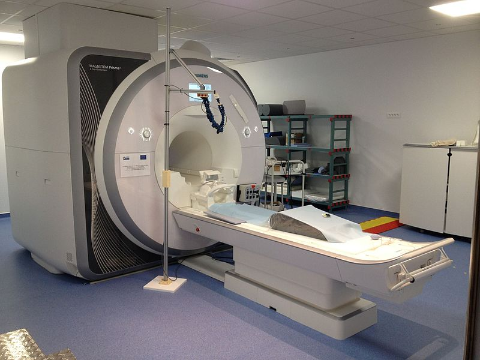

:author: Jaime Arias
:email: jaime.arias@inria.fr
:institution: Inria, MISTIS, Grenoble University, LJK, Grenoble, France
:corresponding:
:equal-contributor:

:author: Philippe Ciuciu
:email: philippe.ciuciu@cea.fr
:institution: CEA/NeuroSpin and INRIA Saclay, Parietal, France
:equal-contributor:

:author: Michel Dojat
:email: michel.dojat@univ-grenoble-alpes.fr
:institution: INSERM, U1216, F-38000 Grenoble, France
:institution: Univ. Grenoble Alpes, Grenoble Institut des Neurosciences, GIN, F-38000 Grenoble, France
:equal-contributor:

:author: Florence Forbes
:email: florence.forbes@inria.fr
:institution: Inria, MISTIS, Grenoble University, LJK, Grenoble, France
:equal-contributor:

:author: Aina Frau-Pascual
:email: aina.frau-pascual@inria.fr
:institution: Inria, MISTIS, Grenoble University, LJK, Grenoble, France
:equal-contributor:

:author: Thomas Perret
:email: thomas.perret@grenoble-inp.org
:institution: Inria, MISTIS, Grenoble University, LJK, Grenoble, France
:equal-contributor:

:author: Jan Warnking
:email: jan.warnking@univ-grenoble-alpes.fr
:institution: INSERM, U1216, F-38000 Grenoble, France
:institution: Univ. Grenoble Alpes, Grenoble Institut des Neurosciences, GIN, F-38000 Grenoble, France
:equal-contributor:

:bibliography: biblio

----------------------------------------------------------------------------------------------------------------
PyHRF: A Python Library for the Analysis of fMRI Data Based on Local Estimation of Hemodynamic Response Function
----------------------------------------------------------------------------------------------------------------

.. class:: abstract

   Functional Magnetic Resonance Imaging (fMRI) is a neuroimaging technique
   that allows the non-invasive study of brain functions. It is based on the
   hemodynamic changes induced by cerebral activity following sensory or
   cognitive stimulation. The measured MR signal depends on the function of
   blood oxygenation level (BOLD signal) which is related to brain activity:
   a decrease in deoxyhemoglobin induces an increase in BOLD signal. Indeed,
   this signal is convoluted by the Hemodynamic Response Function (HRF) whose
   exact form is unknown and depends on various parameters (age, brain region,
   physiological conditions).

   Most used open source libraries for the analysis of fMRI data (*e.g.,* SPM,
   FSL) consider a priori the HRF as constant in brain and the same for all
   subjects. However, several studies show that the HRF changes across
   different regions of the brain and between subjects. Assuming a constant HRF
   can therefore be responsible for a large number of false negatives and
   degrade the reliability of the results.

   We will present PyHRF, a software to analyze fMRI data using a joint 
   detection-estimation (JDE) approach. It jointly detects cortical activation 
   and estimates the HRF. In contrast to existing tools, PyHRF estimates the 
   HRF instead of considering it constant, improving thus the reliability of 
   the results. Here, we lay out the architecture, concept and implementation 
   of the package and present some use cases to show that PyHRF is a tool 
   suitable for non experts and clinicians.

.. class:: keywords

   BOLD response, fMRI, hemodynamic response function
   

Introduction
------------

Neuroimaging techniques, as functional Magnetic Resonance Imaging (fMRI), allow
the *in vivo* study of brain functions by measuring the changes induced by
cerebral activity following sensory or cognitive stimulation. For more than
20 years, the blood-oxygen-level-dependent (BOLD) fMRI modality has being the
technique most used by clinicians and neuroscientists to map the main
functional regions of the brain.

BOLD reflects the changes in oxygen concentration in the blood. Briefly, when
brain activity occurs, oxygen is locally consumed by neurons and its
concentration in the blood decreases. Therefore, an inflow of oxygenated blood
is achieved to replenish the tissue, increasing blood oxygen concentration.
Deoxygenated blood causes locally magnetic distortions. Thus, BOLD signal is an
indirect measure of cerebral activity based on physiological changes in oxygen
consumption, cerebral blood flow and blood volume.

BOLD is non-invasive, non-ionizing, and gives access *in vivo* to brain
activity with a relatively high spatial resolution. It is highly dependent of
the hemodynamic response function (HRF) of the brain. It does not give access
to true physiological parameters such as cerebral blood flow or cerebral blood
volume, but rather measures a mixture of these quantities that is difficult to
untangle. In this regard, BOLD is a very interesting tool in neuroscience, but
in general it is not widely used for clinical applications because the impact
of physiological situation on HRF is unknown, hampering the BOLD signal
interpretation. For example, it cannot detect chronic changes in the baseline
states :cite:`Buxton:2013`, as it is the case of normal ageing
:cite:`Fabiani:2014` and pathologies like Alzheimer's disease
:cite:`Cantin:2011` or Stroke :cite:`Attye:2014`.

Most used open source libraries for the analysis of fMRI data (*e.g.,* SPM [#]_,
FSL [#]_, AFNI [#]_) consider the HRF of the neuronal activity as a constant in all the
brain and the same for all subjects. However, several works (see
:cite:`Badillo13`) show that the HRF changes across different regions of the
brain and other individuals, increasing thus the probability of obtaining false
negative results and decreasing the reliability of the results. The software
PYHRF :cite:`Vincent:2014` has been developed to overcome the above limitation
by analyzing fMRI data using a joint detection-estimation (JDE) approach. In
the JDE approach, the detection of the cortical activation is achieved together
with the estimation of the unknown HRF response by analyzing non smoothed data.
This detection-estimation is calculated on different parcels of interest paving
the cerebral volume. Therefore, PYHRF allows to navigate the brain and to focus
on the regions of interest during the experiment in order to visualize the
activations and their temporal behavior through the estimated HRF. In the last
years, efforts are made in terms of user-friendliness and usability of the
PYHRF package to make it more easy to use by non experts and clinicians.

.. [#] SPM official website: http://www.fil.ion.ucl.ac.uk/spm/software/

.. [#] FSL official website: https://fsl.fmrib.ox.ac.uk/fsl/fslwiki/

.. [#] AFNI official website: https://afni.nimh.nih.gov/download

PYHRF is an open source tool implemented in Pythonwith some C-extensions that
handle computationally intensive parts of the algorithms. The package relies on
robust scientific libraries such as Numpy, Scipy, Sympy, as well as Nibabel to
handle data reading/writing in the NIFTI format. Its source code is hosted on
Github (https://github.com/pyhrf/pyhrf) and it can be easily installed from the
PyPi repository (https://pypi.python.org/pypi/pyhrf). The reader can found the
documentation of PYHRF and all the related information at http://www.pyhrf.org.

Background
----------

The development of neuroimaging techniques have allowed neuroscientifics to 
study brain function *in vivo*, in the healthy and pathological conditions. 
Since brain function is related to blood oxygen supply, the access to blood 
perfusion (the arrival of blood supply to a tissue) with neuroimaging is also 
an important tool for brain research. Different imaging techniques have 
been developed following different principles. Next, we briefly introduce fMRI 
and BOLD modality.

Functional Magnetic Resonance Imaging (fMRI)
~~~~~~~~~~~~~~~~~~~~~~~~~~~~~~~~~~~~~~~~~~~~

Magnetic Resonance Imaging (MRI) uses nuclear magnetic resonance (NMR):  
physical phenomenon in which protons inside a magnetic field align their spin 
with the magnetic field vector and can absorb and re-emit electromagnetic 
radiation. In MRI, a large cylindrical magnet creates a magnetic field around 
the subject, that is place inside (see Figure :ref:`irm3t`). Then, radio waves 
are sent and their echo signals are collected and used to construct an image.

   
   3T MRI scanner at Neurospin for clinical research. :label:`irm3t`
   

Blood-Oxygen-Level-Dependent (BOLD) fMRI
~~~~~~~~~~~~~~~~~~~~~~~~~~~~~~~~~~~~~~~~

In 1990 a japanese scientist called S. Ogawa :cite:`Ogawa:1990` discovered that 
the scanner can "see" where the blood goes after brain activity happens.   
This is due to the fact that hemoglobin works as a natural contrast 
agent: changes in the local oxygenation of the blood cause magnetic 
distortions that the scanner can detect. These changes in local oxygenation of 
the blood happen with brain activity, since oxygen is consumed and a subsequent 
blood supply causes an over-oxygenation of the local blood. This effect is 
called the Blood Oxygen Level Dependent (BOLD) effect and it is a popular 
measure in fMRI because there is no need for the invasive injection of other 
contrast agents (see Figure :ref:`boldchain`). With the BOLD signal, we can 
measure the effect of brain activity after a stimulus is given or a specific 
task is performed.

.. figure:: figures/bold_chain.pdf
   :align: center
   :scale: 50%
   :figclass: w
   
   fMRI BOLD signal :cite:`Ogawa:1990`. The BOLD signal measures the local 
   changes in blood oxygenation. This ratio changes during brain activity. 
   :label:`boldchain`

   
PyHRF
-----

PyHRF (http://www.pyhrf.org) was developed to be able to jointly detect  
activation and estimate (JDE) the so called hemodynamic response function 
(HRF) :cite:`Makni08`, which gives the temporal changes in the BOLD effect 
after brain activity.  This estimation was not easy in a voxel-wise manner 
:cite:`Ciuciu03`, and a spatial structure was added to JDE :cite:`Vincent10` to 
be able to have a more robust estimation.  From this point, HRF estimation in 
JDE was parcel-wise and the input of a parcellation was needed. This added a 
huge computational load to the method, and led to the development of faster 
methods to deal with the parameter estimation: a variational expectation 
maximization (VEM) solution :cite:`Chaari13`.

The main reason for using PyHRF is the HRF estimation. JDE aims at improving 
activation detection through capturing the correct hemodynamics, since using 
the wrong HRF function could hide existing activations. Using a canonical HRF 
is usually sufficient for activation detection. However, HRF functions have 
been found to have different shapes in different regions :cite:`Handwerker04`, 
and to have different delays in specific populations :cite:`Badillo13`. They 
are also believed to change in some pathologies as stenosis. Figure :ref:`hrfs` 
shows some HRF functions estimated from BOLD data of a healthy adult acquired 
in a block-design setting with visual, auditory and motor experimental 
conditions. The parcels correspond to regions of the brain that are known to 
activate with these experimental conditions.

.. figure:: figures/rois_hrfs.pdf
   :align: center
   :scale: 25%
   :figclass: w
   
   HRF computed from BOLD data in several parcels belonging to visual, auditory 
   and motor regions. :label:`hrfs`

   
An interesting output of JDE are also posterior probability maps (PPM). 
Standard methods as GLM with the posterior classical statistics applied, give 
statistical parametric maps (SPM) that describe the significance of the 
activation in each region. JDE is a probabilistic method and estimates, for 
each parameter, posterior probability functions. For this reason, we can 
compute posterior probability maps from the outputs of JDE. These PPM are not 
directly comparable to the classical SPM maps, but give a similar measure of 
significance of activation.

In Figure :ref:`spmvsppm` we show the SPM and PPM maps for a visual 
experimental condition in the same data used in Figure :ref:`hrfs`. Note that 
we are showing it in negative logarithmic scale. PyHRF uses the package 
Nilearn (http://nilearn.github.io) to generate the beautiful images presented 
in this document.

.. raw:: latex
   
   \begin{figure}[!htb]
   \centering
   \hspace{-10mm} (a) \hspace{18mm} (b) \\[3mm]
   \includegraphics[width=0.2\textwidth]{figures/visual_ppm.pdf} \hspace{-8mm}
   \includegraphics[width=0.2\textwidth]{figures/visual_pvalue.pdf}
   \caption{PPM (a) and SPM (b) maps computed with JDE and GLM, respectively. Scale is logarithmic.} \DUrole{label}{spmvsppm}
   \end{figure}
   

The software architecture of PyHRF for BOLD (see :ref:`pyhrf`) needs as inputs 
the data volume (BOLD), the experimental paradigm, and a parcellation of the 
brain. After running the JDE algorithm, the outputs will consist of HRF 
functions per parcel, BOLD effect maps per experimental condition, and 
posterior probability maps PPM per condition.

.. figure:: figures/pyhrf4bold.pdf
   :align: center
   :scale: 50%
   :figclass: w
   
   Structure of PyHRF when analysing BOLD data. :label:`pyhrf`
   

Concluding Remarks
------------------

The PyHRF package provides tools to analyze fMRI data using a joint 
detection-estimation (JDE) approach of the cerebral activity. That is, it  
jointly detects cortical activation and estimates the hemodynamic  
response function (HRF). Contrary to existing tools, PyHRF estimates  
the HRF instead of considering it constant in all the brain and for all 
subjects, improving thus the reliability of the results.

PyHRF is an open source software, which has allowed it to evolve rapidly over 
the last few years. For example, it allows to generate posteriori probability 
maps (PPM) to describe the significance of the activation in each region. 
Moreover, PyHRF uses efficient estimation methods in order to provide a fast 
and reliable tool. In fact, in 2013, a similar solution based on the BOLD JDE 
was developed for fASL :cite:`Vincent13`, with the inclusion of a physiological 
prior to make the perfusion estimation more robust :cite:`Frau14b` 
:cite:`Frau15a`. A fast solution for fASL based on VEM has been proposed in 
:cite:`Frau15b`, with similar results to the classical solution based on 
stochastic simulation techniques :cite:`Frau15c`. The detailed algorithm with 
results and discussion is presentedin :cite:`Frau16`. 

In the last years, 
many efforts are made in terms of user-friendliness and usability of the 
PyHRF package to make it more easy to use by non experts and clinicians.  
Moreover, since PyHRF is able to analyze both BOLD and ASL data, it has begun 
to emerge as a tool suitable for use in aclinical environment.