:author: James Fox
:email: james.fox@cs.ox.ac.uk
:institution: University of Oxford
:corresponding:

:author: Tom Everitt
:email: tomeveritt@google.com
:institution: DeepMind

:author: Ryan Carey
:email: ryan.carey@jesus.ox.ac.uk
:institution: University of Oxford

:author: Eric Langlois
:email: edl@cs.toronto.edu
:institution: University of Toronto

:author: Alessandro Abate
:email: aabate@cs.ox.ac.uk
:institution: University of Oxford

:author: Michael Wooldridge
:email: mjw@cs.ox.ac.uk
:institution: University of Oxford
:bibliography: mybib

------------------------------------------------------
PyCID: A Python Library for Causal Influence Diagrams 
------------------------------------------------------

.. class:: abstract

   Why did a decision maker select a certain decision? What behaviour does a
   certain objective incentivise? How can we improve this behaviour and ensure
   that a decision-maker chooses decisions with safer or fairer consequences?
   This paper introduces the Python package *PyCID*, built upon *pgmpy*, that
   implements (causal) influence diagrams, a widely used graphical modelling framework for 
   decision-making problems. By providing a range of methods to solve and analyse
   (causal) influence diagrams, *PyCID* helps answer questions about behaviour
   and incentives in both single-agent and multi-agent settings.

.. class:: keywords

   Influence Diagrams, Causal Models, Probabilistic Graphical Models, Game Theory, Decision Theory

Introduction
------------
   
Influence-diagrams (IDs) are used to represent and analyse decision making situations under uncertainty :cite:`howard2005influence`, :cite:`miller1976development`. Like Bayesian Networks, IDs have at their core a directed acyclic graph (DAG), but IDs also specify decision and utility nodes. Relationships between variables are given by conditional probability distributions. When these are specified, we call it an influence model (IM). In an IM, a decision-maker selects a distribution over its available actions at a decision (a decision rule) based on what it knows (the values of its parents in the ID) to maximise its expected utility. To demonstrate, consider the following example:

**Grade Prediction:** To decide who to admit, a university uses a model to predict the grades of applicants based on information in their application forms. 

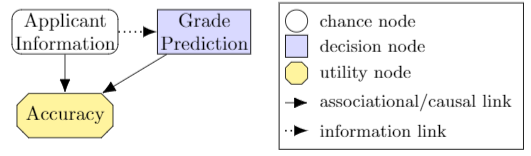
   
   A (C)ID for the **Grade Prediction** example. :label:`gradepredfig`

Figure :ref:`gradepredfig` shows the DAG for this example, which displays clearly the structure of the decision situation. The decision being made by an agent, the model, is the grade prediction (decision node). The agent selects a decision rule for this decision, based on information about the applicant (chance node), in order to optimise their prediction accuracy (utility node). The edges denote associational relationships in the case of a statistical IM, but denote causal links in causal influence models (CIMs). This difference in semantics :cite:`everitt2021agent` allows one to use CIMs to query the effect of causal interventions and provides a setting to ask counterfactual questions :cite:`pearl2009causality`. (C)IMs have also been extended to multi-agent settings by :cite:`koller2003multi`, :cite:`hammond2021equilibrium`, and :cite:`causalgames`.

Statistical and causal IDs have shown promise for a wide variety of applications. In business and medical decision making, statistical IDs provide a simple yet powerful model for optimising decisions by making assumptions explicit and revealing what information is relevant :cite:`gomez2004real`, :cite:`kjaerulff2008bayesian`. Moreover, for the design of safe and fair AI systems, causal IDs have been used to help predict the behaviour of agents arising due to their incentives in an environment :cite:`everitt2021agent`, :cite:`carey2020incentives`, :cite:`everitt2021reward`, :cite:`holtman2020towards`, :cite:`everitt2019modeling`, :cite:`langlois2021rl`, and :cite:`cohen2020asymptotically`. Nevertheless, although Python libraries exist for Bayesian networks, perhaps most prominently *pgmpy* :cite:`ankan2015pgmpy`, these libraries lack specific support for IDs. We found two Python wrappers of C++ influence diagram libraries: *pyAgrum* :cite:`hal-02911619` and *PySMILE* :cite:`pySMILE`. These were limited by usability (hard to install), maintainability (using multiple languages) and versatility (they did not cover multi-agent or causal IDs). A Python library that focuses on implementing statistical and causal IDs is therefore needed to ensure their potential application can be explored, probed, and fully realised.
 
Consequently, this paper introduces *PyCID* [#]_, a Python library built upon *pgmpy* :cite:`ankan2015pgmpy` and *NetworkX* :cite:`hagberg2008exploring`, which implements IDs and IMs (including their causal and multi-agent variants) and provides researchers and practitioners with convenient methods for analysing decision-making situations. *PyCID* can solve single-agent (C)IMs, find Nash equilibria in multi-agent (C)IMs, and compute the effect of causal interventions in CIMs (e.g., fixing the prediction model in Figure :ref:`gradepredfig` to always predict a high grade regardless of the applicant's information). *PyCID* can also find which variables in an ID admit incentives. For example, positive value of information :cite:`howard1966information` and value of control :cite:`shachter1986evaluating` tell us when an agent can benefit from observing or controlling a variable. Meanwhile, other incentives concepts, recently proposed in :cite:`everitt2021agent`, reveal which variables it can be instrumentally useful to control and when a decision-maker benefits from responding to a variable. Reasoning patterns are a related concept in multi-agent IDs: they analyze why a decision-maker would care about a decision :cite:`pfeffer2007reasoning`, and these can also be computed in *PyCID*.
 
The first two sections of this paper provide the necessary background on (C)IDs and describe the architecture of the *PyCID* library. We then move to showcasing some of *PyCID*'s features through applications for discovering agent incentives and analysing games. In the * Instantiating Causal Influence Diagrams* section, we demonstrate how to instantiate a (C)ID for the **Grade Prediction** example in *PyCID*. In the *Analysing Incentives* section, we demonstrate how to find the nodes which admit value of information, response, value of control, or instrumental control incentives for more complex (C)IDs. We then turn to multi-agent (C)IDs (MA(C)IDs) and show how to use *PyCID* to compute Nash equilibria. Next, we explain how *PyCID* can construct random (MA)CIDs. Finally, we discuss the future of *PyCID*.
   
.. [#] This paper describes *PyCID* version 0.2.6.

Background
----------

Notation
++++++++
Throughout this paper, we will use capital letters, :math:`X`, for random variables and let :math:`dom(X)` denote their domain. An assignment :math:`x \in dom(X)` to :math:`X` is an instantiation of :math:`X` denoted by :math:`X=x`. :math:`\textbf{X} = \{X_1, \dots, X_n\}` is a set of variables with instantiation :math:`\textbf{x} = \{x_1, \dots, x_n\}`. We also let :math:`\textbf{Pa}_V` denote the parents of a node :math:`V` in a (MA)CID and :math:`\textbf{pa}_V` be the instantiation of :math:`\textbf{Pa}_V`. 
Moreover, we define :math:`\textbf{Desc}_V` and :math:`\textbf{Fa}_V := \textbf{Pa}_V \cup \{V\}` to be the descendants and family of :math:`V`. 
We use subscripts to index the elements of a set and, in a multi-agent setting, superscripts to indicate a player :math:`i \in \textbf{N}`; e.g., the set of decisions belonging to player :math:`i` is :math:`\textbf{D}^i=\{D^i_1,...,D^i_n\}`.
   
Causal Influence Diagrams
+++++++++++++++++++++++++

A *Bayesian network* is a model consisting of a directed acyclic graph (DAG) and a joint distribution that is Markov compatible with that graph :cite:`pearl2009causality`. The nodes in the DAG denote random variables and the directed edges represent the associational relationships between them. To parameterise the DAG and encode the joint distribution, each random variable, :math:`V`, in the DAG is assigned a conditional probability distribution (CPD), :math:`P(V\vert \textbf{Pa}_V)`, dependent on its set of graphical parents, :math:`\textbf{Pa}_V`. Taken together, these CPDs define the Bayesian network's joint distribution. 

A *causal Bayesian network* is a Bayesian network where the directed edges in the DAG now represent every causal relationship between the Bayesian network's variables. This enables the model the ability to answer questions about the effect of causal interventions from outside of the system. 

Causal Influence Diagrams (CIDs) are DAGs where the nodes are partitioned into chance, decision, and utility nodes and the edges adopt the same causal semantics as causal Bayesian networks :cite:`everitt2021agent`. Causal Influence models (CIMs) are parameterised CIDs where, at the outset, the CPDs for chance and utility nodes are defined, but only the domains for the decision variables are fixed.
   
**Definition 1** :cite:`everitt2021agent` A **Causal influence Diagram (CID)** is a directed acyclic graph :math:`(\textbf{V}, \textbf{E})` where the set of vertices (:math:`\textbf{V}`) connected by directed edges (:math:`\textbf{E} \subseteq \textbf{V} \times \textbf{V}`) are partitioned into chance (:math:`\textbf{X}`), decision (:math:`\textbf{D}`), and utility (:math:`\textbf{U}`) nodes. Utility nodes lack children.
   
**Definition 2** :cite:`everitt2021agent` A **Causal influence Model (CIM)** is a tuple :math:`(\textbf{V}, \textbf{E}, \theta)`  where :math:`(\textbf{V}, \textbf{E})` is a CID and :math:`\theta \in \Theta` is a 
particular parametrisation over the nodes in the graph specifying for each node :math:`V \in \textbf{V}` a finite domain :math:`dom(V)`, 
for each utility node :math:`U \in \textbf{U}` a real-valued domain :math:`dom(U) \subseteq \mathbb{R}`, and for every chance and utility node a conditional probability distribution (CPD) :math:`P(V \mid \textbf{Pa}_V)`. 

Multi-agent Causal Influence Diagrams (MACIDs) partition decision and utility nodes further into sets associated with each agent. In a (MA)CID, a decision rule, :math:`\pi_D(D|\textbf{Pa}_D)`, is a probability distribution over the actions available at decision node :math:`D` conditional on the value of its parents in the graph, :math:`\textbf{Pa}_D`. A policy, :math:`\pi^i`, assigns decision rules to all of agent :math:`i`'s decision nodes, and, in a MACIM, a policy profile, :math:`\pi`, assigns policies to every agent. In a (MA)CID, each agent :math:`i`'s expected utility, :math:`\mathcal{U}^i_{\mathcal{M}}(\pi)`, under a policy (profile) :math:`\pi` is the sum of the expected values of their utility nodes.

Package Architecture
--------------------
   
In this section, we outline the structure (Figure :ref:`pycidfig`) and describe the key classes of the *PyCID* library [#]_.

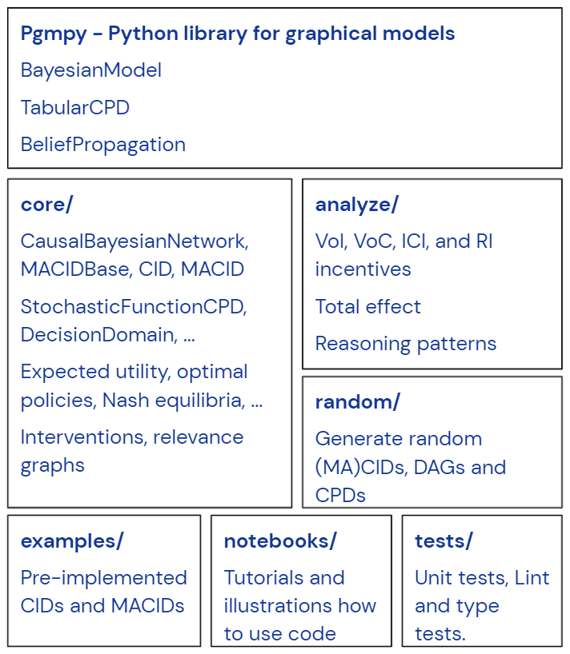
   
   An overview of *PyCID*'s file structure. :label:`pycidfig`

.. [#] *PyCID* is under continued development, so more features will be added over time. Any updated documentation may be found in the repository's README file.

Installation
++++++++++++
   
*PyCID* is released under the *Apache License 2.0*. It requires *Python 3.7* or above, but only depends on *Matplotlib* :cite:`hunter2007matplotlib`, *NetworkX* :cite:`hagberg2008exploring`, *NumPy* :cite:`harris2020array`, and *pgmpy* :cite:`ankan2015pgmpy`. It can be downloaded and installed in a Python virtual environment or in a Conda environment using:
   
.. code-block:: shell
   
   python3 -m pip install pycid
   
   
PyCID is under continual development and so one can install the latest developmental package using a git checkout from the PyCID repository on GitHub: https://github.com/causalincentives/pycid.
   

Classes Inherited from *pgmpy*
+++++++++++++++++++++++++++++++
   
*PyCID*'s key classes inherit from *pgmpy*'s ``BayesianModel``, ``TabularCPD``, and ``BeliefPropagation`` classes :cite:`ankan2015pgmpy`. The ``BayesianModel`` class represents a *Bayesian network* and CPDs are assigned to each random variable in the model using instances of the ``TabularCPD`` class. These CPDs define the *Bayesian Network*'s joint distribution and the ``BeliefPropagation`` class is then used to perform probabilistic inference on a ``BayesianModel`` object; for instance, one can query the probability that node :math:`V` takes value :math:`v` given some instantiation of other variables in the DAG (known as a *context*). 
   
The `pycid.core` module
++++++++++++++++++++++++

*PyCID*'s base class is ``CausalBayesianNetwork``. This class inherits from *pgmpy*'s ``BayesianModel`` and represents a *causal Bayesian network*. In particular, it extends ``BayesianModel`` by adding the ability to query the effect of *causal interventions*. It also adds methods for determining the expected value of a variable for a given *context* (again under an optional *causal intervention*) and for plotting the DAG of the *Causal Bayesian Network* using *NetworkX* :cite:`hagberg2008exploring`. CPDs for a ``CausalBayesianNetwork`` object can be defined using *pgmpy*'s ``TabularCPD`` class, but we also allow relationships to be specified more directly with stochastic functions (under the hood, these are implemented via a ``StochasticFunctionCPD`` class). This can be used to specify relationships between variables with a stochastic function, rather than just with a probability matrix (see the **Instantiating Causal Influence Diagrams** section). ``CausalBayesianNetwork`` also has an inner class, ``Model``, which keeps track of CPDs and domains for all ``CausalBayesianNetwork`` objects' variables in the form of a dictionary.
   
The ``MACIDBase`` class, which inherits from ``CausalBayesianNetwork``, provides the underlying methods necessary for single-agent and multi-agent causal influence diagrams. The class includes methods for determining the expected utility of an agent, for finding optimal decision rules and policies, and for finding various new graphical criteria defined in influence diagrams (e.g. r-relevance). 

``CID`` and ``MACID`` are classes, inheriting from ``MACIDBase``, that represent single-agent and multi-agent (C)IDs and are the models of most concern in *PyCID*. They include methods for finding the optimal policy for an agent in a (C)IM and for finding Nash equilibria :cite:`nash1950equilibrium` and
subgame perfect Nash equilibria :cite:`selten1965spieltheoretische` in a MA(C)IM. It is important to highlight here that statistical (i.e., non-causal) single-agent and multi-agent influence diagrams can also be defined as ``CID`` and ``MACID`` objects using *PyCID*. In their case, all class methods are permitted except those that involve causal interventions.

The `pycid.core` module also contains functions that exploit relationships between the (MA)(C)ID's variables such as finding all (active) (directed) paths between variables and classes that find the relevance graphs :cite:`koller2003multi` associated with ``MACIDBase`` objects.
   
*PyCID's other modules*
+++++++++++++++++++++++
   
The `pycid.analyse` module includes functions for determining incentives in (C)IDs :cite:`everitt2021agent`, reasoning patterns in MA(C)IDs :cite:`pfeffer2007reasoning`, and a function for computing the *total effect* of intervening on a variable with different values. `pycid.examples` contains pre-implemented (C)IDs and MA(C)IDs,
whilst `pycid.random` contains functions for generating random (C)IDs and MA(C)IDs. `pycid.notebooks` contains *jupyter notebooks* with demonstrations of how to use the codebase; these can also be run directly as *Colab notebooks*. Finally, `pycid.tests` houses unit tests for all functions and public class methods.
   
Instantiating Causal Influence Diagrams
---------------------------------------
   
Having covered *PyCID*'s basic library structure, the remaining sections will demonstrate some use cases. We begin, in this section, by instantiating the structure of the simple (C)ID given in the introduction (Figure :ref:`gradepredfig`). For many purposes, including finding incentives, the graph is enough for analysis.
   
A (C)ID for the **Grade Prediction** example is created as an instance of our ``CID`` class. Its initializer takes a list of edges as its first argument and then two more lists specifying the (C)ID's decision and utility nodes. All other nodes introduced in the edge pairs, which are not decision or utility nodes, are chance nodes. For conciseness, we abbreviate and use :math:`P` to denote the prediction model's decision node, :math:`A` for the applicant's information, and :math:`Ac` to denote the accuracy of the predictions:
   
.. code-block:: python
   
   import pycid
   cid = pycid.CID(
      [("A", "P"), ("A", "Ac"), ("P", "Ac")],
      decisions=["P"],
      utilities=["Ac"],
   )
   cid.draw()
   
The ``CID`` class method, `draw`, plots this (C)ID (Figure :ref:`cidfig`) with a node colour and shape convention that matches what is given in Figure :ref:`gradepredfig`'s legend.
   
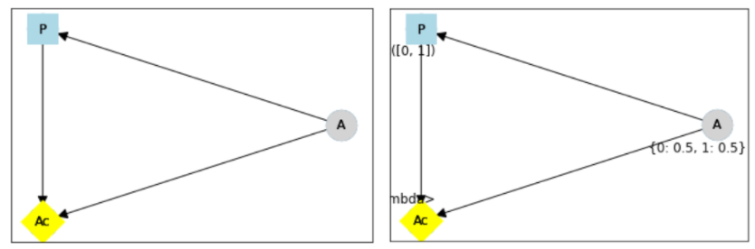
   
   A simple (C)ID (Left) and corresponding CIM (Right) plotted using *PyCID*. :label:`cidfig`
   
To then parameterise this (C)ID as a (C)IM by adding a domain for :math:`P` and CPDs for :math:`A` and :math:`Ac`, we pass keyword arguments to the `add_cpds` method: 
   
.. code-block:: python
   :linenos:
   
      cid.add_cpds(
         A=pycid.discrete_uniform([0, 1]),
         P=[0, 1],
         Ac=lambda a, p: int(a == p),
      )
   
CPDs in *PyCID* can be instantiated directly as ``TabularCPD`` objects, but more often *PyCID*'s ``StochasticFunctionCPD`` subclass is used. This provides multiple ways to easily specify how a chance or utility variable's CPD depends on its parents or follows some distribution; it then converts that expression into a ``TabularCPD`` object under the hood. On line 2 above, we assign variable :math:`A` a discrete uniform distribution over its domain, :math:`dom(A)=\{0,1\}`; on line 3, we specify :math:`dom(P)=\{0,1\}`; and on the final line, we specify how the value of :math:`Ac` depends on the values of its parents, :math:`A` and :math:`P`. Within the lambda function, other variables are referred to by their lower case form to denote that variable's instantiation. Using a ``CID`` class method, `solve`, we can now solve this (C)IM by finding the agent's optimal decision rule for :math:`P`. This returns the following output, saying that the optimal decision rule for :math:`P` is to choose action 0 (low grade prediction) when the value of :math:`A` is 0 (the quality of the application is poor), and action 1 (high grade prediction) when the value of :math:`A` is 1 (the quality of the application is high):
   
.. code-block:: python
   
      {'P': StochasticFunctionCPD<D> 
         {'a': 0}  ->  0
         {'a': 1}  ->  1}
   
If the agent behaves according to this optimal decision rule, we find that their expected utility is 1 using the code below; `expected_utility` accepts optional dictionaries for specifying contexts and causal interventions: 
   
.. code-block:: python
   
      solution = cid.solve() 
      optimal_d_cpd = solution['P']
      cid.add_cpds(optimal_d_cpd)
      cid.expected_utility(context={}, intervention={})

There are several other ways to specify CPDs for variables. For example, on line 1 below, the CPD for :math:`A` is updated to now follow a Bernoulli(0.8) distribution and line 2 specifies that now :math:`Ac` just copies the value of :math:`P` with probability 0.7:

.. code-block:: python
   :linenos:
   
      cid.add_cpds(A=pycid.bernoulli(0.8))
      cid.add_cpds(Ac=lambda a, p: pycid.noisy_copy(p,
                     probability=0.7, domain=[0, 1]))   
         

Analysing Incentives
--------------------
   
In this section, we demonstrate how to use *PyCID* to find which nodes in a single-decision CID admit different types of incentives using their graphical criterion :cite:`everitt2021agent`. In general, a graphical criterion tells you what properties influence models can have based on the influence diagram (i.e, the graph) alone. A graphical criterion takes a graph and several nodes as arguments and returns whether or not the property (in this case the incentive) can occur for those nodes. Incentives are helpful for applications in safety and fairness (:cite:`everitt2021agent`, :cite:`holtman2020towards`), understanding the behaviour of RL algorithms (:cite:`langlois2021rl`, :cite:`everitt2021reward`), and comparing the promise of different AGI safety frameworks :cite:`everitt2019modeling`.
We believe that *PyCID* can further mature these enquiries.
   
*PyCID* currently finds the following incentives in single-decision CIDs using their graphical criteria:
   
*  Value of Information (VoI)
*  Response Incentives (RI)
*  Value of Control (VoC) [#]_ 
*  Instrumental Control Incentives (ICI)
   
.. [#] Nodes can be specified further as admitting indirect or direct Value of Control.

Value of Information (VoI)
++++++++++++++++++++++++++
   
Intuitively, a variable has positive value of information (VoI) if a decision-maker would benefit (get more utility) from observing its value before making a decision:

**VoI Definition:** For a CIM [#]_ :math:`\mathcal{M}`, and a node :math:`X \in \textbf{V} \setminus \textbf{Desc}_D`, let :math:`\mathcal{M}_{X \not\rightarrow D}` and :math:`\mathcal{M}_{X \rightarrow D}` be :math:`\mathcal{M}` modified by respectively removing and adding the edge :math:`X \rightarrow D`. The **value of information** for :math:`X` is then :math:`\underset{\pi}{max}\mathcal{U}^i_{\mathcal{M}_{X \rightarrow D}}(\pi) - \underset{\pi}{max}\mathcal{U}^i_{\mathcal{M}_{X \not\rightarrow D}}(\pi)`.

.. [#] This definition is also valid in (non-causal) statistical influence models.

VoI has been applied to a wide array of problems in economics and computer science :cite:`borgonovo2016sensitivity`. Although *PyCID*'s function `quantitatative_voi` returns the quantitative VoI of a variable in a CIM, for the remainder of this section we shall focus on its graphical criterion, which depends upon which nodes are **requisite** observations in the CID. 
   
**Requisite Observation Graphical Criterion:** Let :math:`\textbf{U}_D \in \textbf{U} \cap \textbf{Desc}_D` be the utility nodes downstream of :math:`D`. An observation :math:`X \in \textbf{Pa}_D` in a single-decision CID is **requisite** if :math:`X \not\perp_{\mathcal{G}} \textbf{U}_D \vert (\textbf{Pa}_D \cup \{D\} \setminus \{X\})` [#]_.
   
**VoI Graphical Criterion**: A single decision CID, :math:`\mathcal{G}`, admits **VoI** for :math:`X \in \textbf{V} \setminus \textbf{Desc}_D` if and only if :math:`X` is a requisite observation in :math:`\mathcal{G}_{X \rightarrow D}`, the graph obtained by adding :math:`X \rightarrow D` to :math:`\mathcal{G}`.
   
.. [#] :math:`X \not\perp_{\mathcal{G}} Y \mid \textbf{W}` denotes that :math:`X` is d-connected to :math:`Y` conditional on the set of nodes in :math:`\textbf{W}` and :math:`X \perp_{\mathcal{G}} Y \mid \textbf{W}` would denote that :math:`X` is d-separated from :math:`Y` conditional on :math:`\textbf{W}` :cite:`pearl2009causality`.

To demonstrate how to find nodes that admit VoI using *PyCID*, we extend the **Grade Prediction** example given in the introduction:
 
**Extended Grade Prediction:** :cite:`everitt2021agent` The university wants to admit the brightest students using their grade prediction model, but doesn't want to treat students differently based on their gender (:math:`Ge`) or race (:math:`R`). The model uses the gender of the student and the high school (:math:`HS`) they attended to make its grade prediction. We make the following assumptions:

*  Performance at university is evaluated by a student's grades (:math:`Gr`) and this depends on the quality of education (:math:`E`) the student received before university (which depends on the high school they attended). 
*  A student’s high school is assumed to be impacted by their race, but not by their gender.

We want to know whether the predictor is incentivised to behave in a discriminatory manner with respect to the students’ gender or race. A CID for this example is defined below:
   
.. code-block:: python
   
   cid = pycid.CID(
      [
         ("R", "HS"),
         ("HS", "E"),
         ("HS", "P"),
         ("E", "Gr"),
         ("Gr", "Ac"),
         ("Ge", "P"),
         ("P", "Ac"),
      ],
      decisions=["P"],
      utilities=["Ac"],
   )
   
*PyCID* finds that :math:`HS`, :math:`E`, and :math:`Gr` can all have positive VoI for the predictor model (line 1). We can also display this visually (Figure :ref:`cidvoifig`) by passing, as an argument, a lambda function into ``CID``'s `draw_property` method (line 2):
   
.. code-block:: python
   :linenos:
   
      pycid.admits_voi_list(cid, 'P')
      cid.draw_property(lambda node:
            pycid.admits_voi(cid, 'P', node))
   
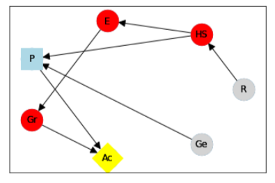
   
      A CID for the **Extended Grade Prediction** example with the variables that admit VoI in a darker colour, red (plotted using *PyCID*). :label:`cidvoifig`
   
Our implementation of this example in *PyCID* has revealed that there exists a parameterisation of this setup (i.e., a CIM with the given CID) where the model would benefit from knowing the value of one or more of 'High School', 'Education', or the student's true 'Grade' before making a grade prediction.

Response Incentives (RI)
++++++++++++++++++++++++
   
Response incentives (RI) are a related type of incentive and we explain how implementing them in *PyCID* can help improve the fairness of AI systems. A variable admits an (RI) if a decision-maker benefits from making its decision causally responsive to the variable :cite:`everitt2021agent` [#]_. 

.. [#] For a formal definition, we refer the reader to :cite:`everitt2021agent`.
   
**RI Graphical Criterion**: A single decision CID, :math:`\mathcal{G}`, admits a **response incentive** on :math:`X \in \textbf{X}` if and only if there is a directed path :math:`X \dashrightarrow D` in the requisite graph [#]_ :math:`\mathcal{G}_{req}` where :math:`\mathcal{G}_{req}` is the result of removing from :math:`\mathcal{G}` all information links from non-requisite observations.
   
.. [#] A requisite graph is also known as a minimal reduction, trimmed_graph, or d-reduction.
   
To demonstrate how to find the nodes which admit RIs, we will again consider the **Extended Grade Prediction** example. As we did with VoI, we can list all of the nodes that admit RIs in the CID (line 1) or we can display the result visually (line 2) with the result shown in Figure :ref:`cidrifig` (Left):
   
.. code-block:: python
   :linenos:
   
      pycid.admits_ri_list(cid, 'P')
      cid.draw_property(lambda node:
            pycid.admits_ri(cid, 'P', node))
   
Implementing CIDs in *PyCID* can help suggest how to improve the fairness of AI systems because :cite:`everitt2021agent` argue that an RI on a sensitive attribute can be interpreted as problematic from a fairness perspective. A decision is considered counterfactually unfair if a change to a sensitive attribute, such as race or gender, would change the decision :cite:`Kusner2017`. Therefore, an RI on a sensitive attribute indicates that counterfactual unfairness is incentivised; specifically, it implies that all optimal policies are counterfactually unfair. To mitigate this, :cite:`everitt2021agent` propose redesigning the grade-predictor. By removing the predictor's access to knowledge about the student's high school (i.e., the edge :math:`HS \rightarrow P` ), there will no longer be an RI on a sensitive attribute. The following code trims the edge and shows that now no node admits an RI in the modified CID (Figure :ref:`cidrifig` (Right)):
   
.. code-block:: python
   
   cid.remove_edge('HS', 'P')
   cid.draw_property(lambda node: \ 
         pycid.admits_ri(cid, 'P', node))
   
   
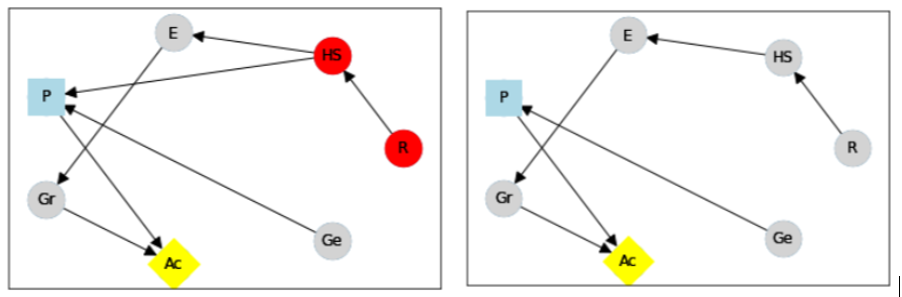
   
   (Left) The original CID for the **Extended Grade Prediction** example with the variables that admit an RI in a darker colour, red, and (Right) the modified CID in which now no node admits an RI (plotted using *PyCID*). :label:`cidrifig`
   
   
Value of Control (VoC) and Instrumental Control Incentives (ICI)
++++++++++++++++++++++++++++++++++++++++++++++++++++++++++++++++
   
We now turn to Value of Control (VoC) and Instrumental Control Incentives (ICI) and show that implementing the latter in *PyCID* can help design safer AI systems.  Intuitively, a variable has *positive value of control (VoC)* if a decision-maker could benefit from choosing that variable's value. 

**VoC Definition:** For a CIM :math:`\mathcal{M}`, the **value of control** for a non-decision node :math:`X \in \textbf{V} \setminus \textbf{D}` is :math:`\underset{\pi}{max}\underset{g^X}{max}\mathcal{U}^i_{\mathcal{M}_{g^X}}(\pi) - \underset{\pi}{max}\mathcal{U}^i_{\mathcal{M}}(\pi)`. :math:`\mathcal{M}_{g^X}` denotes the CIM :math:`\mathcal{M}` after intervening on :math:`X` with any CPD, :math:`g^X`, that respects the graph.

**VoC Graphical Criterion**: A single decision CID, :math:`\mathcal{G}`, admits **positive value of control** for a node :math:`X \in \textbf{V} \setminus \{D\}` if and only if there is a directed path :math:`X \dashrightarrow U` in the requisite graph :math:`\mathcal{G}_{req}`.

Although VoC is a useful concept, it does not consider whether it is actually possible for an agent to control that variable. Therefore, :cite:`everitt2021agent` introduce Instrumental Control Incentives, which can be intuitively understood as follows: if the agent got to choose :math:`D` to influence :math:`X` independently of how :math:`D` influences other aspects of the environment, would that choice matter? In other words, is controlling :math:`X` instrumentally useful for maximising utility? The graphical criteria for ICI in a single-decision CID is:
   
**ICI Graphical Criterion**: A single decision CID, :math:`\mathcal{G}`, admits an **instrumental control incentive** on :math:`X \in \textbf{V}` if and only if :math:`\mathcal{G}` has a directed path from the decision :math:`D` to a utility node :math:`U \in \textbf{U}` that passes through :math:`X`.
   
To demonstrate how to find these incentives in *PyCID*, we introduce another example from :cite:`everitt2021agent`.
   
**Content recommendation:** An AI algorithm has the task of choosing posts (:math:`P`) to show a user, to maximise the user's click rate (:math:`C`). The designers want the algorithm to present content adapted to each user’s original opinions (:math:`O`) to optimize clicks; the algorithm does not know the user's true original opinions, so it instead relies on an approximate model (:math:`M`). However, the designers are worried that the algorithm will use polarising content to influence user opinions (:math:`I`) so that the user clicks more predictably:

.. code-block:: python
   
   cid = pycid.CID(
      [
         ("O", "M"),
         ("O", "I"),
         ("M", "P"),
         ("P", "I"),
         ("I", "C"),
         ("P", "C"),
      ],
      decisions=["P"],
      utilities=["C"],
   )
   
   cid.draw_property(lambda node: \
         pycid.admits_ici(cid, 'P', node))

With RI, we showed that implementing CIDs in *PyCID* can aid the design of fairer systems; with ICI, we demonstrate how *PyCID* can be used to help design safer AI systems. First, we can use analogous functions to what we used for VoI and RI - `pycid.admits_voc_list(cid)` and `pycid.admits_ici_list(cid, 'P')` - to find that :math:`O`, :math:`M`, :math:`I`, and :math:`C` can have positive VoC whilst :math:`I`, :math:`P`, and :math:`C` admit ICI. From this, because :math:`I` (influenced user opinions) admits an instrumental control incentive, we discover that the content recommender may seek to influence that variable to attain utility. :cite:`everitt2021agent` offer an alternative content recommender design that avoids this undesirable behaviour. Instead of being rewarded for the true click-through rate, the content recommender is rewarded for the clicks it would be predicted to have, based on a separately trained model of the user's preferences. The modified CID for this changed model is shown in Figure :ref:`cidicifig` c) where the old utility node :math:`C` (actual clicks) has become :math:`PC` (predicted clicks):
   
.. code-block:: python
   
   cid = pycid.CID(
      [
         ("O", "M"),
         ("O", "I"),
         ("M", "P"),
         ("M", "PC"),
         ("P", "I"),
         ("P", "PC"),
      ],
      decisions=["P"],
      utilities=["PC"],
   )
   
   cid.draw_property(lambda node: \
         pycid.admits_ici(cid, 'P', node))
   
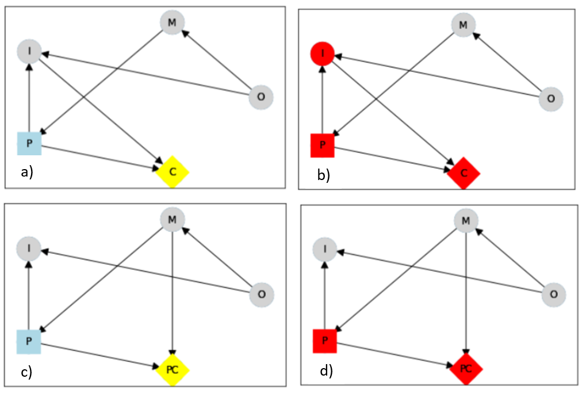
   
   The original CID for the **Content recommendation** example in (a) with (b) the variables that admit ICI in a darker colour, red, and (c) the modified content recommender's CID in which (d) :math:`I` no longer admits an ICI (plotted using *PyCID*). :label:`cidicifig`
   
   
Multi-agent (Causal) Influence Diagrams
-----------------------------------------
   
In this section, we will show how to instantiate MA(C)IDs/MA(C)IMs in *PyCID* and demonstrate a selection of methods for analysing games (strategic interactions between self-interested players) including strategic relevance :cite:`koller2003multi` and finding Nash equilibria (NE) :cite:`nash1950equilibrium`.

Recall from the *Background* section that a Multi-agent Causal Influence Diagram/Model (MACID/MACIM) is a simple multi-agent extension of a CID/CIM :cite:`causalgames`. For our purpose, all that's important is that there is now a set of :math:`\textbf{N}` agents and so the decision and utility nodes are partitioned into :math:`\{\textbf{D}^i\}_{i\in \textbf{N}}` and :math:`\{\textbf{U}^i\}_{i\in \textbf{N}}` to correspond to their association with a particular agent :math:`i \in \textbf{N}`. We also again underline that the only difference between statistical multi-agent influence diagrams/models (MAIDs/MAIMs) and MACIDs/MACIMs is that the edges represent every causal relationship between the random variables chosen to be endogenous variables in the model, as opposed to just associational relationships. Nevertheless, because MACIDs subsume MAIDs (in the sense of Pearl's `causal hierarchy` :cite:`pearl2009causality`), everything we can do in a MAID, we can also do in a MACID. Therefore, for the two examples we present here, MAIDs and MACIDs can be viewed as the same. 

To serve as our example, we shall use the Prisoner's Dilemma, which is probably the best known simultaneous and symmetric two-player game:

**Prisoner's Dilemma:** Two prisoners, suspected of committing a robbery together, are isolated and urged to confess. Each is concerned only with getting the shortest possible prison sentence for himself and must decide whether to confess without knowing his partner’s decision. Both prisoners, however, know the consequences of their decisions. Each year spent in prison can be represented as -1 utility and so the payoff matrix for this game (or Normal form) is given in Figure :ref:`pdfig`.

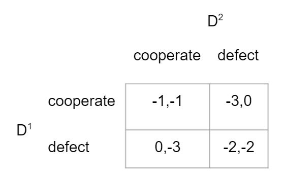
   
   Normal form game giving the payoffs for each player in the **Prisoner's Dilemma**. Player 1 (2) is the row (column) player. :label:`pdfig`

MA(C)IDs and MA(C)IMs are instantiated as ``MACID`` objects with identical syntax to ``CID`` objects except for there being multiple agents and so we can draw them in the same way. Figure :ref:`macidfig` (Left) shows that in *PyCID*, consistent with (C)IDs, decision nodes are drawn as rectangles and utility nodes are drawn as diamonds; however, because we now have more than one player, we reserve colouring to denote agent membership: each agent is assigned a unique colour. Chance nodes remain as grey circle (Figure :ref:`randomfig`):
   
.. code-block:: python
    
   macid = pycid.MACID(
      [
         ("D1", "U1"),
         ("D1", "U2"),
         ("D2", "U1"),
         ("D2", "U2"),
      ],
      # specifies each agent's decision and utility nodes.
      agent_decisions={1: ['D1'], 2: ['D2']},
      agent_utilities={1: ['U1'], 2: ['U2']},
   )
   
   d1_dom = ['c', 'd']   
   d2_dom = ['c', 'd']
   
   agent1_payoff = np.array([[-1, -3], [0, -2]])    
   agent2_payoff = np.transpose(agent1_payoff)
   
   macid.add_cpds(
      D1=d1_dom,
      D2=d2_dom,
      U1=lambda d1, d2: agent1_payoff[d1_dom.index(d1),
                                    d2_dom.index(d2)],
      U2=lambda d1, d2: agent2_payoff[d1_dom.index(d1),
                                    d2_dom.index(d2)]
   )
   macid.draw()

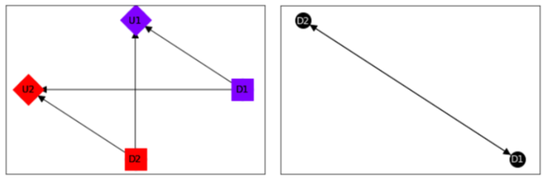
   
   A MACID for the **Prisoner's Dilemma** (Left) and its corresponding relevance graph (Right) (plotted using *PyCID*). :label:`macidfig`

The following command tells us that the second player (agent) receives expected utility = -3 (i.e., they will spend 3 years in prison) given that player 1 decides to defect and player 2 decides to cooperate. This agrees with the payoff matrix in Figure :ref:`pdfig`:
   
.. code-block:: python
   
   macid.expected_utility(context={'D1':'d', 'D2': 'c'},
                           agent=2)
   
Strategic relevance is a useful concept for analysing decisions made in games; it asks which other decisions' decision rules need to be already be known before we can optimise a particular decision rule. :cite:`koller2003multi` introduced the graphical criterion *s-reachability* for determining this from the graph:
   
**S-reachability Graphical Criterion**: Another decision node :math:`D'` is **s-reachable** from a decision :math:`D \in \textbf{D}^i` in a MA(C)ID, :math:`\mathcal{M} = (\textbf{N}, \textbf{V}, \textbf{E})`, if a newly added parent :math:`\hat{D'}` of :math:`D'` satisfies :math:`\hat{D'} \not\perp_{\mathcal{G}} \textbf{U}^i \cap \textbf{Desc}_{D} \mid \textbf{Fa}_{D}`. 
   
Using *PyCID*, lines 1 and 2 below evaluate to `True`, which tells us that each decision strategically relies on the other; each prisoner would be better off knowing the other prisoner's policy before deciding on their own action. To show this visually, line 3 plots the MACID's relevance graph :cite:`koller2003multi` (Figure :ref:`macidfig` Right):
   
.. code-block:: python
   :linenos:
   
      macid.is_r_reachable('D1', 'D2')
      macid.is_r_reachable('D2', 'D1')
      pycid.RelevanceGraph(macid).draw()

We now turn to finding NE in games. We use :math:`\pi_{\textbf{A}}` to denote player :math:`i`'s set of decision rules for decisions :math:`\textbf{A} \subseteq \textbf{D}^i`, given a partial policy profile :math:`\pi_{-\textbf{A}}` over all of the other decision nodes in a MA(C)ID, :math:`\mathcal{M}`. We write :math:`\mathcal{U}^i_{\mathcal{M}}(\pi_{\textbf{A}}, \pi_{\textbf{-A}})` to denote the expected utility for player :math:`i` under the policy profile :math:`\pi = (\pi_{\textbf{A}}, \pi_{\textbf{-A}})`.

**Definition:** :cite:`koller2003multi` A full policy profile :math:`\pi` is a **Nash equilibrium (NE)** in a MA(C)IM :math:`\mathcal{M}` if, for every player :math:`i \in \textbf{N}`, :math:`\mathcal{U}^i_\mathcal{M}(\pi^i, \pi^{-i}) \geq \mathcal{U}^i_\mathcal{M}(\hat{\pi}^i, \pi^{-i})` for all :math:`\hat{\pi}^i \in \Pi^i`.
   
To find all pure NE in the MA(C)IM corresponding to the **Prisoner's Dilemma**:
   
.. code-block:: python
   
   macid.get_all_pure_ne()
   
This method returns a list of all pure NE in the MA(C)ID. Each NE comes as a list of ``StochasticFunctionCPD`` objects, one for each decision node in the MA(C)ID:
   
.. code-block:: python
   
   [[StochasticFunctionCPD<D1> 
      {}  ->  d,
   StochasticFunctionCPD<D2> 
      {}  ->  d]]
   
In the **Prisoner's Dilemma**, there is only one NE and this involves both players defecting. We can then find that the expected utility for each agent is -2 under this NE joint policy profile:
   
.. code-block:: python
   
   all_pure_ne = macid.get_all_pure_ne()
   macid.add_cpds(*all_pure_ne[0])
   macid.expected_utility({}, agent=1)
   macid.expected_utility({}, agent=2)
   
   
*PyCID* can also be used to find subgame perfect equilibria (SPE) :cite:`selten1965spieltheoretische`. A SPE is a NE where no player makes a *non-credible threat* - an action that, if the player is rational, they would never actually carry out. 

**Definition:** :cite:`hammond2021equilibrium` A full policy profile :math:`\pi` is a **subgame perfect equilibrium (SPE)** in a MA(C)IM :math:`\mathcal{M}` if :math:`\pi` is an NE in every MAIM subgame [#]_ of :math:`\mathcal{M}`.

The **Prisoner's Dilemma** MAIM has no proper MAIM subgames and so the NE we found above is (trivially) also a SPE. Therefore, to demonstrate how *PyCID* distinguishes between NE and SPE, we use the following example:

**Taxi Competition:** Two autonomous taxis, operated by different companies, are driving along a road with two hotels located next to one another - one expensive and one cheap. Each taxi must decide (one first, then the other) which hotel to stop in front of, knowing that it will likely receive a higher tip from guests of the expensive hotel. However, if both taxis choose the same location, this will reduce each taxi's chance of being chosen by that hotel's guests. The payoffs for each player are shown in Figure :ref:`taxipofig` and the MACIM for this example is instantiated in *PyCID* below

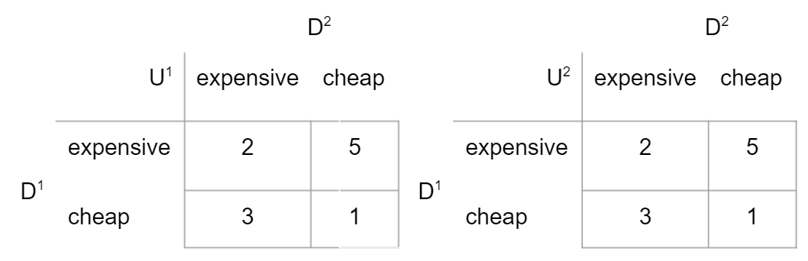
   
   Payoff matrices for taxi 1 (left) and taxi 2 (right) for the **Taxi Competition**. :label:`taxipofig`

.. [#] We refer the interested reader to :cite:`hammond2021equilibrium` for a definition of a MAIM subgame.

.. code-block:: python  

   macid = MACID( 
      [("D1", "D2"), ("D1", "U1"), ("D1", "U2"), 
      ("D2", "U2"), ("D2", "U1")],
      agent_decisions={1: ["D1"], 2: ["D2"]},
      agent_utilities={1: ["U1"], 2: ["U2"]},
   )

   d1_dom = ["e", "c"]
   d2_dom = ["e", "c"]
   agent1_payoff = np.array([[2, 5], [3, 1]])
   agent2_payoff = agent1_payoff.T

   macid.add_cpds(
      D1=d1_dom,
      D2=d2_dom,
      U1=lambda d1, d2: agent1_payoff[d1_dom.index(d1),
                                     d2_dom.index(d2)],
      U2=lambda d1, d2: agent2_payoff[d1_dom.index(d1),
                                     d2_dom.index(d2)],
   )

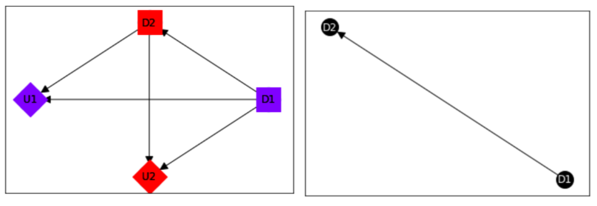
   
   A MA(C)ID for the **Taxi Competition** and its corresponding relevance graph (plotted using *PyCID*). :label:`taxifig`
 
This MA(C)IM has three pure NE, which are found using `macid.get_all_pure_ne()`. We can also find the decision nodes in each MAID subgame (see :cite:`hammond2021equilibrium`), the decision nodes that can be optimised independently from the rest:
 
.. code-block:: python
 
   macid.decs_in_each_maid_subgame()
   [{'D2'}, {'D1', 'D2'}]
 
We can find the NE in the only proper subgame:

.. code-block:: python

   macid.get_all_pure_ne_in_sg(decisions_in_sg=['D2'])

and finally all SPE in the MA(C)IM. The **Taxi Competition**'s MACIM has only one pure SPE:

.. code-block:: python

   macid.get_all_pure_spe()

.. code-block:: python

   [[StochasticFunctionCPD<D2> 
      {'d1': 'c'}  ->  e
      {'d1': 'e'}  ->  c,
   StochasticFunctionCPD<D1> 
      {}  ->  e]]
   

Random (C)IDs and MA(C)IDs
---------------------------
   
*PyCID* has other features that can be useful for researchers. In particular, the library contains functions for instantiating random (MA)(C)IDs. This is useful for estimating the average properties of graphs, or for finding a counterexample to some conjecture. The first example below finds and plots a random 10-node, single-agent (C)ID with two decision nodes and three utility nodes. The second example finds and plots a random 12-node MA(C)ID with two agents. The first agent has one decision and two utility nodes, the second agent has three decisions and two utility nodes. In both these examples, we set the `add_cpds` flag to `False` to create non-parameterised (MA)(C)IDs. If one sets this flag to `True`, each chance and utility node is assigned a random CPD, and each decision node a domain to instantiate a (MA)CIM.
One can also force every agent in the (MA)(C)ID to have sufficient recall; an agent has sufficient recall if the relevance graph restricted to include just that agent's decision nodes is acyclic. This can be useful for certain incentives analyses :cite:`multidecision`. The `edge_density` and `max_in_degree` parameters set the density of edges in the (MA)(C)ID's DAG as a proportion of the maximum possible number (:math:`n \times (n-1)/2`) and the maximum number of edges incident to a node in the DAG. To find a (MA)(C)ID that meets all of the specified constraints, *PyCID* uses rejection sampling and so `max_resampling_attempts` specifies the number of samples to try before timing out:
   
.. code-block:: python
   
   cid = pycid.random_cid(
      number_of_nodes=10,
      number_of_decisions=2,
      number_of_utilities=3,
      add_cpds=False,
      sufficient_recall=False,
      edge_density=0.4,
      max_in_degree=5,
      max_resampling_attempts=100,
   )
   cid.draw()
   
   macid = pycid.random_macid(
      number_of_nodes=12,
      agent_decisions_num=(1, 3),
      agent_utilities_num=(2, 2),
      add_cpds=False,
      sufficient_recall=False,
      edge_density=0.4,
      max_in_degree=5,
      max_resampling_attempts=500,
   )
   macid.draw()
   
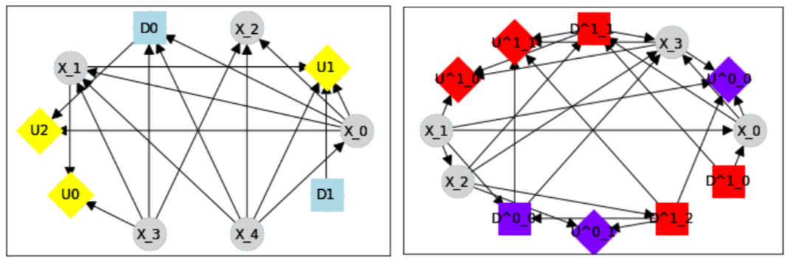
   
   A random (C)ID and MA(C)ID created in *PyCID*. :label:`randomfig`
    

Conclusions and Future Directions
---------------------------------
   
*PyCID* is a Python library for solving and analysing single-agent and multi-agent (causal) influence diagrams. Several key classes - ``CausalBayesianNetwork``, ``CID``, and ``MACID`` - enable decision problems to be solved and the effects of causal interventions to be studied whilst *PyCID*'s analysis functions can find graphical properties such as incentives in CIDs and reasoning patterns in MACIDs. This makes *PyCID* a customizable, but powerful library for testing research ideas and exploring applications. Moreover, implementing examples programmatically can substantiate the claims made by ID researchers about the benefit of their work; one can assess how different quantities vary over the parameter space or empirically verify complexity results :cite:`causalgames`. Single-agent and multi-agent (causal) influence diagrams are an area of active research, so as theory develops, the *PyCID* library will also grow. Extensions will likely include:
   
*  Support for finding incentives in multi-decision CIDs :cite:`multidecision`.
*  Support for Structural Causal Models :cite:`pearl2009causality` and therefore also quantitative RI and ICI.
*  More game-theoretic concepts (e.g. more equilibrium concepts).
*  Support for multi-agent incentives. 
   
In this paper, we have demonstrated the usefulness of *PyCID* by focusing on causal influence diagrams; however, this library is also well suited for working with statistical influence diagrams. The development team would like to invite researchers from any domain to use *PyCID* to test the package for diverse applications, to contribute new methods and functions, and to join our Causal Incentives Working Group: https://causalincentives.com/. The *PyCID* repository is available on GitHub under our working group's organization: https://github.com/causalincentives/pycid. 

Acknowledgements 
-----------------
   
Fox acknowledges the support of the EPSRC Centre for Doctoral Training in Autonomous Intelligent Machines and Systems (Reference: EP/S024050/1).
