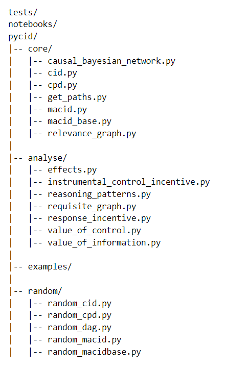

:author: James Fox
:email: james.fox@cs.ox.ac.uk
:institution: University of Oxford

:author: Tom Everitt
:email: tomeveritt@google.com
:institution: DeepMind

:author: Ryan Carey
:email: ryan.carey@jesus.ox.ac.uk
:institution: University of Oxford

:author: Eric Langlois
:email: edl@cs.toronto.edu
:institution: University of Toronto
:bibliography: mybib

-----------------------------------------------------
PyCID: A Python Library for Causal Influence Diagrams 
-----------------------------------------------------

.. class:: abstract

   Why did a decision maker choose a certain decision? What behaviour does a
   certain objective incentivise? How can we improve this behaviour and ensure
   that a decision-maker chooses decisions with safer or fairer consequences?
   This paper introduces the Python package PyCID, built upon pgmpy, that
   implements causal influence diagrams, a well-studied graphical model for 
   decision-making problems. By providing numerous methods to solve and analyse
   (causal) influence diagrams, PyCID helps answer questions about behaviour
   and incentives in both single-agent and multi-agent settings.

.. class:: keywords

   Influence Diagrams, Causal Models, Probabilistic Graphical Models, Game Theory, Decision Theory 

Introduction
------------

Influence diagrams (IDs) are a type of graphical model for decision-making :cite:`HM05`  :cite:`miller1976development`
They are used to analyse decision-making scenarios, in order to improve decisions, or understand an agent’s incentives.
Like Bayesian networks, IDs have at their core a directed acyclic graph, and describe interactions between a set of variables
with conditional probability distributions. However, IDs differ in that they specify decision and utility nodes.
A decision-maker is tasked with choosing a decision (conditional on the values of its parents), in order to maximize the utility.
IDs have been extended to multi-agent settings (Koller & Milch, 2001; Hammond et al, 2021) and causal influence diagrams (Everitt et al, 2021)
allow for causal interventions and the ability to ask counterfactual questions (Pearl, 2009) :cite:`Hammond2021`   :cite:`hammond2021equilibrium` 
. 

Incentive analysis in (causal) influence diagrams helps us understand and predict the behaviour of decision makers pursuing objectives.
For example, we can compute when an agent can benefit from observing or controlling a variable. We can also learn when a decision-maker
benefits from responding to a variable, and which variables it can be instrumentally useful to control.
A related concept in multi-agent influence diagrams is Pfeffer and Gal’s (2007) reasoning patterns which analyze why a decision maker
would care about a decision. 

Several libraries have been implemented for Bayesian networks. Perhaps most prominently, pgmpy is a Python library for graphical
models (Ankin et al, 2015; presented at SciPy). Unfortunately, pgmpy lacks specific support for influence diagrams.
We found two Python wrappers of C++ influence diagram libraries: pyAgrum and PySMILE. These were limited by usability
(we couldn’t readily install them), maintainability (using multiple languages) and versatility (they did not cover multi-agent or causal models).
this paper therefore introduces PyCID, a Python package built on pgmpy that implements influence diagrams (including causal and multi-agent variants)
and provides researchers and practitioners with convenient methods for analysing them.

There are several benefits to having a Python library that implements (causal) influence diagrams. First, it enables researchers to test their intuitions and ideas
empirically. Second, quantified examples can substantiate the utility of research work and one can also use the library to plot how different quantities 
vary over the parameter space or empirically verify complexity results. Third, the library reduces the activation energy for new reserachers to aid theoretical enquiries 
or exploit the applicational benefits of (Causal) Influence diagrams.

In section ... we shall, 

Installation
------------

*PyCID* is released under the *Apache License 2.0* (need to ask how to write this and what this means). It requires *Python 3.7* or above and only depends on *matplotlib* (cite), *networkx* (cite),
*numpy* (cite) and *pgmpy*. It can be downloaded and installed in a Python virtual environment or a Conda environment (cite) using:

.. code-block:: shell

   python3 -m pip install pycid

PyCID is under continual development and so one can install the latest developmental package using a git checkout from the PyCID repository on Github, https://github.com/causalincentives/pycid.

Package Architecture
---------------------

   This shows the file structure of the main components of the pycid library.

*PyCID*'s key classes inherit from *pgmpy*'s ``BayesianModel``, ``TabularCPD``, and ``BeliefPropagation`` classes (cite pgmpy). The ``BayesianModel`` class represents a *Bayesian Network* - a model consisting of a directed
acyclic graph (DAG) and a joint distribution Markov compatible with that graph (cite Pearl). The nodes in the DAG denote random variables and the directed edges represent the associational 
relationships between them. To parametierise the DAG and encode the joint distribution, each random variable, :math:`V`, in the DAG is assigned a conditional probability distribution
(CPD), :math:`P(V\vert Pa_V)`, dependent on its set of parents, :math:`Pa_V`, in the DAG using instances of the ``TabularCPD`` class. These CPDs define the *Bayesian Network*'s joint distribution
and the ``BeliefPropagation`` class is then used to perform probabilstic inference on a ``BayesianModel`` object; for instance, one can query the probability that node :math:`V` takes value 
:math:`v` given some instantiation of other variables in the DAG (known as a *context*). 

We now turn to focus on the classes housed in the *core/* folder. *PyCID*'s base class is ``CausalBayesianNetwork``. This class inherits from *pgmpy*'s ``BayesianModel`` and represents a *Causal Bayesian Network* - a Bayesian Network where 
the directed edges in the DAG now represent every causal relationship between the Bayesian Network's variables. It therefore extends ``BayesianModel`` by adding the ability to query the effect of 
*causal interventions*, to determine the expected value of a variable for a given *context* under an optional *causal intervention*, and to plot the DAG of the *Causal Bayesian Network* using *networkx* (cite networkx).
CPDs for a ``CausalBayesianNetwork`` object can be defined using *pgmpy*'s ``TabularCPD`` class, but we introduce a more general class, ``StochasticFunctionCPD``, which can be used to specify relationships between variables with
a stochastic function, rather than just with a probability matrix (see Section ...). ``CausalBayesianNetwork`` also has an inner class, ``Model``, which keeps track of all CPDs and their domains for a ``CausalBayesianNetwork`` object in the form of a dictionary.

The ``MACIDBase`` class, which inherits from ``CausalBayesianNetwork``, provides the neccessary methods for single-agent and multi-agent causal influence diagrams (see sections ... and ...). For this, some or all of the nodes in the DAG are partitioned into decision and utility nodes
for each agent. The class also includes methods for determining the expected utility of an agent, for finding optimal decsion rules and policies (Section ...), and for finding various new graphical criteria defined in influence diagrams (Section ...). 
``CID`` and ``MACID`` are classes, inheriting from ``MACIDBase``, that represent single-agent and multi-agent causal influence diagrams and are the models of most concern in *PyCID*. They include methods for finding the optimal policy for an agent in a CIM and for finding Nash equilibria (cite Maschler) and
subgame perfect Nash equilibria (cite Selten) in a MACIM (Section ...). *core/* also contains `get_paths.py` which provides more functions that exploit the relationships between variables rendered visible by the explicit DAG, including the ability to find all (active)(un)directed paths between variables.`relevance_graph.py` provides classes
that find the relevance graphs associated with ``MACIDBase`` objects.

Next, we focus on *PyCID*'s other folders. The *analyse/* folder includes functions for determining incentives in CIDs (cite ACI) and reasoning patterns (cite pfeffer and gal) in MACIDs (Section ...) as well as the *total effect* of intervening on a variable with different values. *examples/* contains pre-implemented CIDs and MACIDs,
whilst *random/* contains functions for generating random CIDs and MACIDs (Section ...). *notebooks/* contains *jupyter notebook* (cite jupyter) tutorials with demonstrations of how to use the codebase; these can also be run directly as *Google Colab notebooks*.
Finally, *tests/* contains unit tests for all public methods and functions and a bash script `check-code.sh` for ensuring that all unit tests pass with *pytest* and checking linting with *flake8* and types with *mypy*.

A Causal Bayesian Network is a Bayesian Network where the directed edges 
now represent every causal relationship between the Bayesian Network's variables and so it's 

To display all of our model's DAG's we use networkx 

Whilst pgmpy provides some methods to compute independe conditions between random variables in the DAG, such as d-sepration using `is_active_trail`, `get_paths.py` provides more functions.

Notation
--------
Throughout this paper, we will use capital letters :math:`X` for variables and let :math:`dom(X)` denote the domain of :math:`X`. An assignment :math:`x \in dom(X)` to :math:`X` is an instantiation of :math:`X` denoted by :math:`X=x`. :math:`\textbf{X} = \{X_1, \dots, X_n\}` is a set of variables with domain :math:`dom(\textbf{X}) = \times^{n}_{i=1}dom(X_i)$ and $\textbf{x} = \{x_1, \dots, x_n\}` is the set containing an instantiation of all variables in :math:`\textbf{X}`.
:math:`\textbf{Pa}_V` denotes the parents of a node :math:`V` in a graph and :math:`\textbf{pa}_V` is an instantiation of :math:`\textbf{Pa}_V`. 
We define :math:`\textbf{Ch}_V`, :math:`\textbf{Anc}_V`, :math:`\textbf{Desc}_V`, and :math:`\textbf{Fa}_V \:= \textbf{Pa}_V \cup \{V\}` as the children, ancestors, descendants, and family of :math:`V` with, analogously to :math:`\textbf{pa}_V`, their instantiations written in lowercase. 
We will use superscripts to indicate a player :math:`i \in \textbf{N}` and subscripts :math:`j \in \mathbb{N}` to index the elements of a set; for example, the decisions of player :math:`i` are denoted :math:`\textbf{D}^i=\{D^i_1,...,D^i_n\}`. In single-agent settings, we will drop the unnessary superscripts. 

Causal Influence Diagrams
-------------------------

We begin this section by defining a Causal Influence Diagram (CID) and a Causal Influence Model (CIM).

A *Causal influence Diagram (CID)* (cite ACI) is a tuple :math:`(\textbf{V}, \textbf{E})` where:
    
* :math:`(\textbf{V}, \textbf{E})` is a directed acyclic graph with a set of vertices :math:`\textbf{V}` connected by directed edges :math:`\textbf{E} \subseteq \textbf{V} \times \textbf{V}`. 
 
These vertices are partitioned into:
    
* :math:`\textbf{D} \subseteq \textbf{V}` is a set of decision nodes represented by rectangles.
        
* :math:`\textbf{U} \subseteq \textbf{V} \setminus \textbf{D}` is a set of utility nodes represented by diamonds and utility nodes have no successors.
        
* :math:`\textbf{X} = \textbf{V} \setminus (\textbf{D} \cup \textbf{U})` is the set of chance nodes represented by ovals.

A *Causal influence Model (CIM)* (cite ACI) is a tuple :math:`(\textbf{V}, \textbf{E}, \theta)`  where :math:`(\textbf{V}, \textbf{E})` is a CID and:
      
- :math:`\theta` is a parameterisation over the nodes in the CID specifying:
    
     - A finite domain :math:`dom(V)` for each node :math:`V \in \textbf{V}`.
        
     - Real-valued domains :math:`dom(U) \subset \mathbb{R}` for all utility nodes :math:`U \in \textbf{U}`.
        
     - A set of conditional probability distributions (CPDs), :math:`Pr(\textbf{V} \mid \textbf{pa}_V)`, for every chance and utility node :math:`\textbf{X} \cup \textbf{U} \in \textbf{V}`. Taken together, these form a partial distribution :math:`Pr(\textbf{X},\textbf{U} : \textbf{D}) = \prod_{V \in \textbf{V} \setminus \textbf{D}} Pr(V | \textbf{Pa}_V)` over the variables in the CID.

For many purposes, including finding incentives in single-decision CIDs (Section ...), we only need to know the causal relationships between variables (we need not specify a parameterisation). We will therefore start by showing how to instantiate a simple CID in *PyCID*.

Consider a simple 3 node CID, where an agent's utility :math:`U` depends on their decision selected at :math:`D` and the value of a random chance variable :math:`X`. We also assume that the agent can observe the value of :math:`X` before they decide on their decision.
A CID for this example is created as an instance of our ``CID`` class.  Its constructor takes a list of edges as its first argument and then two more lists specifying the CID's decision and utility nodes. All other nodes introduced in the edge pairs, which are not decision or utility nodes, are chance nodes.

.. code-block:: python

      cid = pycid.CID([('X', 'D'),
                       ('X', 'U'),  # an edge X -> U 
                       ('D', 'U')], # exists in the CID

      decisions=['D'],
      utilities=['U'])

We can call the ``CID`` class method `draw` to plot this single-agent CID (shown in Figure :ref:`egfig`). Decision variables are denoted by blue rectangles, utilty nodes by yellow diamonds, and chance nodes by gray circles.  

.. code-block:: python

      cid.draw()

.. figure:: cim.PNG
   :align: center
   :figclass: bht

   A simple CID (Left) and corresponding CIM (Right) plotted using *networkx*. :label:`cidfig`

To then parameterise this CID as a CIM by adding a domain for :math:`D` and CPDs for :math:`X` and :math:`U`, we pass keyword arguments to the `add_cpds` method. 

.. code-block:: python
   :linenos:

      cid.add_cpds(X=pycid.discrete_uniform([0, 1]),
                   D=[0, 1],
                   U=lambda x, d: int(x == d))

On the first line, we assign variable X a discrete uniform distribution over its domain, :math:`dom(X)=\{0,1\}`; on the second line, we specify :math:`dom(D)=\{0,1\}`; and on the final line, we specify how the value of :math:`U` depends on the values of its parents.

Talk here more about StochasticFunctionCPD and its flexibility.

Incentives
----------

Multi-agent Causal Influence Diagrams
--------------------------------------

Additional Features
--------------------

Limitations and Future Directions
---------------------------------

Conclusions
-----------

Acknowledgements 
-----------------

Bibliographies, citations and block quotes
------------------------------------------

If you want to include a ``.bib`` file, do so above by placing  :code:`:bibliography: yourFilenameWithoutExtension` as above (replacing ``mybib``) for a file named :code:`yourFilenameWithoutExtension.bib` after removing the ``.bib`` extension. 

**Do not include any special characters that need to be escaped or any spaces in the bib-file's name**. Doing so makes bibTeX cranky, & the rst to LaTeX+bibTeX transform won't work. 

To reference citations contained in that bibliography use the :code:`:cite:`hume48`` role, as in :cite:`hume48` (which literally is :code:`:cite:`hume48`` in accordance with the ``hume48`` cite-key in the associated ``mybib.bib`` file).

However, if you use a bibtex file, this will overwrite any manually written references. 

So what would previously have registered as a in text reference ``[Atr03]_`` for 

:: 

     [Atr03] P. Atreides. *How to catch a sandworm*,
           Transactions on Terraforming, 21(3):261-300, August 2003.

what you actually see will be an empty reference rendered as **[?]**.

E.g., [Atr03]_.

If you wish to have a block quote, you can just indent the text, as in 

    When it is asked, What is the nature of all our reasonings concerning matter of fact? the proper answer seems to be, that they are founded on the relation of cause and effect. When again it is asked, What is the foundation of all our reasonings and conclusions concerning that relation? it may be replied in one word, experience. But if we still carry on our sifting humor, and ask, What is the foundation of all conclusions from experience? this implies a new question, which may be of more difficult solution and explication. :cite:`hume48`

Dois in bibliographies
++++++++++++++++++++++

In order to include a doi in your bibliography, add the doi to your bibliography
entry as a string. For example:

.. code-block:: bibtex

   @Book{hume48,
     author =  "David Hume",
     year =    "1748",
     title =   "An enquiry concerning human understanding",
     address =     "Indianapolis, IN",
     publisher =   "Hackett",
     doi = "10.1017/CBO9780511808432",
   }

If there are errors when adding it due to non-alphanumeric characters, see if
wrapping the doi in ``\detokenize`` works to solve the issue.

.. code-block:: bibtex

   @Book{hume48,
     author =  "David Hume",
     year =    "1748",
     title =   "An enquiry concerning human understanding",
     address =     "Indianapolis, IN",
     publisher =   "Hackett",
     doi = \detokenize{10.1017/CBO9780511808432},
   }

Source code examples
--------------------

Of course, no paper would be complete without some source code.  Without
highlighting, it would look like this::

   def sum(a, b):
       """Sum two numbers."""

       return a + b

With code-highlighting:

.. code-block:: python

   def sum(a, b):
       """Sum two numbers."""

       return a + b

Maybe also in another language, and with line numbers:

.. code-block:: c
   :linenos:

   int main() {
       for (int i = 0; i < 10; i++) {
           /* do something */
       }
       return 0;
   }

Or a snippet from the above code, starting at the correct line number:

.. code-block:: c
   :linenos:
   :linenostart: 2

   for (int i = 0; i < 10; i++) {
       /* do something */
   }
 
Important Part
--------------

It is well known [Atr03]_ that Spice grows on the planet Dune.  Test
some maths, for example :math:`e^{\pi i} + 3 \delta`.  Or maybe an
equation on a separate line:

.. math::

   g(x) = \int_0^\infty f(x) dx

or on multiple, aligned lines:

.. math::
   :type: eqnarray

   g(x) &=& \int_0^\infty f(x) dx \\
        &=& \ldots

The area of a circle and volume of a sphere are given as

.. math::
   :label: circarea

   A(r) = \pi r^2.

.. math::
   :label: spherevol

   V(r) = \frac{4}{3} \pi r^3

We can then refer back to Equation (:ref:`circarea`) or
(:ref:`spherevol`) later.

Mauris purus enim, volutpat non dapibus et, gravida sit amet sapien. In at
consectetur lacus. Praesent orci nulla, blandit eu egestas nec, facilisis vel
lacus. Fusce non ante vitae justo faucibus facilisis. Nam venenatis lacinia
turpis. Donec eu ultrices mauris. Ut pulvinar viverra rhoncus. Vivamus
adipiscing faucibus ligula, in porta orci vehicula in. Suspendisse quis augue
arcu, sit amet accumsan diam. Vestibulum lacinia luctus dui. Aliquam odio arcu,
faucibus non laoreet ac, condimentum eu quam. Quisque et nunc non diam
consequat iaculis ut quis leo. Integer suscipit accumsan ligula. Sed nec eros a
orci aliquam dictum sed ac felis. Suspendisse sit amet dui ut ligula iaculis
sollicitudin vel id velit. Pellentesque hendrerit sapien ac ante facilisis
lacinia. Nunc sit amet sem sem. In tellus metus, elementum vitae tincidunt ac,
volutpat sit amet mauris. Maecenas [#]_ diam turpis, placerat [#]_ at adipiscing ac,
pulvinar id metus.

.. [#] On the one hand, a footnote.
.. [#] On the other hand, another footnote.

.. figure:: figure1.png

   This is the caption. :label:`egfig`

.. figure:: figure1.png
   :align: center
   :figclass: w

   This is a wide figure, specified by adding "w" to the figclass.  It is also
   center aligned, by setting the align keyword (can be left, right or center).

.. figure:: figure1.png
   :scale: 20%
   :figclass: bht

   This is the caption on a smaller figure that will be placed by default at the
   bottom of the page, and failing that it will be placed inline or at the top.
   Note that for now, scale is relative to a completely arbitrary original
   reference size which might be the original size of your image - you probably
   have to play with it. :label:`egfig2`

As you can see in Figures :ref:`egfig` and :ref:`egfig2`, this is how you reference auto-numbered
figures.

.. table:: This is the caption for the materials table. :label:`mtable`

   +------------+----------------+
   | Material   | Units          |
   +============+================+
   | Stone      | 3              |
   +------------+----------------+
   | Water      | 12             |
   +------------+----------------+
   | Cement     | :math:`\alpha` |
   +------------+----------------+

We show the different quantities of materials required in Table
:ref:`mtable`.

.. The statement below shows how to adjust the width of a table.

.. raw:: latex

   \setlength{\tablewidth}{0.8\linewidth}

.. table:: This is the caption for the wide table.
   :class: w

   +--------+----+------+------+------+------+--------+
   | This   | is |  a   | very | very | wide | table  |
   +--------+----+------+------+------+------+--------+

Unfortunately, restructuredtext can be picky about tables, so if it simply
won't work try raw LaTeX:

.. raw:: latex

   \begin{table*}

     \begin{longtable*}{|l|r|r|r|}
     \hline
     \multirow{2}{*}{Projection} & \multicolumn{3}{c|}{Area in square miles}\tabularnewline
     \cline{2-4}
      & Large Horizontal Area & Large Vertical Area & Smaller Square Area\tabularnewline
     \hline
     Albers Equal Area  & 7,498.7 & 10,847.3 & 35.8\tabularnewline
     \hline
     Web Mercator & 13,410.0 & 18,271.4 & 63.0\tabularnewline
     \hline
     Difference & 5,911.3 & 7,424.1 & 27.2\tabularnewline
     \hline
     Percent Difference & 44\% & 41\% & 43\%\tabularnewline
     \hline
     \end{longtable*}

     \caption{Area Comparisons \DUrole{label}{quanitities-table}}

   \end{table*}

Perhaps we want to end off with a quote by Lao Tse [#]_:

  *Muddy water, let stand, becomes clear.*

.. [#] :math:`\mathrm{e^{-i\pi}}`

.. Customised LaTeX packages
.. -------------------------

.. Please avoid using this feature, unless agreed upon with the
.. proceedings editors.

.. ::

..   .. latex::
..      :usepackage: somepackage

..      Some custom LaTeX source here.

References
----------
.. [Atr03] P. Atreides. *How to catch a sandworm*,
           Transactions on Terraforming, 21(3):261-300, August 2003.

