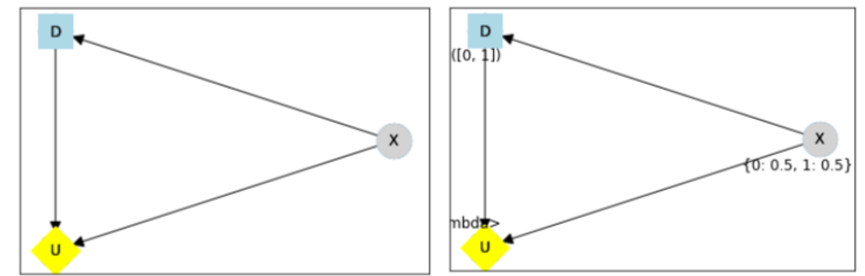
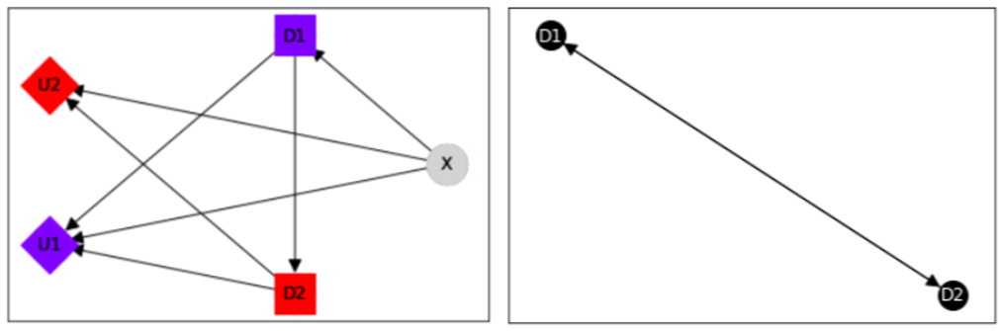
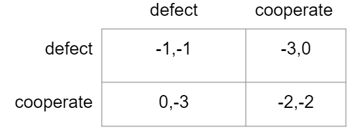

:author: James Fox
:email: james.fox@cs.ox.ac.uk
:institution: University of Oxford

:author: Tom Everitt
:email: tomeveritt@google.com
:institution: DeepMind

:author: Ryan Carey
:email: ryan.carey@jesus.ox.ac.uk
:institution: University of Oxford

:author: Eric Langlois
:email: edl@cs.toronto.edu
:institution: University of Toronto

:author: Alessandro Abate
:email: aabate@cs.ox.ac.uk
:institution: University of Oxford

:author: Michael Wooldridge
:email: mjw@cs.ox.ac.uk
:institution: University of Oxford
:bibliography: mybib

-----------------------------------------------------
PyCID: A Python Library for Causal Influence Diagrams 
-----------------------------------------------------

.. class:: abstract

   Why did a decision maker choose a certain decision? What behaviour does a
   certain objective incentivise? How can we improve this behaviour and ensure
   that a decision-maker chooses decisions with safer or fairer consequences?
   This paper introduces the Python package *PyCID*, built upon *pgmpy*, that
   implements (causal) influence diagrams, a well-studied graphical modelling framework for 
   decision-making problems. By providing numerous methods to solve and analyse
   (causal) influence diagrams, *PyCID* helps answer questions about behaviour
   and incentives in both single-agent and multi-agent settings.

.. class:: keywords

   Influence Diagrams, Causal Models, Probabilistic Graphical Models, Game Theory, Decision Theory

Introduction
------------
   
Influence-diagrams (IDs) are used to represent and analyse decision making situations under uncertainty (:cite:`howard2005influence`, :cite:`miller1976development`). Like Bayesian Networks, IDs have at their core a directed acyclic graph, but IDs also specify decision and utility nodes. IDs describe interactions between a set of variables and become influence models (IMs) when conditional probability distributions are attached to the graph’s nodes. A decision-maker is interested in choosing a decision rule for a decision (conditional on the values of its parents in the ID) that maximises its expected utility. IMs have been extended to multi-agent settings (:cite:`koller2003multi`, :cite:`hammond2021equilibrium`) and causal influence models (CIMs) :cite:`everitt2021agent` allow for causal interventions and the ability to ask counterfactual questions :cite:`pearl2009causality`.
   
Statistical and causal IDs have already shown promise for a wide variety of applications from the design of AI systems with safe and fair incentives (:cite:`everitt2021agent`, :cite:`carey2020incentives`, :cite:`everitt2019reward`, :cite:`holtman2020towards`, :cite:`everitt2019modeling`, :cite:`langlois2021rl`, and :cite:`cohen2020asymptotically`) to applications in business and medical decision making (:cite:`gomez2004real`, :cite:`kjaerulff2008bayesian`). Nevertheless, although Python libraries exist for Bayesian networks, perhaps most prominently, *pgmpy* :cite:`ankan2015pgmpy`, these libraries lack specific support for IDs. We found two Python wrappers of C++ influence diagram libraries: *pyAgrum* and *PySMILE*. These were limited by usability (we couldn’t readily install them), maintainability (using multiple languages) and versatility (they did not cover multi-agent or causal IMs). A Python library that focuses on implementing statistical and causal IDs is therefore needed to ensure their potential application can be explored, probed, and fully realised.
 
Consequently, this paper introduces *PyCID*, a Python library built upon *pgmpy* and *networkx* :cite:`hagberg2008exploring`, that concentrates on this need for an implementation of IDs and IMs (including their causal and multi-agent variants) and provides researchers and practitioners with convenient methods for analysing decision-making situations. *PyCID* can solve single-agent IDs, find Nash equilibria in multi-agent IDs, and compute the effect of causal interventions. It can also find which variables in an ID admit incentives. For example, positive value of information :cite:`howard1966information` and value of control :cite:`shachter1986evaluating` tell us when an agent can benefit from observing or controlling a variable. Meanwhile other incentives concepts, recently proposed in :cite:`everitt2021agent`, reveal which variables it can be instrumentally useful to control and when a decision-maker benefits from responding to a variable :cite:`everitt2021agent`. Reasoning patterns are a related concept in multi-agent IDs, they analyze why a decision-maker would care about a decision :cite:`pfeffer2007reasoning`, and these can also be computed in *PyCID*.  
 
The next section will describe *PyCID*'s architecture along with installation instructions and some necessary background knowledge. We then move to showcasing some of *PyCID*'s features through applications to incentives and analysing games. In the *Causal Influence Diagrams* section, we demonstrate how to instantiate a simple CID in *PyCID* before demonstrating how to find the nodes which admit incentives in the *Incentives* section. Next, we turn to multi-agent CIDs and show how to use them to compute Nash equilibria. Finally, we explain how *PyCID* can construct random (MA)CIDs and conclude by discussing the future of *PyCID*.
   
   
Background and Package Architecture
------------------------------------
   
Installation
++++++++++++
   
*PyCID* is released under the *Apache License 2.0*. It requires *Python 3.7* or above, but only depends on *matplotlib* :cite:`hunter2007matplotlib`, *networkx* :cite:`hagberg2008exploring`:, *numpy* :cite:`harris2020array` and *pgmpy* :cite:`ankan2015pgmpy`. It can be downloaded and installed in a Python virtual environment or in a Conda environment using:
   
.. code-block:: shell
   
   python3 -m pip install pycid
   
   
PyCID is under continual development and so one can install the latest developmental package using a git checkout from the PyCID repository on Github, https://github.com/causalincentives/pycid.
   
Notation
++++++++
Throughout, we will use capital letters, :math:`X`, for random variables and let :math:`dom(X)` denote its domain. An assignment :math:`x \in dom(X)` to :math:`X` is an instantiation of :math:`X` denoted by :math:`X=x`. :math:`\textbf{X} = \{X_1, \dots, X_n\}` is a set of variables with instantiation :math:`\textbf{x} = \{x_1, \dots, x_n\}`. We also let :math:`\textbf{Pa}_V` denote the parents of a node :math:`V` in a (MA)CID and :math:`\textbf{pa}_V` be the instantiation of :math:`\textbf{Pa}_V`. 
Moreover, we define :math:`\textbf{Desc}_V`, and :math:`\textbf{Fa}_V := \textbf{Pa}_V \cup \{V\}` to be the descendants and family of :math:`V`. 
We use subscripts to index the elements of a set and, in a multi-agent setting, superscripts to indicate a player :math:`i \in \textbf{N}`; for example, the set of decisions belonging to player :math:`i` is :math:`\textbf{D}^i=\{D^i_1,...,D^i_n\}`.
   
Base Classes
++++++++++++
   
.. figure:: pycid.PNG
   :align: center
   :figclass: bht
   
   An overview of *PyCID*'s file structure. :label:`pycidfig`
   
Figure :ref:`pycidfig` provides an overview of *PyCID*'s library [#]_. *PyCID*'s key classes inherit from *pgmpy*'s ``BayesianModel``, ``TabularCPD``, and ``BeliefPropagation`` classes :cite:`ankan2015pgmpy`. The ``BayesianModel`` class represents a *Bayesian network* - a model consisting of a directed
acyclic graph (DAG) and a joint distribution Markov compatible with that graph :cite:`pearl2009causality`. The nodes in the DAG denote random variables and the directed edges represent the associational relationships between them. To parameterise the DAG and encode the joint distribution, each random variable, :math:`V`, in the DAG is assigned a conditional probability distribution
(CPD), :math:`P(V\vert \textbf{Pa}_V)`, dependent on its set of graphical parents, :math:`\textbf{Pa}_V`, using instances of the ``TabularCPD`` class. These CPDs define the *Bayesian Network*'s joint distribution
and the ``BeliefPropagation`` class is then used to perform probabilistic inference on a ``BayesianModel`` object; for instance, one can query the probability that node :math:`V` takes value 
:math:`v` given some instantiation of other variables in the DAG (known as a *context*). 
   
Turning to *PyCID*, we first focus on the key classes housed in the *core/* folder. *PyCID*'s base class is ``CausalBayesianNetwork``. This class inherits from *pgmpy*'s ``BayesianModel`` and represents a *causal Bayesian network* - a Bayesian network where the directed edges in the DAG now represent every causal relationship between the Bayesian network's variables. It, therefore, extends ``BayesianModel`` by adding the ability to query the effect of *causal interventions*, to determine the expected value of a variable for a given *context* (again under an optional *causal intervention*), and to plot the DAG of the *Causal Bayesian Network* using *networkx* :cite:`hagberg2008exploring`. CPDs for a ``CausalBayesianNetwork`` object can be defined using *pgmpy*'s ``TabularCPD`` class, but we introduce a new class in *PyCID*, ``StochasticFunctionCPD``, which can be used to specify relationships between variables with a stochastic function, rather than just with a probability matrix (see the *Causal Influence Diagrams* section). ``CausalBayesianNetwork`` also has an inner class, ``Model``, which keeps track of CPDs and domains for all ``CausalBayesianNetwork`` objects' variables in the form of a dictionary.
   
.. [#] *PyCID* is under continued development, so more features will be added over time.
   
Classes for Causal Influence Diagrams
+++++++++++++++++++++++++++++++++++++
   
Causal Influence Diagrams (CIDs) are *Causal Bayesian network* graphs, but with the nodes partitioned into chance, decision, and utility nodes :cite:`everitt2021agent`. Causal Influence models (CIMs) are parameterised CIDs where, at the outset, the CPDs for chance and utility nodes are defined, but only the domains for the decision variables are fixed.
Formally, they are defined as follows:
   
**Definition 1** :cite:`everitt2021agent` A **Causal influence Diagram (CID)** is a tuple :math:`(\textbf{V}, \textbf{E})` where :math:`(\textbf{V}, \textbf{E})` is a directed acyclic graph with a set of vertices :math:`\textbf{V}` connected by directed edges :math:`\textbf{E} \subseteq \textbf{V} \times \textbf{V}`. This DAG must be compatible with a set of possible causal intervention distributions that results from causally intervening on any subset of the CID's nodes. These vertices are partitioned into :math:`\textbf{D}`, :math:`\textbf{U}`, and :math:`\textbf{X}`, which correspond to decision, utility, and chance nodes respectively.
   
**Definition 2** :cite:`everitt2021agent` A *Causal influence Model (CIM)* is a tuple :math:`(\textbf{V}, \textbf{E}, \theta)`  where :math:`(\textbf{V}, \textbf{E})` is a CID and :math:`\theta \in \Theta` is a 
particular parametrisation over the nodes in the graph specifying for each node :math:`V \in \textbf{V}` a finite domain :math:`dom(V)`, 
for each utility node :math:`U \in \textbf{U}` a real-valued domain :math:`dom(U) \subset \mathbb{R}`, and for every chance and utility node a conditional probability distribution (CPD) :math:`P(V \mid \textbf{Pa}_V)` . 

   
Multi-agent Causal Influence Diagrams (MACIDs) partition decision and utility nodes further into sets associated with each agent. In a (MA)CID, the agent(s) would like to select a decision rule (a CPD), :math:`\pi_D(D|\textbf{Pa}_D)`, for each of their decisions so as to maximise their expected utility. A policy :math:`\pi^i` assigns decision rules to all of agent :math:`i`'s decision nodes, and, in a MACIM, a policy profile, :math:`\pi`, assigns policies to every agent.  

The ``MACIDBase`` class, which inherits from ``CausalBayesianNetwork``, provides the underlying necessary methods for single-agent and multi-agent causal influence diagrams. The class includes methods for determining the expected utility of an agent, for finding optimal decision rules and policies, and for finding various new graphical criteria defined in influence diagrams (e.g. r-relevance). 

``CID`` and ``MACID`` are classes, inheriting from ``MACIDBase``, that represent single-agent and multi-agent CIDs and are the models of most concern in *PyCID*. They include methods for finding the optimal policy for an agent in a CIM and for finding Nash equilibria :cite:`nash1950equilibrium` and
subgame perfect Nash equilibria :cite:`selten1965spieltheoretische` in a MACIM. It is important to highlight here that statistical (i.e. non-causal) single-agent and multi-agent influence diagrams can also be defined as ``CID`` and ``MACID`` objects using *PyCID*. In their case, all class methods are permitted except those which involve causal interventions.
   
*PyCID's other folders*
+++++++++++++++++++++++
   
The *core/* folder also contains `get_paths.py`, which provides functions that exploit relationships between the (MA)CID's variables including functions for finding all (active) (directed) paths between variables. `relevance_graph.py` provides classes
that find the relevance graphs :cite:`koller2003multi` associated with ``MACIDBase`` objects. The *analyse/* folder includes functions for determining incentives in CIDs :cite:`everitt2021agent` and reasoning patterns in MA(C)IDs :cite:`pfeffer2007reasoning` as well as a function for computing the *total effect* of intervening on a variable with different values. *examples/* contains pre-implemented CIDs and MACIDs,
whilst *random/* contains functions for generating random CIDs and MACIDs. *notebooks/* contains *jupyter notebook* tutorials with demonstrations of how to use the codebase; these can also be run directly as *Google Colab notebooks*.
Finally, *tests/* houses unit tests for all functions and public class methods; it contains a bash script `check-code.sh` for ensuring that all unit tests pass with *pytest*, for checking linting with *flake8*, and for checking types have been declared with *mypy*.
   
Causal Influence Diagrams
--------------------------
   
In the previous section, we defined CIDs and CIMs. For many purposes, including finding incentives in single-decision CIDs (see the next section), we only need to know the causal relationships between variables (we need not specify a parameterisation). We will therefore start by showing how to instantiate a simple CID in *PyCID*.
   
Consider a simple 3 node CID where an agent's utility :math:`U` depends on their decision selected at :math:`D` and the value of a random chance variable :math:`X`. Also, assume that the agent can observe the value of :math:`X` before they decide on their decision.
A CID for this example is created as an instance of our ``CID`` class.  Its constructor takes a list of edges as its first argument and then two more lists specifying the CID's decision and utility nodes. All other nodes introduced in the edge pairs, which are not decision or utility nodes, are chance nodes.
   
.. code-block:: python
   
   cid = pycid.CID(
      [("X", "D"), ("X", "U"), ("D", "U")],
      decisions=["D"],
      utilities=["U"],
   )
   cid.draw()
   
The ``CID`` class method, `draw`, plots this single-agent CID (Figure :ref:`cidfig`). Decision variables are denoted by blue rectangles, utility nodes by yellow diamonds, and chance nodes by grey circles.  
   

   
   A simple CID (Left) and corresponding CIM (Right) plotted using *PyCID*. :label:`cidfig`
   
To then parameterise this CID as a CIM by adding a domain for :math:`D` and CPDs for :math:`X` and :math:`U`, we pass keyword arguments to the `add_cpds` method. 
   
.. code-block:: python
   :linenos:
   
      cid.add_cpds(
         X=pycid.discrete_uniform([0, 1]),
         D=[0, 1],
         U=lambda x, d: int(x == d),
      )
   
On line 2 above, we assign variable X a discrete uniform distribution over its domain, :math:`dom(X)=\{0,1\}`; on line 3, we specify :math:`dom(D)=\{0,1\}`; and on the final line, we specify how the value of :math:`U` depends on the values of its parents.
CPDs in *PyCID* are ``StochasticFunctionCPD`` objects. There are other ways to specify how a chance or utility variable's CPD is defined. For example, line 1 below changes the CPD for :math:`X` to now follow a Bernoulli(0.8) distribution and line 2 specifies that now
:math:`U` copies the value of :math:`D` with probability 0.4.

.. code-block:: python
   :linenos:
   
      cid.add_cpds(X=pycid.bernoulli(0.8))
      cid.add_cpds(U=lambda x, d: pycid.noisy_copy(d, \
                  probability=0.4, domain=[0, 1]))   
   
We can now *solve* this CIM by finding the agent's optimal decision rule for :math:`D`: 
   
.. code-block:: python
   
      cid.solve()
   
This returns the following output saying that the optimal decision rule for :math:`D` is to choose action 0 when the value of :math:`X` is 0, and action 1 when the value of :math:`X` is  1:
   
.. code-block:: python
   
      {'D': StochasticFunctionCPD<D> 
      {'x': 0}  ->  0
      {'x': 1}  ->  1}
   
If the agent plays according to this optimal decision rule, we find that their expected utility is 1 using the code below. On the final line, `expected_utility` accepts optional dictionaries to specify contexts and interventions. 
   
.. code-block:: python
   
      solution = cid.solve() 
      optimal_d_cpd = solution['D']
      cid.add_cpds(optimal_d_cpd)
      cid.expected_utility(context={}, intervention={})

Incentives
----------
   
In this section, we demonstrate how to use *PyCID* to find which nodes in a single-decision CID face which type of incentive :cite:`everitt2021agent` using an incentive's graphical criterion. In general, a graphical criterion tells you what properties influence models can have, based on the influence diagram (i.e the graph) alone. A graphical criterion takes a graph and several nodes as arguments and returns whether or not the property (in this case the incentive) can occur for those nodes. Incentives are helpful for applications in safety and fairness (:cite:`everitt2021agent`, :cite:`holtman2020towards`), understanding the behaviour of RL algorithms :cite:`everitt2019reward` and comparing the promise of different AGI safety frameworks :cite:`everitt2019modeling`.
We believe that *PyCID* can further mature these enquiries.
   
The incentives we can currently find in a single-decision CID using their graphical criteria in *PyCID* are:
   
*  Value of information (VoI)
*  Response Incentives (RI)
*  Value of Control (VoC) [#]_ 
*  Instrumental Control Incentives (ICI)
   
.. [#] Nodes can be specified further as admitting indirect or direct Value of Control.
   
   
Although we refer the interested reader to :cite:`everitt2021agent` for full incentive definitions, we shall provide each incentive's graphical criterion as we go, demonstrating how to use *PyCID* to find them with the same examples that were used in :cite:`everitt2021agent`. Because :cite:`everitt2021agent` proved that all of these incentives are sound and complete, we can find whether a node admits a certain incentive using just CIDs (not CIMs); however, *PyCID* also provides functions - `quantitative_voi` and `quantitative_voc` - that return the quantitative VoI and VoC of variables in a CIM.
   
Value of Information (VoI)
++++++++++++++++++++++++++
   
Intuitively, a variable has positive value of information (VoI) if a decision-maker would benefit from knowing its value before making a decision. The graphical criterion for this incentive is based upon which nodes are **requisite** observations in the CID. 
   
   
**Requiste Observation Graphical Criterion**: Let :math:`\textbf{U}_D \in \textbf{U} \cap \textbf{Desc}_D` be the utility nodes that are in the set of :math:`D`'s descendents. An observation :math:`X \in \textbf{Pa}_D` in a single-decision CID is **requisite** if :math:`X \not\perp \textbf{U}_D \vert (\textbf{Pa}_D \cup \{D\} \setminus \{X\}` [#]_.
   
   
**VoI Graphical Criterion**: A single decision CID, :math:`\mathcal{G}`, admits **Value of Information** for :math:`X \in \textbf{V} \setminus \textbf{Desc}_D` if and only if :math:`X` is a requisite observation in :math:`\mathcal{G}_{X \rightarrow D}`, the graph obtained by adding :math:`X \rightarrow D` to :math:`\mathcal{G}`.
   
.. [#] :math:`X \not\perp Y` denotes that :math:`X` is d-connected to :math:`Y` and :math:`X \perp Y` would denote that :math:`X` is d-separated from :math:`Y` :cite:`pearl2009causality`

   
To demonstrate how to find nodes that admit VoI using *PyCID*, we will consider the following example taken from :cite:`everitt2021agent`.
   
**Grade prediction example:** To decide which applicants to admit, a university uses a model to predict (:math:`P`) the grades of new students. The university would like the system to predict accurately (:math:`Ac`), without treating students differently based on their gender (:math:`Ge`) or race (:math:`R`). 
The prediction model uses the gender of the student and the high school (:math:`HS`) they attended to make its grade prediction. 
In this hypothetical cohort of students we make the following assumptions:

*  Performance at university is evaluated by a student's grades (:math:`Gr`) and this depends on the quality of education (:math:`E`) the student received before university (which depends on the high school they attended). 
*  A student’s high school is assumed to be impacted by their race, but gender is assumed not to have an effect on the high school they attended.

   
We want to know whether the predictor is incentivised to behave in a discriminatory manner with respect to the students’ gender or race. A CID for this example is defined below.
   
.. code-block:: python
   
   cid = pycid.CID(
      [
         ("R", "HS"),
         ("HS", "E"),
         ("HS", "P"),
         ("E", "Gr"),
         ("Gr", "Ac"),
         ("Ge", "P"),
         ("P", "Ac"),
      ],
      decisions=["P"],
      utilities=["Ac"],
   )
   
*PyCID* finds that :math:`HS`, :math:`E`, and :math:`Gr` can all have positive VoI for the predictor model:
   
.. code-block:: python
   
   pycid.admits_voi_list(cid, 'P')  
   
We could also display this visually by passing, as an argument, a lambda function into ``CID``'s `draw_property` method:
   
.. code-block:: python
   
   cid.draw_property(lambda node: \
         pycid.admits_voi(cid, 'P', node))
   
.. figure:: voi_cid.PNG
      :align: center
      :figclass: bht
   
      A CID for the *Grade prediction example* with the variables that admit VoI coloured red (plotted using *PyCID*). :label:`cidvoifig`
   
Straightforwardly implementing this example in *PyCID* has immediately revealed that there exists a parameterisation of this setup (i.e. a CIM with the given CID) where the prediction model would benefit from knowing the value of one or more of "High School', 'Education', or the student's true 'Grade' before making a grade prediction.
   

Response Incentives (RI)
++++++++++++++++++++++++
   
Response incentives are a related type of incentive. A variable admits a response incentive if a decision-maker benefits from making its decision causally responsive to the variable :cite:`everitt2021agent`. 
   
   **RI Graphical Criterion**: A single decision CID, :math:`\mathcal{G}`, admits a **response incentive** on :math:`X \in \textbf{X}` if and only if the there is a directed path :math:`X \dashrightarrow D` in the requisite graph [#]_ :math:`\mathcal{G}_{req}` where :math:`\mathcal{G}_{req}` is the result of removing from :math:`\mathcal{G}` all information links from non-requisite observations.
   
   
.. [#] A requisite graph is also known as a minimal reduction, trimmed_graph, or d-reduction.
   
To demonstrate how to find the nodes which admit RIs, we will again consider the **Grade prediction example**. As we did with VoI, we can list all of the nodes that admit response incentives in the CID (line 1) or we can display the result visually (line 2) with the result shown in Figure :ref:`cidrifig` (Left).
   
.. code-block:: python
   :linenos:
   
      pycid.admits_ri_list(cid, 'P')
      cid.draw_property(lambda node: \
            pycid.admits_ri(cid, 'P', node))
   
Implementing CIDs in *PyCID* can help suggest how to improve the fairness of AI systems. This is because :cite:`everitt2021agent` argue that a response incentive on a sensitive attribute can be interpreted as problematic from a fairness perspective. 
A decision is considered counterfactually unfair if a change to a sensitive attribute, such as race or gender, would change the decision :cite:`kusner2017counterfactual`. Therefore, a response incentive on a sensitive attribute indicates that counterfactual unfairness is incentivised; specifically, it implies that all optimal policies are counterfactually unfair. To mitigate this,
:cite:`everitt2021agent` propose redesigning the grade-predictor. By removing the predictor's access to knowledge about the student's high school (i.e. the edge :math:`HS \rightarrow P` ), there will no longer be a response incentive on a sensitive attribute. The following code trims the edge and shows that now no node admits an RI in the modified CID (Figure :ref:`cidrifig` (Right)).
   
   
.. code-block:: python
   
   cid.remove_edge('HS', 'P')
   cid.draw_property(lambda node: \ 
         pycid.admits_ri(cid, 'P', node))
   
   
.. figure:: ri_cid.PNG
   :align: center
   :figclass: bht
   
   (Left) The original CID for the **Grade prediction example** with the variables that admit RI coloured red and (Right) the modified CID in which now no node admits an RI (plotted using *PyCID*). :label:`cidrifig`
   
   
   
Value of Control (VoC) and Instrumental Control Incentives (ICI)
++++++++++++++++++++++++++++++++++++++++++++++++++++++++++++++++
   
We now turn to Value of Control (VoC) and Instrumental Control Incentives (ICI). Intuitively, a variable has *positive value of control (VoC)* if a decision-maker could benefit from choosing that variable's value. Whereas, Instrumental Control Incentives can be intuitively understood as follows: 
if the agent got to choose :math:`D` to influence :math:`X` independently of how :math:`D` influences other aspects of the environment, would that choice matter? In other words, is controlling :math:`X` instrumentally useful for maximising utility? The graphical criteria for these incentives in a single-decision CID are:
   
   **VoC Graphical Criterion**: A single decision CID, :math:`\mathcal{G}`, admits 
   **positive value of control** for a node :math:`X \in \textbf{V} \setminus \{D\}` if and only if
   there is a directed path :math:`X \dashrightarrow U` in the requisite graph :math:`\mathcal{G}_{req}`.
   
   
   **ICI Graphical Criterion**: A single decision CID, :math:`\mathcal{G}`, admits an **instrumental control incentive** on :math:`X \in \textbf{V}` if and only if :math:`\mathcal{G}` has a directed path
   from the decision :math:`D` to a utility node :math:`U \in \textbf{U}` that passes through :math:`X`.
   
To demonstrate how to find these incentives in *PyCID*, we introduce another example from :cite:`everitt2021agent`.
   
**Content recommendation example:** An AI algorithm has the task of choosing posts (:math:`P`) to show a user to maximise the user's click rate (:math:`C`). The designers want the algorithm to present content adapted to each user’s original opinions (:math:`O`) to optimize clicks; the algorithm does not know the user's true original opinions, so it instead relies on an approximate model (:math:`M`). However, the designers are worried that the algorithm will use polarising content to influence user opinions (:math:`I`) so that the user clicks more predictably.

.. code-block:: python
   
   cid = pycid.CID(
      [
         ("O", "M"),
         ("O", "I"),
         ("M", "P"),
         ("P", "I"),
         ("I", "C"),
         ("P", "C"),
      ],
      decisions=["P"],
      utilities=["C"],
   )
   
   cid.draw_property(lambda node: \
         pycid.admits_ici(cid, 'P', node))
   
With RI, we showed that implementing CIDs in *PyCID* can aid the design of fairer systems. With ICI, we demonstrate how *PyCID* can be used to help design safer AI systems. First, we can use analogous functions to what we used for VoI and RI - `pycid.admits_voc_list(cid)` and `pycid.admits_ici_list(cid, 'P')` - to find that :math:`O`, :math:`M`, :math:`I`, and :math:`C` can have positive VoC whilst :math:`I`, :math:`P`, and :math:`C` admit ICI. From this, because :math:`I` (influenced user opinions) admits an instrumental control incentive, we discover that the content recommender may seek to influence that variable to attain utility. :cite:`everitt2021agent` offer an alternative content recommender design that avoids this undesirable behaviour. 
Instead of being rewarded for the true click-through rate, the content recommender is rewarded for the clicks it would be predicted to have, based on a separately trained model of the user's preferences. The modified CID for this changed model is shown in Figure :ref:`cidicifig` c) where the old utility node :math:`C` (actual clicks) has become :math:`PC` (predicted clicks).
   
.. code-block:: python
   
   cid = pycid.CID(
      [
         ("O", "M"),
         ("O", "I"),
         ("M", "P"),
         ("M", "PC"),
         ("P", "I"),
         ("P", "PC"),
      ],
      decisions=["P"],
      utilities=["PC"],
   )
   
   cid.draw_property(lambda node: \
         pycid.admits_ici(cid, 'P', node))
   
.. figure:: cid_ici.PNG
   :align: center
   :figclass: bht
   
   The original CID for the **Content recommendation example** in (a) with (b) the variables that admit ICI coloured red and (c) the modified content recommender's CID in which (d) :math:`I` no longer admits an ICI (plotted using *PyCID*). :label:`cidicifig`
   
   
Multi-agent (Causal) Influence Diagrams
-----------------------------------------
   
Recall from the *Background and Package Architecture* Section that a Multi-agent Causal Influence Diagram/Model (MACID/MACIM) is a simple multi-agent extension of a CID/CIM :cite:`causalgames`. For our purpose, all that's important is that there is now a set of :math:`\textbf{N}` agents and so the decision and utility nodes are partitioned into 
:math:`\{\textbf{D}^i\}_{i\in \textbf{N}}` and :math:`\{\textbf{U}^i\}_{i\in \textbf{N}}` to correspond to their association with a particular agent :math:`i \in \textbf{N}`. We also again underline that the only difference between statistical multi-agent influence diagrams/models (MAIDs/MAIMs) and MACIDs/MACIMs is that the edges
represent every causal relationship between the random variables chosen to be endogenous variables in the model as opposed to just associational relationships. Nevertheless, because MACIDs subsume MAIDs (in the sense of Pearl's `causal hierarchy` :cite:`pearl2009causality`), everything we can do in a MAID, we can also do in a MACID. Therefore, for the examples we present here, MAIDs and MACIDs can be viewed as the same. In this section, we will show how to instantiate a MACID in *PyCID* and demonstrate some useful functions that use the graph to expose dependencies between variables.
   
**Hospital procurement example:** A hospital employs an AI system to automate a procurement process. A company wants to tender a contract to the hospital for the supply of some medical equipment. Beforehand, they can choose whether or not to get independent accreditation to signal that their equipment is of high not poor quality, but doing so requires a cost (that is greater if the product is indeed poor). The AI system must decide, on behalf of the hospital, whether to accept the company's offer. The hospital only wants to sign a contract with a company that will supply high-quality equipment, but the AI system can't observe the quality of the equipment directly, it can only infer it indirectly through whether or not the company has independent accreditation. 

We can construct a MACID for this example where:
   
*  X = whether the company's goods are of high or poor quality (chance node)
*  D1 and U1 correspond to the company's decision whether or not to go get independent accreditation (and their utility)
*  D2 and U2 correspond to the algorithm's decision whether or not to sign a contract with the company (and the company's utility)
   
.. code-block:: python
   
   macid = pycid.MACID(
      [
         ("X", "D1"),
         ("X", "U2"),
         ("X", "U1"),
         ("D1", "D2"),
         ("D1", "U1"),
         ("D2", "U1"),
         ("D2", "U2"),
      ],
      # specifies each agent's decision and utility nodes.
      agent_decisions={1: ["D1"], 2: ["D2"]},
      agent_utilities={1: ["U1"], 2: ["U2"]},
   )
   
   macid.draw()
   

   
   A MACID for the **Hospital procurement example** (Left) and its corresponding relevance graph (Right) (plotted using *PyCID*). :label:`macidfig`
   
Figure :ref:`macidfig` (Left) shows that in *PyCID*, consistent with CIDs, chance nodes in MACIDs are drawn as circles, decision nodes are drawn as rectangles, and utility nodes are drawn as diamonds. However, because we now have more than one player, we reserve colouring to denote agent membership; each agent of the game is assigned a unique colour.
   
:cite:`hammond2021equilibrium` introduced the graphical criterion *r-reachability* to determine whether another decision node is strategically relevant or a chance node is probabilistically relevant to a decision node.
   
   **R-reachability Graphical Criterion**: A node $V$ is **r-reachable** from a decision :math:`D \in \textbf{D}^i` in a MAID, :math:`\mathcal{M} = (\textbf{N}, \textbf{V}, \textbf{E})`, if a newly added parent :math:`\hat V` of :math:`V` satisfies :math:`\hat V \not\perp \textbf{U}^i \cap \textbf{Desc}_{D} \mid \textbf{Fa}_{D}`. 
   
Using *PyCID*, lines 1 and 2 below evaluate to True. This tells us that each decision strategically relies on the other. The company would be better off knowing the hospital’s procurement policy before deciding whether or not to go to get accreditation, and the algorithm would also be better off knowing the company’s policy because it doesn’t know the true quality of the company's medical equipment. Line 3 plots the MACID's relevance graph :cite:`koller2003multi`, which shows this visually (Figure :ref:`macidfig` Right)
   
.. code-block:: python
   :linenos:
   
      macid.is_r_reachable('D1', 'D2')
      macid.is_r_reachable('D2', 'D1')
      pycid.RelevanceGraph(macid).draw()
   

Game Theory in Multi-agent (Causal) Influence Models
+++++++++++++++++++++++++++++++++++++++++++++++++++++

In this section, we show how to parameterise a MACID as a MACIM using the Prisoner's Dilemma, which is probably the most well known simultaneous and symmetric two-player game. Next, we will show how to compute Nash equilibria.
   
**Prisoner's Dilemma:** Two prisoners, suspected of committing a robbery together, are isolated and urged to confess.
Each is concerned only with getting the shortest possible prison sentence for himself and each must decide whether to confess without knowing his partner’s decision. Both prisoners, however, know the consequences of their decisions. Each year spent in prison can be represented as -1 utility and so the payoff matrix for this game (or Normal form) is given in Figure :ref:`pdfig`.

   
   Normal form game giving the payoffs for each player in Prisoner's dilemma. Player 1 (2) is the row (column) player. :label:`pdfig`
   
.. code-block:: python
    
   macid = pycid.MACID(
      [
         ("D1", "U1"),
         ("D1", "U2"),
         ("D2", "U1"),
         ("D2", "U2"),
      ],
      agent_decisions={1: ['D1'], 2: ['D2']},
      agent_utilities={1: ['U1'], 2: ['U2']},
   )
   
   d1_domain = ['c', 'd']   
   d2_domain = ['c', 'd']
   
   agent1_payoff = np.array([[-1, -3], [0, -2]])    
   agent2_payoff = np.transpose(agent1_payoff)
   
   macid.add_cpds(
      D1=d1_domain,
      D2=d1_domain,
      U1=lambda d1, d2: agent1_payoff[d1_domain.index(d1), \
                                    d2_domain.index(d2)],
      U2=lambda d1, d2: agent2_payoff[d1_domain.index(d1), \
                                    d2_domain.index(d2)]
   )
   
We can draw the MACID in the same way as for CIDs:
   
.. code-block:: python
   
   macid.draw()
   
Finally, as we could in CIDs, we can compute the effects of interventions and find each agent's expected utility in MACIDs. For example, the following command tells us that the second player (agent) receives expected utility = -3 given the assigned context. This agrees with the payoff matrix in Figure :ref:`pdfig`.
   
.. code-block:: python
   
   macid.expected_utility(context={'D1':'d', 'D2': 'c'}, \
                         agent=2)

We use :math:`\pi_{\textbf{A}}` to denote player :math:`i`'s set of decision rules for decisions :math:`\textbf{A} \subseteq \textbf{D}^i`, given a partial policy profile :math:`\pi_{-\textbf{A}}` over all of the other decision nodes in the MACID, :math:`\mathcal{M}`. We write :math:`\mathcal{U}^i_{\mathcal{M}}(\pi_{\textbf{A}}, \pi_{\textbf{-A}})` to denote the expected utility for player :math:`i` under the policy profile :math:`\pi = (\pi_{\textbf{A}}, \pi_{\textbf{-A}})`.

**Definition:** :cite:`koller2003multi` A full policy profile :math:`\pi` is a **Nash equilibrium (NE)** in a MA(C)IM :math:`\mathcal{M}` if, for every player :math:`i \in \textbf{N}`, :math:`\mathcal{U}^i_\mathcal{M}(\pi^i, \pi^{-i}) \geq \mathcal{U}^i_\mathcal{M}(\hat{\pi}^i, \pi^{-i})` for all :math:`\hat{\pi}^i \in \Pi^i`.
   
To find all pure NE in the MACIM corresponding to the Prisoner's dilemma:
   
.. code-block:: python
   
   macid.get_all_pure_ne()
   
This method returns a list of all pure Nash equilibria in the MA(C)ID. Each NE comes as a list of ``StochasticFunctionCPD`` objects, one for each decision node in the MA(C)ID.
   
.. code-block:: python
   
   [[StochasticFunctionCPD<D1> 
   {}  ->  d,
   StochasticFunctionCPD<D2> 
   {}  ->  d]]
   
In the Prisoner's dilemma, there is only one NE and this involves both player's defecting. We can then find that the expected utility for each agent is -2 under this NE joint policy profile:
   
.. code-block:: python
   
   all_pure_ne = macid.get_all_pure_ne()
   macid.add_cpds(*all_pure_ne[0])
   macid.expected_utility({}, agent=1)
   macid.expected_utility({}, agent=2)
   
   
*PyCID* can also be used to find subgame perfect Nash Equilbria :cite:`selten1965spieltheoretische`.
   
**Definition:** :cite:`hammond2021equilibrium` A full policy profile :math:`\pi` is a **subgame perfect equilibrium (SPE)** in a MA(C)IM :math:`\mathcal{M}` if :math:`\pi` is an NE in every MAIM subgame [#]_ of :math:`\mathcal{M}`.
      
**Taxi Competition Example** Two autonomous taxis, operated by different companies, are driving along a road with two hotels located next to one another -- one expensive and one cheap. Each taxi must decide (one first, then the other) which hotel to stop in front of, knowing that it will likely receive a higher tip from guests of the expensive hotel. However, if both taxis choose the same location, this will reduce each taxi's chance of being chosen by that hotel's guests.

   .. [#] We refer the interested reader to :cite:`hammond2021equilibrium` for a definition of a MAIM subgame.

The payoffs for each player are shown in Figure :ref:`taxipofig` and the MACIM for this example is instantiated in *PyCID* below

.. figure:: taxi_payoffs.PNG
   :align: center
   :figclass: bht
   
   Payoff matrices for taxi 1 (left) and taxi 2 (right) for the **Taxi Competition Example** :label:`taxipofig`

.. code-block:: python  

   macid = MACID( 
      [("D1", "D2"), ("D1", "U1"), ("D1", "U2"), 
      ("D2", "U2"), ("D2", "U1")],
      agent_decisions={1: ["D1"], 2: ["D2"]},
      agent_utilities={1: ["U1"], 2: ["U2"]},
   )

   d1_domain = ["e", "c"]
   d2_domain = ["e", "c"]
   agent1_payoff = np.array([[2, 5], [3, 1]])
   agent2_payoff = agent1_payoff.T

   macid.add_cpds(
      D1=d1_domain,
      D2=d2_domain,
      U1=lambda d1, d2: agent1_payoff[d1_domain.index(d1), \
                                     d2_domain.index(d2)],
      U2=lambda d1, d2: agent2_payoff[d1_domain.index(d1), \
                                     d2_domain.index(d2)],
   )

   
.. figure:: macid_taxi.PNG
   :align: center
   :figclass: bht
   
   A MACID for the **Taxi Competition Example** and its corresponding relevance graph (plotted using *PyCID*). :label:`taxifig`
 
This MACIM has three pure NE, which are found using `macid.get_all_pure_ne()`. We can also find the decision nodes in each MAID subgame (see :cite:`hammond2021equilibrium`), the decision nodes that can be optimised independently from the rest:
 
.. code-block:: python
 
   macid.decs_in_each_maid_subgame()
 
.. code-block:: python
 
   [{'D2'}, {'D1', 'D2'}]

   
We can find the NE in the only proper subgame:

.. code-block:: python

   macid.get_all_pure_ne_in_sg(decisions_in_sg=['D2'])

and finally all SPE in the MA(C)IM. The **Taxi Competition Example**'s MACIM has only one pure subgame perfect Nash equilibrium.:

.. code-block:: python

   macid.get_all_pure_spe()

.. code-block:: python

   [[StochasticFunctionCPD<D2> 
   {'d1': 'c'}  ->  e
   {'d1': 'e'}  ->  c,
   StochasticFunctionCPD<D1> 
   {}  ->  e]]
   

Random (MA)CIDs 
---------------
   
*PyCID* also has several other features that can be useful for researchers. In particular, the library also contains functions for instantiating random (MA)CIDs. This is useful for testing the robustness of new theoretical ideas. The first example below finds and plots a random 10 node single-agent CID with two decision nodes and three utility nodes. The second example finds and plots a random 12 node MACID with two agents. The first agent has one decision and two utility nodes, 
the second agent has three decisions and two utility nodes. In both these examples, we set the `add_cpds` flag to `False` to create non-parameterised (MA)CIDs. If one sets this flag to `True`, each chance and utility node is assigned a random CPD, and each decision node a domain to thereby instantiate a (MA)CIM.
One can also force every agent in the (MA)CID to have sufficient recall; an agent has sufficient recall if the relevance graph restricted to include just that agent's decision nodes is acyclic. This can be useful for certain incentives analyses :cite:`multidecision`.
The `edge_density` and `max_in_degree` parameters set the density of edges in the MACID's DAG as a proportion of the maximum possible number (:math:`n \times (n-1)/2`) and the maximum number of edges incident to a node in the DAG. To find a (MA)CID that meets all of the specified constraints, 
*PyCID* uses rejection sampling and so `max_resampling_attempts` specifies the number of samples to try before timing out.
   
.. code-block:: python
   
   cid = pycid.random_cid(
      number_of_nodes=10,
      number_of_decisions=2,
      number_of_utilities=3,
      add_cpds=False,
      sufficient_recall=False,
      edge_density=0.4,
      max_in_degree=5,
      max_resampling_attempts=100,
   )
   cid.draw()
   
   macid = pycid.random_macid(
      number_of_nodes=12,
      agent_decisions_num=(1, 3),
      agent_utilities_num=(2, 2),
      add_cpds=False,
      sufficient_recall=False,
      edge_density=0.4,
      max_in_degree=5,
      max_resampling_attempts=500,
   )
   macid.draw()
   
.. figure:: random_cid.PNG
   :align: center
   :figclass: bht
   
   A random CID and MACID created in *PyCID*. :label:`randomfig`
    

Conclusions and Future Directions
---------------------------------
   
*PyCID* is a Python library for solving and analysing single-agent and multi-agent causal influence diagrams.
Several key classes - ``CausalBayesianNetwork``, ``CID``, and ``MACID`` - enable decision problems to be solved and the effects of causal interventions to be studied whilst *PyCID*'s analysis functions can find graphical properties such as incentives in CIDs, and reasoning patterns in MACIDs. This makes *PyCID* a customizable, but powerful library for testing research ideas and exploring applications. Moreover, implementing examples programmatically can substantiate the claims made by ID researchers about the benefit of their work; one can assess how different quantities vary over the parameter space or empirically verify complexity results :cite:`causalgames`. Single-agent and multi-agent causal influence diagrams are an area of active research, so as theory develops, the *PyCID* library will also grow. Extensions will likely include:
   
*  Support for finding incentives in multi-decision CIDs :cite:`multidecision`:.
*  Support for Structural Causal Models :cite:`pearl2009causality` and therefore also quantitative RI and ICI.
*  More game-theoretic concepts (e.g. more equilibrium concepts).
*  Support for multi-agent incentives. 
   
In this paper, we have demonstrated the usefulness of *PyCID* by focusing on causal influence diagrams; however, this library is also well suited for working with statistical influence diagrams. The development team would like to invite researchers from any domain to use *PyCID* to test the package for diverse applications and to join our Causal Incentives Working Group. The *PyCID* repository is available on GitHub under our working group's organization: https://github.com/causalincentives/pycid. 
   
   
Acknowledgements 
-----------------
   
Fox acknowledges the support of the EPSRC Centre for Doctoral Training in Autonomous Intelligent Machines and Systems (Reference: EP/S024050/1).
