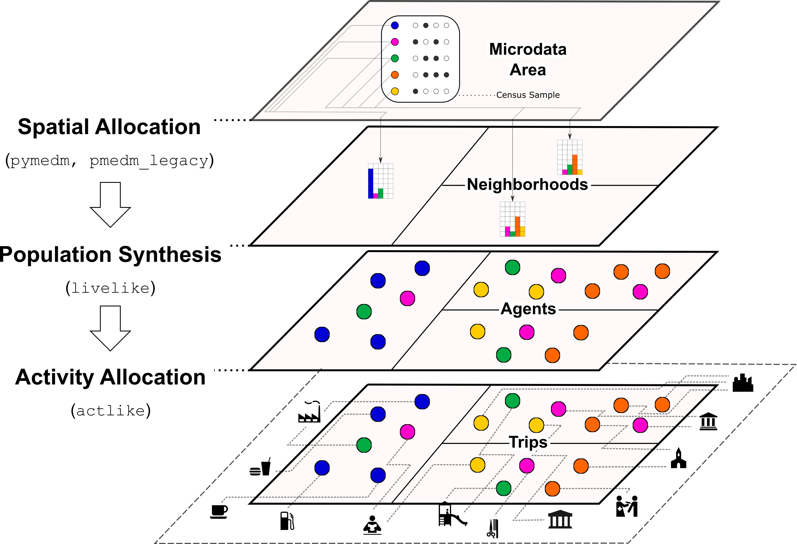
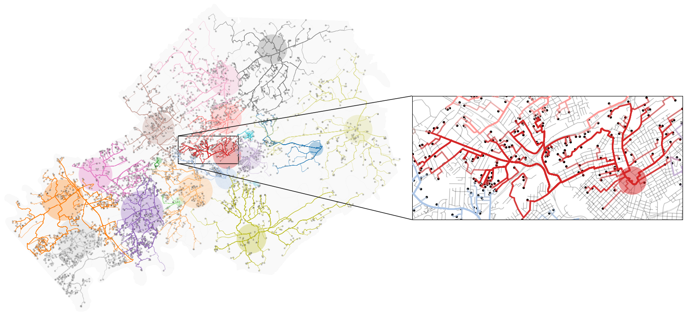
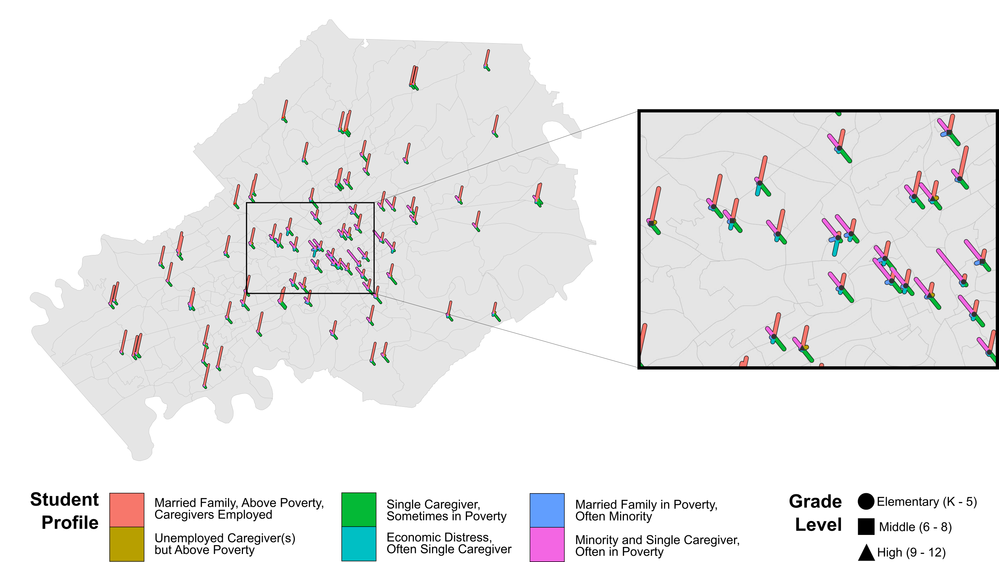
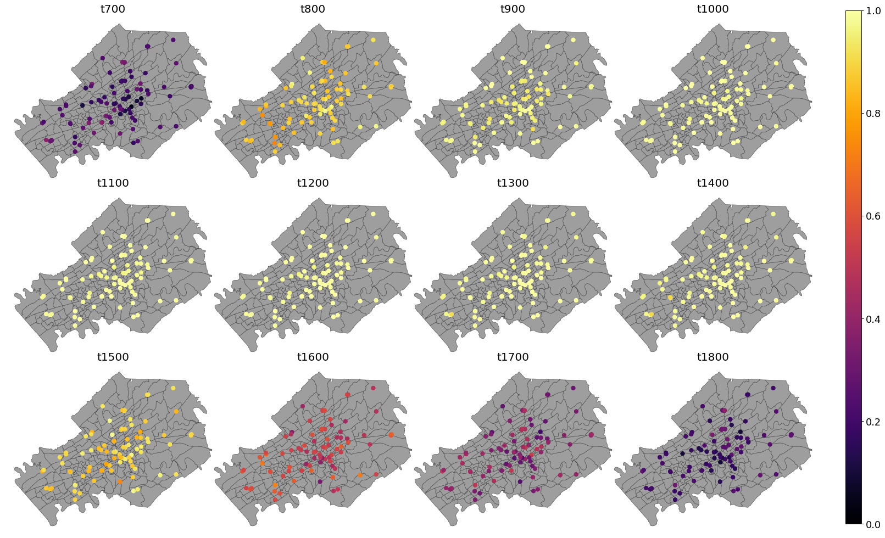

:author: Joseph V. Tuccillo
:email: tuccillojv@ornl.gov 
:institution: Oak Ridge National Laboratory
:orcid: 0000-0002-5930-0943

:author: James D. Gaboardi
:email: gaboardijd@ornl.gov 
:institution: Oak Ridge National Laboratory
:orcid: 0000-0002-4776-6826

:copyright_holder: Oak Ridge National Laboratory.

:bibliography: references

-------------------------------------------------------------------------------
Likeness: a toolkit for connecting the social fabric of place to human dynamics
-------------------------------------------------------------------------------

.. class:: abstract

   The ability to produce richly-attributed synthetic populations is key for understanding
   human dynamics, responding to emergencies, and preparing for future events, all while
   protecting individual privacy. The Likeness toolkit accomplishes these goals with a
   suite of Python packages: ``pymedm``/``pymedm_legacy``, ``livelike``,
   and ``actlike``. This production process is initialized in ``pymedm`` (or
   ``pymedm_legacy``) that utilizes census microdata records as the foundation on
   which disaggregated  spatial allocation matrices are built. The next step, performed by
   ``livelike``, is the generation of a fully autonomous agent population attributed
   with hundreds of demographic census variables. The agent population synthesized in
   ``livelike`` is then attributed with residential coordinates in ``actlike``
   based on block assignment and, finally, allocated to an optimal daytime activity
   location via the street network. We present a case study in Knox County, Tennessee,
   synthesizing 30 populations of public K–12 school students & teachers and allocating
   them to schools. Validation of our results shows they are highly promising by
   replicating reported school enrollment and teacher capacity with a high degree of
   fidelity.

.. class:: keywords

   activity spaces, agent-based modeling, human dynamics, population synthesis

Introduction
------------

.. raw:: latex
    
    \makeatletter
    \let\@oldmakefntext\@makefntext
    \renewcommand\@makefntext[1]{%
      \noindent\makebox[0pt][r]{}#1}
    \makeatother

    \footnotetext{\textit{Notice: This manuscript has been authored by UT-Battelle, LLC under Contract No.
        DE-AC05-00OR22725 with the U.S. Department of Energy. The United States Government
        retains and the publisher, by accepting the article for publication, acknowledges that the
        United States Government retains a non-exclusive, paid-up, irrevocable, world-wide license
        to publish or reproduce the published form of this manuscript, or allow others to do so,
        for United States Government purposes. The Department of Energy will provide public access
        to these results of federally sponsored research in accordance with the DOE Public Access
        Plan (http://energy.gov/downloads/doe-public-access-plan).}}
    
    \makeatletter
    \let\@makefntext\@oldmakefntext
    \makeatother

Human security fundamentally involves the functional capacity that individuals possess to
withstand adverse circumstances, mediated by the social and physical environments in which
they live :cite:`hewitt1997perspectives`. Attention to human dynamics is a key piece of
the human security puzzle, as it reveals spatial policy interventions most appropriate to
the ways in which people within a community behave and interact in daily life. For
example, "one size fits all" solutions do not exist for mitigating disease spread,
promoting physical activity, or enabling access to healthy food sources. Rather,
understanding these outcomes requires examination of processes like residential sorting,
mobility, and social transmission.

Modeling these processes at scale and with respect to individual privacy is most commonly
achieved through agent-based simulations on *synthetic populations*
:cite:`swarup2014computational`. Synthetic populations consist of individual agents that,
when viewed in aggregate, closely recreate the makeup of an area's observed population
:cite:`harland2012creating, templ2017simulation`. Modeling human dynamics with synthetic
populations is common across research areas including spatial epidemiology
:cite:`diaz2008health, barrett2008episimdemics, hontelez2011potential,
nurhonen2013pneumococcal, reddy2021cost, sander2009economic`, public health
:cite:`ballas2006using, basra2017community, smith2011can, tomintz2008geography,
morrissey2008examining`, and transportation :cite:`beckman1996creating, zhu2014synthetic`.
However, a persistent limitation across these applications is that synthetic populations
often do not capture a wide enough range of individual characteristics to assess how human
dynamics are linked to human security problems (e.g., how a person's age, limited
transportation access, and linguistic isolation may interact with their housing situation
in a flood evacuation emergency).

In this paper, we introduce Likeness :cite:`tuccillo_jospeh_v_2022_6607533`, a Python
toolkit for connecting the social fabric of place to human dynamics via models that
support increased spatial, temporal, and demographic fidelity. Likeness is an extension of
the UrbanPop framework developed at Oak Ridge National Laboratory (ORNL) that embraces a
new paradigm of "vivid" synthetic populations, in which individual agents may be
attributed in potentially hundreds of ways, across subjects spanning demographics,
socioeconomic status, housing, and health. Vivid synthetic populations benefit human
dynamics research both by enabling more precise geolocation of population segments, as
well as providing a deeper understanding of how individual and neighborhood
characteristics are coupled. UrbanPop's early development was motivated by linking models
of residential sorting and worker commute behaviors :cite:`morton2017hybrid, 
morton2017simulation, aziz2018exploring`. Likeness expands upon the UrbanPop approach by
providing a novel integrated model that pairs vivid residential synthetic populations with
an activity simulation model on real-world transportation networks, with travel
destinations based on points of interest (POIs) curated from location services and federal
critical facilities data.

We first provide an overview of Likeness' capabilities, then provide a more detailed
walkthrough of its central workflow with respect to ``livelike``, a package for
population synthesis and residential characterization, and ``actlike`` a package for
activity allocation. We provide preliminary usage examples for Likeness based on 1) social
contact networks in POIs 2) 24-hour POI occupancy characteristics. Finally, we discuss
existing limitations and outlook for future development.

Overview of Core Capabilities and Workflow
------------------------------------------

UrbanPop initially combined the vivid synthetic populations produced from the American
Community Survey (ACS) using P-MEDM with a commute model based on origin-destination
flows, to generate a detailed dataset of daytime and nighttime synthetic populations
across the United States :cite:`morton2017simulation`. Our development of Likeness is
motivated by extending the existing capabilities of UrbanPop to routing libraries
available in Python like ``osmnx`` [#footnote-osmnx]_ and ``pandana`` [#footnote-pandana]_
:cite:`boeing_osmnx_2017, foti_generalized_2012`. In doing so, we are able to simulate
travel to regular daytime activities (work and school) based on real-world transportation
networks. Likeness continues to use the P-MEDM approach, but is fully integrated with the
U.S. Census Bureau's ACS Summary File (SF) and Census Microdata APIs, enabling the
production of activity models on-the-fly.

   Likeness core capabilities and workflow. :label:`fig:workflow`

Likeness features three core capabilities supporting activity simulation with vivid
synthetic populations (Figure :ref:`fig:workflow`). The first, spatial allocation, is
provided by the ``pymedm`` and ``pmedm_legacy`` packages and uses iterative
proportional fitting (IPF) to downscale census microdata records to small neighborhood
areas, providing a basis for population synthesis. Baseline residential synthetic
populations are then created and stratified into agent segments (e.g., grade 10 students,
hospitality workers) using the ``livelike`` package. Finally, the ``actlike``
package models travel across agent segments of interest to POIs outside places of
residence at varying times of day.

.. [#footnote-osmnx] https://github.com/gboeing/osmnx
.. [#footnote-pandana] https://github.com/UDST/pandana

Spatial Allocation: the ``pymedm`` & ``pmedm_legacy`` packages
----------------------------------------------------------------

Synthetic populations are typically generated from census microdata, which consists of a
sample of publicly available longform responses to official statistical surveys. To
preserve respondent confidentiality, census microdata is often published at spatial
scales the size of a city or larger. A family of spatial allocation methods known as
Iterative Proportional Fitting (IPF) provide a maximum-likelihood estimator for microdata
responses in small (e.g., neighborhood) areas based on aggregate data published about
those areas (known as "constraints"), resulting in a baseline for population synthesis
:cite:`wheaton2009synthesized, beckman1996creating, templ2017simulation`. UrbanPop is
built upon a regularized implementation of IPF, the *Penalized-Maximum Entropy
Daysmetric Modeling* (P-MEDM) method, that permits many more input census variables than
traditional approaches :cite:`leyk_maximum_2013, nagle2014dasymetric`. The P-MEDM
objective function (Eq. :ref:`eq:pmedm`) is written as: 

.. math::
   :label: eq:pmedm

   \max -\sum_{it}\frac{n}{N}\frac{w_{it}}{d_{it}}\log\frac{w_{it}}{d_{it}} -\sum_{k}\frac{e^2_{k}}{2\sigma_{k}^2}

where :math:`w_{it}` is the estimate of variable :math:`i` in zone :math:`t`,
:math:`d_{it}` is the synthetic estimate of variable :math:`i` in location :math:`t`,
:math:`n` is the number of microdata responses, and :math:`N` is the total population
size.  Uncertainty in variable estimates is handled by adding an error term to the
allocation  :math:`\widehat{pop_{k}} + e_{k}`. This is accomplished by leveraging the
uncertainty in the input variables: the "tighter" the margins of error on the estimate of
variable :math:`k` in place :math:`t`, the more leverage it holds upon the solution
:cite:`nagle2014dasymetric`.

The P-MEDM procedure outputs an *allocation matrix* that estimates the probability
of individuals matching responses from the ACS Public-Use Microdata Sample (PUMS) at the
scale of census block groups (typically 300–6000 people) or tracts (1200–8000 people),
depending upon the use-case.

Downscaling the PUMS from the Public-Use Microdata Area (PUMA) level at which it is
offered (100,000 or more people) to these neighborhood scales then enables us to produce
synthetic populations (the ``livelike`` package) and simulate their travel to POIs
(the ``actlike`` package) in an integrated model. To our knowledge, this integrated
model is the first instance of a microsimulation that is carried out with respect to both
real-world transportation networks and POIs.

Likeness offers two implementations of P-MEDM. The first, the ``pymedm`` package, is
written natively in Python based on ``scipy.optimize.minimize``, and while fully
operational remains in development and is currently suitable for one-off simulations. The
second, the ``pmedm_legacy`` package, uses ``rpy2`` as a bridge to
:cite:`nagle2014dasymetric`'s original
implementation of P-MEDM [#footnote1]_ in R/C++ and is
currently more stable and scalable. We offer ``conda`` environments specific to each
package, based on user preferences.

.. [#footnote1] https://bitbucket.org/nnnagle/pmedmrcpp

Each package's functionality centers around a ``PMEDM`` class, which contains information
required to solve the P-MEDM problem:

- The individual (household) level constraints based on ACS PUMS. To preserve households from the PUMS in the synthetic population, the person-level constraints describing household members are aggregated to the household level and merged with household-level constraints.
- PUMS household sample weights.
- The target (e.g., block group) and aggregate (e.g., tract) zone constraints based on population-level estimates available in the ACS SF.
- The target/aggregate zone 90% MOEs and associated standard errors (:math:`SE = 1.645 \times MOE`).

The ``PMEDM`` classes feature an inner method, ``solve()``, that returns an optimized
P-MEDM solution and allocation matrix. Through a ``diagnostics`` module, users may then
evaluate a P-MEDM solution based on the proportion of published 90% margins of error
(MOEs) from the summary-level ACS data preserved at the target (allocation) scale.

Population Synthesis: the ``livelike`` package
----------------------------------------------

The ``livelike`` package generates baseline residential synthetic populations and performs
agent segmentation for activity simulation.

Specifying and Solving Spatial Allocation Problems
++++++++++++++++++++++++++++++++++++++++++++++++++

The ``livelike`` workflow is oriented around a user-specified *constraints*
file containing all of the information necessary to specify a P-MEDM problem for a PUMA of
interest. "Constraints" are variables from the ACS common among people/households (PUMS)
and populations (SF) that are used as both model inputs and descriptors. The
constraints file includes information for bridging PUMS variable definitions with those
from the SF using helper functions provided by the ``livelike.pums`` module,
including table IDs, sampling universe (person/household), and tags for the range of ACS
vintages (years) for which the variables are relevant.

The primary ``livelike`` class is the ``acs.puma``, which stores information about a
single PUMA necessary for spatial allocation of the PUMS data to block groups/tracts with
P-MEDM. The process of creating an ``acs.puma`` is integrated with the U.S. Census
Bureau's ACS SF and Census Microdata 5-Year Estimates (5YE) APIs
[#footnote2]_. This enables generation of an ``acs.puma`` class with a high-level call
involving just a few parameters: 1) the PUMA's Federal Information Processing Standard
(FIPS) code 2) the constraints file, loaded as a ``pandas.DataFrame`` and 3) the target
ACS vintage (year). An example call to build an ``acs.puma`` for the Knoxville City, TN
PUMA (FIPS 4701603) using the ACS 2015–2019 5-Year Estimates is:

.. [#footnote2] https://www.census.gov/data/developers/data-sets.html

.. code-block:: python

   acs.puma(
       fips="4701603",
       constraints=constraints,
       year=2019
   )

The ``censusdata`` package [#footnote3]_ is used
internally to fetch population-level (SF) constraints, standard errors, and MOEs from the
ACS 5YE API, while the ``acs.extract_pums_constraints`` function is used to fetch
individual-level constraints and weights from the Census Microdata 5YE API.

Spatial allocation is then carried out by passing the ``acs.puma`` attributes to a
``pymedm.PMEDM`` or ``pmedm_legacy.PMEDM`` (depending on user preference). 

.. [#footnote3] https://pypi.org/project/CensusData

Population Synthesis
++++++++++++++++++++

The ``homesim`` module provides support for population synthesis on the spatial allocation
matrix within a solved ``P-MEDM`` object. The population synthesis procedure involves
converting the fractional estimates from the allocation matrix (:math:`n` household IDs by
:math:`m` zones) to integer representation such that whole people/households are
preserved. This ``homesim`` module features an implementation of
:cite:`lovelace_truncate_2013`'s "Truncate, Replicate, Sample" (TRS) method. TRS works by
separating each cell of the allocation matrix into whole-number (integer) and fractional
components, then incrementing the whole-number estimates by a random sample of unit
weights performed with sampling probabilities based on the fractional component. Because
TRS is stochastic, the ``homesim.hsim()`` function generates multiple (default 30)
realizations of the residential population. The results are provided as a
``pandas.DataFrame`` in long format, attributed by:

- PUMS Household ID (``h_id``)
- Simulation number (``sim``)
- Target zone FIPS code (``geoid``)
- Household count (``count``)

Since household and person-level attributes are combined when creating the ``acs.puma``
class, person-level records from the PUMS are assumed to be joined to the synthesized
household IDs many-to-one. For example, if two people, :math:`A01` and :math:`A03`, in
household :math:`A` have some attribute of interest, and there are 3 households of type
:math:`A` in zone :math:`G`, then we estimate that a total of 6 people with that attribute
from household :math:`A` reside in zone :math:`G`.

.. _Agent Generation:

Agent Generation
++++++++++++++++

The synthetic populations can then be segmented into different groups of agents (e.g.,
workers by industry, students by grade) for activity modeling with the ``actlike``
package. Agent segments may be identified in several ways:

- Using ``acs.extract_pums_segment_ids()`` to fetch the person IDs (household serial number + person line number) from the Census Microdata API matching some criteria of interest (e.g., public school students in 10th grade).
- Using ``acs.extract_pums_descriptors()`` to fetch criteria that may be queried from the Census Microdata API. This is useful when dealing with criteria more specific than can be directly controlled for in the P-MEDM problem (e.g., detailed NAICS code of worker, exact number of hours worked). 

The function ``est.tabulate_by_serial()`` is then used to tabulate agents by target
zone and simulation by appending them to the synthetic population based on household ID,
then aggregating the person-level counts. This routine is flexible in that a user can use
any set of criteria available from the PUMS to define customized agents for mobility
modeling purposes.

Other Capabilities
++++++++++++++++++

*Population Statistics*
~~~~~~~~~~~~~~~~~~~~~~~

In addition to agent creation, the ``livelike.est`` module also supports the creation of
population statistics. This can be used to estimate the compositional characteristics of
small neighborhood areas and POIs, for example to simulate social contact networks (see
`Students`_). To accomplish this, the results of ``est.tabulate_by_serial`` (see `Agent
Generation`_) are converted to proportional estimates to facilitate POIs
(``est.to_prop()``), then averaged across simulations to produce Monte Carlo estimates and
errors ``est.monte_carlo_estimate()``).

*Multiple ACS Vintages and PUMAs*
~~~~~~~~~~~~~~~~~~~~~~~~~~~~~~~~~

The ``multi`` module extends the capabilities of ``livelike`` to multiple ACS 5YE vintages
(dating back to 2016), as well as multiple PUMAs (e.g., a metropolitan area) via the
``multi`` module. Using ``multi.make_pumas()`` or ``multi.make_multiyear_pumas()``,
multiple PUMAs/multiple years may be stored in a ``dict`` that enables iterative runs for
spatial allocation (``multi.make_pmedm_problems()``), population synthesis
(``multi.homesim()``), and agent creation (``multi.extract_pums_segment_ids()``,
``multi.extract_pums_segment_ids_multiyear()``, ``multi.extract_pums_descriptors()``, and
``multi.extract_pums_descriptors_multiyear()``). This functionality is currently available
for ``pmedm_legacy`` only.

Activity Allocation: the ``actlike`` package
--------------------------------------------

The ``actlike`` package :cite:`gaboardi_simulating_2022` allocates agents from synthetic
populations generated by ``livelike`` to points of interest (POI), like schools and
workplaces, based on optimal allocation about transportation networks derived from
``osmnx`` and ``pandana`` :cite:`boeing_osmnx_2017, foti_generalized_2012`.
Solutions are the product of a modified integer program (Transportation Problem) modeled
in ``pulp`` or ``mip`` :cite:`mitchell_pulp_2011, santos_mixed_2020`, whereby supply
(students/workers) are "shipped" to demand locations (schools/workplaces), with
potentially relaxed minimum and maximum capacity constraints at demand locations.
Impedance from nighttime to daytime locations (Origin-Destination [OD] pairs) can be
modeled by either network distance or network travel time. 

Location Synthesis
++++++++++++++++++

Following the generation of synthetic households for the study universe, locations for all
households across the 30 default simulations must be created. In order to intelligently
site pseudo-neighborhood clusters of random points, we adopt a dasymetric
:cite:`qiu_areal_2013` approach, which we term *intelligent block-based* (IBB) allocation,
whereby household locations are only placed within blocks known to have been populated at
a particular period in time and are placed with a greater frequency proportional to
reported household density :cite:`lovelace_truncate_2013`. We employ population and
housing counts within 2010 Decennial Census blocks to build a modified Variable Size Bin
Packing Problem :cite:`friesen_variable_1986, correia_solving_2008` for each populated
block group, which allows for an optimal placement of household points and is accomplished
by the ``actlike.block_denisty_allocation()`` function that creates and solves an
``actlike.block_allocation.BinPack`` instance.

Activity Allocation
+++++++++++++++++++

Once household location attribution is complete, individual agents must be allocated from
households (nighttime locations) to probable activity spaces (daytime locations).
This is achieved through spatial network modeling over the streets within a study area via
OpenStreetMap [#footnote4]_ utilizing ``osmnx`` for network extraction & pre-processing
and ``pandana`` for shortest path and route calculations. The underlying impedance metric
for shortest path calculation, handled in ``actlike.calc_cost_mtx()`` and associated
internal functions, can either take the form of distance or travel time. Moreover,
household and activity locations must be connected to nearby network edges for realistic
representations within network space :cite:`Gaboardi2020a`.

.. [#footnote4] https://www.openstreetmap.org/about

With a cost matrix from all residences to daytime locations calculated, the simulated
population can then be "sent" to the likely activity spaces by utilizing an instance of
``actlike.ActivityAllocation`` to generate an adapted Transportation Problem
:cite:`hitchcock_distribution_1941, koopmans_optimum_1949, miller_geographic_2001, miller_geographic_2015`.
This mixed integer program, solved using the ``solve()`` method, optimally associates all
population within an activity space with the objective of minimizing the total cost of
impedance (Eq. :ref:`eq:tp:obj:func`), being subject to potentially relaxed minimum and
maximum capacity constraints (Eq. :ref:`eq:tp:d1:constr` & :ref:`eq:tp:d2:constr`). Each
decision variable (:math:`x_{ij}`) represents a potential allocation from origin :math:`i`
to destination :math:`j` that must be an integer greater than or equal to zero (Eq.
:ref:`eq:tp:geq0:constr` & :ref:`eq:tp:integer:constr`). The problem is formulated as follows:

.. math::
   :label: eq:tp:obj:func
   
   \min \sum_{i \in I} \sum_{j \in J} c_{ij}x_{ij}

.. math::
   :label: eq:tp:o:constr
   
   \textrm{s.t.} \quad \sum_{j \in J} x_{ij} = O_i \quad \forall i \in I;

.. math::
   :label: eq:tp:d1:constr
   
   \textrm{s.t.} \quad \sum_{i \in I} x_{ij} \geq {min}D_j \quad \forall j \in J;

.. math::
   :label: eq:tp:d2:constr

   \textrm{s.t.} \quad \sum_{i \in I} x_{ij} \leq {max}D_j \quad \forall j \in J;

.. math::
   :label: eq:tp:geq0:constr

   \textrm{s.t.} \quad x_{ij} \geq 0 \quad \forall i \in I \quad \forall j \in J;

.. math::
   :label: eq:tp:integer:constr

   \textrm{s.t.} \quad x_{ij} \in \mathbb{Z} \quad \forall i \in I \quad \forall j \in J.

*where*
  | :math:`i \in I`   = each household in the set of origins                        \
  | :math:`j \in J`   = each school in the set of destinations                      \
  | :math:`x_{ij}`    = allocation decision from :math:`i \in I` to :math:`j \in J` \
  | :math:`c_{ij}`    = cost between all :math:`i,j` pairs                          \
  | :math:`O_i`       = population in origin :math:`i` for :math:`i \in I`          \
  | :math:`{min}D_j`  = minimum capacity :math:`j` for :math:`j \in J`              \
  | :math:`{max}D_j`  = maximum capacity :math:`j` for :math:`j \in J`              \

The key to this adapted formulation of the classic Transportation Problem is the
utilization of minimum and maximum capacity thresholds that are generated endogenously
within ``actlike.ActivityAllocation`` and are tuned to reflect the uncertainty of
both the population estimates generated by ``livelike`` and the reported (or
predicted) capacities at activity locations. Moreover, network impedance from origins to
destinations (:math:`c_{ij}`) can be randomly reduced through an internal process by passing in
an integer value to the ``reduce_seed`` keyword argument. By triggering this
functionality, the count and magnitude of reduction is determined algorithmically. A
random reduction of this nature is beneficial in generating dispersed solutions that do
not resemble compact clusters, with an example being the replication of a private school's
study body that does not adhere to public school attendance zones. 

After the optimal solution is found for an ``actlike.ActivityAllocation`` instance,
selected decisions are isolated from non-negative decision variables with the
``realized_allocations()`` method. These allocations are then used to generate
solution routes with the ``network_routes()`` function that represent the shortest
path along the network traversed from residential locations to assigned activity spaces.
Solutions can be further validated with Canonical Correlation Analysis, in instances where
the agent segments are stratified, and simple linear regression for those where a single
segment of agents is used. Validation is discussed further in `Validation & Diagnostics`_.

.. _Case Study:

Case Study: K–12 Public Schools in Knox County, TN
--------------------------------------------------

To illustrate Likeness' capability to simulate POI travel among specific population
segments, we provide a case study of travel to POIs, in this case K–12 schools, in Knox
County, TN. Our choice of K–12 schools was motivated by several factors. First, they serve
as common destinations for the two major groups—workers and students—expected to
consistently travel on a typical business day :cite:`rose2017landscan`. Second, a complete
inventory of public school locations, as well as faculty and enrollment sizes, is
available publicly through federal open data sources. In this case, we obtained school
locations and faculty sizes from the Homeland Infrastructure Foundation-Level Database
(HIFLD) [#footnote5]_ and student enrollment
sizes by grade from the National Center for Education Statistics (NCES) Common Core of
Data [#footnote6]_.

.. [#footnote5] https://hifld-geoplatform.opendata.arcgis.com
.. [#footnote6] https://nces.ed.gov/ccd/files.asp

We chose the Knox County School District, which coincides with Knox county boundaries, as
our study area. We used the ``livelike`` package to create 30 synthetic populations
for the Knoxville Core-Based Statistical Area (CBSA), then for each simulation: 

- Isolated agent segments from the synthetic population. K–12 educators consist of full-time workers employed as primary education and secondary education teachers (2018 Standard Occupation Classification System codes 2300–2320) in elementary and secondary schools (NAICS 6111). We separated out student agents by public schools and by grade level (Kindergarten through Grade 12).
- Performed *IBB* allocation to simulate the household locations of workers and students. Our selection of household locations for workers and students varied geographically. Because school attendance in Knox County is restricted by district boundaries, we only placed student households in the PUMAs intersecting with the district (FIPS 4701601, 4701602, 4701603, 4701604). However, because educators may live outside school district boundaries, we simulated their household locations throughout the Knoxville CBSA.
- Used ``actlike`` to perform optimal allocation of workers and students about road networks in Knox County/Knoxville CBSA. Across the 30 simulations and 14 segments identified, we produced a total of 420 travel simulations. Network impedance was measured in geographic distance for all students simulations and travel time for all educator simulations.

Figure :ref:`fig:k12:10pub:student` demonstrates the optimal allocations, routing, and
network space for a single simulation of 10\ :sup:`th` grade public school
students in Knox County, TN. Students, shown in households as small black dots, are
associated with schools, represented by transparent colored circles sized according to
reported enrollment. The network space connecting student residential locations to
assigned schools is displayed in a matching color. Further, the inset in Figure
:ref:`fig:k12:10pub:student` provides the pseudo-school attendance zone for
10\ :sup:`th` graders at one school in central Knoxville and demonstrates the
adherence to network space.

   Optimal allocations for one simulation of 10\ :sup:`th` grade public schools in Knox County, TN. :label:`fig:k12:10pub:student`

.. _Students:

Students
++++++++

Our study of K–12 students examine social contact networks with respect to potentially
underserved student populations via the compositional characteristics of POIs (schools).

We characterized each school's student body by identifying student profiles based on
several criteria: minority race/ethnicity, poverty status, single caregiver households,
and unemployed caregiver households (householder and/or spouse/parnter). We defined 6
student profiles using an implementation of the density-based K-Modes clustering algorithm
:cite:`cao2009new` with a distance heuristic designed to optimize cluster separation
:cite:`ng2007impact` available through the ``kmodes``
package [#footnote7]_ :cite:`devos2015`. Student profile labels were appended to
the student travel simulation results, then used to produce Monte Carlo proportional
estimates of profiles by school.

The results in Figure :ref:`fig:poc:k12stu` reveal strong dissimilarities in student makeup
between schools on the periphery of Knox County and those nearer to Knoxville's downtown
core in the center of the county. We estimate that the former are largely composed of
students in married families, above poverty, and with employed caregivers, whereas the
latter are characterized more strongly by single caregiver living arrangements and,
particularly in areas north of the downtown core, economic distress (pop-out map).

.. [#footnote7] https://pypi.org/project/kmodes

   Compositional characteristics of K–12 public schools in Knox County, TN based on 6 student profiles. Glyph plot methodolgy adapted from :cite:`gollini2015gwmodel`. :label:`fig:poc:k12stu`

.. _Workers (Educators):

Workers (Educators)
+++++++++++++++++++

We evaluated the results of our K–12 educator simulations with respect to POI occupancy
characteristics, as informed by commute and work statistics obtained from the PUMS.
Specifically, we used work arrival times associated with each synthetic worker (PUMS
:math:`JWAP`) to timestamp the start of each work day, and incremented this by daily
hours worked (derived from PUMS :math:`WKHP`) to create a second timestamp for work
departure. The estimated departure time assumes that each educator travels to the school
for a typical 5-day workweek, and is estimated as :math:`JWAP + \frac{WKHP}{5}`.

   Hourly worker occupancy estimates for K–12 schools in Knox County, TN. :label:`fig:poc:k12ed`

Roughly 50 educator agents per simulation were not attributed with work arrival times,
possibly due to the source PUMS respondents being away from their typical workplaces
(e.g., on summer or winter break) but still working virtually when they were surveyed. We
filled in these unkown arrival times with the modal arrival time observed across all
simulations (7:25 AM).

Figure :ref:`fig:poc:k12ed` displays the hourly proportion of educators present at each
school in Knox County between 7:00 AM (``t700``) and 6:00 PM (``t1800``). Morning worker
arrivals occur more rapidly than afternoon departures. Between the hours of 7:00 AM and
9:00 AM (``t700``–``t900``), schools transition from nearly empty of workers to being
close to capacity. In the afternoon, workers begin to gradually depart at 3:00 PM
(``t1500``) with somewhere between 50%–70% of workers still present by 4:00 PM
(``t1600``), then workers begin to depart in earnest at 5:00 PM into 6:00 PM
(``t1700``–``t1800``), by which most have returned home.

Geographic differences are also visible and may be a function of (1) a higher
concentration of a particular school type (e.g. elementary, middle, high) in this area and
(2) staggered starts between these types (to accommodate bus schedules, etc.). This could
be due in part to concentrations of different school schedules by grade level, especially
elementary schools starting much earlier than middle and high schools [#footnote:sch:conc]_.
For example, schools near the center of Knox County reach worker capacity more quickly in
the morning, starting around 8:00 AM (``t800``), but also empty out more rapidly than
schools in surrounding areas beginning around 4:00 PM (``t1600``).

.. [#footnote:sch:conc] https://www.knoxschools.org/Page/5553

.. _Validation & Diagnostics:

Validation & Diagnostics
++++++++++++++++++++++++

.. raw:: latex

   \begin{table*}[!h]
   \begin{longtable}{llrrrr}
   \hline
   \textbf{K–12}                                    & \textbf{$R^2$ Type}       & \textbf{Min}  & \textbf{Median}   & \textbf{Mean} & \textbf{Max} \\
   \hline
   \multirow[c]{2}{*}{Students (public schools)}    & Between-Destination CCA   & 0.9967        & 0.9974            & 0.9973        & 0.9976 \\
                                                    & Within-Destination CCA    & 0.9883        & 0.9894            & 0.9896        & 0.9910 \\
   Educators (public \& private schools)            & OLS Linear Regression     & 0.9977        & 0.9983            & 0.9983        & 0.9991 \\
   \hline
   \end{longtable}
   \caption{Validating optimal allocations considering reported enrollment at public schools \& faculty employment at all schools. \DUrole{label}{table:validation}}
   \end{table*}

A determination of modeling output robustness is needed to validate our results.
Specifically, we aimed to ensure the preservation of relative facility size and
composition. To perform this validation, we tested the optimal allocations of those
generated by Likeness against the maximally adjusted reported enrollment & faculty
employment counts. We used the maximum adjusted value to account for scenarios where the
population synthesis phase resulted in a total demographic segment greater than reported
total facility capacity. We employed Canonical Correlation Analysis (CCA)
:cite:`knapp_canonical_1978` for the K–12 public school student allocations due to their
stratified nature, and an ordinary least squares (OLS) simple linear regression for the
educator allocations :cite:`scikit-learn`. The CCA for students was performed in two components:
Between-Destination, which measures capacity across *facilities*, and
Within-Destination, which measures capacity across *strata*.

Descriptive Monte Carlo statistics from the 30 simulations were run on the resultant
coefficients of determination (:math:`R^2`), which show a goodness of fit (approaching 1). As
seen in Table :ref:`table:validation`, all models performed exceedingly well, though the
Within-Destination CCA performed *slightly* less well than both the
Between-Destination CCA and the OLS linear regression. In fact, the global minimum of all
:math:`R^2` scores approaches 0.99 (students – Within-Destination), which demonstrates robust
preservation of true capacities in our synthetic activity modeling. Furthermore, a global
maximum of greater than 0.999 is seen for educators, which indicates a near perfect
replication of relative faculty sizes by school.

Discussion
----------

Our `Case Study`_ demonstrates the twofold benefits of modeling human dynamics with
vivid synthetic populations. Using Likeness, we are able to both produce a more reasoned
estimate of the neighborhoods in which people reside and interact than existing synthetic
population frameworks, as well as support more nuanced characterization of human
activities at specific POIs (social contact networks, occupancy).

The examples provided in the `Case Study`_ show how this refined understanding of
human dynamics can benefit planning applications. For example, in the event of a localized
emergency, the results of `Students`_ could be used to examine schools for
which rendezvous with caregivers might pose an added challenge towards students (e.g.,
more students from single caregiver vs. married family households). Additionally, the POI
occupancy dynamics demonstrated in `Workers (Educators)`_ could be used to assess the
times at which worker commutes to/from places of employment might be most sensitive to a
nearby disruption. Another application in the public health sphere might be to use
occupancy estimates to anticipate the best time of day to reach workers, e.g., during a
vaccination campaign.

Our case study had several limitations that we plan to overcome in future work. First, we
assumed that all travel within our study area occurs along road networks. While road-based
travel *is* the dominant means of travel in the Knoxville CBSA, this assumption is
not transferable to other urban areas within the United States. Our eventual goal is to
build in additional modes of travel like public transit, walk/bike, and ferries using by
expanding our ingest of OpenStreetMap features.

Second, we do not yet offer direct support for non-traditional schools (e.g., populations
with special needs, families on military bases). For example, the Tennessee School for the
Deaf falls within our study area, and its compositional estimate could be refined if we
reapportioned students more likely in attendance to that location.

Third, we did not account for teachers in virtual schools, which may form a portion of the
missing work arrival times discussed in `Workers (Educators)`_. Work-from-home
populations can be better incorporated into our travel simulations by applying work
schedules from time-use surveys to probabilistically assign in-person or remote status based
on occupation. We are particularly interested in using this technique with Likeness to
better understand changing patterns of life during the COVID-19 pandemic in 2020.

Conclusion
----------

The Likeness toolkit enhances agent creation for modeling human dynamics through its dual
capabilities of high-fidelity ("vivid") agent characterization and travel along
real-world transportation networks to points of interest (POIs). These capabilities
benefit planners and urban researchers by providing a richer understanding of how spatial
policy interventions can be designed with respect to how people live, move, and interact.
Likeness strives to be flexible toward a variety of research applications linked to human
security, among them spatial epidemiology, transportation equity, and environmental
hazards.

Several ongoing developments will further Likeness' capabilities. First, we plan to expand
our support for POIs curated by location services (e.g., Google, Facebook, Here, TomTom,
FourSquare) by the ORNL PlanetSense project :cite:`thakur2015planetsense` by incorporating
factors like facility size, hours of operation, and popularity curves to refine the
destination capacity estimates required to perform ``actlike`` simulations. Second, along
with multi-modal travel, we plan to incorporate multiple trip models based on large-scale
human activity datasets like the American Time Use Survey [#footnote9]_ and National
Household Travel Survey [#footnote10]_. Together, these improvements will extend our travel
simulations to "non-obligate" population segments traveling to civic, social, and
recreational activities :cite:`brelsford2022NOPE`. Third, the current procedure
for spatial allocation uses block groups as the target scale
for population synthesis. However, there are a limited number of constraining variables
available at the block group level. To include a larger volume of constraints (e.g.,
vehicle access, language), we are exploring an additional tract-level approach. P-MEDM in
this case is run on cross-covariances between tracts and "supertract" aggregations created
with the Max-:math:`p`-regions problem :cite:`duque2012max, wei2021` implemented in PySAL's 
``spopt`` :cite:`pysal2007, spopt2021, pysal2021, spopt2022`.

.. [#footnote9] https://www.bls.gov/tus
.. [#footnote10] https://nhts.ornl.gov

As a final note, the Likeness toolkit is being developed on top of key open source
dependencies in the Scientific Python ecosystem, the core of which are, of course,
``numpy`` :cite:`harris2020array` and ``scipy`` :cite:`2020SciPy-NMeth`. Although an
exhaustive list would be prohibitive, major packages not previously mentioned include
``geopandas`` :cite:`kelsey_jordahl_2021_5573592`, ``matplotlib`` :cite:`Hunter:2007`,
``networkx`` :cite:`SciPyProceedings_11`, ``pandas`` :cite:`reback2020pandas,
mckinney-proc-scipy-2010`, and ``shapely`` :cite:`shapely:shapely`. Our goal is contribute
to the community with releases of the packages comprising Likeness, but since this is an
emerging project its development to date has been limited to researchers at ORNL. However,
we plan to provide a fully open-sourced code base within the coming year through GitHub
[#footnote11]_.

.. [#footnote11] https://github.com/ORNL

Acknowledgements
----------------

This material is based upon the work supported by the U.S. Department of Energy under contract no. DE-AC05-00OR22725.

References
----------

