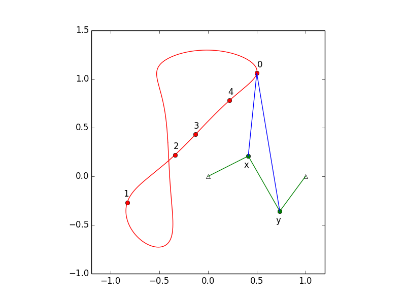
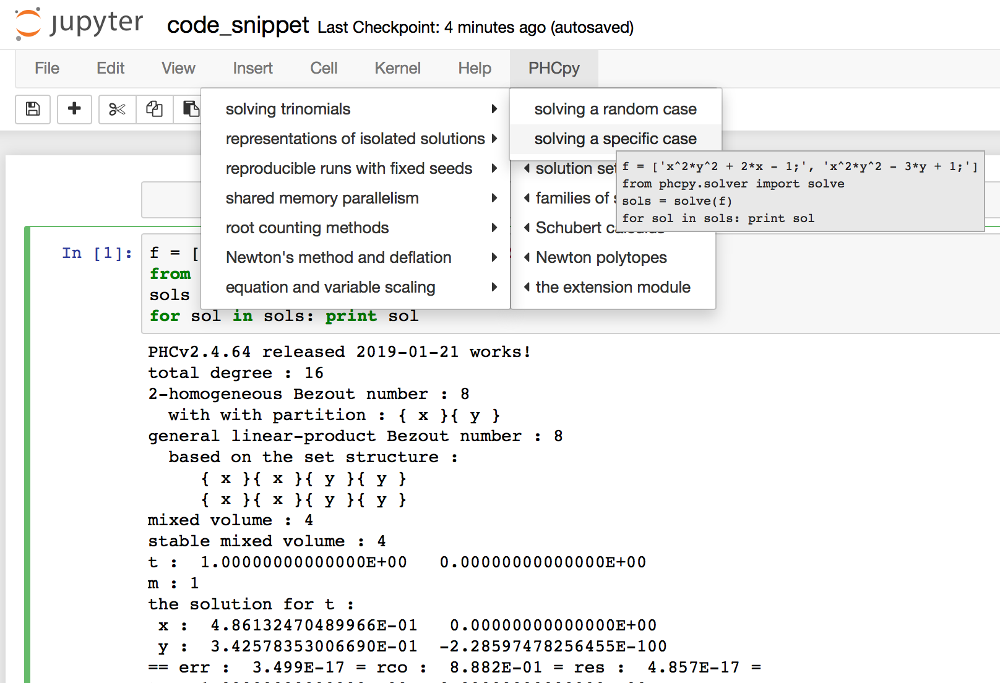

:author: Jasmine Otto
:email: jtotto@ucsc.edu
:institution: University of California, Santa Cruz

:author: Angus Forbes
:email: angus@ucsc.edu
:institution: University of California, Santa Cruz

:author: Jan Verschelde
:email: jan@math.uic.edu
:institution: University of Illinois at Chicago

.. |eacute| unicode:: U+00E9 .. eacute
   :trim:

-------------------------------------
Solving Polynomial Systems with phcpy
-------------------------------------

.. class:: abstract

   The solutions of a system of polynomials in several variables are often 
   needed, e.g.: in the design of mechanical systems, and 
   in phase-space analyses of nonlinear biological dynamics. 
   Reliable, accurate, and comprehensive numerical solutions are available 
   through PHCpack, a FOSS package for solving polynomial systems with 
   homotopy continuation.

   This paper explores the development of phcpy, a scripting interface for 
   PHCpack, over the past five years. One result is the availability of phcpy
   through a JupyterHub featuring Python2, Python3, and SageMath kernels.

Introduction
------------

The Python package phcpy [Ver14]_ provides an alternative to the
command line executable ``phc`` of PHCpack [Ver99]_ to solve polynomial systems
by homotopy continuation methods.  
Scripts replace command line options and text menus.
Data remains persistent in a session, decreasing the dependency on files.

The meaning of *solving* evolved from computing approximations to
all isolated solution into the numerical irreducible decomposition
of the solution set.  The numerical irreducible decomposition includes
not only the isolated solutions, but also representations for all
positive dimensional solution sets.  Such representations consist
of sets of *generic points*, partitioned along the irreducible factors.
Polynomial homotopy continuation is at the origin of many of the algorithms
in numerical algebraic geometry [SVW05]_.
Parallel versions of the software described in [SVW03]_
were recently developed [Ver18]_ and added to phcpy.

The focus of this paper is on the application of new technology
to solve polynomial systems, in particular, cloud computing [BSVY15]_
and multicore shared memory parallelism
accelerated with graphics processing units [VY15]_.
Our web interface offers phcpy in a SageMath [Sage]_, [SJ05]_ kernel
or in a Python kernel of a Jupyter notebook [Klu16]_.

Although phcpy is only a couple of years out,
three instances in the research literature mention its application
in the computation of the following:

* The number of embeddings of minimally rigid graphs [BELT18]_.

* Roots of Alexander polynomials [CD18]_.

* Critical points of equilibrium problems [SWM16]_ .

The cited publications above appear respectively in symbolic computation,
geometry and topology, chemical engineering.

Mechanism Design
----------------

Fig. :ref:`fig4barcoupler` illustration a reproduction
of a result in the mechanism design literature [MW90]_.
Given five points, the problem is to determine the length of two bars
so their coupler curve passes through the five given points.

   The design of a 4-bar mechanism.  :label:`fig4barcoupler`

This example is part of the tutorial of phcpy and the scripts 
to reproduce the results are in its source code distribution.
The equations are generated with sympy [SymPy]_
and the plots are made with matplotlib [Hun07]_.

Mission and Realization
-----------------------

The mission of phcpy is to bring Polynomial Homotopy Continuation
into Python's computational ecosystem.
The realization of phcpy happens by wrapping the compiled code
provided as shared object files by PHCpack.
This approach has two benefits.
First, the wrapping transfers the implementation of the many
available homotopy algorithms in a direct way into Python modules.
Second, we do not sacrifice the efficiency of the compiled code.
Scripts replace the input/output movements and interactions with
the user, but not the computationally intensive algorithms.

Code Snippets
-------------

Code snippets suggest typical applications and guide novice user.

The screen shot in Fig. :ref:`figsnippet` shows the code snippet
with an example of use of the blackbox solver.

   The code snippet for the blackbox solver.  :label:`figsnippet`

CGI Scripting
-------------

In our first design of a web interface to ``phc``,
we developed a collection of Python scripts,
following common programming patterns [Chu06]_.
Below is a listing of the key ingredients in our first web interface.

1. Posting and processing of HTML forms:

   * pure Python code prints the HTML code; and 

   * the input of the forms is processed with Python functions.

2. MySLQdb does the management of user data:

   * names and encrypted passwords,

   * generic, random folder names to store data files,

   * file names with polynomial systems solved.

3. With the module smtplib we define email exchanges:

   * automatic 2-step registration process,

   * automatic password recovery protocol.

Jupyter and JupyterHub
----------------------

The Jupyter notebook supports language agnostic computations,
supporting execution environments in several dozen languages.
With JupyterHub, we can run the code in a Python Terminal session,
in a Jupyter notebook running Python, or in a SageMath session.

For the user administration, we recycled our first web interface.

With JupyterHub, we provide user accounts on our server.

* At login time, a new process is spawned.

* Users have generic, random login names.

* Actions of users must be isolated from each other.

The setup requires some system administration expertise.

Acknowledgments
---------------

This material is based upon work supported by the National Science
Foundation under Grant No. 1440534.

References
----------

.. [BELT18] E. Bartzos, I. Z. Emiris, J. Legersky, and E. Tsigaridas.
            *On the maximal number of real embeddings of spatial minimally
            rigid graphs*.
            In the Proceedings of the 2018 International Symposium on Symbolic 
            and Algebraic Computation (ISSAC 2018), pages 55-62, ACM 2018. 
            DOI 10.1145/3208976.3208994.

.. [BSVY15] N. Bliss, J. Sommars, J. Verschelde, X. Yu.
            *Solving polynomial systems in the cloud with polynomial
            homotopy continuation.*
            In the Proceedings of the 17th International Workshop on Computer 
            Algebra in Scientific Computing (CASC 2015),
            edited by V. P. Gerdt, W. Koepf, W. M. Seiler,
            and E. V. Vorozhtsov, volume 9301 of Lecture Notes in 
            Computer Science, pages 87-100, Springer-Verlag, 2015. 
            DOI 10.1007/978-3-319-24021-3_7.

.. [Chu06] W. J. Chun. *Core Python Programming.*
           Prentice Hall, 2nd Edition, 2006.

.. [CD18] M. Culler and N. M. Dunfield.
          *Orderability and Dehn filling.*
          Geometry and Topology, 22: 1405-1457, 2018.
          DOI 10.2140/gt.2018.22.1405.

.. [Hun07] J. D. Hunter.
           *Matplotlib: A 2D Graphics Environment.*
           Computing in Science and Engineering 9(3): 90-95, 2007.
           DOI  10.1109/MCSE.2007.55.

.. [SymPy] D. Joyner, O. Certik, A. Meurer, and B. E. Granger.
           *Open source computer algebra systems: SymPy.*
           ACM Communications in Computer Algebra 45(4): 225-234 , 2011.

.. [Klu16] T. Kluyver, B. Ragan-Kelley, F. P |eacute| rez, B. Granger,
           M. Bussonnier, J. Frederic, K. Kelley, J. Hamrick, J. Grout,
           S. Corlay, P. Ivanov, D. Avila, S. Abdalla, C. Willing,
           and Jupyter Development Team.
           *Jupyter Notebooks -- a publishing format for reproducible
           computational workflows*.
           In Positioning and Power in Academic Publishing: Players, Agents, 
           and Agendas, edited by F. Loizides and B. Schmidt, 
           pages 87-90. IOS Press, 2016.
           DOI 10.3233/978-1-61499-649-1-87.

.. [MW90] A. P. Morgan and C. W. Wampler.
          *Solving a Planar Four-Bar Design Using Continuation.*
          Journal of Mechanical Design, 112(4): 544-550, 1990.
          DOI 10.1115/1.2912644.

.. [Sage] The Sage Developers.
          *SageMath, the Sage Mathematics Software System, Version 7.6*.
          https://www.sagemath.org, 2016.
          DOI 10.5281/zenodo.820864.

.. [SJ05] W. Stein and D. Joyner.
          *Sage: System for algebra and geometry experimentation.*
          ACM SIGSAM Bulletin 39(2): 61-64, 2005.
          DOI 10.1145/1101884.1101889.

.. [SWM16] H. Sidky, J. K. Whitmer, and D. Mehta.
           *Reliable mixture critical point computation using 
           polynomial homotopy continuation.*
           AIChE Journal. Thermodynamics and Molecular-Scale Phenomena,
           62(12): 4497-4507, 2016.  DOI 10.1002/aic.15319.

.. [SVW03] A. J. Sommese, J. Verschelde, and C. W. Wampler.
           *Numerical irreducible decomposition using PHCpack.*
           In Algebra, Geometry and Software Systems,
           edited by M. Joswig and N. Takayama, pages 109-130, 
           Springer-Verlag 2003.
           DOI 10.1007/978-3-662-05148-1_6.

.. [SVW05] A. J. Sommese, J. Verschelde, and C. W. Wampler.
           *Introduction to numerical algebraic geometry.*
           In Solving Polynomial Equations, 
           Foundations, Algorithms, and Applications,
           edited by A. Dickenstein and I. Z. Emiris, pages 301-337, 
           Springer-Verlag 2005.
           DOI 10.1007/3-540-27357-3_8.

.. [Ver99] J. Verschelde.
           *Algorithm 795: PHCpack: A general-purpose solver for polynomial
           systems by homotopy continuation*,
           ACM Trans. Math. Softw., 25(2):251-276, 1999.
           DOI 10.1145/317275.317286.

.. [Ver14] J. Verschelde.
           *Modernizing PHCpack through phcpy.*
           Proceedings of the 6th
           European Conference on Python in Science (EuroSciPy 2013),
           edited by P. de Buyl and N. Varoquaux, pages 71-76, 2014.

.. [Ver18] J. Verschelde.
           *A Blackbox Polynomial System Solver for Shared Memory Parallel
           Computers.*
           In Computer Algebra in Scientific Computing,
           20th International Workshop, CASC 2018, Lille, France, 
           edited by
           V. P. Gerdt, W. Koepf, W. M. Seiler, and E. V. Vorozhtsov,
           volume 11077 of Lecture Notes in Computer Science, pages 361-375.
           Springer-Verlag, 2018.
           DOI 10.1007/978-3-319-99639-4_25.

.. [VY15] J. Verschelde and X. Yu
          *Polynomial Homotopy Continuation on GPUs.*
          ACM Communications in Computer Algebra, volume 49, issue 4, 
          pages 130-133, 2015. 
          DOI 10.1145/2893803.2893810.
