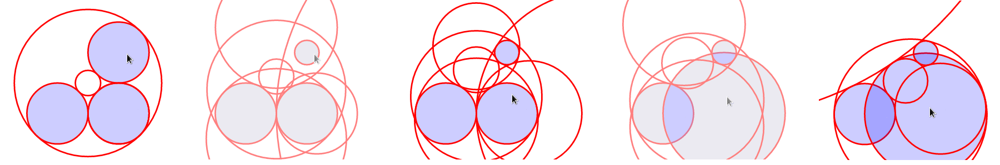

:author: Jasmine Otto
:email: jtotto@ucsc.edu
:institution: University of California, Santa Cruz

:author: Angus Forbes
:email: angus@ucsc.edu
:institution: University of California, Santa Cruz

:author: Jan Verschelde
:email: jan@math.uic.edu
:institution: University of Illinois at Chicago

.. |cacute| unicode:: U+0107 .. cacute
   :trim:

.. |eacute| unicode:: U+00E9 .. eacute
   :trim:

.. |iacute| unicode:: U+00ED .. iacute
   :trim:

.. |Ccaron| unicode:: U+010C .. Ccaron
   :trim:

.. |oumlaut| unicode:: U+00F6 .. oumlaut
   :trim:

-------------------------------------
Solving Polynomial Systems with phcpy
-------------------------------------

.. class:: abstract

   The solutions of a system of polynomials in several variables are often    needed, e.g.: in the design of mechanical systems, and    in phase-space analyses of nonlinear biological dynamics.    Reliable, accurate, and comprehensive numerical solutions are available    through PHCpack, a FOSS package for solving polynomial systems with    homotopy continuation.

   This paper explores the development of phcpy, a scripting interface for    PHCpack, over the past five years. One result is the availability of phcpy   through a JupyterHub featuring Python2, Python3, and SageMath kernels.

Introduction
============

The Python package phcpy [Ver14]_ provides an alternative to the
command line executable ``phc`` of PHCpack [Ver99]_ to solve polynomial 
systems by homotopy continuation methods. In the phcpy interface, Python scripts replace command line options and text menus, and data persists in a session without temporary files. This also makes PHCpack accessible from Jupyter notebooks, including a JupyterHub available online [Pascal]_.

The meaning of *solving* evolved from computing approximations to
all isolated solutions into the numerical irreducible decomposition
of the solution set.  The numerical irreducible decomposition includes
not only the isolated solutions, but also representations for all
positive dimensional solution sets. Such representations consist
of sets of *generic points*, partitioned along the irreducible factors.

The focus of this paper is on the application of new technology
to solve polynomial systems, in particular, cloud computing [BSVY15]_
and multicore shared memory parallelism
accelerated with graphics processing units [VY15]_.
Our web interface offers phcpy in a SageMath [Sage]_, [SJ05]_ kernel
or in a Python kernel of a Jupyter notebook [Klu16]_.

Although phcpy has been released for only five years,
three instances in the research literature of symbolic computation, geometry and topology, and chemical engineering (respectively) mention its application to their computations.

* The number of embeddings of minimally rigid graphs [BELT18]_.
* Roots of Alexander polynomials [CD18]_.
* Critical points of equilibrium problems [SWM16]_.

phcpy is in ongoing development. At the time of writing, this paper is based on version 0.9.5 of phcpy, whereas version 0.1.5 was current at the time of [Ver14]_. An example of these changes is that the software described in [SVW03]_ was recently parallelized for phcy [Ver18]_.

Mission
---------

The mission of phcpy is to bring polynomial homotopy continuation, which is at the origin of many of the algorithms in numerical algebraic geometry [SVW05]_, into Python's computational ecosystem.

phcpy wraps the shared object files of a compiled PHCpack, which makes the methods more accessible without sacrificing their efficiency.
First, the wrapping transfers the implementation of the many available homotopy algorithms in a direct way into Python modules.
Second, we do not sacrifice the efficiency of the compiled code. Scripts replace the input/output movements and interactions with the user, but not the computationally intensive algorithms.

Owing to the ubiquity of polynomial systems with interesting roots, many applications of numerical algebraic geometry to STEM problems exist in the literature. But these are often too compute-hungry for symbolic computation (e.g. via Groebner bases), so numerical solution is valuable.

Henry Schenk's review [HS15_] of the monograph describing Bertini 1 (another polynomial homotopy continuation solver [BHSW13]_) includes a primer on numerical algebraic geometry and its applications (in section 2). In particular, biochemical reaction networks and their characterization also appear in this paper's survey of STEM applications, beyond those phcpy-specific works above.

Related Software
----------------

PHCpack is one of three FOSS packages for polynomial homotopy computation currently under development. Of these, only Bertini 2 [Bertini2.0]_ also offers Python bindings, although it is not GPU-accelerated and does not export the numerical irreducible decomposition, among other differences.

HomotopyContinuation.jl [HCJL]_ is a standalone package for Julia, presented at ICMS 2018 [BT18]_.

NAG4M2 [NAG4M2]_ is a package for Macaulay2 (a standard computational algebra system [M2]_), which can also act an interface to PHCpack or Bertini. As described in [Ley11]_, it provided the starting point for PCHpack's Macaulay2 bindings [GPV13]_.

The proprietary software Hom4PS-3 [HOM4]_ features Python bindings, GPU acceleration, and polyhedral homotopy, as phcpy does. It also has a web interface implemented on the Sage Notebook.

User Interaction
================

CGI Scripting
-------------

In our first design of a web interface to ``phc``, we developed a collection of Python scripts (mediated through HTML forms), following common programming patterns [Chu06]_.

MySLQdb does the management of user data, including a) names and encrypted passwords, b) generic, random folder names to store data files, and c) file names with polynomial systems they have solved. With the module smtplib, we defined email exchanges for an automatic 2-step registration process and password recovery protocol.

As of the middle of May 2019, our web server has 146 user accounts, each having access to our new JupyterHub instance.

JupyterHub
----------

With JupyterHub, we provide online access [Pascal]_ to environments with Python and SageMath kernels pre-installed, both featuring phcpy and tutorials on its use (per next section). Since Jupyter is language-agnostic, execution environments in several dozen languages are possible. Our users can also run code in a Python Terminal session.

For the user administration, we refreshed our first web interface. A custom JupyterHub Authenticator connects to the existing MySQL database, and triggers a SystemdSpawner that isolates the actions of users to separate processes and logins in generic home folders.

The account management prompts by e-mail were hooked to new Tornado Handler instances, which perform account registration and activation on the database, as well as password recovery and reset. Each pathway serves HTML seamlessly with the JupyterHub interface, with their forms living in new extensions of its Jinja templates.

Code Snippets
-------------

Learning a new API is daunting enough without also being a crash course in algebraic geometry. Therefore, the user's manual of phcpy [PHCPY]_ begins with a tutorial section using only the blackbox solver ``phcpy.solver.solve(system, ...)``. In this API, ``system`` is a list of strings representing polynomials, terminated by semicolons, and containing as many variables as equations.

The code snippets from these tutorials are available in our JupyterHub deployment, via the snippets menu provided by nbextensions [JUP15]_. This menu suggests typical applications to guide the novice user. The screen shot in Fig. :ref:`figsnippet` shows the code snippet reproduced below.

.. figure:: ./bbsolvesnippet2.png
   :align: center
   :height: 400 px
   :figclass: h

   The code snippet for the blackbox solver.  :label:`figsnippet`

.. code-block:: python

  # PHCpy > blackbox solver > solving trinomials > solving a specific case
  from phcpy.solver import solve

  f = ['x^2*y^2 + 2*x - 1;', 'x^2*y^2 - 3*y + 1;']
  sols = solve(f)
  for sol in sols: print sol

The first solution of the given trinomial can be read off as (0.48613… + 0.0i, 0.34258… - 0.0i), where the imaginary part of x_0 is exactly zero, and that of y_0 negligibly small. Programmatically, these can be accessed using either ``solve(f, dictionary_output=True)``, or equivalently by parsing strings through ``[phcpy.solutions.strsol2dict(sol) for sol in solve(f)]``.

Direct Manipulation
-------------------

One consequence of the Jupyter notebook's rich output is the possibility of rich input, as explored through ipywidgets and interactive plotting libraries. The combination of rich input with fast numerical methods makes surprising interactions possible, such as interactive solution of Apollonius' Problem, which is to construct all circles tangent to three given circles in a plane.

The tutorial given in the phcpy documentation was adapted for a demo accompanying a SciPy poster in 2017, whose code [APP]_ will run on our JupyterHub (by copying over ``apollonius_d3.ipynb`` and ``apollonius_d3.js``).

This system of 3 nonlinear constraints in 5 parameters for each of 8 possible tangent circles (some of which have imaginary position or radius in certain configurations), which we solved interactively (Fig. :ref:`apollonius`). In fact, Jupyter is a suitable environment for mapping algebraic inputs to their geometric representations (in a 2D plane), through its interaction with D3.js [D3]_ for nonstandard (non-chart) data visualizations.

  Tangent circles calculated by phcpy in response to user reparameterization of the system. :label:`apollonius`

This approach makes use of the real-time solution of small polynomial systems, demonstrating the low latency of phcpy. It complements static input conditions by investigating their continous deformation, especially across singular solutions (which PHCpack handles more robustly than naive homotopy methods).

Solving Polynomial Systems
==========================

Our input is a list of polynomials in several variables.
This input list represents a polynomial system.
By default, the coefficients of the polynomials are considered
as complex floating point numbers.
The system is then solved over the field of complex numbers.

For general polynomial systems,
the complexity of the solution set can be expected to grow
exponentially in the dimensions 
(number of polynomials and variables) of the system.
The complexity of computing all solutions of a polynomial system is #P-hard.
The complexity class #P is the class of counting problems.
Formulating instances of polynomial systems that will occupy
fast computers for a long time is not hard.

Polynomial Homotopy Continuation
--------------------------------

As we compute over the field of complex numbers,
the continuity of the solution set in function of changing
coefficients of the polynomials in the system is exploited.
Continuation methods are numerical algorithms which track
solution paths defined by a one parameter family of polynomial systems.
This family is called the homotopy.  Homotopy methods take a polynomial
system on input and construct a suitable embedding of the input system
into a family which contains a start system with known solutions.

We say that a homotopy is *optimal* if for generic instances of
the coefficients of the input system no solution paths diverge.
Even as the complexity of the solution set is very hard,
the problem of computing the next solution, or just one random solution,
has a much lower complexity.  phcpy offers optimal homotopies for
three classes of polynomial systems:

1. dense polynomial systems

   A polynomial of degree *d* can be deformed into a product of *d*
   linear polynomials.  If we do this for all polynomials in the system,
   then the solutions of the deformed system are solutions of linear systems.
   Continuation methods track the paths originating at the solutions of
   the deformed system to the given problem.

2. sparse polynomial systems

   A system is sparse if relatively few monomials appear with nonzero
   coefficient.  The convex hulls of the exponent vectors of the monomials
   that appear are called Newton polytopes.  The mixed volume of the
   tuple of Newton polytopes associated to the system is a sharp upper
   bound for the number of isolated solutions.
   Polyhedral homotopies start a solutions of systems that are sparser
   and extend those solutions to the solutions of the given problem.

3. Schubert problems in enumerative geometry

   The classical example is to compute all lines in 3-space that
   meet four given lines nontrivially.
   Homotopies to solve geometric problems move the input data
   to special position, solve the special configuration, and then
   deform the solutions of the special problem into those of the
   original problem.

All classes of homotopies share the introduction of random constants.

For its fast mixed volume computation, 
the software incorporates MixedVol [GLW05]_ and DEMiCs [MT08]_. 
High-precision double double and quad double arithmetic is performed 
by the algorithms in QDlib [HLB01]_.

Speedup and Quality Up
----------------------

The solution paths defined by polynomial homotopies can be tracked
independently, providing obvious opportunities for parallel execution.
This section reports on computations on our server, a 44-core computer.

An obvious benefit of running on many cores is the speedup. 
The *quality up* question asks the following: if we can afford to spend 
the same time, by how much can we improve the solution using *p* processors?

We illustrate the quality up question on the cyclic 7-roots
benchmark problem [BF91]_.
The online SymPy documentation uses the cyclic 4-roots problem
to illustrate its ``nonlinsolve`` method.

The function defined below returns the elapsed performance 
of the blackbox solver on the cyclic 7-roots benchmark problem,
for a number of tasks and a precision equal to double, double double, 
or quad double arithmetic.

.. code-block:: python

    def qualityup(nbtasks=0, precflag='d'):
        """
        Runs the blackbox solver on a system.
        The default uses no tasks and no multiprecision.
        The elapsed performance is returned.
        """
        from phcpy.families import cyclic
        from phcpy.solver import solve
        from time import perf_counter
        c7 = cyclic(7)
        tstart = perf_counter()
        s = solve(c7, verbose=False, tasks=nbtasks, \
                  precision=precflag, checkin=False)
        return perf_counter() - tstart

The function above is applied in an interactive Python script,
prompting the user for the number of tasks and precision,
This scripts runs in a Terminal window and prints the elapsed performance
returned by the function.
If the quality of the solutions is defined as the working precision,
then the quality up question ask for the number of processors needed
to compensate for the overhead of the multiprecision arithmetic.

Although cyclic 7-roots is a small system for modern computers,
the cost of tracking all solution paths in double double and 
quad double arithmetic causes significant overhead.
The script above was executed on a 2.2 GHz Intel Xeon E5-2699 processor
in a CentOS Linux workstation with 256 GB RAM
and the elapsed performance is in Table :ref:`perfcyc7overhead`.

.. table:: Elapsed performance of the blackbox solver in double,
           double double, and quad double precision. :label:`perfcyc7overhead`

   +------------------+------+-------+--------+
   | precision        |  d   |   dd  |   qd   |
   +==================+======+=======+========+
   | elapsed perform. | 5.45 | 42.41 | 604.91 |
   +------------------+------+-------+--------+
   | overhead factor  | 1.00 |  7.41 | 110.99 |
   +------------------+------+-------+--------+

Table :ref:`perfcyc7parallel` demonstrates the reduction of the
overhead caused by the multiprecision arithmetic by multitasking.

.. table:: Elapsed performance of the blackbox solver 
           with 8, 16, and 32 path tracking tasks, in double double
           and quad double precision.  :label:`perfcyc7parallel`

   +-------+-------+-------+-------+
   | tasks |   8   |   16  |   32  |
   +=======+=======+=======+=======+
   |  dd   | 42.41 |  5.07 |  3.88 |
   +-------+-------+-------+-------+
   |  qd   | 96.08 | 65.82 | 44.35 |
   +-------+-------+-------+-------+

Notice that the 5.07 in Table :ref:`perfcyc7parallel`
is less than the 5.45 of Table :ref:`perfcyc7overhead`:
with 16 tasks we doubled the precision and finished the computations
in about the same time.
The 42.41 and 44.35 in Table :ref:`perfcyc7parallel` are similar enough
to state that with 32 instead of 8 tasks we doubled the precision from 
double double to quad double precision in about the same time.

Precision is a crude measure of quality.
Another motivation for quality up by parallelism is to compensate
for the cost overhead caused by arithmetic with power series.
Power series are hybrid symbolic-numeric representations
for algebraic curves.

Positive Dimensional Solution Sets
----------------------------------

As solving evolved from approximating all isolated solutions
of a polynomial system into computing a numerical irreducible decomposition,
the meaning of a solution expanded as well.
To illustrate this expansion, 
we consider again the family of cyclic *n*-roots problems, 
now for :math:`n = 8`, [BF94]_.
While for :math:`n = 7` all roots are isolated points,
there is a one dimensional solution curve of cyclic 8-roots of degree 144.
This curve decomposes in 16 irreducible factors,
eight factors of degree 16 and eight quadratic factors,
adding up to :math:`8 \times 16 + 8 \times 2 = 144`.

Consider the following code snippet.

.. code-block:: python

    from phcpy.phcpy2c3 import py2c_set_seed
    from phcpy.factor import solve
    from phcpy.families import cyclic
    py2c_set_seed(201905091)  # for a reproducible run
    c8 = cyclic(8)
    sols = solve(8, 1, c8, verbose=False)
    witpols, witsols, factors = sols[1]
    deg = len(witsols)
    print('degree of solution set at dimension 1 :', deg)
    print('number of factors : ', len(factors))
    _, isosols = sols[0]
    print('number of isolated solutions :', len(isosols))

The output of the script is

::

    degree of solution set at dimension 1 : 144
    number of factors :  16
    number of isolated solutions : 1152

Survey of Applications
======================

We consider some examples from various literatures which apply polynomial constraint solving. The first two examples use phcpy in particular as a research tool. The remaining three are broader examples representing current uses of numerical algebraic geometry in other STEM fields.

Rigid Graph Theory
------------------

The conformations of proteins [LML14]_, molecules [EM99]_, and robotic mechanisms (discussed further below) can be studied by counting and classifying unique mechanisms, i.e. real embeddings of graphs with fixed edge lengths, modulo rigid motions, per Bartzos et. al [BELT18]_ (which we gloss in this section).

Consider a graph :math:`G` whose edges each have a given length. A graph embedding is a function that maps the vertices of :math:`G` into :math:`D`-dimensional Euclidean space (especially :math:`D` = 2 or 3). Embeddings which are 'compatible' are those which preserve :math:`G`'s edge lengths. The number of unique mechanisms is thus a function of :math:`G` and :math:`d`, and an upper bound over :math:`d` (for which it isn't infinite) and :math:`G` with k vertices (yielding lower bounds for graphs with :math:`n \geq k` vertices) can be computed. In particular, the Cayley-Menger matrix of :math:`d` (the squared distance matrix with a row and column of 1s prepended, except that its main diagonal is 0s) is an algebraic system, including square subsystems (where the # variables equals the # equations).

Bartzos et. al implemented, using ``phcpy``, a constructive method yielding all 7-vertex minimally rigid graphs in 3D space (the smallest open case) and certain 8-vertex cases previously uncounted. A graph :math:`G` is generically rigid if, for any given edge lengths :math:`d`, none of its compatible embeddings (into a generic configuration s.t. vertices are algebraically independent) are continuously deformable. :math:`G` is minimally rigid if removing any one of its edges yields a non-rigid mechanism.

``phcpy`` was used specifically to find edge lengths with maximally many real embeddings, exploiting the flexibility of being able to specify their starting system. This sped up their algorithm by perturbing from the solutions of previous systems to find new one.

In fact, many iterations of sampling have to be performed if the wrong number of real embeddings is found; in each case, a different subgraph is selected based on a heuristic implemented by ``DBSCAN`` in ``scikit-learn`` (illustrating the value of a scientific Python ecosystem). The actual number of real embeddings is known from an enumeration of unique graphs constructed by Henneberg steps in e.g. SageMath.

Model Selection & Parameter Inference
--------------------------------------

It is often useful to know all the steady states of a biological network, as represented by a nonlinear system of ordinary differential equations, with some conserved quantities. These two lists of polynomials (from rates of change of form :math:`\dot{x} = p(x)`, by letting :math:`\dot{x}=0`; and from conservation laws of form :math:`c = \sum{x_i}` by subtracting :math:`c` from both sides) have a zero set which is a steady-state variety, that can be explored numerically via polynomial homotopy continuation.

Parameter hopotopies were used by Gross et. al [GHR16]_ to perform model selection on a mammalian phosphorylation pathway (to distinguish whether the kinase acts processively, i.e. adding more than one phosphate at once, which it does not in vitro). Their analysis validated experimental work showing processivity in vivo, and they obtained >50x speedup over non-parameter homotopies (for running times in minutes, not hours) on systems tracking 20 paths.

Critical Point Computation
--------------------------

Polynomial homotopy continuation has also been adapted to the field of chemical engineering to locate critical points of multicomponent mixtures [SWM16]_, i.e. temperature and pressure satisfying a multi-phase equilibrium.

Algebraic Kinematics
--------------------

Determining the reachable poses of a mechanism (in terms of fixed-length bones and various kinds of joint) is but one problem in applied algebraic geometry. Above, we have discussed an application of numerics to a counting problem. Following Wampler and Sommese [WS11]_, other geometric problems arising from robots include **analysis** of specific mechanisms e.g.:

* Motion decomposition - into assembly modes (of individual mechanisms) or subfamilies of mechanisms (with varying mobility)
* Mobility analysis - degrees of freedom of a mechanism (sometimes exceptional), sometimes specific to certain configurations (e.g. gimbal lock)
* Kinematics - effector position given parameters (forward kinematics), and vice versa (inverse kinematics, e.g. used in computer animation)
* Singularity analysis - detection of situations where the mechanism can move without change to its parameters (input singularity), or the parameters can change without movement of the mechanism (output singularity)
* Workspace analysis - determining all possible outputs of the mechanism, i.e. reachable poses.

...as well as the **synthesis** of mechanisms that can reach certain sets of outputs, or that can be controlled by a certain input/output relationship.

Fig. :ref:`fig4barcoupler` illustrates a reproduction
of one synthesis result in the mechanism design literature [MW90]_.
Given five points, the problem is to determine the length of two bars
so their coupler curve passes through the five given points.

.. figure:: ./fbarcoupler.png
   :align: center
   :figclass: h
   :height: 300 px

   The design of a 4-bar mechanism.  :label:`fig4barcoupler`

This example is part of the tutorial of phcpy and the scripts 
to reproduce the results are in its source code distribution.
The equations are generated with sympy [SymPy]_
and the plots are made with matplotlib [Hun07]_.

Continuation homotopies were developed as a substitute for algebraic elimination that was more robust to special cases, yet still tractable to numerical techniques. Research in kinematics increasingly relies on such algorithms.

Besides the special historical relationship of kinematics and numerical algebraic geometry, other systems of constraint with interesting scientific applications also take on polynomial form. Collision-free motion planning, nonlinear control synthesis, and load flow problems in 

Systems Biology
---------------

Whether a model biological system is multistationary or oscillatory, and whether this depends on its rate constants, are all properties of its steady-state locus.

Following the survey of Gross et. al [GBH16]_ regarding uses of numerical algebraic geometry in this domain, one might investigate:

* determine which values of the rate and conserved-quantity parameters allow the model to have multiple steady states.
* evaluate models with partial data (subsets of the :math:`x_i`) and reject those which don't agree with the data at steady state.
* describe all the states accessible from a given state of the model, i.e. that state's stoichiometric compatibility class (or basin of attraction).
* determine whether rate parameters of the given model are identifiable from concentration measurements, or at least constrained.

For large real-world models in systems biology, these questions of algebraic geometry are only tractable to numerical methods scaling to many dozens of simultaneous equations.

Not necessarily related to the zero locus, but also formulated [AD18]_ in terms of algebraic geometry:

* Discrete dynamical systems, to determine whether a healthy state is reachable from a diseased one via small interventions
* Neural codes, to characterize the combinatorial structure of e.g. place cells based on firing patterns
* Phylogenetic varieties, to perform non-parametric inference of descent based on molecular evolution

Conclusion
==========

From these examples, we see that polynomial homotopy continuation has wide applicability to STEM fields. Moreover, phcpy is an accessible interface to the technique.

Acknowledgments
---------------

This material is based upon work supported by the National Science Foundation under Grant No. 1440534.

References
----------

.. [BHSW13] D. J. Bates, J. D. Hauenstein, A. J. Sommese, and C. W. Wampler.
            *Numerically solving polynomial systems with Bertini*, 
            volume 25 of Software, Environments, and Tools, SIAM, 2013.

.. [BELT18] E. Bartzos, I. Z. Emiris, J. Legersky, and E. Tsigaridas.
            *On the maximal number of real embeddings of spatial minimally
            rigid graphs*.
            In the Proceedings of the 2018 International Symposium on Symbolic 
            and Algebraic Computation (ISSAC 2018), pages 55-62, ACM 2018. 
            DOI 10.1145/3208976.3208994.

.. [Bertini2.0] Bertini 2.0: The redevelopment of Bertini in C++.
                https://github.com/bertiniteam/b2

.. [BF91] J. Backelin and R. Fr |oumlaut| berg.
          *How we proved that there are exactly 924 cyclic 7-roots.*
          In the Proceedings of the 1991 International Symposium on
          Symbolic and Algebraic Computation (ISSAC'91), pages 103-111,
          ACM, 1991.  DOI 10.1145/120694.120708.

.. [BF94] G. Bj |oumlaut| rck and R. Fr |oumlaut| berg.
          *Methods to ``divide out'' certain solutions from systems of 
          algebraic equations, applied to find all cyclic 8-roots.*
          In Analysis, Algebra and Computers in Mathematical Research,
          Proceedings of the twenty-first Nordic congress of
          mathematicians, edited by M. Gyllenberg and L. E. Persson, 
          volume 564 of Lecture Notes in Pure and Applied Mathematics,
          pages 57-70.  Dekker, 1994.

.. [BSVY15] N. Bliss, J. Sommars, J. Verschelde, X. Yu.
            *Solving polynomial systems in the cloud with polynomial
            homotopy continuation.*
            In the Proceedings of the 17th International Workshop on Computer 
            Algebra in Scientific Computing (CASC 2015),
            edited by V. P. Gerdt, W. Koepf, W. M. Seiler,
            and E. V. Vorozhtsov, volume 9301 of Lecture Notes in 
            Computer Science, pages 87-100, Springer-Verlag, 2015. 
            DOI 10.1007/978-3-319-24021-3_7.

.. [BT18] P. Breiding and S. Timme.
          *HomotopyContinuation.jl: A package for homotopy continuation in
          Julia.*
          In the proceedings of ICMS 2018, the 6th International Conference
          on Mathematical Software, South Bend, IN, USA, July 24-27, 2018,
          edited by J. H. Davenport, M. Kauers, G. Labahn, and J. Urban,
          volume 10931 of Lecture Notes in Computer Science, pages 458-465.
          Springer-Verlag, 2018.  DOI 10.1007/978-3-319-96418-8.

.. [Chu06] W. J. Chun. *Core Python Programming.*
           Prentice Hall, 2nd Edition, 2006.

.. [CD18] M. Culler and N. M. Dunfield.
          *Orderability and Dehn filling.*
          Geometry and Topology, 22: 1405-1457, 2018.
          DOI 10.2140/gt.2018.22.1405.

.. [HLB01] Y. Hida, X. S. Li, and D. H. Bailey.
           *Algorithms for quad-double precision floating point arithmetic.*
           In the Proceedings  of the 15th IEEE Symposium on Computer 
           Arithmetic (Arith-15 2001), pages 155--162. IEEE Computer Society,
           2001.  DOI 10.1109/ARITH.2001.930115.

.. [HCJL] A Julia package for solving systems of 
          polynomials via homotopy continuation.
          https://github.com/JuliaHomotopyContinuation

.. [Hun07] J. D. Hunter.
           *Matplotlib: A 2D Graphics Environment.*
           Computing in Science and Engineering 9(3): 90-95, 2007.
           DOI 10.1109/MCSE.2007.55.

.. [GLW05] T. Gao, T.Y. Li, and M. Wu.
           *Algorithm 846: MixedVol: a software package for mixed-volume computation.*
           ACM Trans. Math. Softw., 31(4):555-560, 2005.
           DOI 10.1145/1114268.1114274.

.. [GPV13] E. Gross, S. Petrovi |cacute|, and J. Verschelde.
           *Interfacing with PHCpack.*
           The Journal of Software for Algebra and Geometry: Macaulay2,
           5:20-25, 2013.  DOI 10.2140/jsag.2013.5.20.

.. [SymPy] D. Joyner, O. :math:`~\!` |Ccaron| ert |iacute| k, 
           A. Meurer, and B. E. Granger.
           *Open source computer algebra systems: SymPy.*
           ACM Communications in Computer Algebra 45(4): 225-234 , 2011.
           DOI 10.1145/2110170.2110185.

.. [Klu16] T. Kluyver, B. Ragan-Kelley, F. P |eacute| rez, B. Granger,
           M. Bussonnier, J. Frederic, K. Kelley, J. Hamrick, J. Grout,
           S. Corlay, P. Ivanov, D. Avila, S. Abdalla, C. Willing,
           and Jupyter Development Team.
           *Jupyter Notebooks -- a publishing format for reproducible
           computational workflows*.
           In Positioning and Power in Academic Publishing: Players, Agents, 
           and Agendas, edited by F. Loizides and B. Schmidt, 
           pages 87-90. IOS Press, 2016.
           DOI 10.3233/978-1-61499-649-1-87.

.. [Ley11] A. Leykin.  *Numerical algebraic geometry.*
           The Journal of Software for Algebra and Geometry: Macaulay2,
           3:5-10, 2011.  DOI 10.2140/jsag.2011.3.5.

.. [M2] D. R. Grayson and M. E. Stillman.
        Macaulay2, a software system for research in algebraic geometry.
        http://www.math.uiuc.edu/Macaulay2

.. [MT08] T. Mizutani and A. Takeda.
          *DEMiCs: A software package for computing the mixed volume via
          dynamic enumeration of all mixed cells.*
          In Software for Algebraic Geometry, edited by M. E. Stillman,
          N. Takayama, and J. Verschelde,
          volume 148 of The IMA Volumes in Mathematics and its Applications,
          pages 59-79. Springer-Verlag, 2008.
          DOI 10.1007/978-0-387-78133-4.

.. [MW90] A. P. Morgan and C. W. Wampler.
          *Solving a Planar Four-Bar Design Using Continuation.*
          Journal of Mechanical Design, 112(4): 544-550, 1990.
          DOI 10.1115/1.2912644.

.. [NAG4M2] Branch NAG of M2 repository.
            https://github.com/antonleykin/M2/tree/NAG

.. [Sage] The Sage Developers.
          *SageMath, the Sage Mathematics Software System, Version 7.6*.
          https://www.sagemath.org, 2016.
          DOI 10.5281/zenodo.820864.

.. [SJ05] W. Stein and D. Joyner.
          *Sage: System for algebra and geometry experimentation.*
          ACM SIGSAM Bulletin 39(2): 61-64, 2005.
          DOI 10.1145/1101884.1101889.

.. [SWM16] H. Sidky, J. K. Whitmer, and D. Mehta.
           *Reliable mixture critical point computation using 
           polynomial homotopy continuation.*
           AIChE Journal. Thermodynamics and Molecular-Scale Phenomena,
           62(12): 4497-4507, 2016.  DOI 10.1002/aic.15319.

.. [SVW03] A. J. Sommese, J. Verschelde, and C. W. Wampler.
           *Numerical irreducible decomposition using PHCpack.*
           In Algebra, Geometry and Software Systems,
           edited by M. Joswig and N. Takayama, pages 109-130, 
           Springer-Verlag 2003.
           DOI 10.1007/978-3-662-05148-1_6.

.. [SVW05] A. J. Sommese, J. Verschelde, and C. W. Wampler.
           *Introduction to numerical algebraic geometry.*
           In Solving Polynomial Equations, 
           Foundations, Algorithms, and Applications,
           edited by A. Dickenstein and I. Z. Emiris, pages 301-337, 
           Springer-Verlag 2005.
           DOI 10.1007/3-540-27357-3_8.

.. [Ver99] J. Verschelde.
           *Algorithm 795: PHCpack: A general-purpose solver for polynomial
           systems by homotopy continuation*,
           ACM Trans. Math. Softw., 25(2):251-276, 1999.
           DOI 10.1145/317275.317286.

.. [Ver14] J. Verschelde.
           *Modernizing PHCpack through phcpy.*
           Proceedings of the 6th
           European Conference on Python in Science (EuroSciPy 2013),
           edited by P. de Buyl and N. Varoquaux, pages 71-76, 2014.

.. [Ver18] J. Verschelde.
           *A Blackbox Polynomial System Solver for Shared Memory Parallel
           Computers.*
           In Computer Algebra in Scientific Computing,
           20th International Workshop, CASC 2018, Lille, France, 
           edited by
           V. P. Gerdt, W. Koepf, W. M. Seiler, and E. V. Vorozhtsov,
           volume 11077 of Lecture Notes in Computer Science, pages 361-375.
           Springer-Verlag, 2018.
           DOI 10.1007/978-3-319-99639-4_25.

.. [VY15] J. Verschelde and X. Yu
          *Polynomial Homotopy Continuation on GPUs.*
          ACM Communications in Computer Algebra, volume 49, issue 4, 
          pages 130-133, 2015. 
          DOI 10.1145/2893803.2893810.

.. [BNN16] D. J. Bates, A. J. Newell, & M. Niemerg
  *BertiniLab: A MATLAB interface for solving systems of polynomial equations.*
  Numerical Algorithms, 71, pages 229–244, 2016.
  DOI 10.1007/s11075-015-0014-6.

.. [BNN17] D. J. Bates, A. J. Newell, & M. E. Niemerg
  *Decoupling highly structured polynomial systems.*
  Journal of Symbolic Computation, 79, pages 508–515, 2017.
  DOI 10.1016/j.jsc.2016.07.016.

.. [BM16] E. Bogart & C. R. Myers
  *Multiscale Metabolic Modeling of C4 Plants: Connecting Nonlinear Genome-Scale Models to Leaf-Scale Metabolism in Developing Maize Leaves.*
  PLOS ONE, 11, e0151722, 2016.
  DOI 10.1371/journal.pone.0151722.

.. [D3] M. Bostock, V. Ogievetsky, & J. Heer
  *D3 Data-Driven Documents.*
  IEEE Transactions on Visualization and Computer Graphics, 17, pages 2301–2309, 2011.
  DOI 10.1109/TVCG.2011.185.

.. [DSG18] S. Dura-Bernal, B. A. Suter, P. Gleeson, M. Cantarelli, A. Quintana, F. Rodriguez, D. J. Kedziora, G. L. Chadderdon, C. C. Kerr, S. A. Neymotin, R. McDougal, M. Hines, G. M. G. Shepherd, & W. W. Lytton
  *NetPyNE: a tool for data-driven multiscale modeling of brain circuits.*
  bioRxiv, 461137, 2018.
  DOI 10.1101/461137.

.. [FSC13] T. Fischbacher & F. Synatschke-Czerwonka
  *FlowPy—A numerical solver for functional renormalization group equations.*
  Computer Physics Communications, 184, pages 1931–1945, 2013.
  DOI 10.1016/j.cpc.2013.03.002.

.. [GWW09] J. E. Guyer, D. Wheeler, & J. A. Warren
  *FiPy: Partial Differential Equations with Python.*
  Computing in Science Engineering, 11, pages 6–15, 2009.
  DOI 10.1109/MCSE.2009.52.

.. [KMC18] C. Knoll, D. Mehta, T. Chen, & F. Pernkopf
  *Fixed Points of Belief Propagation—An Analysis via Polynomial Homotopy Continuation.*
  IEEE Transactions on Pattern Analysis and Machine Intelligence, 40, pages 2124–2136, 2018.
  DOI 10.1109/TPAMI.2017.2749575.

.. [LBC10] J. Liepe, C. Barnes, E. Cule, K. Erguler, P. Kirk, T. Toni, & M. P. H. Stumpf
  *ABC-SysBio—approximate Bayesian computation in Python with GPU support.*
  Bioinformatics, 26, pages 1797–1799, 2010.
  DOI 10.1093/bioinformatics/btq278.

.. [SBS18] D. G. A. Smith, L. A. Burns, D. A. Sirianni, D. R. Nascimento, A. Kumar, A. M. James, J. B. Schriber, T. Zhang, B. Zhang, A. S. Abbott, E. J. Berquist, M. H. Lechner, L. A. Cunha, A. G. Heide, J. M. Waldrop, T. Y. Takeshita, A. Alenaizan, D. Neuhauser, R. A. King, A. C. Simmonett, J. M. Turney, H. F. Schaefer, F. A. Evangelista, A. E. DePrince, T. D. Crawford, K. Patkowski, & C. D. Sherrill
  *Psi4NumPy: An Interactive Quantum Chemistry Programming Environment for Reference Implementations and Rapid Development.*
  Journal of Chemical Theory and Computation, 14, pages 3504–3511, 2018.
  DOI 10.1021/acs.jctc.8b00286.

.. [Pascal] *JupyterHub deployment of phcpy.*
    Website, accessed May 2019. 2017.
    https://phcpack.org

.. [JUP15] *Jupyter notebook snippets menu - jupyter-contrib-nbextensions 0.5.0*
     https://jupyter-contrib-nbextensions.readthedocs.io/en/latest/nbextensions/snippets_menu/readme.html.

.. [HS15] H. Schenck
    *Book Review: Numerically Solving Polynomial Systems with Bertini.*
    Bulletin of the American Mathematical Society, 53.1, 179–86, 2015.
    DOI: 10.1090/bull/1520

.. [AD18] A. Dickenstein
    *Algebraic geometry in the interface of pure and applied mathematics.*
    Rio Intelligencer, ICM, 2018.
    http://mate.dm.uba.ar/~alidick/DickensteinIntelligencerWithoutFigures.

.. [DB15] D. Brake
    *Advances in Software in Numerical Algebraic Geometry.*
    Slides presented at Advances @ SIAM AG15, U Notre Dame, 2015.
    https://danielleamethyst.org/resources/presentations/talks/siam_AG2015_numerical_AG_overview.pdf.

.. [GBH16] E. Gross, D. Brent, K. L. Ho, D. J. Bates, & H. A. Harrington
    *Numerical algebraic geometry for model selection and its application to the life sciences.*
    Journal of The Royal Society Interface, 13: 20160256. 2016.
    DOI: 10.1098/rsif.2016.0256.

.. [GHR16] E. Gross, H. A. Harrington, Z. Rosen, & B. Sturmfels
    *Algebraic Systems Biology: A Case Study for the Wnt Pathway. Bulletin of Mathematical Biology.*
    Bulletin of Mathematical Biology 78, pages 21–51, 2016.
    DOI: 10.1007/s11538-015-0125-1.

.. [HHS13] W. Hao, J. D. Hauenstein, C.-W. Shu, A. J. Sommese, Z. Xu, & Y.-T. Zhang
    *A homotopy method based on WENO schemes for solving steady state problems of hyperbolic conservation laws.*
    Journal of Computational Physics, 250, pages 332–346. 2013.
    DOI: 10.1016/j.jcp.2013.05.008.

.. [HHM13] J. Hauenstein, Y.-H. He, & D. Mehta
    *Numerical elimination and moduli space of vacua.*
    Journal of High Energy Physics, 83. 2013.
    DOI: 10.1007/JHEP09(2013)083.

.. [PSC13] V. Pereyra, M. Saunders, & J. Castillo
    *Equispaced Pareto front construction for constrained bi-objective optimization.*
    Mathematical and Computer Modelling, 57, pages 2122–2131. 2013.
    DOI: 10.1016/j.mcm.2010.12.044.

.. [WS11] C. W. Wampler & A. J. Sommese
    *Numerical algebraic geometry and algebraic kinematics.*
    Acta Numerica, 20, pages 469–567. 2011.
    DOI: 10.1017/S0962492911000067.

.. [HOM4] T. Chen, T.L. Lee, T.Y. Li.
    *Hom4PS-3: A Parallel Numerical Solver for Systems of Polynomial Equations Based on Polyhedral Homotopy Continuation Methods.*
    Mathematical Software - ICMS 2014, Lecture Notes in Computer Science, vol 8592, pages 183-190. 2014.
    DOI: 10.1007/978-3-662-44199-2_30

.. [PHCPY] *phcpy 0.9.5 documentation*
    http://homepages.math.uic.edu/~jan/phcpy_doc_html/

.. [APP] *explorable circle tangency*
    https://github.com/JazzTap/mcs563/tree/master/Apollonius]

.. [LML14] L. Liberti, B. Masson, J. Lee, C. Lavor, and A. Mucherino.
  *On the number of realizations of certain henneberg graphs arising in protein conformation.*  
  Discrete Applied Mathematics, 165, page 213–232, 2014.
  DOI: 10.1016/j.dam.2013.01.020

.. [EM99] I.Z. Emiris and B. Mourrain.
  *Computer algebra methods for studying and computing molecular conformations.*
  Algorithmica 25, pages 372–402, 1999.
  DOI: 10.1007/PL00008283
