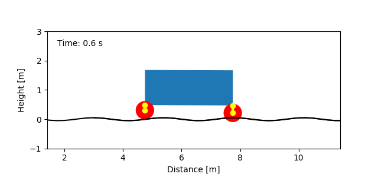
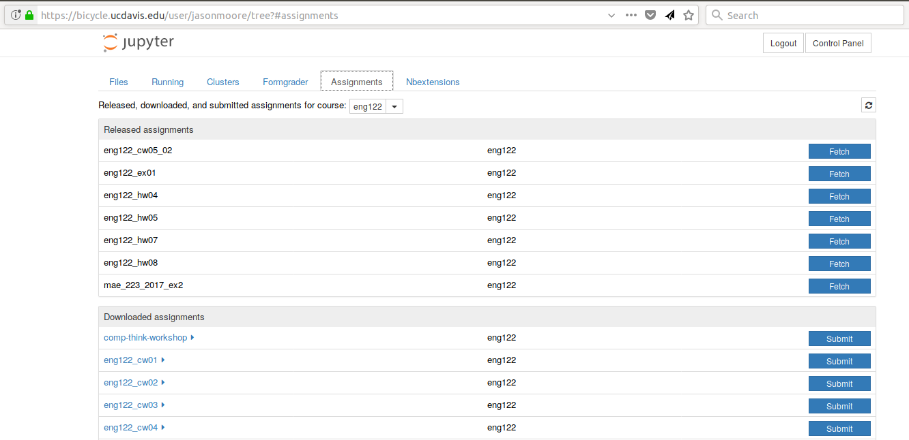
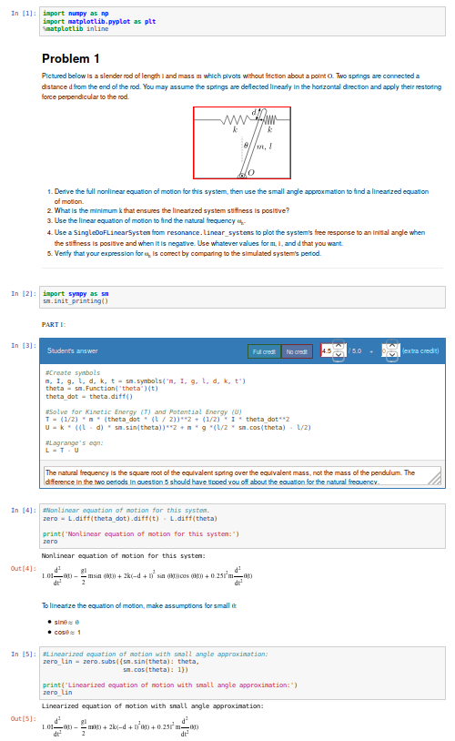

:author: Jason K. Moore
:email: jkm@ucdavis.edu
:institution: University of California, Davis

:author: Kenneth Lyons
:email: krlyons@ucdavis.edu
:institution: University of California, Davis

:bibliography: mybib

-----------------------------------------------------------
Using Computational Thinking to Teach Mechanical Vibrations
-----------------------------------------------------------

.. class:: abstract

   We describe a pilot project at the University of California, Davis on the
   redesign of an upper level mechanical vibrations engineering course where
   students now learn the relevant concepts via computational thinking and
   computational experimentation. We utilize interactive computing with the
   Jupyter platform and a custom Python library instead of focusing on the
   analytical mathematical methods used over the past century. This paper
   covers the course design, principles of teaching and learning with
   computational thinking (focusing on API design and the use of symbolics),
   software/hardware infrastructure, assessment practices, and lessons learned.

.. class:: keywords

   education, engineering, python, jupyter, computational thinking

Course Description
==================

`Introduction to Mechanical Vibrations`_ is a 30+ year old upper level elective
in the mechanical engineering curriculum at the University of California,
Davis. It is a classic mechanical engineering course that stems from the
courses and books of Timoshenko and Den Hartog from the early 20th century. The
course advances students' understanding of `vibrating mechanical systems`_,
that has a foundation is the theory of small periodic motions resulting from
the mathematical analysis of linear differential equations derived from
Newton's Second Law of Motion. These foundational concepts provide insight into
the design of machines to both minimize undesired vibrations and exploit
desired vibrations.

   Frame of an animation of a car vibration model created with resonance; an
   example of the type of systems students analyze and design in the course.

Most mechanical vibration courses have been presented primarily from a
theoretical perspective which was tied to the early analytic tools. There have
also been some courses with accompanying laboratories to experiment with real
vibrating systems, but those are fewer and far between. Also, since the late
80s, mechanical vibrations courses have often been enhanced with computational
tools, such as Matlab, to solve problems that are difficult or unwieldy to
solve by hand.

These courses typically have the standard engineering course format, i.e. the
professor lectures in class by deriving mathematical theory on the board and
does example problems to accompany the theory, the students are assigned
homework problems each week for practice at applying and understanding the
theory, and exams are given that are similar to homework problems to assess
student learning.

This format has served the engineering profession well for a century or more,
but there are a number of reasons to believe that this course could be changed
to both improve learning and provide students with skills that are more
relevant to their future work.

.. _Introduction to Mechanical Vibrations: https://github.io/moorepants/eng122
.. _vibrating mechanical systems: https://en.wikipedia.org/wiki/Vibration

Why Change?
===========

The main reasons that we wanted to change the course are that:

- This type of course has likely only changed in one significant way in the
  past century with addition of accessible computational tools in the 80s.
  Although it is true that the foundational theory has not changed much in that
  time, much of the traditional material may not be directly relevant to
  solving modern vibration related problems and thus could be removed.
- Traditional engineering textbooks are becoming antiquated due to their high
  cost to the students, their scope not being well-suited to the courses they
  are designed for, the fact that they are closed access, and that they do not
  utilize the power of the world wide web to optimally enhance the materials.
  Additionally, there is a long list of mechanical vibrations textbooks and
  editions from the past 100 years that more-or-less provide the same
  materials.
- There is evidence that methods other than the traditional lecture style of
  typical engineering classes are more effective for student learning. Many of
  these "learn by doing" methods align extremely well with engineering.
- We would like to increase the likelihood that students utilize
  "computational thinking" and the related tools to solve engineering
  problems when they leave our bachelor's program.

Computational Thinking
======================

The last point above requires some elaboration, as it is a central tenant to
the course redesign. Engineering courses often have computational components,
but students may or may not learn to "think computationally."

An engineer's primary goal is to solve problems, using the knowledge and tools
at hand. Solving each problem requires some understanding of how the world
works. Engineers perform experiments and develop mathematical models of the
phenomena they observe in order to make predictions about similar phenomena.
Thus, it is well known that if one could reason about the world using
mathematical language, one could gain great power to change it. With the advent
of computers, computation has typically been used to enhance the mathematics so
that mathematical problems could be solved more efficiently. Mostly, math is
*translated* into computer code. The steps are something along the lines of:

1. Observe phenomena
2. Optionally, perform a controlled physical experiment to learn specifically
   about the phenomena
3. Develop a mathematical, causal relationship that predicts the phenomena
4. Implement the mathematical model computationally
5. Use the computational model to make predictions and solve problems

This is a powerful and invaluable process, but it is also interesting that,
taken to an extreme, one may be able to remove step 3 and reason about the
world in the language of computation directly.

An example
----------

Calculating probabilities offers simple examples that can highlight what we
mean. For example, if you want to answer:

   What is the probability of rolling at least two 3's if you roll a 6-sided
   die 10 times?

A mathematician or statistician is likely to formulate the following equation
using probability theory:

.. math::

   P(A) = \sum_{i=2}^{10} \binom{10}{i} \left(\frac{1}{6}\right)^i \left(\frac{5}{6}\right)^{10-i}

and when you complete the numerical calculation you will find the probability
is about 52 in a 100. To be able to do this you need to be well versed in a
number of mathematical concepts that are often abstract relative to the primary
question such as `probability distributions`_, `conditional probability`_, the
`binomial theorem`_, factorials_, etc.

.. _probability distributions: TODO
.. _conditional probability: https://en.wikipedia.org/wiki/Conditional_probability
.. _binomial theorem: https://en.wikipedia.org/wiki/Binomial_theorem
.. _factorials: https://en.wikipedia.org/wiki/Factorial

From an experimentalist's perspective, you can also literally roll 10 dice many
many times and tally how many of the sets of rolls met the criteria. Thinking
about this experiment is much easier than reasoning about probabilities, and
many of the abstractions are removed. However, you'd have to roll the ten dice
upwards of 10000 times to get an accurate estimate of the probability.
Fortunately, this is something a computer is good at. Being able to reason
about this problem and, for example, write the following Python code, you will
get the same answer as reasoning through probability theory. In this case,
computational reasoning is likely vastly simpler than what is needed for the
mathematical reasoning if you have basic programming concepts in your toolbox.

.. code-block:: python

   from random import choice
   num_trials = 10000
   dice_sides = [1, 2, 3, 4, 5, 6]
   count = 0
   for trial in range(num_trials):
       ten_rolls = [choice(dice_sides) for roll in range(10)]
       if ten_rolls.count(3) > 1:
            count += 1
   print(count / num_trials)

The required knowledge here spans variables, data structures, loops, and flow
control but it has the advantage that it maps directly to the experimental
process with very little abstraction. Additionally, this knowledge is used in
every computational problem, not just ones about probability.

This ability to reason about the world through computational language is a
prime of example "computational thinking." Computational thinking adds a
complementary mode of reasoning to experimentation and mathematical modeling.
In some cases, it may even be used as a replacement for one, the other, or
both.

So this raises the question: "If we drastically increase the focus on
computational thinking to learn about mechanical vibrations, will students be
better equipped to solve real vibration problems when they leave the class?" We
believe they will, but there are a number of aspects that needed to be changed
in the course to do test this.

.. _computational thinking: https://en.wikipedia.org/wiki/Computational_thinking

What We Did
===========

The course redesign required quite a number of changes in order to structure
the learning around computational thinking and meet the other goals. The
following presents summaries of the various changes and activities we did to
bring this to fruition:

Interactive Open Access Digital Textbook
----------------------------------------

We wrote a `series of 14 modules`_ in the form of Jupyter_ notebooks that serve
as the core learning resources for the course. We consider these notebooks,
taken together, as a textbook that replaces the need for a traditional static,
paper text. The design of this text has these features:

- Approximately 1 notebook for each of the 20 two hour lecture periods, i.e.
  just the right length for the 10 week course.
- The notebooks mix written text, mathematical equations, static figures,
  videos, and live Python code that can be executed to create interactive
  figures.
- Each notebook introduces a new real (and hopefully interesting) vibrating
  mechanical system as a motivation for learning the subsequent concepts.
- Computational thinking approaches are utilized if possible.
- The notebooks are licensed under the Creative Commons Attribution license to
  maximize reuse potential.
- The notebooks are intended to be used live in class with embedded interactive
  exercises.

Below is a static version of one of the notebooks:

https://moorepants.github.io/resonance/03/03_bicycle_wheel_inertia.html

You can execute the notebooks if you `load them using Binder`_

.. _series of 14 modules: https://moorepants.github.io/resonance/
.. _Jupyter: http://jupyter.org
.. _load them using Binder: TODO

Software Library
----------------

The text book is accompanied by a custom Python software library called
"resonance_". We decided to create this library so that we could carefully
design the application programming interface (API) and build up exposure to the
concepts we introduced in the text. The library was designed with these
features in mind:

- Provide a framework for learning mechanical vibration concepts.
- Allow students to construct, simulate, analyze, and visualize vibrating
  systems with a simple API.
- Hide some Python programming details up front, but allow them to be exposed
  through scaffolding as the course progresses.
- Hide object oriented class construction completely.
- Include many and appropriately informative error messages.
- Performance is secondary to usability and learning.
- Structured around "system" objects that have similarities to real vibrating
  mechanical systems and can be experimented with similarly to how one would
  experiment with a physical apparatus in a lab.

Below shows a quick example of how the library would be used to construct and
simulate a linear model of simple pendulum:

.. code-block:: python

   from resonance.linear_systems import SingleDoFLinearSystem

   # create a system
   sys = SingleDoFLinearSystem()

   # define the constant parameters
   sys.constants['length'] = 1.0  # m
   sys.constants['grav_acc'] = 9.8  # m/s

   # define the coordinate and its derivatives
   sys.coordinates['angle'] = 0.1  # rad
   sys.speeds['ang_rate'] = 0.0  # rad/s

   # define a function that returns the coefficients of the canonical
   # differential equation: m x'' + c x' + k x = 0
   def coeff_func(length, grav_acc):
       """Returns m, c, k."""
       return 1.0, 0.0, grav_acc / length

   sys.coeff_func = coeff_func

   # simulate the system for 5 seconds given the initial values
   traj = sys.free_response(5.0)

   # print the array of angle values
   print(traj.angle)

.. _resonance: https://github.com/moorepants/resonance/

Active Computing In Class
-------------------------

The notebooks were presented live in class and followed a similar style to the
`Software Carpentry`_ method of teaching computational skills. Each student
downloaded the notebook at the beginning of the class period for use on their
laptop. The instructor led the students through the notebooks by offering
verbal summaries and addenda to the written text via "board work." The
instructor executed the code cells to produce various figures and then
discussed them, often live coding answers to questions. Each notebook included
short exercises (about 5-8 per 2 hr period) interspersed throughout the text
that were geared to assessing students on the prior 10 minutes of instruction
and reading. These exercises had easily accessible solutions to ensure students
could move forward even if the solution was not obtained in the allocated time.
We attempted to pace the exercises such that the vast majority of the class
completed them before moving forward. The students were encouraged to work
together and the instructors were present to answer questions during the
exercises. The notebooks were submitted at the end of the class for
participation credit.

.. _Software Carpentry: http://software-carpentry.org

JupyterHub Service
------------------

We purchased a server and installed the cloud computing service JupyterHub_ for
the students to use both in and out of class for their course work. This turned
out to be a great idea for several reasons:

- Students did not have to install any software; we fully controlled the
  computation environment to ensure everything worked as desired and all
  students had access to this common environment without following a complex
  installation process.
- We were able to update the custom software library at any time. This allowed
  us to write the library incrementally as we created the course content. At
  one point, Kenny fixed a library bug live in class as soon as we uncovered
  it.
- We were able to utilize nbgrader_ for distribution, collection, and grading
  of the in-class materials and homework assignments (see more below).

   A screenshot of the Jupyterhub nbgrader interface that lets students fetch
   and submit assignments.

.. _JupyterHub: https://jupyterhub.readthedocs.io/en/latest/
.. _nbgrader: https://nbgrader.readthedocs.io/en/stable/

Computational Homeworks
-----------------------

We developed 8 homework sets to supplement classwork and to assess the
students' ability to apply in-class materials to different problems. These were
all implemented as Jupyter notebooks and were distributed, collected, and
graded using nbgrader_.

The first 3 homework notebooks were fully-formatted notebooks in which students
supplied code, text, figures, and equations to predetermined sub-problems
(think "fill-in-the-blanks"). One issue with this style of assessment is that
it provides too much structure and emphasizes details of one approach to the
problem. Since we also wanted students to be able to reason about systems at
a high level of abstraction and formulate computational experiments to answer
questions about them, we switched to a more open-ended format where each
homework assignment included 3 or 4 problem statements and students were
expected to populate the notebooks with as many cells as needed to answer the
problems. This had the added benefit of giving students practice communicating
their reasoning, computations, and interpretations of results.

Students were given individual feedback on their homework notebooks, and we
created homework solutions to demonstrate exemplary formatting and style
conventions, supplementing the in-class materials. Formatting and overall
clarity of the submitted homework notebooks seemed to improve significantly by
the end of the course.

   A screenshot of the nbgrader grading interface for a single homework
   problem.

Project Instead of Exams
------------------------

The previous course design had two in-class pen-and-paper exams. We added an
individual course project to more effectively assess the course learning
objectives and provide a realistic engineering exercise.

We originally intended to have a midterm, a final, and a course project but we
dropped the final exam due to two reasons:

1. Two exams and a project was simply too much work in a 10-week course.
2. We gave a midterm that required live coding to solve the problems, and this
   did not effectively assess what the students had learned, due to students
   getting caught on programming issues more than anticipated.

Next year, we will likely remove the midterm and break the project into two
phases. The projects proved to be a much more effective method for students to
demonstrate what they had learned.

What To Improve
===============

Over the course of developing and teaching the class, we noted a number of
things to adjust for a second offering. These are tracked in `resonance's issue
tracker`_. We've also had focus groups with a few students in the course to get
more critical feedback of the materials and methods, which can also be found in
the issue tracker. The following list provides some of the more important
changes we plan to make:

- The programming skills necessary to solve the vibration problems need to ramp
  up more gradually. Fixing this will involve hiding more details in the
  software library and pacing the exposure of these details more linearly
  through the notebook progression.
- Some of the notebooks are too long and complicated. The notebooks need to be
  divided into smaller chunks that map to about 40 in-class learning sessions.
- The textbook needs to be completed such that each notebook has sufficient
  text to explain the lesson without the instructor explaining it.
- More of the analytical methods need to be introduced after the computational
  methods, especially for the concepts where the analytical methods prove to be
  a superior tool.
- Students balancing a laptop and notebook on a standard desk is difficult. We
  need a classroom that is appropriate for the class activities (i.e. need
  tables!).

.. _resonance's issue tracker: https://github.com/moorepants/resonance/issues

Conclusion
==========

After the first delivery of the course, a good question to ask may be "Can
students solve problems related to mechanical vibrations better than if they
were to have taken a different course?", as that is our primary objective. It
was evident from their final projects that they could, but the project problem
was designed by us to be solvable with the things we knew (or hoped) they'd
learned. This question is difficult to answer without a properly designed and
executed experiment, which may be something that should be done in the future.
We have received a mix of feedback on the course that encompassed students
enjoying it thoroughly to students that struggled getting past the programming
requirements. It was quite fun to teach and really impressive to see the skills
the students developed over the course both in vibrations and computational
thinking with Python. Overall, we feel good about the course direction and will
continue to improve it.

Acknowledgements
================

This effort was supported with funding from the Undergraduate Instructional
Innovation Program, which is backed by the Association of American Universities
(AAU) and Google, and administered by UC Davis's `Center for Educational
Effectiveness`_. The `funding proposal`_ can be viewed on Figshare.

We thank Allen Downey from Olin College for visiting and teaching us, Pamela
Reynolds at the UC Davis Data Science Initiative for hosting the workshop, Luiz
Irber for filming and editing the videos, MAE staff for the seminar setup,
Kenneth Lyons and Benjamin Margolis for help with organizing the workshop, and
all of the ENG 122 students that have taken the class and evaluated the
materials.

.. _funding proposal: https://doi.org/10.6084/m9.figshare.5229886.v1
.. _Center for Educational Effectiveness: https://cee.ucdavis.edu/
