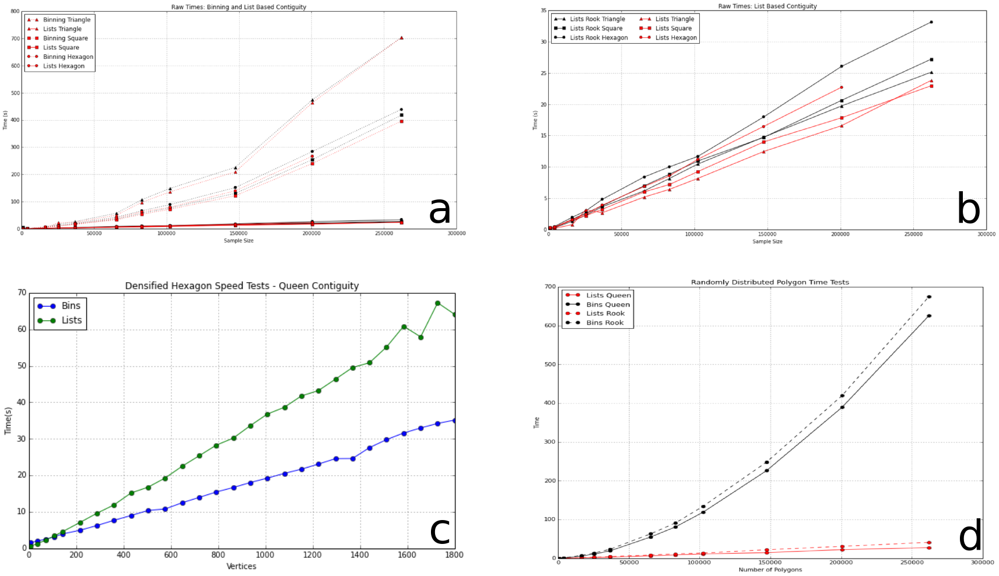
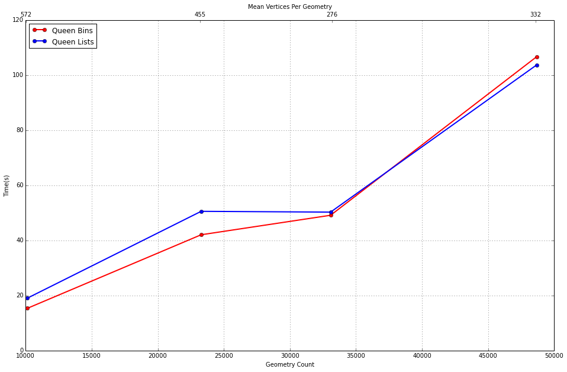

:author: Jason Laura
:email: jlaura@asu.edu
:institution: School of Geographical Sciences and Urban Planning, Arizona State University

:author: Sergio J. Rey
:email: srey@asu.edu
:institution: School of Geographical Sciences and Urban Planning, Arizona State University

--------------------------------------------------------------------
Scaling Polygon Adjacency Algorithms to Big Data Geospatial Analysis
--------------------------------------------------------------------

.. class:: abstract

Adjacency and neighbor structures play an essential role in many spatial analytical tasks.  The computation of adjacenecy structures is non-trivial and can form a significant processing bottleneck as the total number of observations increases.  We quantify the performance of synthetic and real world binary, first-order, adjacency algorithms and offer a solution that leverages Python's high performance containers.  A comparison of this algorithm with a traditional spatial decomposition shows that the former outperforms the latter as a function of the geometric complexity, i.e the number of vertices and edges.

.. class:: keywords

   adjacency, spatial analysis, spatial weights

Introduction
------------

Within the context of spatial analysis and spatial econometrics the topology of irregularly shaped and distributed observational units plays an essential role in modeling underlying processes [Anselin:1988aa]_.  The concept of first and higher order spatial adjacency finds application in tests for global spatial autocorrelation, e.g., Moran's I [Anselin:1996ab]_, spatial regression models[Ward:2007aa]_, and spatially constrained regionalization models [Duque2012]_.  The execution of any of these aforementioned spatial analytical techniques requires the generation of some representation of the underlying connectivity of the observational (polygon) units.

The computation of a spatial adjacency structure is most frequently a precursor to more complex process models, i.e. a pre-processing step.  This processing step occurs dynamically, i.e. the data is not loaded into a spatial database where efficient indexing structures can be pre-generated.  Therefore, the computational cost of generating these data structures is often overlooked in the assessment of global algorithmic performance.  For example, the NP-Hard computation of a spatial regionalization algorithm [Duque2012]_ requires significantly more compute time than the generation of the spatial adjacency structure required to observe a contiguity constraint.  Testing existing algorithm implementations demonstrates that this is largely true within the small data domain where :math:`n`, the total number of observational units is small (:math:`n < 3000`); even a naive implementation is sufficiently performant.  As the resolution of the observational unit increases, i.e. a move from U.S. counties or county equivelents[#]_ to census tracts[#]_, compute time increases significantly.

Spatial Weights Object
======================
A spatial weights object or weights matrix, :math:`W`, is an adjacency matrix that represents potential interaction between each :math:`i,j` within a given study area of :math:`n` spatial units.  This interaction model yields :math:`W` a, typically sparse, :math:`n x n` adjacency matrix.  Within the context of spatial analysis, the interaction between observational units is generally defined as either binary, :math:`w_{i,j} = {0,1}`, depending on whether or not :math:`i` and :math:`j` are considered neighbors, or a continuous values reflecting some general distance relationship, e.g. inverse distance weighted, between observations :math:`i` and :math:`j`.  

In the context of this work, we focus on binary weights where the adjacency criteria requires either a shared vertex (Queen case) or a shared edge (Rook case).  Using regular lattice data, Figure (:ref:`adjacency`) illustrates these two adjacency criteria.  In the Queen case implementation is in line with expectations, i.e. a single shared vertex is sufficient to assign adjacency.  The Rook case, adjacency is more complex and two shared vertices are not sufficient to assert adjacency, i.e.  a queen case implementation with a counter for the number of shared vertices.  Full geometry edges must be compared as it is feasible that two shared vertices do not indicate a shared edge.  For example, a crescent geometry can share two vertices with another geometry but fail to share an edge is another, interceding geometry is present.

.. figure:: adjacency.png
   :align: center
   :figclass: w

   Rook (shared edge) and Queen (shared vertex) adjacency on a regular 3 by 3 lattice.  :label:`adjacency`

PySAL
======
This work is cited and implemented within the larger PySAL (Python Spatial Analysis Library) project.  PySAL is an open-source, pure Python library that provides a broad array of spatial computational methods [Rey2010]_.  This library has been selected for three reasons.  First, PySAL provides data structure, i.e. infrastructure for reading common spatial formats and rendering spatial weights matrices, as a W class instance.  This existing functionality facilitated rapid development that could focus on algorithm implementation and testing.  Second, PySAL implements two spatial adjacency algorithms that serve as benchmarks and validation tools: (1) spatial decomposition through binning and (2) r-tree generation and search.  Finally, PySAL is a mature, open-source project with a wide user base providing exposure of this implementation to the community for further development and testing.  

Algorithms
-----------

Problem Definition
==================
The population of an adjacency list, :math:`A`, or adjacency matrix must identify all polygon geometries which are conterminous.  The definition of adjacent is dependent upon the type of adjacency matrix to be generated.  Each adjacency algorithm requires a list of polygon geometries, :math:`L`, composed of sublists of vertices, :math:`L = [p_{1}, p_{2}, \ldots, p_{n}]`.  Traditionally, the vertices composing each polygon, :math:`p_{i}`, are stored in a fixed winding order (clockwise or counter-clockwise) and share a common origin-termination vertex, :math:`p_{i} = [v_{1}, v_{2}, v_{3}, \ldots, v_{1}]`.  This latter constrain facilitates differentiation between a polygon and polyline.

Below we review three adjacency computation algorithms: a naive approach, a binning approach, and an r-tree approach.  We then introduce an improved adjacency algorithm using high performance containers.

Naive Approach
==============
The naive approach to compute spatial adjacency requires that each vertex, in the case of rook contiguity, or edge, in the case of queen contiguity be compared to each other vertex or edge, respectively.  This is accomplished by iterating over a list or array of input geometries, popping the first geometry from the list, and then comparing all vertices or edges to all remaining geometries within :math:`L`.  This approach leverages the fact that an adjacency matrix, and by extension an adjacency list is diagonally symmetrical, i.e. the upper right and lower left triangles are identical.  This algorithm is :math:`O(\frac{n^{2}}{2})` as each input vertex or edge is compared against each remaining, unchecked vertex or edge.  A minor modification to this approach allows the algorithm to break once adjacency has been confirmed, thereby avoiding duplicate checks on known neighbors.

Spatial Binning
================
Binning seeks to leverage the spatial distribution of :math:`L` to reduce the total number of vertex or edge checks.  Binning approaches can be static, whereby the size of each bin is computed a priori and without consideration for the underlying data density or adaptive, whereby the size of each bin is a function of the number of geometries contained within.  A quad-tree approach is a classic example of the latter technique.  Using a static binning approach as an example, a regular grid or lattice can be overlaid with :math:`L` and the intersection of all :math:`p` into a specific grid cell, :math:`g_{i,j}` computed.  Using binning, polygons may span one or more grid cells.  Once the global dataset has been decomposed into a number discrete gird cells, all geometries which intersect a given cell are tested for adjacency.  This test can be performed by storing either a dictionary (hash) of cell identifiers to member polygon identifiers or a dictionary of geometries identifiers to cell identifiers.  The end result is identical, a subset of the global geometries that may be conterminous.

The primary advantage of this approach over the naive algorithm is the reduction in the total number of edge or vertex checks to be performed.  Those polygons which do not intersect the same grid cell will never be checked and the spatial distribution of the data is leveraged.  The application of a quad-tree decomposition also accounts for variation density.  These advantages are not without cost; the time to compute the initial decomposition can exceed the benefits attained.

Parallel Spatial Binning
========================
One approach to improve the performance of the binning algorithm would be to utilize multiple processing cores (workers).  In this implementation binning is performed in serial and then each bin is mapped to an available processing core for processing.  Therefore, the expensive :math:`O(\frac{n^{2}}{2})` computation can be performed concurrently, up to the number of available processing cores.  An implementation of this type requires three processing steps, with only the second step being performed concurrently.  First, derive a domain decomposition and assign each geometry to one or more bins[#]_.  Second, concurrently apply the naive algorithm to all geometries within a bin.  This requires that the full geometries be communicated from the mother process to the worker process or that the geometries be stored in a globally accessible shared memory space.  Finally, aggregate the results from each worker.  Boundary crossing geometries will be processed by more than one worker that does not have knowledge of adjacent bins.  Therefore, this step is required to remove redundant adjacencies and generate a single adjacency list.

Like the binning approach, decomposition is a non-trivial compute cost.  Additionally, the cost to communicate native python data structures is high in parallel environment.  Representation in efficient arrays requires the generation of those arrays, another upfront processing cost.

R-Tree
======
Like the binning approach, the r-tree seeks to leverage the spatial distribution of the geometries to reduce the total number of :math:`O(\frac{n^2}{2}` computations that must be performed.  An r-tree is composed of multiple levels composed of multiple, ideally balanced nodes, that store aggregated groups of geometry Minimum Bounding Rectangles (MBR).  At the most coarse, the MBR associated with each geometry is a leaf in the tree.  Each step up a branch aggregates leaves into multi-geometry MBRs or multi-geometry MBRs into larger MBRs.  When generating an r-tree two key considerations are the maximum size of each node and the method used to split a node into sub-nodes[#]_.  An r-tree query uses a depth first search to traverse the tree and identify those MBRs which intersect the provided MBR.  For example, assume that geometry A has an MBR of :math:`A_{MBR}`.  An r-tree query begins at level 0 and steps down only those branches which could contain or intersect :math:`A_{MBR}`.

The primary disadvantage to the r-tree is the cost of generation.  In addition to computing the MBR for each input geometry, it is necessary to recursively populate the tree structure using some bulk loading technique.  These techniques seek to ensure high query performance, but add significantly to the cost.  The implementation tested here utilizes a k-means clustering algorithm to split full nodes and is shown by [Gutman]_ to outperform the standard r-tree and compete with the R*-tree.  Even with this improved performance, generation of the data structure is computationally expensive as a function of total compute time.   Additionally, scaling to large data sets in memory constrained environments can introduce memory constraints.  This is a significantly less common disadvantage, but should nonetheless be addressed.

High Performance Containers and Set Operations
===============================================
Each of the preceding algorithms, save the naive approach, leverage a decomposition strategy to improve performance.  Even with decomposition, the inter-cell or inter-MBR computation is still :math:`O(\frac{n^{2}}{2})`.  Combined with the cost to generate intermediary data structures required to capture the decomposition, it is possible to leverage a higher number of lower cost operations and robust error checking to significantly improve performance.  At the heart of our approach is the hashtable (dictionary), that provides average case :math:`O(1)` lookup by key, the set that provides :math:`O(length(set_{a}) + length(set_{b}))` set unions and lookup tables that facilitate :math:`O(1)` list (array) access by element.  By minimizing data allocation time and set unions, it is therefore possible to develop an implementation where the majority of computation is, average case, :math:`O(1)`.

In implementation, Algorithm (:ref:`twostep`), the algorithm utilizes a defaultdict where the key is the vertex coordinate and the value is a set of those polygon identifiers which contain that vertex (Queen case).  Stepping over an input shapefile, line 9, this data structure is iteratively populated.   In line 10, we slice the vertex list such that the final vertex is ignored, knowing that it is a duplicate of the first vertex.   The inner for loop, line 11, iterates over the list of vertices for a given geometry and adds them to the vertices default dict, line 8.  Once this data structure is generated, the algorithm creates another dictionary of sets where the key is a polygon identifier and the value is a set of those polygons which are adjacent.  Stepping over the previous dictionary, line 15, the algorithm iterates over the value, a set of neighbors, and populates a new dictionary of sets which are keyed to the polygon identifiers.  This yields a dictionary with keys that are polygon ids and values which are sets of neighbors.  We define this as a two step algorithm due to the two outer for loops.

.. code:: python
    :linenos:

    def twostep(fname):
        shpFileObject = fname
        if shpFileObject.type != ps.cg.Polygon:
            return
        numPoly = len(shpFileObject)
        
        vertices = collections.defaultdict(set)
        for i, s in enumerate(shpFileObject):
            newvertices = s.vertices[:-1]
            for v in newvertices:
                vertices[v].add(i)      
                
        w = collections.defaultdict(set)
        for neighbors in vertices.itervalues():
            for neighbor in neighbors:
                w[neighbor] = w[neighbor] | neighbors
            
        return w

Two step algorithm using higher performance containers for the Queen case. :label:`twostep`

The Rook case is largely identical with the initial vertex dictionary being keyed by shared edges (pairs of vertices) instead of single vertices.

Experiment
-----------

Hardware
=========
All tests were performed on a 3.1 Ghz, dual core Intel i3-2100 machine with 4GB of RAM running Ubuntu 64-bit 14.04 LTS.  The iPython notebook environment was used to initiate and analyse all tests.  All other non-system processes were terminated.

Experiments
===========
We perform two sets of experiments, one using synthetically generated data and one using U.S. Census data.  These tests were performed to quantify the performance of the list based contiguity algorithm as compared to r-tree and binning implementations with the goal of testing three hypothesis.  First, we hypothesis that the list based algorithm will be faster than r-tree and binning algorithms across all datasets due to the reduced asymptotic cost.  Second, we expect the list based algorithm to scale as a function of the total number of neighbors and the average number of vertices (or edges in the Rook case) per geometry.  We anticipate that this scaling remains linear.  Third, we hypothesize that the algorithm should not scale significantly worse within the memory domain than either the r-tree or binning approaches due to the reduced number of data structures.

To test these hypotheses we generate both regularly tessellating and randomly distributed synthetic data ranging in size from 1024 geometries to 262,144 geometries [#]_.  We utilize triangles, squares and hexagons as evenly tessellating geometries with easily controlled vertex count, edge count, and average neighbor cardinality.  We also densify the 4096 hexagon lattice to test the impact of increased vertex count as the number of edges remains static.  To assess algorithm performance with real world data we utilize U.S. census block group data.

Results
-------
Across all synthetic data tests we report that the r-tree implementation was 7 to 84 times slower than the binning implementation and 22 to 1400 times slower than the list based contiguity measure.  Additionally, we see that the r-tree implementation required significant quantities of RAM to store the tree structure.  We therefore illustrate only the binning and list based approach in subsequent figures.

Figure \ref{fig:speed}(a - d) illustrate the results of four experiments designed to compare the performance of the list based and binning approaches as a function of total geometry count, total vertex count (and by extension edge count), average neighbor cardinality, and data distribution.  Figure (:ref:`merged`)(a) illustrates the scaling performance of the list and binning algorithms.  The former scales linearly as the total number of polygons is increased and the latter scales quadratically.  As anticipated, the Rook contiguity measures require slightly more processing time than the associated Queen contiguity measures.  In Figure (:ref:`merged`)(b), the algorithm exhibits increased computational cost as a function of geometric complexity, e.g. the number of vertices, number of edges, and mean number of neighbors.  This is illustrated by the general trend of compute times with the triangular tessellation requiring the least time and the hexagon tessellation requiring the most.
Densification of the 4096 hexagon polygon with between 6 and 300 additional vertices per edge highlights an inversion point, where binning regains dominance over the list based approach, Figure (:ref:`merged`)(c).
Finally, in Figure (:ref:`merged`)(d) the total compute time using randomly distributed polygon datasets are shown.  Again, we report quadratic scaling for the existing binning approach and linear scaling for the list based approach.

   Spatial binning and list based performance comparison showing: (a) scaling a total synthetic data size increases, (b) list based scaling using synthetic data, (c) scaling performance as the total number of vertices is increased, and (d) randomly distirbuted data with varying neighbor cardinality and vertex counts. :label:`merged`

To test algorithm performance with real world data, we utilize four, increasingly large subsets of the global U.S. census block dataset, Figure (:ref:`realworld`).  We report that neither binning nor our list based solution are dominant in all use cases.  We report that, as a function of the total geometry count, it appears that a threshold exhists around :math:`n = 32500` (lower x-axis).  Utilizing the upper x-axis, the previous assertion appear erroneous; overall algorithm scaling is a function of the total count, but comparative performance is a function of the geometric complexity with parity existing around :math:`n=275` and dominance of the list based method being lost between :math:`275 < n < 575`.  

   Spatial binning and list performance for the Queen contiguity case using four subsets of census blocks in the Western United states with varying spatial densities, geometry counts, and mean vertex counts.  Plot origin is based upon the number of geometries (lower x-axis). :label:`realworld`

Discussion
-----------

Our list based adjacency algorithm significantly outperforms the current r-tree implementation within the PySAL library.  We believe that this is a function of the increased overhead required to generate a the tree structure.  Across all synthetic data tests, save the vertex densification, we see the list based approach performs well.  As anticipated, this method scales with the number of vertices.

Utilizing real world data, the selection of algorithm becomes significantly more challenging as the list based approach does not behave in a linear manner.  We suggest that the constant time set operations become large as a function of total compute time.  Having gained this insight, we ran additional tests with a read threshold.  In this implementation a subset of the input dataset is read, processed, and written to an in-memory :math:`W` object.  This process iterates until the entire dataset is read.  Using this method, we see that the list based approach, in the Queen case, can be as performant as the binning approach as a function of the mean number of vertices.  Since this information is not available via the binary shapefile header, we suggest that the list based approach may be performant enough across all use cases, i.e. the performance does not significantly degrade at extremely high vertex counts.  The list based approach still dominates the binned approach in the Rook case.

Utilizing real world data, the binning approach is also able to leverage an essential break function, where known neighbors are no longer checked.  This is not, to our knowledge, feasible using the list based approach and two neighors with :math:`n` shared vertices must be compared :math:`n` times.  The introduction of a break, if feasible, should continue to improve performance of the list based approach.

Finally, in profiling both the binning and list based approaches, we see that reading the input shapefile requires at least one third of the processing time.  Therefore, I/O is the largest current processing bottleneck for which parallelization maybe a solution.

Next Steps
===========

As described above, the r-tree implementation was significantly slower than anticipated.  To that end, we intend to profile and potentially optimize the PySAL r-tree implementation with the goal of identifying whether poor performance is a function of the implementation or a product of the necessary overhead required to generate the tree structure.  

The improved adjacency algorithm provides multiple avenues for future work.  First, we have identified file i/o as the current processing bottleneck and have shown that the algorithm can leverage concurrent streams of geometries.  Therefore, parallel i/o and a map reduce style architecture may provide significant performance improvements without major algorithm alterations.  This could be realized in a Hadoop style environment or with a cluster computing environment.  Second, we believe that error and accuracy of spatial data products remain an essential research topic and suggest that the integration of a 'fuzzy' checker whereby some tolerance value can be used to determine adjacency is an important algorithm addition.  Finally, we will continue integration into PySAL of these methods into more complex spatial analytical methods so that total algorithm processing time is improved, not just the more complex analytical components.

References
-----------

.. [Anselin:1988aa] Anselin, L. *Spatial econometrics: Methods and models*, Matrinus
		    Nijhoff, Dordrecht, the Netherlands. 1988.

.. [Anselin:1996ab] Anselin, L. and Smirnov, O. *Efficient algorithms for constructing
		    proper higher order spatial lag operators*, Journal of Regional Science,
		    36(1):67 – 89, 1996.

.. [Duque2012] Duque, J. C., Anselin, L., and Rey, S. J. *The Max-P-Regions Problem*, Journal of Regional Science, 		       52(3):397–419, 2012.

.. [Gutman] Gutman, A. *R-Trees: A dynamic index structure for spatial searching*, Proceedings of the 1984 ACM SIGMOD International Conference on Management of Data, 1984. 

.. [Rey2010] Rey, S. J. and Anselin, L. *PySAL: A Python library of spatial
	     analytical methods*, In Fischer, M.M ; Getis, A., editor, Handbook of
 	     Applied Spatial Analysis, pages 175–193. Springer, 2010.

.. [Ward:2007aa] Ward, M. D. and Gleditsch, K. S. An Introductiuon to spatial regression models in the social sciences*, https://web.duke.edu/methods/pdfs/SRMbook.pdf, 2007, Retreived June 12, 2014.

.. [#] :math:`{32, 64, 128, 160, 192, 256, 288, 320, 384, 448, 512}` geometries squared.
.. [#] :math:`n = 3,144`
.. [#] :math:`n = 74,134` in the 2010 census
.. [#] Conversely assign each bin to those geometries it contains.
.. [#] While this section describes the function of an r-tree from fine to coarse, they are generated from coarse to fine.
