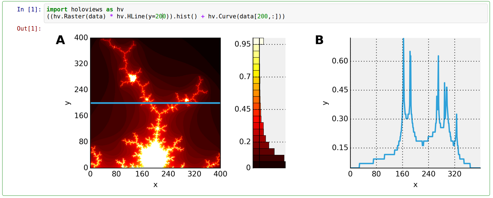
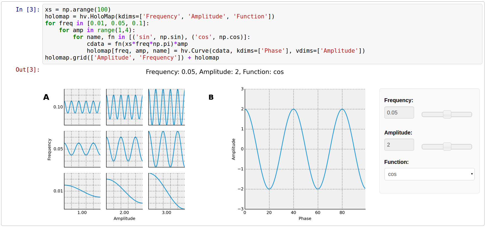

:author: Jean-Luc R. Stevens
:email: jlstevens@ed.ac.uk
:institution: Institute for Adaptive and Neural Computation, University of Edinburgh

:author: Philipp Rudiger
:email: p.rudiger@ed.ac.uk
:institution: Institute for Adaptive and Neural Computation, University of Edinburgh

:author: James A. Bednar
:email: jbednar@inf.ed.ac.uk
:institution: Institute for Adaptive and Neural Computation, University of Edinburgh

--------------------------------------------------------------------------
HoloViews: Building Complex Visualizations Easily for Reproducible Science
--------------------------------------------------------------------------

.. class:: abstract

   Scientific visualization typically requires large amounts of custom
   coding that obscures the underlying principles of the work and
   makes it difficult to reproduce the results.  Here we describe how
   the new HoloViews Python package, when combined with the IPython
   Notebook and Matplotlib, provides a rich, interactive interface for
   flexible and nearly code-free visualization of your results while
   storing a full record of the process for later reproduction.

   HoloViews provides a set of general-purpose data structures that
   allow you to pair your data with a small amount of metadata.  These
   data structures are then used by a separate plotting system to
   render your data interactively, e.g. within the IPython Notebook
   environment, revealing even complex data in publication-quality
   form without requiring custom plotting code for each figure.

   HoloViews also provides powerful containers that allow you to
   organize this data for analysis, embedding it whatever
   multidimensional continuous or discrete space best characterizes
   it. The resulting workflow allows you to focus on exploring,
   analyzing, and understanding your data and results, while leading
   directly to an exportable recipe for reproducible research.

.. class:: keywords

   reproducible, interactive, visualization, notebook

Introduction
------------

Scientific research alternates between stretches of speculative,
exploratory investigation and periods where crucial findings are
distilled and disseminated as publications or reports. The exploratory
phase typically involves running many different analyses with
interactive plotting tools before the important aspects of the data
are determined. The final results are then typically prepared as
static figures for dissemination, often putting together many
subfigures into a complicated figure that reveals multiple
interrelated aspects of the results.

Current software tools provide relatively poor support for this dual
exploring/reporting nature of scientific research, severely limiting
scientific progress.  On the one hand, developing new exploratory
visualizations typically requires large amounts of custom software
coding, which is slow, error-prone, and distracts from the actual
scientific analysis.  Moreover, this process typically involves a
large amount of trial and error, generating transitory code and
analyses that make it difficult to later reproduce the steps that led
to any particular result [Cro13]_.  Switching to different tools for
final, non-interactive, publication-quality figures exacerbates this
problem, further disconnecting the reported results from the process
by which they were created.  This lack of reproducibility is a serious
handicap both for progress within a single lab and for the community
as a whole, making it nearly impossible for researchers to build on
each others' work even for purely computational projects [Cro13]_.

Here we will describe a new Python software package built to address
these problems directly, by providing simple tools for gradually
building elaborate visualizations and analyses interactively yet
reproducibly. HoloViews supports immediate exploration of data as it
is obtained, without requiring custom coding, and then supports
incrementally revealing more complex relationships between datasets,
culminating in the final publication of fully reproducible scientific
results.

In this paper we will focus on the high-level design principles that
allow HoloViews to achieve these goals and we encourage the reader to
visit `holoviews.org <http://holoviews.org>`_ for concrete example. As
detailed below we show how this is achieved by enforcing a strict
separation in the declaration of the semantic properties of the data
and the specification of plotting options, allowing the user to
declaratively specify their intent and let HoloViews handle the
visualization.

The interactive interpreter
~~~~~~~~~~~~~~~~~~~~~~~~~~~

To understand this approach, we need to consider the history of how we
interact with computational data. The idea of an interactive
programming session originates with the earliest LISP interpreters in
the late 1950s and remains a popular way to interact with dynamic
languages such as Python.

..
   Since then, high-level programming languages have become even more
   dynamic in nature. In recent years, the Python language has been
   widely adopted by researchers due to its concise, readable
   syntax. Python is well suited to dynamic interaction and offers an
   interactive, textual interpreter.

However, like most such command prompts, the standard Python prompt is
a text-only environment. Commands are entered by the user, parsed, and
executed, with results displayed as text.  This approach offers
immediate feedback and works well for data that is naturally expressed
in a concise textual form. Unfortunately, this approach begins to fail
when the data cannot be usefully visualized as text, as is typical for
the large datasets now commonplace.  In such instances, a separate
plotting package offering a rich graphical display would normally be
used to present the results outside the environment of the interpreter
via a graphical user interface.

This disjointed approach reflects history: text-only environments,
where interactive interpreters were first employed, appeared long
before any graphical interfaces. To this day, text-only interpreters
are standard due to the relative simplicity of working with
text. Proprietary attempts to overcome these limitations, such as the
Mathematica Notebook [Wol03]_, have remained constrained by limited
interoperability and a lack of standardized open formats.  Other
approaches focusing explicitly on reproducibility involve building a
recipe for reproducing results only at the end of the scientific
project [knitr]_, when it is often too late to capture the important
steps involved.  Here we consider how graphical output can be
integrated fully into an interactive workflow, addressing both
exploration and reproducibility simultaneously.

Fixing the disconnect between data and representation
~~~~~~~~~~~~~~~~~~~~~~~~~~~~~~~~~~~~~~~~~~~~~~~~~~~~~

At the same time as text-based interpreters have failed to overcome
the inherent limitations of working with rich data, the web browser
has emerged as a ubiquitous means of interactively working with rich
media documents. In addition to being universally available, web
browsers have the benefit of being based on open standards that remain
supported almost indefinitely. Although early versions of the HTML
standard only allowed passive page viewing, the widespread adoption of
HTML5 has made it possible for anyone to interact with complex, dynamic
documents in a bi-directional manner.

The emergence of the web browser as a platform has been exploited by
the Python community and the scientific community at large with tools
such as the IPython Notebook [Per07]_ and SAGE MathCloud
[Ste05]_. These projects offer interactive computation sessions in a
notebook format instead of a traditional text prompt. Although similar
in design to the traditional text-only interpreters, these notebooks
allow embedded graphics or other media (such as video) while
maintaining a record of useful commands in a rich document that
supports the gradual development of a document with interleaved code,
results, and exposition.

Yet despite the greatly improved interactive capabilities of these
tools, the spirit of the original interpreter has not been restored:
there is an ongoing disconnect between data and its
representation. This artificial distinction is a lingering consequence
of a text-only world and has resulted in a strict split between how we
conceptualize 'simple' and 'complex' data. Although the IPython
notebook has offered the means give objects rich media
representations, until now few packages have embraced this approach
and none have done so in a compositional manner. As a result the most
common way to visualize complex data remains for the user to specify a
detailed list of steps using an external plotting package such as
Matplotlib [Mpl]_.

Here we introduce HoloViews, a library of simple classes designed to
provide an immediately available representation for even complex data
in notebooks, analogous to the way interactive sessions are used with
simple data types. HoloViews is not a plotting package; instead, it
offers a set of useful data structures paired with rich, customizable
visual representations that display effortlessly in the IPython
Notebook environment. The result is research that is more interactive,
concise, declarative, and reproducible. Figure :ref:`layout` shows a
self-contained example of building a complex visualization showing the
declaration of an ``Image`` object followed by an example of how to
compose HoloViews objects together.

..
   jbednar: is it necessary to have the bounds= argument?  Can it and
   any of the other arguments be omitted?  The one on the web page is
   simpler and I think that's better for a first figure. Such
   complications are fine for later figures, but make it far less
   likely that anyone will actually read this figure...

   Example of a composite HoloViews data structure and how it is
   displayed in an IPython Notebook session. The ``imdata`` array
   loaded using Numpy corresponds to the displayed portion of the
   Mandelbrot set. **A.** The ``Image`` element displays ``imdata``
   overlaid via the ``*`` operator with a horizontal line element
   (``HLine``). **B.** A ``Curve`` element
   generated via the ``.sample()`` method of the image, showing a
   cross-section of the fractal along the indicated blue horizontal
   line. The curve is concatenated with the ``Overlay`` in **A** via
   the ``+`` operation. :label:`layout`

..
   Emphasize the importance of reproducibility more? I had this:

   Although this has increased the speed of exploration, this has come
   at the cost of reproducibility, a cornerstone of the scientific
   method. In some fields, the lack of reproducibility is a major
   problem, making it clear that there is still much scope for
   improving the ways in which we use computers to do research.

   Work in the natural dimensions of your data i.e the real-world
   continuous space instead of directly worrying about samples. 

   Raw data must always be accessible no matter how nested the data is.

Design principles
-----------------

The core design principle of HoloViews is to *automatically* and
*transparently* return and display declarative data structures to the
user for immediate feedback without requiring additional
code. Although this concept is familiar and intuitive when
interactively working with simple data types, it is worth reviewing
explicitly what is going on so that the appropriate graphical
extension of these ideas is clear.

When executing an addition operation like ``1 + 2.5`` at a Python
prompt, the expression is parsed, converted into bytecode, and then
executed, resulting in the float value ``3.5``. This floating-point
value is immediately returned to the user in the appropriate
displayable representation, giving the user immediate feedback. Of
course, this representation is not the float itself, but the string
``"3.5"``. Such strings are automatically generated by the
interpreter, via the displayed object's ``__repr__`` method.

The Python interpreter also provides such automatic, immediate
feedback for more complex data types like large NumPy arrays, but for
such data the displayed string has very little utility because it is
either incomplete or impractical.  In a terminal, this restriction is
a result of the ``__repr__`` method only supporting a text-based
display value. Using HoloViews in the IPython Notebook, you can give
your array a more useful, interpretable default visual representation
as an image, curve, or similar plot according to the following
principles:

* It must be easy to assign a useful and understandable default
  representation to your data. The goal is to keep the initial barrier
  to productivity as low as possible -- data should simply reveal itself.
* These atomic data objects (elements) should be almost trivially simple
  wrappers around your data, acting as proxies for the contained
  arrays along with a small amount of semantic metadata (such as whether
  the user thinks of some particular set of data as a continuous curve
  or as a discrete set of points).
* Any metadata included in the element must address issues of *content*
  and not be concerned with *display* issues --  elements should
  hold essential information only.
* There are always numerous aesthetic alternatives associated with
  rich visual representations, but such option settings should be
  stored and implemented entirely separately from the content elements, so
  that elements can be generated, archived, and distributed without
  any dependencies on the visualization code.
* As the principles above force the atomic elements to be simple, they
  must then be *compositional* in order to build complex data
  structures that reflect the interrelated plots typical of
  publication figures.

The outcome of these principles is a set of compositional data
structures that contain only the essential information underlying
potentially complex, publication-quality figures. These data
structures have an understandable, default visualization that
transparently reveals their contents, making them a useful proxy for
the data itself, just as the text ``3.5`` is a proxy for the
underlying floating-point value.  This default visualization may then
be customized declaratively to achieve the desired aesthetics, without
complicating the objects themselves.

In the next section we will discuss the data structures that hold the
important content. Starting with the simple primitive elements, we
examine how they can be composed into complex figures and embedded in
high-dimensional spaces for exploration. Along the way we will
discover how our implementation realizes the design principles
outlined and manages to keep the state of the data separate from its
visual representation.

Data Structures
---------------

In this section we discuss the data structures that hold the raw data
and the essential semantic content of interest. The Elements section
introduces each of the primitives, and the Collections section
explains how they can be combined. Finally, we will discuss working
with Elements embedded in high-dimensional continuous or discrete
spaces.

Elements
~~~~~~~~

The atomic classes that wrap raw data are the ``Element``
primitives. These classes are named by the natural representation they
suggest for the supplied data, with ``Image``, ``Curve``, and ``Scatter``
being some simple examples. These elements are easily constructed as
they only require the raw data (such as a NumPy array) to display.

In Figure :ref:`layout`, we have some examples of the Element
primitives. On the left, in subfigure **A**, we see the ``Image``
primitive containing a two-dimensional NumPy array. This ``Image`` is
declared by supplying the NumPy array ``imdata`` along with the
optional metadata, including a suitable label and a declaration of the
bounding region in the complex plane. The visual output is
automatically generated and shows that the array is a part of the
Mandelbrot set. Our object merely holds the supplied NumPy array, which
remains easily accessed via the ``.data`` attribute. In part **B** of
Figure :ref:`layout` we have an example of a ``Curve`` containing a
horizontal cross section of the image, as computed by the
``sample`` method.

..
   For instance, executing ``c=Curve(range(10))`` will build a simple
   ``Curve`` object and assigned it to the variable ``c``. If in the
   IPython notebook, we look at the value of the object ``c``, we will
   see that the object ``c`` has a rich representation given by a linear
   plot of our supplied *y*-values over the implicit *x*-axis.

Although the names of the ``Elements`` suggest that these objects are
about visualization, they are primarily concerned with content and
*not* display. The visually meaningful class names offer a convenient
way to intuitively understand the dimensionality of the data in terms
of an appropriate visual representation. For instance, in Figure
:ref:`layout` **A**, the name ``Image`` conveys the notion that the
contained data is in the form of a two-dimensional NumPy array that
can be meaningfully displayed as an image.

The particular ``Image`` shown in Figure :ref:`layout` **A** was 
constructed as a visualization of the Mandelbrot Set,
defined in the complex plane. In particular, the ``kdims`` argument
declares that the *x*-axis is along the real axis and that the
*y*-axis is along the imaginary axis. This information is then
reflected in the visual output by assigning
the appropriate axis labels. This semantic information is also passed
to the ``Curve`` object generated by sampling the image using
``im.sample(Im=1)``.

This ``Curve`` object is also able to pass on this semantic
information to other Elements with different visual representations so
that they faithfully reflect the space in which the Mandelbrot Set is
defined. For instance, you can pass the curve directly to the
constructor of the ``Scatter`` or ``Histogram`` elements and a new
visual representation of the resulting object will retain the
original semantic dimension labels. This type of operation merely
changes the representation associated with the supplied data.

Note that in the declarations of ``Image``, the dimensions of the axes
are declared as key dimensions (``kdims``). Key dimensions correspond
to the independent dimensions used to index or slice the element,
with the remaining dimensions called value dimensions
(``vdims``). In the case of this image, there is a single value
dimension, for the values in the supplied NumPy array, which
are then visualized using the default colormap of the ``Image``
elements (the 'hot' color map).

As key dimensions are indexable and sliceable, we can slice the
``Image`` to select a different subregion of the Mandelbrot
Set. Continuous values are supported when slicing an ``Image`` and the
result is then a new ``Image`` containing the portion of the original
NumPy array appropriate to the specified slice.  The mapping between
continuous space and the discrete array samples is specified by the
bounds, allowing us to apply the slice ``[-0.2:0,0.85:1.05]`` to
select the corresponding part of the complex plane.  The first
component of this slice selects the first key dimension (the real axis
``'Re'``) from *-0.2* to *0.0* while the second component of the slice
selects the second key dimension (the imaginary axis ``'Im'``) from
*0.85* to *1.05*. You can apply a similar slice along the real axis to
select a portion of the curve object shown in Figure :ref:`layout`
**B**.

There are many additional element classes, one for each of the common
visual representations for data. These elements form an extensible
library of primitives that allow the composition of data structures
with complex, meaningful visualizations. Within the set of all
elements, you can cast your data between representations so long as
the number of key and value dimensions is consistent. You can then
index and slice your elements along their respective key dimensions to
get new elements holding the appropriately sliced data of interest.

Collections
~~~~~~~~~~~

The elements are simple wrappers that hold the supplied data and allow
a rich, meaningful default representation. An individual element is
therefore a data structure holding the semantic contents corresponding
to a simple visual element of the sort you may see in a
publication. Although the elements are sufficient to cover simple
cases such as individual graphs, raster images, or histogram, they are
not sufficient to represent more complex figures.

A typical published figure does not present data using a single
representation, but allows comparison between related data items in
order to illustrate similarities or differences. In other words, a
typical figure is an object composed of many visual representations
combined together. HoloViews makes it trivial to compose elements in
the two most common ways: concatenating representations into a single
figure, or overlaying visual elements within the same set of axes.

These types of composition are so common that both have already been
used in Figure :ref:`layout` as our very first example. The ``+``
operation implements the first type of composition and ``*``
implements the act of overlaying elements together. When you compose
an object using the ``+`` operator, a default four-column layout is
used but you can specify the desired number of columns using the
``.cols`` method.  Layouts are easily specified but also support
multiple options for customizing the position and sizing of elements.

When we refer to subfigures :ref:`layout` **A** and :ref:`layout`
**B**, we are making use of labels generated by HoloViews for
representing a composite data structure called a
``Layout``. Similarly, subfigure :ref:`layout` **A** is itself a
composite data structure called an ``Overlay`` which, in this
particular case, consists of an ``Image`` element overlaid by the
``HLine`` element.

The overall data structure that corresponds to Figure :ref:`layout` is
therefore a ``Layout`` which itself contains another composite
collection in the form of an ``Overlay``. The object in Figure
:ref:`layout` is in fact a highly flexible, compositional tree-based
data structure: intermediate nodes correspond either to ``Layout``
nodes (``+``) or ``Overlay`` nodes (``*``), with element primitives at
the leaf nodes. Even in this potentially complex tree, all the raw
data corresponding to every visual element is conveniently accessible
via key or attribute access by selecting a leaf element using its path
through the tree, and then inspecting the ``.data`` attribute, making
it simple to declare which part of a complex dataset you want to work
with at a given time.

As any element may be a leaf of such a tree, there needs to be an easy
way to select subtrees or leaf elements. This is achieved with a
semantic, two-level labeling system using "group" and "label" strings
supported throughout HoloViews. We have seen an example of a label
string in Figure 1, where it was used to title the image 'Mandelbrot
Set'. The textual representation of the layout in Figure :ref:`layout`
(see Out[6] of Figure :ref:`customization`) shows how the supplied
label is used in the attribute-based indexing scheme of the
layout. The strings 'Image', 'Overlay', 'HLine' and 'Curve' are
default group names, but you can supply your own names to define
semantic groupings for your data. To illustrate this system, you can
access the sampled data (a NumPy array) in Figure :ref:`customization`
using ``content.Curve.Cross_Section.data``.

With the ability to overlay or concatenate any element with any other,
there is great flexibility to declare complex relationships between
elements. Whereas a single element primitive holds semantic
information about a particular piece of data, trees encode semantic
information between elements. The composition of visual elements into
a single visual representation expresses some underlying semantic
value in grouping these particular chunks of data together. This is
what composite trees capture; they represent the overall *semantic
content* of a figure in a highly composable and flexible way that
always preserves both the raw data and associated metadata for further
interactive analysis and reproduction.

Spaces
~~~~~~

   Example of a Layout object containing two different representations
   of a multi-dimensional space. Both representations contain
   ``Curve`` objects embedded in three dimensions (``Frequency``,
   ``Amplitude``, ``Function``), but not all of these dimensions can
   be visualized at once. In **A**, two of the dimensions are mapped
   onto the rows and columns of a grid, and the remaining ``Function``
   dimension can be selected using the widget at the right. In **B**,
   only a single curve is shown, with the three sliders at the right
   together selecting the appropriate curve from the 3D HoloMap
   space. When two ``HoloMaps`` are joined in a ``Layout`` like this,
   it will automatically find the joint set of dimensions the HoloMaps
   can be varied over. In this way HoloMaps allow users to explore
   data naturally and conveniently even when its dimensionality
   exceeds what can be sensibly displayed on the screen at
   once. :label:`spaces`

..
   The visual representation of data faces two main bottlenecks, (1) our
   perceptual limitations and (2) the limits forced on us by the flat 2D
   media we use to display it.

A single plot can represent at most a few dimensions before it becomes
visually cluttered. Since real-world datasets often have higher
dimensionality, we face a tradeoff between representing the full
dimensionality of our data, and keeping the visual representation
intelligible and therefore effective. In practice we are limited to
two or at most three spatial axes, in addition to attributes such as
the color, angle, and size of the visual elements. To effectively
explore higher dimensional spaces we therefore have to find other
solutions.

One way of dealing with this problem is to lay out multiple plots
spatially.  Plotting packages like ggplot [Wic09]_ and seaborn
[Was14]_ have shown how this can be done easily using various
grid-based layouts. Another solution is to present the data
sequentially over time as an animation.  A third solution is to
provide interactive control, allowing the user to reveal further
dimensionality by interacting with the plots using various widgets.

In HoloViews, we solve this problem with composable data structures
that embed collections of ``Element`` objects in any arbitrarily
dimensioned space. Fundamentally, this set of data structures
(subclasses of ``NdMapping``) are multi-dimensional dictionaries that
allow the user to declare the dimensionality of the space via a list
of key dimensions (``kdims``).

The list of supported ``NdMapping`` classes includes:

* ``HoloMaps``: The most flexible high-dimensional data structure in
  HoloViews, allowing ``Element`` instances to be embedded in an
  arbitrarily high-dimensional space, to be rendered either as a
  video animation or as an interactive plot that allows
  exploration via a set of widgets.

* ``GridSpaces``: A data structure for generating spatial layouts
  with either a single row (1D) or a two-dimensional grid. Each
  overall grid axis corresponds to a key dimension.

* ``NdLayouts``/``NdOverlays``: Similar to ``Layout`` or ``Overlay``
  objects, where the contained objects vary over one or more
  dimensions.

To explore a high-dimensional space of height as a function of age
across different countries and years, you could declare ``space=HoloMap(kdims=['Country', 'Year'])``. Now we can treat ``space`` as a
dictionary and insert instances of classes such as ``Curve`` or
``Scatter`` with the appropriate ``(country, year)`` keys. For
instance, the age and height ``Curve`` for the USA in 1988 (``usa``)
can be inserted using ``space['USA', 1988] = usa``. Note that the
order of the indexing corresponds to the order of the declared key
dimensions.

..
   jbednar: is it necessary to mention that GridSpace is restricted to
   two dimensions?  If you cast a 3d HoloMap into a GridSpace, won't
   it just end up being a 2D grid of 1D HoloMaps?  If so you don't
   need to mention anything here about such a restriction.

All of the above classes are simply different ways to package and view
a high-dimensional dataset. Just as with ``Elements``, it is possible
to cast between these different spaces via the constructor. In
addition, they can all be tabularized into a HoloViews ``Table``
element or a pandas ``DataFrame`` [pandas]_, a feature that is also
supported by the ``Element`` primitives.

To get a sense of how composing data and generating complex figures
works within this framework, we explore some artificial data in Figure
:ref:`spaces`. Here we vary the frequency and amplitude of sine and
cosine waves, demonstrating how we can quickly embed this data into a
high-dimensional space. First, we declare the dimensions of the space
we want to explore as the key dimensions (``kdims``) of the
HoloMap. Next, we populate the space iterating over the frequencies,
amplitudes, and the two trigonometric functions, generating each
``Curve`` element individually and assigning to the HoloMap at the
correct position in the space.

.. 
   jbednar: should you swap A and B in figure 2?  The single-curve
   HoloMap view is arguably easier to describe, and it's mentioned
   first in the main text.

We can immediately go ahead and display this HoloMap either as an
animation or using the default widgets, as in Figure :ref:`spaces`
**B**. Visualizing individual curves in isolation is not very useful,
of course; instead we probably want to see how the curves vary across
``Frequency`` and ``Amplitude`` in a single plot. A ``GridSpace``
provides such a representation and by using the space conversion
method ``.grid()`` we can easily transform our three-dimensional
HoloMap into a two-dimensional GridSpace (which then allows the
remaining dimension, the choice of trigonometric function, to be
varied via the drop-down menu). Finally, after composing a ``Layout``
together with the original ``HoloMap``, we let the display system
handle the plotting and rendering.

If we decide that a different representation of the data would be more
appropriate, it is trivial to rearrange the dimensions without needing
to write new plotting code. Even very high-dimensional spaces can be
condensed into an individual plot or expressed as an interactive plot
or animation, by simply specifying which part of the data we are
interested in rather than writing new brittle and error-prone custom
plotting code.

Customizing the visual representation
-------------------------------------

In this section we show how HoloViews achieves a total separation of
concerns, keeping the composable data structures introduced above
completely separate from both customization options and the plotting
code. This design is much like the separation of content and
presentation in markup languages such as HTML and CSS, and provides
the same benefits of making the content easily maintainable while the
presentation is easily controllable.

The only required connection between the above data structures and the
custom display options is a single, automatically managed integer
identification attribute stored with the data structure.  Using this
``id`` as a key, we can make the data structures behave as if they
were rich, stateful, and customizable objects, without actually
storing anything to do with visualization on the objects. We will show
how this separation is useful and extensible so that the user can
quickly and easily customize almost every aspect of their plot. For
instance, it is easy to change the font size of text, change the
subfigure label format, change the output format (e.g. switch from PNG
to SVG) and even alter the plotting backend (currently defaulting to
Matplotlib) without changing any part of the underlying object being
rendered.

.. 
   jbednar: Nice!  I'm not sure which part Input is meant to
   correspond to, though.  Should the line below it be erased
   (which would indicate that Content and Options are both Input)?

.. figure:: display_system.pdf
   :scale: 35%
   :align: center

   This view of the HoloViews display and customization systems
   illustrates the complete separation between the content (data) to
   be displayed, the display options, and the rendering/plotting
   system. The display options are stored entirely separately from the
   content, with the appropriate options being selected with
   user-controllable levels of specificity: general options for all
   objects of a given type, more specific options controlled by
   user-definable ``group`` and ``label`` strings, or arbitrarily
   specific options based on a unique integer ``id`` assigned to each
   content object. Plotting and rendering happens automatically by
   combining the content with the specified display options and
   calling an external plotting library, returning an HTML
   representation that can then be rendered in the
   notebook. :label:`schematic`

Figure :ref:`schematic` provides an overall summary of how the
different components in the display system interact. The declarative
data structures define what will be plotted, specifying the
arrangements of the plots, via Layouts, Overlays, and spaces. The
connection between the data structure and the rendered representation
is made according to the object type, the aforementioned ``id``
integer, and optionally specified group and label strings. By
collecting the display options together and associating them with
particular objects via these attributes, the visual representation of
the content may be easily customized, e.g. to tweak aesthetic details
such as tick marks, colors and normalization options. Once the user
has specified both content and display options and has asked the
object to be displayed, the rendering system looks up the appropriate
plot type for the object in a global registry, which then processes
the object and looks up the corresponding options in order to display
it appropriately. This happens transparently without any input from
the user. Once the plotting backend has rendered the plot in the
appropriate format, it will be wrapped in HTML for display in the
notebook.

The default display options are held on a global tree structure
similar in structure to the composite trees described in the previous
section, but with nodes holding custom display options in the form of
arbitrary keywords. In fact, these option trees also use labels and
groups the same way as composite trees except they additionally
support type-specific customization. For instance, you may specify
colormap options on the ``Image`` node of the tree that will then be
applied to all ``Images``. If this chosen colormap is not always
suitable, you can declare that all ``Image`` elements belonging to a
group (e.g. ``group='Fractal'``) should use a different colormap by
overriding it on the ``Image.Fractal`` node of the tree. This form of
inheritance allow you to specify complex yet succinct style
specifications, applying to all objects of a particular type or just
to specific subsets of them.

.. figure:: customization_example.pdf
   :scale: 38%
   :align: center
   :figclass: w

   An example of customizing the display of Figure :ref:`layout`'s
   data. ``In [5]`` is color coded according to the components in
   Figure :ref:`schematic`, where red is the content, blue is the
   display options (here listed using an optional IPython-specific
   succinct syntax), and green is what triggers the the
   rendering. ``Out[5]`` shows how the supplied options have affected
   the final plots, compared to Figure :ref:`layout`. Finally,
   ``Out[6]`` and ``Out[7]`` show the textual representations of the
   content and the style specification respectively, demonstrating how
   the two are separate yet linked.  :label:`customization`

To explore how option setting works in practice, Figure
:ref:`customization` shows an example of customizing Figure
:ref:`layout` with some basic display options.  Here we use an
optional but highly succinct method for setting the options, an
IPython cell magic ``%%opts``, to specify aspect ratios, line widths,
colormaps, and sublabel formats. By printing the string representation
of the content (``Out[6]``) and the options (``Out[7]``), we can see
immediately that there are two distinct objects, where each entry in
the options tree matches an applicable object type. Finally, in the
actual rendered output, we can see that all these display options have
taken effect, even though the actual data structure differs from the
object rendered in Figure :ref:`layout` only in the ``id`` value.

A major benefit of separating data and customization options in this
way is that all the options can be gathered in one place. There is no
longer any need to dig deep into the documentation of a particular
plotting package for a particular option, as all the options are easily
accessible via a tab-completable IPython magic and are documented via
the ``help`` function. This ease of discovery enables a
workflow where the visualization details of a plot can be easily and
quickly iteratively refined once the user has found data of interest.

The options system is also inherently extendable. New options may be
added at any time, and will immediately become available for
tab-completion. In fact, the plotting code for each element and
container type may be switched out completely and independently, and
the options system will automatically reflect the changes in the
available customization options. This approach lets the user work with
a variety of plotting backends at the same time, without even having
to worry about the different plotting APIs.

This three-part design explicitly supports the workflows that are
common in science, repeatedly switching between phases of exploration
and periods of writing up.  Interesting data can be collected and
curated over time, instantly and transparently visualizable without
any custom code cluttering up the notebook.  Visualizations of data
that are worth keeping can be customized through an interactive and
iterative process, and the final set of plotting options can then be
expressed as a single data structure separate from the actual
displayed data, ready to be applied to the next batch of data from a
subsequent measurement or experiment.  Throughout, the scientist
curates the data of interest, as revealed in associated visual
representations, along with the visualization options and a separate
codebase of general-purpose plots (mostly included in HoloViews, but
potentially extended locally for specific domains).  Each of these
three aspects of the process (data, options, and code) can be
developed, maintained, archived, and improved independently, providing
comprehensive support for the natural process of exploration and
dissemination common to all scientific disciplines.

Discussion
----------

This paper demonstrates a succinct, flexible, and interactive approach
for data exploration, analysis, and visualization.  By eliminating the
need to write plotting code for individual plots, this approach
extends the quick and easy interaction typical when working with an
interpreter to include even complex data. At the same time, it allows
the user to keep a concise and reproducible recipe of their work, from
exploration to the final publication. HoloViews thus allows scientists
to capture the entire workflow involved in a research project.

Previous workflows for producing figures from data required an
artificial and harmful distinction between processing data at a
command prompt and then visualizing it in an external plotting
package. This two-step process disconnects the user from immediate
feedback that is required to quickly improve analyses and explore the
data. HoloViews instead establishes a tight link between the data and
its visual representation, independent of the plotting backend, while
hiding the details of the plotting process whenever possible.

The compositionality of HoloViews is superficially reminiscent of
systems such as the Grammar of Graphics [GoG]_ for the R language, but
the aim of HoloViews is quite different. Instead of expressing all the
complexities of graphics, the declarative data structures in HoloViews
define a language for the semantics of the actual data.  This language
focuses on how the researcher conceptualizes it, *independent* of the
exact details of plotting. The need for an automatic and useful visual
representation is driven by the need to immediately present the data
in a meaningful format.

HoloViews is one of many packages designed for working with large,
multidimensional datasets, but it differs from each of these in
important ways.  For instance, Python's ``seaborn`` [Was14]_ and R's
``ggplot2`` [Wic09]_ library support laying out high-dimensional data
into subplots and grids, while Python's Bokeh library and R's shiny
[shiny]_ web application framework provide widgets for interactive
data exploration.  While each of these packages can provide extremely
polished interactive graphics, getting them set up for specific sets
of data requires significant additional effort and custom code,
placing a barrier to their primary use case, the interactive
exploration of data.  HoloViews instead tries to avoid custom coding
altogether as far as possible, with users instead supplying metadata
to declare the properties of the data and option settings to control
its visual appearance.

Because much of the actual work in creating scientific visualizations
is consumed by small but important details about plot appearance,
users may be concerned that HoloViews's extensive default settings and
immediate visualization capability make it able to handle only the
most common types of plots.  This concern is well placed, but we do
not believe it actually applies to HoloViews.  First, HoloViews
explicitly aims to expose as many plotting and styling options as
possible in an easily accessible manner, and provides a powerful,
inheritance-based system for changing these options when required.
For this large body of commonly required options, making these changes
is much easier within HoloViews than outside of it.  Second, because
the options can easily be shared across groups of plots, it is simple
to build up new, highly customized plot types, without necessarily
requiring custom code.  Third, HoloViews makes it trivial to add
completely novel types of Elements with corresponding plots (or to
override specific code in existing plots) using custom code when
needed, and these custom plots will then combine seamlessly with other
HoloViews objects to make composite figures.  Thus in HoloViews,
default plots are simple and straightforward, but it can handle even
the most complex figures possible with other packages, and should
offer important benefits at every level of complexity.

Although HoloViews is a general purpose library for working with data
at every stage, it actually represents a significant advance over
previous approaches focused only on achieving reproducibility of the
final result. (1) Simply by keeping specifications for figures
succinct, HoloViews allows the entire recipe to be preserved in the
notebook, not scattered over separately imported plotting code
files.  (2) Because HoloViews can directly express the complex
relationships between different bits of data as subfigures, it can
capture entire figures within notebooks that would previously have
required unreproducible work in external drawing programs. (3)
HoloViews exports the actual data alongside published figures,
allowing it to be tested automatically (as is done for the HoloViews
web site) without conflating it with arbitrary display choices.
HoloViews makes it possible to reproduce results from every step of
the project, up to and including the final published figures, in a way
that has not previously been practical.

In this paper, we have focused on how a user can quickly build data
structures for their content of interest.  An even more powerful
approach is for a developer to integrate HoloViews directly into a
library, analysis tool, or simulator. By returning HoloViews objects
(which do not depend on any plotting library), any Python package can
immediately have access to flexible, compositional data structures
that automatically double as a visualization system. This is exactly
the approach taken by the ImaGen image generation library and the
Topographica neural simulator, two very different projects that both
output data wrapped in HoloViews data structures.

..
   HoloViews also includes an interface to the visualizations supported
   by pandas [pandas]_ and seaborn [Was14]_ libraries, and we have
   working examples of elements being defined to view geographical data
   (via matplotlib.basemap), network topologies (via NetworkX), and
   various other domain specific applications such as the visualization
   of Bloch Spheres in quantum physics. We have found the basic design
   general and extensible, making it possible to wrap third party
   libraries with little effort.
  
Conclusion
----------

Based on the key principles of:
(1) making data immediately and transparently visualizable,
(2) associating data directly with its semantic description,
(3) keeping display option settings separate from the data, 
(4) keeping display code separate from both data and display options, 
(5) explicitly expressing the relationships between data elements compositionally, and 
(6) keeping the original data accessible even in complex
visualizations, Holoviews supports the entire life cycle of scientific
research, from initial exploration, to dissemination and publication,
to eventual reproduction of the work and new extensions.  Existing
approaches for achieving some of these goals individually have been
very limiting and only partially successful, each adding significant
new costs along with the benefits they offer.  HoloViews instead
addresses the underlying problems fundamental to current methods for
scientific research, solving seemingly intractable issues like
reproducibility almost as a side effect of properly supporting the
basic process of doing science.

Acknowledgments
----------------

This work was funded in part by grant 1R01-MH66991 to the University
of Texas at Austin from the USA National Institute of Mental Health,
by grant EP/F500385/1 from the UK EPSRC and MRC research councils, and
by the Institute for Adaptive and Neural Computation at the University
of Edinburgh.

.. Add references:
   Vistrails?
   Ones from Lancet paper?
 
   Shouldn't we mention and cite Lancet?

References
----------

.. [Per07] Fernando Perez and Brian E. Granger, 
       IPython: a System for Interactive Scientific Computing, 
       *Computing in Science and Engineering*, 9:21-19, 2007.

.. [Ste05] William Stein and David Joyner. 
       SAGE: System for Algebra and Geometry Experimentation. 
       *ACM SIGSAM Bulletin*, 39:61-64, 2005.

.. [Was14] Michael Waskom et al.. *seaborn: v0.5.0*,
       Zenodo. 10.5281/zenodo.12710, November 2014.

.. [Wic09] Hadley Wickham, *ggplot2: elegant graphics for data analysis*,
       Springer New York, 2009.

.. [shiny] RStudio, Inc, *shiny: Easy web applications in R.*,
       http://shiny.rstudio.com, 2014.

.. [knitr] Foundation for Open Access Statistics, *knitr*,
       http://yihui.name/knitr, 2015.

.. [Cro13] Crook et al., "Learning from the Past: Approaches for Reproducibility in Computational Neuroscience",
       *20 Years of Computational Neuroscience*, J.M. Bower, ed., Springer, 9:73-102, 2013.

.. [Wol03] Stephen Wolfram, *The Mathematica Book*, Fifth Edition,
       Wolfram Media/Cambridge University Press, 2003.

.. [Mpl] John D. Hunter, *Matplotlib: A 2D graphics environment*,
       Computing In Science \& Engineering, 9(3):90-95, 2007.

.. [pandas] Wes McKinney, *Data Structures for Statistical Computing in Python*,
       Proceedings of the 9th Python in Science Conference, 51-56, 2010.

.. [GoG] Leland Wilkinson, *The Grammar of Graphics*,
       Springer-Verlag New York, 2005.
