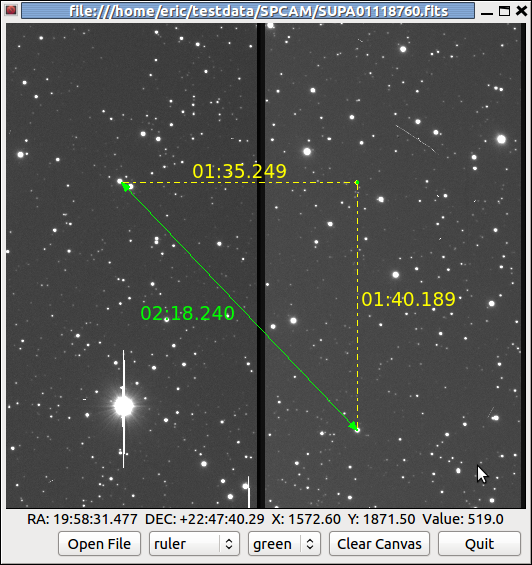
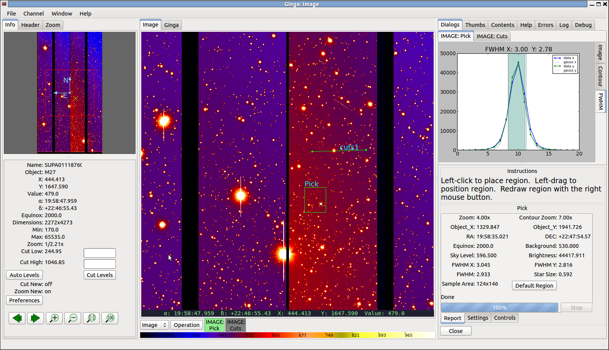
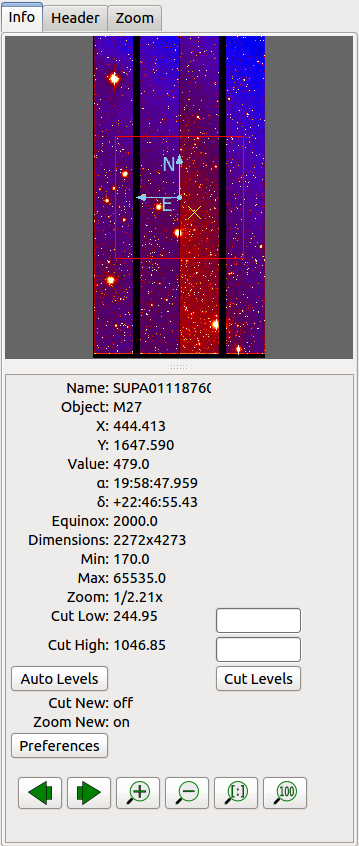
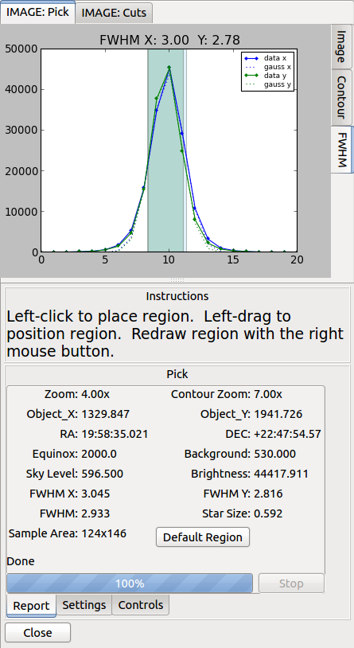
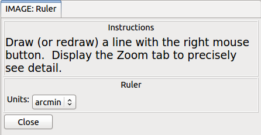

:author: Eric Jeschke
:email: eric@naoj.org
:institution: Subaru Telescope, National Astronomical Observatory of Japan

:video: http://www.youtube.com/watch?v=nZKy_nYUxCs

-----------------------------------------------------------
Ginga: an open-source astronomical image viewer and toolkit
-----------------------------------------------------------

.. class:: abstract

    Ginga is a new astronomical image viewer written in Python.  It uses and
    inter-operates with several key scientific Python packages: NumPy,
    Astropy, and SciPy.  A key differentiator for this image viewer, compared
    to older-generation FITS viewers, is that all the key components are
    written as Python classes, allowing for the first time a powerful FITS
    image display widget to be directly embedded in, and tightly coupled
    with, Python code.    
    
    We call Ginga a toolkit for programming FITS viewers because it includes
    a choice of base classes for programming custom viewers for two
    different modern widget sets: Gtk and Qt, available on the three common
    desktop platforms.  In addition, a reference
    viewer is included with the source code based on a plugin
    architecture in which the viewer can be extended with plugins
    scripted in Python.  The code is released under a BSD license
    similar to other major Python packages and is available on GitHub. 
    
    Ginga has been introduced only recently as a tool to the astronomical
    community, but since SciPy has a developer focus this talk concentrates
    on programming with the Ginga toolkit.  We cover two cases: using the
    bare image widget to build custom viewers and writing plugins for the
    existing full-featured Ginga viewer.  The talk may be of interest to
    anyone developing code in Python needing to display scientific image
    (CCD or CMOS) data and astronomers interested in Python-based quick look
    and analysis tools. 

.. class:: keywords

   FITS, viewer, astronomical, images, Python, NumPy, SciPy, Astropy

Introduction
------------

Ginga is a new astronomical image viewer and toolkit written in Python.
We call Ginga a toolkit for programming scientific image viewers [Jes12]_
because it includes a choice of base classes for programming custom
viewers for two different modern widget sets: Gtk and Qt, available on
the three common desktop platforms (Linux, Mac, and Windows).  

Ginga uses and inter-operates with several key scientific Python
packages: `NumPy`, `Astropy` and `SciPy`.  Ginga will visualize FITS [1]_
files as well as other common digital image formats and can operate on
any imaging data in NumPy array format.
Ginga components are written as Python classes, which allows the image
display widget to be directly embedded in, and tightly coupled with,
Python code.  The display widget supports arbitrary scaling and panning,
rotation, color mapping and a choice of automatic cut levels algorithms.

.. [1] Flexible Image Transport System--the current standard for archiving
       and exchanging astronomical data as files.

A reference viewer is included with the Ginga source code based on a plugin
architecture in which the viewer can be extended with plugins scripted
in Python.  Example plugins are provided for most of the features of a
"modern" astronomical FITS viewer.
Users wishing to develop an imaging program employing Ginga can follow
one of two logical development paths: starting from the widget and
building up around it, or starting from the reference viewer and
customizing it via a plugin.

Getting and installing Ginga
----------------------------
Ginga is released under a BSD license similar to other major scientific
Python packages and is available on GitHub: http://github.com/ejeschke/ginga . 
It is a `distutils`-compatible Python package, and is also available in
PyPI.  Installing it is as simple as:: 

    pip install ginga

or::

    python setup.py install

Use the latter if you have downloaded the latest source as a tarball from
http://ejeschke.github.com/ginga or cloned the git repository from
https://github.com/ejeschke/ginga.git . The package will be installed as
"ginga" and the reference viewer will also be installed as ``ginga`` (but
located wherever scripts are stored).

Prerequisites and dependences: Ginga will run under Python versions from
2.7 to 3.3.  Note that as a minimum you will need to have at least
installed ``numpy`` and one of the Python Gtk or Qt bindings (e.g. ``pygtk``,
``pyqt4``).   For full functionality you will also need ``scipy`` and
``astropy`` [Tol13]_.
Certain features in the reference viewer also be activated if
``matplotlib`` is installed.  

Part 1: Developing with the Ginga Widget
----------------------------------------

When developing with the Ginga toolkit for visualizing FITS files there
are two main starting points one might take:

- using only the Ginga widget itself, or
- starting with the full-featured reference viewer that comes with Ginga and customize it for some special purpose. 

The first way is probably best for when the developer has a custom
application in mind, needs a bare-bones viewer or wants to develop an
entirely new full-featured viewer.  The second way is probably best for
end users or developers that are mostly satisfied with the reference
viewer as a general purpose tool and want to add some specific
enhancements or functionality.  Because the reference viewer is based on
a flexible plugin architecture this is fairly easy to do.  In this paper
we address both of these approaches. 

First, let's take a look at how to use the "bare" Ginga FITS viewing
widget by itself.  The ``FitsImageZoom`` widget handles image display,
scaling (zooming), panning, manual cut levels, auto cut levels with a
choice of algorithms, color mapping, transformations, and rotation.
Besides the image window itself there are no additional GUI (Graphical
User Interface) components and these controls are handled
programatically or directly by keyboard and 
mouse bindings on the window.  Developers can enable as many of the
features as they want, or reimplement them.  The user interface bindings
are configurable via a pluggable ``Bindings`` class, and there are a
plethora of callbacks that can be registered, allowing the user to
create their own custom user interface for manipulating the view. 

.. figure:: figure1.png
   :scale: 48%
   :figclass: h

   A simple, "bare bones" FITS viewer written in Qt.   :label:`fig1`

Listing 1 shows a code listing for a simple graphical FITS
viewer using this widget (screenshot in Figure :ref:`fig1`) written in
around 100 or so lines of Python.  It creates a window containing an
image view and two buttons.  This example, included with the Ginga
package, will open FITS files dragged and dropped on the image window or
via a dialog popped up when clicking the "Open File" button.  

Looking at the constructor for this particular viewer, you can see where
we create a ``FitsImageZoom`` object.  On this object we enable automatic
cut levels (using the 'zscale' algorithm), auto zoom to fit the window
and set a callback function for files dropped on the window.  We extract
the user-interface bindings with ``get_bindings()``, and on this object
enable standard user interactive controls for panning, zooming, cut
levels and simple transformations (flip x/y and swap axes). We then
extract the platform-specific widget (Qt-based, in this case) using
``get_widget()`` and pack it into a Qt container along with a couple of
buttons to complete the viewer. 

.. code-block:: python

    #! /usr/bin/env python
    #
    # example1_qt.py -- Simple, configurable FITS viewer.
    #
    import sys, os
    import logging

    from ginga.AstroImage import pyfits
    from ginga.qtw.QtHelp import QtGui, QtCore
    from ginga.qtw.FitsImageQt import FitsImageZoom

    class FitsViewer(QtGui.QMainWindow):

	def __init__(self, logger):
	    super(FitsViewer, self).__init__()
	    self.logger = logger

	    fi = FitsImageZoom(self.logger)
	    fi.enable_autocuts('on')
	    fi.set_autocut_params('zscale')
	    fi.enable_autozoom('on')
	    fi.set_callback('drag-drop', self.drop_file)
	    fi.set_bg(0.2, 0.2, 0.2)
	    fi.ui_setActive(True)
	    self.fitsimage = fi

	    bd = fi.get_bindings()
	    bd.enable_pan(True)
	    bd.enable_zoom(True)
	    bd.enable_cuts(True)
	    bd.enable_flip(True)

	    w = fi.get_widget()
	    w.resize(512, 512)

	    vbox = QtGui.QVBoxLayout()
	    vbox.setContentsMargins(
                QtCore.QMargins(2, 2, 2, 2))
	    vbox.setSpacing(1)
	    vbox.addWidget(w, stretch=1)

	    hbox = QtGui.QHBoxLayout()
	    hbox.setContentsMargins(
                QtCore.QMargins(4, 2, 4, 2))

	    wopen = QtGui.QPushButton("Open File")
	    wopen.clicked.connect(self.open_file)
	    wquit = QtGui.QPushButton("Quit")
            self.connect(wquit,
                         QtCore.SIGNAL("clicked()"),
                         self, QtCore.SLOT("close()"))

	    hbox.addStretch(1)
	    for w in (wopen, wquit):
		hbox.addWidget(w, stretch=0)

	    hw = QtGui.QWidget()
	    hw.setLayout(hbox)
	    vbox.addWidget(hw, stretch=0)

	    vw = QtGui.QWidget()
	    self.setCentralWidget(vw)
	    vw.setLayout(vbox)

	def load_file(self, filepath):
	    fitsobj = pyfits.open(filepath, 'readonly')
	    data = fitsobj[0].data
	    # compressed FITS file?
	    if (data == None) and (len(fitsobj) > 1) \
                    and isinstance(fitsobj[1],
                         pyfits.core.CompImageHDU):
		data = fitsobj[1].data
	    fitsobj.close()

	    self.fitsimage.set_data(data)
	    self.setWindowTitle(filepath)

	def open_file(self):
	    res = QtGui.QFileDialog.getOpenFileName(self,
	                          "Open FITS file",
                                  ".",
                                  "FITS files (*.fits)")
	    if isinstance(res, tuple):
		fileName = res[0].encode('ascii')
	    else:
		fileName = str(res)
	    self.load_file(fileName)

	def drop_file(self, fitsimage, paths):
	    fileName = paths[0]
	    self.load_file(fileName)

    def main(options, args):

	app = QtGui.QApplication(sys.argv)
	app.connect(app,
                    QtCore.SIGNAL('lastWindowClosed()'),
		    app, QtCore.SLOT('quit()'))

	logger = logging.getLogger("example1")
	logger.setLevel(logging.INFO)
	stderrHdlr = logging.StreamHandler()
	logger.addHandler(stderrHdlr)

	w = FitsViewer(logger)
	w.resize(524, 540)
	w.show()
	app.setActiveWindow(w)

	if len(args) > 0:
	    w.load_file(args[0])

	app.exec_()

    if __name__ == '__main__':
	main(None, sys.argv[1:])

Scanning down the code a bit, we can see that whether by dragging and
dropping or via the click to open, we ultimately call the load_file()
method to get the data into the viewer.  As shown, load_file uses 
Astropy to open the file and extract the first usable HDU as a NumPy
data array.  It then passes this array to the viewer via the
set_data() method.  The Ginga widget can take in data either as 2D
``NumPy`` arrays, ``Astropy``/``pyfits`` HDUs or Ginga's own ``AstroImage``
wrapped images. 

   An example of a ``FitsImageCanvas`` widget with graphical overlay. :label:`fig2`

A second class ``FitsImageCanvas`` (not used in this example, but shown in
Figure :ref:`fig2`), adds scalable object plotting on top of the image
view plane.  A variety of simple graphical shapes are available,
including lines, circles, rectangles, points, polygons, text, rulers,
compasses, etc.  Plotted objects scale, transform and rotate seamlessly
with the image. 
See the example2 scripts in the Ginga package download for details.  

Part 2: Developing Plugins for Ginga
------------------------------------

   The Ginga reference viewer (Qt version), with some plugins
   active.   :label:`fig3`

We now turn our attention to the other approach to developing with
Ginga: modifying the reference viewer.
The philosophy behind the design of the reference viewer distributed
with the Ginga is that it is simply a flexible layout shell for
instantiating instances of the viewing widget described in the earlier
section.  All of the other important pieces of a modern FITS viewer--a
panning widget, information panels, zoom widget, analysis panes--are
implemented as plugins: encapsulated modules that interface with the
viewing shell using a standardized API.  This makes it easy to customize
and to add, change or remove functionality in a very modular, flexible way.

The Ginga viewer divides the application window GUI into containers that
hold either viewing widgets or plugins.  The view widgets are called
"channels" in the viewer nomenclature, and are a means of organizing
images in the viewer, functioning much like "frames" in other viewers.
A channel has a name and maintains its own history of images that have
cycled through it.  The user can create new channels as needed.  For
example, they might use different channels for different kinds of
images: camera vs. spectrograph, or channels organized by CCD, or by
target, or raw data vs. quick look, etc.  In the default layout, shown
in :ref:`fig2` the channel tabs are in the large middle pane, while the
plugins occupy the left and right panes.  Other layouts are possible, by
simply changing a table used in the startup script.

Ginga distinguishes between two types of plugin: global and local.  
Global plugins are used where the functionality is generally enabled
during the entire session with the viewer and where the plugin is active
no matter which channel is currenly under interaction with the user.
Examples of global plugins include a panning view (a small, bird's-eye
view of the image that shows a panning rectangle and allows graphical
positioning of the pan region), a zoomed view (that shows an enlarged
cutout of the area currently under the cursor), informational displays
about world coordinates, FITS headers, thumbnails, etc.  Figure
:ref:`fig4` shows an example of two global plugins occupying a notebook tab.

   Two global plugins: ``Pan`` (top) and ``Info`` (bottom), shown sharing a tab. :label:`fig4`

Local plugins are used for modal operations with images in specific
channels.  For example, the Pick plugin is used to perform stellar
evaluation of objects, finding the center of the object and giving
informational readings of the exact celestial coordinates, image
quality, etc.  The Pick plugin is only visible while the user has it
open, and does not capture the mouse actions unless the channel it is
operating on is selected.  Thus one can have two different Pick
operations going on concurrently on two different channels, for example,
or a Pick operation in a camera channel, and a Cuts (line cuts)
operation on a spectrograph channel. 
Figure :ref:`fig5` shows an example of the Pick local plugin occupying a
notebook tab. 

   The ``Pick`` local plugin, shown occupying a tab. :label:`fig5`

Anatomy of a Local Ginga Plugin
-------------------------------

Let's take a look at a local plugin to understand the API for
interfacing to the Ginga shell.  In Listing 2, we show a stub for a
local plugin.  

.. code-block:: python

    from ginga import GingaPlugin

    class MyPlugin(GingaPlugin.LocalPlugin):

	def __init__(self, fv, fitsimage):
	    super(MyPlugin, self).__init__(fv, fitsimage)

	def build_gui(self, container):
	    pass

	def start(self):
	    pass

	def stop(self):
            pass

	def pause(self):
	    pass

	def resume(self):
	    pass

	def redo(self):
	    pass

	def __str__(self):
	    return 'myplugin'

The purpose of each method is as follows.

``__init__(self, fv, fitsimage)``:
This method is called when the plugin is loaded for the  first time.
``fv`` is a reference to the Ginga shell and ``fitsimage`` is a reference to
the ``FitsImageCanvas`` object associated with the channel on which the
plugin is being invoked.  You need to call the superclass initializer
and then do any local initialization. 

``build_gui(self, container)``:
This method is called when the plugin is invoked.  It builds the GUI
used by the plugin into the widget layout passed as ``container``.
This method may be called many times as the plugin is opened and closed
for modal operations.  The method may be omitted if there is no GUI for
the plugin.

``start(self)``:
This method is called just after ``build_gui()`` when the plugin is invoked.
This method may be called many times as the plugin is opened and closed
for modal operations.  This method may be omitted.

``stop(self)``: This method is called when the plugin is stopped. 
It should perform any special clean up necessary to terminate the
operation.  The GUI will be destroyed by the plugin manager so there is
no need for the stop method to do that.  This method may be called many 
times as the plugin is opened and closed for modal operations.
This method may be omitted if there is no special cleanup required when
stopping.

``pause(self)``: This method is called when the plugin loses focus.
It should take any actions necessary to stop handling user interaction
events that were initiated in ``start()`` or ``resume()``.
This method may be called many times as the plugin is focused or defocused.
The method may be omitted if there is no user event handling to disable.

``resume(self)``: This method is called when the plugin gets focus.
It should take any actions necessary to start handling user interaction
events for the operations that it does.  This method may be called many
times as the plugin is focused or defocused.  The method may be omitted
if there is no user event handling to enable.

``redo(self)``: This method is called when the plugin is active and a new
image is loaded into the associated channel.  It can optionally redo the
current operation on the new image.  This method may be called many
times as new images are loaded while the plugin is active.
This method may be omitted.

Putting it All Together: The ``Ruler`` Plugin
---------------------------------------------

Finally, in Listing 3 we show a completed plugin for ``Ruler``.  The
purpose of this plugin to draw triangulation (distance measurement)
rulers on the image.  For reference, you may want to refer to the ruler
shown on the canvas in Figure :ref:`fig2` and the plugin GUI shown in
Figure :ref:`fig6`.   

   The ``Ruler`` local plugin GUI, shown occupying a tab. :label:`fig6`

.. code-block:: python

    from ginga.qtw.QtHelp import QtGui, QtCore
    from ginga.qtw import QtHelp

    from ginga import GingaPlugin

    class Ruler(GingaPlugin.LocalPlugin):

	def __init__(self, fv, fitsimage):
	    # superclass saves and defines some variables
            # for us, like logger
	    super(Ruler, self).__init__(fv, fitsimage)

	    self.rulecolor = 'lightgreen'
	    self.layertag = 'ruler-canvas'
	    self.ruletag = None

	    self.dc = fv.getDrawClasses()
	    canvas = self.dc.DrawingCanvas()
	    canvas.enable_draw(True)
	    canvas.set_drawtype('ruler', color='cyan')
	    canvas.set_callback('draw-event',
                                self.wcsruler)
	    canvas.set_callback('draw-down', self.clear)
	    canvas.setSurface(self.fitsimage)
	    self.canvas = canvas

	    self.w = None
	    self.unittypes = ('arcmin', 'pixels')
	    self.units = 'arcmin'

	def build_gui(self, container):
	    sw = QtGui.QScrollArea()

	    twidget = QtHelp.VBox()
	    sp = QtGui.QSizePolicy(
                     QtGui.QSizePolicy.MinimumExpanding,
		     QtGui.QSizePolicy.Fixed)
	    twidget.setSizePolicy(sp)
	    vbox1 = twidget.layout()
	    vbox1.setContentsMargins(4, 4, 4, 4)
	    vbox1.setSpacing(2)
	    sw.setWidgetResizable(True)
	    sw.setWidget(twidget)

	    msgFont = QtGui.QFont("Sans", 14)
	    tw = QtGui.QLabel()
	    tw.setFont(msgFont)
	    tw.setWordWrap(True)
	    self.tw = tw

	    fr = QtHelp.Frame("Instructions")
	    fr.layout().addWidget(tw, stretch=1,
                            alignment=QtCore.Qt.AlignTop)
	    vbox1.addWidget(fr, stretch=0,
                            alignment=QtCore.Qt.AlignTop)

	    fr = QtHelp.Frame("Ruler")

	    captions = (('Units', 'combobox'),)
	    w, b = QtHelp.build_info(captions)
	    self.w = b

	    combobox = b.units
	    for name in self.unittypes:
		combobox.addItem(name)
	    index = self.unittypes.index(self.units)
	    combobox.setCurrentIndex(index)
	    combobox.activated.connect(self.set_units)

	    fr.layout().addWidget(w, stretch=1,
                          alignment=QtCore.Qt.AlignLeft)
	    vbox1.addWidget(fr, stretch=0,
                          alignment=QtCore.Qt.AlignTop)

	    btns = QtHelp.HBox()
	    layout = btns.layout()
	    layout.setSpacing(3)
	    #btns.set_child_size(15, -1)

	    btn = QtGui.QPushButton("Close")
	    btn.clicked.connect(self.close)
	    layout.addWidget(btn, stretch=0,
                        alignment=QtCore.Qt.AlignLeft)
	    vbox1.addWidget(btns, stretch=0,
                        alignment=QtCore.Qt.AlignLeft)

	    container.addWidget(sw, stretch=1)

	def set_units(self):
	    index = self.w.units.currentIndex()
	    units = self.unittypes[index]
	    self.canvas.set_drawtype('ruler',
	                             color='cyan',
                                     units=units)
	    self.redo()
	    return True

	def close(self):
	    chname = self.fv.get_channelName(
                                     self.fitsimage)
	    self.fv.stop_operation_channel(chname,
                                     str(self))
	    return True

	def instructions(self):
	    self.tw.setText("Draw (or redraw) a line "
                            "with the right mouse "
                            "button.  Display the "
                            "Zoom tab to precisely "
                            "see detail.")
	    self.tw.show()

	def start(self):
	    self.instructions()
	    # start ruler drawing operation
	    try:
		obj = self.fitsimage.getObjectByTag(
                                 self.layertag)

	    except KeyError:
		# Add ruler layer
		self.fitsimage.add(self.canvas,
                                  tag=self.layertag)

	    self.canvas.deleteAllObjects()
	    self.resume()

	def pause(self):
	    self.canvas.ui_setActive(False)

	def resume(self):
	    self.canvas.ui_setActive(True)
	    self.fv.showStatus("Draw a ruler with "
                               "the right mouse button")

	def stop(self):
	    # remove the canvas from the image,
            # this prevents us from getting draw events
            # when we are inactive
	    try:
		self.fitsimage.deleteObjectByTag(
                                       self.layertag)
	    except:
		pass
	    self.fv.showStatus("")

	def redo(self):
	    # get the ruler object on the canvas
	    obj = self.canvas.getObjectByTag(
                                        self.ruletag)
	    if obj.kind != 'ruler':
		return True

	    # calculate and assign distances
	    text_x, text_y, text_h = \
              self.canvas.get_ruler_distances(obj.x1,
                                              obj.y1,
                                              obj.x2,
                                              obj.y2)
	    obj.text_x = text_x
	    obj.text_y = text_y
	    obj.text_h = text_h
	    self.canvas.redraw(whence=3)

	def clear(self, canvas, button, data_x, data_y):
	    self.canvas.deleteAllObjects()
	    return False

	def wcsruler(self, surface, tag):
	    # drawing callback.  The newly drawn object
            # on the canvas is tagged
	    obj = self.canvas.getObjectByTag(tag)
	    if obj.kind != 'ruler':
		return True

	    # remove the old ruler
	    try:
		self.canvas.deleteObjectByTag(
                                        self.ruletag,
                                           redraw=False)
	    except:
		pass

	    # change some characteristics of the
            # drawn image and save as the new ruler
	    self.ruletag = tag
	    obj.color = self.rulecolor
	    obj.cap = 'ball'
	    self.canvas.redraw(whence=3)

	def __str__(self):
	    return 'ruler'

This plugin shows a standard design pattern typical to local plugins.
Often one is wanting to draw or plot something on top of the image
below.  The ``FitsImageCanvas`` widget used by Ginga allows this to be
done very cleanly and conveniently by adding a ``DrawingCanvas`` 
object to the image and drawing on that.  Canvases can be layered on top
of each other in a manner analogous to "layers" in an image editing
program.  Since each local plugin maintains it's own canvas, it is very
easy to encapsulate the logic for drawing on and dealing with the
objects associated with that plugin.  We use this technique in the Ruler
plugin. When the plugin is loaded (refer to ``__init__()`` method), it
creates a canvas, enables drawing on it, sets the draw type and registers a
callback for drawing events.  When ``start()`` is called it adds that canvas
to the widget.  When ``stop()`` is called it removes the canvas from the
widget (but does not destroy the canvas).  ``pause()`` disables user
interaction on the canvas and ``resume()`` reenables that interaction.
``redo()`` simply redraws the ruler with new measurements taken from any new
image that may have been loaded.  In the ``__init__()`` method you will
notice a ``setSurface()`` call that associates this canvas with a
``FitsImage``-based widget--this is the key for the canvas to utilize WCS
information for correct plotting.
All the other methods shown are support methods for doing the ruler
drawing operation and interacting with the plugin GUI. 

The Ginga package includes a rich set of classes and there are also many
methods that can be called in the shell or in the ``FitsImageCanvas``
object for plotting or manipulating the view.  Length constraints do not
permit us to cover even a portion of what is possible in this paper.
The best way to get a feel for these APIs is to look at the source of
one of the many plugins distributed with Ginga.  Most of them are not
very long or complex.  In general, a plugin can include any Python
packages or modules that it wants and programming one is essentially
similar to writing any other Python program.

Writing a Global Plugin
-----------------------
This last example was focused on writing a local plugin.  Global plugins 
employ a nearly identical API to that shown in Listing 2, except that
the constructor does not take a ``fitsimage`` parameter, because the
plugin is expected to be active across the entire session, and is not
associated with any particular channel.  ``build_gui()`` and ``start()`` are
called when the Ginga shell starts up, and ``stop()`` is never called until
the program terminates [2]_.  ``pause()`` and ``resume()`` can safely be
omitted because they should never be called.  Like local plugins, 
``build_gui()`` can be omitted if there is no GUI associated with the plugin.
Take a look at some of the global plugins distributed with the viewer
for more information and further examples.  The ``IRAF`` plugin,
which handles IRAF/ginga interaction similarly to IRAF/ds9, is an
example of a plugin without a GUI.

.. [2] Unless the user reloads the plugin.  Most plugins in Ginga can be
       dynamically reloaded using the ``Debug`` plugin, which facilitates
       debugging tremendously, since Ginga itself does not have to be
       restarted, data does not have to be reloaded, etc.

Conclusion
----------

The Ginga FITS viewer and toolkit provides a set of building blocks for
developers wishing to add FITS image visualization to their Python-based
application, or end users interested in a Python-scriptable, extensible
viewer.  Two avenues of development are possible: a "blue sky"
approach by using a flexible ``FitsImageCanvas`` display widget and building up
around that, or by starting with the plugin-based reference viewer and
customizing by modifying or writing new plugins.  In either case, the
software can be targeted to two different widget sets (Gtk and Qt)
across the common desktop platforms that Python is available on today.
The code is open-sourced under a BSD license and is available via the
GitHub code repository or via PyPI. 

Future plans for Ginga mostly center around the development of some 
additional plugins to enhance capabilities.  Ideas suggested by users
include:  

- mosaicking of images
- simple, user-customizable pipelines for handling flat fielding, bias
  frames, dark frame subtraction, bad pixel masking, etc.
- improving the set of graphical plotting elements
- semi-transparent colored overlays, for showing masks, etc.
- improving PDF and postscript output options

References
----------
.. [Jes12] E. Jeschke, T. Inagaki and R. Kackley.
           *A next-generation open-source toolkit for FITS file image viewing*,
           Software and Cyberinfrastructure for Astronomy II,
	   Proceedings SPIE, 8451(1), 2012.

.. [Tol13] E. Tollerud and P. Greenfield and T. Robitaille.
           *The Astropy Project: A Community Python Library for Astrophysics*,
           ADASS XXII, ASP Conf Ser., TBD:(in press), 2013.

