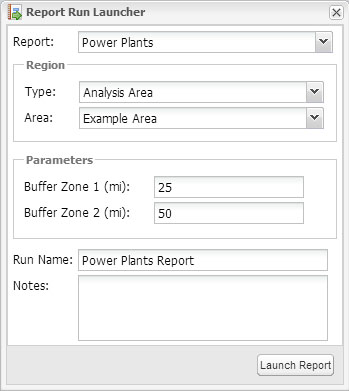
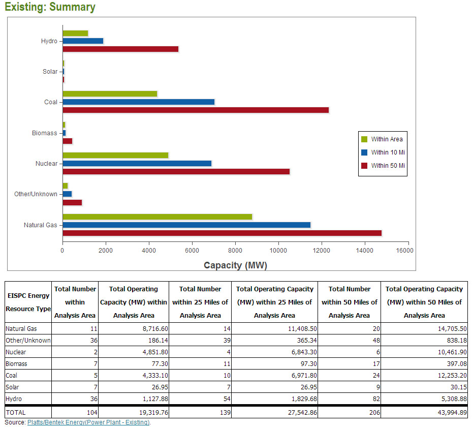

:author: James A. Kuiper
:email: jkuiper@anl.gov
:institution: Argonne National Laboratory

:author: Andrew J. Ayers
:email: aayers@anl.gov
:institution: Argonne National Laboratory

:author: Michael E. Holm
:email: mholm@anl.gov
:institution: Argonne National Laboratory

:author: Michael J. Nowak
:email: mnowak@anl.gov
:institution: Argonne National Laboratory

------------------------------------------------------------------------
Python Coding of Geospatial Processing in Web-based Mapping Applications
------------------------------------------------------------------------

.. class:: abstract

   Python has powerful capabilities for coding elements of Web-based
   mapping applications. This paper highlights examples of analytical
   geospatial processing services that we have implemented for several
   Open Source-based development projects, including the Eastern
   Interconnection States' Planning Council (EISPC) Energy Zones Mapping
   Tool (http://eispctools.anl.gov), the Solar Energy Environmental
   Mapper (http://solarmapper.anl.gov), and the Ecological Risk
   Calculator (http://bogi.evs.anl.gov/erc/portal). We used common
   Open Source tools such as GeoServer, PostGIS, GeoExt, and
   OpenLayers for the basic Web-based portal, then added custom
   analytical tools to support more advanced functionality. The
   analytical processes were implemented as Web Processing Services
   (WPSs) running on PyWPS, a Python implementation
   of the Open Geospatial Consortium (OGC) WPS. For report tools,
   areas drawn by the user in the map interface are submitted to a
   service that utilizes the spatial extensions of PostGIS to
   generate buffers for use in querying and analyzing the underlying
   data. Python code then post-processes the results and outputs
   JavaScript Object Notation (JSON)-formatted data for rendering.
   We made use of PyWPS's integration with the Geographic Resources
   Analysis Support System (GRASS) to implement flexible,
   user-adjustable suitability models for several renewable energy
   generation technologies. In this paper, we provide details about
   the processing methods we used within these project examples.

.. class:: keywords

   GIS, web-based mapping, PyWPS, PostGIS, GRASS, spatial modeling

BACKGROUND AND INTRODUCTION
---------------------------

Web-based mapping applications are effective in providing simple and
accessible interfaces for geospatial information, and often include
large spatial databases and advanced analytical capabilities. Perhaps
the most familiar is Google Maps [Ggl]_ which provides access to
terabytes of maps, aerial imagery, street address data, and
point-to-point routing capabilities. Descriptions are included
herein of several Web-based applications that focus on energy and
environmental data and how their back-end geoprocessing services
were built with Python.

The Eastern Interconnection States' Planning Council (EISPC) Energy
Zones Mapping Tool (EZMT) [Ezmt]_ was developed primarily to
facilitate identification of potential energy zones or areas of
high resource concentration for nine different low- or no-carbon
energy resources, spanning over 30 grid-scale energy generation
technologies. The geographic scope is the Eastern Interconnection
(EI), the electrical grid which serves the eastern United States and parts
of Canada. The EZMT includes over 250 map layers, a flexible
suitability modeling capability with over 35 pre-configured models
and 65 input modeling layers, and 19 reports that can be run for
user-specified areas within the EI. More background about the
project is available from [Arg13]_.

Solar Energy Environmental Mapper (Solar Mapper) [Sol]_ provides
interactive mapping data on utility-scale solar energy resources
and related siting factors in the six southwestern states studied
in the Solar Energy Development Programmatic Environmental Impact
Statement [DOI12]_. The application was first launched in December
2010, and a version that has been reengineered with open-source
components is scheduled for launch in June 2014. Solar Mapper supports
identification and screening-level analyses of potential conflicts
between development and environmental resources, and is designed
primarily for use by regulating agencies, project planners, and
public stakeholders. More details about Solar Mapper can be found
in [Sol13]_.

The Ecological Risk Calculator (ERC) [ERC]_ estimates risk in
individual watersheds in the western United States to federally listed
threatened and endangered species, and their designated critical
habitats from energy related surface and groundwater withdrawals.
The approach takes into account several biogeographical
characteristics of watersheds including occupancy, distribution, and
imperilment of species, and their sensitivity to impacts from water
withdrawals, as well as geophysical characteristics of watersheds
known to include designated critical habitats for species of concern.
The ERC is intended to help project planners identify potential
levels of conflicts related to listed species (and thus the
associated regulatory requirements), and is intended to be used
as a preliminary screening tool.

Each of these Web-based mapping applications includes both vector
(geographic data stored using coordinates) and raster (geographic
data stored as a matrix of equally sized cells) spatial data stored
in a relational database. For each application, Python was used to
add one or more custom geoprocessing, modeling, or reporting
services. The following section provides a background of the
software environment used, followed by specific examples
of code with a discussion about the unique details in each.

One of the distinctive elements of geographic data management and processing
is the need for coordinate reference systems and coordinate
transformations (projections), which are needed to represent areas on
the earth's oblate spheroid shape as planar maps, and manage data in
Cartesian coordinate systems. These references appear in the code
examples as "3857", the European Petroleum Survey Group (EPSG) Spatial
Reference ID (SRID) reference for WGS84 Web Mercator (Auxiliary Sphere)
and "102003", the USA Contiguous Albers Equal Area Conic projection
commonly used for multi-state and national maps of the United States.
These standardized EPSG definitions are now maintained by the
International Association of Oil & Gas Producers (OGP) Surveying &
Positioning Committee [OGP]_.

The Web Mercator projection has poor properties for many elements of
mapping and navigation [NGA]_ but is used for most current Web-based
mapping applications because of the wide availability of high-quality
base maps in the Web Mercator projection from providers such as Google
Maps. In the Solar Mapper project we compared area computations in the
southwestern United States using Web Mercator against the Albers Equal Area
projection and found very large discrepancies in the results (Table 1).

.. raw:: latex

   \begin{table*}

   \begin{longtable*}{|l|r|r|r|}
   \hline 
   \multirow{2}{*}{Projection} & \multicolumn{3}{c|}{Area (square miles)}\tabularnewline
   \cline{2-4} 
    & Large Horizontal Area & Large Vertical Area & Smaller Square Area\tabularnewline
   \hline 
   Albers Equal Area  & 7,498.7 & 10,847.3 & 35.8\tabularnewline
   \hline 
   Web Mercator & 13,410.0 & 18,271.4 & 63.0\tabularnewline
   \hline 
   Difference & 5,911.3 & 7,424.1 & 27.2\tabularnewline
   \hline 
   Percent Difference & 44\% & 41\% & 43\%\tabularnewline
   \hline 
   \end{longtable*}

   \caption{Comparison of Area Computations between the Web Mercator
            Projection and the Albers Equal Area Projection in the
            Southwestern United States \DUrole{label}{TABLE 1:}}

   \end{table*}

The distortion inherent in world-scale Mercator projections is easily
seen by the horizontal expansion of features, which increases
dramatically in the higher northern and southern latitudes. In
each of our projects, we chose to store local geographic data in Web
Mercator to match the base maps and increase performance. However,
for geographic processing such as generating buffers and computing
lengths and areas, we first convert coordinates to the Albers Equal
Area projection to take advantage of the improved properties of that
projection.

SOFTWARE ENVIRONMENT
--------------------

Each of these systems was built with a multi-tier architecture composed
of a Javascript/HTML (hypertext markup language) interface built on
Bootstrap [Btsrp]_, OpenLayers [OpLyr]_, and ExtJS [Sen]_; a web
application tier built on Ruby on Rails [RoR]_; a mapping tier implemented
with GeoServer [Gsrvr]_; a persistence tier implemented with PostGIS [PGIS]_;
and an analysis tier built on Python, PyWPS [PyWPS]_, GRASS [GRASS]_,
and the spatial analysis functionality of PostGIS. These systems are
deployed on Ubuntu [Ub]_ virtual machines running in a private VMware [VM]_
cloud. The Python-orchestrated analysis tier is the focus of this paper.

EXAMPLES
--------

One of the primary capabilities of each of our Web applications was using
an area selected or drawn by the user for analysis (a "footprint");
collecting vector and raster data inside, intersecting, or near the
footprint; and compiling it in a report. The first example shows the steps
followed through the whole process, including the user interface, and later
examples concentrate on refinements of the Python-coded steps.

Full Process for Footprint Analysis of Power Plant Locations Stored as Point Features
-------------------------------------------------------------------------------------

This example is from the EZMT and illustrates part of its Power Plant
report. The user draws an area of interest over the map (Figure 1) and
specifies other report parameters (Figure 2). The "Launch Report" button
submits a request to the web application server to schedule, launch,
track, and manage the reports execution.

   EZMT Interface View of User-Specified Analysis Area and Power Plant Points :label:`FIGURE 1:`

   EZMT Interface View of the Report Run Launcher. :label:`FIGURE 2:`

The web application initiates the report run by making a WPS request to
the service, which is implemented in PyWPS. The request is an XML
(extensible markup language) document describing the WPS "Execute"
operation, and is submitted via a hypertext transfer protocol (HTTP)
POST. PyWPS receives this POST request, performs some basic
validation and preprocessing, and routes the request to the custom
``WPSProcess`` implementation for that request. PyWPS then prepares the
HTTP response and returns it to the application server. The code
below illustrates the major steps used to generate the data for the
report.

We use the ``psycopg2`` library to interact with the database, including
leveraging the GIS capabilities of PostGIS.

.. code-block:: python

   # Import PostgresSQL library for database queries
   import psycopg2

The user-specified footprint corresponding to Figure 1 is hard-coded
in this example with Web Mercator coordinates specified in meters and
using Well-Known Text (WKT) format.

.. code-block:: python

   # Footprint specified in WKT with web Mercator
   # coordinates
   fp_webmerc = "POLYGON((-9152998.67 4312042.45,
     -8866818.44 4319380.41,-8866818.44 4099241.77,
     -9143214.73 4101687.75,-9152998.67 4312042.45))"
   # Input GIS data
   layer="power_plant_platts_existing"

A database connection is then established, and a cursor is created.

.. code-block:: python

   # Make database connection and cursor
   conn = psycopg2.connect(host=pg_host,
     database=pg_database, user=pg_user,
     password=pg_password)
   cur = self.conn().cursor()

Structured Query Language (SQL) is used to (1) convert the Web Mercator
footprint to the Albers Equal Area projection, (2) generate a buffer
around the Albers version of the footprint, and (3) convert that buffer
back to Web Mercator. In these sections ``ST_GeomFromText`` converts
WKT to binary geometry, and ``ST_AsText`` converts binary geometry
back to WKT. Since WKT doesnt store projection information, it is
given as a parameter in ``ST_GeomFromText``.

.. code-block:: python

   # Convert web Mercator footprint to Albers projection
   # (equal area)
   sql = "SELECT ST_AsText(ST_Transform("+
     "ST_GeomFromText('"+fp_webmerc+
     "', 3857), 102003))"
   cur.execute(sql)
   fp_albers = cur.fetchone()[0]

   # Generate Albers projection buffer around footprint
   sql = "SELECT ST_AsText(ST_Buffer("+
     "ST_GeomFromText('"+fp_albers+
     "', 102003), "+str(buffer_dist_m)+"))"
   cur.execute(sql)
   buffer_albers = cur.fetchone()[0]

   # Convert buffer to web Mercator projection
   # (rpt for second buffer)
   sql = "SELECT ST_AsText(ST_Transform("+
     "ST_GeomFromText('"+
     buffer1_albers+"', 102003), 3857))"
   cur.execute(sql)
   buffer1_webmerc = cur.fetchone()[0]

The previous steps are handled similarly for every report in an
initialization method. The final SQL statement in this example retrieves
data for the report content itself. The ``ST_Intersects`` method queries the
geometries in the power plant layer and returns the records intersecting
(overlapping) the footprint. These records are summarized [``count(*)``,
``sum(opcap)``, and ``GROUP BY energy_resource``] to provide content for the
initial graph and table in the report. This SQL statement is repeated for
the two buffer distances around the footprint.

.. code-block:: python

   # Return records falling within footprint and the
   # two buffer distances # (Repeat for two footprints)
   sql = "SELECT energy_resource,count(*),sum(opcap) "+
     "FROM "+layer+" WHERE ST_Intersects("+
     layer+".geom, ST_GeomFromText('"+fp_webmerc+
     "', 3857)) GROUP BY energy_resource "+
     "ORDER BY energy_resource"
   cur.execute(sql)
   l = []
   for row in cur:
     # Collect results in list...

Once the data have been retrieved, the code compiles it into a Python
dictionary which is rendered and returned as a JSON document (excerpt
below). This document is retained by the application for eventual
rendering into its final form, HTML with the graphs built with ExtJS.
Figure 3 shows a portion of the report.

.. code-block:: python

   # Combine data and return results as JSON.
   import json

   "existing_summary": {
       "header": [
         "EISPC Energy Resource Type",
         ...
       ],
       "data": {
         "Natural Gas": [11,8716.6,14,11408.5,20,14705.5],
         "Other/Unk": [36,186.135,39,365.335,48,838.185],
         "Nuclear": [2,4851.8,4,6843.3,6,10461.9],
         "Biomass": [7,77.3,11,97.3,17,397.08],
         "Coal": [5,4333.1,10,6971.8,24,12253.2],
         "Solar": [7,26.95,7,26.95,9,30.15],
         "Hydro": [36,1127.875,54,1829.675,82,5308.875]
       },
       "metadata": {
         "shortname": "power_plant_platts_existing",
         "feature_type": "point"
       }
     }

   Portion of EZMT Power Plant Report :label:`FIGURE 3:`

Footprint Analysis of Transmission Lines Stored as Line Features
----------------------------------------------------------------

Another EISPC report uses a user-specified footprint to analyze
electrical transmission line information; however, rather than
only listing features inside the footprint as in the previous
example, (1) in contrast to points, line features can cross the
footprint boundary; and (2) we want to report the total length
of the portion within the footprint rather than only listing
the matching records. Note that ``ST_Intersects`` is used to
collect the lines overlapping the footprint, while
``ST_Intersection`` is used to calculate lengths of only the
portion of the lines within the footprint. Also the coordinates
are transformed into the Albers Equal Area projection for the
length computation.

.. code-block:: python

   sql = "SELECT category, COUNT(*),sum(ST_Length("+
     "ST_Transform(ST_Intersection("+layer+
     ".geom,ST_GeomFromText('"+fp_webmerc+
     "', 3857)), 102003))) AS sum_length_fp "+
     "FROM "+layer+" WHERE ST_Intersects("+layer+
     ".geom,ST_GeomFromText('"+fp_webmerc+
     "', 3857)) GROUP BY category ORDER BY category"
    cur.execute(sql)
    list = []
    for row in cur:
      # Collect results in list of lists...

Results in JSON format:

.. code-block:: python

   {"existing_trans_sum": {
       "header": [
         "Voltage Category",
         "Total Length (mi) within Analysis Area",
         "Total Length (mi) within 1.0 Miles...",
         "Total Length (mi) within 5.0 Miles..."],
       "data": {
         "115kV - 161kV": [209.24, 259.38, 477.57],
         "100kV or Lower": [124.94, 173.15, 424.08],
         "345kV - 450kV": [206.67, 239.55, 393.97]
       },
       "metadata": {
         "shortname": "transmission_line_platts",
         "feature_type": "multilinestring"
       }
   }

Footprint Analysis of Land Jurisdictions Stored as Polygon Features
-------------------------------------------------------------------

In the Solar Mapper report for Protected Lands, the first section describes
the land jurisdictions within a footprint, and a 5-mile area around it,
with areas. The ``sma_code`` field contains jurisdiction types. The query below
uses ``ST_Intersects`` to isolate the features overlapping the outer buffer and
computes the areas within the buffer and footprint for each jurisdiction
that it finds for a particular report run. For the area computations,
``ST_Intersection`` is used to remove extents outside the footprint or buffer,
and ``ST_Transform`` is used to convert the coordinates to an Albers Equal Area
projection before the area computation is performed.

.. code-block:: python

   table_name = "sma_anl_090914"
   sql = "SELECT sma_code,sum(ST_Area(ST_Transform("+
     "ST_Intersection("+table_name+".geom, "+
     "ST_GeomFromText("+fp_wkt+", 3857)), 102003)))"+
     "as footprint_area"
   sql += ", sum(ST_Area(ST_Transform(ST_Intersection("+
     table_name+".geom, ST_GeomFromText("+buffer_wkt+
     ", 3857)), 102003))) as affected_area"
   sql += " FROM "+table_name
   sql += " JOIN wps_runs ON ST_Intersects("+table_name+
     ".geom, ST_GeomFromText("+buffer_wkt+", 3857))"
   sql += " AND wps_runs.pywps_process_id = "
   sql += str(procId)+" GROUP BY sma_code"
   cur.execute(sql)
   list = []
   for row in cur:
     # Collect results in list of lists...

Footprint Analysis of Watershed Areas Stored as Polygon Features, with Joined Tables
------------------------------------------------------------------------------------

The Environmental Risk Calculator [ERC]_ involves analysis of animal and plant
species that have been formally designated by the United States as threatened or
endangered. The ERC estimates the risk of water-related impacts related to power
generation. Reports and maps focus on watershed areas and use U.S. Geological
Survey watershed boundary GIS data (stored in the ``huc_8`` table in the database).
Each watershed has a Hydrologic Unit Code (HUC) as a unique identifier. The
``huc8_species_natser`` table identifies species occurring in each HUC, and the
``sensitivity`` table has further information about each species. The ERC report
uses a footprint analysis similar to those employed in the previous examples. The query
below joins the ``wps_runs``, ``huc8_poly``, ``huc8_species_natser``, and
``sensitivity`` tables to list sensitivity information for each species for a
particular report run for each species occurring in the HUCs overlapped by
the footprint. Some example results are listed in Table 2.

.. code-block:: python

   sql = "SELECT sens.species,sens.taxa,sens.status"
   sql += " FROM sensitivity sens"
   sql += " INNER JOIN huc8_species_natser spec"
   sql += " ON sens.species = spec.global_cname"
   sql += " INNER JOIN huc8_poly poly"
   sql += " ON spec.huc8 = poly.huc_8"
   sql += " INNER JOIN wps_runs runs"
   sql += " ON ST_Intersects(poly.geom,"
   sql += " ST_GeomFromText("+fp_wkt"', 3857))"
   sql += " AND runs.pywps_process_id = "
   sql += str(procId)
   sql += " group by sens.species,sens.taxa,"
   sql += "sens.status"
   cur.execute(sql)
   list = []
   for row in cur:
     # Collect results in list of lists...

.. table:: Example Ecorisk Calculator Results Listing Threatened and Endangered Species Occurring in a Watershed :label:`mtable`

   +---------------------------------------------+--------------+-------+
   | Species                                     | Taxa         |Status |
   +---------------------------------------------+--------------+-------+
   | California Red-legged Frog                  | Amphibian    | T     |
   +---------------------------------------------+--------------+-------+
   | California Tiger Salamander - Sonoma County | Amphibian    | E     |
   +---------------------------------------------+--------------+-------+
   | Colusa Grass                                | Plant        | T     |
   +---------------------------------------------+--------------+-------+
   | Conservancy Fairy Shrimp                    | Invertebrate | E     |
   +---------------------------------------------+--------------+-------+
   | Fleshy Owls clover                          | Plant        | T     |
   +---------------------------------------------+--------------+-------+

Footprint Analysis of Imperiled Species Sensitivity Stored as Raster (Cell-based) Data
--------------------------------------------------------------------------------------

Many of the layers used in the mapping tools are stored as raster (cell-based)
data rather than vector (coordinate-based) data. The ``ST_Clip`` method can
retrieve raster or vector data and returns the data within the footprint. The
``WHERE`` clause is important for performance because images in the database are
usually stored as many records, each with a tile. ``ST_Intersects`` restricts
the much more processing intensive ``ST_Clip`` method to the tiles overlapping the
footprint. When the footprint overlaps multiple image tiles, multiple records
are returned to the cursor, and results are combined in the loop.

.. code-block:: python

   list = []
   sql = "SELECT (pvc).value as val,sum((pvc).count) "+
     "FROM (SELECT ST_ValueCount(ST_Clip(rast,1, "+
     "ST_GeomFromText('"+fp_wkt"', 3857))) as pvc "+
     "FROM "+layer+" as x "+
     "WHERE ST_Intersects(rast, ST_GeomFromText('"+
     fp_wkt"',3857))) as y "+"GROUP BY val ORDER BY val"
   cur.execute(sql)
   for row in cur:
     list.append([row[0],row[1]])

Results in JSON format:

.. code-block:: python

   {
     "Imperiled Species": {
       "header": [
         "Value",
         "Count"
       ],
       "data": [
         [0.0, 21621], [10.0, 1181], [100.0, 484],
         [1000.0, 1610], [10000.0, 42]
       ],
       "metadata": {
         "shortname": "imperiled_species_area",
         "feature_type": "raster"
       }
     }

Elevation Profile along User-Specified Corridor Centerline of Using Elevation Data Stored as Raster Data
--------------------------------------------------------------------------------------------------------

The Corridor Report in the EZMT includes elevation profiles along the
user-input corridor centerline.  In this example an elevation layer is
sampled along a regular interval along the centerline. First the
coordinate of the sample point is generated with ``ST_Line_Interpolate_Point``,
then the elevation data is retrieved from the layer with ``ST_Value``.

.. code-block:: python

   d = {}
   d['data'] = []
   minval = 999999.0
   maxval = -999999.0
   interval = 0.1
   samplepct = 0.0
   i = 0.0
   while i <= 1.0:
     sql = "SELECT ST_AsText(ST_Line_Interpolate_Point("
     sql += "line, "+str(i)+")) "
     sql += "FROM (SELECT ST_GeomFromText('"+line
     sql += "') as line) As point"
     cur.execute(sql)
     samplepoint = cur.fetchone()[0]

     sql = "SELECT ST_Value(rast,ST_GeomFromText('"
     sql += samplepoint+"',3857)) FROM "+table_name
     sql += " WHERE ST_Intersects(rast,ST_GeomFromText('"
     sql+= samplepoint+"',3857))"
     cur.execute(sql)
     value = cur.fetchone()[0]
     if minval > value:
       minval = value
     if maxval < value:
       maxval = value
     d['data'].append(value)
     i+= interval
   d['min'] = minval
   d['max'] = maxval

Results:

.. code-block:: python

   "Elevation Profiles": {
     "header": [
       "From Milepost (mi)",
       "To Milepost (mi)",
       "Data"
     ],
     "data": [
       [0.0, 10.0, {
           "header": [ "Values" ],
           "data": {
             "data": [
               137.0, 135.0, 134.0,
               ...
               194.0, 190.0, 188.0
             ],
             "max": 198.0,
             "min": 131.0
           },
           "metadata": {
             "shortname": "dem_us_250m",
             "feature_type": "raster"
           }
         }
       ]
     ]
   }

Footprint Analysis of Population Density Stored as Raster Data
--------------------------------------------------------------

In this example, the input data consist of population density
values in raster format, and we want to estimate the total
population within the footprint. As in the previous example
``ST_Intersects`` is used in the ``WHERE`` clause to limit the
tiles processed by the rest of the query, and multiple records
will be output if the footprint overlaps multiple tiles. First
image cells overlapped by the footprint are collected and
converted to polygons (``ST_DumpAsPolygons``). Next, the
polygons are trimmed with the footprint (``ST_Intersection``) to
remove portions of cells outside the footprint and are converted to an
equal area projection (``ST_Transform``); and the area is computed.
Finally the total population is computed (density * area),
prorated by the proportion of the cell within the footprint.

.. code-block:: python

   sql = "SELECT orig_dens * orig_area * new_area/"+
     "orig_area as est_total "+
     "FROM (SELECT val as orig_dens,"+
     "(ST_Area(ST_Transform(ST_GeomFromText("+
     "ST_AsText(geom),3857),102003))"+
     "/1000000.0) As orig_area,(ST_Area("+
     "ST_Transform(ST_GeomFromText("+
     "ST_AsText(ST_Intersection(geom,"+
     "ST_GeomFromText('"+fp_wkt+
     "',3857))),3857),102003))/1000000.0) "+
     "as new_area "+
     "FROM (SELECT (ST_DumpAsPolygons(ST_Clip("+
     "rast,1,ST_GeomFromText('"+
     fp_wkt+"',3857)))).* "+
     "FROM "+table_name+" WHERE ST_Intersects("+
     "rast,ST_GeomFromText('"+
     fp_wkt+"',3857))) As sample) as x"
   cur.execute(sql)
   totpop = 0.0
   for row in cur:
     totpop += row[0]

Computation of Suitability for Wind Turbines Using Raster Data Using GRASS
--------------------------------------------------------------------------

The suitability models implemented in the EZMT use GRASS software
for computations, accessed in Python through WPSs. The code below
shows the main steps followed when running a suitability model in
the EZMT. The models use a set of raster layers as inputs, each
representing a siting factor such as wind energy level, land cover,
environmental sensitivity, proximity to existing transmission
infrastructure, etc. Each input layer is coded with values ranging
from 0 (Completely unsuitable) to 100 (Completely suitable) and
weights are assigned to each layer representing its relative
importance. A composite suitability map is computed using a
weighted geometric mean. Figure 4 shows the EZMT model launcher
with the default settings for land-based wind turbines with
80-meter hub heights.

Processing in the Python code follows the same steps that would
be used in the command-line interface.  First the processing
resolution is set, using ``g.region``. Then the input layers are
processed to normalize the weights to sum to 1.0 (this approach
simplifies the model computation). Next an expression is
generated, specifying the formula for the model and ``r.mapcalc``
is called to perform the model computation. ``r.out.gdal`` is used
to export the model result from GRASS format to GeoTiff for
compatibility with GeoServer, and the projection is set using
``gdal_translate`` from the GDAL plugin for GRASS.

   Land-based Wind Turbine Suitability Model Launcher in the EISPC Energy Zones Mapping Tool. :label:`FIGURE 4:`

.. code-block:: python

   # Set the processing resolution
   WPSProcess.cmd(self, "g.region res=250")

   outmap = "run"+str(self.process_run_id)
   layers = []
   weights = []
   # Calculate sum of weights
   total = 0.0
   for l in model['layers']:
     total = total + model['layers'][l]['weight']

   # Create input array of layer names, and
   # normalize weights
   for l in model['layers']:
     layers.append({
       # The reclass method applies user-specified
       # suitability scores to an input layer
       'name': self.reclass(model, l),
       'weight': model['layers'][l]['weight']/total
     })

   geometric_exp = []
   total_weight = 0.0
   for l in layers:
     total_weight = total_weight + l['weight']
     geometric_exp.append("(pow("+l['name']+","+
     str(l['weight'])+"))")
   func = "round("+
     string.join(geometric_exp, "*")+")"

   # Run model using r.mapcalc
   WPSProcess.cmd(self, "r.mapcalc "+outmap+
     "="+str(func))

   user_dir = "/srv/ez/shared/models/users/"+
     str(self.user_id)
   if not os.path.exists(user_dir):
   os.makedirs(user_dir)

   # Export the model result to GeoTIFF format
   WPSProcess.cmd(self, "r.out.gdal -c input="+
     outmap+" output="+outmap+".tif.raw"+
     " type=Byte format=GTiff nodata=255 "+
     "createopt='TILED=YES', 'BIGTIFF=IF_SAFER'")

   # Set the projection of the GeoTIFF to EPSG:3857
   WPSProcess.cmd(self,
     "gdal_translate -a_srs EPSG:3857 "+outmap+
     ".tif.raw "+user_dir+"/"+outmap+".tif")

CONCLUSIONS
-----------

Python is the de-facto standard scripting language in both the
open source and proprietary GIS world. Most, if not all of the major
GIS software systems provide Python libraries for system
integration, analysis and automation, including PostGIS, GeoServer,
GRASS, and ArcGIS. The examples in this paper include vector and raster
data, as well as code for converting projections, creating buffers,
retrieving features within a specified area, computing areas and
lengths, computing a raster-based model, and exporting raster
results in GeoTIFF format.  All examples are written in Python and
run within the OGC-compliant WPS framework provided by PyWPS.

One of the key points we make is that the Web Mercator projection
should not be used for generating buffers or computing lengths or
areas because of the distortion inherent in the projection. The
examples illustrate how these computations can be performed easily in
PostGIS. We chose to use the Albers Equal Area projection which is
commonly used for regional and national maps for the United States.
Different projections should be used for more localized areas.

So far our web-based mapping applications include fairly
straightforward analysis and modeling services. However, the same
approaches can be used for much more sophisticated applications
that tap into the abundant scientific libraries available in the
Python ecosystem.

ACKNOWLEDGEMENTS
----------------

This work was supported by the U.S. Department of Energy, Office of
Electricity Delivery and Energy Reliability; and the U.S. Department
of Interior, Bureau of Land Management, through U.S. Department of
Energy contract DE-AC02-06CH11357. The submitted manuscript has
been created by the University of Chicago as Operator of Argonne
National Laboratory ("Argonne") under contract No.
DE-AC02-06CH11357 with the U.S. Department of Energy. The U.S.
Government retains for itself, and others acting on its behalf,
a paid-up, nonexclusive, irrevocable worldwide license in said
article to reproduce, prepare derivative works, distribute copies
to the public, and perform publicly and display publicly, by or on
behalf of the Government.

.. [Arg13] Argonne National Laboratory, *Energy Zones Study: A
           Comprehensive Web-Based Mapping Tool to Identify and Analyze
           Clean Energy Zones in the Eastern Interconnection*,
           ANL/DIS-13/09, September 2013. Available at
           https://eispctools.anl.gov/document/21/file
.. [Btsrp] http://getbootstrap.com
.. [DOI12] U.S. Department of the Interior, Bureau of Land
           Management, and U.S. Department of Energy, *Final Programmatic
           Environmental Impact Statement for Solar Energy Development in
           Six Southwestern States*, FES 12-24, DOE/EIS-0403, July 2012.
           Available at http://solareis.anl.gov/documents/fpeis
.. [ERC] http://bogi.evs.anl.gov/erc/portal
.. [Ezmt] http://eispctools.anl.gov
.. [Ggl] http://maps.google.com
.. [GRASS] http://grass.osgeo.org
.. [Gsrvr] http://geoserver.org
.. [NGA] http://earth-info.nga.mil/GandG/wgs84/web_mercator/index.html
.. [OGP] http://www.epsg.org
.. [OpLyr] http://openlayers.org
.. [PGIS] http://postgis.net/docs/manual-2.0/reference.html
.. [PyWPS] http://pywps.wald.intevation.org
.. [RoR] http://rubyonrails.org
.. [Sen] http://www.sencha.com/products/extjs
.. [Sol] http://solarmapper.anl.gov
.. [Sol13] Kuiper, J., Ames, D., Koehler, D., Lee, R., and Quinby, T.,
           "Web-Based Mapping Applications for Solar Energy Project Planning,"
           in *Proceedings of the American Solar Energy Society, Solar 2013
           Conference*. Available at http://proceedings.ases.org/wp-content/uploads/2014/02/SOLAR2013_0035_final-paper.pdf.
.. [Ub] http://www.ubuntu.com
.. [VM] http://www.vmware.com
