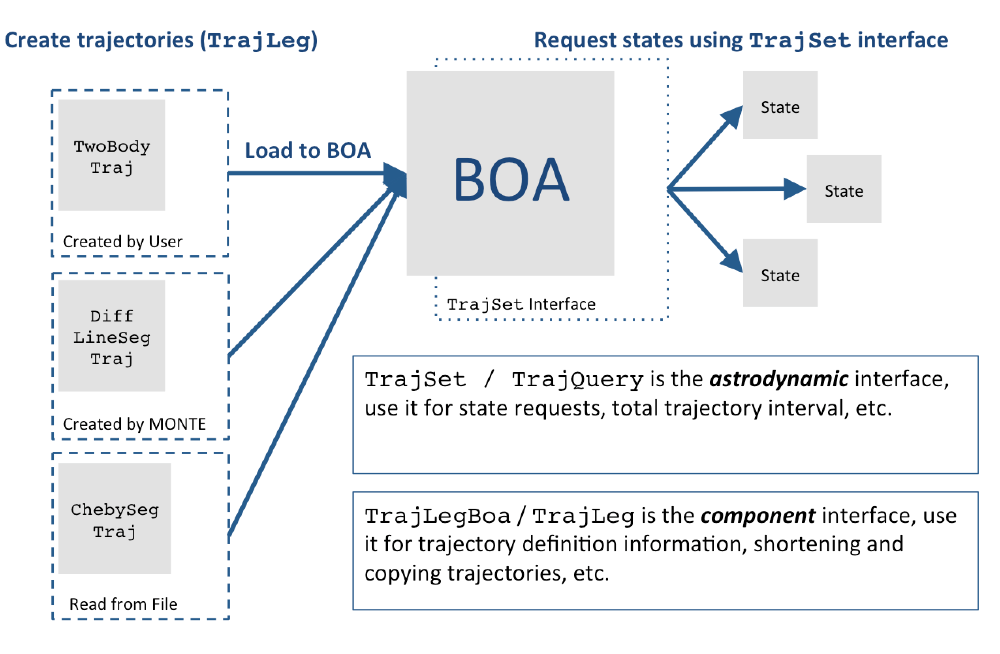
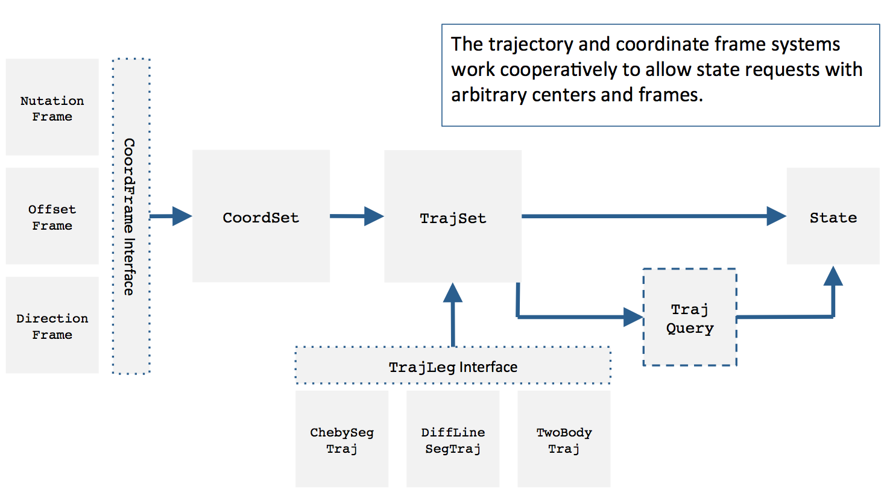
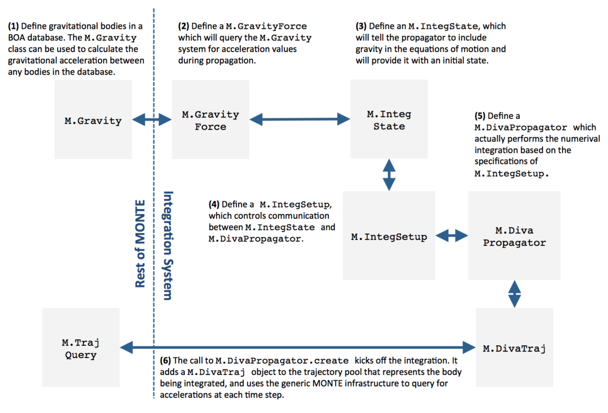
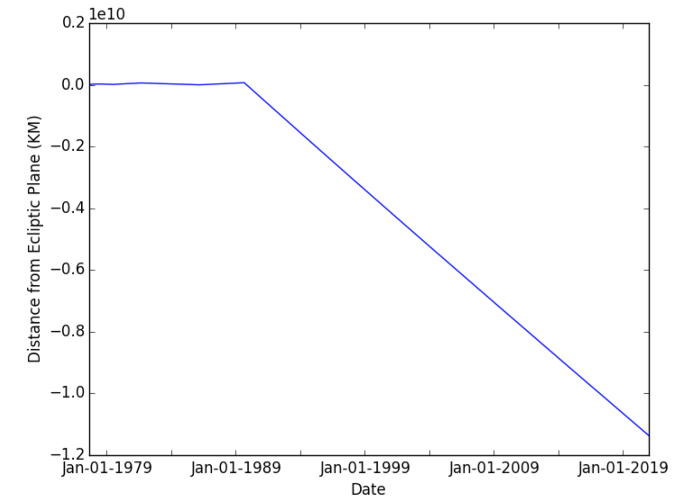

:author: Jonathon Smith, William Taber, Theodore Drain, Scott Evans,
         James Evans, Michelle Guevara, William Schulze,
         Richard Sunseri, Hsi-Cheng Wu
:email: jonathon.j.smith@jpl.nasa.gov
:institution: Jet Propulsion Laboratory,
              California Institute of Technology / NASA
:corresponding:

--------------------------------------
MONTE Python for Deep Space Navigation
--------------------------------------

.. class:: abstract

The Mission Analysis, Operations, and Navigation Toolkit Environment
(MONTE) is the Jet Propulsion Laboratory's (JPL) signature astrodynamic
computing platform. It was built to support JPL's deep space exploration
program, and has been used to fly robotic spacecraft to Mars, Jupiter,
Saturn, Ceres, and many solar system small bodies. At its core, MONTE
consists of low-level astrodynamic libraries that are written in C++,
and presented to the end user as an importable Python language module.
These libraries form the basis on which Python-language applications
are built for specific astrodynamic applications, such as trajectory
design and optimization, orbit determination, flight path control, and
more. The first half of this paper gives context to the MONTE project
by outlining its history, the field of deep space navigation and where
MONTE fits into the current Python landscape. The second half gives
an overview of the main MONTE libraries and provides a narrative
example of how it can be used for astrodynamic analysis. **For
information on licensing MONTE and getting a copy visit**
`montepy.jpl.nasa.gov <http://montepy.jpl.nasa.gov/>`_ **or
email** mdn_software@jpl.nasa.gov.

.. class:: keywords

   astrodynamics, aerospace, orbit, trajectory, JPL, NASA

History
-------

The United States began its reconnaissance of the solar system in the
early 1960s. As NASA developed new technologies to build and operate
robotic probes in deep space, JPL was working out how to guide those
probes to their destinations. In order to fly spacecraft to Mars or
Jupiter, engineers needed a way to model their trajectories through
interplanetary space. This was partly a problem of **astrodynamics**, a
field of study that mathematically describes how man-made objects move
through space. It was also a problem of computation because
engineers needed a way to solve these complex astrodynamic
equations for real spacecraft. Beyond modeling the motion of spacecraft,
engineers needed a way to measure the location of spacecraft
over time so they could make informed corrections to their models. They
also needed a way of designing engine burns, or maneuvers, that would
nudge a wayward probe back on course.

These efforts, collectively known as *deep space navigation*,
quickly became coupled with software and computing. The first
programs JPL wrote to navigate spacecraft were written on punch-cards
and processed through an IBM 7090 mainframe. [Eke05]_ Advances in
computing technology were eagerly consumed by navigators, as more
storage and faster processing meant the models used to fly spacecraft
could be made increasingly detailed and sophisticated.

Starting in 1964, a group of engineers, led by Ted Moyer, began
developing the astrodynamic algorithms and software that would
eventually become the Double Precision Trajectory and Orbit
Determination Program, or DPTRAJ/ODP ([Moy71]_, [Moy03]_). Over its
forty-plus years of active life, JPL engineers used the DPTRAJ/ODP to
navigate the "Golden Age" of deep space exploration. This included the
later Mariner and Pioneer Missions, Viking, Voyager, Magellan, Galileo,
Cassini and more. Also over this time, its base language moved through
Fortran IV, Fortran V, Fortran 77 and Fortran 95 as the computational
appetites of navigators grew ever larger.

By 1998 it was clear that the aging DPTRAJ/ODP needed to be updated
once again. Rather than initiate another refactor of the DPTRAJ/ODP,
JPL's navigation section commissioned a new effort that would
depart from its predecessor in two important ways. First, the new
software would be an object-oriented library, written in C++ and
exposed to the user as a Python-language library. Second, it would
be a general-purpose astrodynamic computing platform, not a dedicated
navigation program like the DPTRAJ/ODP. The goal was to create a single
library that could be used for astrodynamic research, space mission
design, planetary science, etc., in addition to deep space navigation.
This new project was affectionately named the Mission Analysis,
Operations, and Navigation Toolkit Environment, or MONTE-Python for
short.

Throughout the first half of the 2000s, MONTE was carefully constructed
by reshaping the algorithms under-pinning the DPTRAJ/ODP into a
rigorously tested and well documented object-oriented software package.
In 2007, MONTE had its first operational assignment navigating NASA's
Phoenix lander to a successful encoutner with Mars. Since 2012, MONTE
has powered all flight navigation services at JPL, including the
Cassini extended mission, Mars Science Laboratory, MAVEN, GRAIL, Dawn,
Mars Reconnaissance Orbiter, Juno, and more. [Eva16]_

Deep Space Navigation
---------------------

.. figure:: figures/cassinitour.png

    Illustration of Cassini's reference trajectory at Saturn. The
    mission designers built this trajectory, and the orbit determination
    and maneuver design teams keep the spacecraft flying on these orbits
    during the mission. :label:`tour`

At JPL, the practice of navigating robotic probes in deep space is
broken down into three interrelated disciplines: (1) designing a
reference trajectory which describes the planned flight path of the
spacecraft (*mission design*), (2) keeping track of the
spacecraft position while the mission is in flight (*orbit
determination*), and (3) designing maneuvers to bring the spacecraft
back to the reference trajectory when it has strayed (*flight path
control*, Figure :ref:`tour`).

The process of designing a spacecraft reference trajectory begins at
the earliest stages of mission planning. Navigators work closely
with mission science teams to put together a reference orbit that
allows the spacecraft to take all the desired science measurements.
They also work with mission planners and spacecraft system engineers
to make sure that the spacecraft is able to withstand the rigors of
its planned trajectory. Through a process of increasingly detailed
iterations, a process which often takes years, the mission reference
trajectory is produced. This reference trajectory serves as the flight
plan for the spacecraft. It will be up to the orbit determination and
flight path control teams to make sure the spacecraft follows
this flight plan when the spacecraft finally launches.

The job of the orbit determination team is to keep track of where the
spacecraft has been (orbit reconstruction), where it is currently
(orbit determination), and where it will go in the future (orbit
prediction). The spacecraft is always drifting away from its planned
flight path because of small disturbances it encounters in space. Even
the slight pressure of sunlight on the spacecraft can add up over time
and push a mission off course. The trajectory designers do their best
to account for these disturbances when creating the reference orbit,
but there is no accounting for the randomness and unpredictability of
the real world. To further complicate matters, once the spacecraft
leaves the launch-pad, it can no longer be directly observed. Orbit
determination analysts must process various forms of tracking data that
are tied mathematically to the evolution of the spacecraft orbit to
determine its position at any given time.

Once the orbit determination team has a good estimate for the current
location of the spacecraft, the flight path control team is responsible
for evaluating how far the spacecraft has drifted from the reference
trajectory and designing a maneuver to get the spacecraft back on
course. The result of this maneuver design is a :math:`\Delta V` vector,
which stands for delta-velocity or change in velocity. This
:math:`\Delta V` vector represents the direction and magnitude of the
required change in the spacecraft velocity which must be accomplished
to get the spacecraft back on course. Once in hand, this
:math:`\Delta V` vector will be sent to the spacecraft propulsion team,
who will decompose it into thruster firings on the spacecraft.
These will be uplinked to the spacecraft, which will then perform the
maneuver.

After a maneuver has been performed, the cycle repeats. Perhaps the
thrusters were slightly misaligned or the engine cutoff was a second
too late. The orbit determination team must examine more tracking data
to find out. This iterative relationship between orbit determination and
flight path control continues without pause through the lifetime of a
flight mission. The spacecraft is constantly wandering off, and must
be patiently brought back on course.

MONTE as a Platform
--------------------

As previously mentioned, MONTE was built to be a general purpose
astrodynamic computing platform, not a dedicated navigation
application. It supplies the models and computational algorithms needed
for trajectory design, orbit determination and flight path control
but doesn't force the end-user into any specific workflow or
interface. As a result, before MONTE can be used on a flight mission,
it must be *deployed* for that mission. This entails using MONTE in
cooperation with other applications and libraries to assemble a custom
navigation framework.

The process of deploying MONTE for a flight mission can be quite
involved. The effort to build a navigation system for the Cassini
Extended Mission took over two years, and required the use of many
other Python libraries in addition to MONTE. The resulting navigation
framework can not be properly characterized as MONTE itself. Rather, it
is a custom application built using the MONTE library to perform
navigation for that specific mission.

This is important to note because it illustrates the way in which
MONTE is likely to be useful to those outside JPL. Deep space
navigation is (not yet at least) a high-demand field. The majority
of astrodynamic computing occurs in other contexts such as
Earth-centered navigation (weather and communication satellites, etc),
collision avoidance analysis (making sure two spacecraft don't collide),
cooperative rendezvous (docking a cargo-ship to the
International Space Station) and non-cooperative rendezvous (capturing
a malfunctioning satellite), etc. Much the same way that MONTE
can be configured and deployed for deep space navigation, it can
also be brought to bear on these and other problems across the
aerospace industry.

MONTE provides a solid foundation of core systems that make it
attractive as a general purpose astrodynamic platform. These include
models for trajectories and trajectory queries, coordinate frames and
rotations, high-precision time, astrodynamic event searches, numerical
integrators, configurable optimizers, and many more. By starting with
MONTE, a user can focus on solving the problem at hand, and
leave the important-but-incidental infrastructure to MONTE.

MONTE and the Python Ecosystem
------------------------------

MONTE has a decidedly friendly stance when it comes to working with
other libraries in the Python scientific computing stack. It makes
heavy use of many open-source Python libraries such as matplotlib and
IPython (Jupyter), and reciprocally tries to make it easy for users
of these systems to interface with MONTE. Many of MONTE's classes
can transform themselves into NumPy data types - a common pattern is
for MONTE classes to have a ``.toArray`` method which returns a
``numpy.ndarray``. Additionally, the MONTE team has a history of
collaboration with matplotlib dating all the way back to the early
2000s. They have contributed code that makes matplotlib able to
natively plot MONTE's unit and time systems, and have also
open-sourced a custom matplotlib styling-system
(`github.com/nasa/mplStyle <https://github.com/nasa/mplStyle>`_)
developed in house.

The MONTE project started in 1998 at a time when the Python language
was still relatively new. As a result, MONTE has several custom systems
that are redundant in the current Python landscape. For instance, MONTE
developed an interactive shell similar to IPython (although it has
largely been deprecated in favor of IPython) and has several numerical
computing classes that would generally be dispatched to NumPy in a
brand new project.

Historical quirks aside, MONTE considers itself a member of
the Python scientific programming community and aims to integrate
as seamlessly as possible with other Python libraries. It can be
embedded in custom GUI applications, run on a back-end server,
executed in parallel across a cluster of nodes, and pretty much
anything else you would expect of a dynamic, well constructed
Python library.

Library Overview
----------------

Most of the functionality of MONTE is encapsulated in the ``Monte`` and
``mpy`` libraries. ``Monte`` is written in C++ and wrapped in Python.
It is presented to the end user as a normal, importable Python-language
module. The ``mpy`` module is written entirely in Python and contains
higher level applications built using ``Monte`` and other Python
libraries.

Convention is to import the main ``Monte`` library as ``M``. Throughout
this paper, if a class is referred to with the prefix ``M.``, it means
this class belongs to the main MONTE library (e.g. ``M.TrajLeg``,
``M.Gm``, etc). The following example shows a simple script using the
``Monte`` and mpy libraries to get the state of the Cassini spacecraft
with respect to Saturn at the time of its Saturn Orbit Insertion (SOI)
burn. [#]_ [#]_

.. [#] All MONTE code in this paper is current as of the v121 delivery.

.. [#] Saturn Orbit Insertion was a spacecraft maneuver that occurred
       as Cassini approached Saturn. It changed the course of the
       spacecraft so that instead of flying past Saturn, it captured
       into orbit around the planet.

.. code-block:: python

    import Monte as M
    import mpy.io.data as defaultData

    # Set up a project BOA database, and populate it
    # with astrodynamic data from default data
    boa = defaultData.load([ "time", "body", "frame",
      "ephem/planet/de405"])

    # Load the Saturn satellite ephemeris and Cassini
    # trajectory into our BOA database
    boa.load("saturn_satellites.boa")
    boa.load("cassini_trajectory.boa")

    # Define time of SOI
    soiTime = M.Epoch("01-JUL-2004 02:48:00 UTC")

    # Get the trajectory manager from the BOA database
    tset = M.TrajSetBoa.read(boa)

    # Request the state of Cassini at SOI from the
    # trajectory manager in a Saturn-centered Earth
    # Mean Orbit of 2000 coordinate frame
    casAtSoi = tset.state(soiTime, "Cassini", "Saturn",
      "EMO2000")

Several of MONTE's core systems --- the basic astrodynamic scaffolding
that supports its more advanced functionality --- are used in the above
example. These are explained in a short tour of MONTE below.

BOA
^^^

The Binary Object Archive (BOA) is MONTE's primary data management
system. Most MONTE classes that define concrete objects (for instance,
``M.Gm`` which defines the standard gravitational parameter for a
natural body or ``M.FiniteBurn`` which defines a spacecraft burn)
are stored in BOA, and accessed by MONTE's astrodynamic functions from
BOA.

BOA is based on the binary `XDR <http://www.rfc-base.org/rfc-4506.html>`_
data format, which allows data to be
written-to and read-from binary on different operating systems and
using different transport layers (e.g. you can read and write locally
to your hard disk, or over a network connection).

The role that BOA plays in MONTE can perhaps be best understood as
"defining the universe" on which MONTE's astrodynamic tools operate.
In our example, we populated our "model universe" (e.g. our BOA
database) with time systems, natural body data, a planetary ephemeris,
the Cassini spacecraft trajectory, etc. We then asked MONTE's trajectory
manager (an astrodynamic tool) to examine this particular universe and
return the state of Cassini with respect to Saturn.

Default Data
^^^^^^^^^^^^

A standard MONTE installation comes with a collection of predefined,
publicly available astrodynamic datasets (the "default data depot").
These can be accessed and loaded into a BOA database via MONTE's
default data loader (``mpy.io.data``) and serve to help an analyst get a
"model universe" up and running quickly.

Time and Units
^^^^^^^^^^^^^^

In the astrodynamic community there are multiple time systems used
to describe the dynamics of a spacecraft and to specify the time of an
observation. While necessary, multiple systems for specifying time
can add considerable complexity to software.  In MONTE, time
is encapsulated in the ``M.Epoch`` class, which supports time
definition in the TDB, TT, TAI, GPS, UTC, and UT1.  This class handles
the problem of transforming times between different frames thereby
allowing the user to specify times in the most convenient form for
their application.

MONTE's unit system supports the notions of time, length, mass, and
angle. It has implemented operator overloading to allow unit
arithmetic, e.g. dividing a unit length by a unit time results in unit
velocity. Most functions that accept unit-quantities also check their
inputs for correctness, so supplying a unit length to a function that
expects unit time will raise an exception.

Trajectories
^^^^^^^^^^^^

MONTE models spacecraft and natural body trajectories in a number of
underlying formats; most of the differences involve how many data
points along the trajectory are stored, and how to
interpolate between these points. In addition, MONTE provides
conversion routines which allow some external trajectory formats to
be read and written (including NAIF "bsp" files, international "oem"
files).

The ``M.TrajSet`` class is MONTE's trajectory manager, and is
responsible for coordinating state requests between all of the
trajectories loaded into a given BOA database. It has access to
the coordinate frame system (described in the next section) allowing
it to make coordinate frame rotations when doing state queries. In fact,
most coordinate frame rotations in MONTE are accomplished by simply
requesting a state from ``M.TrajSet`` in the desired frame.

The general steps for building and using trajectories in MONTE are
illustrated in Figure :ref:`trajfig`.

   Dataflow through MONTE's trajectory system :label:`trajfig`

Coordinate Frames
^^^^^^^^^^^^^^^^^

The MONTE trajectory and coordinate frame systems are very analogous
and have a tight integration that enables powerful state requests.
Figure :ref:`trajcoordfig` illustrates these similarities and how the
two systems are integrated.

MONTE models coordinate frames in a number of underlying formats and
provides conversion routines which allow some external coordinate
frame formats to be read and written (including
NAIF "ck" files).

   Cooperation between MONTE's trajectory and coordinate frame systems :label:`trajcoordfig`

Event Finding
^^^^^^^^^^^^^

MONTE allows a user to search through astrodynamic relationships in a
given BOA database in pursuit of particular events. For instance, the
``M.AltitudeEvent`` class allows a user to search for when a spacecraft
is within a certain altitude range from another body.

Numerical Integration
^^^^^^^^^^^^^^^^^^^^^

MONTE provides a framework for numerically integrating spacecraft and
natural body trajectories, subject to a set of force models such
as gravity, solar radiation pressure, atmospheric drag, etc. The
resulting trajectory has the Cartesian position and velocity of the
body over time, and optionally the partial derivatives of state
parameters with respect to parameters in the force models. A
walk-through of setting up MONTE's numerical integration system for a
simple gravitational propagation is shown in Figure :ref:`integfig`.

In addition to trajectories, MONTE also allows numerical integration
of mass (for instance due to burning of propellant), coordinate frames
(rigid body dynamics), time (relativistic time transformations) and
user-defined ordinary differential equations.

   Overview of MONTE's numerical integration system. :label:`integfig`

Parameters and Partial Derivatives
^^^^^^^^^^^^^^^^^^^^^^^^^^^^^^^^^^

MONTE's parameter system supports the calculation of partial
derivatives for astrodynamic variables, which can then be used in
optimization and estimation. Every variable that belongs to the
parameter system is responsible for not only calculating its value,
but also its partial derivative with respect to any other parameters.
These partial derivatives are contained in a special set of classes
that employ operator overloading to correctly combine partial
derivatives under various mathematical operations. [Smi16]_

Example: Exploring bodies in motion
-----------------------------------

Generally, MONTE is scripted or assembled into custom applications
that solve complex end-user problems. However, it is also useful as an
off-the-cuff tool to explore astrodynamic relationships as we will see
in the narrated example below.

For this example, we will explore the Voyager 2 trajectory. We will
identify the time and distance of the Uranus planetary encounter, and
also find the time periods where Voyager 2 was in line with the sun.
was in solar conjunction. Along the way we will highlight various
aspects of MONTE's core systems. Also, if our exploration happens to
turn up anything interesting (it will), we will take some time to
investigate what we find.

Voyager 2 Trajectory
^^^^^^^^^^^^^^^^^^^^

We begin by specifying the model of the solar system during Voyager's
mission.  This is done by creating a BOA database and loading the
default data sets for planetary ephemerides (the trajectories of all
the planets in the solar system), coordinate frames, and body
parameters like mass and shape. We will also load in our Voyager 2
trajectory. [#]_

.. [#]
    JPL hosts two excellent websites for accessing trajectory data for
    natural solar system bodies and deep-space probes. The Horizons
    website (http://ssd.jpl.nasa.gov/horizons.cgi) is maintained by
    JPL's Solar System Dynamics group and has an expansive and
    powerful webapp for getting ephemerides in a variety of formats.
    The Navigation and Ancillary Data Facility (NAIF) at JPL hosts the
    navigation section of NASA's Planetary Database System. At its
    website (http://naif.jpl.nasa.gov/naif/data.html), you will find a
    host of downloadable binary navigation files, which can be used
    with the SPICE toolkit, and of course, with MONTE.

    For the following examples, we will be using the Voyager 2
    spacecraft trajectory, which can be downloaded at
    http://naif.jpl.nasa.gov/pub/naif/VOYAGER/kernels/spk/. The file
    name at the time of this writing is
    "voyager_2.ST+1992_m05208u.merged.bsp", which we will shorten to
    just "voyager2.bsp" for ease of use.

.. code-block:: python

   In [1]: import Monte as M
   In [2]: import mpy.io.data as defaultData
   In [3]: boa = M.BoaLoad()
   In [4]: defaultData.loadInto( boa,
      ...:   ["ephem/planet/de405", "frame", "body"] )
   In [5]: boa.load( "voyager2.bsp" )

The trajectories of Voyager and the natural bodies of the solar system
are coordinated by the trajectory manager (``M.TrajSet``) that is
supplied by BOA we just created. We can retrieve the trajectory manager
using its BOA accessor ``M.TrajSetBoa``. Every object that resides in
BOA has an accessor (often named ``M.ClassNameBoa``) that allows it to
be read to and from the database. Once in hand, we can list all
the trajectories that are on the BOA using the ``M.TrajSet.getAll``
method.

.. code-block:: python

   In [6]: tset = M.TrajSetBoa.read( boa )
   In [7]: tset.getAll()
   Out[7]: ['Mercury', 'Mercury Barycenter',
            'Venus', 'Venus Barycenter',
            'Earth', 'Earth Barycenter', 'Moon',
            'Mars', 'Mars Barycenter',
            'Jupiter Barycenter', 'Saturn Barycenter',
            'Uranus Barycenter', 'Neptune Barycenter',
            'Pluto Barycenter', 'Sun'
            'Solar System Barycenter', 'Voyager 2']

The list of bodies returned by ``M.TrajSet.getAll`` confirms that we
have successfully loaded our solar system and spacecraft.
We continue our analysis by checking the span of the Voyager 2
trajectory, e.g. the interval over which we have data, using the
``M.TrajSet.totalInterval`` method. *Note that if the trajectory has
been updated at the NAIF PDS website, the exact span you get may be
different than what is listed below.*

.. code-block:: python

   In [8]: tset.totalInterval( "Voyager 2" )
   Out[8]:
   TimeInterval(
      [ '20-AUG-1977 15:32:32.1830 ET',
        '05-JAN-2021 00:00:00.0000 ET' ],
   )

The Voyager 2 trajectory starts just after launch in 1977, extends
through the present, and has predictions out into the future. We can
use the trajectory manager to request states at any time in this
window. For instance, we can find the distance of Voyager 2 from Earth
right now. The ``M.Epoch.now`` static method returns the current time
and this can be passed to the trajectory manager to request the state of
Voyager 2 with respect to Earth.

.. code-block:: python

   In [11]: currentTime = M.Epoch.now()
   In [12]: vygrTwoNow = tset.state(currentTime,
       ...:   "Voyager 2", "Earth", "EME2000" )
   In [13]: vygrTwoNow
   Out[13]:
   State (km, km/sec)
   'Earth' -> 'Voyager 2' in 'EME2000'
   at '06-JUN-2014 19:58:35.1356 TAI'
   Pos:  4.358633010242671e+09 -7.411125552099214e+09
        -1.302731854689579e+10
   Vel: -2.415141211951430e+01  2.640692963340520e+00
        -1.128801136174438e+01

We used the ``M.TrajSet.state`` method to perform our query, which
required us to specify the time, target body, reference body, and
coordinate frame for the return state. Because ``M.TrajSet`` has a
global view of all the trajectories in our BOA, we can request states
with respect to any body for which we have a trajectory, for instance
Venus or Neptune.

.. code-block:: python

   In [14]: vygrTwoNowVenus = tset.state( currentTime,
       ...:   "Voyager 2", "Venus", "EME2000" )
   In [15]: vygrTwoNowVenus
   Out[15]:
   State (km, km/sec)
   'Venus' -> 'Voyager 2' in 'EME2000'
   at '06-JUN-2014 19:58:35.1356 TAI'
   Pos:  4.216416788778397e+09 -7.523453172910529e+09
        -1.306899257275581e+10
   Vel: -4.457126033807687e+00 -3.509301445530399e+01
        -2.760459587874612e+01

   In [17]: vygrTwoNowNeptune = tset.state(currentTime,
       ...:   "Voyager 2", "Neptune Barycenter", "EME2000" )
   In [18]: vygrTwoNowNeptune
   Out[18]:
   State (km, km/sec)
   'Neptune Barycenter' -> 'Voyager 2' in 'EME2000'
   at '06-JUN-2014 19:58:35.1356 TAI'
   Pos:  2.423407540346480e+08 -5.860459060720786e+09
        -1.229435420991246e+10
   Vel:  2.036299646730726e+00 -8.760646249684767e+00
        -1.606470435709401e+01

The ``M.TrajSet.state`` method returns an ``M.State`` object.
``M.State`` captures the relative position, velocity and acceleration
(or some subset) of one body with respect to another at a given time.
It has a number of methods that help with extracting and transforming
the information it contains. For instance, we can find the distance
from Earth to Voyager 2 like this.

.. code-block:: python

   In [26]: vygrTwoPoskm = vygrTwoNow.posMag()
   In [27]: vygrTwoPoskm
   Out[27]:  1.560876331389678e+10 * km

   In [28]: vygrTwoPoskm.convert( 'AU' )
   Out[28]: 104.33813824888766

When reading states from a trajectory you are often interested in
making repeated calls for the same body and center but at several
different times. ``M.TrajSet`` works fine for this application, but
if the target and center bodies don't change on repeated calls, some
optimizations can be made for better performance. The ``M.TrajQuery``
class is provided for this use case, and can be thought of as simply a
special case of ``M.TrajSet`` where the body and center are fixed for
every call.

.. code-block:: python

   In [29]: vygrTwoQuery =  M.TrajQuery( boa,
       ...:   "Voyager 2", "Earth", "EME2000" )
   In [31]: vygrTwoQuery.state( currentTime )
   Out[31]:
   State (km, km/sec)
   'Earth' -> 'Voyager 2' in 'EME2000'
   at '06-JUN-2014 19:58:35.1356 TAI'
   Pos:  4.358633010242671e+09 -7.411125552099214e+09
        -1.302731854689579e+10
   Vel: -2.415141211951430e+01  2.640692963340520e+00
        -1.128801136174438e+01

This can be useful when you are sampling states from a trajectory,
for instance, to create a plot of an orbit.

Uranus Encounter
^^^^^^^^^^^^^^^^

We said earlier that ``M.TrajSet`` and ``M.CoordSet``, in their roles
as manager classes, have a global view of the trajectory and
coordinate systems. This high-level perspective allows them to work
with the *relationships* between different bodies and frames, a
capability we have so far used to get relative states between bodies.
However, there are certain specific relationships between bodies and
frames that can be of particular interest to an analyst. For instance,
identifying the time at which two bodies achieve their closest approach
(periapse) and the magnitude of that minimum distance can be an
important astrodynamic metric. We can certainly estimate these
quantities using trajectory queries, perhaps by plotting the relative
distance between two bodies and looking for the local minima.
However, MONTE provides tools for searching through various
relationship-spaces and identifying some of these key events.
The ``M.EventSpec`` set of classes allow us to define a particular
event type then search through the requisite relationships to
identify specific occurrences. The ``M.Event`` class is used to
report the relevant data associated with an occurrence.

Continuing the example, we will use ``M.ApsisEvent`` (which is a
specific type of ``M.EventSpec``) to find the precise time and
distance of Voyager 2's closest approach with Uranus.

.. code-block:: python

   In [6]: vygrTwoUranusQuery = M.TrajQuery( boa,
      ...:   "Voyager 2", "Uranus Barycenter", "EME2000" )
   In [7]: apsisSearch = M.ApsisEvent( vygrTwoUranusQuery,
      ...:   "PERIAPSIS" )

``M.ApsisEvent`` takes as its first argument an ``M.TrajQuery``
instance that is configured to return the state of our target body with
respect to the desired center (in this case, Voyager 2 with respect to
Uranus). The second argument specifies what type of apsis we are
looking for; this can be "PERIAPSIS", "APOAPSIS", or the catch-all
"ANY". Once the event type is defined, the ``M.ApsisEvent.search``
method can be called to perform the search and locate the apses.
To call this method we need to provide a time interval to search over
and a search step size.

.. code-block:: python

   In [14]: searchInterval = M.TimeInterval(
       ...:   "01-JAN-1986 ET", "01-JAN-1987 ET" )
   In [15]: stepSize = 60 * sec
   In [16]: foundEvents = apsisSearch.search(
       ...:   searchInterval, stepSize )

The result of the search, which we have saved in the variable
``foundEvents``, is an ``M.EventSet`` container class. This container
has all the events found matching our specification in the search
window. ``M.EventSet`` has a number of useful methods for
sorting, filtering and returning events. In this case there
should only be one event returned since there was only one closest
approach of Voyager 2 to Uranus. We can read out this event by
indexing into the ``M.EventSet``.

.. code-block:: python

   In [17]: foundEvents.size()
   Out[17]: 1

   In [18]: uranusPeriapse = foundEvents[0]
   In [19]: uranusPeriapse
   Out[19]:
   Event:
   Spec : Periapsis Uranus Barycenter to Voyager 2
   Type : Periapsis
   Epoch: 24-JAN-1986 17:59:45.6473 ET
   Value:  1.071300446056250e+05 * km

Another relationship which can play a significant role in deep space
missions is the angular offset between the Earth-Sun line and
Earth-Spacecraft line (often referred to as the Sun-Earth-Probe (SEP)
angle). At low SEP values, the spacecraft appears very close to the
Sun from the vantage of Earth, requiring radio transmissions from Earth
to pass through the near-solar environment before reaching the
spacecraft. Flight projects avoid critical mission operations during
these times because the highly-charged solar atmosphere can interfere
with radio signals.

We can set up an event search to find periods of low-SEP for Voyager 2,
from mission start through the end of our trajectory data, using
the ``M.AngleEvent`` event specification class.

.. code-block:: python

   In [20]: sepSearch = M.AngleEvent(boa, "Sun", "Earth"
       ...:   "Voyager 2", 12 *deg, "BELOW")
   In [23]: searchWindow = tset.totalInterval("Voyager 2")
   In [25]: foundEvents = sepSearch.search(searchWindow,
       ...:   1 *hour)

We constructed our ``M.AngleEvent`` by defining the Sun-Earth-Probe
angle using the Sun for body one, the Earth as the vertex, and
Voyager 2 as body two. Twelve degrees was set as the threshhold
defining conjunction, and the "BELOW" qualifier was used to instruct
the search to return times when the SEP angle was below this threshold.

The search again returned an ``M.EventSet``, which we can use to get
information about the number of events found and the maximum / minumum
times Voyager 2 spent in conjunction.

.. code-block:: python

   In [26]: foundEvents.size()
   Out[26]: 15

   In [52]: foundEvents.maxInterval()
   Out[52]:
   Event:
   . . .
   Type : Angle below  1.200000000000000e+01 * deg
   Begin: 28-JUN-1978 07:34:09.7021 ET
   End  : 03-AUG-1978 05:22:28.3997 ET
   Value:  1.199999999999977e+01 * deg

   In [53]: foundEvents.minInterval()
   Out[53]:
   Event:
   . . .
   Type : Angle below  1.200000000000000e+01 * deg
   Begin: 31-DEC-1992 09:35:21.3322 ET
   End  : 07-JAN-1993 21:30:07.6066 ET
   Value:  1.199999999999999e+01 * deg

We can loop through all the events found in our search using Python
iterator syntax, and print out the time periods of each found
low-SEP region.

.. code-block:: python

   In [56]: for event in foundEvents:
       ...:    print event.interval()
       ...:
   TimeInterval(
      [ '28-JUN-1978 07:34:09.7021 ET',
        '03-AUG-1978 05:22:28.3997 ET' ],
   )
   TimeInterval(
      [ '29-JUL-1979 03:25:57.3664 ET',
        '31-AUG-1979 14:35:53.2033 ET' ],
   )

   . . .

   TimeInterval(
      [ '26-DEC-1991 13:45:23.6951 ET',
        '12-JAN-1992 23:46:40.4029 ET' ],
   )
   TimeInterval(
      [ '31-DEC-1992 09:35:21.3322 ET',
        '07-JAN-1993 21:30:07.6066 ET' ],
   )

As we can see, low-SEP periods occur on a near-yearly basis. This makes
sense because as the Earth makes a complete rotation around the Sun,
there is bound to be a period of time when the Sun falls in the
line-of-sight of Voyager 2. Curiously though, the last low-SEP
region found was in the winter of 1992. After this time, the Sun no
longer obscures the Earth's view of Voyager 2 at all! Evidently,
Voyager 2s trajectory changed in a way that disrupted this the annual
low-SEP viewing geometry dynamic.

If Voyager 2 were to somehow leave the plane of the solar-system, the
Earth would have a constant unobstructed view of the spacecraft
permanently. We can investigate this theory by looking at the distance
of Voyager 2 from the solar system ecliptic plane. We do this by
setting up a trajectory query to return the state of
Voyager 2 with respect to the Sun in EMO2000 coordinates (the EMO2000
coordinate frame measures Z with respect to the solar system plane).
The Z-component of the  position vector will then yield the offset
from the ecliptic plane. We will plot this distance over the course of
the Voyager 2 mission to see how this distance evolves.

.. code-block:: python

   In [63]: eclipticQuery = M.TrajQuery(boa,
       ...:   "Voyager 2", "Sun", "EMO2000")
   In [64]: searchWindow
   Out[64]:
   TimeInterval(
      [ '20-AUG-1977 15:32:32.1830 ET',
        '05-JAN-2021 00:00:00.0000 ET' ],
   )

   In [65]: sampleTimes = M.Epoch.range(
       ...:   '21-AUG-1977 ET', '04-JAN-2021 ET', 1 *day)
   In [66]: z = []
   In [67]: for time in sampleTimes:
       ...:   state = eclipticQuery.state( time )
       ...:   z.append( state.pos()[2] )
       ...:
   In [68]: import mpylab
   In [69]: fig, ax = mpylab.subplots()
   In [70]: ax.plot( sampleTimes, z )
   In [71]: ax.set_xlabel( "Date" )
   In [72]: ax.set_ylabel(
       ...:   "Distance from Ecliptic Plane (Km)" )

The generated plot is shown in Figure :ref:`v2aturanus`.

    Distance in kilometers of Voyager 2 from the solar system
    ecliptic plane. :label:`v2aturanus`

It appears that something happened in 1989 to cause Voyager 2 to depart
from the ecliptic plane. A quick glance at the Wikipedia page for
Voyager 2 confirms this, and reveals the cause of this departure.

   *Voyager 2's closest approach to Neptune occurred on August 25,
   1989 ... Since the plane of the orbit of Triton is tilted
   significantly with respect to the plane of the ecliptic, through
   mid-course corrections, Voyager 2 was directed into a path several
   thousand miles over the north pole of Neptune ... The net and final
   effect on the trajectory of Voyager 2 was to bend its trajectory
   south below the plane of the ecliptic by about 30 degrees.*

Conclusion
----------

MONTE is one of the most powerful astrodynamic computing libraries in
the world. It has been extensively tested and verified by flying actual
spacecraft to destinations in the solar system. It's a compelling
platform for anyone doing aerospace related computation, especially
for those who love working with the Python language.

Acknowledgements
----------------

This work was carried out at the Jet Propulsion Laboratory,
California Institute of Technology, under a contract with the
National Aeronautics and Space Administration.

References
----------

.. [Moy71] T. Moyer, *Mathematical Formulation of the Double-Precision Orbit Determination Program (DPODP)*,
           TR 32-1527 Jet Propulsion Laboratory, Pasadena 1971.

.. [Moy03] T. Moyer, *Formulation for Observed and Computed Values of Deep Space Network Data Types for Navigation*,
         John-Wiley & Sons, Inc. Hoboken, Jew Jersey, 2003.

.. [Eke05] J. Ekelund, *History of the ODP at JPL*,
         Internal Document, Jet Propulsion Laboratory, Pasadena 2005.

.. [Smi16] J. Smith, *Distributed Parameter System for Optimization and Filtering in Astrodynamic Software*,
         26th AAS/AIAA Spaceflight Mechanics Meeting 2016 proceedings, Napa, CA.

.. [Eva16] S. Evans, *MONTE: The Next Generation of Mission Design & Navigation Software*,
         The 6th International Conference on Astrodynamics Tools and Techniques (ICATT) proceedings 2016, Darmstadt, Germany.
