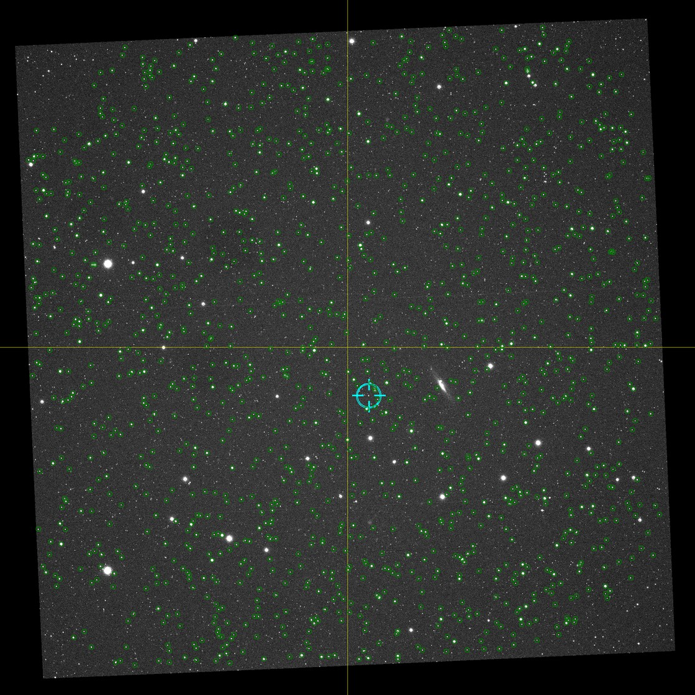

:author: Josh Walawender
:email: joshwalawender@me.com
:institution: Subaru Telescope, National Astronomical Observatory of Japan

---------------------------------------------
Automated Image Quality Monitoring with IQMon
---------------------------------------------

.. class:: abstract

Automated telescopes are capable of generating images more quickly than they can be inspected by a human, but detailed information on the performance of the telescope is valuable for monitoring and tuning of their operation.  The IQMon (Image Quality Monitor) package [#]_ was developed to provide basic image quality metrics of automated telescopes in near real time. 

.. class:: keywords

   astronomy, automated telescopes, image quality

.. [#] Source code at https://github.com/joshwalawender/IQMon

Introduction
------------

Using existing tools such as astropy [Astropy2013]_, astrometry.net [Lang2010]_, source extractor [Bertin1996]_ [Bertin2010a]_, SCAMP [Bertin2006]_ [Bertin2010b]_, and SWARP [Bertin2010c]_, IQMon analyzes images and provides the user with a quick way to determine whether the telescope is performing at the required level.

IQMon can provide a determination of whether the telescope is focused (from the typical Full Width at Half Maximum, or FWHM, of stars in the image), whether it is pointing accurately (obtained from a comparison of the target coordinates with the astrometrically solved coordinates), whether the tracking or guiding is adequate (from the typical ellipticity of stars in the image), and whether the night is photometric (obtained from the typical photometric zero point of stars in the image).  For wide field systems which detect many stars in each image, these metrics can be spatially resolved allowing for more detailed analysis such as differentiating between tracking error, focus error, and optical aberration or determining if the dome is partially obscuring the telescope aperture.

Because the system is designed to do quick evaluations of image quality, the primary concept is an object representing a **single** image.  IQMon does not do any image stacking or other processing which would be applied to more than one image at a time nor is it built around other organizational concepts such as targets or visits.  It is not intended to supplant a full data reduction and analysis package.  The output of IQMon, however, can be stored in a MongoDB [#]_ database making it potentially useful for collecting information on observing concepts which span multiple images such as targets, nights, or visits.  It might also be useful as a preprocessing step for a more complex data pipeline.

.. [#] http://www.mongodb.org

To date, IQMon has been deployed on three disparate optical systems: a 735mm focal length wide field imager with a monochrome CCD camera which undersamples the point spread function (PSF), an 0.5 meter f/8 telescope with a monochrome CCD camera with well sampled PSF, and an 85mm focal length camera lens and DSLR camera (with Bayer color array) designed for very wide field photometry.  IQMon has provided valuable diagnostic information about system performance in all cases.


Structure and Example Use
-------------------------

IQMon operates by using ``Telescope`` and ``Image`` classes.  The ``Telescope`` object contains basic information about the telescope which took the data.  When a ``Telescope`` object is instantiated, a configuration file is read which  contains information on the telescope and controls various user-configurable parameters and preferences for IQMon.  The configuration file is a YAML document and is read using the pyyaml [#]_ module.

.. [#] http://pyyaml.org

An ``Image`` object is instantiated with a path to a file with one of the supported image formats and with a reference to a ``Telescope`` object.  The image analysis process is simply a series of calls to methods on the ``Image`` object.

The IQMon philosophy is to never operate on the raw file itself, but instead to create a "working file" (using the ``read_image`` method) and store it in a temporary directory.  If the raw image file is a FITS file, then ``read_image``  simply copies the raw file to the temporary directory and records this file name and path in the ``working_file`` property.  If the file is a raw image file from a DSLR (e.g. ``.CR2`` or ``.dng`` format), then ``read_image`` will call ``dcraw`` [#]_ using the subprocess32 module [#]_ to convert the file to ``.ppm``.  The file is then converted to FITS format using either ``pamtofits`` or ``pnmtofits`` tools from the ``netpbm`` [#]_ package.  IQMon then operates on the green channel of that resulting FITS file.  For full functionality, the user should populate the header of this FITS file with appropriate FITS keywords (e.g. ``RA``, ``DEC``, ``EXPTIME``, ``DATE-OBS``, etc.).  To date, IQMon has only been tested with FITS and ``.CR2`` files, but should in principle work with numerous DSLR raw format images.

.. [#] http://www.cybercom.net/~dcoffin/dcraw/

.. [#] The subprocess32 module "is a backport of the subprocess standard library module from Python 3.2 & 3.3 for use on Python 2.4, 2.5, 2.6 and 2.7" (from https://pypi.python.org/pypi/subprocess32).  It is used instead of the standard subprocess module due to its support for timeout functionality.

.. [#] http://netpbm.sourceforge.net

IQMon has been tested with Python 2.7.X, testing with Python 3.X is pending.  Python 3.X compatibility notes will be posted to the readme file on the git repository.  IQMon runs successfully on both Mac OS X and linux.  Windows compatibility is untested, but will be limited by the availability of some dependencies (e.g. astrometry.net, SExtractor, etc.).

In the following sections, I will describe a simple example of evaluating image quality for a single image.  A more complex example which is updated in concert with IQMon can be found in the ``measure_image.py`` script at the git repository for the VYSOS project [#]_.  That process can then be wrapped in a simple program to monitor a directory for images and analyze them as they are written to disk (see the ``watch_directory.py`` script in the same VYSOS repository for an example).  This enables automatic near real time analysis.

.. [#] https://github.com/joshwalawender/VYSOStools


Configuration and Reading the Image In
``````````````````````````````````````

After importing IQMon, the first step would be to instantiate the ``Telescope`` object which takes a configuration file as its input.  The next step is to instantiate an ``Image`` object with the path to the image file and the ``Telescope`` object representing the telescope which took that image.

.. code-block:: python

    tel = IQMon.Telescope('~/MyTelescope.yaml')
    im = IQMon.Image('~/MyImage.fits', tel)

IQMon writes a log which is intended to provide useful information to the user (not just the developer) and shows the progress of the analysis.  We can either pass in a ``logger`` object from Python's logging module, or ask IQMon to create one:

.. code-block:: python

    # create a new logger object
    im.make_logger(verbose=False)
    print('Logging to file {}'.format(im.logfile))
    im.logger.info('This is a log entry')

The first step for any image analysis is likely to be to call the ``read_image`` method.  After calling ``read_image``, the FITS header is read and various ``Image`` object properties are populated by calling the ``read_header`` method.

.. code-block:: python

    # Generate working file copy of the raw image
    im.read_image()
    # Read the fits header
    im.read_header()

Once the image has been read in and a working file created, IQMon uses various third party tools to perform image analysis.  The following sections describe some of the analysis steps which are available.


PSF Size Measurements with Source Extractor
```````````````````````````````````````````

Source Extractor (SExtractor)  [Bertin1996]_ [Bertin2010a]_ is a program which builds a catalog of sources (stars, galaxies, etc.) detected in an image.  SExtractor is called using the ``run_SExtractor`` method which invokes the command using the subprocess32 module.  Customization parameters can be passed to Source Extractor using the telescope configuration file.

The output file of SExtractor is read in and stored as an astropy table object.  Stars with SExtractor generated flags are removed from the table and the table is stored as a property of the image object.

Determining the PSF size from the SExtractor results is done with the ``determine_FWHM`` method.  The full width at half maximum (FWHM) and ellipticity values for the image are a weighted average of the FWHM and ellipticity values for the individual stars.

These steps not only provide the typical FWHM (which can indicate if the image is in focus), they can also be used to guess at whether the image is "blank" (i.e. very few stars are visible either because of cloud cover or other system failure).  For example:

.. code-block:: python

    im.run_SExtractor()
    # Consider the image to be blank if <10 stars
    if im.n_stars_SExtracted < 10:
        im.logger.warning('Only {} stars found.\
                         .format(im.n_stars_SExtracted))
        im.logger.warning('Image may be blank.')
    else:
        im.determine_FWHM()


Pointing Determination and Pointing Error
`````````````````````````````````````````

IQMon also contains a ``solve_astrometry`` method to invoke the ``solve-field`` command which is part of the astrometry.net software.  The call to ``solve-field`` is only intended to determine basic pointing and orientation and so IQMon does not use the SIP polynomial fit of distortion in the image.

Once a world coordinate system (WCS) is present in the image header, then the ``determine_pointing_error`` method can be called which compares the right ascension (RA) and declination (DEC) values read from the RA and DEC keywords in the header (which are presumed to be the telescope's intended pointing) to the RA and DEC values calculated for the center pixel using the WCS.  The separation between the two coordinates is reported as the pointing error.

.. code-block:: python

    # If WCS is not present, solve with astrometry.net,
    if not im.image_WCS:
        im.solve_astrometry()
    # Determine pointing error by comparing telescope
    # pointing coordinates from the header with WCS.
    im.determine_pointing_error()

Astrometric Distortion Correction
`````````````````````````````````

In order to make an accurate comparison of the photometry of stars detected in the image and stars present in a chosen stellar catalog, many optical systems require distortion coefficients to be fitted as part of the astrometric solution.  IQMon uses the SCAMP software to fit distortions.

SCAMP is invoked with the ``run_SCAMP`` method.  Once a SCAMP solution has been determined, the image can be remapped to new pixels without distortions using the SWARP tool with the ``run_SWARP`` method.

.. code-block:: python

    # If the image has a WCS and a SExtractor catalog,
    # run SCAMP to determine a WCS with distortions.
    if im.image_WCS and im.SExtractor_results:
        im.run_SCAMP()
        if im.SCAMP_successful:
            # Remap the pixels to a rectilinear grid
            im.run_SWarp()

Estimating the Photometric Zero Point
`````````````````````````````````````

With a full astrometric solution, SExtractor photometry, and a catalog of stellar magnitude values, we can estimate the zero point for the image and use that as an indicator of clouds or other aperture obscurations.

The ``get_catalog`` method can be used to download a catalog of stars from VizieR using the astroquery module.  Alternatively, support for a local copy of the UCAC4 catalog is available using the ``get_local_UCAC4`` method.

Once a catalog is obtained, the ``run_SExtractor`` method is invoked again, this time with the ``assoc`` keyword set to ``True``.  This will limit the resulting catalog of detected stars to stars which **both** exist in the catalog and also are detected in the image.  This may significantly decrease the number of stars used for the FWHM and ellipticity calculation, but may also remove spurious detections of image artifacts which would improve the reliability of the measured values.

.. code-block:: python

    # Retrieve catalog defined in config file
    im.get_catalog()
    im.run_SExtractor(assoc=True)
    im.determine_FWHM()
    im.measure_zero_point()

In the above example code, ``determine_FWHM`` is invoked again in order to use the new SExtractor catalog for the calculation.

The ``measure_zero_point`` method determines the zero point by taking the weighted average of the difference between the measured instrumental magnitude from SExtractor and the catalog magnitude in the same filter.

It should be noted that unless custom code is added to handle reduction steps such as dark/bias subtraction and flat fielding, the zero point result will be influenced by systematics due to those effects.  In addition, the choice of catalog and the relative response curve of the filter in use and the filter defined by the catalog's photometric system will also introduce systematic offsets.  For many systems (especially typical visible light CCDs), the zero point value from IQMon can be used to compare throughput from image to image, but should not be used to compare different equipment configurations.

Analysis Results and Mongo Database Integration
-----------------------------------------------

Results of the IQMon measurements for each image are stored as properties of the ``Image`` object as ``astropy.units.Quantities``.  For example, the ```FWHM`` value is in units of pixels, but can be converted to arcseconds using the equivalency which is automatically defined by the ``Telescope`` object (``tel.pixel_scale_equivalency``) for this purpose.

.. code-block:: python

    ## Results are typically astropy.units quantities
    ## and can be manipulated as such.  For example:
    print('Image FWHM = {:.1f}'.format(im.FWHM))
    print('Image FWHM = {:.1f}'.format(\
          im.FWHM.to(u.arcsec, equivalencies=\
          im.tel.pixel_scale_equivalency)))
    print('Zero Point = {:.2f}'.format(im.zero_point))
    print('Pointing Error = {:.1f}'.format(\
          im.pointing_error.to(u.arcmin)))

These results can also be stored for later use.  Methods exist to write them to an ``astropy.Table`` (the ``add_summary_entry`` method) and to a YAML document (the ``add_yaml_entry`` method), but the preferred storage solution is to use a mongo database as that is compatible with the ``tornado`` web application included with IQMon (see below).

The address, port number, database name, and collection name to use with ``pyMongo`` to add the results to an existing mongo database are set by the Telescope configuration file.  The ``add_mongo_entry`` method adds a dictionary of values with the results of the IQMon analysis.


Flags
`````

For the four primary measurements (FWHM, ellipticity, pointing error, and zero point), the configuration file may contain a threshold value.  If the measured value exceeds the threshold (or is below the threshold in the case of zero point), then the image is "flagged" as an indication that there may be a potential problem with the data.  The flags property of an ``Image`` object stores a dictionary with the flag name and a boolean value as the dictionary elements.

This can be useful when summarizing results.  For example, the Tornado web application provided with IQMon (see the `Tornado Web Application`_ section) lists images and will color code a field red if that field is flagged.  In this way, a user can easily see when and where problems might have occurred.

Images and Plots
----------------

In addition to generating single values for FWHM, ellipticity, and zero point to represent the image, IQMon can also generate more detailed plots with additional information.

A plot with PSF quality information can be generated when ``determine_FWHM`` is called by setting the ``plot=True`` keyword.  This generates a .png file (see Fig. :ref:`PSFplot`) using matplotlib which shows detailed information about the point spread function (FWHM and ellipticity metrics) including histograms of individual values, a spatial map of FWHM and ellipticity over the image, and plots showing the ellipticity vs. radius within the image (which can be used to show whether off axis aberrations influence the ellipticity measure) and the correlation between the measured PSF position angle and the position angle of the star within the image (which can be used to differentiate between tracking error and off axis aberrations).

.. figure:: PSFplot.png
   :scale: 65%
   :figclass: w

   An example of the plot which can be produced using the ``determine_FWHM`` method.  The plot shows histograms of the FWHM and ellipticity values (upper left and upper right respectively), the spatial distribution of FWHM and ellipticity values (middle left and middle right), ellipticity vs. radius within the image (lower left), and the correlation between the measured PSF position angle and the position angle of the star within the image (lower right). :label:`PSFplot`

In the example plot (Fig. :ref:`PSFplot`), we can see several different effects.  First, from the spatial distribution of FWHM and ellipticity, as well as the ellipticity vs. radius plot, we see that image quality is falling off at large radii.  This image is from a wide field imaging system and we are seeing the signature of off axis aberrations.  This is also suggested in the plot of the correlation between the measured PSF position angle and the position angle of the star within the image which shows strong diagonal components indicating that position within the image influences the PSF.  There is also, however, a vertical component in that plot at :math:`PA \sim 0` which is suggestive of image drift perhaps due to slight polar misalignment or flexure.

A plot with additional information on the zero point can be generated when calling ``measure_zero_point`` by setting the ``plot`` keyword to ``True``.  This generates a .png file (see Fig. :ref:`ZPplot`) using matplotlib which shows plots of instrumental magnitude vs. catalog magnitude, a histogram of zero point values, a plot of magnitude residuals vs. catalog magnitude, and a a spatial map of zero point over the image.

.. figure:: ZPplot.png
   :scale: 34%
   :figclass: bht

   An example of the plot which can be produced using the ``measure_zero_point`` method.  The plot shows the correlation between instrumental magnitude and catalog magnitude (upper left), a histogram of zero point values (upper right), a plot of the residuals vs. catalog magnitude (lower left), and a spatial distribution of the residuals (lower left). :label:`ZPplot`

JPEG versions of the image can be generated using the ``make_JPEG`` method.  The jpeg can be binned or cropped using the ``binning`` or ``crop`` keyword arguments and various overlays can be generated showing, for example, the pointing error and detected and catalog stars.



   An example jpeg generated by the ``make_JPEG`` method using the ``mark_detected_stars`` and ``mark_pointing`` options. In this example,  pointing error has placed the target (marked by the cyan crosshair) to the lower right (southwest) of the image center (marked by the yellow lines).  Stars from the UCAC4 catalog which were detected in the image are marked with green circles. :label:`image`

The JPEG overlays can be useful in evaluating the performance of SExtractor and SCAMP.  In the example shown in Fig. :ref:`image`, the stars marked as detected by SExtractor (which was run with the ``assoc`` keyword set to ``True``) show that there are no stars detected in the very corners of the image.  This indicates that the SCAMP distortion solution did not accurately fit the WCS in the corners and could be improved.  Poor SCAMP solutions can also show up even more dramatically when entire radial zones of the image have no matched stars.

Tornado Web Application
-----------------------

IQMon comes with a tornado web application which, while it can be run stand alone, is intended to be used as a template for adding IQMon results to a more customized web page.  The web application (``web_server.py``) contains two ``tornado`` web handlers: ``ListOfNights`` and ``ListOfImages``.  The first generates a page which lists UT dates and if there are image results associated with a date, then it provides a link to a page with the list of image results for that date.  The second handler produces the page which lists the images for a particular UT date (or target name) and provides a table formatted list of the IQMon measurement results for each image with flagged values color coded red, along with links to jpegs and plots generated for that image.

This web application is intended to be the primary interface for users.  It provides three levels of interaction to the user.  First, a custom plot of IQMon results over the course of a night is easy to generate from the mongo database entries and represents the highest level of interaction.  Using such a plot, serious problems which affect many images can be detected at a glance.  Users can then drill down to see a list of images for that UT date and see system performance as a table of IQMon results with flagged values highlighted in red.  Finally an individual image can be examined as a jpeg with overlays or by using the PSF quality plots or zero point plots to examine detailed performance.

Conclusions
-----------

IQMon provides a way to evaluate the performance of automated telescopes.  Using the included tornado web application, a user can quickly and easily determine whether the observatory is performing acceptably or if it needs attention.

Over roughly two years of routine operation with two telescopes, it has enabled quick alerting of problems including stuck focus drives, poorly aligned dome rotation, and poor tracking model correction.  Previously, some of these problems would have gone unnoticed until a spot check of the data downloaded from the site revealed them or they would have required a time consuming reading of the nightly system logs to reveal.  Use of IQMon has resulted in greater uptime and improved data quality for both telescopes.


References
----------

.. [Astropy2013] Astropy Collaboration, Robitaille, T.~P., Tollerud, 
             E.~J., et al. *Astropy: A community Python package for
             astronomy* 2013, A&A, 558, A33

.. [Bertin1996] Bertin, E., & Arnouts, S. *SExtractor: Software for source
                extraction*, 1996, A&AS, 117, 393

.. [Bertin2006] Bertin, E. *Automatic Astrometric and Photometric Calibration
                with SCAMP*, 2006, Astronomical Data Analysis Software and
                Systems XV, 351, 112

.. [Bertin2010b] Bertin, E. *SCAMP: Automatic Astrometric and Photometric
                 Calibration*, 2010, Astrophysics Source Code Library,
                 1010.063

.. [Bertin2010a] Bertin, E., & Arnouts, S. *SExtractor: Source
                 Extractor*, 2010, Astrophysics Source Code Library,
                 1010.064

.. [Bertin2010c] Bertin, E. *SWarp: Resampling and Co-adding FITS Images
                 Together* 2010, Astrophysics Source Code Library, 1010.068

.. [Lang2010] Lang, D., Hogg, D. W., Mierle, K., Blanton, M., & Roweis, S.,
              *Astrometry.net: Blind astrometric calibration of arbitrary
              astronomical images* 2010, AJ 137, 1782–1800
