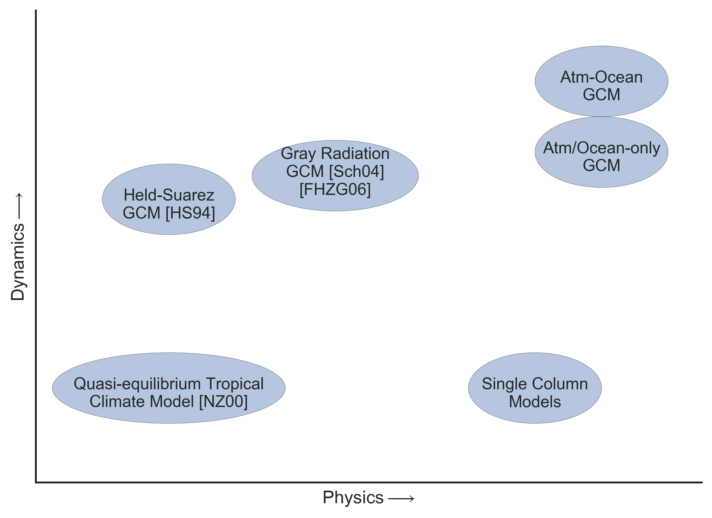
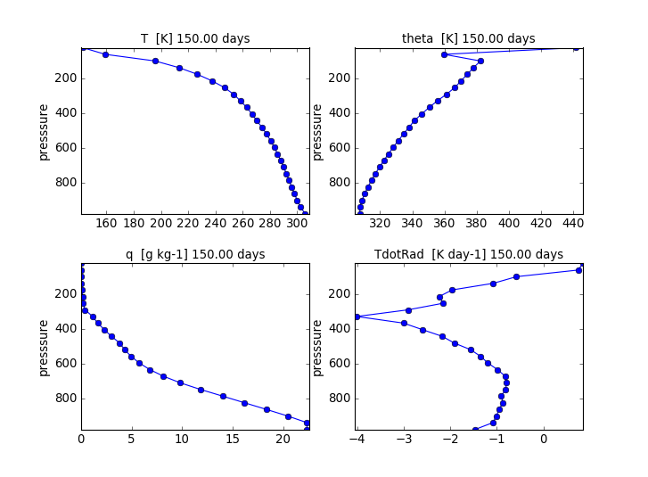
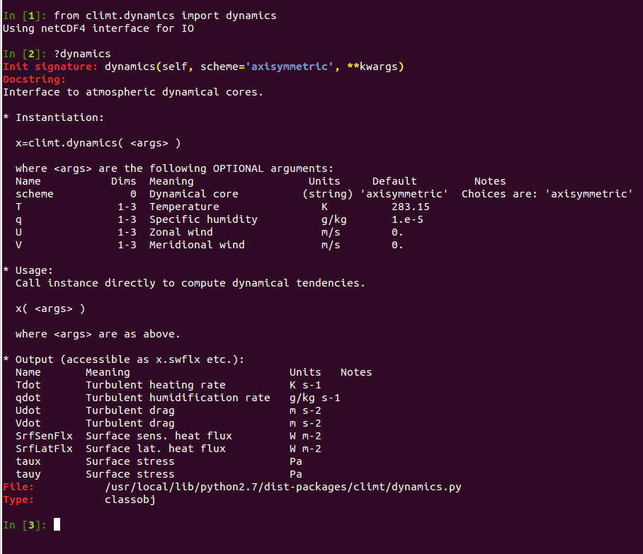
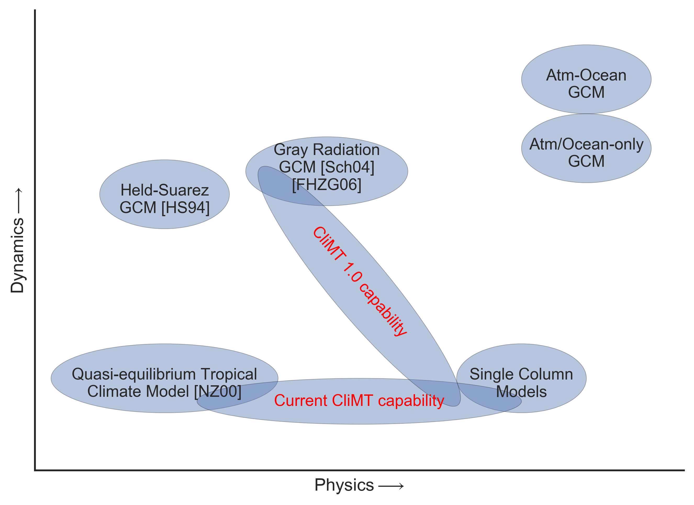
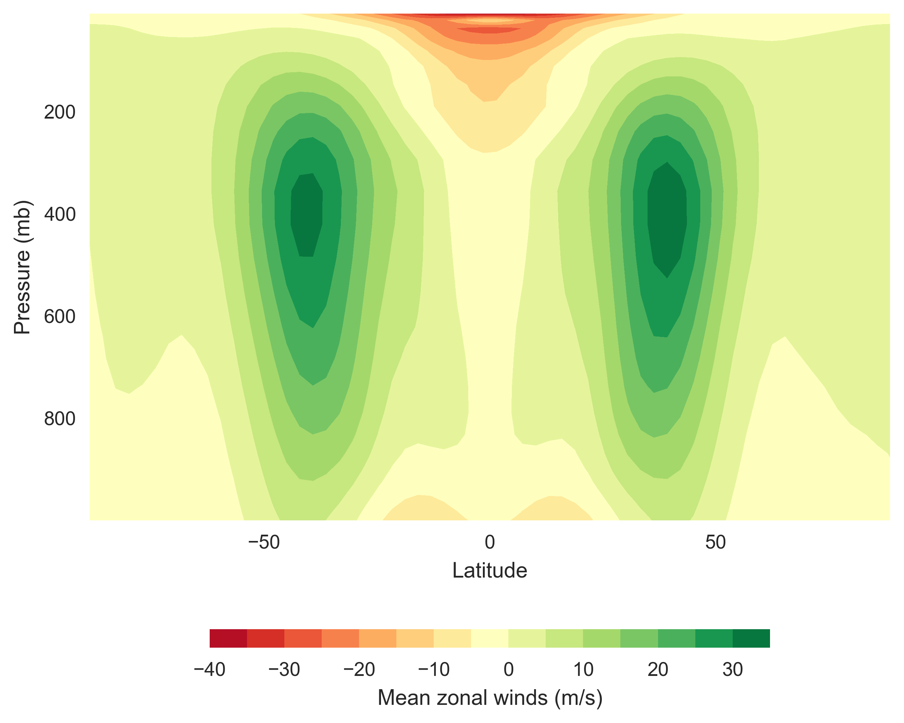

:author: Joy Merwin Monteiro
:email: joy.merwin@gmail.com
:institution: MISU, Stockholm University
:corresponding:

:author: Rodrigo Caballero
:email: rodrigo@misu.su.se
:institution: MISU, Stockholm University

:bibliography: climt

------------------------------------------------
The Climate Modelling Toolkit
------------------------------------------------

.. class:: abstract

    The Climate Modelling Toolkit (CliMT) is a Python-based software component toolkit providing a
    flexible problem-solving environment for climate science problems. It aims to simplify the
    development of models of complexity 'appropriate' to the scientific question at hand. This aim
    is achieved by providing Python-level access to components commonly used in climate models (such
    as radiative transfer models and dynamical cores) and using the expressive data structures
    available in Python to access and combine these components. This paper describes the motivation behind 
    developing CliMT, and serves as an introduction to interested users and developers.

.. class:: keywords

   Climate Modelling, Hierarchical Models 

Introduction
============

Climate models are numerical representations of the climate system consisting of ocean, land and 
atmosphere. They have become an important aspect of climate science as they provide a virtual
laboratory in which to perform experiments and gain a deeper understanding of the climate system.
Climate models can be conceived as a combination of two distinct parts: One, called the
"dynamics", is code which numerically integrates the equations of motions of a fluid. The other,
called the "physics" is code which approximates various processes considered important for the
evolution of the atmospheric/oceanic fluid, including radiation, moist convection and turbulence.
Some of these processes, such as convection and turbulence should ideally simulated by the dynamics,
but the coarse resolution of typical climate models and limitations of computational resources lead to 
their being approximated as physics components.

In an influential essay, Isaac Held made the case for studying the climate
system using a hierarchy of models, in a manner similar to the hierarchy of model organisms used by
evolutionary biologists :cite:`heldModelHierarchy2005`. The essay argued that such a hierarchy would
not only help in our understanding of the climate system, but would also help in interpreting results obtained from
more complex models and even aid in improving them. A qualitative description of the climate model
ecosystem is shown in Fig. :ref:`hierarchy`. On the dynamics axis, they range from models which
represent the atmosphere as a single vertical column to a full turbulent, three dimensional flow. On
the physics axis, they range from models which represent radiation or turbulence using ten lines of
code to those whose representation of the physics run into thousands of lines.

Over the past few decades, efforts have been made to develop such a hierarchy of models (a
significant fraction of which has been, not surprisingly, by Isaac's students and collaborators)
which have had a positive impact on our understanding of the climate system and the general
circulation of the atmosphere
:cite:`hoskinsKaroly1981,heldSuarez1994,neelinQuasiequilibrium2000,schneiderTropopause2004,friersonMoistGrayGCM2006,marshallAquaplanet2007,caballeroAxisymmetricRadConv2008,mitchellTitanMethane2009`.
Note that we restrict our focus here only on numerical models of the climate system, excluding many
influential theoretical models such as :cite:`heldHou1980` and models of phenomena such
as the Madden-Julian Oscillation (MJO) or tropical cyclones.

However, the scale of these efforts has not kept pace with the increasing complexity of full scale
general circulation models (GCMs) which are on the threshold of cloud-scale (~1 km horizontal
resolution) simulations of
the entire atmosphere. One of the primary reasons, we believe, is that significant effort is required to build
models which represent even the basic features of the atmospheric general circulation.
Existing frameworks to develop such models like the Flexible Modelling System
(FMS, ``http://www.gfdl.noaa.gov/fms``) and the MITgcm (``http://mitgcm.org/``) are typically
written in Fortran and the effort to set up a model beyond those already provided as examples can,
in our experience, be quite discouraging for new users who lack a strong background in Fortran and
programming.

In this paper we introduce the Climate Modelling Toolkit (CliMT, pronounced "Klimt"), which attempts to reduce this
barrier to developing simplified models of the atmosphere. It is similar in spirit to the above
mentioned frameworks, with the following distinctions:

- Configuration and execution of models is much simpler and done in the same script, making repeated
  simulations less error prone
- New components can be added with minimal infrastructure code requirements, and does not require recompilation of the entire codebase
- Object-oriented design makes program flow both intuitive and less prone to error
- Allows for incremental development: proof of concept development in pure Python and
  production code in another language (Cython, C, Fortran)

CliMT is currently not capable of parallel execution, and thus is mainly useful for 1 and
2-dimensional climate models. Despite these limitations, CliMT is used by around 10 research groups
around the world (based on user queries/feedback) for research
:cite:`caballeroAxisymmetricRadConv2008,caballeroHuber2013,rosingetal2010` and pedagogy
:cite:`pierrehumbertBook2010`.
In the following sections, we describe
the basic building blocks of CliMT, their usage, and how new components can be added. We end with a
roadmap towards version 1.0 of CliMT, which should see CliMT working as a fully parallel, moist GCM
capable of simulating a realistic climate.

   A qualitative depiction of the climate model hierarchy. The complexity of the dynamics and the physics models increases along the
   direction of the arrows. This is merely an indicative representation, and is not meant to be
   exhaustive. :label:`hierarchy`

CliMT: best of both worlds
==========================

CliMT combines the elegance and clarity of the Python language with the efficiency of Fortran
libraries. Users interact with CliMT in a pythonic way, using high-level data
structures like dictionaries and lists, and the numerical computations are done by optimised (and tested) Fortran code
extracted from state-of-the-art climate models. Currently, ``f2py`` is used to convert Fortran code to a
library that can be imported into Python. Table :ref:`componentList` lists the physical
processes that can be currently simulated using CliMT and the options available to represent each
physical process.

.. raw:: latex

    \renewcommand{\arraystretch}{1.2}
    \begin{table}
        \centering
    \begin{tabular}{|c|l|}
        \hline
        {\bf Physical Process} & {\bf Components}\\
        \hline 
        Convection & Zhang-McFarlane \\
               & Emanuel \\
               & Emanuel hard adjustment \\
               & Simplified Betts-Miller \\
        \hline
        Dynamics & Axisymmetric dynamics \\
             & Two column dynamics \\
    \hline
    Ocean & Slab Ocean \\
    \hline
    Radiation & Community Atmosphere Model (CAM) 3 \\
              & CCM 3 \\
              & Chou \\
              & Grey Gas \\
              & Rapid Radiative Transfer Model (RRTM) \\
              & \\
              & Insolation \\
              & Absorption by ozone \\
    \hline
    Turbulence & CCM3 \\
               & Simple (diffusive) \\
    \hline
    Thermodynamics & routines for calculating thermodynamic quantities \\
    \hline

    \end{tabular}
    \caption{Components available currently in CliMT.}
    \label{componentList}
    \end{table}

The initialization of the components and the execution of the resulting model is handled in the same
script, which makes the parameters and assumptions underlying the model explicit. This makes
interpreting the results of the simulation easier. Given that model initialization,
execution and data analysis can be performed from within a single IPython notebook, this makes model
results and the resulting scientific results reproducible as well. CliMT also enables users to study the effects 
of changing physical parameterizations and dynamical cores on the simulated climate,
something that is difficult to do in other idealised modelling frameworks.

Architecture
============

CliMT, in a broad sense, is a library which enables numerical representations of different processes
in the climate system to be linked together in an intuitive manner. While it provides a leapfrog integrator (a second
order method for numerical integration common
to many climate models) to step the model forward in time, it does not provide routines to calculate
gradients or spectral coefficients. All components in CliMT are either written from scratch or
extracted from larger climate models (especially radiative transfer models). There is no facility to
update the underlying Fortran/C code itself if the original code is updated. It is assumed that each
component will implement any numerical methods that it requires. While this may lead to some code
duplication, it allows for a loose coupling between the various components. This allows development
of new components without recompilation of the entire codebase.

When a component is instantiated, CliMT queries the component to find out which variables the
component affects. For instance, a convection component will affect the specific humidity and the
temperature variables. It creates a Numpy array of the appropriate dimensions for each such variable.
If multiple components affect the same variable, only one such array is created. During execution,
it collects the time tendency [*]_ terms from each component (in the form of a Numpy array), sums them together and uses the
resulting cumulative tendency to step the model forward in time. Currently, it is assumed that all
components share a common grid, i.e, all arrays representing tendency terms have the same shape, and
represent the same location in three dimensional space. As is commonly the case in climate models,
the spatial coordinates are in latitude-longitude-pressure space, and CliMT
does a sanity check to ensure that all components have the same spatial representation (i.e,
tendency arrays expected from each component has the same shape).

To summarize, each component (encapsulated in the ``Component`` class) provides time tendency terms to the main
execution loop, and the model is stepped forward in time by integrating these tendencies using the
leapfrog integrator. Optionally,
the model state is displayed using a wrapper over ``matplotlib`` and written to disk using the ``netCDF4`` library.
Since the model state variables are Numpy arrays, they can be easily accessed by external Python
libraries for online processing or any other purpose.

Combining multiple ``Component`` objects is made possible using the ``Federation`` class. Combining
two or more desired ``Component`` objects in a ``Federation`` results in a climate model of appropriate
complexity.

The ``Component`` and ``Federation`` classes are the interface between the end-user and CliMT, with all
other classes being used internally by these two classes.

.. [*] A time tendency term at time :math:`t_1` is the incremental value of a variable to be added to obtain that
    variable's value at time :math:`t_2` , where :math:`t_2` is the time instant succeeding :math:`t_1`.

``Component``
-------------

A ``Component`` class is the fundamental abstraction in CliMT. It encapsulates the behavior of a
component that takes certain inputs and provides certain tendencies as output. Each ``Component``
object has (among others) the following members which are specified by the developer:

- ``Prognostic``
- ``Diagnostic``
- ``Fixed``
- ``FromExtension``
- ``ToExtension``

These members are lists whose elements are one of many predefined field names (available in the
``State`` class) relevant to climate science applications. 
For example, if ``Component.Prognostic = ['U', 'V', 'theta']``, then the component
represents a model which can forecast the future state of the wind along longitude, wind along
latitude and the potential temperature, respectively. The ``Diagnostic`` list contains those fields
which the component calculates using the prognostic fields, and the ``Fixed`` list contains those
fields which are left unchanged by the component. The ``ToExtension`` list indicates which fields 
are required by the component to forecast the future state, and the ``FromExtension`` list indicates 
which fields are returned by the component. Typically, the ``FromExtension`` list contains the name
of fields with an ``Inc`` suffix, indicating that the component returns increments only, which are
to be stepped forward in time. The term ``Extension`` refers to the compiled
Fortran/C library which does the actual computation. Each ``Component`` also keeps track of the time
step ``dt`` taken during each integration (normally decided by stability constraints), and the 
time elapsed from the beginning of the integration.

``Component`` has two main methods: ``compute`` and ``step``. The ``compute``
method calls the compiled Fortran/C code and retrieves the increments and diagnostic fields and
stores them internally. ``compute`` takes an optional boolean argument ``ForcedCompute``. If
``ForcedCompute`` is true, then the tendency terms are always calculated. If it is false (the
default), then the tendencies are calculated only if the elapsed time is at least ``dt`` greater
than the previous time at which the tendencies were calculated. Such behavior is required when
combining two components which operate on very different time scales, such as convection (time scale
of hours) and radiation (time scale of days). ``compute`` is also invoked by simply calling the
object.

The ``step`` method steps the component forward in time by taking the increments calculated in
``compute`` and passing them on to the leapfrog integrator (available in the infrastructure code, not in
each individual component) to get future values of the fields.
``step`` internally calls ``compute``, so the user needs only to call ``step``. ``step`` accepts two
optional arguments ``Inc`` and ``RunLength``. ``Inc`` which is a dictionary whose
keys are some or all of the elements in ``ToExtension``, and the corresponding values are additional
tendency terms calculated outside the component. These increments are added to the internally computed
tendency terms before calling the integrator. ``Runlength`` decides how many seconds forward in time
the component is stepped forward. If ``RunLength`` is a positive integer, then the
component is stepped forward in time ``RunLength`` * ``dt`` seconds. If it is a positive floating
point number, then the component is stepped foward in time ``RunLength`` seconds.

All parameters required by any ``Component`` are passed as a dictionary during object instantiation.
This includes initial values of the fields integrated by the ``Component``. If no initial values are supplied, 
the fields are initialized as zeroed NumPy arrays of the appropriate shape. An example which uses
the CAM radiative transfer model to compute the radiative tendencies is shown below (also available
in the source code itself):

.. code-block:: python
    
    import numpy as np
    import climt

    #--- instantiate radiation module
    r = climt.radiation(scheme='cam3')

    #--- initialise T,q
    # Surface temperature
    Ts = 273.15 + 30.                         
    # Stratospheric temp
    Tst = 273.15 - 80.                         
    # Surface pressure
    ps = 1000.
    # Equispaced pressure levels
    p = ( np.arange(r.nlev)+ 0.5 )/r.nlev * ps
    # Return moist adiabat with 70% rel hum
    (T,q) = climt.thermodyn.moistadiabat(p, Ts, Tst, 1.)

    # Set values for cloud fraction and 
    #cloud liquid water path
    cldf = q*0. 
    clwp = q*0. 
    cldf[len(cldf)/3] = 0.5
    clwp[len(cldf)/3] = 100.

    #--- compute radiative fluxes and heating rates
    r(p=p, ps=ps, T=T, Ts=Ts, q=q, cldf=cldf, clwp=clwp)

In the above code, the computed outputs can be accessed by treating ``r`` as a dictionary: the
shortwave flux at the top of the atmosphere is available at ``r['SwToa']``, for example.

``Federation``
--------------

``Federation`` is a subclass of ``Component`` which is instantiated by providing two or more
``Component`` objects as arguments. It provides the same interface as ``Component``, and is the
abstraction of a climate model with multiple interacting components. On instantiation,
``Federation`` does a few sanity checks to ensure consistency of dimensions between its member
``Component``\s. As in ``Component``, integrating the ``Federation`` forward in time is simply
achieved by calling ``step``. An example which computes the radiative convective equilibrium in a
column of the atmosphere is given below:

.. code-block:: python

    import climt
    import numpy as np

    # Some code initialising kwargs
    ...

    # -- Instantiate components and federation

    #Radiation is called only once every 
    #50 timesteps, since it is a slow process.
    rad = climt.radiation(
            UpdateFreq=kwargs['dt']*50,
            scheme='cam3')

    #Convection consumes the instability 
    #produced by radiation
    con = climt.convection(
            scheme='emanuel')

    # turbulence facilitates the exchange
    # of water vapour and momentum between
    # the ocean and the atmospheric column
    dif = climt.turbulence()

    #Ocean provides a source of water vapour
    oce = climt.ocean()

    #Instantiate the federation
    fed = climt.federation(dif, rad, oce,
                con, **kwargs)

    # Main timestepping loop
    for i in range(1000):
        # The following code adds a uniform
        # 1 K/day cooling rate to 
        # the internally-computed tendencies
        dT= np.array([[-1./86400.*kwargs['dt']*
                2.*np.ones(rad.nlev)]]).transpose()

        fed.step(Inc={'T':dT})

   The displayed output from a one dimensional (vertical) radiative-convective simulation on day 150. The fields are updated in real
   time during the simulation. The panels display (clockwise from top left): Temperature, Potential Temperature, radiative heating and specific humidity 
   respectively. The y axis is height measured in pressure and has units of millibar (100 Pascals = 1 millibar).
   As expected from theory and observations, the temperature decreases almost linearly in the lower
   levels of the column. :label:`radconveq`

Here, the radiative code has an ``UpdateFreq`` value that is 50 times the actual timestep of the
federation. As mentioned before, this feature facilitates coupling of components whose
characteristic time scales are very different from each other without increasing the computational
load during the simulation. Notice also the external tendency term ``dT`` passed on to ``fed`` in the
``step`` method.
The output fields are again accessed by treating ``fed`` as a
dictionary. Figure :ref:`radconveq` shows the typical output from a CliMT radiative-convective simulation; Display and I/O is discussed
in the next section.

Software Layout and Documentation
=================================

CliMT maintains the infrastructure code and the actual component code in separate folders.
The ``src`` directory contains the component code whereas ``lib/climt`` contains the infrastructure
code. The main infrastructure code resides in ``{component,federation,state,grid}.py``. The various
physical processes are accessible from appropriately named files in ``lib/climt`` (e.g, ``convection.py``). These
files implement the ``Component`` class and act as an interface to the underlying Fortran code. Note
that there is no restriction on the language in which extensions are written. All the physical variables
that CliMT recognises are listed in ``state.py``. While all files themselves have detailed inline
documentation, there is currently no automated system in place to build a module reference based on
these comments. Querying an object in an IPython environment is currently the best way of accessing the
documentation, as demonstrated in Fig. :ref:`documentation`. Addition of a new module would require copying the extension code to ``src/``,
adding a reference to it in the appropriate physical process file (e.g, a new dynamical core would
be included in ``dynamics.py``), and adding a reference in ``setup.py`` to enable building and
installation.

   Accessing documentation for the dynamics class in an IPython prompt. :label:`documentation`

    
Monitoring fields and I/O
=========================
    
CliMT also provides for real time display (monitoring) of the simulated fields. Currently, up to four fields
can be monitored. Monitoring is activated by providing an additional argument during component
instantiation called ``MonitorFields``. ``MonitorFields`` is a list of up to four fields that are
part of the simulation. If the field is three dimensional, the zonal average (average along
longitude) is displayed. The frequency at which the display is refreshed is decided by the
``MonitorFreq`` argument.
    
CliMT can read intial conditions from the file whose name is specified in the ``RestartFile`` argument. The output
is written to the file whose name is specified in the ``OutputFile`` argument. If ``RestartFile``
and ``OutputFile`` are the same, then the data is appended to ``OutputFile``. The last time slice
stored in ``RestartFile`` is used to initialize the model. If some fields are missing in
``RestartFile``, they are initialized to default (zero) values.

The fields written to the output file are specified in the ``OutputFields`` argument. If
``OutputFields`` is not specified, all fields are written to file. ``OutputFreq`` is an optional
argument which specifies the time between writing data to file. If it is not specified, the output
is stored once every model day.

Developing new Components
=========================

CliMT requires a single point of entry into the Fortran/C code to be provided by each ``Component``:
the ``driver`` method. The ``driver`` method takes as input NumPy arrays representing the fields
required to calculate the tendency terms. The order in which the fields are input is represented by
the ``ToExtension`` list in the Component. The output of the driver is a list of NumPy arrays
ordered in the same way as the ``FromExtension`` list. The translation between NumPy arrays and the
Fortran code is currently done automatically by ``f2py`` generated code. The Fortran/C extension
module itself is stored in ``Component.Extension`` and an optional name is provided in
``Component.Name``. ``Component.Required`` is a list of those fields which are essential for the
component to calculate tendencies. These variables along with
``Prognostic``, ``Diagnostic`` and ``Fixed`` lists (which were previously discussed) enable CliMT 
to interface with a new component.

We note that CliMT expects the tendency terms to be pre-multiplied by ``dt``, i.e, the units of the
fields returned by ``driver`` is expected to be the same as the units of the prognostic fields. The
integrator does not multiply the tendency terms by ``dt``, as is normally the case.

Current Development: towards CliMT 1.0
======================================

The space occupied by CliMT in the climate model hierarchy is shown in Fig. :ref:`climtStatus`. It
is currently capable of simulating relatively simple (1 and 2 dimensional) dynamics and quite
sophisticated physical processes. Moving forward, we hope fulfill the vision of using CliMT as a full fledged moist idealized GCM. As
a first step, we have integrated a dynamical core adapted from the Global Forecast System (GFS).
Together with this, we have added a new Held-Suarez module which provides the Held-Suarez forcing
terms for a 3-d atmosphere. A working example of the benchmark is now available from a development
fork (available at ``https://github.com/JoyMonteiro/CliMT/lib/`` ``examples``). Figure :ref:`heldSuarez` shows the mean wind along
longitudes ("zonal" wind) simulated by the model. It shows most of the important aspects of the mean
circulation in the earth's atmosphere: strong westerly jet streams around 30 degrees N/S and easterly winds
near the surface and the top of the atmosphere in the tropics.

   A look at the current capability and future directions for CliMT development in context of the
   model hierarchy :label:`climtStatus`

Many changes were incorporated enroute this integration. The dynamical core is the first component
of CliMT that interfaces with the Fortran library using Cython and the ISO_C_Binding module
introduced in Fortran 2003. This will be used as a template to eventually move all components to
a Cython interface: ``f2py`` does not seem to be actively developed anymore, and currently cannot interface with code
that includes compound data structures, like the FMS dynamical cores. Therefore, we expect the
Cython-ISO_C_Binding combination to enable CliMT to use a wider range of libraries.

   The mean wind along longitudes in the Held-Suarez simulation. The mean is over 1000 days and over
   all longitudes (a "zonal" mean). The y-axis has units of millibar (= 100 Pa). It compares well with the simulated winds in
   :cite:`heldSuarez1994` (see Fig. 2 in their paper) :label:`heldSuarez`

A new feature in CliMT 1.0 will be to allow components to use an internal integrator and not the
default leapfrog available in CliMT. This is useful since components such as the 3-D dynamical core
already include non-trivial implementations of numerical integrators which will have to be reimplemented in
CliMT to ensure stable integrations. Moreover, it is unlikely that atmosphere and ocean models use
similar numerical algorithms. Since the focus of CliMT is on the infrastructure and not the
numerics, this feature enables rapid addition of new components into CliMT without substantially
changing its basic structure. This feature and other enhancements will be described in
detail in a forthcoming paper accompanying the release of CliMT 1.0.

Next, we intend to interface the dynamical core with the grey gas radiation module to enable CliMT
to generate a realistic general circulation without using the Held-Suarez forcing. Issues we intend
to address in the future include:

- scalability by making CliMT MPI and/or OpenMP-aware
- More systematic testing architecture
- A full user manual and IPython notebook examples

With these additions, we hope CliMT will be the framework of choice for a wide audience, from
undergraduates to scientists to explore questions in climate science.

Acknowledgements
----------------

This work is supported by funding from the Swedish e-Science Research Centre (``http://www.e-science.se/``).

.. .. figure:: figure1.png
   :scale: 20%
   :figclass: bht

..   This is the caption on a smaller figure that will be placed by default at the
   bottom of the page, and failing that it will be placed inline or at the top.
   Note that for now, scale is relative to a completely arbitrary original
   reference size which might be the original size of your image - you probably
   have to play with it. :label:`egfig2`

