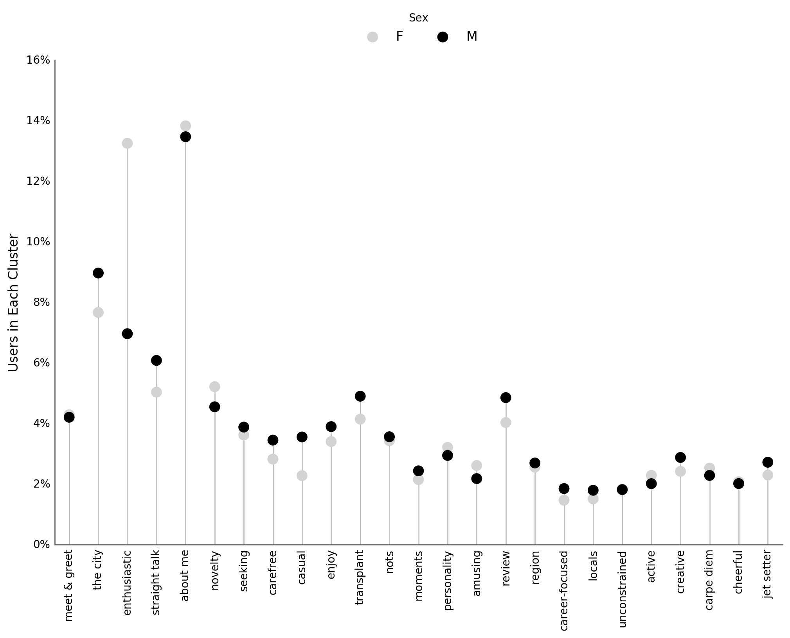
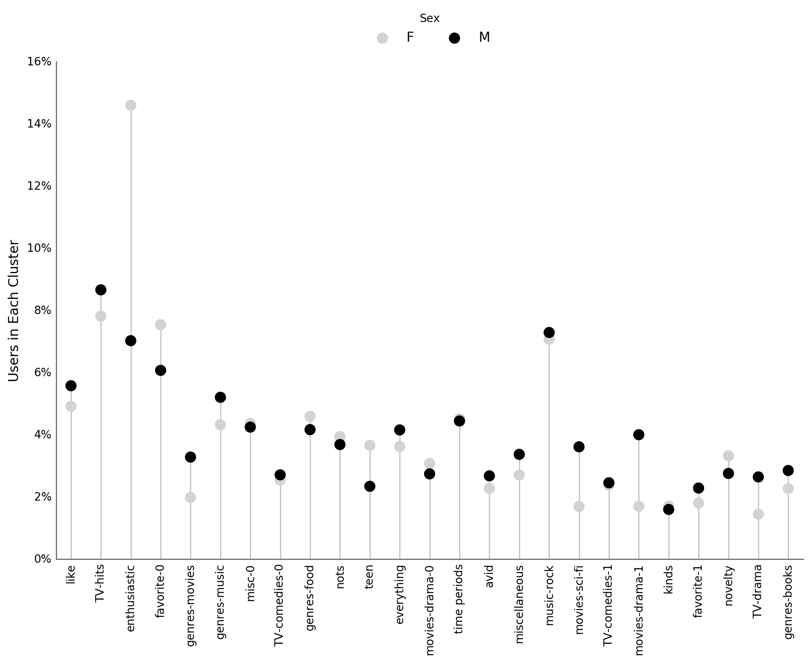
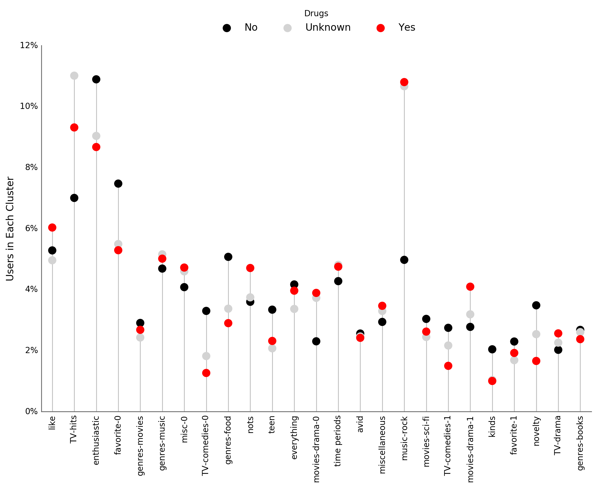

:author: Matar Haller
:email: matar@berkeley.edu
:institution: Helen Wills Neuroscience Institute, University of California, Berkeley
:equal-contributor:

:author: Jaya Narasimhan
:email: jnaras@berkeley.edu
:institution: Department of Electrical Engineering and Computer Science, University of California, Berkeley
:equal-contributor:

:author: Juan Shishido
:email: juanshishido@berkeley.edu
:institution: School of Information, University of California, Berkeley
:corresponding:

----------------------------------------------------------
Tell Me Something I Don't Know: Analyzing OkCupid Profiles
----------------------------------------------------------

.. class:: abstract

In this paper, we present an analysis of 59,000 OkCupid user profiles that
examines online self-presentation by combining natural language processing
(NLP) with machine learning. We analyze word usage patterns by sex and drug
usage status. In doing so, we review standard NLP techniques, cover several
ways to represent text data, and explain topic modeling. We find that
individuals in particular demographic groups self-present in consistent ways.
Our results also suggest that users may unintentionally reveal demographic
attributes in their online profiles.

.. class:: keywords

   natural language processing, machine learning, supervised learning,
   unsupervised learning, topic modeling, okcupid, online dating

Introduction
------------

The way that people self-present online has broad implications for the
relationships they pursue. Online dating has become a more common and more
acceptable way of finding mates. Almost half of Americans know someone who uses
or who has met a partner through online dating and 59% believe online dating is
a good way to meet people [Pew16]_. Online dating sites or mobile dating apps
are used by 27 percent of 18-24 year olds, 22 percent of 25-34 year olds, 21
percent of 35-44 year olds, 13 percent of 45-54 year olds, and 12 percent of
55-64 year olds [Pew16]_.

Previous studies suggest that the free text portion of online dating profiles
is an important factor (after photographs) for assessing attractiveness
[Fio08]_. The principle of homophily posits that people tend to
associate and bond with similar others and that this principle strongly
structures social networks and ties, most prominently by race and ethnicity
[McP01]_. Perhaps not surprisingly, research suggests that homophily extends to
online dating, with people seeking mates similar to themselves [Fio05]_.
However, it remains unclear whether people within particular demographic groups,
such as sex or ethnicity, self-present in similar ways when searching for a
mate online.

In this paper, we analyze demographic trends in online self-presentation.
Specifically, we focus on whether people signal demographic characteristics
through the way they present themselves online. We extend previous natural
language processing analyses of online dating [Nag09]_ by combining NLP
with supervised and unsupervised machine learning on a larger scale. We
leverage multiple approaches including clustering and topic modeling as well as
feature selection and modeling strategies. By exploring the relationships
between free text self-descriptions and demographics, we find that we can
predict a user's demographic makeup and also find some unexpected insights into
deception.

Data
----

Description
~~~~~~~~~~~

The data was obtained from Albert Y. Kim's JSE_OkCupid repository [1]_. Profile
information is available for 59,946 OkCupid users that were members as of
06/26/2012, lived within 25 miles of San Francisco, had been active in the
previous year, and had at least one photo in their profile [Wet15]_.
The data set contains free-text responses to 10 essay prompts as well as the
following user characteristics: age, body type, diet, drinking status, drug
usage status, education level, ethnicity, height, income, job type, location,
number of children, sexual orientation, attitude toward pets, religion, sex,
astrological sign, smoking status, number of language spoken, and relationship
status.

Preprocessing
~~~~~~~~~~~~~

Line break characters and URLs were removed from the essay text. Multiple
periods, dashes, and white spaces were replaced by single instances. Users who
wrote less than 5 words for a given essay (determined by splitting the
text on white space) were removed from the analysis.

We combined drug usage status levels. Specifically, users who responded
"sometimes" or "often" were grouped into a "yes" category. Individuals who
answered "never" were assigned to the "no" group and we created an "unknown"
category for users who did not answer.

Methods
-------

Log-Odds-Ratio
~~~~~~~~~~~~~~

One metric for comparing word usage across groups is to calculate the
log-odds-ratio. The odds for word :math:`w` in the usage of group :math:`g`
are defined as :math:`O_{iw} = \frac{f_{iw}}{(1 - f_{iw})}` where :math:`f_{iw}`
is the frequency count of word :math:`w` normalized by total count of words
used by group :math:`i`. If a word is used only by one group, its log-odds-ratio
is infinite. Therefore, a constant is added to each frequency when calculating
the odds. The log of the ratio of the adjusted odds between groups is  then
taken and used to compare word usage across groups. 

Non-negative Matrix Factorization
~~~~~~~~~~~~~~~~~~~~~~~~~~~~~~~~~

For document clustering, the document corpus can be projected onto a
k-dimensional semantic space, with each axis corresponding to a particular
topic and each document being represented as a linear combination of those
topics [Xu_03]_. With methods such as latent semantic indexing, the derived
latent semantic space is orthogonal. Because of this, these type of methods
can't easily handle cases where corpus topics overlap, as is often the case.
Conversely, non-negative matrix factorization (NMF), finds directions for
related or overlapping topics because the derived latent semantic space is not
required to be orthogonal.

NMF was applied to each essay of interest using scikit-learn (version 0.17.1),
which uses the coordinate descent solver. NMF utilizes document frequency
counts, so the tf-idf matrix for unigrams, bigrams, and trigrams was calculated,
while limiting tokens to those appearing in at least 0.5% of the documents
(minimum frequency). NMF was calculated with 25 dimensions, which factorized
the tf-idf matrix into two matrices, :math:`W` and :math:`H`. The dimensions
were ``n_samples x 25`` and ``25 x n_features`` for :math:`W` and
:math:`H`, respectively. Group descriptions were given by top-ranked terms (the
most distinctive) in the columns of :math:`H`. Document membership weights were
given by the rows of :math:`W`. The maximum value in each row of :math:`W`
determined essay group membership.

Permutation Testing
~~~~~~~~~~~~~~~~~~~

Permutation tests provide an exact sampling distribution of a test statistic
under the null hypothesis [Ger12]_. They do so by computing the test statistic
for every way that labels can be associated with the observed data. In practice,
permutations are rarely ever completely enumerated. Instead, the sampling
distribution is approximated by randomly shuffling the labels :math:`P` times.

The likelihood of the observed test statistic is determined as the proportion
of times that the absolute value of the permuted test statistics are greater
than or equal to the absolute value of the observed test statistic. This is the
:math:`p`-value for a two-tailed hypothesis. Permutation-based methods can be
used to compare two samples or to assess the performance of classifiers [Oja10]_.

There are several advantages to using randomization to make inferences as
opposed to parametric methods. Permutation tests do not assume normality, do
not require large samples and "can be applied to all sorts of outcomes,
including counts, durations, or ranks" [Ger12]_.

Term Frequency-Inverse Document Frequency
~~~~~~~~~~~~~~~~~~~~~~~~~~~~~~~~~~~~~~~~~

Machine learning tasks require numerical inputs. There are several ways to
represent text as numerical feature vectors. Features typically correspond to
distinct tokens or to sequences of adjacent tokens. A token is a series of
characters, such as a word, that is treated as a distinct unit [Bir10]_.

One way to represent a corpus, or collection of text documents, is as a matrix
of token counts. This weights terms by their absolute frequencies. Often,
highly-wighted terms, such as "a" or "the," are not informative, so token
counts are weighted using term frequency-inverse document frequency (tf-idf).

Tf-idf is the product of the term frequency and the inverse document frequency.
The term frequency refers to the *relative* frequency of term :math:`t` in
document :math:`d`. The inverse document frequency is the log of the total
number of documents :math:`N` to the number of documents that contain term
:math:`t`.

Approach
--------

Our analyses focus on two demographic dimensions—sex and drug usage—and on two
essays—"my self summary" and "favorite books, movies, shows, music, food."
These essays were chosen because we believe they provide a reliable
representation of self-presentation and because most users chose to respond to
them. "The most private thing I am willing to admit" prompt, on the other hand,
was ignored by 32 percent of users. Other essays in this data set may provide
additional insight into self-presentation and we may possibly consider those in
future analyses.

We began by exploring the lexical features of the text as a way to determine
whether there were differences in writing styles by demographic split. We
considered essay length, the use of profanity and slang terms, and
part-of-speech usage.

Essay length was determined based on the tokenized essays. We used spaCy's
default tokenizer, which is well suited for online communication as it
maintains emoticons as discrete tokens, and removed punctuation.

A list of profane words was obtained from the "Comprehensive Perl Archive
Network" website. Slang terms include words such as "dough," which refers to
money, and acronyms like "LOL." These terms come from the Wiktionary
Category:Slang page. Note that there is overlap between the profane and slang
lists.

Each token in the corpus was associated with a lexical category using spaCy's
part-of-speech tagger. spaCy supports 19 coarse-grained tags [2]_ that expand
upon Petrov, Das, and McDonald's universal part-of-speech tagset [Pet11]_.

Differences in lexical features by demographic were analyzed using permutation
testing. We first compared average essay length by sex. Next, we examined
whether the proportion of females using profanity was different than the
proportion of males using such terms. The same was done for slang words.
Finally, we compared the average proportion of adjectives, nouns, and verbs and
identified the most distinctive terms in each lexical category by sex using the
smoothed log-odds-ratio, which accounts for variance.

Text semantics were also analyzed. The corpus was transformed into a tf-idf
matrix using spaCy's default tokenizer with punctuation removed. We chose to
include unigrams, bigrams, and trigrams [3]_. Stop words [4]_ and terms that
appeared in less than 0.5% of documents were removed. Stemming, the process of
of removing word affixes, was not done.

Non-negative matrix factorization was used to identify latent structure
in the text. This structure is in the form of "topics" or "clusters" which can
be described by particular tokens. This was done for both essays. In order to
determine whether particular demographics groups were more likely to write
about particular topics, the distribution of users across topics was calculated
relative to each demographic group. In cases where we are able to create
superordinate groupings from NMF topics—for example, by combining semantically
similar clusters—we use the log-odds-ratio to find distinctive tokens.

Finally, we fit a logistic regression model to predict drug usage status for
users in the "unknown" category.

Results
-------

In this section, we describe our findings. We start with a discussion of our
lexical-based analyses before discussing our semantic-based results.
Lexical-based characteristics include essay length, use of profanity and slang
terms, as well as part-of-speech usage.

We first compare lexical-based characteristics on the self-summary text by sex.
Our sample includes 21,321 females and 31,637 males [5]_. We find that, on
average, females write 150 terms compared to males' 139. This difference is
statistically significant, based on permutation-based hypothesis testing.

For profanity and slang, instead of comparing frequencies across demographic
splits, we compare the proportion of users who use these terms.

In the self-summary essay, profanity is rarely used. Overall, only 6% of users
include such terms in their descriptions. 5.8% of females use profanity in
their self-summaries compared to 6.1% of males. This difference is not
statistically significant.

Not surprisingly, slang is much more prevalent (on a per-user basis) than
profanity. 56% of users use some form of slang in their self-summary essays.
Females use slang at a lower rate than males—54% vs. 57%—a difference that is
statistically significant.

In order to compare part-of-speech usage, we first associate part-of-speech
tags with every token in the self-summary corpus. This results in counts by
user and tag. Because of the difference in essay length we saw above, we
normalize these values based on the essay length. For example, if, out of 100
tokens, a particular user used 25 verbs, a value of 0.25 would be associated
with the verb tag for that user. Of the 15 possible tags, we focused on three:
adjectives, nouns, and verbs. This is summarized in the following table.

   +----------------+--------+--------+-------------+
   | Part-of-Speech | Female | Male   | Significant |
   +================+========+========+=============+
   | Adjectives     | 10.61% | 10.16% | *           |
   +----------------+--------+--------+-------------+
   | Nouns          | 18.65% | 18.86% | *           |
   +----------------+--------+--------+-------------+
   | Verbs          | 18.28% | 18.27% |             |
   +----------------+--------+--------+-------------+

We found that, in the self-summary essay, females used more adjectives than
males did. For nouns, it was the other way around. Interestingly, neither sex used
verbs more often than the other.

In addition to part-of-speech usage, we can explore particular terms associated
with parts-of-speech that are distinctive to a particular group. We did this
using the log-odds-ratio. The 10 most-distinctive adjective, noun, and verb
tokens, by sex, are summarized below.

   +----------------+----------------------------+----------------------------+
   | Part-of-Speech | Female                     | Male                       |
   +================+============================+============================+
   | Adjectives     | independent sweet my sassy | nice cool its that few     |
   |                | silly happy warm favorite  | interesting martial most   |
   |                | girly fabulous             | masculine more             |
   +----------------+----------------------------+----------------------------+
   | Nouns          | girl family who yoga men   | guy computer engineer      |
   |                | gal heels love dancing     | guitar sports software     |
   |                | friends                    | women video technology     |
   |                |                            | geek                       |
   +----------------+----------------------------+----------------------------+
   | Verbs          | love am laugh laughing     | m was play playing laid    |
   |                | dancing adore loving       | 'll working hit moved been |
   |                | dance appreciate being     |                            |
   +----------------+----------------------------+----------------------------+

We use NMF to help us understand the subject matter that users find interesting
and important about themselves and, thus, choose to write about. This provides
insight into the way they choose to self-present. In addition to particular
themes, NMF also allows us to consider stylistic expression. Choosing the
number of NMF components—these can be thought of as topics to which users are
clustered—is an arbitrary and iterative process. For the self-summary essay, we
chose to start with 25.

Several expected themes emerged. Some users, for example, chose to highlight
personality traits. Some did so by mentioning specific characteristics such as
humor while others were less specific, mentioning phrases such as, "easy going."
Other users focused on describing the types of activities they enjoyed. Hiking,
traveling, and cooking were popular choices. Others chose to mention what they
were looking for, whether that be a long-term relationship, a friendship, or
sex. Topics and a selection of their highest weighted tokens are summarized in
the table below.

   +----------------+---------------------------------------------------------+
   | Topic          | Tokens                                                  |
   +================+=========================================================+
   | meet & greet   | meet new people, looking meet new, love meeting new,    |
   |                | new friends, enjoy meeting, interesting people,         |
   |                | want meet, 'm new, people love, experiences             |
   +----------------+---------------------------------------------------------+
   | the city       | san francisco, moved san francisco, city,               |
   |                | living san francisco, just moved san, native,           |
   |                | san diego, grew, originally, recently                   |
   +----------------+---------------------------------------------------------+
   | enthusiastic   | love travel, love laugh, love outdoors, love love,      |
   |                | laugh, dance, love cook, especially, life love,         |
   |                | love life                                               |
   +----------------+---------------------------------------------------------+
   | straight talk  | know, just, want, ask, message, just ask, really,       |
   |                | talk, write, questions                                  |
   +----------------+---------------------------------------------------------+
   | about me       | 'm pretty, 'm really, 'm looking, 'm just, say 'm,      |
   |                | think 'm, 'm good, 'm trying, nerd, 'm working          |
   +----------------+---------------------------------------------------------+
   | novelty        | new things, trying new, trying new things, new places,  |
   |                | learning new things, exploring, restaurants,            |
   |                | things love, love trying, different                     |
   +----------------+---------------------------------------------------------+
   | seeking        | 'm looking, guy, relationship, looking meet, share,     |
   |                | woman, nice, just looking, man, partner                 |
   +----------------+---------------------------------------------------------+
   | carefree       | easy going, 'm easy going, easy going guy,              |
   |                | pretty easy going, laid, love going, enjoy going,       |
   |                | simple, friendly, likes                                 |
   +----------------+---------------------------------------------------------+
   | casual         | guy, lol, chill, nice, old, pretty, alot, laid, kinda,  |
   |                | wanna                                                   |
   +----------------+---------------------------------------------------------+
   | enjoy          | like, 'd like, things like, really like, n't like,      |
   |                | feel like, stuff, like people, like going, watch        |
   +----------------+---------------------------------------------------------+
   | transplant     | moved, sf, years ago, school, east coast, city,         |
   |                | just moved, college, went, california                   |
   +----------------+---------------------------------------------------------+
   | nots           | n't, ca n't, does n't, really, wo n't, n't like,        |
   |                | n't know, n't really, did n't, probably                 |
   +----------------+---------------------------------------------------------+
   | moments        | spend time, good time, lot, free time, spending time,   |
   |                | lot time, spend lot, time friends, time 'm, working     |
   +----------------+---------------------------------------------------------+
   | personality    | humor, good sense humor, good time, good conversation,  |
   |                | sarcastic, love good, dry, good company, appreciate,    |
   |                | listener                                                |
   +----------------+---------------------------------------------------------+
   | amusing        | fun loving, 'm fun, having fun, outgoing, guy, girl,    |
   |                | adventurous, like fun, looking fun, spontaneous         |
   +----------------+---------------------------------------------------------+
   | review         | let 's, think, way, self, right, thing, say, little,    |
   |                | profile, summary                                        |
   +----------------+---------------------------------------------------------+
   | region         | bay area, moved bay area, bay area native, grew,        |
   |                | living, 'm bay area, east bay, raised bay area, east,   |
   |                | originally                                              |
   +----------------+---------------------------------------------------------+
   | career-focused | work hard, play hard, hard working, progress, harder,   |
   |                | job, try, love work, company, busy                      |
   +----------------+---------------------------------------------------------+
   | locals         | born, raised, born raised, california, raised bay area, |
   |                | college, school, sf, berkeley, oakland                  |
   +----------------+---------------------------------------------------------+
   | unconstrained  | open minded, creative, honest, relationship,            |
   |                | adventurous, curious, passionate, intelligent, heart,   |
   |                | independent                                             |
   +----------------+---------------------------------------------------------+
   | active         | enjoy, friends, family, hiking, watching, outdoors,     |
   |                | traveling, hanging, cooking, sports                     |
   +----------------+---------------------------------------------------------+
   | creative       | music, art, live, movies, live music, play, food,       |
   |                | games, dancing, books                                   |
   +----------------+---------------------------------------------------------+
   | carpe diem     | live, world, fullest, enjoy life, experiences,          |
   |                | passionate, love life, moment, living life, life short  |
   +----------------+---------------------------------------------------------+
   | cheerful       | person, people, make, laugh, think, funny, kind, happy, |
   |                | honest, smile                                           |
   +----------------+---------------------------------------------------------+
   | jet setter     | 've, lived, years, world, traveled, year, spent,        |
   |                | countries, different, europe                            |
   +----------------+---------------------------------------------------------+

In order to determine whether there are differences in the topics or themes
that OkCupid users choose to write about in their self-summaries, we plot the
distribution over topics by demographic split. This allows us to identify how
often certain themes are being written about and whether those themes are
distinct to particular demographic groups.

The following figure shows the distribution over topics by sex. We see that
the highest proportion of users, of either sex, are in the "about me" group.
This is not surprising given that we're analyzing the self-summary essays. For
most topics, the proportion of females and males was fairly even. One notable
exception was with the "enthusiastic" group, which females belong to at almost
twice the rate of males. Users in this group used modifiers such as, "love,"
"really," and "absolutely" regardless of the activities they are describing.

   Self-Summaries

We can further examine online self-presentation by considering the other
available essays in the OkCupid data set. It has been noted that, "people do
actually define themselves through music and relate to other people through
it" [Col15]_. It is possible that this extends to other media, such as books or
movies, too. We consider the "favorite books, movies, shows, music, food" essay
next.

As with the self-summaries, we drop users who write less than 5 tokens for this
essay. There are 11,836 such cases. Note that because the favorites text is
less expository and more list-like, we do not consider a lexical-based analysis.
Instead, we use NMF to identify themes (or genres). Like with the
self-summaries, we choose 25 topics. The following table lists the topics and a
selection of their highest weighted tokens.

   +----------------+---------------------------------------------------------+
   | Topic          | Tokens                                                  |
   +================+=========================================================+
   | like           | like, music like, movies like, really like, stuff,      |
   |                | food like, things, like music, books like, like movies  |
   +----------------+---------------------------------------------------------+
   | TV-hits        | mad men, arrested development, breaking bad, 30 rock,   |
   |                | tv, parks, sunny, wire, dexter, office                  |
   +----------------+---------------------------------------------------------+
   | enthusiastic   | love food, love music, love movies, love love, cook,    |
   |                | love good, eat, food, love read, books love             |
   +----------------+---------------------------------------------------------+
   | favorite-0     | favorite, favorite food, favorite movies,               |
   |                | favorite books, favorite music, favorite movie,         |
   |                | favorite book, favorite shows, favorite tv,             |
   |                | time favorite                                           |
   +----------------+---------------------------------------------------------+
   | genres-movies  | sci fi, action, comedy, horror, fantasy, movies, drama, |
   |                | romantic, classic, adventure                            |
   +----------------+---------------------------------------------------------+
   | genres-music   | hip hop, rock, r&b, jazz, reggae, rap, pop, country,    |
   |                | classic, old                                            |
   +----------------+---------------------------------------------------------+
   | misc-0         | fan, reading, food 'm, right, 'm big, really,           |
   |                | currently, music 'm, just, open                         |
   +----------------+---------------------------------------------------------+
   | TV-comedies-0  | big bang theory, met mother, big lebowski, friends,     |
   |                | house, office, community, walking dead, new girl, bones |
   +----------------+---------------------------------------------------------+
   | genres-food    | italian, thai, mexican, food, indian, chinese,          |
   |                | japanese, sushi, french, vietnamese                     |
   +----------------+---------------------------------------------------------+
   | nots           | ca n't, watch, n't really, does, n't like, does n't,    |
   |                | think, eat, n't watch tv, n't read                      |
   +----------------+---------------------------------------------------------+
   | teen           | harry potter, hunger games, twilight, dragon tattoo,    |
   |                | pride prejudice, harry met sally, disney, vampire,      |
   |                | trilogy, lady gaga                                      |
   +----------------+---------------------------------------------------------+
   | everything     | books, movies, food, music, shows, country, dance,      |
   |                | action, lots, horror                                    |
   +----------------+---------------------------------------------------------+
   | movies-drama-0 | eternal sunshine, spotless mind, litte miss sunshine,   |
   |                | amelie, garden state, lost, life, beautiful,            |
   |                | lost translation, beauty                                |
   +----------------+---------------------------------------------------------+
   | time periods   | 80, let, good, 90, life, just, 70, world, time, man     |
   +----------------+---------------------------------------------------------+
   | avid           | read lot, time, watch, listen, recently, lately,        |
   |                | love read, watch lot, favorites, just read              |
   +----------------+---------------------------------------------------------+
   | misc-1         | list, just, long, ask, way, goes, things, try,          |
   |                | favorites, far                                          |
   +----------------+---------------------------------------------------------+
   | music-rock     | david, black, john, tom, radiohead, bob, brothers,      |
   |                | beatles, black keys, bowie                              |
   +----------------+---------------------------------------------------------+
   | movies-sci-fi  | star, lord, wars, rings, star trek, trilogy, series,    |
   |                | matrix, princess, bride                                 |
   +----------------+---------------------------------------------------------+
   | TV-comedies-1  | modern family, family guy, office, south park,          |
   |                | met mother, glee, simpsons, american dad, 30 rock,      |
   |                | colbert                                                 |
   +----------------+---------------------------------------------------------+
   | movies-drama-1 | fight club, shawshank redemption, pulp fiction,         |
   |                | fear loathing, peppers, red hot, vegas, american,       |
   |                | catcher rye, big lebowski                               |
   +----------------+---------------------------------------------------------+
   | kinds          | kinds music, love kinds, kinds food, kinds movies,      |
   |                | listen, different, country, foods, comedy, action       |
   +----------------+---------------------------------------------------------+
   | favorite-1     | favorite book, favorite movie, food, music, good, fav,  |
   |                | book read, reading, great, best                         |
   +----------------+---------------------------------------------------------+
   | novelty        | enjoy, new, types, trying, reading, things, foods,      |
   |                | types music, films, different                           |
   +----------------+---------------------------------------------------------+
   | TV-drama       | game thrones, ender 's game, walking dead, true blood,  |
   |                | series, currently, hunger games, dexter, song ice,      |
   |                | boardwalk empire                                        |
   +----------------+---------------------------------------------------------+
   | genres-books   | fiction, non fiction, science fiction, fiction books,   |
   |                | read non fiction, historical fiction, films, books,     |
   |                | documentaries, biographies                              |
   +----------------+---------------------------------------------------------+

The favorites topics are more difficult to categorize than the self-summaries.
In some cases, genres (or media) overlap. For example, in the TV-comedies-0
group, "The Walking Dead," a drama, is listed. In other cases, we see groups
that are potentially similar. However, it is possible that these groups (e.g.,
the multiple TV comedies groups) are, indeed, different, even if only slightly.
This might suggest that the number of NMF components is too high, but we prefer
the granularity it provides. In fact, we'll show that we are able to create
superordinate groupings from the above topics from which we can extract
distinctive tokens for particular demographic groups. We'll first examine the
distribution over topics by sex.

   Favorites

The most popular topics, for both females and males, are "TV-hits" and
"music-rock," with about 16% of each sex writing about shows or artists in
those groups. We see more separation between the sexes in the favorites essay
than we did with the self-summaries. The enthusiastic group is, again,
distinctly female. A distinctly male category includes films such as "Fight
Club" and "The Shawshank Redemption" and musical artists such as the Red Hot
Chili Peppers.

As noted earlier, we are able to create superordinate groupings by combining
clusters. In the favorites essay, for example, there are four groups related to
movies. In order to extract demographic-distinctive tokens, we use the
smoothed log-odds-ratio that accounts for variance as described by Monroe,
Colaresi, and Quinn [Mon09]_. The top movies for females were Harry Potter,
Pride & Prejudice, and Hunger Games while males favored Star Wars, The Matrix,
and Fight Club. Note that the "movies-sci-fi" and "movies-drama-1" groups,
whose highest weighted tokens refer to the male-favored movies, have a higher
proportion of males than females. Similarly, the "teen" group, which
which corresponds to female-favored movies, has a higher proportion of females.
The "movies-drama-0" group—the last of the four movie clusters—includes a
relatively even proportion of users along this demographic split.

To this point, we have only considered differences by sex. Next, we examine the
distribution over topics by drug usage. In this demographic category, users
identify as drug users or non-drug users. To this, we add a third level for
users who declined the state their drug usage status. There are 6,859 drug
users, 29,402 non-drug users, and 11,849 unknowns.

This plot shows more intra-cluster variation than the previous one.
Interestingly, users for whom we had no drug usage information—those in the
"unknown" category—tend to follow the self-identified drug users. That is, most
of the time, the proportion of drugs users and unknowns in a particular cluster
is similar. This is especially true in cases where difference in proportions
of drug users and non-drug users is large. This unexpected finding leads us to
hypothesize that individuals who do not respond to the drug usage question
might abstain in order to avoid admitting they use drugs.

   Favorites

Of course, because we don't have access to ground truth, any methods we employ
to investigate this will be cursory. Still, we wish to explore ways that might
help us gain insight to this question. To do this, we use a predictive modeling
approach. We train a logistic regression model on a binary outcome, using only
drug users and non-drug users. For consistency, we use the same text
representation we've used up to this point—tf-idf weights on unigrams, bigrams,
and trigrams. In addition, we balance the classes by randomly sampling 6,859
accounts from the non-drug user population. We then predict class labels on the
unknown group.

Our model predicts that 55% of the unknowns are drug users and that 45% are not.
However, when we look at the proportion or predicted drug users by NMF cluster,
we find intriguing patterns. In the "music-rock" group—the group with the
largest disparity between users and non-users—83% of unknowns are classified as
drug users. In contrast, only 25% of the unknowns in the "TV-comedies-0" group
are classified as such. While this cluster includes "The Big Lebowski," which
is identified as a "stoner film" [She13]_, it also features "The Big Bang
Theory," "How I Met Your Mother," "NCIS," "New Girl," and "Seinfeld," which we
would argue are decidedly not drug-related.

Future Work
-----------

Future

Conclusion
----------

Conclude

Acknowledgements
----------------

Acknowledge

.. Customised LaTeX packages
.. -------------------------

.. Please avoid using this feature, unless agreed upon with the
.. proceedings editors.

.. ::

..   .. latex::
..      :usepackage: somepackage

..      Some custom LaTeX source here.

Footnotes
---------
.. [1] https://github.com/rudeboybert/JSE_OkCupid. Our original data source was
       Everett Wetchler's okcupid repository (https://github.com/everett-wetchler/okcupid).
       However, after commit ``0d62e62``, in which the data was "fully
       anonimized" to exclude essays, we switched to Kim's repository. As far
       as we can tell, this data set is the same as the Wetchler original.

.. [2] https://spacy.io/docs#token-postags.

.. [3] Unigrams are single tokens. Bigrams refer to two adjacent and trigrams
       to three adjacent tokens.

.. [4] Stop words are words that appear with very high frequency, such as "the"
       or "to."

.. [5] The difference between the number of users in the data set and the
       number of users in the analysis is due to the fact that we drop users
       that write less than five tokens for a particular essay.

References
----------
.. [Bir10] Bird, S., Klein, E., & Loper, E. (2009). Natural language processing
           with Python. "O'Reilly Media, Inc.".

.. [Col15] Collingwood, J. (2015). Preferred Music Style Is Tied to Personality.
           Psych Central. Retrieved on June 22, 2016, from
           http://psychcentral.com/lib/preferred-music-style-is-tied-to-personality/

.. [Fio05] Fiore, A. T., & Donath, J. S. (2005, April). Homophily in online
           dating: when do you like someone like yourself?. In CHI'05 Extended
           Abstracts on Human Factors in Computing Systems (pp. 1371-1374). ACM.

.. [Fio08] Fiore, A. T., Taylor, L. S., Mendelsohn, G. A., & Hearst, M. (2008,
           April). Assessing attractiveness in online dating profiles. In
           Proceedings of the SIGCHI Conference on Human Factors in Computing
           Systems (pp. 797-806). ACM.

.. [Ger12] Gerber, A. S., & Green, D. P. (2012). Field experiments: Design,
           analysis, and interpretation. WW Norton.

.. [McP01] McPherson, M., Smith-Lovin, L., & Cook, J. M. (2001). Birds of a
           feather: Homophily in social networks. Annual review of sociology,
           415-444.

.. [Mon09] Monroe, B. L., Colaresi, M. P., & Quinn, K. M. (2008). Fightin'words:
           Lexical feature selection and evaluation for identifying the content
           of political conflict. Political Analysis, 16(4), 372-403.

.. [Nag09] Nagarajan, M., & Hearst, M. A. (2009, March). An Examination of
           Language Use in Online Dating Profiles. In ICWSM.

.. [Oja10] Ojala, M., & Garriga, G. C. (2010). Permutation tests for studying
           classifier performance. Journal of Machine Learning Research,
           11(Jun), 1833-1863.

.. [Pet11] Petrov, S., Das, D., & McDonald, R. (2011). A universal part-of-speech
           tagset. arXiv preprint arXiv:1104.2086.

.. [Pew16] Smith, Aaron, & Anderson, Monica (2016). 5 Facts About Online Dating.
           Retrieved from http://www.pewresearch.org/fact-tank/2016/02/29/5-facts-about-online-dating/.

.. [She13] Sheffield, Rob (2013). 10 Best Stoner Movies of All Time. Rolling
           Stones. Retrieved on June 23, 2016, from
           http://www.rollingstone.com/movies/lists/the-greatest-stoner-movies-of-all-time-20130606

.. [Wet15] Everett Wetchler, okcupid, (2015), GitHub repository,
           `<https://github.com/everett-wetchler/okcupid.git>`_

.. [Xu_03] Xu, W., Liu, X., & Gong, Y. (2003, July). Document clustering based
           on non-negative matrix factorization. In Proceedings of the 26th
           annual international ACM SIGIR conference on Research and
           development in informaion retrieval (pp. 267-273). ACM.
