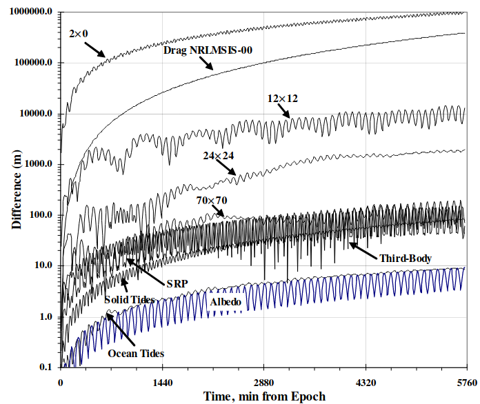
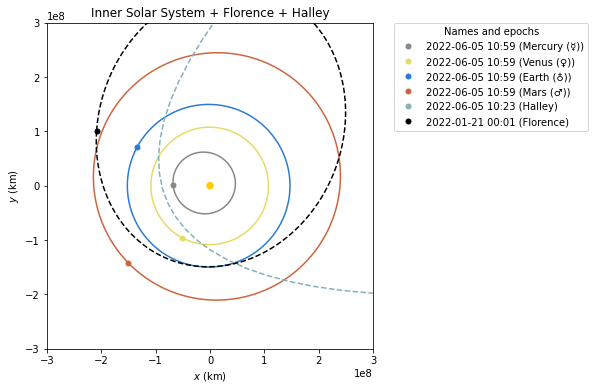
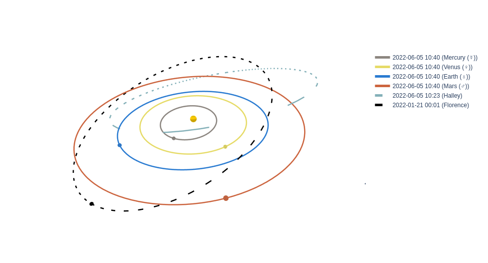

:author: Juan Luis Cano Rodríguez
:email: hello@juanlu.space
:orcid: 0000-0002-2187-161X
:institution: Unaffiliated
:corresponding:

:author: Jorge Martínez Garrido
:email: contact@jorgemartinez.space
:institution: Unaffiliated

:bibliography: refs

:video: https://www.youtube.com/watch?v=VCpTgU1pb5k

.. raw:: latex

   \newcommand{\diff}{\operatorname{d}}
   \renewcommand{\vec}[1]{\mathbf{#1}}

=========================================================
poliastro: a Python library for interactive Astrodynamics
=========================================================

.. class:: abstract

   Space is more popular than ever, with the growing public awareness of interplanetary scientific missions,
   as well as the increasingly large number of satellite companies planning to deploy satellite constellations.
   Python has become a fundamental technology in the astronomical sciences,
   and it has also caught the attention of the Space Engineering community.

   One of the requirements for designing a space mission is
   studying the trajectories of satellites, probes, and other artificial objects,
   usually ignoring non-gravitational forces or treating them as perturbations:
   the so-called n-body problem.
   However, for preliminary design studies and most practical purposes,
   it is sufficient to consider only two bodies: the object under study and its attractor.

   Even though the two-body problem has many analytical solutions,
   orbit propagation (the initial value problem) and targeting (the boundary value problem)
   remain computationally intensive because of long propagation times, tight tolerances, and vast solution spaces.
   On the other hand, Astrodynamics researchers often do not share
   the source code they used to run analyses and simulations,
   which makes it challenging to try out new solutions.

   This paper presents poliastro, an open-source Python library for interactive Astrodynamics
   that features an easy-to-use API and tools for quick visualization.
   poliastro implements core Astrodynamics algorithms
   (such as the resolution of the Kepler and Lambert problems)
   and leverages numba, a Just-in-Time compiler for scientific Python,
   to optimize the running time.
   Thanks to Astropy, poliastro can perform seamless coordinate frame conversions
   and use proper physical units and timescales.
   At the moment, poliastro is the longest-lived Python library for Astrodynamics,
   has contributors from all around the world,
   and several New Space companies and people in academia use it. 

.. class:: keywords

   astrodynamics, orbital mechanics, orbit propagation, orbit visualization, two-body problem

Introduction
============

History
-------

The term "Astrodynamics" was coined by the American astronomer Samuel Herrick,
who received encouragement from the space pioneer Robert H. Goddard,
and refers to the branch of space science dealing with the motion of artificial celestial bodies
(:cite:`duboshin_book_1973`, :cite:`herrick_astrodynamics_1971`).
However, the roots of its mathematical foundations go back several centuries.

Since in 1609 German mathematician and astronomer Johannes Kepler published his book *Astronomia nova*,
containing the most famous of all transcendental equations,
the motion of the celestial bodies has attracted the attention of the greatest minds in human history,
even sparking entire new fields in mathematics :cite:`battin_introduction_1999`.
It is easy to imagine that if even Kepler's equation (:ref:`eq:kepler`),
the one that captures the essence of the two-body problem in its most restricted form,
already has this mathematical intricacy,
any further development will carry away similar or greater complexity.

.. raw:: latex

   \begin{figure}
   \[ M = E - e \sin{E} \]
   \caption{The Kepler equation}
   \label{eq:kepler}
   \end{figure}

Almost three centuries later, in 1903, Russian rocket scientist Konstantin E. Tsiolkovsky
first explained in his article *Exploration of Outer Space by Means of Rocket Devices*
precise conditions for artificial objects to reach the orbit of the Earth,
making a huge leap from the mere observation of the celestial bodies
and the science fiction stories that had inspired him
to the real possibility of going to space.

.. Regarding Saxon genitive and equation names, see http://english.stackexchange.com/a/301270/20057

.. raw:: latex

   \begin{figure}
   \[ \Delta v = v_e \ln \frac{m_0}{m_f} \]
   \caption{The Tsiolkovsky equation}
   \label{eq:tsiolkovsky}
   \end{figure}

Tsiolkovsky's contribution could be considered the starting point of Astrodynamics,
and many others ensued before they could be tested in practice during the second half of the 20th century.
In 1919 Yuri V. Kondratyuk conceived the gravitational slingshot or flyby
to accelerate a spacecraft through interplanetary flight
and suggested a mission profile for a Lunar landing :cite:`siddiqi_challenge_2000`,
in 1925 Walter Hohmann conjectured
that the minimum-fuel transfer between two coplanar circular orbits
consists of two tangent impulses along the line of apses
(although this result was not proved until almost forty years later in :cite:`lawden_optimal_1963`),
and in 1926 Hermann J. Oberth observed
that the velocity gain of an impulsive maneuver
is higher when the kinetic energy is maximum
(nowadays known as the Oberth effect).
The severe limitations in weight and available energy for such kind of travels
were already apparent for these pioneers,
who were, in some way, anticipating the need to optimize on board fuel consumption.

The rich history of Astrodynamics as a field continues to this day,
as new research offers better methods to solve these ancient equations
and more computational efficiency is neeeded to perform large scale simulations.

The two-body problem
--------------------

In a system of :math:`i \in {1, ..., n}` bodies subject to their mutual attraction,
by application of Newton's law of universal gravitation,
the total force :math:`\vec{f}_i` affecting :math:`m_i`
due to the presence of the other :math:`n - 1` masses is given by :cite:`battin_introduction_1999`:

.. math::

   \vec{f}_i = -G \sum_{j \neq i}^n \frac{m_i m_j}{|\vec{r}_{ij}|^3} \vec{r}_{ij}

Where :math:`G = 6.67430\cdot 10^{-11}~\text{N m$^2$ kg$^{-2}$}` is the universal gravitational constant,
and :math:`\vec{r}_{ij}` denotes the position vector from :math:`m_i` to :math:`m_j`.
Applying Newton's second law of motion results in a system of :math:`n` differential equations:

.. math::

   \frac{\diff^2{\vec{r}}_i}{\diff{t}^2} = -G \sum_{j \neq i}^n \frac{m_j}{|\vec{r}_{ij}|^3} \vec{r}_{ij}

No general closed-form solution exists for the n-body problem, as established by Henri Poincaré in the 1890s:
except for a few restricted cases, the resulting dynamical system is chaotic.
Karl F. Sundman proved in the 1900s the existence of convergent solutions for the :math:`n = 3` case.
However, the :math:`n = 2` case does have a closed-form solution,
which was studied in detail by Daniel and Johann Bernoulli, and most specially by Leonhard Euler in 1744
:cite:`battin_introduction_1999`.

By setting :math:`n = 2` and differencing both equations,
one arrives to the **fundamental equation of the two-body problem**:

.. math::
   :label: eq:twobody

   \frac{\diff^2{\vec{r}}}{\diff{t}^2} = -\frac{\mu}{r^3} \vec{r}

where :math:`\mu = G(m_1 + m_2) = G(M + m)`. When :math:`m \ll M`
(for example, an artificial satellite orbiting a planet),
one can consider :math:`\mu = GM` a property of the attractor.

Conveniently manipulating this equation leads to several properties :cite:`battin_introduction_1999`
that were already published by Johannes Kepler in the 1610s, namely:

1. The orbit always describes a conic section (an ellipse, a parabola, or an hyperbola),
   with the attractor at one of the two foci and can be written in polar coordinates
   like :math:`r = \frac{p}{1 + e \cos{\nu}}` (Kepler's first law).
2. The magnitude of the specific angular momentum :math:`h = r^2 \frac{\diff{\theta}}{\diff t}`
   is constant an equal to two times the areal velocity (Kepler's second law).
3. For closed (circular and elliptical) orbits, the period is related to the size of the orbit through
   :math:`P = 2 \pi \sqrt{\frac{a^3}{\mu}}` (Kepler's third law).

In the real world, celestial bodies do not follow these laws in an exact manner,
because there are perturbations of different kinds affecting the ideal motion.
However, for many practical purposes it is usually sufficient to limit the study
two one object orbiting an attractor and ignore all other external forces of the system.
The trajectories of such objects are called "Keplerian".

There are six parameters that uniquely determine a Keplerian orbit,
plus the gravitational parameter of the corresponding attractor (:math:`k` or :math:`\mu`).
Optionally, an epoch that contextualizes the orbit can be included as well.
This set of six parameters is not unique,
and several of them have been developed over the years to serve different purposes.
The most widely used ones are:

- **Cartesian elements**: Three components for the position :math:`(x, y, z)`
  and three components for the velocity :math:`(v_x, v_y, v_z)`.
  This set has no singularities.
- **Classical Keplerian elements**: Two components for the shape of the conic
  (usually the semimajor axis :math:`a` or semiparameter :math:`p` and the eccentricity :math:`e`),
  three Euler angles for the orientation of the orbital plane in space
  (inclination :math:`i`, right ascension of the ascending node :math:`\Omega`, and argument of periapsis :math:`\omega`),
  and one polar angle for the position of the body along the conic
  (usually true anomaly :math:`f` or :math:`\nu`).
  This set of elements has an easy geometrical interpretation
  and the advantage that, in pure two-body motion,
  five of them are fixed :math:`(a, e, i, \Omega, \omega)`
  and only one is time-dependent (:math:`\nu`),
  which greatly simplifies the analytical treatment of orbital perturbations.
  However, they suffer from singularities steming from the Euler angles ("gimbal lock")
  and equations expressed in them are ill-conditioned near such singularities.
- **Walker modified equinoctial elements**: Six parameters :math:`(p, f, g, h, k, L)`.
  Only :math:`L` is time-dependent and this set has no singularities,
  however the geometrical interpretation of the rest of the elements is lost :cite:`walker_set_1985`.

Keplerian motion
----------------

There can be several problems formulated from equation :ref:`eq:twobody`, namely:

- The **initial-value problem**, which is usually called **propagation**,
  involves determining the position and velocity of an object after an elapse period of time
  given some initial conditions.
- **Preliminary orbit determination**, which involves using exact or approximate methods
  to derive a Keplerian orbit from a set of observations.
- The **boundary-value problem**, often named **the Lambert problem**,
  which involves determining a Keplerian orbit from boundary conditions,
  usually departure and arrival position vectors and a time of flight.

Fortunately, most of these problems boil down to finding numerical solutions to
relatively simple algebraic relations between time and angular variables.
For example, speaking about orbital propagation,
by conveniently manipulating the two-body equations and assuming :math:`0 \le e < 1`
one can arrive to the Kepler equation mentioned at the beginning:

.. math::
   :type: eqnarray*
   :label: eq:kepler

   M = n \Delta t = E - e \sin{E} \\
   \tan{\frac{1}{2} \nu} = \sqrt{\frac{1 + e}{1 - e}} \tan{\frac{1}{2} E}

Where :math:`M` is called the mean anomaly and :math:`E` is the eccentric anomaly.
Similar relations exist for the other eccentricity regimes :cite:`battin_introduction_1999`.
Despite not having closed-form solution, these equations can be solved
in a number of different ways, each one with different complexity and precision tradeoffs.

Doing a literature review of such methods is out of scope of this paper,
however in the Methods section we list the ones implemented by poliastro.

Orbital perturbations
---------------------

The analytical methods discussed above are perfect for solving the ideal Keplerian motion.
This approximation is usually good enough for interplanetary travel,
when all other forces aside from the Sun gravity are negligible.
However, there are many situations in which natural and artificial orbital perturbations
must be taken into account so that the actual non-Keplerian motion can be properly analyzed:

- Interplanetary travel in the proximity of other planets.
  On a first approximation it is usually enough to study the trajectory in segments
  and focus the analysis on the closest attractor,
  hence patching several Keplerian orbits along the way
  (the so-called "patched-conic approximation") :cite:`battin_introduction_1999`.
  The boundary surface that separates one segment from the other is called
  the sphere of influence.
- Use of solar sails, electric propulsion, or other means of continuous thrust.
  Devising the optimal guidance laws that minimize travel time or fuel consumption
  under these conditions is usually treated as an optimization problem of a dynamical system,
  and as such it is particularly challenging :cite:`conway_spacecraft_2014`.
- Artificial satellites in the vicinity of a planet.
  This is the regime in which all the commercial space industry operates,
  especially for those satellites in Low-Earth Orbit (LEO).

.. figure:: enckes_method.pdf
   :scale: 50%
   :align: center

   Osculating (Keplerian) vs perturbed (true) orbit
   (source: Wikipedia, CC BY-SA 3.0) :label:`fig:osculating`

As showcased in Figure :ref:`fig:osculating`, at any point in a trajectory
we can define an ideal Keplerian orbit with the same position and velocity
under the attraction of a point mass: this is called the osculating orbit.
Some numerical propagation methods exist that model the true, perturbed orbit
as a deviation from an evolving, osculating orbit: for example,
Cowell's method :cite:`cowell_investigation_1910` consists in adding
all the perturbation accelerations and then integrating
the resulting differential equation with any numerical method of choice:

.. math::
   :label: eq:cowell

   \frac{\diff^2{\vec{r}}}{\diff{t}^2} = -\frac{\mu}{r^3} \vec{r} + \vec{a}_d

High order numerical integration methods, such as Dormand-Prince 8(5,3) (`DOP853`),
are usually used in Astrodynamics, since the integration times are quite large
and the tolerances comparatively tight. An in-depth discussion of such methods
can be found in :cite:`hairer_solving_2009`.

Commercial Earth satellites
---------------------------

Figure :ref:`fig:leo-perturbations` gives a clear picture
of the most important natural perturbations affecting satellites in LEO, namely:
first harmonic of the geopotential field :math:`J_2` (representing the attractor oblateness),
the atmospheric drag, and the higher order harmonics of the geopotential field.

   Natural perturbations affecting Low-Earth Orbit (LEO) motion
   (source: :cite:`vallado_fundamentals_2007`) :label:`fig:leo-perturbations`

At least the most significant of these perturbations need to be taken into account
when propagating LEO orbits, and therefore the methods for purely Keplerian motion are not enough.
However, numerical methods are much slower than analytical ones,
and this can render them unsuitable for large scale simulations, satellite conjunction assesment,
propagation in constrained hardware, and so forth.
To address this issue, semianalytical propagation methods were devised that
attempt to strike a balance between the fast running times of analytical methods
and the necessary inclusion of perturbation forces.

One of such semianalytical methods are the Simplified General Perturbation (SGP) models,
first developed in :cite:`hilton_mathematical_1966` and then refined in :cite:`lane_improved_1969` into what
we know these days as the SGP4 propagator :cite:`hoots_models_1980` :cite:`vallado_revisiting_2006`.
Even though certain elements of the reference frame used by SGP4 are not properly specified
:cite:`vallado_revisiting_2006` and that its accuracy might still be too limited for certain applications
:cite:`kelso_analysis_2009` :cite:`lara_analytical_2016`, it is nowadays the most widely used propagation method
thanks in large part to the dissemination of General Perturbations orbital data by the US 501(c)(3) CelesTrak
(which itself obtains it from the 18th Space Defense Squadron of the US Space Force).

The starting point of SGP4 is a special element set that uses Brouwer mean orbital elements :cite:`brouwer_solution_1959`
plus a ballistic coefficient based on an approximation of the atmospheric drag :cite:`lane_improved_1969`,
and its results are expressed in a special coordinate system called True Equator Mean Equinox (TEME).
Special care needs to be taken to avoid mixing mean elements with osculating elements,
and to convert the output of the propagation to the appropriate reference frame.
These element sets have been traditionally distributed in a compact text representation called
Two-Line Element sets (TLEs) (see :ref:`fig:tle` for an example).
However this format is quite cryptic and suffers from a number of shortcomings,
so recently there has been a push to use the Orbit Data Messages international standard
developed by the Consultive Committee for Space Data Systems (CCSDS 502.0-B-2).

.. figure:: tle.pdf
   :align: center
   :figclass: bht

   Two-Line Element set (TLE) for the ISS (retrieved on 2022-06-05) :label:`fig:tle`

State of the art
----------------

At the time of creating poliastro there were already numerous open-source libraries
for Astrodynamics. Probably the most mature ones are Orekit [#]_,
a "low level space dynamics library written in Java" with an open governance model,
and SPICE [#]_, a toolkit developed by NASA's Navigation and Ancillary Information Facility
at the Jet Propulsion Laboratory.
Other similar, smaller projects that appeared later on and that are still maintained to this day
include PyKEP :cite:`izzo_esapykep_2020`, beyond [#]_, tudatpy [#]_,
sbpy :cite:`mommert_sbpy_2019`, Skyfield :cite:`rhodes_skyfield_2020` (Python),
CelestLab [#]_ (Scilab), Astrodynamics.jl (Julia) [#]_ and Nyx (Rust) [#]_.
In addition, there are some Graphical User Interface (GUI) based open source programs
used for Mission Analysis and orbit visualization, such as GMAT [#]_ and gpredict [#]_,
and complete web applications for tracking constellations of satellites like the
SatNOGS project by the Libre Space Foundation [#]_.

.. [#] https://orekit.org/
.. [#] https://naif.jpl.nasa.gov/naif/toolkit.html
.. [#] https://pypi.org/project/beyond/0.7.4/
.. [#] https://github.com/tudat-team/tudatpy/releases/tag/0.6.0
.. [#] https://atoms.scilab.org/toolboxes/celestlab/3.4.1
.. [#] https://juliaastrodynamics.github.io/
.. [#] https://nyxspace.com/
.. [#] https://opensource.gsfc.nasa.gov/projects/GMAT/index.php
.. [#] http://gpredict.oz9aec.net/
.. [#] https://satnogs.org/

The level of quality and maintenance of these packages is somewhat heterogeneous.
Community-led projects with a strong corporate backing like Orekit are in excellent health,
while on the other hand smaller projects developed by volunteers (beyond, Astrodynamics.jl)
or with limited institutional support (PyKEP, GMAT) suffer from lack of maintenance.
Part of the problem might stem from the fact that most scientists are never taught how to build software
efficiently, let alone the skills to collaboratively develop software in the open :cite:`wilson_best_2014`,
and astrodynamicists are no exception.

On the other hand, it is often difficult to translate the advances in Astrodynamics research to software.
Classical algorithms developed throughout the 20th century are described in papers that are sometimes
difficult to find, and source code or validation data is almost never available.
When it comes to modern research carried in the digital era, source code and validation data are supposedly provided
"upon reasonable request", but a majority of such requests are never addressed
despite the slow adoption of more open policies by major journals :cite:`stodden_2018`.

From the user perspective, it is no surprise that Astrodynamics software often requires deep expertise.
However, there are often implicit assumptions that are not documented with an adequate level of detail
which originate widespread misconceptions and lead even seasoned professionals to make conceptual mistakes.
Some of the most notorious misconceptions arise around
the use of general perturbations data (OMMs and TLEs) :cite:`finkleman_tle_2007`,
the geometric interpretation of the mean anomaly :cite:`battin_introduction_1999`,
or coordinate transformations :cite:`vallado_revisiting_2006`.

Finally, aside from GUI-based applications, few of the open source software libraries mentioned above
are amenable to scripting or interactive use,
as promoted by modern computational tools like Jupyter :cite:`kluyver_jupyter_2016`.

All the issues above pose a barrier of entry for novices and amateur practitioners,
and serve as the main drivers behind the creation of poliastro and its ongoing maintenance.
In summary, the goals of poliastro be condensed as follows:

1. Set an example on reproducibility and good coding practices in Astrodynamics.
2. Become an approachable software even for novices.
3. Offer a performant software that can be also used in scripting and interactive workflows.

Methods
=======

Software Architecture
---------------------

The architecture of poliastro emerges from the following set of conflicting requirements:

1. There should be a high-level API that enables users to perform orbital calculations
   in a straightforward way and prevent typical mistakes.
2. The running time of the algorithms should be within the same order of magnitude
   of existing compiled implementations.
3. The library should be written in a popular open-source language
   to maximize adoption and lower the barrier to external contributors.

One of the most typical mistakes we set ourselves to prevent with the high-level API
is dimensional errors. Addition and substraction operations of physical quantities
are defined only for quantities with the same units :cite:`drobot_foundations_1953`:
for example, the operation :math:`1~\text{km} + 100~\text{m}`
requires a scale transformation of at least one of the operands,
since they have different units (kilometers and meters) but the same dimension (length),
whereas the operation :math:`1~\text{km} + 1~\text{kg}` is directly not allowed
because dimensions are incompatible (length and mass).
As such, software systems operating with physical quantities
should raise exceptions when adding different dimensions,
and transparently perform the required scale transformations
when adding different units of the same dimension.

With this in mind, we evaluated several Python packages for unit handling
(see :cite:`j_goldbaum_unyt_2018` for a recent survey) and chose ``astropy.units``
:cite:`the_astropy_collaboration_astropy_2018`.

.. code-block:: python

   radius = 6000  # km
   altitude = 500  # m

   # Wrong!
   distance = radius + altitude  

   from astropy import units as u

   # Correct
   distance = (radius << u.km) + (altitude << u.m)

This notion of providing a "safe" API extends to other parts of the library
by leveraging other capabilities of the Astropy project.
For example, timestamps use ``astropy.time`` objects,
which take care of the appropriate handling of time scales (such as TDB or UTC),
reference frame conversions leverage ``astropy.coordinates``, and so forth.

One of the drawbacks of existing unit packages is that
they impose a significant performance penalty.
Even though ``astropy.units`` is integrated with NumPy,
hence allowing the creation of array quantities,
all the unit compatibility checks are implemented in Python
and require lots of introspection,
and this can slow down mathematical operations by several orders of magnitude.
As such, to fulfill our desired performance requirement for poliastro,
we envisioned a two-layer architecture:

- The **Core API** follows a procedural style, and all the functions
  receive Python numerical types and NumPy arrays for maximum performance.
- The **High level API** is object-oriented, all the methods
  receive Astropy ``Quantity`` objects with physical units,
  and computations are deferred to the Core API.

Most of the methods of the High level API consist only of
the necessary unit compatibility checks,
plus a wrapper over the corresponding Core API function
that performs the actual computation.

.. code-block:: python

   @u.quantity_input(E=u.rad, ecc=u.one)
   def E_to_nu(E, ecc):
       """True anomaly from eccentric anomaly."""
       return (
           E_to_nu_fast(
               E.to_value(u.rad),
               ecc.value
           ) << u.rad
       ).to(E.unit)

As a result, poliastro offers a unit-safe API
that performs the least amount of computation possible
to minimize the performance penalty of unit checks,
and also a unit-unsafe API tha offers maximum performance
at the cost of not performing any unit validation checks.

.. figure:: architecture.pdf
   :scale: 75%
   :align: center

   poliastro two-layer architecture :label:`architecture`

Finally, there are several options to write performant code
that can be used from Python,
and one of them is using a fast, compiled language for the CPU intensive parts.
Successful examples of this include NumPy,
written in C :cite:`harris_array_2020`, SciPy, featuring a mix of
FORTRAN, C, and C++ code :cite:`virtanen_scipy_2020`, and pandas,
making heavy use of Cython :cite:`behnel_cython_2011`.
However, having to write code in two different languages
hinders the development speed, makes debugging more difficult,
and narrows the potential contributor base
(what Julia creators called "The Two Language Problem" :cite:`bezanson_julia_2017`).

As authors of poliastro we wanted to use Python
as the sole programming language of the implementation,
and the best solution we found to improve its performance
was to use Numba, a LLVM-based Python JIT compiler :cite:`lam_numba_2015`.

Usage
=====

Basic ``Orbit`` and ``Ephem`` creation
--------------------------------------

The two central objects of the poliastro high level API are ``Orbit`` and ``Ephem``:

- ``Orbit`` objects represent an osculating (hence Keplerian) orbit of a dimensionless object
  around an attractor at a given point in time and a certain reference frame.
- ``Ephem`` objects represent an ephemerides, hence a sequence of spatial coordinates
  over a period of time in a certain reference frame.

Here is how to create an ``Orbit`` from cartesian and from classical Keplerian elements:

.. code-block:: python

   from astropy import units as u

   from poliastro.bodies import Earth, Sun
   from poliastro.twobody import Orbit
   from poliastro.constants import J2000

   # Data from Curtis, example 4.3
   r = [-6045, -3490, 2500] << u.km
   v = [-3.457, 6.618, 2.533] << u.km / u.s

   orb_curtis = Orbit.from_vectors(
      Earth,  # Attractor
      r, v  # Elements
   )

   # Data for Mars at J2000 from JPL HORIZONS
   a = 1.523679 << u.au
   ecc = 0.093315 << u.one
   inc = 1.85 << u.deg
   raan = 49.562 << u.deg
   argp = 286.537 << u.deg
   nu = 23.33 << u.deg

   orb_mars = Orbit.from_classical(
      Sun,
      a, ecc, inc, raan, argp, nu,
      J2000  # Epoch
   )

When displayed on an interactive REPL, ``Orbit`` objects
provide basic information about the geometry, the attractor, and the epoch:

.. code-block:: pycon

    >>> orb_curtis
    7283 x 10293 km x 153.2 deg (GCRS) orbit
    around Earth (X) at epoch J2000.000 (TT)

    >>> orb_mars
    1 x 2 AU x 1.9 deg (HCRS) orbit
    around Sun (X) at epoch J2000.000 (TT)

Similarly, ``Ephem`` objects can be created using a variety of classmethods as well.
Thanks to ``astropy.coordinates`` built-in low-fidelity ephemerides,
as well as its capability to remotely access the JPL HORIZONS system,
the user can seamlessly build an object that contains the time history
of the position of any Solar System body:

.. code-block:: python

   from astropy.time import Time
   from astropy.coordinates import solar_system_ephemeris

   from poliastro.ephem import Ephem

   # Configure high fidelity ephemerides globally
   # (requires network access)
   solar_system_ephemeris.set("jpl")

   # For predefined poliastro attractors
   earth = Ephem.from_body(Earth, Time.now().tdb)

   # For the rest of the Solar System bodies
   ceres = Ephem.from_horizons("Ceres", Time.now().tdb)

There are some crucial differences between ``Orbit`` and ``Ephem`` objects:

- ``Orbit`` objects have an attractor, whereas ``Ephem`` objects do not.
  Ephemerides can originate from complex trajectories
  that don't necessarily conform to the ideal two-body problem.
- ``Orbit`` objects capture a precise instant in a two-body motion
  plus the necessary information to propagate it forward in time indefinitely,
  whereas ``Ephem`` objects represent a bounded time history of a trajectory.
  This is because the equations for the two-body motion are known,
  whereas an ephemerides is either an observation or a prediction
  that cannot be extrapolated in any case without external knowledge.
  As such, ``Orbit`` objects have a ``.propagate`` method,
  but ``Ephem`` ones do not. This prevents users from attempting to
  propagate the position of the planets, which will always yield
  poor results compared to the excellent ephemerides calculated by
  external entities.

Finally, both types have methods to convert between them:

- ``Orbit.to_ephem`` is the equivalent of sampling a two-body motion
  over a given time interval. As explained above, the resulting ``Ephem``
  loses the information about the original attractor.
- ``Ephem.to_orbit`` is the equivalent of calculating the osculating orbit
  at a certain point of a trajectory, assuming a given attractor.
  The resulting ``Orbit`` loses the information about the original,
  potentially complex trajectory.

Orbit propagation
-----------------

``Orbit`` objects have a ``.propagate`` method that takes an elapsed time
and returns another ``Orbit`` with new orbital elements and an updated epoch:

.. code-block:: pycon

    >>> from poliastro.examples import iss

    >>> iss
    >>> 6772 x 6790 km x 51.6 deg (GCRS) ...

    >>> iss.nu.to(u.deg)
    <Quantity 46.59580468 deg>

    >>> iss_30m = iss.propagate(30 << u.min)

    >>> (iss_30m.epoch - iss.epoch).datetime
    datetime.timedelta(seconds=1800)

    >>> (iss_30m.nu - iss.nu).to(u.deg)
    <Quantity 116.54513153 deg>

The default propagation algorithm is an analytical procedure described in :cite:`farnocchia_robust_2013`
that works seamlessly in the near parabolic region.
In addition, poliastro implements analytical propagation algorithms as described in
:cite:`danby_solution_1983`, :cite:`odell_procedures_1986`, :cite:`markley_kepler_1995`,
:cite:`mikkola_cubic_1987`, :cite:`pimienta-penalver_accurate_2013`, :cite:`charls_recursive_2022`,
and :cite:`vallado_fundamentals_2007`.

Natural perturbations
---------------------

Analytical propagators take advantage of the structure of the two-body problem
and as a result have better performance than numerical methods.
However, to study the effect of natural and artificial perturbations,
it is necessary to use numerical propagators.
poliastro implements Cowell's method :cite:`cowell_investigation_1910`
by shipping the ideal objective function ``func_twobody``
that the user can extend with their own perturbation acceleration of choice.
There are several natural perturbations included: J2 and J3 gravitational terms,
several atmospheric drag models
(exponential, :cite:`jacchia_thermospheric_1977`, :cite:`atmosphere_us_1962`, :cite:`atmosphere_us_1976`),
and helpers for third body gravitational attraction and radiation pressure
as described in :cite:`curtis_orbital_2008`.

.. code-block:: python

   @njit
   def combined_a_d(
       t0, state, k, J2, R, C_D, A_over_m, H0, rho0
   ):
       return (
           J2_perturbation(
               t0, state, k, J2, R
           ) + atmospheric_drag_exponential(
               t0, state, k, R, C_D, A_over_m, H0, rho0
           )
       )

   def f(t0, state, k):
       du_kep = func_twobody(t0, state, k)
       ax, ay, az = combined_a_d(
           t0,
           state,
           k,
           R=R,
           C_D=C_D,
           A_over_m=A_over_m,
           H0=H0,
           rho0=rho0,
           J2=Earth.J2.value,
       )
       du_ad = np.array([0, 0, 0, ax, ay, az])

       return du_kep + du_ad

   rr = propagate(
       orbit,
       tofs,
       method=cowell,
       f=f,
   )

Continuous thrust control laws
------------------------------

Beyond natural perturbations, spacecraft can modify their trajectory on purpose
by using impulsive maneuvers (as explained in the next section)
as well as continuous thrust guidance laws.
The user can define custom guidance laws by providing an perturbation acceleration
in the same way natural perturbations are used.
In addition, poliastro includes several analytical solutions
for continuous thrust guidance laws with specific purposes,
as studied in :cite:`cano_rodriguez_study_2017`:
optimal transfer between circular coplanar orbits :cite:`edelbaum_propulsion_1961` :cite:`burt_space_1967`,
optimal transfer between circular inclined orbits :cite:`edelbaum_propulsion_1961` :cite:`kechichian_reformulation_1997`,
quasi-optimal eccentricity-only change :cite:`pollard_simplified_1997`,
simultaneous eccentricity and inclination change :cite:`pollard_simplified_2000`,
and agument of periapsis adjustment :cite:`pollard_evaluation_1998`.
A much more rigorous analysis of a similar set of laws can be found in :cite:`di_carlo_analytical_2021`.

.. code-block:: python

   from poliastro.twobody.thrust import change_ecc_inc

   ecc_f = 0.0 << u.one
   inc_f = 20.0 << u.deg
   f = 2.4e-6 << (u.km / u.s**2)

   a_d, _, t_f = change_ecc_inc(orbit, ecc_f, inc_f, f)

Impulsive maneuvers
-------------------
Impulsive maneuvers are modeled considering a change in the velocity of a
spacecraft while its position remains fixed. The ``poliastro.maneuver.Maneuver``
class provides various constructors to instantiate popular impulsive maneuvers
in the framework of the non-perturbed two-body problem:

- ``Maneuver.impulse``
- ``Maneuver.hohmann``
- ``Maneuver.bielliptic``
- ``Maneuver.lambert``

.. code-block:: python

    from poliastro.maneuver import Maneuver

    ss_i = Orbit.circular(Earth, alt=700 * u.km)
    hoh = Maneuver.hohmann(ss_i, r_f=36000 * u.km)

Once instantiated, ``Maneuver`` objects provide information regarding total
:math:`\Delta v` and :math:`\Delta t`:

.. code-block:: pycon

    >>> hoh.get_total_cost()
    <Quantity 3.6173981270031357 km / s>

    >>> hoh.get_total_time()
    <Quantity 15729.741535747102 s>

``Maneuver`` objects can be applied to ``Orbit`` instances using the
``apply_maneuver`` method.

.. code-block:: pycon

    >>> ss_i
    7078 x 7078 km x 0.0 deg (GCRS) orbit
    around Earth (X)

    >>> ss_f = ss_i.apply_maneuver(hoh)
    >>> ss_f
    36000 x 36000 km x 0.0 deg (GCRS) orbit
    around Earth (X)

Targeting
---------
Targeting is the problem of finding the orbit connecting two positions over a
finite amount of time. Within the context of the non-perturbed two-body problem,
targeting is just a matter of solving the BVP, also known as Lambert's problem.
Because targeting tries to find for an orbit, the problem is included in the
Initial Orbit Determination field.

The ``poliastro.iod`` package contains ``izzo`` and ``vallado`` modules. These
provide a ``lambert`` function for solving the targeting problem. Nevertheless,
a ``Maneuver.lambert`` constructor is also provided so users can keep taking
advante of ``Orbit`` objects.

.. code-block:: python

   # Declare departure and arrival datetimes
   date_launch = time.Time(
       '2011-11-26 15:02', scale='tdb'
   )
   date_arrival = time.Time(
       '2012-08-06 05:17', scale='tdb'
   )

   # Define initial and final orbits
   ss_earth = Orbit.from_ephem(
       Sun, Ephem.from_body(Earth, date_launch),
       date_launch
   )
   ss_mars = Orbit.from_ephem(
       Sun, Ephem.from_body(Mars, date_arrival),
       date_arrival
   )

   # Compute targetting maneuver and apply it
   man_lambert = Maneuver.lambert(ss_earth, ss_mars)
   ss_trans, ss_target = ss0.apply_maneuver(
       man_lambert, intermediate=true
   )

Targeting is closely related to quick mission design by means of porkchop
diagrams. These are contour plots showing all combinations of departure and
arrival dates with the specific energy for each transfer orbit. They allow to
quickly identify the most optimal transfer dates between two bodies.

The ``poliastro.plotting.porkchop`` provides the ``PorkchopPlotter`` class which
allows to generate these diagrams.

.. code-block:: python

    from poliastro.plotting.porkchop import (
        PorkchopPlotter
    )
    from poliastro.utils import time_range

    # Generate all launch and arrival dates
    launch_span = time_range(
        "2020-03-01", end="2020-10-01", periods=int(150)
    )
    arrival_span = time_range(
        "2020-10-01", end="2021-05-01", periods=int(150)
    )

    # Create an instance of the porkchop and plot it
    porkchop = PorkchopPlotter(
        Earth, Mars, launch_span, arrival_span,
    )

Previous code, with some additional customization, generates figure
:ref:`fig:porkchop`. 

.. figure:: porkchop.pdf
   :align: center

   Porkchop plot for Earth-Mars transfer arrival energy showing latest missions
   to the Martian planet. :label:`fig:porkchop`

Plotting
--------
For visualization purposes, poliastro provides the ``poliastro.plotting``
package, which contains various utilities for generating 2D and 3D graphics
using different backends such as matplotlib :cite:`hunter_matplotlib_2007` and Plotly :cite:`inc_collaborative_2015`.

Generated graphics can be static or interactive. Main difference between these
two is the ability to modify the camera view in a dynamic way when using
interactive plotters. 

Most important classes in the ``poliastro.plotting`` package are
``StaticOrbitPlotter`` and ``OrbitPlotter3D``.  In addition, the
``poliastro.plotting.misc`` module contains the ``plot_solar_system`` function,
which allows to visualize inner and outter both in 2D and 3D, as requested by
users.

The following example illustrates how to plotting capabilities of poliastro. At
first, orbits to be plotted are computed and their plotting style is declared:

.. code-block:: python

    from poliastro.plotting.misc import plot_solar_system

    # Current datetime
    now = Time.now().tdb

    # Obtain Florence and Halley orbits
    florence = Orbit.from_sbdb("Florence")
    halley_1835_ephem = Ephem.from_horizons(
        "90000031", now
    )
    halley_1835 = Orbit.from_ephem(
        Sun, halley_1835_ephem, halley_1835_ephem.epochs[0]
    )

    # Define orbit labels and color style
    florence_style = {label="Florence", color="#000000"}
    halley_style = {label="Florence", color="#84B0B8"}

The static two-dimensional plot can be created using the following code:

.. code-block:: python

    # Generate a static 2D figure
    frame2D = rame = plot_solar_system(
        epoch=now, outer=False
    )
    frame2D.plot(florence, **florence_style)
    frame2D.plot(florence, **halley_style)

As a result, figure :ref:`fig:plotting2D` is obtained.

   Two-dimensional view of the inner Solar System, Florence, and Halley. :label:`fig:plotting2D`

The interactive three-dimensional plot can be created using the following code:

.. code-block:: python

    # Generate an interactive 3D figure
    frame3D = rame = plot_solar_system(
        epoch=now, outer=False,
        use_3d=True, interactive=true
    )
    frame3D.plot(florence, **florence_style)
    frame3D.plot(florence, **halley_style)

As a result, figure :ref:`fig:plotting3D` is obtained.

   Three-dimensional view of the inner Solar System, Florence, and Halley. :label:`fig:plotting3D`

Future work
===========

Despite the fact that poliastro has existed for almost a decade,
for most of its history it has been developed by volunteers on their free time,
and only in the past five years it has received funding through various Summer of Code programs
(SOCIS 2017, GSOC 2018-2021) and institutional grants (NumFOCUS 2020, 2021).
The funded work has had a overwhemingly positive impact on the project,
however the lack of a dedicated maintainer has caused some technical debt to accrue over the years,
and some parts of the project are in need of refactorings or better documentation.

Historically, poliastro has tried to implement algorithms that were applicable
for all the planets in the Solar System, however some of them have proved to be
very difficult to generalize for bodies other than the Earth.
For cases like these, poliastro ships a ``poliastro.earth`` package,
but going forward we would like to continue embracing a generic approach that can serve other bodies as well.

Several open source projects have successfully used poliastro or were created taking inspiration from it,
like spacetech-ssa by IBM [#]_ or mubody :cite:`bermejo_ballesteros_mubody_2022`.
AGI (previously Analytical Graphics, Inc., now Ansys Government Initiatives)
published a series of scripts to automate the commercial tool STK from Python leveraging poliastro [#]_.
However, we have observed that there is still lots of repeated code
across similar open source libraries written in Python,
which means that there is an opportunity to provide a "kernel" of algorithms that can be easily reused.
Although ``poliastro.core`` started as a separate layer
to isolate fast, non-safe functions as described above,
we think we could move it to an external package so it can be depended upon
by projects that do not want to use some of the higher level poliastro abstractions
or drag its large number of heavy dependencies.

.. [#] https://github.com/IBM/spacetech-ssa
.. [#] https://github.com/AnalyticalGraphicsInc/STKCodeExamples/

Finally, the sustainability of the project cannot yet be taken for granted:
the project has reached a level of complexity that already warrants dedicated development effort
that cannot be covered with short-lived grants. Such funding could potentially come from the private sector,
but although there is evidence that several for-profit companies are using poliastro,
we have very little information of how is it being used and what problems are those users having,
let alone what avenues for funded work could potentially work.
Organizations like the Libre Space Foundation advocate for a strong copyleft licensing model
to convince commercial actors to contribute to the commons,
but in principle that goes against the permissive licensing that the wider Scientific Python ecosystem,
including poliastro, has adopted. With the advent of new business models and the ever increasing reliance
in open source by the private sector, a variety of ways to engage commercial users
and include them in the conversation exist. However, these have not been explored yet.

Acknowledgements
================

Juan Luis would like to thank Prof. Michèle Lavagna for her original guidance and inspiration,
David A. Vallado for his encouragement and for publishing the source code for the algorithms from his book for free,
Dr. T.S. Kelso for his tireless efforts in maintaining CelesTrak,
Alejandro Sáez for sharing the dream of a better way,
Prof. Dr. Manuel Sanjurjo Rivo for believing in my work,
Helge Heichhorn for his enthusiasm and decisive influence in poliastro,
the whole OpenAstronomy collaboration for opening the door for us,
the NumFOCUS organization for their immense support,
and Alexandra Elbakyan for enabling scientific progress worldwide.

References
==========
