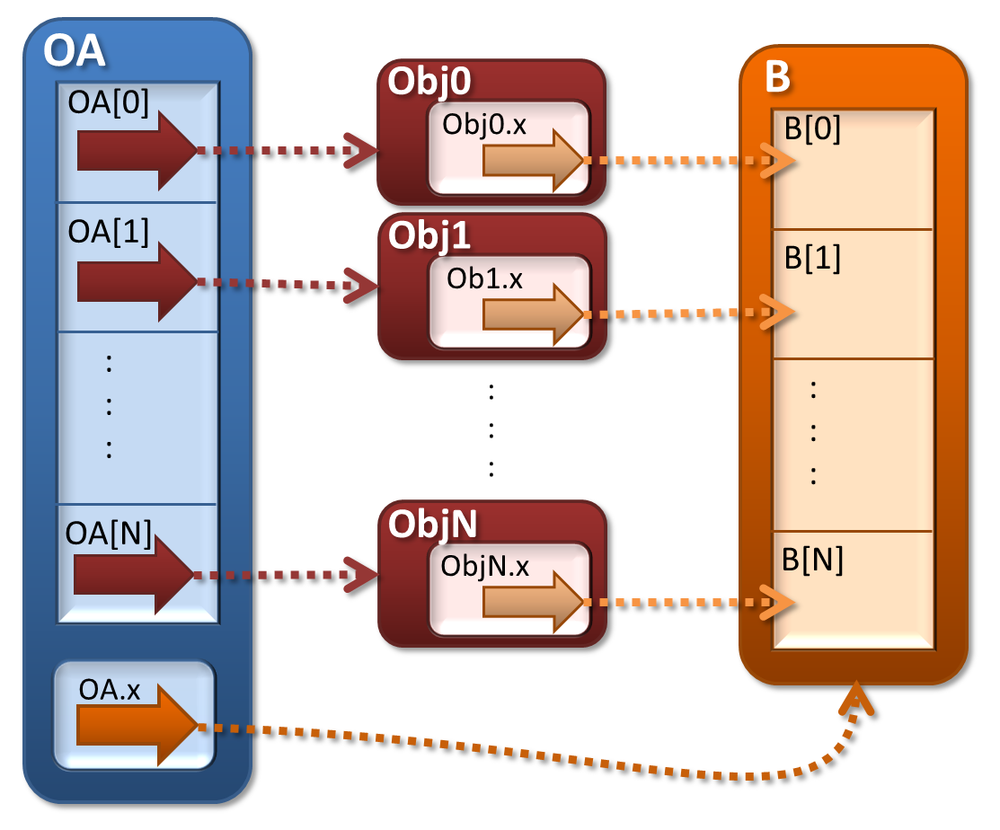

:author: Justin C. Fisher
:email: fisher@smu.edu
:institution: Southern Methodist University, Department of Philosophy
:corresponding:

-------------------------------------------------------------
ObjArray: Better Integrating Python Objects with NumPy Arrays
-------------------------------------------------------------

.. class:: abstract

   There are many well-known benefits of Object Oriented Programming (OOP), including allowing hierarchically classed objects to possess and inherit diverse attributes and methods.  There are also well-known benefits of Numeric Python (NumPy) arrays, including speed, flexible indexing, and a vast library of powerful functions.  It has been quite cumbersome for Python programmers to enjoy both sorts of benefits at the same time.  Python's objects offer extensive OOP, but cannot easily be used with NumPy.  NumPy's structured record arrays and Pandas' dataframes offer NumPy virtues but only an approximation of OOP.  NumPy also allows arrays of Python objects, but these provide only NumPy's indexing, not straightforward access to OOP attributes or methods, nor direct access to the vast library of fast NumPy functions.  Instead, programmers who want to enjoy both OOP and NumPy have needed to write many explicit loops/mappings/comprehensions to copy arrayed objects' attributes into NumPy arrays and vice versa.  ObjArray offers a solution to this problem, providing NumPy users intuitive dot-idiom access to OOP attributes and methods.  So, for example, ``people[ people.age < 18 ].grow(1)`` does exactly what you would intuitively expect it should do, namely, for each person with age less than 18, this calls that person's grow method with argument 1.  ObjArray does this while providing full access to the speed, power, and flexible indexing of NumPy. (ObjArray is available at ``www.justin-fisher.com/research/objarray/`` and is freely distributed under a liberal BSD license.)
   
.. class:: keywords

   Python, NumPy, Object-Oriented, Object, Array, Vectorized

1.  Introduction.
-----------------
 
There are many well-known benefits of Object Oriented Programming (OOP), including allowing hierarchically classed objects to possess and inherit diverse attributes and methods.  There are also well-known benefits of Numeric Python (NumPy) arrays, including speed, flexible indexing, and a vast library of powerful functions. [Atr01]_  Existing data structures tend either to focus on providing NumPy benefits at the expense of providing only a semblance of OOP, or else to focus on familiar Python objects at the expense of not being directly usable by most NumPy functions.  This paper explores the question of whether there might be better ways to integrate OOP and NumPy, such that programmers might be able to enjoy the full benefits of both at the same time.  This paper describes a package, ObjArray, and compares ObjArray to existing alternatives, both qualitatively and with quantitative benchmarking.

In the remainder of this section, eight goals are stated that any integration of OOP and NumPy should meet.  Many existing data structures meet some of these goals, including Python's nested lists, NumPy's record arrays, and Pandas' dataframes.  However, it will emerge in Section 2 that none meet all these goals.  Section 3 describes an alternative approach, implemented in the ObjArray package.  ObjArray is based upon NumPy's ndarrays with dtype=object, but uses "magic methods" to allow for OOP-style dot-idiom access to arrayed objects' attributes and methods.  Section 4 describes a mechanism for permanently coupling arrayed objects' attributes with a NumPy numerical array (or with a column of a Pandas dataframe), such that changes to the array will thereafter automatically be synchronized with changes in the corresponding objects' attributes, while the array can always participate in full-speed NumPy operations.  Section 5 provides benchmarking to confirm that an unoptimized "proof of concept" implementation of ObjArray already compares admirably to alternative approaches.  Section 6 concludes with discussion of the potential drawbacks of heavily using "magic methods" as ObjArray does, and of potential future developments for ObjArray. 

1.1. Object-Oriented Goals.
===========================
	**O1.  Familiar Python objects in familiar class hierarchies.** A good integration of Python OOP and NumPy should make it easy to take code that began as pure Python OOP and to expose the attributes of arrayed Python objects for use in fast NumPy functions.  In particular, object arrays should contain familiar Python objects, situated in familiar class hierarchies.  For example, if A is a list, tuple, or array of ordinary Python objects, a simple command like ``OA = ObjArray( A )`` should suffice to create an array of those objects with easy access to the other features listed below. 

	**O2.  Flexible object size and diverse methods.**  Different objects in the same array may contain data of different sizes (e.g., strings of different lengths), and some may possess attributes or methods that others lack.  This flexibility is a distinguishing feature of Python's OOP and is appreciated by many programmers.  NumPy itself does not generally allow this sort of flexibility, but a good integration of OOP with NumPy should. 

	**O3.  Attributes of arrayed objects should be collectively accessible by familiar dot idiom.**  If ``Adam`` is an individual object, then all Python programmers know that ``Adam.height`` probably returns Adam's height attribute.  We should support parallel behavior for arrays of objects.  For example, if ``people`` is an array of person objects, then ``people.height`` should return an array the same shape as ``people``, containing each person's ``.height`` attribute. 

	**O4.  Methods of arrayed objects should be collectively callable by familiar dot idiom.**  Similarly, for individual objects, we all know that ``Adam.grow(1)`` will call Adam's ``.grow`` method, with Adam being passed in as an implicit "self" argument, and 1 being passed as the explicit argument.  We should support parallel behavior for arrays of objects, so ``people.grow(1)`` should call each person's grow method on herself with argument 1, and ``people.grow(people.height)`` should call each person's grow method on herself with her own height as the argument. 

Python provides these four OOP features for individual objects, but does not offer them collectively for objects organized into arrays.  Instead, programmers who want to use OOP features for arrayed objects typically must write explicit loops (or mappings or comprehensions) to deal with the objects one at a time.  It would be better if OOP could also achieve some of the goals NumPy accomplishes by allowing fast and powerful "vectorized" operations to operate upon many arrayed objects at once.

1.2.  NumPy Goals.
==================
	**N1.  Speed.**  Interpreted Python code is often notoriously slow, whereas NumPy allows for comparatively fast operations over whole arrays at once.  A good integration of Python OOP with NumPy must easily allow for full speed NumPy operations involving the attributes of arrayed objects.  For example, ``people.height.mean()`` should use NumPy's ``mean`` function to average the arrayed people's heights.

	**N2.  Vast library of powerful functions.**  There exist many powerful and freely available functions that operate on NumPy arrays, including functions in NumPy, SciPy [Atr02]_, and other packages.  A good integration of OOP and NumPy should make it easy to expose arrayed objects' attributes to many of these existing functions.

	**N3.  Vectorized operations, notation and broadcasting.**  NumPy allows programmers to use concise code to execute vectorized operations that act upon many array elements at once without the coder needing to write any explicit looping, nor even to pay much ongoing attention to the internal structure of the arrays.  For example, ``A1 > (A2 * 1.3)`` yields a Boolean array with the same shape as arrays A1 and A2 (when broadcast together), which is True wherever the stated inequality holds between corresponding elements of these arrays, something that many languages would require be written with explicit loops, yielding tediously convoluted code at best and hard-to-notice bugs at worst.  We should allow a similar level of crisp clean abstraction for operations involving object attributes.  For example, ``obese = people.weight > (people.height * 1.3)`` should also produce a Boolean array.  In addition, such concise vectorized notation should automatically broadcast compatible arrays in the ways NumPy users intuitively expect.  For example, in the above calculations the scalar 1.3 is broadcast to match the shape of the arrays.  This concise notation and broadcasting should apply not just for attributes of arrayed objects (as in O3 above), but also for vectorized method calls (as in O4).

	**N4.  Indexing and Slicing.**  Any good integration of OOP and NumPy must allow full use of NumPy's excellent slicing and indexing tools.  It should also allow for object attributes to easily play a role in the criteria for "fancy indexing".  So, for example, ``people[ people.age > 18 ]`` should generate a new array containing just those people whose age attribute is greater than 18. 

2.  Existing ways of integrating Python OOP with NumPy.
-------------------------------------------------------
In this section, I consider various existing ways of integrating NumPy arrays with OOP.  Each falls short of the goals laid out above, but we may be able to combine insights from these to achieve a better solution.

2.1.  Python Structures.  
========================
Python itself includes several array-like structures, including nested lists and Python arrays.  The main advantage of these is (O1 and O2) that these can contain ordinary Python objects of variable size.  However, these offer no collective access to the attributes and methods of the contained objects (O3 and O4), nor do they offer any of the NumPy benefits (N1-N4), so to use these with NumPy one typically must explicitly copy attributes of objects to and from NumPy arrays.  When searching for a starting point for a better integration of OOP and NumPy, it makes sense to seek something that is more closely situated to NumPy and hence can more easily provide at least some NumPy benefits.

2.2.  NumPy's Record Arrays and Pandas' Dataframes.  
===================================================
NumPy's record arrays allow multiple attributes to be condensed into a single entry in a NumPy array, and allow access to these attributes via dot-idiom (O3).  Similarly, dataframes in the popular NumPy extension Pandas [Atr03]_ provide dot-idiom access along potentially heterogeneous rows  or columns of a tabular 2D array, or the third-party Pandas extension Xarray [Atr04]_ provides similar functionality for multidimensional arrays.  Each allows for fancy indexing and full participation in the vast library of fast NumPy functions (N1-N4).  Unfortunately, record arrays and dataframes fall short of other object-oriented goals:

	**O1.**  Record arrays and dataframes do not contain familiar Python objects, but instead what we might call "record objects" and "Pandas objects", new sorts of entities that provide only an approximation of some OOP features.  Record objects and Pandas objects do not participate in class hierarchies in the ways that OOP programmers would expect.

	**O2.**  Each record array and dataframe must pre-declare a finite list of attributes that the arrayed record objects or Pandas objects will all possess, each with a fixed size in bytes.  This forbids the flexible object-sizing that many Python programmers expect.

	**O4.**  Record arrays and dataframes provide no straightforward means to write or collectively call methods of arrayed objects.  Pandas dataframes do possess an ``apply`` method, which can apply a single method to all arrayed Pandas-objects.  However, this does not call a method of the objects themselves, so does not allow for different objects to have different methods with the same name (as might happen for Python objects of different subclasses, or in other cases of Python's ubiquitous "duck typing").  The applied method also cannot change an object's attributes, and has no access to other methods of the object nor to any attributes that are not in the dataframe.  In addition to all these functional shortcomings, it would also be preferable to use a simple dot idiom like ``people.grow(1)`` rather than the Pandas near-equivalent ``people.apply('grow', args=(1,) )``. 

For some users, especially users who appreciate Pandas' other features for handling tabular data, record arrays or Pandas dataframes may provide a close enough approximation to the object-oriented goals (O1-O4).  However, there is still much room for improvement, at least for anyone who wanted to use NumPy with arrays of ordinary Python objects, with all their internal flexibility, class hierarchies, and idiosyncratic methods.

One might hope somehow to modify record objects or Pandas objects to make them better able to provide OOP features like those of Python objects.  Even if one did manage to reinvent the wheel in this way, one would still end up in the awkward circumstance of having two "separate but not quite equal" forms of OOP available to Python programmers:  original Python objects and whatever modified version of record objects or Pandas objects we manage to produce.  The present paper and the ObjArray package instead aim to provide an interface between familiar Python objects and fast NumPy operations, not to make programmers learn to use some new sort of record object or Pandas object that mimics some OOP features.  So, record arrays and dataframes will not be of much direct use here.  There is however some value to the idea that we might want some attribute values of arrayed objects to be permanently stored together in a Pandas dataframe or other NumPy array, an idea revisited in Section 4.

2.3.  NumPy arrays with dtype=object.
=====================================
Most NumPy arrays have a numerical dtype, like integer or float, and store numerical values together in a block of memory.  However, NumPy arrays with dtype=object instead store pointers to ordinary Python objects, and when an individual element of such an array is accessed, the pointed-to object is returned.  These arrays provide some OOP and NumPy benefits, but don't fully deliver in either category.

	**O1 and O2.**  Fortunately, these arrayed objects are ordinary Python objects (not mere "record objects" or "Pandas objects") so they display the familiar class hierarchy and flexible sizing that we expect of Python objects.

	**O3.**  Unfortunately, there is no simple way to produce an array containing a given attribute of the arrayed objects.  Instead programmers need to explicitly copy attribute values into arrays when they want to use NumPy--e.g., using something like ``oldheights = np.array( [person.height for person in people] )``--and then explicitly copy new attribute values back into objects when they want to use OOP again--e.g.,  using ``for person,newheight in zip(people, newheights): person.height = newheight``.  Of course, things get even more convoluted for arrays with multiple dimensions that the coder somehow needs to iterate over.  It would be preferable to forego the explicit looping, and just use ``oldheights = people.height``, and ``people.height = newheights``. 

	**O4.**  Unfortunately, there also is no simple way to call methods of arrayed objects.  Programmers end up again needing to loop explicitly over the objects or to construct custom vectorized "ufuncs".  Neither of these options comes anywhere near the beautiful simplicity of ``people.grow(1)``.

	**N1, N2 and N3.**  Unfortunately, extremely few NumPy functions work when dtype=object.  Instead, one typically must first explicitly construct new arrays with numerical dtypes, as in O3.

	**N4.**  Fortunately, NumPy's slicing and indexing generally ignore the dtype of array elements, so can be used on arrays of dtype=object.  Unfortunately, there is no straightforward way to use object attributes as a criterion in "fancy indexing", without again using explicit loops as in O3.

Pessimists might view the preceding as a "glass half empty."  NumPy arrays with dtype=object lack many features we expect from NumPy arrays, and force us to write numerous loops to copy values out of arrayed objects into "real" NumPy arrays when we want to do fast NumPy operations and then to copy updated values back into objects when we want to do OOP again.  This "half empty" feeling leads many NumPy programmers to eschew object arrays and the comforts of OOP, and instead to settle for the austere efficiency of forcing everything into numerical arrays as much as possible.

Optimists might instead see this as a "glass half full."  Arrays with dtype=object are arrays of ordinary Python objects with their class hierarchy (O1) and highly flexible internal structure (O2).  They also provide flexible NumPy slicing (N4).  The main ways this solution falls short involve the explicit loops programmers must use (O4) to call methods of all arrayed objects, and (O3) to copy objects' attribute values to and from arrays whenever they want to switch between fast NumPy operations and convenient OOP.  Fortunately, many of these  explicit loops do the very same things, so it is quite straightforward to automate them.  And part of the (perhaps diabolical) genius of Python is that it allows "magic methods" that hide heavy-duty automation behind innocuous-looking syntax.  So, all we need to make our "glass almost entirely full" is just to create magic methods that provide clean, intuitive syntax for doing the same things that all these explicit loops were doing.  (Better still, one could also devise ways to minimize how often such automated operations actually will need to loop through and copy a lot of data--more on that in section 4.)  

3.  Ad Hoc Transfers and Method Calling.
----------------------------------------
Drawing upon the optimistic "glass half full" perspective from the preceding section, the ObjArray package employs NumPy arrays with dtype=object.  ObjArrays will typically be created by ``OA = ObjArray(A)``, where A can be any list, tuple, or array of Python objects.  This returns a view of A as a NumPy ndarray of subclass ObjArray and dtype=object.  

ObjArray employs various "magic methods" to enable dot-idiom access to the attributes and methods of arrayed objects.  This access comes in two forms.  Ad hoc methods (discussed in this section) iterate through an ObjArray doing something appropriate with each object, in much the same manner as the explicit loops described in section 2.3.  Since such looping is relatively slow (on NumPy timescales), ad hoc methods are best used in moderation--e.g., once to copy attribute values of arrayed objects into one or more NumPy arrays upon which to perform a batch of intensive calculations, and once again to copy values from an output array back to the attribute values of Python objects.  Coupled buffers (described in Section 4) allow us to dispense with much of this repeated copying back-and-forth, but lack some flexibility of ad hoc methods.  

3.1. Ad Hoc reading.
====================
Ad hoc reading aims to meet goal O3: reading the values of a particular attribute of arrayed objects and packaging these together into an array that can participate in fast NumPy operations.  For example, this will allow ``people.height`` to yield an array with the same shape as ``people``, each of whose elements is the ``.height`` attribute of the corresponding person.

To allow this, the class ObjArray has a special ``__getattr__`` method that catches all failed attempts to retrieve an attribute from any ObjArray itself, and instead redirects those attempts to retrieve that attribute from the various objects in the ObjArray and to package those attribute values together in a new array.  If OA is an ObjArray, then ``values = OA.x`` will return a new array whose initial dimensions match OA and whose contents match the corresponding ``.x`` attribute-instances for the objects in OA, including whatever dimensions those instances have.  For example, if OA is a 5x5 ObjArray, and each ``.x`` instance is a 3x3 array of integers, then ``OA.x`` would return a 5x5x3x3 array of integers.  The shape and dtype of attribute instances is automatically determined by sampling a member of OA, or you can manually specify these with keyword arguments, via the more verbose ``OA.read_attr(attr_name, shape=None, dtype=None, default_value=None)``.  The returned array will employ the specified/sampled shape and dtype, and objects' attribute values will be broadcast and recast to fit that shape and dtype wherever possible (and will generate an error otherwise).  If an arrayed object lacks the relevant attribute, it will be replaced with ``default_value``, if given; otherwise an error will be generated.  This more verbose command can also be used to read past an existing attribute of an ObjArray itself to get an ad hoc reading of attributes of its members:  e.g., ``OA.shape`` will return OA's own .shape attribute, whereas ``OA.read_attr('shape')`` will return an array of the .shape attributes of OA's objects.

Ad hoc read operations support slicing in two ways.  First, you can slice OA itself before reading, e.g., ``values = OA[0:2].x``.  Since a slice of an ObjArray is another ObjArray, slices support ad hoc reading too.  Second you can slice the array produced by ad hoc reading, e.g., ``values = OA.x[0:2]``.  The former way is often preferable because it reduces the number of items that ad hoc reading must iterate through, but only the latter way allows you to slice into the internal structure of attribute instances if they are arrays themselves.  You can use both ways of slicing in rapid succession, so long as you pay careful attention to the shapes of the two arrays you'll be slicing. 

3.2.  Ad hoc writing.
=====================
``OA.x = newvalues`` is the converse ad hoc write operation.  It broadcasts newvalues to match the shape of OA, and then stores those values as the ``.x`` attribute instances of the corresponding objects of OA.  For example, ``people.height = 50`` would set everyone's height to 50, and ``people.height = people.height+1`` combines ad hoc reading of old heights and ad hoc writing of new incremented heights (or ``people.height += 1`` works fine too).

Unfortunately, the Python language forces writing to be more complicated than reading.  For ad hoc reading, the class ObjArray defines a blanket ``__getattr__`` method that triggers only upon a failed attempt to retrieve any attribute from an ObjArray itself.  This allows attempts to read ordinary attributes of arrays, like ``OA.shape``, to happen at full speed.  Unfortunately Python has no parallel blanket ``__setattr__`` method that triggers only in cases where an attribute does not already exist.  One could override ObjArray's ``__setattr__`` method, but doing so would slightly slow all attempts to set an ObjArray's own attributes, including its NumPy attributes.  For most purposes, this slowdown might be negligible, especially because arrays with dtype=object usually don't participate in many time-sensitive operations anyway.  Even if one opted to embrace this slowdown, it still would be difficult to distinguish attempts to set a new attribute of the ObjArray itself from attempts to set a new attribute of the arrayed objects.  

For these reasons, ObjArray's dot idiom for ad hoc writing requires some form of prior declaration that an attribute name is to be treated as a writeable attribute of arrayed objects, rather than as a writeable attribute of the ObjArray itself.  This prior declaration can be done explicitly in ObjArray creation (e.g., with ``people = ObjArray(list_of_persons, attributes=('age','height') )`` ).  More often, the prior declaration is done implicitly: e.g., ad hoc reading an attribute implicitly declares it to be eligible for later writing.  Explicit and implicit declarations both cause a factory to create a new property for the class ObjArray (or for whatever subclass of this you create and employ) whose ``__set__`` method intercepts attempts to set ``OA.x`` and redirects and broadcasts these to the ``.x`` attributes of the arrayed objects (except when ``OA.__dict__`` already contains an entry for 'x', in which case that is modified).  ObjArray gives precedence to existing attributes of arrays like ``.shape``, so object attributes with the same name as array attributes cannot be collectively accessed by dot-idiom, but they can still be collectively accessed by the more verbose ``OA.read_attr('shape')`` and ``OA.write_attr('shape', new_shape)``.

3.3.  Ad hoc method calling.
============================
A third type of ObjArray ad hoc operation allows one to use a single command to call a method of each arrayed object with NumPy-style broadcasting of arguments (goal O4).  This allows ``people.grow(1)`` to call each person's ``.grow`` method with the argument 1 automatically broadcast across the array, and it allows ``people.grow( people.height )`` to call each person's ``.grow`` method with her own ``.height`` as the argument.  The outputs returned by the called methods are collected together in an array and returned.  This allows for crisp, clean, easy-to-debug code (satisfying goal N3).

4.  Coupled Buffers.
--------------------
The above ad hoc operations are fairly slow by NumPy standards, because each must iterate through all objects in an ObjArray.  This slowdown will likely be minor in comparison to OOP Python operations done on many objects.  However, in cases where one frequently wants to access and update information from both object-side and array-side, a coupled buffer can provide much better performance.  

Coupled buffers imitate one of the best features of NumPy's record arrays and Pandas' dataframes (section 2.2), namely the idea of permanently storing the attribute values for arrayed objects together in an array themselves, where they'll always be ready to participate in fast NumPy operations, with no need ever to loop through all the objects themselves to copy their attributes to or from a separate array.  Record arrays used this arrangement for all attributes of the record-objects, which forced these objects to have only a pre-specified number of attributes with pre-specified byte-size, and thereby violated (O2) our desire for flexible object-size.  ObjArray's coupled buffers avoid this forced rigidity by coupling only select attributes, which allows that objects may possess other (uncoupled) attributes of varying size, and that some objects in an array may possess (uncoupled) attributes that others lack.  

4.1.  Coupling NumPy Arrays.
============================

The easiest way to create a coupled buffer is with ``B = OA.new_coupled_buffer( 'x' )``.  This creates a new "buffer" array by a process much like ad hoc reading, copying each object's ``.x`` attribute value into the corresponding part of the buffer.  Then each object's attribute instance is effectively replaced with a NumPy view of the appropriate part of the buffer.  The result is that any subsequent changes to an object's ``.x`` attribute will automatically update the coupled portion of the buffer, and conversely any changes in the buffer will automatically be accessible from the corresponding objects' attributes, all without any additional steps from the programmer.  In effect, this will have relocated all attribute instances to be contiguous in memory in the buffer, which allows them to participate in all sorts of fast NumPy operations. The buffer will also be set as OA's own ``__dict__`` entry for 'x' (and this ``__dict__`` entry will be deferred to by the ``.x`` descriptor of the ObjArray class, which we saw above was needed to allow ad hoc writing), so subsequent retrievals of ``OA.x`` will quickly return the buffer rather than doing slow ad hoc reading, and hence you can continue referring to it as ``OA.x`` if you like without any notable loss of speed.  (See Figure 1.)

   **Depiction of an ObjArray OA whose .x attribute is coupled to buffer B.**  Like any ndarray, OA stores its indexed data in a contiguous block of memory: OA\[0]...OA\[N].  Since OA has dtype=object, this data consists of pointers to the Python objects arrayed "within" OA:  Obj0, Obj1, ... ObjN.  OA also has its own attribute OA.x, which is a view of the entire buffer B.  During coupling, each arrayed object's .x attribute is made to be a property that provides a view of the corresponding portion of the buffer.  When an object's .x property is read, the corresponding buffer content is returned, and when that .x property is set to a new value, the new value is stored in the buffer.  Hence any changes to the buffer automatically appear as changes to object attributes and vice versa.
  
Coupling to an existing array is allowed via ``OA.couple_to_array(attr_name, A)``.  This can be especially useful if you already have the values that you want for an attribute, especially one that doesn't exist yet in some or all of the objects, and/or if you want to ensure that the buffer for some ``OA.x`` will be located contiguously in memory with some other data, e.g., the buffer for some other ``OA.y``, as such contiguity can be useful for some NumPy operations. For this latter usage, you would typically first allocate a double-sized buffer, then manually couple half of it to ``'x'`` and the other half to ``'y'``.

Each attribute of each object can be coupled to only one buffer at a time!  To be coupled to a buffer, an object's attribute would need to store its value contiguously to those of the other objects in the same ObjArray, and that is (typically) incompatible with also storing its value contiguously to those of other objects in some other ObjArray. It is fine to have the same object be a member of multiple ObjArrays, but, for each attribute, no more than one of those ObjArrays should be coupled.  Best practice will usually be, for each attribute, to find the one array of objects you'll most often want to do vectorized NumPy operations on (or on slices from it) and couple that array, and then use ad hoc operations to read from or write to any other ObjArrays involving those same objects.  

Coupling an object's attribute to a buffer creates a property with the same name in that object's class. (It would have been ideal to give this property just to the arrayed objects themselves, but one constraint of the Python language is that properties must be defined for classes, not their members.) This property is needed to ensure that attempts to set a coupled attribute instance won't break the coupling (when an object's attribute is assigned a new value, that new value should be put into the buffer, not displace the object's view of that subbuffer), and to allow attribute retrieval to yield a scalar value (rather than a tiny subarray containing just the scalar, which is technically what scalar attributes actually get coupled to). This new property will attempt to be as invisible as possible.  However, this precludes coupling "attributes" that were actually properties already. Typically you wouldn't want to do this anyway, because properties are useful for redirecting attempts to get/set them to third parties, whereas the point of coupling is instead to redirect such attempts to the buffer.  Also, the main advantage of coupling is that fast NumPy operations can alter the buffer and thereby effectively alter object attributes without needing to call anything like a ``__set__`` method for each object, whereas settable properties are intended to call a ``__set__`` method whenever an object's property is set to a new value, which would be so slow as to defeat the purpose of coupling.

Coupled buffers experience no slowdown at all for NumPy operations on the buffers, which are usually the operations for which speed is most crucial (goal N1).  Coupling may cause slight slowdown accessing or changing attributes from the object side though, because these operations are redirected to the relevant portion of the buffer.  This slowdown might be significant by NumPy standards, but not by the standards usually applicable for Python code that operates on objects one at a time.  

4.2.  Coupling Pandas Dataframes and SQL-Style Queries.
=================================

Pandas' ``dataframe`` is a subclass of NumPy's ``ndarray``, so slices of dataframes are themselves NumPy arrays, and hence can be coupled to ObjArray attributes, e.g. using ``OA.couple_to_array('x', df.x)``.  Hence, Pandas users can straight-forwardly employ ObjArray too.  (Future versions of ObjArray may further streamline this integration, e.g., allowing coupling of multiple attributes at once, or even coupling all attributes labeled in a dataframe.)  Coupled dataframes can allow Pandas users to write full-fledged OOP code, and to have its execution automatically produce the appropriate changes in a dataframe, while changes in the dataframe similarly automatically effectively produce changes in object attributes.  This also allows Pandas users to employ objects that participate in class hierarchies, that possess some (non-coupled) attributes of arbitrary size, and that possess other (coupled) attributes that are situated in a dataframe for fast NumPy or Pandas operations. 

This form of coupling can also allow for SQL-style queries of attributes of objects in an ObjArray, using Crouching Alchemy Hidden Pandas to query the coupled dataframe. [Atr05]_ This would allow one to deal with arrayed objects as Python objects, and/or to access their attributes as NumPy arrays or Pandas Dataframes, and/or to query them SQL-style, with all synchronization between these different views of the same underlying data being done automatically behind the scenes.

5.  Benchmarking.
-----------------
Everything described above is implemented in the ObjArray package (available at ``www.justin-fisher.com/research/objarray/`` and freely distributed "as is" under a liberal BSD license).  This implementation is in pure Python 3.5, with use of NumPy iterators and broadcasting.  This provides a positive "proof of concept" showing that the eight goals described above can all be met.  This proof of concept is already quite useful for many purposes.  Although little effort has been made to optimize this proof of concept, benchmarking results may still be of some interest.  Unfortunately, straight-forward comparisons are somewhat difficult to make, in large part because the claimed advantages of ObjArray often involve offering brief familiar syntax for tasks that other approaches either cannot perform at all, or can perform only using longer or less familiar syntax.  For this reason, time comparisons capture at best a part of the story.  Still, it may at least be heartening to see that ObjArray performs quite well in time comparisons.

The following tests were all run on an Intel i7 3.4Ghz processor running Windows 7 and CPython 3.5.  Reported times are the minimum time needed in ten repeated trials.  Unless otherwise specified, array shape is 1000 x 1000 (aside from the Pandas dataframe which is limited to being 2D, with one dimension being reserved for the attributes, so its other dimension is set to 1,000,000 to encompass the same number of objects).  All numbers are 64-bit floating point.  

5.1. Reading Benchmarks. 
========================

For each approach, benchmarking begins with information stored in the default format for an array of objects in that approach, and then an array containing the .x attribute of each object is constructed or retrieved.  We should expect that the three formats that store object attributes contiguously in NumPy arrays (i.e. record arrays, data frames, and coupled buffers) will be near-instantaneous, while the approaches that instead store their data in some other format should be comparatively slow.

.. table:: Reading Benchmarks. :label:`rtable`

   +----------------------------------+--------------+
   | *ObjArray Coupled Buffer*        | 0.0006 ms    |
   +----------------------------------+--------------+
   | *Pandas Dataframe*               | 0.0094 ms    |
   +----------------------------------+--------------+
   | *NumPy Record Array*             | 0.0187 ms    |
   +----------------------------------+--------------+
   | *Dtype=object, loop via ndindex* | 914.3398 ms  |
   +----------------------------------+--------------+
   | *ObjArray ad hoc reading*        | 1044.3318 ms |
   +----------------------------------+--------------+

   
As expected the top three are near-instantaneous.  Coupled buffers are fastest, because coupled buffers retain a direct link to the array to be returned, wheres record arrays and dataframes instead must slice this out of a larger array.  It may be worth reiterating though, that record arrays and dataframes do not contain ordinary Python objects, so they traded away a great deal of OOP flexibility for their speed.  ObjArray coupled buffers are the top performer overall, and are approximately a million times faster than any alternative that also employs ordinary Python objects.

The bottom two approaches both use NumPy's ndindex to govern their iteration.  ObjArray's ad hoc reading is a bit slower than a manually written ndindex loop, due to overhead that enables ObjArray to handle a more general range of cases.  Still, these differences are quite small, and may be offset by ObjArray's ease of usage, allowing us to write ``OA.x`` rather than needing first to create an output array and then populate it with an explicit loop like ``for i in np.ndindex(OA.shape): output[i]=OA[i].x``.

For full disclosure, benchmarking also revealed that nested Python ``for`` loops are actually faster than ndindex, often by a factor of 3.  Unfortunately, nested for loops do not generalize easily to arbitrary numbers of dimensions, so cannot provide a straightforward general solution.  Still, this indicates that optimization could improve the performance of ObjArray's ad hoc iterations, e.g., by using nested for loops for common small numbers of dimensions, and reserving ndindex for unusual large numbers of dimensions.  Such optimization would make ObjArray's own code much longer and less readable. Since the current version of ObjArray is intended mostly as a proof of concept, this sort of optimization has not been attempted. Future versions may employ this form of optimization, or perhaps better, may reimplement these iterations in C.

It also should be acknowledged that initially coupling an array itself takes time, on the same order of magnitude as ad hoc reading. If an attribute of arrayed objects will be copied to or from an array at least several times, coupling will outperform ad hoc reading.  However, it would take a large number of repetitions for the slight speed advantage coupled buffers enjoy over record arrays and dataframes to overcome the increased upfront costs, though for many real-time processing purposes it is desirable to shift as much processing as possible up front (to the "loading screen") to minimize on-the-fly costs, which is precisely what coupled buffers do.  So, coupled buffers may or may not be preferable for speed reasons.  Regardless, coupled buffers enjoy the significant advantage of enabling the use of familiar Python objects, rather than "record objects" or "Pandas objects".

5.2. Writing Benchmarks. 
========================

For each approach, we begin with a NumPy array containing new values, and an array of objects stored in the default value for that approach, and then copy the new values in to overwrite the .x attribute of those objects.  We should expect that there will still be some advantage for the three approaches that store object attributes contiguously in NumPy arrays and use NumPy's C-routines to perform the copying.  However, every approach will require some time to copy the new values, so the differences between approaches should be less striking.  

.. table:: Writing Benchmarks. :label:`wtable`

   +----------------------------------+-------------+
   | *ObjArray Coupled Buffer*        | 0.69 ms     |
   +----------------------------------+-------------+
   | *NumPy Record Array*             | 2.81 ms     |
   +----------------------------------+-------------+
   | *Pandas Dataframe*               | 8.23 ms     |
   +----------------------------------+-------------+
   | *ObjArray ad hoc writing*        | 724.69 ms   |
   +----------------------------------+-------------+
   | *Dtype=object, loop via ndindex* | 840.26 ms   |
   +----------------------------------+-------------+
   

The results are as expected and qualitatively similar to the reading tests above.  One interesting difference is that ObjArray's ad hoc writing is now slightly faster than a manual loop using ndindex.  This difference is attributable to ObjArray's utilizing a multi-indexing option of ndindex, whereas the tested manual loop instead took a simpler form more likely to be produced by someone who wrote this manually: ``for i in np.ndindex(OA.shape): OA[i].x=new_vals[i]``  
	
5.3. Method-Calling Benchmarks. 
===============================

Method-calling is difficult to benchmark, because most of the approaches we've considered do not allow for any form of collective calling of methods of objects.  Most of the values reported below involve a manually written loop using ndindex.  The exceptions are the two ObjArray tests (which allow straightforward calling) and the Pandas DataFrame test, which uses Pandas' ``apply``.  As noted in Section 2, Pandas' ``apply`` has severe limits in functionality, so the present test was restricted to stay within those limits.  The present test is intended to time the overhead used in generating iterated method calls, not the time consumed within the method calls themselves, so a quite simple method was tested, one that simply returned the product of an object's .x, .y, and .z attributes.  For approaches that employ ordinary Python objects, this was a method of the objects themselves.  For record arrays and Pandas dataframes, the called method was instead a separate function.  

.. table:: Method-Calling Benchmarks. :label:`mctable`

   +------------------------------------------+--------------+
   | *Dtype=object, loop via ndindex*         | 2.3 seconds  | 
   +------------------------------------------+--------------+
   | *ObjArray call with pre-buffered method* | 6.8 seconds  |
   +------------------------------------------+--------------+
   | *ObjArray ad hoc calling*                | 7.9 seconds  |
   +------------------------------------------+--------------+
   | *NumPy Record Array*                     | 20.0 seconds |
   +------------------------------------------+--------------+
   | *Pandas Dataframe ``apply``*             | 48.7 seconds |
   +------------------------------------------+--------------+

   
Note the shift in units from milliseconds in the earlier tests to seconds here.  These results are all orders of magnitude slower than the reading and writing tests above, due mostly to Python's overhead in making repeated method calls.  Record arrays and especially Pandas dataframes are exceptionally slow, due to the costs of generating individual record-objects or Pandas-objects to pass as arguments to a method. (Pandas' ``apply`` offers a ``raw=True`` setting that passes simple ndarrays as the argument to the applied method rather than full-fledged Pandas objects.  This yields competitive speed, but at the significant cost of no longer allowing the applied method to use dot-idiom for object attributes.)  The other three results are all based upon arrays with dtype=object.  A manual loop is somewhat faster than ObjArray's implementation, because ObjArray includes overhead to allow for a much broader range of cases, including cases where an arbitrary number of arguments may need to be broadcast or iterated over to be sent as arguments to the respective method calls.  ObjArray can achieve some speedup in calling by pre-buffering an ObjArray containing the relevant methods of the respective objects, which eliminates the need to create this array on the fly.  Python evaluates ``OA.method(args)`` by first evaluating ``OA.method`` and then calling the resulting entity's ``__call__`` method with the given arguments.  Pre-buffering ``OA.method`` eliminates the need for that first step, and thereby saves a second as compared to simple ad hoc calling, a result that is compatible with the ad hoc reading test above, which also took approximately a second.  (Future versions of ObjArray may allow pre-declaration or automatic detection of methods, which could achieve this same speedup without any need for explicit pre-buffering on the part of the programmer.)

The slow speed of all approaches on this benchmark may be disappointing.  For many time-sensitive purposes, all these approaches would need to be restricted to arrays much smaller than the million-object array tested here.  For larger arrays, reimplementation with vectorized NumPy operations may be necessary.  However, for smaller or less time-sensitive projects, ObjArray offers competitive speed and notation that is much simpler than the other options.  

6.  The perils of dark magic and a vision of the future.
--------------------------------------------------------

ObjArray provides a positive "proof of concept" showing that the eight goals described above can all be met in a way that performs competitively against alternative approaches, especially when we compare coupled buffers to other approaches employing ordinary Python objects.  This proof of concept is already quite useful for many purposes.  However, performance probably could be further optimized, perhaps by streamlining Python code, or especially by re-implementing inner loops in C to interface more directly with the inner workings of NumPy.  The code is profusely commented, so it should be fairly straightforward for other developers to modify as they please (though the author would appreciate being informed of bug-fixes or improvements).  

Care has been taken to ensure that the "magic methods" ObjArray uses won't be intrusive and won't do anything much different from what one would intuitively expect they should do.  However, such "dark magic" (as it is sometimes pejoratively called) can come with real costs, potentially hiding unexpectedly complex behavior underneath misleadingly simple syntax, which sometimes makes bugs difficult to trace.  It is possible that not all the problematic interactions have yet been foreseen between the various hidden properties ObjArray employs and the many scenarios of use to which ObjArrays might be put.  It will probably take public discussion and widespread testing to identify all these problematic interactions, and to find good remedies (or at least clear cautionary warnings) for them.  

The ideal destination for ObjArray would be for a future version of it to be adopted as a subpackage within NumPy itself (e.g., as ``numpy.objarray``).  It could be incorporated pretty much as is, and would likely be fairly useful to many users as a much more convenient way to make good use of NumPy arrays with dtype=object, providing these arrays with dot-idiom attribute access closely paralleling that which NumPy already provides for record arrays, and that which Pandas already provides for its dataframes.  It would likely be sensible, though, to have this undergo public discussion first, and/or for developers who better understand the under-the-hood workings of NumPy to optimize ObjArray's inner loops in C.

Even without further optimization, this proof of concept already works well enough to be useful in generating code that is simple, intuitive and quite fast.  This demonstrates that the rewards to be gained through this "dark magic" likely will be worth the costs.  Of course, that's what practitioners of dark magic always say.

References
----------
.. [Atr01] Stefan van der Walt, S. Chris Colbert and Gaël Varoquaux. The NumPy Array: A Structure for Efficient 
           Numerical Computation, Computing in Science & Engineering, 13, 22-30 (2011)

.. [Atr02] Jones E, Oliphant E, Peterson P, et al. SciPy: Open Source Scientific Tools for 
           Python, 2001-, http://www.scipy.org/ [Online; accessed 2016-07-30].
           
.. [Atr03] Wes McKinney. Data Structures for Statistical Computing in Python, Proceedings of the 9th Python in Science Conference, 51-56 (2010)

.. [Atr04] Hoyer, S., Hamman, J. (In preparation). Xarray: N-D labeled arrays and datasets in Python. Journal of Open Research Software.

.. [Atr05] Bayer, M.  Crouching Alchemist Hidden Pandas (CALCHIPAN), https://bitbucket.org/zzzeek/calchipan/ [Online; accessed 2016-08-07].
           
