:author: Jyotika Singh
:email: singhjyotika811@gmail.com
:institution: ICX Media, Inc.
:orcid: 0000-0002-5442-3004

:bibliography: paper

------------------------------------------------------------------
Social Media Analysis using Natural Language Processing Techniques
------------------------------------------------------------------

.. class:: abstract

   Social media is very popularly used every day with daily content viewing
   and/or posting that in turn influences people around this world in a variety
   of ways. Social media platforms, such as YouTube, have a lot of activity that
   goes on every day in terms of video posting, watching and commenting. While
   we can open the YouTube app on our phones and look at videos and what people
   are commenting, it only gives us a limited view as to kind of things others
   around us care about and what is trending amongst other consumers of our
   favorite topics or videos. Crawling some of this raw data and performing
   analysis on it using Natural Language Processing (NLP) can be tricky given
   the different styles of language usage by people in today’s world. This effort
   highlights the YouTube’s open Data API and how to use it in python to get the
   raw data, data cleaning using NLP tricks and Machine Learning in python for social
   media interactions, and extraction of trends and key influential factors from
   this data in an automated fashion. All these steps towards trend analysis are
   discussed and demonstrated with examples that use different open-source
   python tools.

.. class:: keywords

   nlp, natural language processing, social media data, youtube, named entitity
   recognition, ner, keyphrase extraction

Introduction
------------

Social media has large amounts of activity every second across the globe. Analyzing
text similar to text coming from a social media data source can be tricky due to
the absence of writing style rules and norms. Since this kind of data entails
user written text from a diverse set of locations, writing styles, languages and
topics, it is difficult to normalize data cleaning, extraction, and Natural
Language Processing (NLP) methods.

Social media data can be extracted using some official and open APIs. Examples
of such APIs include YouTube Data API and Twitter API. One important
thing to note would be to ensure one’s use case fits within compliance of API
guidelines. In this effort, the YouTube Data API will be discussed along
with common gotchas and useful tools that can be leveraged to access data.

One can perform NLP if the text data type is available for analysis. The nature
of noise seen in text from social media sources will be discussed and presented.
Cleaning of the noisy text using python techniques and open-source packages will
be further analyzed. Social media data additionally entails statistics of content
popularity, likes, dislikes and more. Analysis on statistical and text extracted
from YouTube API will be discussed and evaluated.

Finally, trend analysis will be performed using open-source python tools,
social media data, statistics, NLP techniques for data cleaning and named entity
recognition (NER) for a story-telling analytics piece.

Natural Language Processing
---------------------------

Natural language processing (NLP) is the computer manipulation of natural language.
Natural language refers to language coming from a human, either written or spoken.
:cite:`enwiki` defined NLP as follows: NLP is a subfield of linguistics, computer science,
and artificial intelligence concerned with the interactions between computers and
human language, in particular how to program computers to process and analyze
large amounts of natural language data. The result is a computer capable of
"understanding" the contents of documents, including the contextual nuances of
the language within them. At one extreme, it could be as simple as counting word
frequencies to compare different writing styles.
:cite:`bird` mentions, "At the other extreme, NLP involves “understanding” complete
human utterances, at least to the extent of being able to give useful responses
to them. NLP is challenging because Natural language is messy. There are few
rules and human language is ever evolving.".

Some of the common NLP tasks on text data include the following.

1. Named entity recognition

  Named-entity recognition (NER) (also known as (named) entity identification,
  entity chunking, and entity extraction) is a subtask of information extraction
  that seeks to locate and classify named entities mentioned in unstructured text
  into predefined categories such as person names, organizations, locations,
  medical codes, time expressions, quantities, monetary values, percentages, etc.
  Some popular Python libraries that can be leveraged to perform named entity
  recognition for a variety of different entities include SpaCy :cite:`spacy` and
  NLTK :cite:`bird`.

2. Keyphrase extraction

  Keyphrase extraction is the task of automatically selecting a small set of
  phrases that best describe a given free text document. :cite:`CoNLL`
  Some popular tools that can be used for keyphrase extraction as mentioned in
  this article [#]_ include Gensim :cite:`rehurek2011gensim` and RAKE-NLTK[#]_.
  Another way keyphrase extraction can be performed is using NLTK :cite:`bird` methods.
  This implementation is included in the pyYouTubeAnalysis :cite:`pyYouTubeAnalysis`
  library.

  .. [#] https://towardsdatascience.com/extracting-keyphrases-from-text-rake-and-gensim-in-python-eefd0fad582f
  .. [#] https://pypi.org/project/rake-nltk/
  .. [#] https://scikit-learn.org/

3. Unigrams/Bigrams/Trigrams analysis

  Breaking down text into single words, a pair of consecutive written words
  or three consecutively written words and analyzing occurrence patterns.

4. Custom classifier building (public dataset -> features -> ML models)

  If out-of-box solutions do not exist for one's NLP task, building custom
  models to help solve for the problem is an option with the help of available
  data, NLP libraries (such as NLTK [#]_, SpaCy [#]_, and gensim [#]_), and
  Machine Learning libraries (scikit-learn [#]_).

  .. [#] https://www.nltk.org/
  .. [#] https://spacy.io/
  .. [#] https://radimrehurek.com/gensim/
  .. [#] https://scikit-learn.org/

5. Others

  Tokenization, Part-of-speech tagging, Lemmatization & Stemming, Word Sense
  Disambiguation, Topic modeling, Sentiment Analysis and Text summarization are
  some other popularly used NLP tasks. This list is not all inclusive.

A human can only see N number of text samples a day to learn, whereas a machine
can analyze a lot greater than N. Leveraging machines for NLP tasks along with
several processing solutions available with Python, such as multiprocessing [#]_,
can help analyze large amounts of data in a reasonable time-frame.

.. [#] https://docs.python.org/3/library/multiprocessing.html

Potential use cases include the following.

1. Analytics, intelligence and trends

  Analyzing patterns in text based on word occurrences, language, combining
  text occurrences with other available data, topics, sentiment information,
  NLP method outputs, or combinations thereof.

2. Story telling

  Analyzing text using the various NLP techniques along with other statistical and
  other available data aids in converting raw data to an informative story piece
  that helps uncover and understand the patterns that exist within the data.
  Depending on the data available, a time-window analysis can help study patterns
  as they change with respect to time in terms of word usages, topics, text lengths,
  or combinations thereof.

Social Media APIs
-----------------

There are several social media platforms that let you programmatically collect
publicly available data and/or your own published data via APIs. Whatever you
intend to do with this data, it is important to ensure that you use the data in
compliance with the API’s guidelines and terms and services.

Some types of available requests on YouTube include search, video, channel and
comments.

YouTube Data API documentation [#]_ is a great resource to learn more and get started.
At a high level, the getting started [#]_ steps include registering a project,
enabling the project and using the API key generated. With this key, the user can
start making requests to the API to crawl data.

.. [#] https://developers.google.com/youtube/v3/docs
.. [#] https://developers.google.com/youtube/v3/getting-started

Gotchas
~~~~~~~

There are a few items to keep in mind when using the YouTube Data API. Some of
the gotchas while using the api include the following.

1. Rate limits

  The API key registered to you comes with a daily quota. The quota-spend depends
  on the kind of requests you make. API does not warn you in API request response
  if you are about to finish your daily quota but does throw that error once you
  have exceeded the daily quota. It is important to know how your application will
  behave if you hit the quota to avoid unexpected behavior and premature script
  termination.

2. Error handling

  If trying to query for a video, comment or channel that is set to private by the
  owner, the API throws an error. Your code could end prematurely if you are
  querying in a loop and one or a few of the requests have that issue. Error
  handling could help automate one’s process better on such expected errors.

Interacting with the YouTube Data API
~~~~~~~~~~~~~~~~~~~~~~~~~~~~~~~~~~~~~

There are several ways to interact with the YouTube Data API. Some of them are
as follows.

1. Use the API web explorer's "Try this API" section [#]_

2. Build your own code using API documentation examples [#]_

3. Open-source tools

  1. Wrappers of YouTube Data API [#]_ : Libraries that act as wrappers and
  provide a way to use YouTube Data API V3.

  2. pyYouTubeAnalysis :cite `pyYouTubeAnalysis` [#]_ : This library allows the user to
  run searches, collect videos and comments, and define search params (search keywords,
  timeframe, and type). Furthermore, the project includes error handling that allows
  code execution to continue and not stop due to unforeseen errors while interacting with
  YouTube data API. Additional features included in pyYouTubeAnalysis are NLP
  methods for social media text pre-processing mentioned in a later section
  `Data Cleaning Techniques`, NLTK based keyphrase extraction and SpaCy based
  Named Entity Recognition (NER) that runs entity extraction on text.

.. [#] https://developers.google.com/youtube/v3/docs/search/list
.. [#] https://developers.google.com/youtube/v3/quickstart/python
.. [#] https://github.com/rohitkhatri/youtube-python, https://github.com/sns-sdks/python-youtube
.. [#] https://github.com/jsingh811/pyYouTubeAnalysis

Social Media / YouTube Data Noise
---------------------------------

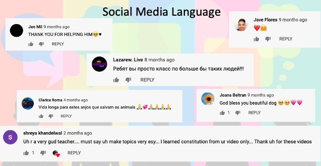

   Random sample of YouTube comments representing writing style diversity.
   :label:`commentsfig`

Text fields are available within several places on YouTube, including video title,
description, tags, comments, channel title and channel description. Video title,
description, tags, and channel title and description are filled by the
content/channel owner. Comments on the other hand are made by individuals
reacting to a video using words and language.

The challenges in such a data source arise due to writing style diversity,
language diversity and topic diversity. Figure :ref:`commentsfig` shows a few
examples of language diversity. On social media, people use abbreviations, and
sometimes these abbreviations may not be the most popular ones. Other than the
non-traditional abbreviation usage, different languages, different text lengths,
and emojis used by commenters are observed.

Data Cleaning Techniques
~~~~~~~~~~~~~~~~~~~~~~~~

Based on some noise seen on YouTube and other social media platforms, the
following data cleaning techniques have been found to be helpful cleaning methods.

1. Removing URLs

  Social media text data comes with a lot of URLs. Depending on the task at hand,
  removing the urls have been observed to come in handy for cleaning the text.
  Remove the URLs prior to passing text through keyphrase or NER extractions has
  been found to return cleaner results. This implementation is also contained in
  pyYouTubeAnalysis.

  .. code-block:: python

     import re

     URL_PATTERN = re.compile(
         r"https?://\S+|www\.\S+",
         re.X
     )

     def remove_urls(txt):
         """
         Remove urls from input text
         """
         clean_txt = URL_PATTERN.sub(" ", txt)
         return clean_txt

2. Removing emojis

  Emojis are widely used across social media by users to express emotions.
  Emoijis provide benefit in some NLP tasks, such as certain sentiment analysis
  implementations that rely on emoji based detections. On the contrary, for many
  other NLP tasks, removing emojis from text can be a useful cleaning method that
  improves the quality of the processed outcome. For named-entity recognition and
  keyphrase extraction, certain emojis are observed getting falsely detected as
  locations or nouns of the type NN or NNP. This impacts the quality of the NLP
  methods. Removing the emojis prior to passing such text through named-entity
  recognition or keyphrase extractions has been found to return cleaner results.
  This implementation is also contained in pyYouTubeAnalysis.

  .. code-block:: python

     import re

     EMOJI_PATTERN = re.compile(
         "[\U00010000-\U0010ffff]",
         flags=re.UNICODE
     )

     def remove_emojis(txt):
         """
         Remove emojis from input text
         """
         clean_txt = EMOJI_PATTERN.sub(" ", txt)
         return clean_txt

3. Spelling / typo corrections

  Some NLP models tend to do very well for a particular style of language and
  word usage. On social media, the language seen can be accompanied with
  various incorrectly spelled words, also known as typos.
  PySpellChecker :cite:`OpenSubtitles2016` [#]_, Autocorrect [#]_ and Textblob
  :cite:`textblob` are examples of open-source tools that can be used for spelling
  corrections.

.. [#] https://pypi.org/project/pyspellchecker/
.. [#] https://pypi.org/project/autocorrect/

4. Language detection and translations

  Developing NLP methods on different languages is a challenging and popular
  problem. Often when one has developed NLP methods for english language text,
  detection of a foreign language and translation to english serves as a good
  solution and allows one to keep their NLP methods fixed. Such tasks introduce
  other challenges such as the quality of language detection and translation.
  Nonetheless, detection and translation is a popular technique while dealing
  with multiple different languages.
  Some examples of Python libraries that can be used for language detection
  include langdetect :cite:`langdetect`, Pycld2 [#]_, Textblob :cite:`textblob`,
  and Googletrans [#]_. Translate [#]_ and Googletrans can be used for language
  translations.

.. [#] https://pypi.org/project/pycld2/
.. [#] https://pypi.org/project/googletrans/
.. [#] https://pypi.org/project/translate/

Trend Analysis Case Study
---------------------------

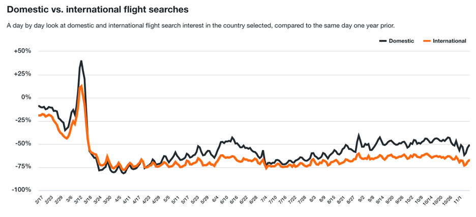

   Domestic and international flight search patterns in 2020.
   :label:`flightsfig`

In the year 2020, COVID hit us all hard. The world went through a lot of changes
in the matter of no time to reduce the spread of the virus. One such impact was
observed massively in the travel and hospitality industry. Figure :ref:`flightsfig`
[#]_ shows the flight search trends between February and November 2020 for domestic and
international flight searches from the US using Kayak. Right before lockdown and restrictions
were enforced starting in March across different places across the globe, a big
spike can be seen in flight searches, correlating with the activity of people
trying to fly back home if they were elsewhere before restrictions disabled
them to do so.

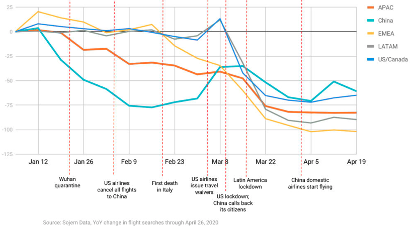

   Global flight search patterns in 2020.
   :label:`flightsfigglobal`

A massive reduction in flight searches can further be seen in figure
:ref:`flightsfigglobal` [#]_ showing the impact at a global level. Timeline beyond
January of 2020 for China, and beyond March of 2020 for most other locations,
faced the most impact as travel was reduced due to COVID imposed events and
restrictions.

.. [#] https://www.kayak.com/news/category/travel-trends/
.. [#] https://www.sojern.com/blog/covid-19-insights-on-travel-impact-hotel-agency/

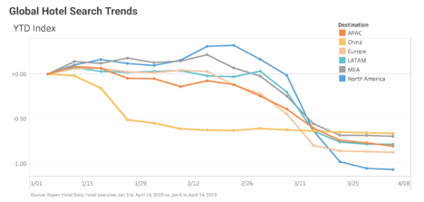

   Hotel booking search patterns in 2020.
   :label:`hotelfig`

Aligning with reduced flight searches, reduced hotel search were also reported
from March onwards as can be seen in figure :ref:`hotelfig` [#]_.

.. [#] https://www.sojern.com/blog/covid-19-insights-on-travel-impact-hotel-agency/

Let’s try to correlate these findings and understand content consumption within
those time periods on YouTube.

First, a search was performed to gather videos about “travel vlogs” using the
pyYouTubeAnalysis library. Travel vlogs are a popular content
genre on YouTube where a lot of people are able to find reviews, advice
and sneak peaks of different destinations that wows them and inspires travel
plans. Such videos typically consist of people traveling to different locations
and recording themselves at different spots.

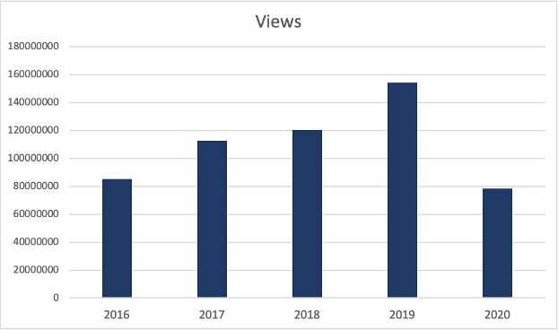

   Yearly video views. :label:`viewsyearfig`

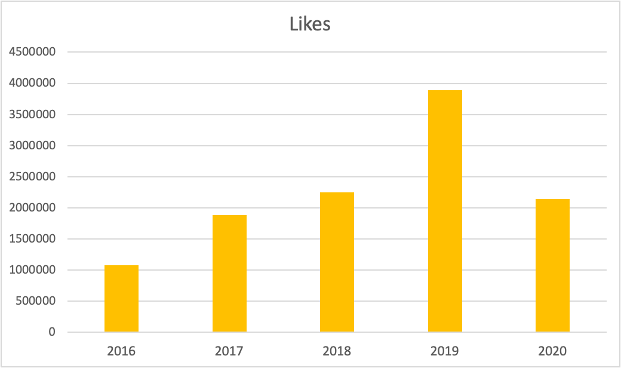

   Yearly video likes. :label:`likesyearfig`

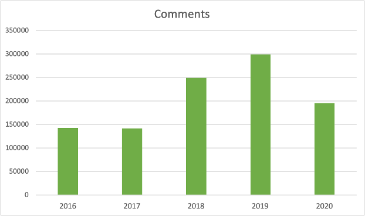

   Yearly video comments. :label:`commentsyearfig`

Statistically, it can be seen from figures :ref:`viewsyearfig`, :ref:`likesyearfig`
and :ref:`commentsyearfig` that travel vlog has been a growing
topic of interest and has been growing along with online content consumption over
the years up till 2019. A downward trend was seen in average views, comments, and
likes on travel vlog videos in 2020, where the views went down by 50% compared
to the year before.

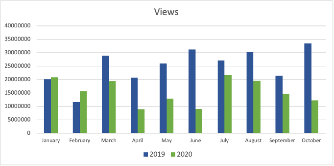

   Monthly video views for 2019 and 2020. :label:`viewsmonthfig`

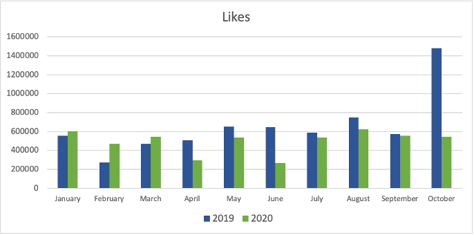

   Monthly video likes for 2019 and 2020. :label:`likesmonthfig`

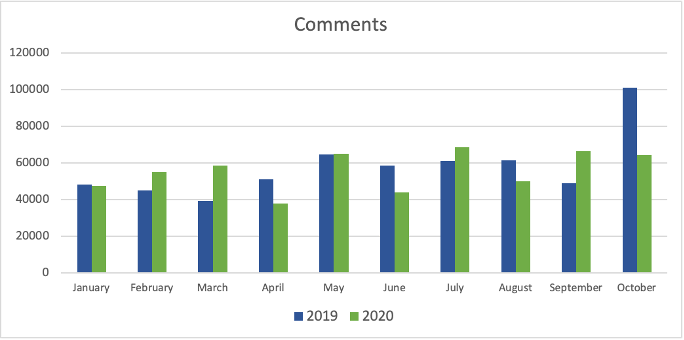

   Monthly video comments for 2019 and 2020. :label:`commentsmonthfig`

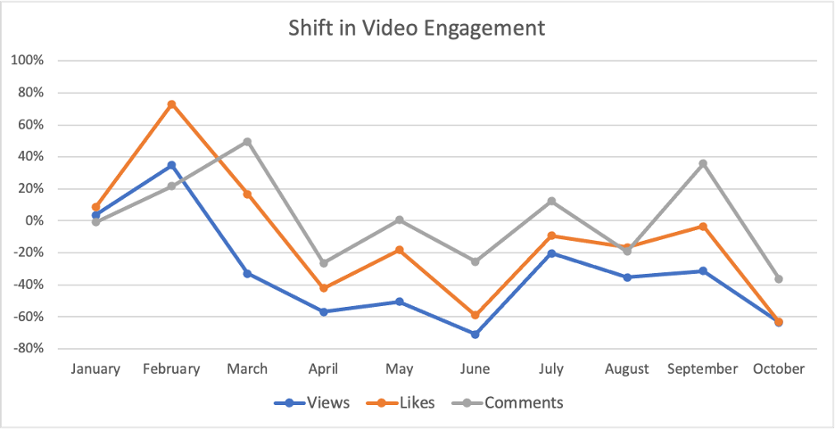

   Difference in video engagements between 2019 and 2020. :label:`statsshiftfig`

To understand the differences between the travel vlog content consumed in 2019
versus 2020 in further detail, a monthly data crawl was performed.
Figures :ref:`viewsmonthfig`, :ref:`likesmonthfig` and :ref:`commentsmonthfig`
show a month over month comparison between 2019
and 2020 to analyze average audience engagement patterns. The viewership trends
reflect the reduction from March onwards when COVID hit most locations across the
globe. Figure :ref:`statsshiftfig` further shows engagement shift between 2019
and 2020. The trend slopes upwards until March hits, which is when a lot of locations
imposed stay at home orders and lockdowns. The trend slopes downwards, picks up a
little July onwards, which correlates with the time Europe lifted a lot of the travel
restrictions. The chart representing "travel vlog" content engagement largely
correlates with the flight search trend as shown in figure :ref:`flightsfig`. It can
be seen however, people were still creating travel vlogs and commenting on such
videos. Between June and September 2020, amidst a much-reduced travel, what were
these videos, what content was getting created, who was creating it, and what were
the commenters talking about?

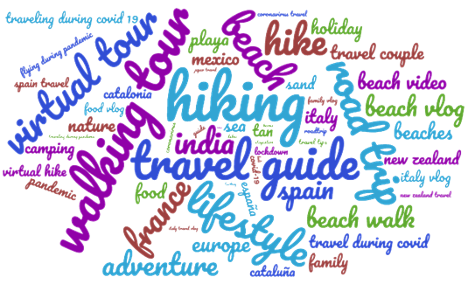

   Word cloud of video topics.
   :label:`videofig`

Figure :ref:`videofig` shows a word cloud representation of what these videos
talked about generated using keyphrase extraction implementation in pyYouTubeAnalysis,
where the text passes through data cleaning techniques prior to keyphrase extraction
that is inbuilt within the implementation. Application of these techniques prior
to extracting keyphrases eliminated the noisy samples and improved the overall
results quality. Additionally, wordcloud :cite:`wordcloud` [#]_ was used for creating
the visualization. Word cloud is a form of term occurrence visualization where
the size of the appearance of a term in the word cloud is directly proportional
to its occurrence count. Travel that would entail easier implementation of social
distance was seen popping up in 2020, such as hiking, beach trips and road traveling.
Location names such as Italy, France and Spain were also seen showing up in the videos.

.. [#] https://pypi.org/project/wordcloud/, https://www.wordclouds.com/

While we have seen what content gained the most engagement, let's look into who
the creators of such content were that drove the most comments and engagement.
With the help of engagement statistics and videos read for the 2020 time frame,
the YouTube influencer channels that drove high engagement during summer and fall
of 2020 include the following.

1. 4K Walk [#]_ – YouTube channel creating videos about walking tours all over Europe and America.

2. BeachTuber [#]_ – YouTube channel creating vlogs from different beaches all over Europe.

3. Beach Walk [#]_ – YouTube channel posting about different beaches all over Europe and America.

4. DesiGirl Traveller [#]_ – YouTube channel creating videos about India travel.

5. Euro Trotter [#]_ – YouTube channel creating videos about Europe travel.

.. [#] https://youtube.com/c/4KWALK
.. [#] https://youtube.com/c/BeachTuber
.. [#] https://youtube.com/c/BeachWalk
.. [#] https://youtube.com/c/DesiGirlTraveller
.. [#] https://youtube.com/c/EuroTrotter

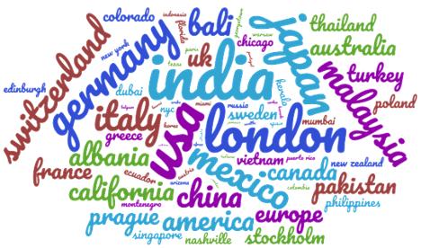

  Word cloud of location names used in comments.
  :label:`locsfig`

A few examples of comments that were being left by audiences of such videos are
as follows.

  "i’m going to sorrento in 10 days and i’m so excited. i’ve been watching tonnes
  of sorrento and italy vlogs and yours are so lush X) <3"

  "Did they require you to have a prior covid test?"

  "I loved the tour looked like you guys had fun. im going there next week, how
  long ago were you there and were there lots of restrictions and closing due to
  covid"

  "Great video man, this place looks amazing. I have never been to Iceland, would
  love to visit some day.  Honestly can't wait for the lockdown to be lifted so I
  can start travelling again. Thanks for sharing your experience. :)"

It was seen that people expressed interest in inquiring about the lifting of the
travel ban due to COVID, pre-travel COVID test requirements, along with the
sentiments around being able to travel again. People were seen mentioning a lot of
location names in their comments. With the help of named-entity recognition
implementation in pyYouTubeAnalysis, location extractions were performed.
The underlying process passed the comments through URLs and emojis removal prior
to location extraction, which led to cleaner results and reduced manual filtering.
Figure :ref:`locsfig` shows the location popularly mentioned by commenters in a
word cloud representation. One can see European locations, along with some Asian
and American locations which correlate with travel restriction reductions in some
of the places.

This analysis, including data collection from social media, keyphrase extraction,
and NER, was performed using pyYouTubeAnalysis library :cite:`pyYouTubeAnalysis` [#]_.
Similar analysis for content other than "travel vlogs" can be performed for custom
time windows using similar tools and the other NLP libraries mentioned in this effort.

.. [#] https://github.com/jsingh811/pyYouTubeAnalysis

Conclusion
----------

User content creations and interactions via text on social media platforms contain
mixed writing styles, topics, languages, typing errors, freeform emojis and abbreviations.
This diversity of content and language makes it harder to perform NLP tasks
on data coming from social media. Described cleaning techniques such as emoji removal,
hyperlink removal, language detection and translations, and typo corrections have
been found useful in priming and pre-processing language of such nature.
Subjecting the text through these methods prior to other Natural Language
Processing (NLP) methods such as keyphrase extraction and named-entity recognition
result in cleaner output.

Social media data contain statistics in addition to text data that measures human
engagement and interest in different types of content. Combining these statistics
with inferences from NLP techniques such as named-entity recognition (NER) and
keyphrase extraction are found to be helpful in trend analysis, analytics, and
observing correlations and affinities of user engagement with social media.
