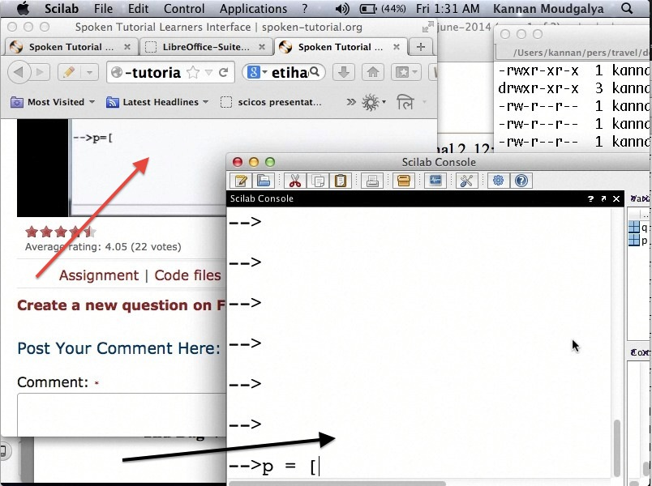
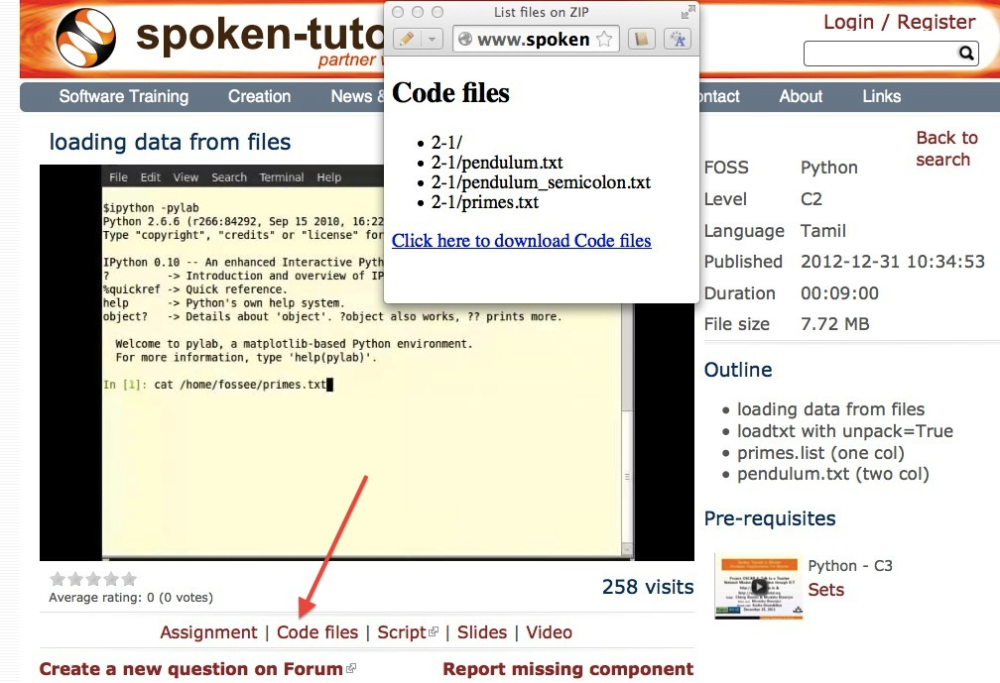
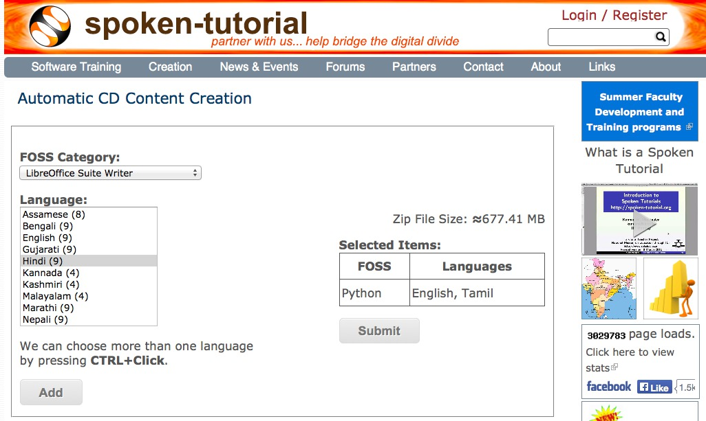
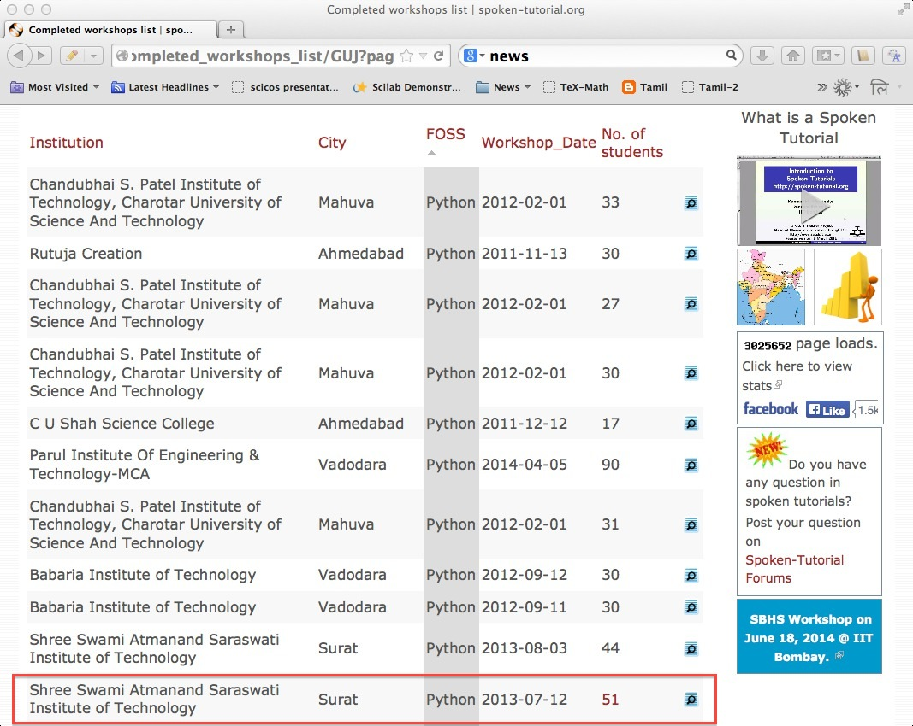
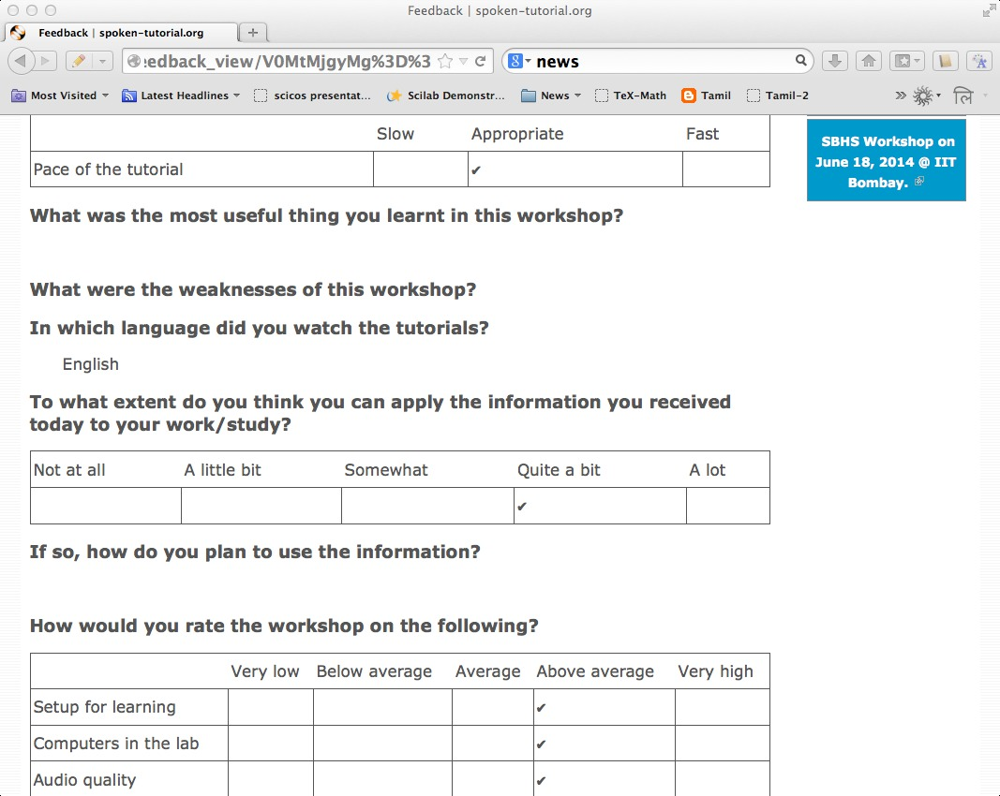
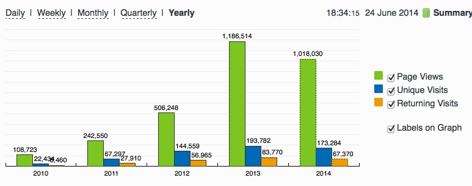
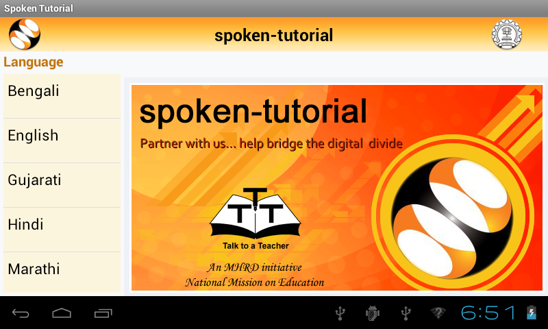
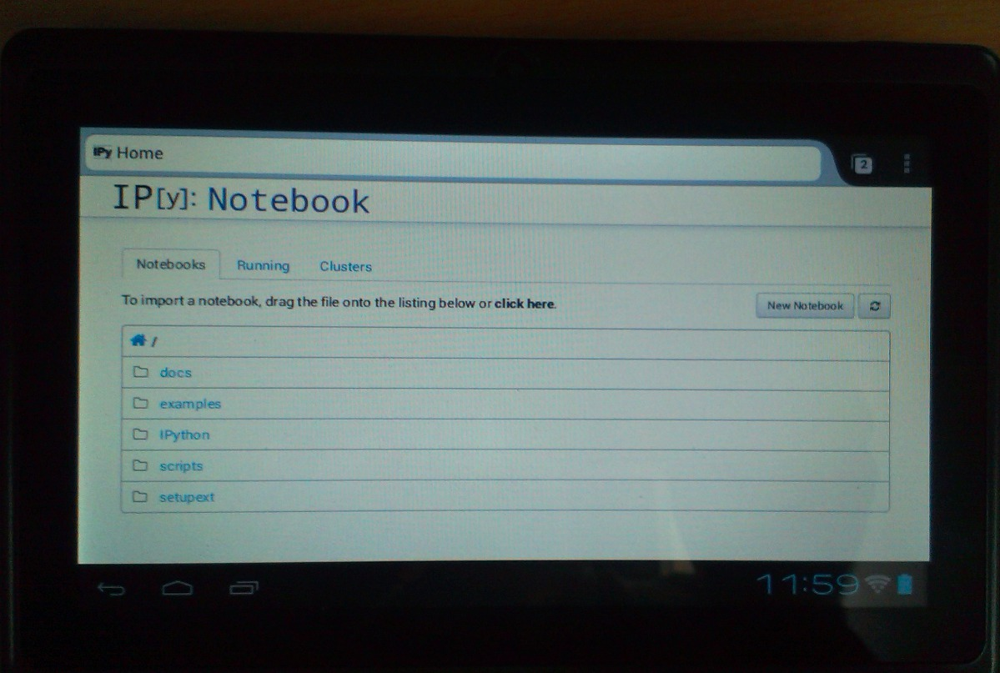
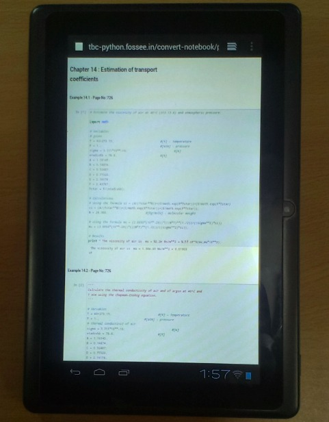

:Author: Kannan M. Moudgalya
:email: kannan@iitb.ac.in
:institution: Dept. of Chemical Engineering and Education Technology Group IIT Bombay, India

================================================================
Campaign for IT literacy through FOSS and Spoken Tutorials
================================================================

.. class:: abstract

  This article explains an approach to promote Information Technology (IT)
  literacy in India, which has evolved into a pyramid structure. We begin this
  article by explaining the design decisions, such as the use of FOSS and
  being a friendly interface between beginners and experts, in undertaking
  this activity.

  A Spoken Tutorial is a ten minute audio video tutorial on open source
  software, created to provide training on important IT topics. Spoken
  Tutorials are created for self learning, using the pedagogical methods
  developed at IIT Bombay. The spoken part of these tutorials is dubbed in all
  Indian languages, to help children who are weak in English, while retaining
  employment potential. The effectiveness of conducting workshops using spoken
  tutorials is explained. A total of 400,000 students have been trained in the
  past three years through one or more FOSS SELF workshops.

  Students who undergo SELF workshops can create textbook companions, which
  contain code for the solved problems of given textbooks using a particular
  software. A Python Textbook Companion is a collection of Python code for a
  given textbook. These companions and the associated textbook, together, form
  a low cost document for Python in general, and the textbook, in particular.
  We have completed approximately 80 Python Textbook Companions and another 80
  are in progress. From textbook companions, the students can progress to lab
  migration activity, the objective of which is to migrate labs based on
  proprietary software to FOSS. Interested students are trained to use FOSS
  systems in their projects and to contribute to the development of new FOSS
  systems. Using this approach and Python as a gluing language, we have
  developed the following new FOSS systems: 1. Oscad, an electronic design
  automation tool, and a FOSS alternative to commercial software, such as
  ORCAD. 2. Sandhi, a block diagram based data acquisition for real time
  control, and a FOSS alternative to commercial software, such as LabVIEW.

  The pyramid structure explained in this work helps the beginners to become
  IT literate. Our design solutions are especially suitable to poor and
  marginalised sections of the society, which is at the bottom of the social
  pyramid. Our efforts to create and promote the world’s lowest cost computing
  system Aakash is briefly addressed in this work.

.. class:: keywords

    Python, spoken tutorials, FOSSEE

Introduction
============

This article explains the approach we have taken to promote IT literacy
in India. While India has the capability to create software to help
improve the lives of people around the world, its citizens do not have
the capability to absorb it. One main reason is that India does not have
a good infrastructure. In addition, the economic conditions do not allow
our citizens in general, and students in particular, to buy expensive
hardware and software. Lack of good quality educational institutions and
good teachers compound the problem.

This paper presents the design decisions we took to achieve our
objective while keeping in mind the problems mentioned above. Some of
the decisions have been arrived at by trial and error, while some
decisions, such as the use of FOSS, have been a cornerstone of our
efforts.

We explain a few of our activities, such as spoken tutorial based
training, textbook companion activity and low cost access tablet Aakash,
in detail, with an emphasis on the role of Python in each of them. The
reason is that Python is an important FOSS system supported and promoted
by us. We use it extensively to glue existing FOSS tools to arrive new
FOSS systems. Realising its importance, our Central School Board has
recently introduced Python in the school curriculum.

We explain how our approach is converting our FOSS ecosystem and the
resulting benefits into a pyramid structure. We conclude this article
with some thoughts on how we plan to take this successful project
forward.

Approach and Design Decisions
=============================

We started this effort in 2009 to promote FOSS, with the Indian Government
support and funding [nm09]_. Although there are many good FOSS systems, they
are difficult to use because of lack of documentation and support. If we could
bridge this gap, FOSS would become accessible to our students, who do not have
access to good software otherwise, as many of them are of proprietary in
nature. We also did not want to promote commercial software with tax payer’s
money. Our funding agency [nm09]_ had also made a policy decision to
exclusively use FOSS.

It does not mean that we wanted to erect a wall between us and those who
use commercial software. We do work with students who only know how to
use the MS Windows operating system, for example. We do accept tutorials
that have been dubbed with Windows Movie Maker. We believe that by
creating a good ecosystem, we can shift proprietary software users to
equivalent FOSS systems. We have always wished to be an inclusive
project.

We have been using simple technologies to create our instructional material,
as these allow school going students also to participate in the creation
effort. For example, we have eschewed the use of instructional methodologies
that help embed interaction in our tutorials. In contrast, open source screen
recording software, such as RecordMyDesktop [rmd]_, has limited features.
Nevertheless, we have made the learning effective by strict processes to
create tutorials [guidelines]_ and to use them, for example, the side-by-side
method (see Fig. :ref:`fig:side-by-side`) and SELF workshops, explained in
Sec. :ref:`sec-spoken`.

   A side by side arrangement for effective use of Spoken Tutorials. The red
   arrow points to the video tutorial and the black arrow points to the
   software studied, in this case, Scilab. :label:`fig:side-by-side`

It is our policy that even “ordinary” people can participate in our
project, using whatever equipment they have, and get recognised and also
paid an honorarium. If an instructional tutorial is some 95% good, we
accept it. At the beginning of the project, we found that if we insisted
on 100% good quality, it would necessitate the use of pin drop silence
quality studios, established at a cost of millions of dollars. This
would make the cost of spoken tutorials prohibitively expensive.
Moreover, our project would become an elite one, filtering most
“ordinary” people from participating in it.

We also wanted our methodology to be beginner friendly. When we started
this work in 2009, most *Forums* that supported FOSS were quite
unfriendly to the questions of beginners. For example, the standard
answers were,

-  First learn how to post in the forum

-  It is already answered, check the archives first

-  Read the instruction manual first before asking a question, etc.

The reasons for the response given by the experts are understandable:
there are only a few experts to answer the questions of large numbers of
beginners, many of which may be repetitive. If the experts spend all
their time in answering often repetitive questions, when will they have
time to do their own work, develop the FOSS, remove bugs, write
documents, etc., seem to be valid questions. Nevertheless, we can
confidently say that only a small fraction of FOSS exploring/loving
beginners stay with FOSS because of the above mentioned scoldings and
the support structure. The system we have built is beginner friendly,
with enthusiastic participation from the experts.

When we started the project in 2009, we decided to make our project a
friendly interface between beginners and experts. One way to do this was
through a *Novice Check* of the script, before creating a video
tutorial. Unless a script is approved by a novice, we do not accept it
for recording.

We illustrate the novice check with a bash script that the author
reviewed as a beginner. The script asked the learner to download a bash
file to the current directory and to type the name of the file on the
console to execute it. On following the above instruction, the following
error message appeared: Command not found. The script writer forgot to
state that there should be a ./ (dot-slash) before the file name, as the
current directory is not in the path of beginner. After correcting this
mistake, the same error message appeared. The reason for this is that
this file is not executable. The script writer missed the following
statement: the downloaded file should be made executable by the chmod
command. These corrections were incorporated into the script before
recording it.

Although the details to be addressed in our tutorials seem to be excessive,
the benefits are enormous. In Table :ref:`tab:workshops`, we give the total
number of workshops that we have conducted and the number of students trained.

.. table:: Total number of workshops conducted and the students trained in the past three years. The methodology is explained in Sec. :ref:`sec-spoken`. :label:`tab:workshops`

    +--------------------------------+--------------------+-------------------+
    | FOSS category                  | No. of Workshops   | No. of Students   |
    +================================+====================+===================+
    | C and C++                      | 1,840              | 84,728            |
    +--------------------------------+--------------------+-------------------+
    | Linux                          | 1,819              | 80,882            |
    +--------------------------------+--------------------+-------------------+
    | PHP and MySQL                  | 997                | 44,414            |
    +--------------------------------+--------------------+-------------------+
    | Scilab                         | 1,026              | 41,306            |
    +--------------------------------+--------------------+-------------------+
    | Java                           | 672                | 31,795            |
    +--------------------------------+--------------------+-------------------+
    | LaTeX                          | 771                | 30,807            |
    +--------------------------------+--------------------+-------------------+
    | LibreOffice (all components)   | 776                | 26,364            |
    +--------------------------------+--------------------+-------------------+
    | Python                         | 419                | 18,863            |
    +--------------------------------+--------------------+-------------------+
    | Total                          | 8,320              | 359,159           |
    +--------------------------------+--------------------+-------------------+

The methodology developed by us to achieve such large numbers is
explained in Sec. :ref:`sec-spoken`.

An expert who knows that their tutorial will be watched 10,000 times
will not mind spending a lot of effort to create outstanding
instructional material. Insistence on passing through a novice check
provides respectability to the beginner. From the expert’s point of
view, once it is created, all beginners can be directed to see the
tutorial. Finally, as we discuss next, the novice check made our
tutorials suitable for self learning, which in turn has resulted in
large scale training, as demonstrated in Table :ref:`tab:workshops`.

The fact that a large number of people have undergone our LibreOffice
workshops demonstrates that we are reaching out to the clerical staff
and those who are at the doorsteps of IT literacy, and hence are at the
bottom of the pyramid.

We ask the students who have completed our workshops to participate in a
textbook companion project, to be described in Sec. :ref:`sec-tbc`. As
mentioned earlier, we cannot progress much on IT literacy, unless all
our children can have an access device. We briefly summarise world’s
lowest cost computing device Aakash, and how it is used as a convergence
device for the activities mentioned in this article. Spoken Tutorial,
textbook companion and other advanced activities result in a pyramid
structure, explained in Sec. :ref:`sec-pyramid`. In this section, we point
out that the benefits are also in the form of a pyramid structure. We
begin with our training effort.

.. _sec-spoken:

Spoken Tutorial
================

A Spoken Tutorial is an audio - video instructional material created for
self learning through the Screencast technology. When this project
started in 2009, the main objective was to create documentation for
FOSS, so that it is accessible to everyone. A detailed set of objectives
and the method followed to achieve them are summarised in [kmm14]_.

We will begin with the reasons for calling this instructional material
as a Spoken Tutorial. When this work started, there were a large number
of *silent* Screencast tutorials on the Internet. To distinguish ours
from these, we used the word *spoken*. This word is even more important,
as we dub the spoken part into all Indian languages. As we do not
capture the face of the person creating the tutorials, it is strictly
not a video tutorial. Owing to the fact that one can use Spoken Tutorial
to learn a topic, we call it a tutorial.

Spoken Tutorials have been released under a Creative Commons license and are
freely downloadable from [Spoken]_. There are about 500 original spoken
tutorials in English and more than 2,000 dubbed tutorials in various Indian
languages.

The Python Team created a set of 14 Spoken Tutorials on Python at the
beginning. On using these tutorials, it was found that the pace of some
tutorials was fast and that some topics were left out. A fresh set of 37
Spoken Tutorials have been created since then. These have also been
dubbed into a few Indian languages. At present, we have the following
Python Spoken Tutorials at the basic level:

#. Getting started with ipython

#. Using the plot command interactively Embellishing a plot

#. Embellishing a plot

#. Saving plots

#. Multiple plots

#. Additional features of IPython

#. Loading data from files

#. Plotting the data

#. Other types of plots

#. Getting started with sage notebook

#. Getting started with symbolics

#. Using Sage

#. Using sage to teach

At the intermediate level, we have the following tutorials:

#. Getting started with lists

#. Getting started with for

#. Getting started with strings

#. Getting started with files

#. Parsing data

#. Statistics

#. Getting started with arrays

#. Accessing parts of arrays

#. Matrices

#. Least square fit

#. Basic data types and operators

#. I O

#. Conditionals

#. Loops

#. Manipulating lists

#. Manipulating strings

#. Getting started with tuples

#. Dictionaries

#. Sets

At the advanced level, we have the following tutorials:

#. Getting started with functions

#. Advanced features of functions

#. Using python modules

#. Writing python scripts

#. Testing and debugging

Spoken tutorials are created for self learning. The side-by-side method,
illustrated in Fig. :ref:`fig:side-by-side` is recommended for the effective
use of spoken tutorials [kmm14]_. The learner is supposed to reproduce all the
steps demonstrated in the tutorial. To achieve this, all supplementary
material required for a tutorial are provided. We illustrate this with
the Python Spoken Tutorial, loading data from files. In
Fig. :ref:`fig:st-resources`, in the command line, cat of the file primes.txt
is demonstrated. By clicking the Code files link, shown with a red
arrow, one may download the required files. In the figure, we have shown
the window that pops up when the Code files link is clicked. This popped
up window asserts the availability of the file prime.txt and also other
files that are required for this tutorial. By clicking the link Video,
also at the second last line of this figure, one can download the
tutorial for offline use.

   Resources available for a spoken tutorial explained with an example. The
   file used in the tutorial is available through the *Code files* link,
   indicated by an arrow. On clicking this link, the available code files are
   displayed in a new window. :label:`fig:st-resources`

As these are created for self learning, and are freely downloadable, one
should be able to learn from spoken tutorials directly from the website
[Spoken]_. Nevertheless, there are many reasons why we have been conducting
organised workshops [kmm14]_ using spoken tutorials. As these are created for
self learning, a domain expert is not required to explain the use of spoken
tutorials - a volunteer can organise these workshops. Based on trial and
error, we have decided that our workshops should be of two hour duration and
should be conducted as SELF workshops, as mentioned previously. Although these
workshops are of only two hour duration, quite a bit can be learnt in a two
hour workshop. For example, by no other method can a beginner learn LaTeX
topics, such as compilation, letter writing, report writing, mathematical
typesetting and introduction to beamer, in a two hour workshop
[kmm11-TUGboat]_. Although no domain experts may be available during these
workshops, one may get their questions answered through a specifically
designed forum [forums]_.

Most students in India do not have access to good bandwidth and hence cannot
access our web page. As a result, we need to provide the tutorials for offline
use. In the previous paragraph, we have explained how to download a single
video. To be consistent with our ethos, we have implemented a tool that allows
the creation of an image consisting of many tutorials and downloading it for
offline use. On choosing at [Spoken]_, Software Training :math:`>` Download
Tutorials :math:`>` Create your own disk image, one reaches the page shown in
Fig. :ref:`fig:mk-image`. Through this shopping cart like facility, we can
create an image consisting of different FOSS families of spoken tutorials, in
languages of one’s choice. In this figure, one can see that the Python spoken
tutorials in English and Tamil have been selected and these will take up about
680 MB. One may add many more FOSS categories, in one or more languages to the
Selected Items list. Once all required tutorials are selected, one may click
the Submit button. The image consisting of all the tutorials will be download
as a zip file. On unzipping this file and opening the index.html file
contained therein in a web browser, such as Firefox, all the selected videos
can be played from the local drive. This zip file can be copied to all
computer systems that are meant to be used in a workshop.

   The automatic CD content creation facility, available through [Spoken]_, by
   clicking Software Training :math:`>` Download Tutorials :math:`>` Create
   your own disk image. One can see that English and Tamil versions of Python
   tutorials are selected, with a size estimate of about 680 MB.
   :label:`fig:mk-image`

The Spoken Tutorial Team helps conduct SELF workshops [events-team]_. The
workshops are offered on about 20 topics, such as Python, Scilab, C, C++,
Java, LibreOffice, LaTeX, PHP, Oscad and GNU/Linux. Organisers of SELF
workshops at different institutions download the required spoken tutorials
using the facility explained through Fig. :ref:`fig:mk-image`, install the
software to learn and ensure that the computer system, audio/video player and
the head phone are in working condition. These organised workshops create a
conducive ecosystem to learn through spoken tutorials.

During a two hour workshop, one may not learn all the tutorials. After the
workshop, the students are encouraged to download the tutorials and to
practise by themselves at their home or office. The learners can post their
difficulties, if any, on the Spoken Tutorial Forum [forums]_ based on the time
line of a spoken tutorial. This special forum helps even beginners to locate
previous discussions relating to spoken tutorials. An online exam is conducted
a few weeks after the workshop and the participants who pass the exam are
provided with certificates.

It is possible to get details of SELF workshops conducted by our team. In
[python-ws-info]_, one can see summary details of the Python workshops that
have taken place in the state of Gujarat. One can reach this information on
[Spoken]_ by clicking the map of India, choosing Gujarat and sorting the
result by FOSS. A screenshot is given in Fig. :ref:`fig:python-workshop-info`.
In this figure, we have shown a red rectangle around a particular workshop
that took place in Surat on 12 July 2013. By clicking the lens symbol, one can
see the details of where the workshop took place, who conducted this workshop
and so on. When the number of students who attended this workshop is shown in
red (in this case, it is 51), it means that they have given their feedback. By
clicking the number in red, one may locate the feedback given by students. A
typical feedback is shown in Fig. :ref:`fig:feedback`.

   Summary of Python workshops, obtained by clicking the India map in
   [Spoken]_, choosing Gujarat and then sorting by FOSS.
   :label:`fig:python-workshop-info`

   Feedback given by a student of Shree Swami Atmanand Saraswati
   Institute of Technology, Surat, Gujarat. :label:`fig:feedback`

We present some statistics of the people who have undergone Python SELF
workshops. The number of SELF workshops conducted until now is 417,
training close to 19,000 students, with 9,300 of them being girls. It is
interesting because generally girls do not take up programming in large
numbers, here it is almost 50%. Python SELF workshops have taken place
in 23 states of India. Year wise break up of workshops is given in
Table :ref:`tab:pythonWSstat`.

.. table:: Python SELF workshops, yearly statistics :label:`tab:pythonWSstat`

    +---------+--------------------+-------------------+
    | Year    | No. of workshops   | No. of students   |
    +=========+====================+===================+
    | 2011    | 21                 | 945               |
    +---------+--------------------+-------------------+
    | 2012    | 144                | 6,562             |
    +---------+--------------------+-------------------+
    | 2013    | 116                | 4,857             |
    +---------+--------------------+-------------------+
    | 2014    | 138                | 6,499             |
    +---------+--------------------+-------------------+
    | Total   | 419                | 18,863            |
    +---------+--------------------+-------------------+

It should be pointed out that less than one half of the year is over in
2014.

The Python SELF workshops are effective. We have the following
testimonials:

    Through this workshop one can easily understand the basics of python,
    which in turn can develop an interest in one’s mind to learn more about
    python. Thank you very much for this wonderful workshop.

    -- Brindersingh - Guru Nanak Institute of Technology, West Bengal

    Got the initiative of how to work on python that makes the programming
    comparative easy. Apart from this, graphical representation of
    mathematical formulation is quite good.

    -- Abhishek Bhargava - Institute of Engineering & Technology, Alwar

    It is a very efficient way of learning new languages as the videos seem to
    be practical and help the learning of the language along with examples.

    -- Mahima - Jaypee University of Information Technology, Himachal Pradesh

Our website [Spoken]_ is becoming popular. Fig. :ref:`fig:yr-stat` gives
details of page views on our website. One can see that the number of page
views are doubling every year. The number of people who benefit from our work
is much higher than the numbers indicated in this figure. This is because,
there are a lot of students in India who access our material through offline
mechanisms, as explained earlier. For example, even though more than 80,000
students have undergone SELF workshops on Linux (Table :ref:`tab:workshops`),
the largest number of times any Linux video is seen is only about 2,500. It
seems that the equivalent number of page views on our page is at least ten
times the number indicated in Fig. :ref:`fig:yr-stat`.

   Number of page views on [Spoken]_, since the beginning of this website. As
   there are many offline viewers in India, the effective number of page views
   may be considered to be at least twice these numbers. :label:`fig:yr-stat`

A student who is trained through a SELF workshop is ready to contribute
to the society. A textbook companion is the easiest way for them to
contribute and in the process also get rewarded. This is explained in
the next section.

.. _sec-tbc:

Textbook Companion Project
==========================

One of the major shortcomings of FOSS tools is the lack of
documentation. Proprietary software creators can deploy a lot of money
and other resources to develop good documentation. We explain now how we
have addressed this important issue through Textbook Companions.

We wanted to create documents for FOSS using India’s abundantly
available work force, namely, students. Unfortunately, creating a
document requires mature people. Students are good in writing programs,
not documents. We explored the possibility of addressing this by solving
the inverse problem: ask the students to write programs for existing
documents. Textbooks can be considered as good documents. After doing a
pilot with six students from different parts of India in the summer of
2010, we came up with the formula of one student, one month, one
textbook companion.

Textbook companion (TBC) activity creates code for solved examples of
standard textbooks using FOSS. These are created by students and the
faculty of colleges from different parts of India. Students who create
these books are given an honorarium of Rs. 10,000 for each companion and
their teachers who help review are given an honorarium of Rs. 5,000 per
companion.

If anyone wants to understand what a program does, all that they have to
do is to go through the corresponding example in the associated
textbook. If TBCs are available for all textbooks used in educational
programmes, students and teachers would not need proprietary software,
at least for classroom use.

This programme is so flexible that almost anyone can contribute to the
Python Textbook Companion (PTC) activity: from students to corporates,
teachers and freelancers. They can choose a textbook of their choice
from engineering, science or social sciences, the only requirement being
that Python being suitable to solve the example problems. Upon
successful completion of a PTC, the participant is awarded with a
certificate and a handsome honorarium. PTCs are presented in the form of
IPython Notebooks.

The PTC interface [PTC]_ displays all the completed books together with a
screen-shot of code snippets, so that the user can easily download the PTC of
their interest. The interface also allows the users to view all the codes of a
chapter as an IPyton notebook, which makes learning python easy.

We use the following process to develop a PTC:

#. A student uploads Python code for the examples of one of the chapters
   of a chosen textbook. They should ensure that this book is not
   already completed nor under progress. They should also propose two
   other textbooks for PTC creation, in case the one they selected is
   already allocated to someone else.

#. Based on the Python code received for one chapter, our reviewers
   decide whether the student knows sufficient Python to complete the
   PTC. In case the selected textbook is already allocated to someone
   else, one of the other two chosen books is assigned. The student is
   given a time period of three months to complete the PTC.

#. The student has to upload the Python code in a specified format, on
   our portal.

#. Our reviewers check the correctness of the submitted code. They check
   whether the answers given by the code agree with those given in the
   textbooks.

#. Students who get all the code correct during the first review itself
   get a bonus, in addition to the honorarium mentioned above. Those who
   increase the work of reviewers by submitting wrong code are penalised
   and their honorarium gets reduced.

We currently have PTCs in the following categories: Fluid Mechanics,
Chemical Engineering, Thermodynamics, Mechanical Engineering, Signal
Processing, Digital Communications, Electrical Technology, Mathematics &
Pure Science, Analog Electronics, Computer Programming and others.
Currently, there are 80 completed PTCs and 80 are in progress. PTCs so
created are available for free download at [PTC]_.

The creators of PTC learn Python in a practical and effective way. One
may see below testimonials from a few of the participants:

    I experienced that even an inexperienced person can do
    coding/programming. I gradually got to advance my skills in python
    as I approached further in it. I got the IIT-B certifcate, plus i
    got paid a handsome amount of cheque after completion which was good
    enough for me at then.
    --  Amitesh Kumar

    The FOSSE-Textbook Companion Project has been a scintillating point in my
    career. It has been instrumental in tuning my programming and presentation
    skills. It provided an ideal forum for me to learn Python and contribute
    to the open source community.
    -- Abhiram Padu

    I learnt python from Spoken-Tutorials available on the
    website.The Python TBC team also helped me a lot in starting my
    internship. Till now,I have completed 3 TBCs and now,I know pretty
    much about python. I plan to take this project forward and Python is
    really helping me shine my resume.
    -- Deepak Shakya

    This internship provided me a perfect platform and environment to learn
    python.It helped me to incorporate both my ideas and practical work skills
    to the best.Especially,those concepts of C which are not present in python
    gave me an awesome experience.Moreover, experience gained from it will
    make me capable of facing and overcoming the upcoming challenges under its
    applications.
    -- Ramgopal Pandey

We would like to point out some of the processes we have followed in the
creation of PTC. Initially we tried to use the Sprint route to create
PTCs. This involved a few people jointly coding all the problems,
including unsolved problems, of a given book in one sitting. Solving
unsolved problems made the task difficult. A book could not be completed
in one session and those who coded for a part of the textbook did not
come back. There was also no ownership of the activity as many people
were involved in one book. In contrast, the Scilab group used the
approach explained previously and found it to be more effective, and
more productive: there are 377 completed Scilab TBC and 266 are in
progress. As a result, the Python group also changed the strategy for
the creation of PTCs and this has yielded good results, as explained
above. We are also in the process of contacting all who created Scilab
TBC urging them to take up the PTC work.

The FOSSEE project at IIT Bombay [FOSSEE]_ supports the following FOSS
systems: Python, Scilab, OpenFOAM, COIN-OR, Oscad (a locally developed for
Electronic Design Automation and a FOSS alternative to OrCAD) and Sandhi (a
FOSS alternative to LabVIEW). We are in the process of creating TBCs for all
of these systems.

Aakash: World’s lowest cost computing device
============================================

The agency that funded our FOSS promotion projects has created several
e-content resources. It has also provided large amounts of bandwidth to
educational institutions. These two do not get utilised effectively if
the students do not have an affordable access device. If a student does
not have an access device, they cannot participate in some of our
projects. This affects their learning, while simultaneously resulting in
loss of possible honorarium income. Aakash is the result of our efforts
to address this problem [mpsv13]_, [sp13]_.

Aakash has indeed become a convergence device for our projects. Spoken
Tutorials can be played on Aakash, see Fig. :ref:`fig:spoken-aakash`.

   Spoken Tutorials run on Aakash :label:`fig:spoken-aakash`

We have ported iPython notebook on Aakash, see Fig. :ref:`fig:iPython`.

   iPython runs on Aakash :label:`fig:iPython`

A PTC running on Aakash is shown in Fig. :ref:`fig:aakash-portrait`.

   A Python Textbook Companion on Aakash, the world’s lowest cost
   computing device. :label:`fig:aakash-portrait`

.. _sec-pyramid:

Pyramid Structure
=================

In this section, we explain how our FOSS efforts help result in a
pyramid structure of trained students. We train the students with spoken
tutorials and ask them to contribute to textbook companions. After this,
the students are ready to participate in lab migration, explained next.

We have realised that so long as a proprietary software is used in a
lab, it cannot ever be replaced, even if one succeeds in theory classes,
say through textbook companions. The FOSSEE team helps migrate
commercial software based labs to FOSS. Once a faculty member in a
college wants to migrate a lab to FOSS, we ask them or others in our
network to come up with the required code in an equivalent FOSS and pay
an honorarium. This code is made available to the public. An example of
this project is migrating Matlab based labs to Scilab.

We will now explain a lab migration project based on SimPy, an open
source platform-independent toolkit for simulation, released under GNU
GPL. SimPy is a open source alternative to commercial simulation
packages such as AnyLogic, Arena, Witness, ExtendSim, Quest, FlexSim,
all of which are expensive even for academic use. Many colleges offer
courses and/or labs on simulation modeling, and are currently using one
or more of the above commercial packages. This lab migration work has
just begun.

The next complicated task we have recently undertaken is to help our
students do full projects using the FOSS that we support. Here is a
feedback from a student who completed his Master’s thesis using Oscad:

    With intensive cooperation and guidance on Oscad EDA tool, from all
    of You, I have completed the project on “Design and Performance
    Analyis of OTA based SNR Meter” successfully and also submitted the
    project report today. Sincere thanks to all of You. Oscad is really
    user friendly and also highly accurate which is the main reason for
    completion of the project so smoothly.

    We at Mangalore Institute of Technology and Engineering have
    decided to use Oscad for two of the labs “Linear Integrated Circuits
    and Analog communication” and “Power Electronics” labs. Your support
    is very much needed mainly for power electronics lab. Hope you will
    provide it. Thanks a lot.
    -- Harish Bhat

The next task is to help improve the FOSS itself or to use the FOSS to create
new software. Typically, existing FOSS tools are used to create new FOSS
systems. Python turns out to be an excellent gluing solution. We have used
Python extensively in the creation of Oscad [oscad-book]_, [oscad-lj]_. We are
using Python extensively, once again, in the creation of Sandhi, a FOSS
alternative to LabVIEW. Sandhi is yet to be released to the public. We have
been using Python also to create online evaluation software to administer post
SELF workshop tests.

The next level in this progression is possibly entrepreneurship. We are
exploring the viability of it. At present we train about 200,000
students a year through SELF workshops. We expect about 1% of them to be
good, possibly as a result of our FOSS promotion efforts. If 10% of them
are interested in becoming entrepreneurs, we will have about 200 people
to train. Initial enquiries convince us that many groups that want to
promote entrepreneurship may possibly be interested in working with our
selection. We believe that we can generate an army of entrepreneurs. If
we succeed in this endeavour, we would really have achieved a pyramid
structure.

The benefits of our effort are also in a pyramid structure. At the
lowest level, the learners get IT literacy. At the next level, we have
students passing exams, because of our training material, see a
testimonial:

    In my college, one of the students in btech 3rd year 1st sem was
    having a makeup exam and and he was looking for guidance in learning
    Java. We gave the spoken-tutorial CD material on Java, and gave
    explanation on the contents of the CD. After the exam he came and
    told that the spoken tutorial CD on java helped him a lot and that
    he developed confidence in Java by going thru all the tutorials and
    doing the assignments. He also told that the video tutorials cleared
    most of his doubts on java and helped him in passing the makeup
    exam.
    -- Prof. K. V. Nagarjuna, Sree Dattha Inst. of Engg. and Science

Then, there are several levels of employment, starting from routine IT
work, all the way up to work in niche areas, with attractive salaries.
Finally, there is a possibility of one starting one’s own company.

Conclusions and Future Work
===========================

This work has summarised how the FOSS promotion work we started in 2009
has evolved into a massive training programme that caters to the bottom
of the pyramid and also to those at the top. Given that our approach has
worked for IT skills development, we are exploring the possibility of
replicating this method to other skills development areas as well. It
will be great if we can succeed in this, as India has a big shortage of
skilled personnel and a large number youngsters who want employment. The
training may have to start at school level and this is an order of
magnitude larger problem. Finally, all our material and processes are in
the open and are available to FOSS enthusiasts all over the world.

Abbreviations
==============

+--------+---------------------------------+
| IT     | Information Technology          |
+--------+---------------------------------+
| FOSS   | Free and open source software   |
+--------+---------------------------------+
| PTC    | Python Textbook Companion       |
+--------+---------------------------------+
| TBC    | Textbook Companion              |
+--------+---------------------------------+
| ST     | Spoken Tutorial                 |
+--------+---------------------------------+

Acknowledgements
=================

The work reported in this article has been carried out by the 100+ staff
members of the FOSSEE and Spoken Tutorial teams. The author wishes to
acknowledge the contributions of the Principal Investigators of these
projects. The author wants to thank Prabhu Ramachandran for his help in
converting this article to the required format.

References
==========

.. [nm09] Ministry of Human Resource Development. National mission on
   education through ICT. http://www.sakshat.ac.in, Last seen on 11 Feb. 2014.

.. [rmd] recordMyDesktop Team.,
   http://sourceforge.net/projects/recordmydesktop/, Last seen on 27 June
   2014.

.. [guidelines] Spoken Tutorial Team. Guidelines to create spoken tutorials.
   See http://process.spoken-tutorial.org/index.php/FOSS_Stages/Checklist,
   seen on 11 Feb. 2014.

.. [kmm14] K. M. Moudgalya. Pedagogical and organisational issues in the
   campaign for it literacy through spoken tutorials. In R. Huang, Kinshuk,
   and N.-S. Chen, editors, *The new development of technology enhanced
   learning*, chapter 13. Springer-Verlag, Berlin Heidelberg, 2014.

.. [Spoken] Spoken Tutorial Project. Official web page.
   http://spoken-tutorial.org/, seen on 11 Feb. 2014.

.. [kmm11-TUGboat] K. M. Moudgalya. LaTeX Training through Spoken Tutorials.
   TUGboat, 32(3):251–257, 2011.

.. [forums] Spoken Tutorial Project. Online forum.
   http://forums.spoken-tutorial.org/, seen on 11 Feb. 2014.

.. [events-team] Spoken Tutorial Project. Events team contact details.
   http://process.spoken-tutorial.org/index.php/Software-Training#Organising_Workshops,
   seen on 29 June 2014.

.. [python-ws-info] Spoken Tutorial Team. List of python workshops in Gujarat.
   http://www.spoken-tutorial.org/completed_workshops_list/GUJ?page=42&sort=asc&order=FOSS,
   Last seen on 29 June 2014.

.. [PTC] Python Team. Python textbook companion. http://tbc-python.fossee.in,
   Seen on 19 June 2014.

.. [FOSSEE] FOSSEE Team. Free and open source software in education. http://fossee.in,
    Seen on 11 Feb. 2014.

.. [mpsv13] K. M. Moudgalya, D. B. Phatak, N. K. Sinha, and Pradeep Varma.
   Genesis of Aakash 2. CSI Communications, pages 21--23 and 29, Jan. 2013.
   Available at http://aakashlabs.org/media/pubs/genesis-reprint.pdf, seen on
   11 Feb. 2014.

.. [sp13] S. Patil and S. Patnaik. GNU/Linux on Aakash. CSI Communications,
   pages 28–31, July 2013. Available at
   http://aakashlabs.org/media/pubs/GNU_Linux_on_Aakash.pdf.

.. [oscad-book] Y. Save, R Rakhi, N. D. Shambulingayya, R. M. Rokade, A.
   Srivastava, M. R. Das, L. Pereira, S. Patil, S. Patnaik, and K. M.
   Moudgalya. Oscad: An open source EDA tool for circuit design, simulation,
   analysis and PCB design. Shroff Publishers, Mumbai, 2013.

.. [oscad-lj] R. Rakhi and K. M. Moudgalya. Oscad: open source computer aided
   design tool. Linux Journal, pages 96–113, May 2014.
