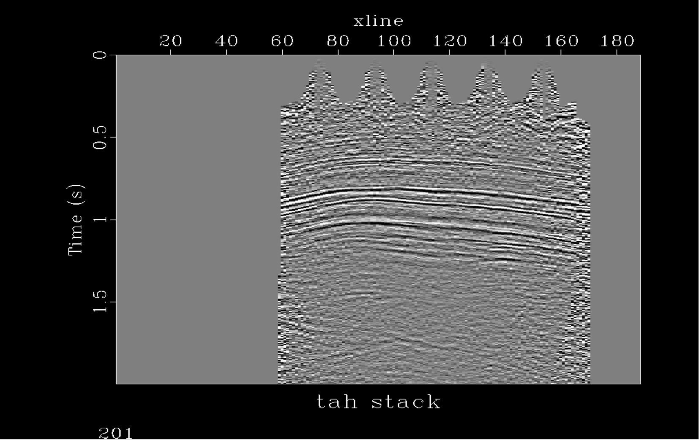
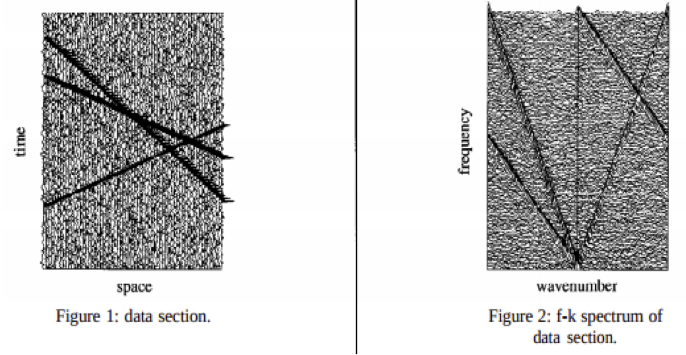
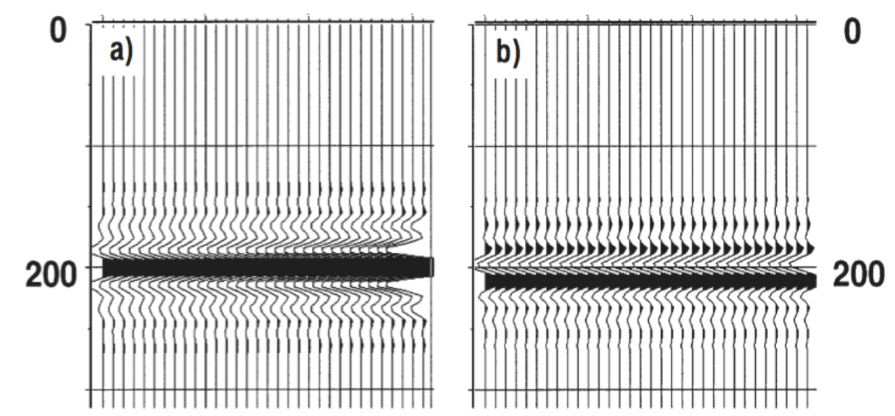
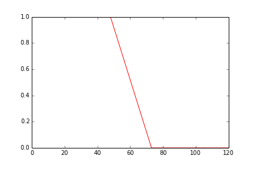
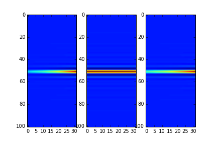
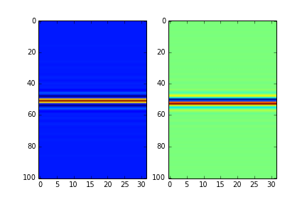
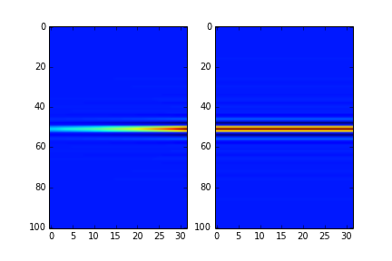

:author: Karl L. Schleicher
:email: k_schleicher@hotmail.com
:institution: Bureau of Economig Geology, University of Texas at Austin

.. :video: http://www.youtube.com/watch?v=dhRUe-gz690

----------------------------------------------------------------------------
Prototyping a Geophysical Algorithm in Python  Spitz-Prony Noise Attenuation
----------------------------------------------------------------------------

.. class:: abstract

   A geophysics paper by Spitz has a long paragraph that describes an algorithm, a model, and the results of applying the algorithm to the model. I wanted to implement and test the algorithm to ensure I fully understood the method. This is a good illustration of Python for geophysics because the implementation requires Fourier transforms provided by numpy.fft, setting up linear equations using numpy.array and numpy.matrix, solving the linear equations using scipy.linalg.solve, and applying convolutional filters using  scipy.signal.lfilter

   I created the bandlimited flat event model using array slicing in numpy and is bandlimited in the frequency domain. Another component of the model is created by convolving a short derivative filter on a similar flat event model. After Fourier transform, linear equations are set up to compute a  prediction filter in the FX domain. These equations are created using data slicing, conjugate transpose, matrix multiply (all available in numpy). Scipy.linalg.solve is used to solve for the prediction error filter. A final filter is computed using the recursive filter capability in scipy.signal.lfilter. Results are displayed using matplotlib.

   This is quite a tour of scipy and numpy to implement an algorithm described in a single (although lengthy) paragraph. Many operations commonly used in geophysics are illustrated in the program. The algorithm is described and the code shared.

.. class:: keywords

   Geophysics, Python, scipy, numpy, signal processing, prony, fx prediction

Introduction
------------

Spitz's paper on multiple attenuation [Atr01] has a long paragraph that describes an algorithm, a model, and the results of applying the algorithm to the model. I took this an an invitation to reproduce his results, implemented the algorithm and ran the model.  I encourage you to read Spitz paper to better understand the implenentation in this paper.  Although I have years of experience in geophysical research, I am a Python beginner. Writing this code was a great way for me to learn scientific Python, because the implementation requires Fourier transforms provided by numpy.fft, setting up linear equations using numpy.array and numpy.matrix, solving the linear equations using scipy.linalg.solve, and applying convolutional filters using scipy.signal.lfilter.

The algorithm is the Prony method described by Marple [ATR01], although Spitz did not use this name or provide a reference. The Prony method fits a sequence of numbers with a linear combination of a few exponential sequences. It can be applied to complex numbers to fit data with damped sinusoids.  It is one way to apply FX (frequency-space) prediction filtering, a method widely used to improve signal to noise on seismic data.

This paper shows the connection between Spitz' algorithm and the Prony method.  I also provide a Python implementation of the algorithm in Sptiz paper [Atr01] and reproduce the results on similar synthetic.  The code provides geophysicists with an example that used many of the routines frequently used in seismic processing.

Theory
------

This section provides some background theory for seismic noise attenuation with the Spitz-Prony algorithm.  You can jump directly to the “Algorithm and Code” section if your primary interest is to see the example source code that uses scipy and numpy routines  important in geophysics.  

Figure 1 is a typical seismic display.  A 2-D array for floating point numbers displayed using a grey scale is a cross section image of the subsurface.  The horizontal axis is distance along the survey line and the vertical scale is time (an estimate of depth).  The geological layering appears as laterally coherent ‘events’.  FX prediction filtering is one of techniques have been developed to reduce the random specking (noise).  FX filtering is used in this paper remove coherent noise.  The data is seperated into coherent components and by "pattern matching" identifies components to be signal or noise.  Once seperated and classified the noise can be removed from the data.

FX noise attenuation selects small rectangular regions of the seismic section (the two dimensional array) for processing and the ouput seismic section is created by ramping (tapering) the subregions and summing them to the full output section.  A typical subregion is about 400 meters by .4 second and only contains events with 2 or 3 different dips.  A model subregion with 3 events and random noise is shown on the left in Figure 2.  On the right of Figure 2 is the data after 2-D Fourier transform. A each frequency, signal appears a three wave numbers and noise appear random.  The idea of FX prediction filtering is to estimate the data wave numbers and the amplitude at each of these wave numbers.  

The Prony method estimates these wavenumbers and amplitudes.  The method fits a series, d[x], with a few weighted exponentials :

d[x] = sum  a(i) exp(k(i) x)

The exponential rates (the k’s) can be complex.  The real part is exponential increase or decrease with x and the imaginary part is the oscillatory rate (the wavenumber).  Simultaneously solving for the weights (the a’s) and the complex exponents (the k’s) is non-linear.  Prony proposed an efficient, two step approximation.  First estimate the complex exponents, then solve for the weights.  

The first stage is to estimate the complex exponents.  This can be done using convolutional filters.  It is simple to see that the next term in a complex exponential series (eg a1, a1*b1, a1*b12, a1*b13, ,...  ) can predicted from the last term by multiplication by b1.  Convolving this sequence with the filter (1, -b1) will output (a1, 0, 0, …).  Applying the filter (1,-b2) to the series (a2, a2*b2, a2*b22, a2*b23, ,...  ) will output (a2, 0, 0, …).  The sum of these sequence can be filtered with both of these filters to obtain (…, 0, 0, 0, …).  Applying both filters is the same as applying the filter (1, -(b1+b2), b1*b2).  The algorithm to estimate N exponents is:

1 Compute the n+1 point filter starting with 1 that when applied to the series minimizes the output energy. 

2 Consider the filter as a polynomial and compute the roots.  

3 The roots are the factors b1, b2, ...

Once the complex wavenumbers are known, estimating the amplitude for each wavenumber is a straight forward linear least squares problem.

Algorithm and Code
------------------

This section steps through Spitz’ paper and implements the synthetic and algorithm described.  The basic stages are to initialize python, compute a synthetic, estimate prediction error filters (pef's), fit the data with a linear combination of the 1/pef vectors.  

Before getting started on the algorithm we need some initialization and a next mixed radix function for FFT.  The code is from an ipython notebook.

.. code-block:: python

  # this places the plots inline in the notebook
  %matplotlib inline  
  import numpy as np
  import matplotlib.pyplot as plt
  from math import pi
  import scipy as sp
  import scipy.signal as sg
  import matplotlib.pyplot as plt
  def next_radix(n):
    """
    Compute the smallest integer larger then n that 
    factors into a product of 2, 3, and 5.   Mixed 
    radix fft is faster than an arbitrary length. 

    input parameters:
        n - find mixed radix >= n
    return values:
        fft_length - recommended radix for fft.
    """
    min_exceeding_n=n*2+1
    for i in range(0,15):
        for j in range(0,15):
            for k in range(0,15):
                test=2**i*3**j*5**k
                if test>=n: # large enough
                    # smaller then all previous?
                    if test<min_exceeding_n:
                        min_exceeding_n=test
                    break
    return min_exceeding_n

Spitz says the synthetic in Figure 3 consists of  “two horizontal events... One event (signal) displays an amplitude gradient of 1.05. The amplitude of the second event (noise) does not change laterally. These two events, superposed at 200 ms, form the input” on the left of Figure 3.  On the right “is the original noise event but has a changed waveform.”.  I make these synthetics by ramping impulses in the frequency domain.  First the code for the ramp follows and Figure 4 is the matplotlib plot.

.. code-block:: python

  #define size of test section
  nx=32
  dt=.004
  tmax=.400
  # derived parameters
  nt=int(tmax/dt)+1
  fft_length = next_radix(nt+125) # minimun pad 125 
  # make the frequency domain ramp that scales 
  # f=0          by 1
  # f=.4 nyquest by 1
  # f=.6 nyquist by 0
  # f=nyquist by 0
  nf=fft_length/2+1   # number freq after r->c fft
  rampstart=int(round(.4*nf))
  rampend  =int(round(.6*nf))
  ramplen  =rampend-rampstart+1
  nf=fft_length/2+1
  ramp=np.zeros(nf)
  ramp[0:rampstart]=1
  ramp[rampstart:rampstart+ramplen]=
                    np.linspace(1.0,0.0,ramplen)
  ramp[rampstart+ramplen:]=0
  plt.plot(ramp,'r')
  plt.savefig('ramp.png')
  plt.show()

Now create the left side of Figure 3.  Create the signal, noise, and data.  Signal is spike at .2 s increasing by 5%/trace. Noise is spike at .2 s constant amplitude. Data is sum of signal and noise.  This uses numpy array slicing, numpy fft, ramp, numpy ifft, and plots the results using matplotlib.  The code follows and the results are in Figure 5.

.. code-block:: python

  #signal plane: spike at .2s, ampl increases with x
  s=np.zeros((nt,nx))
  s[51,:]=(1.05)**np.linspace(0.0,31.0,32)

  #noise plane: spike at .2s amplitude constant with x
  n=np.zeros((nt,nx))
  n[51,:]=1.0

  #apply bandpass filter in frequency domain
  # forward fft
  S=np.fft.rfft(s,n=fft_length,axis=0)
  # multiply ramp onto signal in frequency domaim
  S*=ramp[:,np.newaxis]
  # inverse fft. extra [:nt,:] gets rid of fft padding
  s_filt=(np.fft.irfft(S,n=fft_length,axis=0))[:nt,:]

  # repeat the frequency domain bandpass on noise
  N=np.fft.rfft(n,n=fft_length,axis=0)
  N*=ramp[:,np.newaxis]
  n_filt=(np.fft.irfft(N,n=fft_length,axis=0))[:nt,:]

  # data is sum of filtered signal and filtered noise
  D=S+N
  d=s_filt+n_filt

  # plot signal, noise, & data.  sync the zoom/scroll
  view1=plt.subplot(1,3,1)
  plt.imshow(s_filt,aspect='auto')

  view2=plt.subplot(1,3,2,sharex=view1,sharey=view1)
  plt.imshow(n_filt,aspect='auto')

  view3=plt.subplot(1,3,3,sharex=view1,sharey=view1)
  plt.imshow(d,aspect='auto')
  plt.savefig('model.png')
  plt.show()

Create the right side of Figure 3 (the model of the noise)  by applying a derivative filter on the noise.  Plot both the noise and the noise model.  The derivative filter, (-1,1), is applied using scipy.lfilter. The code follows and the resulting plot is Figure 6.

.. code-block:: python

 # compute the noise model.  figure 2a in Spitz paper.
 # the negative of the derivative filter on the noise
 m=sg.lfilter(np.array([-1.0,1.0]), #filter (numerator)
              np.array([1.0]),      #filter (denominat)
              n_filt,axis=0)        #filtered noise
 M=np.fft.rfft(m,n=fft_length,axis=0) # fourier domain
 view1=plt.subplot(1,2,1)
 plt.imshow(n_filt,aspect='auto')
 view2=plt.subplot(1,2,2,sharex=view1,sharey=view1)
 plt.imshow(m,aspect='auto')
 plt.savefig('noisemodel.png')
 plt.show()

Now we compute the prediction error filter for the noise model (right section on Figure 6). Spitz gives detailed instructions to estimate the prediction error filter in a way that is free from end effects.  Spits observes he gather, Figure 6 right, "is laterally predictable in the f-x domain, with a two-point spatial prediction-error filter (p.e.f.) a, of which the first term, a0, is 1. The unknown coefficient is found by minimizing the power of the prediction-error a[0]m[k] + a[1]m[k-1], from k = 2 to N."  I first compute the prediction filter, pfa.  The Each point in M is predicted from the previous value scaled by pfa[0].  We want the best fit to the equations:

.. code-block:: python

 #    M0              pfa0           M1
 #    M1                             M2
 #    M2         *           =       M3 
 #    ...                            ...  
 #    Mn-1                           Mn

The prediction error filter is the error made by the prediction filter. The prediction error filter is 1 followed by the sign reversed prediction error filter. I solve this as a general matrix problem, not a simple projection.  This will be useful later to compute longer filters.  The code to compute the results at a single frequency is surprisingly simple:

.. code-block:: python

 # work at one frequency for now
 ifreq=int(round(nf/4.0))

 # compute pefa, the prediction error filter from the 
 # noise (multiple) model
 Aa=np.matrix([M[ifreq,0:-1]]).transpose()
 ba=np.matrix(M[ifreq,1:]).transpose()
 # multiply both sides by A.transpose.conj
 AactAa=Aa.conj().transpose() * Aa
 Aactba=Aa.conj().transpose() * ba
 pfa=sp.linalg.solve(AactAa,Aactba,sym_pos=True)
 pefa=np.zeros(2,dtype=complex)
 pefa[0]=1.0
 pefa[1:]=-pfa[:,0]
 #print "pfa=",pfa
 print "pefa=",pefa

Running this code produces pefa=[ 1.+0.j -1.-0.j], exactly reproducing the paper.

The next step is to design a prediction error filter on the data, the right section on Figure 5.  This filter must also be computed with care for the ends of the data arrays.  Spitz' observations are "The input data set d consists of two linear events. The gather ... is also laterally predictable in the f-x domain but with a spatial p.e.f. b made of three coefficients, of which the first, b0, is 1. The two unknown coefficients are easily derived at each frequency in the band, by minimizing the power of the spatial prediction-error b[0]d[k] + b[1]d[k-1] + b[2]d[k-2], from k = 3 to N."   I compute the prediction filter, pfb.  Each point in D is predicted by the sum of the two previous value scaled by pfb0 and pfb1. We want to get to best fit to the equations: 

.. code-block:: python

 #    D1   D0              pfb0          D2
 #    D2   D1              pfb1          D3
 #    D3   D2        *           =       D4 
 #    ...                            ...  
 #    Dn-1 Dn-2                          Dn

The prediction error filter is 1 followed by the sign reversed prediction error filter and the code to compute the results at a single frequency is:

.. code-block:: python

  # Now do it with the 2 point pfb. The prediction filter 
  # for the data.  The data has two events.
  Ab=np.matrix([D[ifreq,1:-1],D[ifreq,0:-2]]).transpose()
  bb=np.matrix(D[ifreq,2:]).transpose()
  # multiply both sides by A.transpose.conj
  AbctAb=Ab.conj().transpose() * Ab
  Abctbb=Ab.conj().transpose() * bb

  pfb=sp.linalg.solve(AbctAb,Abctbb,sym_pos=True)
  pefb=np.zeros(3,dtype=complex)
  pefb[0]=1.0
  pefb[1:]=-pfb[:,0]

This computes pefb= [ 1.00+0.j -2.05-0.j  1.05-0.j], reproducing the paper result.

The next step it "To find p.e.f. c that concerns only the signal event ... deconvolve the p.e.f. b, obtained from the input gather, with p.e.f. a, obtained from the model gather, and obtained c = (1, –1.05)."  The code that computes this filter is:

.. code-block:: python

 # pefc is pef for the signal.  It is computed by 
 # deconvolving pfeb with pefa and taking the first 
 # two points

 pefc=sg.lfilter(np.array([1.0]),pefa,pefb)[:2]
 
 print "pefc=",pefc

This does indeed compute pefc= [ 1.00+0.j -1.05+0.j], matching the paper.

The steps to initialize python, compute a synthetic, estimate prediction filters (pef's) have been computed (at least for one frequency).  The next step is to fit the data with a line combination of 1/pefa and 1/pefc.  The paper observes "The structure of [pef]a implies that the noise event does not change from one trace to the next in the bandwidth. Its pattern is therefore the N-dimensional vector (1, ..., 1). The structure of [pef]c implies that the pattern of the signal event ... displays ... an amplitude that increases by 1.05 from trace to trace. The N-dimensional vector that characterizes this pattern is [1, 1.05 ,..., 1.05**(N–1)]. At this stage the input gather d can be seen as a linear combination of the two patterns. The coefficients of this linear combination, the waveforms of the two events, can be easily found using the least squares method."  The code to compute these "patterns" and the coefficients is:

.. code-block:: python

 impulse=np.zeros(nx,dtype=complex)
 impulse[0]=1.0
 one_over_pefa=sg.lfilter(np.array([1.0]),pefa,impulse)
 plt.plot(np.real(one_over_pefa))
 plt.show()

 one_over_pefc=sg.lfilter(np.array([1.0]),pefc,impulse)
 plt.plot(np.real(one_over_pefc))
 plt.show()

 F=np.matrix([one_over_pefa,one_over_pefc]).transpose()
 # multiply both sides by A.transpose.conj
 FctF=F.conj().transpose() * F
 Fctd=F.conj().transpose() * 
      np.matrix(D[ifreq,:]).transpose()

 coefficients=sp.linalg.solve(FctF,
                              Fctd,sym_pos=True)
 print 'D=',D[ifreq,:6]
 print coefficients   

The resulting coefficients are [[-0.70710678-0.70710678j] [-0.70710678-0.70710678j]].  

The code presented up to this point processes one frequency through each stage.  In order to process all the frequencies I need a function, estimate_pef, that will compute prediction error filters of various lengths.  The code to define this function and a unit test by recomputing pefa and pefb follows:

.. code-block:: python

 def estimate_pef(D, nevents):
    """
    Estimate a prediction filter of length nevents.  
    Return prediction error filter (pef) length 
    nevents+1
    """
    list_of_columns=[]
    for icol in range(nevents):
        list_of_columns.insert
                     (0,D[icol:icol-nevents])
  
    An=np.matrix(list_of_columns).transpose()
    bn=np.matrix(D[nevents:]).transpose()
    AnctAn=An.conj().transpose() * An
    Anctbn=An.conj().transpose() * bn
    # add small number to diagonal to avoid 
    # error for zero matrix. Probably need 1% 
    # whitenoise for any singular pblms.
 
    for irow in range(nevents):
        AnctAn[irow,irow]+=1e-31
        
    pfn=sp.linalg.solve(AnctAn,Anctbn,sym_pos=True)

    pef=np.zeros(nevents+1,dtype=complex)
    pef[0]=1
    pef[1:]=-pfn[:,0]  
    return pef

 # unit test new funcion.
 newpefb=estimate_pef(D[ifreq],2)
 print "new pefb=\n",newpefb
        
 print "old pefb=\n",pefb
 newpefa=estimate_pef(M[ifreq],1)
 newpefc=sg.lfilter(np.array([1.0]),
                    newpefa,
                    newpefb)[:2]
 print "newpefa=",newpefa
 print "newpefc=",newpefc
 
This function can be used in a loop to process all frequencies.  This code along with inverse Fourier transform and display follows.  Figure 7 is the output from the code and it recreates Figure 3 from Spitz paper.

.. code-block:: python

 for indxfreq in range(nf):
    #print "indxfreq=",indxfreq
    pefal=estimate_pef(M[indxfreq],1)
    pefbl=estimate_pef(D[indxfreq],2)
    pefcl=sg.lfilter(np.array([1.0]),pefal,pefbl)[:2]
    one_over_pefa=sg.lfilter(np.array([1.0]), #numer
                             pefal,           #denom
                             impulse)         #input
    one_over_pefc=sg.lfilter(np.array([1.0]), #numer
                             pefcl,           #denom
                             impulse)         #input

    F=np.matrix([one_over_pefa,
                 one_over_pefc]).transpose()
    # multiply both sides by A.transpose.conj
    FctF=F.conj().transpose() * F
    Fctd=F.conj().transpose() * 
         np.matrix(D[indxfreq,:]).transpose()

    weights=sp.linalg.solve(FctF, Fctd, sym_pos=True)
    # noise estimate in freq domain
    Nest[indxfreq,:]=weights[0]*one_over_pefa
    # signal estimate in freq domain
    Sest[indxfreq,:]=weights[1]*one_over_pefc
    
 # inverse fft. extra [:nt,:] gets rid of fft padding
 # noise estimate in time domain
 nest=(np.fft.irfft(Nest,n=fft_length,axis=0))
                [:nt,:]
 # signal estimate in time domain
 sest=(np.fft.irfft(Sest,n=fft_length,axis=0))
                [:nt,:]
 #plt sest and nest
 view_sest=plt.subplot(1,2,1)
 plt.imshow(sest,aspect='auto')
 view_nest=plt.subplot(1,2,2)
 plt.imshow(nest,aspect='auto')
 plt.savefig('seperatedcomponents.png')
 plt.show()

Discussion
----------

Most geophysicists are familiar with prediction error filters because of the deconvolution process.  The prediction error filters in this paper are different.  In these programs we start with a matrix, F, and compute a positive definite matrix, F.conj().transpose() * F.  This is similar to the  autocorrelation matrix that appears in deconvolution, but it is not Toplitz (a Toplitz matrix is a matrix in which each diagonal that descends from left to right is constant).  It is easy to make mistakes like trying to use Levinson recursion or assuming the roots of the filter are inside the unit circle.  Spitz model was likely designed to generate filters with a root of 1.05, well outside the unit circle.  It is important to set up the filter estimation equations properly (i.e. avoid end effects) in order to reproduce these results.  

This code computes the positive definite matrix by matrix multiplication (F.conj().transpose() * F).  You can compute the matrix with fewer computations by computing the lower triangular part of each column from the previous column, but it is unlikely to speed up the python code.  Fortunately FX prediction error filters are usualy only three to five points and they can be quickly computed without using a fast, special purpose algorithm like Levinson recursion.  

Conclusions
-----------
Prototyping the Spitz' model processing using Python was an excellent training exercise.  I experimented with a number of scipy and numpy routines including numpy.fft, numpy.array, numpy.matric, scipy.linalg.solve, scipy.signal.lfilter, matplotlib, and numpy array slicing.  I hope sharing my code with help other geophysicists get started with python.  Experimenting with Spitz' algorithm renewed my interest in digital signal processing.  I think there are many opportunities remaining for signal processing in geophysics.

References
----------

.. [Atr01] Spitz, S., 1999, Pattern recognition, spatial predictability, and subtraction of multiple events: The Leading Edge, 18, 55–58.
.. [Atr02] Marple, S.L., 1987, Digital Spectral Analysis with Applications, Prentice-Hall, inc.

   A typical grey scale seismic display.   The geological layering appears as laterally coherent ‘events’ .  Many techniques have been developed to reduce the random specking (noise). :label:`teapot`

   A seismic model wih three events and random noise.  Linear events in TX become linear events in F.  The linear events in FK all originate from the (F,K) origin at (0,0). :label:`txfk`

  Spitz’s data model (left) consists of two events  at 200 ms on all traces.  One event has amplitude gradient 1.05. The other does not change laterally.   The noise model is constant amplitude at time 200 ms, with a changed wavelet.

  The ramp function used to bandlimit the models in the frequency domain. 

   The third section is a recreation of the left side of Figure 2.

   
   The second section is a recreation of the right side of Figure 2.

    
   The separated components.
