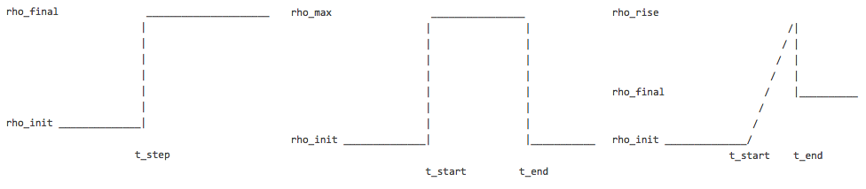
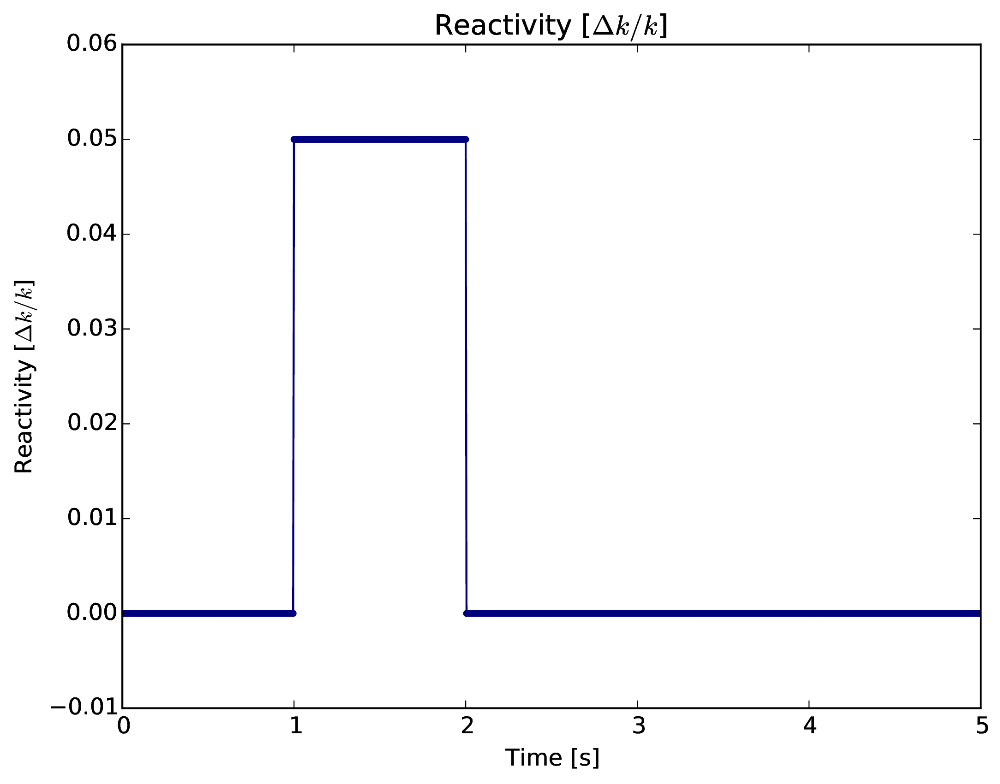
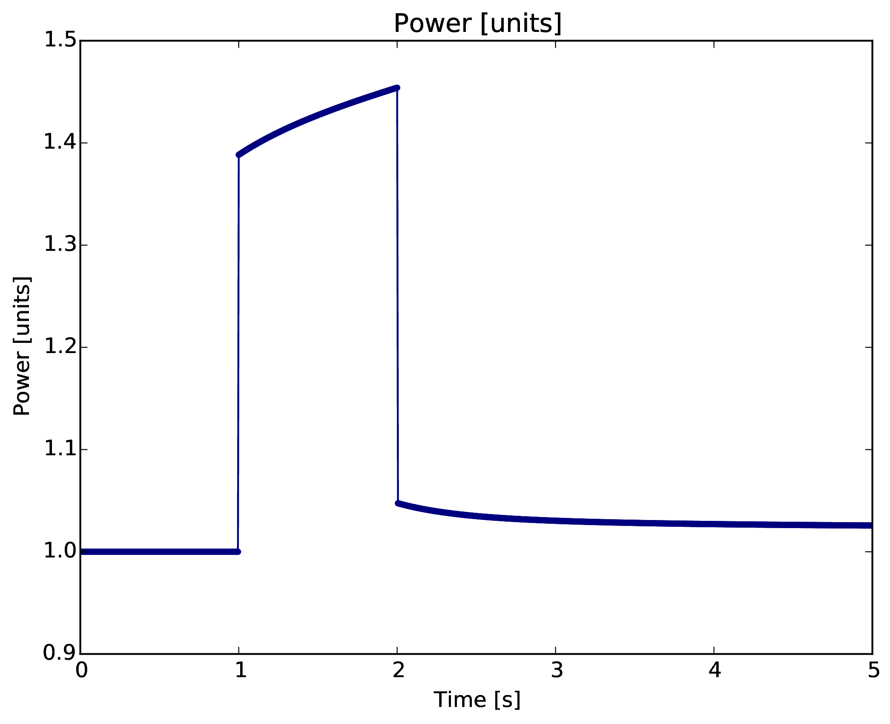
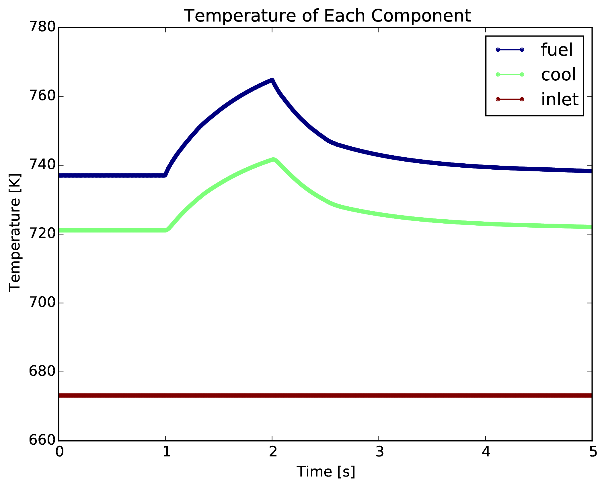

:author: Kathryn Huff
:email: katyhuff@gmail.com
:institution: University of California, Berkeley

-----------------------------------------------------
PyRK: A Python Package For Nuclear Reactor Kinetics
-----------------------------------------------------

.. class:: abstract

   In this work, a new python package, PyRK (Python for Reactor Kinetics), is
   introduced.  PyRK has been designed to simulate, in zero
   dimensions, the transient, coupled, thermal-hydraulics and neutronics of
   time-dependent behavior in nuclear reactors. PyRK is intended for analysis
   of many commonly studied transient scenarios including normal reactor
   startup and shutdown as well as abnormal scenarios including Beyond Design
   Basis Events (BDBEs) such as Accident Transients Without Scram (ATWS). For
   robustness, this package employs various tools within the scientific python
   ecosystem. For additional ease of use, it employs a reactor-agnostic,
   object-oriented data model, allowing nuclear engineers to rapidly prototype
   nuclear reactor control and safety systems in the context of their novel
   nuclear reactor designs.

.. class:: keywords

   engineering, nuclear reactor, package

Introduction
------------

Time-dependent fluctuations in neutron population, fluid flow, and heat transfer are
essential to understanding the performance and safety of a reactor. Such
*transients* include normal reactor startup and shutdown as well as abnormal scenarios
including Beyond Design Basis Events (BDBEs) such as Accident Transients
Without Scram (ATWS). However, no open source tool currently exists for
reactor transient analysis. To fill this gap, PyRK (Python for Reactor
Kinetics) [Huff2015]_, a new python package for nuclear reactor kinetics, was
created. PyRK is the first open source tool capable of:

- time-dependent,
- lumped parameter thermal-hydraulics,
- coupled with neutron kinetics,
- in 0-dimensions,
- for nuclear reactor analysis,
- of any reactor design,
- in an object-oriented context.

As background, this paper will introduce necessary concepts for understanding
the PyRK model and will describe the differential equations representing the
coupled physics at hand. Next, the implementation of the data model, simulation
framework, and numerical solution will be described. This discussion will
include the use, in PyRK [Huff2015]_, of many parts of the scientific python
software ecosystem such as NumPy [vanderWalt2011]_ for array manipulation, SciPy
[Milman2011]_ for ODE and PDE solvers, nose [Pellerin2015]_ for testing,
Pint [Grecco2014]_ for unit-checking, Sphinx [Brandl2009]_ for documentation, and
matplotlib [Hunter2007]_ for plotting.

Background
----------

Fundamentally, nuclear reactor transient analyses must characterize the
relationship between neutron population and temperature. These two
characteristics are coupled together by reactivity, :math:`\rho` , which
characterizes the departure of the nuclear reactor from *criticality*:

.. math::
   :type: align
   :label: reactivity

   \rho &= \frac{k-1}{k}
   \intertext{where}
   \rho &= \mbox{reactivity}\\
   k &= \mbox{neutron multiplication factor}\\
     &= \frac{\mbox{neutrons causing fission}}{\mbox{neutrons produced by fission}}.

The reactor power is stable (*critical*) when the effective multiplication
factor, :math:`k`, equals 1. For this reason, in all power reactors, the scalar
flux of neutrons determines the power. The reactor power, in turn, affects the
temperature. Reactivity feedback then results due to the temperature dependence
of geometry, material densities, the neutron spectrum, and reaction
probabilities [Bell1970]_.  This concept is captured in the feedback diagram in
Figure :ref:`figfeedback`.

   Reactivity feedback couples neutron kinetics and thermal hydraulics
   :label:`figfeedback`

One common method for approaching these transient simulations is a
zero-dimensional approximation which results in differential equations called
the Point Reactor Kinetics Equations (PRKE). PyRK provides a simulation
interface that drives the solution of these equations in a modular, reactor
design agnostic manner. In particular, PyRK provides an object oriented data
model for generically representing a nuclear reactor system and provides the
capability to exchange solution methods from one simulation to another.

The Point Reactor Kinetics Equations can only be understood in the context of
neutronics, thermal-hydraulics, reactivity, delayed neutrons, and reactor
control.

Neutronics
************

The heat produced in a nuclear reactor is due to nuclear fission reactions. In
a fission reaction, a neutron collides inelastically with a 'fissionable'
isotope, which subsequently splits. This reaction emits both heat and neutrons.
When the emitted neutrons go on to collide with another isotope, this is called
a nuclear chain reaction and is the basis of power production in a nuclear
reactor. The study of the population, speed, direction, and energy spectrum of
neutrons in a reactor as well as the related rate of fission at a particular
moment is called neutronics or neutron transport. Neutronics simulations
characterize the production and destruction of neutrons in a reactor and
depend on many reactor material properties and component geometries (e.g.,
atomic densities and design configurations).

Thermal-Hydraulics
********************

Reactor thermal hydraulics describes the mechanics of flow and heat in fluids
present in the reactor core. As fluids are heated or cooled in a reactor core
(e.g. due to changes in fission power) pressure, density, flow, and other
parameters of the system respond accordingly.  The fluid of interest in a
nuclear reactor is typically the coolant.  The hydraulic properties of this
fluid depend primarily on its intrinsic properties and the characteristics of
the cooling system. Thermal hydraulics is also concerned with the heat transfer
between the various components of the reactor (e.g., heat generation in the
reactor fuel heat removal by the coolant). Heat transfer behavior depends on
everything from the moderator density and temperature to the neutron-driven
power production in the fuel.

Reactivity
****************

The two physics (neutronics and thermal-hydraulics) are coupled by the notion
of reactivity, which is related to the probability of fission.  The temperature
and density of materials can increase or decrease this probability. Fission
probability directly impacts the neutron production and destruction rates and
therefore, the reactor power. The simplest form of the equations dictating this
feedback are:

.. math::
   :type: align

   \rho(t) &= \rho_0 + \rho_f(t) + \rho_{ext}
   \intertext{where}
   \rho(t) &= \mbox{total reactivity}\\
   \rho_f(t) &= \mbox{reactivity from feedback}\\
   \rho_{ext}(t) &= \mbox{external reactivity insertion}
   \intertext{and where}
   \rho_f(t) &= \sum_i \alpha_i\frac{\delta T_i}{\delta t}\\
   T_i &= \mbox{temperature of component i}\\
   \alpha_i &= \mbox{temperature reactivity coefficient of i}.

The PRKE
*********
The Point Reactor Kinetics Equations (PRKE) are the set of equations that
capture neutronics and thermal hydraulics when the time-dependent variation of
the neutron flux shape is neglected. That is, neutron population is captured
as a scalar magnitude (a *point*) rather than a geometric distribution. In the PRKE,
neutronics and thermal hydraulics are coupled primarily by reactivity, but have
very different characteristic time scales, so the equations are quite stiff.

.. math::
   :type: equation
   :label: fullprke

   \frac{d}{dt}\left[
    \begin{array}{c}
      p\\
      \zeta_1\\
      .\\
      .\\
      .\\
      \zeta_j\\
      .\\
      .\\
      .\\
      \zeta_J\\
      \omega_1\\
      .\\
      .\\
      .\\
      \omega_k\\
      .\\
      .\\
      .\\
      \omega_K\\
      T_{i}\\
      .\\
      .\\
      .\\
      T_{I}\\
    \end{array}
    \right]
    =
    \left[
      \begin{array}{ c }
        \frac{\rho(t,T_{i},\cdots)-\beta}{\Lambda}p +
        \displaystyle\sum^{j=J}_{j=1}\lambda_{d,j}\zeta_j\\
        \frac{\beta_1}{\Lambda} p - \lambda_{d,1}\zeta_1\\
        .\\
        .\\
        .\\
        \frac{\beta_j}{\Lambda}p-\lambda_{d,j}\zeta_j\\
        .\\
        .\\
        .\\
        \frac{\beta_J}{\Lambda}p-\lambda_{d,J}\zeta_J\\
        \kappa_1p - \lambda_{FP,1}\omega_1\\
        .\\
        .\\
        .\\
        \kappa_kp - \lambda_{FP,k}\omega_k\\
        .\\
        .\\
        .\\
        \kappa_{k p} - \lambda_{FP,k}\omega_{k}\\
        f_{i}(p, C_{p,i}, T_{i}, \cdots)\\
        .\\
        .\\
        .\\
        f_{I}(p, C_{p,I}, T_{I}, \cdots)\\
      \end{array}
      \right]

In the above matrix equation, the following variable definitions are used:

.. math::
   :type: align
   :label: n_data

    p &= \mbox{ reactor power }\\
    \rho(t,&T_{fuel},T_{cool},T_{mod}, T_{refl}) = \mbox{ reactivity}\\
    \beta &= \mbox{ fraction of neutrons that are delayed}\\
    \beta_j &= \mbox{ fraction of delayed neutrons from precursor group j}\\
    \zeta_j &= \mbox{ concentration of precursors of group j}\\
    \lambda_{d,j} &= \mbox{ decay constant of precursor group j}\\
    \Lambda &= \mbox{ mean generation time }\\
    \omega_k &= \mbox{ decay heat from FP group k}\\
    \kappa_k &= \mbox{ heat per fission for decay FP group k}\\
    \lambda_{FP,k} &= \mbox{ decay constant for decay FP group k}\\
    T_i &= \mbox{ temperature of component i}

The PRKE in equation :ref:`fullprke` can be solved in numerous ways, using
either loose or tight coupling.  Operator splitting, loosely coupled in time,
is a stable technique that neglects higher order nonlinear terms in exchange
for solution stability.  Under this approach, the system can be split clearly
into a neutronics sub-block and a thermal-hydraulics sub-block which can be
solved independently at each time step, combined, and solved again for the next
time step.

.. math::
   :type: align
   :label: os

   U^n &= \left[
          \begin{array}{ c }
            N^n\\
            T^n\\
          \end{array}
          \right]\\
   N^{n+1} &= N^n + kf(U^n)\\
   \nonumber\\
   U^* &= \left[
          \begin{array}{ c }
            N^{n+1}\\
            T^n\\
          \end{array}
          \right]\\
   T^{n+1} &= T^n + kf(U^*)

PyRK Implementation
--------------------

Now that the premise of the problem is clear, the implementation of the package
can be discussed. Fundamentally,  PyRK is object oriented and modular. The
important object classes in PyRK are:

- SimInfo: Reads the input file, manages the solution matrix, Timer, and
  communication between neutronics and thermal hydraulics.
- Neutronics : Calculates :math:`\frac{dP}{dt}`, :math:`\frac{d\zeta_j}{dt}`,
  and :math:`\frac{d\omega_j}{dt}`, based on :math:`\frac{dT_i}{dt}` and the
  external reactivity insertion.
- THSystem : Manages various THComponents and facilitates their communication
  during the lumped parameter heat transfer calculation.
- THComponent : Represents a single thermal volume, made of a single material,
  (usually a volume like "fuel" or "coolant" or "reflector" with thermal or reactivity
  feedback behavior distinct from other components in the system.
- Material : A class for defining the intensive properties of a material
  (:math:`c_p`, :math:`\rho`, :math:`k_{th}`). Currently, subclasses include
  FLiBe, Graphite, Sodium, SFRMetal, and Kernel.

A reactor is made of objects, so an object-oriented data model provides the
most intuitive user experience for describing a reactor system, its materials,
thermal bodies, neutron populations, and their attributes. In PyRK, the system,
comprised by those objects is built up by the user in the input file in an
intuitive fashion. Each of the classes that enable this object oriented model
will be discussed in detail in this section.

SimInfo
********

PyRK has implemented a casual context manager pattern by encapsulating
simulation information in a SimInfo object. This class keeps track of the neutronics
system and its data, the thermal hydraulics system (THSystem) and its
components (THComponents), as well as timing and other simulation-wide
parameters.

In particular, the SimInfo object is responsible for capturing the information
conveyed in the input file.  The input file is a python file holding parameters
specific to the reactor design and transient scenario. However, a more robust
solution is anticipated for future versions of the code, relying on a json
input file rather than python, for more robust validation options.

The current output is a plain text log of the input, runtime messages, and the
solution matrix. The driver automatically generates a number of plots.  However,
a more robust solution is anticipated for v0.2, relying on an output database
backend in hdf5, via the pytables package.

Neutronics
***********

The neutronics object holds the first 1+j+k equations in the right hand side of
the matrix equation in :ref:`fullprke`.  In particular, it takes ownership of
the vector of :math:`1+j+k` independent variables and their solution. It also
customizes the equations based on paramters noted in the user input file. The
parameters customizing these equations for a particular reactor include
:math:`\alpha_i` for each component, :math:`j`, :math:`\Lambda`, :math:`k`, and
the fissionable nuclide.

The Neutronics class has three attributes that are sufficiently complex as to
warrant their own classes: PrecursorData, DecayHeat, and ReactivityInsertion.

A Neutronics object can own one PrecursorData object. In this class, the input
parameters :math:`J` and the fissionable nuclide are used to select, from a
database supplied by PyRK, standardized data representing delayed neutron
precursor concentrations and the effective decay constants of those precursors
(:math:`\lambda_{d,j}, \beta_j, \zeta_j`. That nuclear data is stored in the
PrecursorData class, and is made available to the Neutronics class through a
simple API.

A Neutronics object can also own one DecayHeat object. In this class, the input
parameters :math:`K`, and the fissionable nuclide are used to select, the
fission product decay data (:math:`\lambda_{FP,k}, \omega_k, \kappa_k`. The
DecayHeat class provides a simple API for accessing those decay constants,
fission product fractions, and weighting factors.

Finally, a Neutronics object can own one ReactivityInsertion object. This
defines the external reactivity, :math:`rho_ext`, resulting from control rods,
external neutron sources, etc. With this ReactivityInsertion object, the
Neutronics class is equipped to drive a reactivity insertion accident scenario.
That is, an accident scenario can be driven by an insertion of reactivity (e.g.
the removal of a control rod). In PyRK, this reactivity insertion capability is
captured in the ReactivityInsertion class, from which reactivity insertions can
be selected and customized as in Figure :ref:`figri`.

   The reactivity insertion that can drives the PyRK simulator can be selected
   and customized from three models. :label:`figri`

THSystem
**********

A reactor is made up of many material structures which, in addition to their
neutronic response, vary in their temperature response. These structures may
include fuel, cladding, coolant, reflectors, or other components.
In PyRK, a heat transfer model of the changing temperatures and material
properties of those components has been implemented as a lumped capacitance
model. This model approximates heat transfer into discrete components,
approximating the effects of geometry for "lumps" of material.

In this model, heat transfer through a system of components is modeled
analogously to current through a resistive circuit. Table :ref:`tablumpedcap`
describes the various canonical forms of lumped capacitance heat transfer
modes.

.. raw:: latex

    \begin{table}
    \centering
    \begin{tabular}{|l|c|c|}
    \hline
    Mode & Heat Transfer Rate & Thermal Resistance \\
    \hline
    Conduction
    & $\dot{Q}= \frac{T_1-T_2}{\left ( \frac{L}{kA} \right )}$
    & $\frac{L}{kA}$\\
    \hline
    Convection
    &$\dot{Q}=\frac{T_{surf}-T_{envr}}{\left ( \frac{1}{h_{conv}A_{surf}} \right )}$
    &$\frac{1}{h_{conv}A_{surf}}$\\
    \hline
    Radiation
    &$\dot{Q}=\frac{T_{surf}-T_{surr}}{\left ( \frac{1}{h_rA_{surf}} \right )}$
    &$\frac{1}{h_rA}$\\
    & & $h_r= \epsilon \sigma (T_{surf}^{2}+T_{surr}^{2})(T_{surf}+T_{surr})$\\
    \hline
    \end{tabular}
    \end{table}

.. table:: Lumped Capacitance for various heat transfer modes [Lienhard2011]_ :label:`tablumpedcap`

   +--------+
   |        |
   +--------+

Based on the modes in Table :ref:`tablumpedcap`, we can formulate a model for
component temperatures specific to to the geometry of a particular reactor
design. This might include fuel pellets, particles, or pebbles, cladding,
coolant, reflectors or other structures in the design.

Fundamentally, to determine the temperature change in a thermal body of the
reactor, we rely on relations between temperature, heat capacity, and thermal
resistance. As in Table :ref:`tablumpedcap`, the heat flow out of body :math:`i` is
the sum of surface heat flow by conduction, convection, radiation, and other
mechanisms to each adjacent body, :math:`j` [Lienhard2011]_:

.. math::
   :type: align

   Q &= Q_i + \sum_j Q_{ij}\\
      &=Q_i +  \sum_j\frac{T_{i} - T_{j}}{R_{th,ij}}
    \intertext{where}
    \dot{Q} &= \mbox{total heat flow out of body i }[J\cdot s^{-1}]\\
    Q_i &= \mbox{other heat transfer, a constant }[J\cdot s^{-1}]\\
    T_i &= \mbox{temperature of body i }[K]\\
    T_j &= \mbox{temperature of body j }[K]\\
    j &= \mbox{adjacent bodies }[-]\\
    R_{th} &= \mbox{thermal resistence of the component }[K \cdot s \cdot J^{-1}].

Note also that the thermal energy storage and release in the body is
accordingly related to the heat flow via capacitance:

.. math::
   :type: align

    \frac{dT_{i}}{dt} &= \frac{-Q + \dot{S_i}}{C_i}
    \intertext{where}
    C &= \mbox{heat capacity of the object }[J\cdot K^{-1}]\\
      &= \left(\rho c_pV\right)_i\\
    \dot{S_i} &= \mbox{source term, thermal energy conversion }[J \cdot s^{-1}]

Together, these form the equation:

.. math::
   :type: align

    \frac{dT_{i}}{dt} &= \frac{-\left[Q_i +  \sum_j\frac{T_{i} - T_{j}}{R_{th,ij}}\right] + \dot{S_i}}{\left(\rho c_pV\right)_i}

THComponent
***********

The THSystem class is made up of THComponent objects, linked together at
runtime by heat transfer interfaces selected by the user in the input file:

.. code-block:: python

    fuel = th.THComponent(name="fuel",
                          mat=Kernel(name="fuelkernel"),
                          vol=vol_fuel,
                          T0=t_fuel,
                          alpha_temp=alpha_f,
                          timer=ti,
                          heatgen=True,
                          power_tot=power_tot)

    cool = th.THComponent(name="cool",
                          mat=Flibe(name="flibe"),
                          vol=vol_cool,
                          T0=t_cool,
                          alpha_temp=alpha_c,
                          timer=ti)

    clad = th.THComponent(name="clad",
                          mat=Zirconium(name="zirc"),
                          vol=vol_clad,
                          T0=t_clad,
                          alpha_temp=alpha_clad,
                          timer=ti)

    components = [fuel, clad, cool]

    # The fuel conducts to the cladding
    fuel.add_conduction('clad', area=a_fuel)
    clad.add_conduction('fuel', area=a_fuel)

    # The clad convects to the coolant
    clad.add_convection('cool', h=h_clad, area=a_clad)
    cool.add_convection('clad', h=h_clad, area=a_clad)

In the above example, the `mat` argument must include a Material object.

Material
*********
The PyRK Material class allows for materials of any kind to be defined within
the system. This class represents a generic material and daughter classes
inheriting from the Material class describe specific types of material (water,
graphite, uranium oxide, etc.). The attributes of a material object are
intrinsic material properties (such as thermal conductivity, :math:`k_th`) as
well as material-specific behaviors.

Given these object classes, the burden of the user is then confined to:

- defining the simulation information (such as duration or preferred solver)
- defining the neutronic parameters associated with each thermal component
- defining the materials of each component
- identifying the thermal components
- and connecting those components together by their dominant heat transfer mode.

Quality Assurance
-----------------

For robustness, a number of tools were used to improve robustness and
reproducibility in this package. These include:

- GitHub : for version control hosting [GitHub2015]_
- Matplotlib : for plotting [Hunter2007]_
- Nose : for unit testing [Pellerin2015]_
- NumPy : for holding and manipulating arrays of floats [vanderWalt2011]_
- Pint : for dimensional analysis and unit conversions [Grecco2014]_
- SciPy : for ode solvers [Oliphant2007]_ [Milman2011]_
- Sphinx : for automated documentation [Brandl2009]_
- Travis-CI : for continuous integration [Travis2015]_

Together, these tools create a functional framework for distribution and reuse.

Unit Validation
*****************

Of particular note, the Pint package[Grecco2014]_ is used for keeping track of
units, converting between them, and throwing errors when unit conversions are
not sane. For example, in the code below, the user is able to initialize the
material object with :math:`k_{th}` and :math:`c_p` in any valid unit for those
quantities. Upon initialization of those member variables, the input values are
converted to SI using Pint.

.. code-block:: python

   def __init__(self, name=None,
                k=0*units.watt/units.meter/units.kelvin,
                cp=0*units.joule/units.kg/units.kelvin,
                dm=DensityModel()):
       """Initalizes a material

       :param name: The name of the component
       :type name: str.
       :param k: thermal conductivity, :math:`k_{th}`
       :type k: float, pint.unit.Quantity
       :param cp: specific heat capacity, :math:`c_p`
       :type cp: float, pint.unit.Quantity
       :param dm: The density of the material
       :type dm: DensityModel object
       """
       self.name = name
       self.k = k.to('watt/meter/kelvin')
       validation.validate_ge("k", k,
           0*units.watt/units.meter/units.kelvin)
       self.cp = cp.to('joule/kg/kelvin')
       validation.validate_ge("cp", cp,
           0*units.joule/units.kg/units.kelvin)
       self.dm = dm

The above code employs a validation utility written for PyRK and used
throughout the code to confirm (at runtime) types, units, and valid ranges for
parameters of questionable validity.  Those validators are simple, but
versatile, and in combination with the Pint package, provide a robust
environment for users to experiment with parameters in the safe confines of
dimensional accuracy.

Minimal Example : SFR Reactivity Insertion
------------------------------------------

To demonstrate the use of this simulation framework, we give a minimal example.
This example approximates a 10-second step-reactivity insertion in a sodium
cooled fast reactor. This type of simulation is common, as it represents the
instantaneous removal of a control rod. The change in reactivity results in a
slightly delayed change in power and corresponding increases in temperatures
throughout the system. For simplicity, the heat exchanger outside of the
reactor core is assumed to be perfectly efficient and the inlet coolant
temperature is held constant throughout the transient.

Minimal Example: Input Parameters
*********************************

The parameters used to configure the simulation were
retrieved from :ref:`Ragusa2011`, :ref:`Sofu200?`, and :ref:`asm2015`. The
detailed input is listed in the full input file with illuminating comments as
follows:

.. include:: ./papers/kathryn_huff/min_ex.txt

Minimal Example Results
***********************

The results of this simulation are a set of plots, the creation and labelling
of which are enabled by matplotlib. In the first of these plots, the transient,
beginning at time :math:`t=1s`, is driven by a step reactivity insertion of 0.5
"dollars" of reactivity as in Figure :ref:`figinsertion`.

   A prompt reactivity insertion, with a duration of 1
   second and a magnitude of :math:`0.05\delta k/k`
   drives the simulation. It represents the prompt partial removal and
   reinsertion of a control rod.
   :label:`figinsertion`

The power responsds accordingly as in Figure :ref:`figpower`.

   The power in the reactor closely follows the reactivity insertion, but is
   magnified as expected. :label:`figpower`

Finally, the temperatures in the key components of the system follow the trends
in Figure :ref:`figtemps`.

   While the inlet temperature remains constant as a boundary condition, the
   temperatures of fuel and coolant respond to the reactivity insertion event.
   :label:`figtemps`

These are typical of the kinds of results nuclear engineers seek from this kind
of analysis and can be quickly reparameterized in the process of protoyping
nuclear reactor designs. This particular simulation is not sufficiently
detailed to represent a benchmark, as the effect of the cladding on heat
transfer is neglected, as is the Doppler model controlling fuel temperature
feedback. However, it presents a sufficiently interesting case to demonstrate
the use of the PyRK tool.

Conclusions and Future Work
----------------------------

The PyRK library provides a modular simulation environment for a common and
essential calculation in nuclear engineering. PyRK is the first freely
distributed tool for neutron kinetics. By supplying a library of ANSI standard
precursor data, a modular material definition framework, and coupled lumped
parameter thermal hydraulics with zero-dimensional neutron kinetics in an
object-oriented modeling paradigm, PyRK provides design-agnostic toolkit for
accident analysis potentially useful to all nuclear reactor designers and analysts.

Acknowledgements
-----------------

The author would like to thank the contributions of collaborators Xin Wang, Per
Peterson, Ehud Greenspan, and Massimiliano Fratoni at the University of
California Berkeley. This research was performed using funding received from
the U.S. Department of Energy Office of Nuclear Energy's Nuclear Energy
University Programs through the FHR IRP. Additionally, this material is based
upon work supported by the Department of Energy National Nuclear Security
Administration under Award Number: DE-NA0000979 through the Nuclear Science and
Security Consortium.

References
----------

.. [Andreades2014] C. Andreades, A. T. Cisneros, J. K. Choi, A. Y. . Chong, D. L. Krumwiede, L. Huddar, K. D. Huff, M. D. Laufer, M. Munk, R. O. Scarlat, J. E. Seifried, N. Zwiebaum, E. Greenspan, and P. F. Peterson, "Technical Description of the 'Mark 1' Pebble-Bed, Fluoride-Salt-Cooled, High-Temperature Reactor Power Plant," University of California, Berkeley, Department of Nuclear Engineering, Berkeley, CA, Thermal Hydraulics Group UCBTH-14-002, Sep. 2014.

.. [Bell1970] G. I. Bell and S. Glasstone, Nuclear Reactor Theory. New York: Van Nostrand Reinhold Company, 1970.

.. [Brandl2009] G. Brandl, Sphinx: Python Documentation Generator. URL: http://sphinx.  pocoo. org/index. html (13.8. 2012), 2009.

.. [GitHub2015] GitHub, "GitHub: Build software better, together," GitHub, 2015. [Online]. Available: https://github.com. [Accessed: 17-Jun-2015].

.. [Grecco2014] H. E. Grecco, Pint: a Python Units Library.  https://github.com/hgrecco/pint.  2014.

.. [Huff2015] K. Huff, PyRK: Python for Reactor Kinetics. https://pyrk.github.io. 2015.

.. [Hunter2007] J. D. Hunter, "Matplotlib: A 2D Graphics Environment," Computing in Science & Engineering, vol. 9, no. 3, pp. 90–95, 2007.

.. [Lienhard2011] Lienhard V and J. H. Lienhard IV, A Heat Transfer Textbook: Fourth Edition, Fourth Edition edition. Mineola, N.Y: Dover Publications, 2011.

.. [Milman2011] K. J. Millman and M. Aivazis, "Python for Scientists and Engineers," Computing in Science & Engineering, vol. 13, no. 2, pp. 9–12, Mar. 2011.

.. [Oliphant2007] T. E. Oliphant, "Python for Scientific Computing," Computing in Science & Engineering, vol. 9, no. 3, pp. 10–20, 2007.

.. [Pellerin2015] J. Pellerin, nose. https://pypi.python.org/pypi/nose/1.3.7. 2015.

.. [Travis2015] Travis, “travis-ci/travis-api,” GitHub repository. Available: https://github.com/travis-ci/travis-api. Accessed: 04-Jul-2015.

.. [vanderWalt2011] S. van der Walt, S. C. Colbert, and G. Varoquaux, "The NumPy Array: A Structure for Efficient Numerical Computation," Computing in Science & Engineering, vol. 13, no. 2, pp. 22–30, Mar. 2011.
