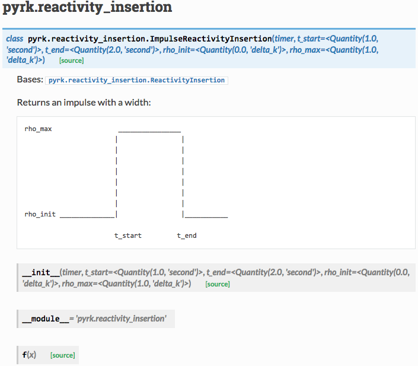

:author: Kathryn Huff
:email: katyhuff@gmail.com
:institution: University of California, Berkeley

-----------------------------------------------------
PyRK: A Python Package For Nuclear Reactor Kinetics
-----------------------------------------------------

.. class:: abstract

   In this work, a new python package, PyRK (Python for Reactor Kinetics), is introduced and demonstrated.  PyRK has been
   designed to simulate, in zero dimensions, the transient, coupled, thermal-hydraulics and neutronics of time-dependent behavior in nuclear reactors. PyRK is intended for analysis of many commonly studied transient scenarios including normal reactor startup and
   shutdown as well as abnormal scenarios including Beyond Design Basis Events
   (BDBEs) such as Accident Transients Without Scram (ATWS). This package employs various toolsallows
   nuclear engineers to rapidly prototype nuclear reactor control and safety
   systems in the context of their novel nuclear reactor designs. One application
   of this package presented here captures the evolution of accident scenarios in
   a novel reactor design, the Pebble-Bed, Fluoride-Salt-Cooled, High- Temperature
   Reactor.

.. class:: keywords

   engineering, nuclear reactor, package

Introduction
------------
In this work, PyRK, a new python package for nuclear reactor kinetics, is
introduced and demonstrated. PyRK (Python for Reactor Kinetics,
\cite{huff_pyrk:_2015}) has been designed for coupled thermal-hydraulics and
neutronics for 0-dimensional, transient, nuclear reactor analysis.
PyRK is intended for analysis of many commonly studied transient scenarios
including normal reactor startup and shutdown as well as abnormal scenarios
including Beyond Design Basis Events (BDBEs) such as Accident Transients
Without Scram (ATWS). This package allows nuclear engineers to rapidly
prototype nuclear reactor control and safety systems in the context of their
novel nuclear reactor designs. The demonstration of this package presented here
captures the evolution of accident scenarios in a novel reactor design, the
Pebble-Bed, Fluoride-Salt-Cooled, High-Temperature Reactor
\cite{andreades_technical_2014}.

Fundamentally, such transient nuclear reactor analyses must characterize the
relationship between neutron population and temperature, which are coupled
together by reactivity. That is, any change in power of a reactor can be
related to a quantity known as the reactivity, :math:`\rho` , which characterizes the
offset of the nuclear reactor from criticality; In all power reactors, the
scalar flux of neutrons determines the reactor’s power. The reactor power, in
turn, affects the temperature. Reactivity feedback then results, due the
temperature dependence of geometry, material densities, the neutron spectrum,
and microscopic cross sections \cite{bell_nuclear_1970}.

One common method for approaching these transient simulations is a
zero-dimensional approximation which results in differential equations called
the Point Reactor Kinetics Equations (PRKE). PyRK provides a simulation
interface that drives the solution of these equations in a modular, reactor
design agnostic manner. In particular, PyRK provides an object oriented data
model for generically representing a nuclear reactor system provides
interchangeable solution methods to these equations.

For background, this paper will introduce necessary concepts for understanding
the PyRK model and will describe the differential equations representing the
coupled physics at hand. Next, the implementation of the data model, simulation
framework, and numerical solution will be described. This discussion will
include the use, in PyRK, of many parts of the scientific python software
ecosystem: NumPy for array manipulation, SciPy for ODE and PDE solvers, nose
for testing, distutils for packaging, Pint for unit-checking, and Sphinx for
documentation. Finally, this paper conclude with a demonstration of accident
simulations conducted in the context of the Pebble-Bed, Fluoride-Salt-Cooled,
High-Temperature Reactor \cite{andreades_technical_2014}.

Background
----------

The Point Reactor Kinetics Equations can only be understood in the context of
neutronics, thermal-hydraulics, reactivity, delayed neutrons, and reactor
control. 

Neutronics
************

The heat produced in a nuclear reactor is due to nuclear fission reactions. In
a fission reaction, a neutron collides inellastically with a 'fissionable'
isotope, which subsequently splits. This reaction emits both heat and neutrons.
When the emitted neutrons go on to collide with another isotope, this is called
a nuclear chain reaction and is the basis of power production in a nuclear
reactor. The study of the population, speed, direction, and energy spectrum of
neutrons in a reactor as well as the related rate of fission at a particular
moment is called neutronics or neutron transport. Neutronics simulations
characterize the production and destruction of neutrons in a reactor and
dependend on many reactor material properties and design choices (e.g.,
atomic densities and material configurations).

Thermal-Hydraulics
********************

Reactor thermal hydraulics describes the mechanics of flow and heat in fluids
present in the reactor core. As fluids are heated or cooled in a reactor core
(e.g. due to changes in fission power) pressure, density, flow, and other
parameters of the system respond accordingly.  The fluid of interest in a
nuclear reactor is typically the coolant.  The hydraulic properties of this
fluid depend primarily on its intrinsic properties and the characteristics of
the cooling system. Thermal hydraulics is also concerned with the heat transfer
between thevarious components of the reactor (e.g., heat generation in the
reactor fuel heat removal by the coolant). Heat transfer behavior depends on
everything from the moderator density and temperature to the neutron-driven
power production in the fuel.

Reactivity
****************
The two physics are coupled by the notion of reactivity, which is related to
the probility of fission due to material properties. The temperature and
density of materials can increase or decrease this probability, which directly
impacts the neutron production and destruction rates and therefore, the reactor
power. TODO, this bit is badly writ.

The PRKE
*********
The Point Reactor Kinetics Equations (PRKE) are the set of equations that
capture neutronics and thermal hydraulics when geometry is neglected. The two
physics are coupled primarily by reactivity, but have very different
characteristic time scales, so the equations are quite stiff. 

.. math::
   :type: equation
   :label: full_prke

   \frac{d}{dt}\left[
    \begin{array}{c}
      p\\
      \zeta_1\\
      .\\
      .\\
      .\\
      \zeta_j\\
      .\\
      .\\
      .\\
      \zeta_J\\
      \omega_1\\
      .\\
      .\\
      .\\
      \omega_k\\
      .\\
      .\\
      .\\
      \omega_K\\
      T_{fuel}\\
      T_{cool}\\
      T_{refl}\\
      T_{matr}\\
      T_{grph}\\
      .\\
      .\\
      .\\
    \end{array}
    \right]
    =
    \left[
      \begin{array}{ c }
        \frac{\rho(t,T^{fuel},T_{cool},\cdots)-\beta}{\Lambda}p +
        \displaystyle\sum^{j=J}_{j=1}\lambda_j\zeta_j\\
        \frac{\beta_1}{\Lambda} p - \lambda_1\zeta_1\\
        .\\
        .\\
        .\\
        \frac{\beta_j}{\Lambda}p-\lambda_j\zeta_j\\
        .\\
        .\\
        .\\
        \frac{\beta_J}{\Lambda}p-\lambda_J\zeta_J\\
        \kappa_1p - \lambda_1\omega_1\\
        .\\
        .\\
        .\\
        \kappa_kp - \lambda_k\omega_k\\
        .\\
        .\\
        .\\
        \kappa_{k p} - \lambda_k\omega_{k}\\
        f_{fuel}(p, C_p^{fuel}, T_{fuel}, T_{cool},\cdots)\\
        f_{cool}(C_p^{cool}, T_{fuel}, T_{cool},\cdots)\\
        f_{refl}(C_p^{refl}, T_{fuel}, T_{refl},\cdots)\\
        f_{matr}(C_p^{matr}, T_{fuel}, T_{matr},\cdots)\\
        f_{grph}(C_p^{grph}, T_{fuel}, T_{grph},\cdots)\\
        .\\
        .\\
        .\\
      \end{array}
      \right]

The PRKE can be solved in numerous ways, using either loose or tight coupling.
Operator splitting, loosely coupled in time, is a stable technique that
neglects higher order nonlinear terms in exchange for solution stability.
Under this approach, the system can be split clearly into a neutronics
sub-block and a thermal-hydraulics sub-block which can be solved independently
at each time step, combined, and solved again for the next time step.

.. math::
   :type: eqnarray
   :label: os

   U^n &= \left[
          \begin{array}{ c }
            N^n\\
            T^n\\
          \end{array}
          \right]\\
   N^{n+1} &= N^n + kf(U^n)\\
   \nonumber\\
   U^* &= \left[
          \begin{array}{ c }
            N^{n+1}\\
            T^n\\
          \end{array}
          \right]\\
   T^{n+1} &= T^n + kf(U^*)

Of course, no paper would be complete without some source code.  Without
highlighting, it would look like this::
Heat rransfer} focuses on the heat generation in the reactor fuel and the removal of that heat by the moderator.

   def sum(a, b):
       """Sum two numbers."""

       return a + b

With code-highlighting:

.. code-block:: python

   def sum(a, b):
       """Sum two numbers."""

       return a + b

Maybe also in another language, and with line numbers:

.. code-block:: c
   :linenos:

   int main() {
       for (int i = 0; i < 10; i++) {
           /* do something */
       }
       return 0;
   }

Or a snippet from the above code, starting at the correct line number:

.. code-block:: c
   :linenos:
   :linenostart: 2

   for (int i = 0; i < 10; i++) {
       /* do something */
   }
 
Important Part
--------------

It is well known [Atr03]_ that Spice grows on the planet Dune.  Test
some maths, for example :math:`e^{\pi i} + 3 \delta`.  Or maybe an
equation on a separate line:

.. math::

   g(x) = \int_0^\infty f(x) dx

or on multiple, aligned lines:

.. math::
   :type: eqnarray

   g(x) &=& \int_0^\infty f(x) dx \\
        &=& \ldots

The area of a circle and volume of a sphere are given as

.. math::
   :label: circarea

   A(r) = \pi r^2.

.. math::
   :label: spherevol

   V(r) = \frac{4}{3} \pi r^3

We can then refer back to Equation (:ref:`circarea`) or
(:ref:`spherevol`) later.

Mauris purus enim, volutpat non dapibus et, gravida sit amet sapien. In at
consectetur lacus. Praesent orci nulla, blandit eu egestas nec, facilisis vel
lacus. Fusce non ante vitae justo faucibus facilisis. Nam venenatis lacinia
turpis. Donec eu ultrices mauris. Ut pulvinar viverra rhoncus. Vivamus
adipiscing faucibus ligula, in porta orci vehicula in. Suspendisse quis augue
arcu, sit amet accumsan diam. Vestibulum lacinia luctus dui. Aliquam odio arcu,
faucibus non laoreet ac, condimentum eu quam. Quisque et nunc non diam
consequat iaculis ut quis leo. Integer suscipit accumsan ligula. Sed nec eros a
orci aliquam dictum sed ac felis. Suspendisse sit amet dui ut ligula iaculis
sollicitudin vel id velit. Pellentesque hendrerit sapien ac ante facilisis
lacinia. Nunc sit amet sem sem. In tellus metus, elementum vitae tincidunt ac,
volutpat sit amet mauris. Maecenas [#]_ diam turpis, placerat [#]_ at adipiscing ac,
pulvinar id metus.

.. [#] On the one hand, a footnote.
.. [#] On the other hand, another footnote.

   This is the caption. :label:`egfig`

.. figure:: figure1.png
   :align: center
   :figclass: w

   This is a wide figure, specified by adding "w" to the figclass.  It is also
   center aligned, by setting the align keyword (can be left, right or center).

.. figure:: figure1.png
   :scale: 20%
   :figclass: bht

   This is the caption on a smaller figure that will be placed by default at the
   bottom of the page, and failing that it will be placed inline or at the top.
   Note that for now, scale is relative to a completely arbitrary original
   reference size which might be the original size of your image - you probably
   have to play with it. :label:`egfig2`

As you can see in Figures :ref:`egfig` and :ref:`egfig2`, this is how you reference auto-numbered
figures.

.. table:: This is the caption for the materials table. :label:`mtable`

   +------------+----------------+
   | Material   | Units          |
   +============+================+
   | Stone      | 3              |
   +------------+----------------+
   | Water      | 12             |
   +------------+----------------+
   | Cement     | :math:`\alpha` |
   +------------+----------------+

We show the different quantities of materials required in Table
:ref:`mtable`.

.. The statement below shows how to adjust the width of a table.

.. raw:: latex

   \setlength{\tablewidth}{0.8\linewidth}

.. table:: This is the caption for the wide table.
   :class: w

   +--------+----+------+------+------+------+--------+
   | This   | is |  a   | very | very | wide | table  |
   +--------+----+------+------+------+------+--------+

Unfortunately, restructuredtext can be picky about tables, so if it simply
won't work try raw LaTeX:

.. raw:: latex

   \begin{table*}

     \begin{longtable*}{|l|r|r|r|}
     \hline
     \multirow{2}{*}{Projection} & \multicolumn{3}{c|}{Area in square miles}\tabularnewline
     \cline{2-4}
      & Large Horizontal Area & Large Vertical Area & Smaller Square Area\tabularnewline
     \hline
     Albers Equal Area  & 7,498.7 & 10,847.3 & 35.8\tabularnewline
     \hline
     Web Mercator & 13,410.0 & 18,271.4 & 63.0\tabularnewline
     \hline
     Difference & 5,911.3 & 7,424.1 & 27.2\tabularnewline
     \hline
     Percent Difference & 44\% & 41\% & 43\%\tabularnewline
     \hline
     \end{longtable*}

     \caption{Area Comparisons \DUrole{label}{quanitities-table}}

   \end{table*}

Perhaps we want to end off with a quote by Lao Tse [#]_:

  *Muddy water, let stand, becomes clear.*

.. [#] :math:`\mathrm{e^{-i\pi}}`

.. Customised LaTeX packages
.. -------------------------

.. Please avoid using this feature, unless agreed upon with the
.. proceedings editors.

.. ::

..   .. latex::
..      :usepackage: somepackage

..      Some custom LaTeX source here.

References
----------

.. [And14] Andreades, etc.

.. [Atr03] Andreades, etc.
