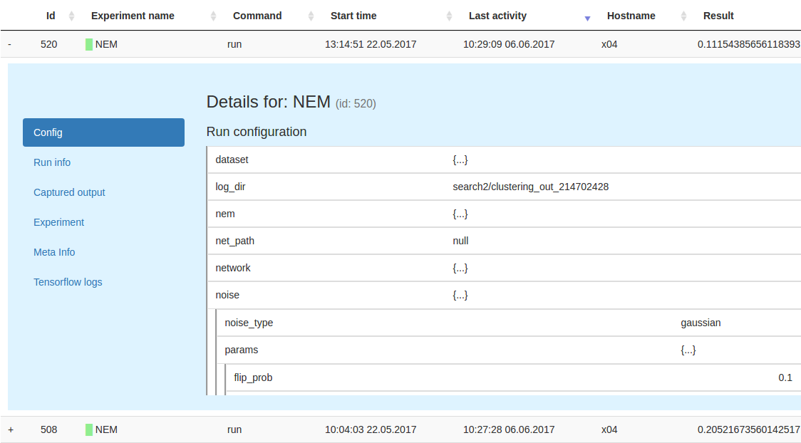

:author: Klaus Greff
:email: klaus@idsia.ch
:institution: Istituto Dalle Molle di Studi sull'Intelligenza Artificiale (IDSIA)
:institution: Università della Svizzera italiana (USI)
:institution: Scuola universitaria professionale della Svizzera italiana (SUPSI)

:author: Aaron Klein
:email: kleinaa@cs.uni-freiburg.de
:institution: University of Freiburg

:author: Martin Chovanec
:email: chovamar@fit.cvut.cz
:institution: Czech Technical University in Prague

:author: Frank Hutter
:email: fh@cs.uni-freiburg.de
:institution: University of Freiburg

:author: Jürgen Schmidhuber
:email: juergen@idsia.ch
:institution: Istituto Dalle Molle di Studi sull'Intelligenza Artificiale (IDSIA)
:institution: Università della Svizzera italiana (USI)
:institution: Scuola universitaria professionale della Svizzera italiana (SUPSI)

:bibliography: sacred

.. .:video: http://www.youtube.com/watch?v=dhRUe-gz690

----------------------------------------------------
The Sacred Infrastructure for Computational Research
----------------------------------------------------

.. class:: abstract

We present a toolchain for computational research consisting of Sacred and two supporting tools.
Sacred is an open source Python framework which aims to provide basic infrastructure for running computational experiments independent of the methods and libraries used.
Instead, it focuses on solving universal everyday problems, such as managing configurations, reproducing results, and bookkeeping.
Moreover, it provides an extensible basis for other tools, two of which we present here: Labwatch helps with tuning hyperparameters, and Sacredboard provides a web-dashboard for organizing and analyzing runs and results.

.. class:: keywords

   reproducible research, python, machine learning, database, hyperparameter optimization

Introduction
============

A major part of machine learning research typically involves a large number of computational experiments run with many different hyperparameter settings.
This process holds many practical challenges, such as bookkeeping and maintaining reproducibility.
To make matters worse, experiments are often run on diverse and heterogeneous environments, ranging from laptops to cloud computing nodes.
Due to deadline pressure and the inherently unpredictable nature of research, there is usually little incentive for researchers to build robust infrastructures.
As a result, research code often evolves quickly and compromises important aspects like bookkeeping and reproducibility.

Many tools exist for tackling different aspects of this process, including databases, version control systems, command-line interface generators, tools for automated hyperparameter optimization, spreadsheets, and so on.
Few, however, integrate these aspects into a unified system, so each tool has to be learned and used separately, each incurring its own overhead.
Since there is no common basis to build a workflow, the tools people build will be tied to their particular setup.
This impedes sharing and collaboration on tools for important problems like optimizing hyperparameters, summarizing and analyzing results, rerunning experiments, distributing runs, etc..

Sacred aims to fill this gap by providing basic infrastructure for running computational experiments.
We hope that it will help researchers and foster the development of a rich collaborative ecosystem of shared tools.
In the following, we briefly introduce Sacred and two supporting tools:
*Labwatch* integrates a convenient unified interface to several automated hyperparameter optimizers, such as random search, RoBO, and SMAC.
*Sacredboard* offers a web-based interface to view runs and organize results.

Sacred
======
Sacred [#]_ is an open source Python framework that bundles solutions for some of the most frequent challenges of computational research.
It does not enforce any particular workflow and is independent of the choice of machine learning libraries.
Designed to remain useful even under deadline pressure, Sacred aims to
offer maximum convenience while minimizing boilerplate code.
By combining these features into a unified but flexible workflow, Sacred enables its users to focus on research, and still ensures that all the relevant information for each run are captured.
Its standardized configuration process allows streamlined integration with other tools, such as Labwatch for hyperparameter optimization.
Through storage of run information in a central database, comprehensive query and sorting functionality for bookkeeping becomes available.
This further enables downstream analysis and allows other tools, such as Sacredboard, to provide a powerful user interface for organizing results.

.. [#] https://github.com/IDSIA/Sacred

Overview
--------
The core abstraction of Sacred is the ``Experiment`` class that needs to be instantiated for each computational experiment.
It serves as the central hub for defining configuration, functions, and for accessing the other features.
To adopt Sacred, all that is required is to instantiate an ``Experiment`` and to decorate the main function to serves as entry-point.
A minimal example could look like this:

.. code-block:: python

    from sacred import Experiment
    ex = Experiment()

    @ex.automain
    def main():
        ...  # <= experiment code here
        return 42

This experiment is ready to be run and would return a *result* of 42.
It already features an automatically generated commandline interface, collects relevant information about dependencies and the host system, and can do bookkeeping.
The experiment can be extended in several ways to define (hyper-) parameters that can later be changed externally.

The experiment can be run through its command-line interface, or directly from Python by calling ``ex.run()``.
Both modes offer the same ways for passing options, setting parameters, and adding observers.
Once this experiment is started, Sacred will 1) interpret the options, 2) evaluate the parameter configuration, 3) gather information about dependencies and host, and 4) construct and call a ``Run`` object that is responsible for executing the main function.
In the previous minimal example the output would look like this:

.. code-block:: bash

    WARNING - my_example - No observers have been added
    INFO - my_example - Running command 'main'
    INFO - my_example - Started
    INFO - my_example - Result: 42
    INFO - my_example - Completed after 0:00:00

For each run, relevant information such as parameters, package dependencies, host information, source code, and results are automatically captured.
The Run also captures the stdout, custom information and fires events at regular intervals that can be observed for bookkeeping, by optional *observers*.
Several built-in observers are available for databases, disk storage, or sending out notifications.

Configuration
-------------
An important goal of Sacred is to make it convenient to define, update and use hyperparameters, which we will call the *configuration* of the experiment.
The main way to set up the configuration is through functions decorated with ``@ex.config``:

.. code-block:: python

    @ex.config
    def cfg():
        nr_hidden_units = 512
        optimizer = 'sgd'
        learning_rate = 0.1
        log_dir = 'log/NN{}'.format(nr_hidden_units)

When running an experiment, Sacred executes these functions and adds their local variables to the configuration.
This syntactically convenient way of defining parameters leverages the full expressiveness of Python, including complex expressions, function calls, and interdependent variables.
Alternatively, plain dictionaries or external configuration files can also be used.

.. Using Config Values

To make parameters easily accessible throughout the code, Sacred employs the technique of *dependency injection*:
any function decorated by ``@ex.capture`` can simply accept any configuration entry as a parameter.
Whenever such a function is called, Sacred will automatically pass those parameters by name from the configuration.
This allows for the flexible and convenient use of the hyperparameters throughout the experiment code:

.. code-block:: python

    @ex.capture
    def set_up_optimizer(loss, optimizer, learning_rate):
        OptClass = {
            'sgd': tf.train.GradientDescentOptimizer,
            'adam': tf.train.AdamOptimizer}[optimizer]
        opt = OptClass(learning_rate=learning_rate)
        return opt.minimize(loss)

When calling the ``setup_optimizer`` function, both the ``optimizer`` and the ``learning_rate`` arguments can be omitted.
They will then be filled in automatically from the configuration.
These injected values can be mixed freely with normal parameters, and injection follows the priority: 1) explicitly passed arguments 2) configuration values 3) default values.

The main benefit of config parameters is that they can be controlled externally when running an experiment.
This can happen both from the command line

.. code-block:: bash

    >> python my_experiment.py with optimizer='adam'
    ... learning_rate=0.001

or from Python calls:

.. code-block:: python

    from my_experiment import ex
    ex.run(config_updates={'nr_hidden_units': 64})

Sacred treats these values as fixed while executing the config functions.
In this way, they influence dependent values as you would expect.
Thus in our example ``log_dir`` would be set to ``"log/NN64"`` .

Groups of config values that should be saved or always be set together can be collected in so called *named configurations*.
These are defined analogous to configurations using a function decorated by ``@ex.named_config`` (or dictionaries / config files):

.. code-block:: python

    @ex.named_config
    def adam():
        optimizer = 'adam'
        learning_rate = 0.001

Named configs can be added both from the command line and from Python, after which they are treated as a set of updates:

.. code-block:: bash

    >> python my_experiment.py with adam

Reproducibility
---------------
An important goal of Sacred is to collect all necessary information to make computational experiments reproducible while remaining lightweight enough to be used for each run, even during development.
In this respect it differs from environment capturing tools such as ReproZip :cite:`chirigati2016reprozip`, CDE :cite:`guo2012`, PTU :cite:`pham2013using` and CARE :cite:`janin2014care`.
These tools *ensure* reproducibility by tracking and storing all data files and libraries used during a run at the system level.
Sacred in contrast uses heuristics to capture the source code and for determining versions of used packages, collects limited but customizable information about the host system, and offers support for manually adding relevant data files.
It explicitly excludes system libraries that are not python packages, data files that are not specifically added by the user, and hardware other than the CPU and GPU.
This trade-off allows Sacred to run efficiently regarding computational overhead and required storage capacity at the expense of reproducibility on systems that differ too much from the original host.
The focus is on the ability of the researcher to reproduce their results.
For distributing the code, we advise the use of one of the above-mentioned environment capturing tools.

The source code of an experiment is arguably the most important piece of information for reproducing any result.
Unfortunately, research code often has to be rapidly adapted under deadline pressure.
A typical pattern in practice is, therefore, to quickly change something and start a run, without properly committing the changes into a VCS system.
To deal with such an unstructured implementation workflow, Sacred doesn't rely on any VCS system (In contrast to Sumatra :cite:`davison2012`) and instead automatically detects and stores the source files alongside the run information [#]_.
Source files are gathered by inspecting all imported modules and keeping those defined within the (sub-)directories of the main script.
This heuristic works well for flat use-cases that consist only of a few sources but fails to detect files that are imported deeper in the dependency tree.
For cases of more complex source code structure Sacred also supports a stricter Git-based workflow and can automatically collect the current commit and state of the repository for each run.
The optional ``--enforce-clean`` flag forces the repository to be clean (not contain any uncommitted changes) before the experiment can be started.
Relevant dependencies can also always be added manually by calling ``ex.add_source_file(FILENAME)``.

.. [#] It does, however, avoid duplicating files that remain unchanged to reduce storage requirements.

Similarly, Sacred collects information about the package dependencies, by inspecting the imported modules.
For all modules that are do not correspond to local source files or builtins, it uses several heuristics to determine the version number.
First, it checks the ``__version__`` property and variations thereof.
If that fails it uses the (much slower) Python package resource API to
This detection will catch all dependencies imported from the main file of the experiment but will miss dependencies deeper down the dependency graph and any dynamic imports that happen only during runtime.
Here again, further dependencies can be added manually using ``ex.add_package_dependency(NAME, VERSION)``

Sacred also collects information about the host system including the hostname, type and version of the operating system, Python version, and the CPU.
Optionally, it supports information about GPU, environment variables, and can be easily extended to collect custom information.

Randomness
----------
Randomization is an important part of many machine learning algorithms, but it inherently conflicts with the goal of reproducibility.
The solution, of course, is to use pseudo-random number generators (PRNG) that take a seed and generate seemingly random numbers in a deterministic fashion.
However, if the seed is set to a fixed value as part of the code, then all runs will be deterministic, which can be an undesired effect.
Sacred solves this problem by generating a new seed that is stored as part of the configuration for each run.
It can be accessed from the code in the same way as every other config entry.
Furthermore, Sacred automatically seeds the global PRNGs of the ``random`` and ``numpy`` modules when starting an experiment, thus making most sources of randomization reproducible without any intervention from the user.

Bookkeeping
-----------

Bookkeeping in Sacred is accomplished by implementing the observer pattern :cite:`gamma1994`:
The experiment publishes all the collected information in the form of events, to which observers can subscribe.
Observers can be added dynamically from the command line or directly in code:

.. code-block:: python

    from sacred.observers import MongoObserver
    ex.observers.append(MongoObserver.create("DBNAME"))

Events are fired when a run is started, every 10 seconds during a run (heartbeat), and once it stops (either successfully or by failing).
The information is thus already available during runtime, and partial data is captured even in the case of failures.
The most important events are:

Started Event
    Fired when running an experiment, just before the main method is executed.
    Contains configuration values, start time, package dependencies, host information, and some meta information.
Heartbeat Event
    Fired continuously every 10 seconds while the experiment is running.
    Contains the beat time, captured stdout/stderr, custom information, and preliminary result.
Completed Event
    Fired once the experiment completes successfully.
    Contains the stop time and the result.
Failed Event
    Fired if the experiment aborts due to an exception.
    Contains the stop time and the stack trace.

Sacred ships with observers that store all the information from these events in a MongoDB, SQL database, or locally on disk.
Furthermore, there are two observers that can send notifications about runs via Telegram :cite:`telegram` or Slack :cite:`slack`, respectively.
Moreover, the observer interface is generic and supports easy addition of custom observers.

The recommended observer is the ``MongoObserver``, which writes to a MongoDB :cite:`mongo`.
MongoDB is a noSQL database, or more precisely a *Document Database*:
it allows the storage of arbitrary JSON documents without the need for a schema as in a SQL database.
These database entries can be queried based on their content and structure.
This flexibility makes it a good fit for Sacred because it permits arbitrary configuration of each experiment that can still be queried and filtered later on.
This feature, in particular, has been very useful in performing large-scale studies such as the one in previous work :cite:`greff2015`.
A slightly shortened example database entry corresponding to our minimal example from above could look like this:

.. code-block:: json

    {"_id": 1,
     "captured_out": "[...]",
     "status": "COMPLETED",
     "start_time": "2017-05-30T20:34:38.855Z",
     "experiment": {
         "mainfile": "minimal.py",
         "sources": [["minimal.py", "ObjectId([...])"]],
         "repositories": [],
         "name": "minimal",
         "dependencies": ["numpy==1.11.0",
                          "sacred==0.7.0"],
         "base_dir": "/home/greff/examples"},
     "result": 42,
     "info": {},
     "meta": {"command": "main",
              "options": ["..."]},
     "format": "MongoObserver-0.7.0",
     "resources": [],
     "host": {"os": "Linux-3.16.0-4-amd64-x86_64",
              "cpu": "Intel(R) Core(TM) i5-4460  CPU",
              "hostname": "zephyr",
              "ENV": {},
              "python_version": "3.4.2"},
     "heartbeat": "2017-05-30T20:34:38.902Z",
     "config": {"seed": 620395134},
     "command": "main",
     "artifacts": [],
     "stop_time": "2017-05-30T20:34:38.901Z"
     }

Labwatch
========

Finding the correct hyperparameter for machine learning algorithms can sometimes make the difference between state-of-the-art performance and performance that is as bad as random guessing.
It is often done by trial and error despite a growing number of tools that can automate the optimization of hyperparameters.
Their adoption is hampered by the fact that each optimizer requires the user to adapt their code to a certain interface.
Labwatch [#]_ simplifies this process by integrating an interface to a variety of hyperparameter optimizers into Sacred.
This allows for easy access to hyperparameter optimization in daily research.

.. [#] https://github.com/automl/labwatch

LabAssistant
------------

At the heart of Labwatch is the so-called LabAssistant, which connects the Sacred experiment with a hyperparameter configuration search space (in short: *searchspace*) and a hyperparameter optimizer through a MongoDB database.
For bookkeeping, it leverages the database storage of evaluated hyperparameter configurations, which allows parallel distributed optimization and also enables the use of post hoc tools for assessing hyperparameter importance (e.g. fANOVA :cite:`hutter-icml14a`).
When using Labwatch, the required boilerplate code becomes:

.. code-block:: python

    from sacred import Experiment
    from labwatch.assistant import LabAssistant
    from labwatch.optimizers import RandomSearch
    
    ex = Experiment()       
    a = LabAssistant(experiment=ex,
                     database_name="labwatch",
                     optimizer=RandomSearch)

.. Labwatch provides a simple way for defining searchspaces that is well integrated into the Sacred workflow, and integrates hyperparameter optimizers such as various Bayesian optimization methods (e.g `RoBO <https://github.com/automl/RoBO/>`_ , `SMAC <https://github.com/automl/SMAC3/>`_) random search, or bandit strategies  (Hyperband [4])

Search Spaces
-------------

In general, Labwatch distinguishes between *categorical* hyperparameters that can have only discrete choices and *numerical* hyperparameters that can have either integer or float values.
For each hyperparameter, the search space defines a prior distribution (e.g. uniform or Gaussian) as well as its type, scale (e.g. log scale, linear scale) and default value.

Search spaces follow the same interface as Sacred's named configurations:

.. code-block:: python

    @ex.config
    def cfg():
        batch_size = 128
        learning_rate = 0.001

    @a.searchspace
    def search_space():
        learning_rate = UniformFloat(lower=10e-3,
                                     upper=10e-2,
                                     default=10e-2,
                                     log_scale=True)
        batch_size = UniformNumber(lower=32,
                                   upper=64,
                                   default=32,
                                   type=int,
                                   log_scale=True)

This ``search_space`` can likewise be specified when executing the Experiment through the command line:

.. code-block:: bash

    >> python my_experiment.py with search_space

Labwatch then triggers the optimizer to suggest a new configuration based on all configurations that are stored in the database and have been drawn from the same search space.

Multiple Search Spaces
----------------------

Labwatch also supports multiple search spaces, which is convenient if one wants to switch between optimizing different sets of hyperparameters.
Assume that we only want to optimize the learning rate and keep the batch size fixed, we can create a second smaller search space:

.. code-block:: python

    @a.searchspace
    def small_search_space():
        learning_rate = UniformFloat(lower=10e-3,
                                     upper=10e-2,
                                     default=10e-2,
                                     log_scale=True)

This can be run in the same way as before by just swapping out the name of the searchspace:

.. code-block:: bash

    >> python my_experiment.py with small_search_space

The optimizer will now only suggest a value for the learning rate and leaves all other hyperparameters, such as the batch size, untouched.

Hyperparameter Optimizers
-------------------------

Labwatch offers a simple and flexible interface to a variety of state-of-the-art hyperparameter optimization methods, including:

- **Random search** is probably the simplest hyperparameter optimization method :cite:`bergstra-jmlr12a`. It just samples hyperparameter
  configurations randomly from the corresponding prior distributions. It can be used in discrete as well as continuous search spaces and can easily be run in parallel.

- **Bayesian optimization**  fits a probabilistic model to capture the current belief of the objective function :cite:`shahriari-ieee16a, snoek-nips12a`.
  To select a new configuration, it uses a utility function that only depends on the probabilistic model to trade off exploration and exploitation.
  There are different ways to model the objective function: 
  
  Probably the most common way is to use a **Gaussian process** to model the objective function, which tendn to work well in low (<10) dimensional continuous search spaces but do not natively work with categorical hyperparameters.
  Furthermore, due to their cubic complexity, they do not scale well with the number of function evaluations.
  We used RoBO [#]_ as an implementation, which is based on the George GP library :cite:`hodlr`.

  **SMAC** is also a Bayesian optimization method, but uses random forest instead of Gaussian processes to model
  the objective function :cite:`hutter-lion11a`. Random forest natively allow to work in high dimensional mixed continuous and discrete input spaces but seem to work less efficient compared
  to Gaussian processes in low-dimensional continuous searchspaces :cite:`eggensperger-bayesopt13`.
 
  More recently, Bayesian neural networks have been used for Bayesian optimization :cite:`snoek-icml15a, springenberg-nips2016`.
  Compared to Gaussian processes, they scale very well in the number of function evaluation as well as in the number of dimensions.
  Here we use the **Bohamiann** approach :cite:`springenberg-nips2016`, which is also implemented in the RoBO framework.

.. [#] https://github.com/automl/RoBO

For each of these optimizers, Labwatch provides an adapter that integrates them into a common interface:

.. code-block:: python

    class Optimizer(object):

        def suggest_configuration(self):
            # Run the optimizer and
            # return a single configuration
            return config

        def update(self, configs, costs, runs):
            # Update the internal
            # state of the optimizer
            pass

This allows researchers to easily integrate their own hyperparameter optimization method into Labwatch.
They only need to implement an adapter that provides the ``suggest_configuration()`` method which returns a single configuration to Sacred, and the ``update()`` method, which gets all evaluated configuration and costs, and updates the internal state of the optimizer.

Sacredboard
===========
Sacredboard provides a convenient way for browsing runs of experiments stored in a Sacred MongoDB database.
It consists of a lightweight ``flask``-based web server that can be run on any machine with access to the database.
The hosted web-interface shows a table view of both running and finished experiments, which are automatically updated.
Sacredboard shows the current state and results, and offers a detail view that includes configuration, host information, and standard output of each run.
At the moment, it relies exclusively on the MongoDB backend of Sacred, but in the future, we hope to support other options for bookkeeping as well.

Filtering
---------
Experiments can be filtered by status to, for example, quickly remove failed experiments from the overview.
Sacredboard also supports filtering by config values, in which case the user specifies a property name and a condition.
By default, the name refers to a variable from the experiment configuration, but by prepending a dot (``.``), it can refer to arbitrary stored properties of the experiment.
Possible conditions include numerical comparisons (:math:`=, \neq, <, >, \ge, \le`) as well as regular expressions.
Querying elements of dictionaries or arrays can be done using the dot notation (e.g. ``.info.my_dict.my_key``).
A few useful properties to filter on include: the standard output (``.captured_out``), experiment name (``.experiment.name``),
the info dictionary content (``.info.custom_key``), hostname (``.host.hostname``) and the value returned from the experiment's main function (``.result``).
These filters can be freely combined.

.. figure:: sacredboard.png
    :scale: 34 %
    :alt: Sacredboard interface

    Sacredboard user interface

The Details View
----------------

Clicking on any of the displayed runs expands the row to a details-view that shows the hyperparameters used, information about the machine, the environment where the experiment was run, and the standard output produced by the experiment.
The view is organised as a collapsible table, allowing dictionaries and arrays to be easily browsed.

    Sacredboard detail view

Connecting to TensorBoard
-------------------------
­­­
Sacredboard offers an experimental integration with TensorBoard — the web-dashboard for the popular TensorFlow library :cite:`tensorflow`.
Provided that the experiment was annotated with ``@sacred.stflow.LogFileWriter(ex)`` as in our example below and a TensorFlow log has been created during the run, it is possible to launch TensorBoard directly from the Run detail view.

Plotting Metrics
----------------
Sacredboard can visualize metrics such as accuracy or loss if they are tracked using Sacreds metrics interface.
Metrics can be tracked through the Run object, which is accessible by adding the special ``_run`` variable to a captured function.
This object provides a ``log_scalar`` method than can be called with an arbitrary metric name, its value, and (optionally) the corresponding iteration number:

.. code-block:: python

    _run.log_scalar("test.accuracy", 35.25, step=50)

The values for each metric are aggregated into a list of step index and values, where the last step number is autoincremented if the ``step`` parameter is omitted.
Sacredboard will display metrics collected in this form as plots in the details view.

.. _sacred-example:

Example
=======
In this section, we combine everything for the machine-learning-equivalent of a hello world program: MNIST classification.
Here we use the current development version of Sacred and the Tensorflow and Keras libraries.

Header
------
First, we import the required packages and functions.
Then an ``Experiment`` and a ``LabAssistant`` are instantiated:

.. code-block:: python

    import tensorflow as tf
    from tensorflow import placeholder
    from tensorflow.examples.tutorials.mnist import \
        input_data

    from keras import backend as K
    from keras.layers import Dense
    from keras.objectives import categorical_crossentropy
    from keras.metrics import categorical_accuracy

    import sacred
    import labwatch
    from labwatch.optimizers import RandomSearch

    ex = sacred.Experiment()
    la = labwatch.LabAssistant(ex, optimizer=RandomSearch)

Configuration and Searchspace
-----------------------------
Now we can define the configuration of the experiment.
Note that we specify six parameters and that the ``log_dir`` depends on the ``hidden_units``:

.. code-block:: python

    @ex.config
    def cfg():
        hidden_units = 512
        batch_size = 32
        nr_epochs = 100
        optimizer = 'sgd'
        learning_rate = 0.1
        log_dir = 'log/NN{}'.format(hidden_units)

We also make use of a ``named_config`` to group together the adam optimizer with a reduced learning rate.
In this way, we can start the experiment by specifying ``with adam`` and have both parameters changed.

.. code-block:: python

    @ex.named_config
    def adam():
        optimizer = 'adam'
        learning_rate = 0.001

Finally, we define a searchspace over ``learning_rate`` and ``hidden_units``, naturally treated in log-space.
Now we can run our experiment using ``with search_space`` and have these two parameters set to suggestions by our hyperparameter optimizer (here ``RandomSearch``).

.. code-block:: python

    @la.searchspace
    def search_space():
        learning_rate = UniformFloat(0.001, 1.0,
                                     log_scale=True)
        hidden_units = UniformInt(32, 512,
                                  log_scale=True)

Captured Functions
------------------
Sacreds config injection allows us to use the configuration parameters in any captured function.
So here we use this feature to define two helper functions that set up our neural network model and our optimizer.
Note that the ``set_up_optimizer`` function also takes the loss, which is not part of the configuration and has therefore to be passed normally:

.. code-block:: python

    @ex.capture
    def build_model(hidden_units):
        img = placeholder(tf.float32, shape=(None, 784))
        label = placeholder(tf.float32, shape=(None, 10))

        h = Dense(hidden_units, activation='relu')(img)
        preds = Dense(10, activation='softmax')(h)

        loss = tf.reduce_mean(
            categorical_crossentropy(label, preds))
        accuracy = tf.reduce_mean(
            categorical_accuracy(label, preds))

        return img, label, loss, accuracy

    @ex.capture
    def set_up_optimizer(loss, optimizer, learning_rate):
        OptClass = {
            'sgd': tf.train.GradientDescentOptimizer,
            'adam': tf.train.AdamOptimizer}[optimizer]
        opt = OptClass(learning_rate=learning_rate)
        return opt.minimize(loss)

Main Method
-----------
Finally, the main method combines everything and serves as the entry point for execution.
We've decorated it with ``@sacred.stflow.LogFileWriter(ex)`` to automatically capture the log directory used for the ``FileWriter`` in the appropriate format for Sacredboard.
The main method is also automatically a captured function, and takes three of the configuration values as parameters.
It also accepts a special parameters ``_run`` which grants access to the current ``Run`` object.
Note that we call the other captured functions without passing any of the configuration values, since they will be filled in automatically.

.. code-block:: python

    @ex.automain
    @sacred.stflow.LogFileWriter(ex)
    def main(batch_size, nr_epochs, log_dir, _run):
        # initialize tensorflow and load data
        sess = tf.Session()
        K.set_session(sess)
        mnist = input_data.read_data_sets('MNIST_data',
                                          one_hot=True)

        # call captured functions for model and optimizer
        img, label, loss, acc = build_model()
        train_step = set_up_optimizer(loss)

        # set up FileWriter for later use of Tensorboard
        summary_writer = tf.summary.FileWriter(log_dir)
        summary_writer.add_graph(tf.get_default_graph())

        # initialize variables and main loop
        sess.run(tf.global_variables_initializer())
        for epoch in range(nr_epochs):
            batch = mnist.train.next_batch(batch_size)
            _, l, a = sess.run([train_step, loss, acc],
                               feed_dict={label: batch[1],
                                          img: batch[0]})

            # add loss and accuracy as metrics
            _run.log_scalar("train.cross_entropy", l)
            _run.log_scalar("train.accuracy", a, epoch)

        # return test accuracy as final result
        return sess.run(acc, feed_dict={
                             img: mnist.test.images,
                             label: mnist.test.labels})

Related Work
============
We are aware of only a few projects that have a focus similarly broad as Sacred, the closest one being Sumatra :cite:`davison2012`.
Both projects are very similar in that they collect and store information about sources, dependencies, configurations, and host information.
Their main difference is that Sumatra comes as a command line tool for running experiments "from the outside", while Sacred was designed as a Python package to be used from within the experiment script.
So while Sacred is limited to Python scripts, Sumatra can track any executable as long as its command line interface matches a certain structure.
This, on the other hand, allows sacred to provide many conveniences like the flexible configuration system with configuration injection, automatic seeding of random number generators, support for live updated custom information, and integration with 3rd party libraries like Tensorflow.
It also means that Sacred scripts are self-sufficient, while Sumatra relies on a separate outside project-configuration stored in a hidden `.smt` directory.
Another subtle but important difference is that Sumatra relies mainly on SQL for storing run information, while Sacred favors MongoDB.
The use of this schema-free database enables querying Sacred runs based on dynamic structure such as configuration entries (even nested ones) and custom information.

Workflow management systems such as Taverna :cite:`wolstencroft2013taverna`, Kepler :cite:`altintas2004kepler`, Vistrails :cite:`bavoil2005vistrails`, and Galaxy :cite:`giardine2005galaxy` can also capture provenance information and ensure reproducibility.
They let the user define a workflow based on standardized components, often through a graphical user interface without any direct programming.
Implementing a custom component is usually difficult, which restricts their usefulness to the supported ones and thus to their intended domain.
The line between workflow management and free-form programming blurs with tools like Reskit :cite:`reskit` and FBLearner Flow :cite:`fblearner_flow`.
Sacred, however, is targeted at general machine learning audience, and therefore works with arbitrary python instead of some set of standardized components.

Experiment databases :cite:`vanschoren2012, smith2014, empirical` represent a related bodey of work by making an effort to unify the process and storage of machine learning problems and experiments by expressing them in a common language.
By standardizing that language, they improve comparability and communicability of the results.
The most well-known example might be the OpenML project :cite:`vanschoren2014`.
This standardization has benefits, but also imposes certain restrictions on the conducted experiments.
Therefore, to keep Sacred as general as possible, we chose not to build it ontop of an experiment database.
That being said, we believe there is a lot of value in adding (optional) interfaces to experiment databases to Sacred.

There are several tools such as noWorkflow :cite:`pimentel2015collecting`, ProvenanceCurious :cite:`huq2013provenance`, and others :cite:`bochner2008python` to extract fine-grained provenance information from python scripts.
Whereas Sacred treats the executed code mostly as a black box, these tools use inspection and tracing techniques to extract function call graphs and data flow.
This information is then often stored in the form of the Open Provenance Model in a relational database and enables in-depth analysis of the performed computations.

Some other projects, including FGLab :cite:`fglab`, the proprietary Aetros :cite:`aetros`, and Neptune :cite:`neptune`, focus on providing a dashboard.
Jobman :cite:`jobman` is a Python library for scheduling lots of machine learning experiments which also  helps in organizing hyperparameter searches and bookkeeping.
Several projects exist with a focus on capturing the entire environment of an experiment to ensure its reproducibility.
They include tools such as ReproZip :cite:`chirigati2016reprozip`, CDE :cite:`guo2012`, PTU :cite:`pham2013using`, CARE :cite:`janin2014care`.
They trace dependencies on an operating system  level and help in packaging everything that is needed to rerun an experiment exactly.

Conclusion
==========
Sacred is an open source Python framework which aims to provide infrastructure for computational experiments with minimal boilerplate code and maximum convenience.
This paper presented its key features and demonstrated how they interact to tackle some of the basic problems of computational experimentation, like managing parameters, bookkeeping, and reproducibility.
We hope that through convenience and modularity, Sacred will help to build a rich ecosystem of tools.
Two such supporting tools are Labwatch and Sacredboard.
Labwatch interfaces the powerful configuration system of sacred with several hyperparameter optimization libraries, thus significantly simplifying the tuning of configurations.
Sacredboard, on the other hand, provides a web-based interface to view recorded runs, facilitating a live overview of all the experiments.

Future Work
===========
Sacred has been useful for many researchers already, but there are still many possible improvements on our roadmap.
This includes support for more complex experimental setups, like having separate training and evaluation scripts as is common with large Tensorflow models.
Similarly, it would be interesting to offer support and a clear workflow for the continuation of aborted runs.

While Sacred helps to capture relevant information about experiments, it does not offer much support for organizing and analyzing results.
To tackle this we plan to provide a unified interface for querying the records created by different observers.
This semi-standardized format will enable the creation of general analysis tools, and extend the applicability of existing tools like Sacredboard.

Another important direction is to simplify the process of actually reproducing Sacred experiments.
An integration with tools like Docker or ReproZip could allow for completely automated re-running of experiments.

Finally, we plan on improving the support of Sacred for scheduling and distributing runs.
It already supports "queueing up" experiments, which only creates a database entry containing the sources, desired configuration, and the status ``QUEUED``.
In the future, we hope to include workers that can be run on different machines and which will fetch queued runs from the database and execute them.
This way, Sacred could offer basic support for distributing computations.

Acknowledgements
================
This work has partly been supported by the European Research Council (ERC) under the European Union’s Horizon 2020 research and innovation programme under grant no. 716721, by the Euro-
pean Commission under grant no. H2020-ICT-645403-ROBDREAM, and by the German Research Foundation (DFG) under Priority Programme Autonomous Learning (SPP 1527, grant HU 1900/3-1).
This research was supported by the EU project ``INPUT`` (H2020-ICT-2015 grant no. 687795).
Access to computing and storage facilities owned by parties and projects contributing to the Czech National Grid Infrastructure MetaCentrum provided under the programme “Projects of Large Research, Development, and Innovations Infrastructures” (CESNET LM2015042) is greatly appreciated.

.. Customised LaTeX packages
.. -------------------------

.. latex::
   :usepackage: microtype
