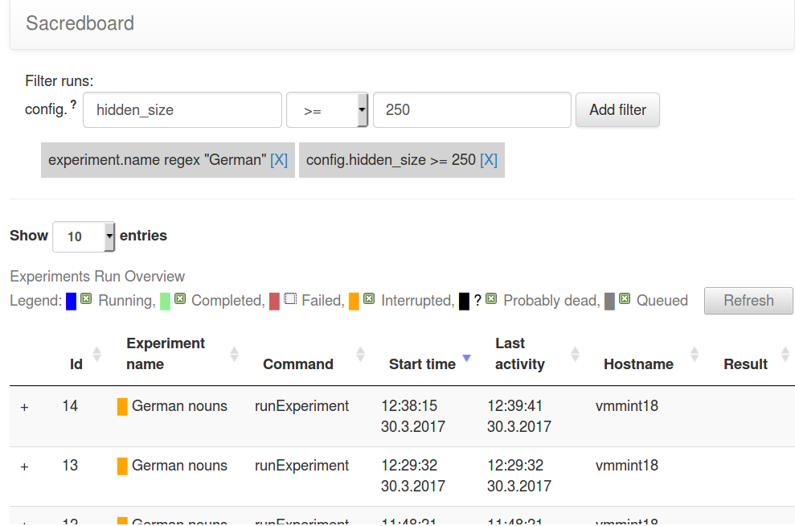

:author: Klaus Greff
:email: klaus@idsia.ch
:institution: Istituto Dalle Molle di Studi sull'Intelligenza Artificiale (IDSIA)
:institution: Università della Svizzera italiana (USI)
:institution: Scuola universitaria professionale della Svizzera italiana (SUPSI)

:author: Aaron Klein
:email: kleinaa@cs.uni-freiburg.de
:institution: University of Freiburg

:author: Martin Chovanec
:email: chovamar@fit.cvut.cz
:institution: Czech Technical University in Prague

:author: Frank Hutter
:email: fh@cs.uni-freiburg.de
:institution: University of Freiburg

:author: Jürgen Schmidhuber
:email: juergen@idsia.ch
:institution: Istituto Dalle Molle di Studi sull'Intelligenza Artificiale (IDSIA)
:institution: Università della Svizzera italiana (USI)
:institution: Scuola universitaria professionale della Svizzera italiana (SUPSI)

:bibliography: sacred

.. .:video: http://www.youtube.com/watch?v=dhRUe-gz690

----------------------------------------------------
The Sacred Infrastructure for Computational Research
----------------------------------------------------

.. class:: abstract

We present a toolchain for computational research consisting of Sacred and the two supporting tools Labwatch and Sacredboard.
Sacred is an open source python framework which aims provide basic infrastructure for running computational experiments and independent of the methods and libraries used
Instead it focusses on solving  universal everyday problems like managing configurations, reproducing results, and bookkeeping.
It also aims to provide an extensible basis for other tools, two of which we present here: Labwatch helps with tuning hyperparameters, and Sacredboard provides a web-dashboard for organizing and analyzing runs and results.

.. class:: keywords

   reproducible research, python, machine learning, database, hyperparameter optimization

Introduction
============

A major part of machine learning research has become empirical and typically includes a large number of computational experiments run with many different hyperparameter settings.
This process holds many practical challenges such as managing configurations, hyperparameter tuning, ensuring reproducibility, bookkeeping of the runs, and organizing and maintaining an overview over  the results.
To make matters worse, experiments are often run on diverse and heterogeneous environments ranging from laptops to cloud computing nodes.
Due to deadline pressure and the inherently unpredictable nature of research there is usually little incentive for researchers to build robust infrastructures.
As a result, research code often evolves quickly and makes bad trade-offs that sacrifice important aspects like bookkeeping and reproducibility.

Many tools exist for tackling different aspects of this process like databases, version control systems, command-line interface generators, tools for automated hyperparameter optimization, spreadsheets, and so on.
However, very few tools integrate these aspects into a unified system, so each tool has to be learned and used separately, each incurring its own overhead.
Since there is no common basis to build a workflow, the tools people build will be tied to their particular setup.
This impedes sharing and collaboration on tools for important problems like optimizing hyperparameters, summarizing and analysing results, rerunning experiments, distributing runs, etc..

Sacred aims to fill this gap by providing some basic infrastructure for running computational experiments.
It is our hope that it will help researchers and foster the development of a rich collaborative ecosystem of shared tools.
In the following we briefly introduce Sacred and two supporting tools:
Labwatch integrates a convenient unified interface to many automated hyperparameter optimizers such as RoBO, SMAC, or random search.
Sacredboard offers a web-based interface to view runs and supports maintaining an overview and organizing results.

Sacred
======
Sacred [#]_ is an open source Python framework that aims to bundle solutions for some of the most frequent challenges of computational research.
It does not enforce any particular workflow, and is independent of the choice of machine learning libraries.
Sacred was designed to remain useful even under deadline pressure, and therefore tries to
offer maximum convenience while minimizing boilerplate code.
By combining these features into a unified but flexible workflow, Sacred  enables its users to focus on research and still ensures that all the relevant information for each run are captured.
Its standardized configuration process allows streamlined integration with other tools such as Labwatch, for hyperparameter optimization.
Through storage of run information in a central database comprehensive query and sorting functionality for bookeeping becomes available.
This further enables downstream analysis and allows other tools such as Sacredboard to provide a powerful user interface for organizing results.

.. [#] https://github.com/IDSIA/Sacred

Overview
--------
To adopt Sacred all that is required is to instantiate an ``Experiment`` (its central class) and to decorate a main function to serves as entry-point.
A minimal example would thus look like this:

.. code-block:: python

    from sacred import Experiment
    ex = Experiment()

    @ex.automain
    def main():
        return 42

This experiment is ready to be run and would return a *result* of 42.
It already features an automatically generated commandline interface, collects relevant information about dependencies and the host system, and can do bookkeeping if any observers are added (e.g. through the commandline).
The experiment can be extended in several ways to define (hyper-) parameters that can later be changed externally.

The experiment can be run through its command-line interface, or directly from Python by calling ``ex.run()``.
Both modes offer the same ways for passing options, setting parameters, and adding observers.
Once this experiment is started Sacred will 1) interpret the options 2) evaluate the parameter configuration 3) gathers information about dependencies and host, and 4) constructs and calls a ``Run`` object that is responsible for executing the main function.
In the previous minimal example the output would look like this:

.. code-block:: bash

    WARNING - my_example - No observers have been added to this run
    INFO - my_example - Running command 'main'
    INFO - my_example - Started
    INFO - my_example - Result: 42
    INFO - my_example - Completed after 0:00:00

For each run, relevant information like parameters, package dependencies, host information, source code, and results are automatically captured, and are saved regularly by optional observers.
The Run also captures the stdout, custom information and fires events at regular intervals that observed for bookkeeping.
Several built-in observers are available for databases, disk storage, or sending out notifications.

Configuration
-------------
An important goal of Sacred is to make it convenient to define, expose and use hyperparameters, which we will call the configuration of the experiment.
The main way to set up the configuration is through functions decorated with ``@ex.config``:

.. code-block:: python

    @ex.config
    def cfg():
        nr_hidden_units = 512
        optimizer = 'sgd'
        learning_rate = 0.1
        log_filename = 'NN_{}.log'.format(nr_hidden_units)

When running an experiment, Sacred executes these functions and adds their local variables to the configuration.
This syntactically convenient way of defining parameters leverages the full expressiveness of Python, including complex expressions, function calls, and interdependent variables.
Alternatively plain dictionaries or external configuration files can also be used.

.. Using Config Values

To make parameters easily accessible throughout the code, Sacred employs the technique of *dependency injection*.
That means, any function decorated by ``@ex.capture`` can simply accept any configuration entry as a parameter.
Whenever such a function is called Sacred will automatically pass those parameters by name from the configuration.
This allows for flexible and convenient use of the hyperparameters everywhere:

.. code-block:: python

    @ex.capture
    def setup_optimizer(optimizer, learning_rate):
        OptClass = {'sgd': SGD, 'adam': ADAM}[optimizer]
        opt = OptClass(learning_rate=learning_rate)
        return opt

So when calling the ``setup_optimizer`` function, both the ``optimizer`` and the ``learning_rate`` argumentes can be omitted and will be filled in automatically.
These injected config values can be mixed freely with normal parameters, and injection follows the priority: 1) explicitly passed arguments, 2) config values, 3) default values.

The main benefit of config parameters is that they can be controlled externally, when running an experiment.
This can happen both from the commandline

.. code-block:: bash

    >> python my_experiment.py with optimizer='adam'
    ... learning_rate=0.001

or from Python calls:

.. code-block:: python

    from my_experiment import ex
    ex.run(config_updates={'learning_rate': 0.3,
                           'nr_hidden_units': 64})

Sacred treats these values as fixed while executing the config functions.
In this way they influence dependent values as you would expect leading to ``log_filename="NN_64.log"`` in our example.

Sets of config values, that should be saved, or always be set together can be collected in so called *named configurations*.
They are defined similar to configurations using a function decorated by ``@ex.named_config``, or dictionaries / config files:

.. code-block:: python

    @ex.named_config
    def adam():
        optimizer = 'adam'
        learning_rate = 0.001

Named configs can be added en-block from the commandline and from Python, and are treated as a set of updates:

.. code-block:: bash

    >> python my_experiment.py with adam

Reproducibility
---------------
An important goal of Sacred is to collect all the necessary information to make computational experiments reproducible.
The result of such an experiment depends on many factors including: the source code, versions of the used packages, system libraries, data-files, the host system, and (pseudo-)randomness.
Tools for reproducible research such as ReproZip :cite:`chirigati2016reprozip`, CDE :cite:`guo2012`, PTU :cite:`pham2013using` and CARE :cite:`janin2014care` trace and package all datafiles and libraries used during a run at the system level.
While these tools are the correct way to go to *ensure* reproducibility, they come with a significant overhead in terms of time and space.
Sacred in contrast aims to provide a practical *default option*, that captures *most* relevant information, while keeping the overhead and required manual work at a minimum.
To that end it tackles four key areas individually: 1) source code, 2) package dependencies, 3) host system, 4) resources, and 5) randomness.

The source code of an experiment is arguably the most important piece of information for reproducing any result.
To manage the quickly evolving code, it is considered good practice to use a version control system such as Git.
In practice however, research-code is often adapted too rapidly.
A common pattern is to quickly change something and start a run, even before properly committing the changes.
To ensure reproducibility even with such an unstructured and spontaneous implementation workflow, Sacred always stores source files alongside the run information.
This very basic version control mechanism guarantees that the current version of the code is saved, by automatically detecting relevant source-files by inspection.
Sacred also supports a more strict Git based workflow and can automatically collect the current commit and state of the repository for each run.
The optional ``--enforce-clean / -e`` flag forces the repository to be clean (not contain any uncommitted changes) before the experiment can be run.

.. MENTION? though relevant files can also be added manually by ``ex.add_source_file(FILENAME)``.
.. MENTION? removes duplication

Python package dependencies too are handled automatically by Sacred.
When an experiment is started Sacred detects imported packages and determines their version-numbers by inspection.
This detection will catch all dependencies that are imported from the main file before the experiment was started and should cover most usecases.
It might, however, miss certain nested imports, so further dependencies can be added manually using ``ex.add_package_dependency(NAME, VERSION)``.

Sacred also collects a small set of information about the host system including the hostname, type and version of the operating system, Python version, and the CPU.
Optionally it supports information about GPUs, and environment variables, and it can be easily extended to collect any custom information.

Randomization is an important part of many machine learning algorithms, but it inherently conflicts with the goal of reproducibility.
The solution of course is to use pseudo random number generators (PRNG) that take a seed and generate seemingly random numbers from that in a deterministic fashion.
But if the seed is set to a fixed value as part of the code, then all runs will share the same randomness, which can be an undesired effect.
Sacred solves this problems by always generating a seed for each experiment that is stored as part of the configuration.
It can be accessed from the code in the same way as every other config entry.
.. but Sacred can also automatically generate seeds and PRNGs that deterministically depend on that root seed for you.

Furthermore, Sacred automatically seeds the global PRNGs of the ``random`` and ``numpy`` modules when starting an experiment, thus making most sources of randomization reproducible without any intervention from the user.

Bookkeeping
-----------

Bookkeeping in Sacred is accomplished by implementing the observer pattern :cite:`gamma1994`:
The experiment publishes all the collected information in the form of events that zero or more observers can subscribe to.
Observers can be added dynamically from the commandline or directly in code:

.. code-block:: python

    from sacred.observers import MongoObserver
    ex.observers.append(MongoObserver.create("DBNAME"))

Events are fired when a run is started, every couple of seconds while it is running (heartbeat), and once it stops, (either successfully or by failing).
This way information is available already during runtime, and partial data is captured even in case of failures. 

Sacred collects a lot of information about the experiment and the run. 
Most importantly of course it will save the configuration and the result.
Below is a summary of all the collected data:

Configuration
    configuration values used for this run
Source Code
    source code of all detected source files
Dependencies
    version numbers for all detected package dependencies
Host
    information about the host that is running the experiment including CPU, OS, and Python version. Optionally also other information like GPU or environment variables.
Metadata
    start and stop times, current status, result, and fail-trace (if needed)
Live Information
     Including captured stdout, extra files needed or created by the run that should be saved, custom information, and custom metrics about the experiment.

Sacred ships with observers that stores all the information from these events in a MongoDB, SQL database, or locally on disk.
Furthermore there are two observers that can send notifications about runs via Telegram or Slack.
However, the observer interface is generic and supports easy addition of custom observers.

The recommended observer is the ``MongoObserver`` that writes to a MongoDB :cite:`mongo`.
MongoDB is a noSQL database, or more precisely a *Document Database*:
It allows the storage of arbitrary JSON documents without the need for a schema like in a SQL database.
These database entries can be queried based on their content and structure.
This flexibility makes it a good fit for Sacred, because it permits arbitrary configuration for each experiment that can still be queried and filtered later on.
In particular this feature has been very useful to perform large scale studies like the one in :cite:`greff2015`.

Labwatch
========

Finding the correct hyperparameter setting for machine learning algorithms is often done by trial and error even though it sometimes makes the difference between state-of-the-art performance or performance that is as good as random guessing.
A growing number of tools that can automate the optimization of hyperparameters have recently emerged, allowing users, instead of manual tuning, to define a searchspace and leave the search for good configurations to the optimizer.
However, in practice each optimizer often requires users to adapt their code to a certain interface.
Labwatch supports a unified interface through Sacred to a variety of hyperparameter optimizers that allows for an easy integration of hyperparameter optimization into the daily workflow.

LabAssistant
------------

At the heart of Labwatch is the so called LabAssistant, which connects the Sacred experiment with a hyperparameter configuration search space, simply dubbed searchspace and a hyperparameter optimizer through a database.

.. code-block:: python

    from sacred import Experiment
    from labwatch.assistant import LabAssistant
    from labwatch.optimizers import RandomSearch
    
    ex = Experiment()       
    a = LabAssistant(experiment=ex,
                     database_name="labwatch",
                     optimizer=RandomSearch)

.. Labwatch provides a simple way for defining searchspaces that is well integrated into the Sacred workflow, and integrates hyperparameter optimizers such as various Bayesian optimization methods (e.g `RoBO <https://github.com/automl/RoBO/>`_ , `SMAC <https://github.com/automl/SMAC3/>`_) random search, or bandit strategies  (Hyperband [4])

If the experiment is now called with a searchspace rather than a configuration, Labwatch will pass all entries of this experiment in the database to the hyperparameter optimizer and let it suggest a configuration. This configuration is then used to run the experiment.

 
For bookkeeping it leverages the database storage of evaluated hyperparameter configurations, which allows parallel distributed optimization and also enables the use of post hoc tools for assessing hyperparameter importance (e.g Fanova :cite:`hutter-icml14a`).

Search Spaces
-------------

In general Labwatch distinguishes between *categorical* hyperparameters that can have only discret choices, and *numerical* hyperparameters that can have either integer or float values.
For each hyperparameter the search space defines a prior distribution (e.g. uniform or Gaussian) as well as its type and its scale (e.g. log scale, linear scale) and a default value.

Search spaces follow the same interface as Sacred's named configs:

.. code-block:: python

    @ex.config
    def cfg():
        batch_size = 128
        learning_rate = 0.001

    @a.searchspace
    def search_space():
        learning_rate = UniformFloat(lower=10e-3,
                                     upper=10e-2,
                                     default=10e-2,
                                     log_scale=True)
        batch_size = UniformNumber(lower=32,
                                   upper=64,
                                   default=32,
                                   type=int,
                                   log_scale=True)

Now by executing the Experiment for instance through the command line:

.. code-block:: bash

    >> python my_experiment.py with search_space

Labwatch triggers the optimizer to suggest a new configuration based on all configurations that are stored in the database and have been drawn from the same search space.

Multiple search spaces
++++++++++++++++++++++

Since search spaces are named configurations, Labwatch also allows to have multiple search spaces, which is very convenient if one wants to keep single hyperparameters fixed and only optimize a few other hyperparameters.
Assume that we only want to optimize the learning rate and keep the batch size fixed, we can create a second smaller search space:

.. code-block:: python

    @a.searchspace
    def small_search_space():
        learning_rate = UniformFloat(lower=10e-3,
                                     upper=10e-2,
                                     default=10e-2,
                                     log_scale=True)

We can run our experiment now in the same way but by calling it with this new search space: 

.. code-block:: bash

    >> python my_experiment.py with small_search_space

the optimizer will now only suggest a value for the learning rate and keeps all other hyperparameters, such as the batch size, fixed to the values that are defined in the config.
Labwatch passes only entries of the database from the same search space to the optimizer in order to avoid inconsistencies.

Hyperparameter Optimizers
-------------------------

Labwatch offers a simple but also flexible interface to a variety of state-of-the-art hyperparameter optimization methods which also allows researcher to easily integrated their own hyperparameter optimization method into Labwatch.

.. code-block:: python

    class Optimizer(object):

        def suggest_configuration(self):
            # Run the optimizer and 
            # return a single configuration
            return config

        def update(self, configs, costs, runs):
            # Update the internal 
            # state of the optimizer
            pass
           

Basically, optimizers need to implement only the ``suggest_configuration()`` method which return a single configuration to Sacred and the ``update()`` method which gets all evaluated configuration and costs and updates the internal state of the optimizer.

Even though the interface for all optimizer is the same, every optimizer has its own properties and might not work in all use cases.
The following list gives a brief overview of optimizers that can be used with Labwatch and in which
setting they work and which they do not. For more details we refer to the corresponding papers:

- **Random search** is probably the simplest hyperparameter optimization method :cite:`bergstra-jmlr12a`. It just samples hyperparameter
  configurations randomly from the corresponding prior distributions. Due to its simplicity, random search works in discrete as well as continuous search
  spaces and can be easily run in parallel.

- **Bayesian optimization**  fits a probabilistic model to capture the current believe of the objective function :cite:`shahriari-ieee16a, snoek-nips12a`.
  To select a new configuration, it uses a utility function that only depends on the
  probabilistic model to trade off exploration and exploitation. Here we use a Gaussian process to model our objective
  function, which works well in low (<10) dimensional continuous search spaces but does not work with categorical
  hyperparameters. We used the RoBO (`https://github.com/automl/RoBO <https://github.com/automl/RoBO>`_) as an implementation which is based on the George GP library :cite:`hodlr`

- **SMAC** is also a Bayesian optimization method but uses random forest instead of Gaussian processes to model
  the objective function :cite:`hutter-lion11a`. That allows it to work in high dimensional mixed continuous and discret input spaces but will
  be probably outperformed by Gaussian process based Bayesian optimization in low dimensional continuous search spaces :cite:`eggensperger-bayesopt13`.

Sacredboard
===========
Sacredboard provides a convenient way for browsing runs of experiments stored in a Sacred MongoDB database.
It comes as a Python package installable to the researcher's computer or on a server.
Users may access it via their web browser to get a list of both running and finished experiments together with their current state and results
and to see detailed information about the experiment configuration and its standard output
that gets automatically updated as the experiment is running.

Filtering
---------
In order not to get lost in the results, we have prepared a filtering capability that allows e.g. finished experiments to be quickly filtered out from the view.
Additional conditions can be applied using a query form above the list by specifying the comparison operator and a numerical or string value for a configuration property name
that corresponds to one of the variables defined in the experiment Configuration.

In such way, the user can specify multiple filters to be applied at once.
It is additionally possible to filter by other experiment properties, not only by configuration values.
To do this, a dot (.) must be prepended before the property name to tell Sacredboard to relate the query to the Run object itself rather than to its config property.
Querying elements of dictionaries can be done using the dot notation (e.g. ``.info.my_dict.my_key``) and the same applies for array indices.
A few useful properties to filter on include: the standard output (``.captured_out``), experiment name (``.experiment.name``),
the info dictionary content (``.info.custom_key``), hostname (``.host.hostname``) and the value returned from the experiment's main function (``.result``).

    Sacredboard user interface

Detail View
-----------

Clicking on any of the displayed runs expands the row to a detail view
that shows the hyperparameters used, information about the machine and environment where the experiment was run,
and the standard output produced by the experiment.
The view is organised as a collapsible table, allowing dictionaries and arrays to be easily browsed.

Connecting to TensorBoard
-------------------------

Users of the TensorFlow library for machine intelligence :cite:`tensorflow` can benefit from integration between Sacredboard and TensorBoard.
Provided that the experiment was annotated with ``@sacred.stflow.LogFileWriter(ex)`` as in our example below and a TensorFlow log has been created during the run,
it is possible launch TensorBoard directly from the Run detail view as long as the path to the TensorFlow log did not change and is accessible from the computer where Sacredboard is running.
This is, however, still an experimental feature. If TensorBoard fails to start, it is necessary to check that it is installed in the same Python environment as Sacredboard,
and that no other TensorBoard instance is running. Terminating all TensorBoard instances started from Sacredboard can be done by navigating to a special URL:

    http://localhost:5000/tensorboard/stop

We are working to overcome this limitation.

Plotting Metrics
----------------
Even when not using TensorFlow and TensorBoard, you can take advantage of visualising various metrics such as accuracy or the loss function in Sacredboard.
Metrics can be tracked by adding the ``_run`` variable to the experiment function
signature and calling the logging method that specifies an arbitrary metric name, its value, and optionally
the iteration number:

.. code-block:: python

    _run.log_scalar("test.accuracy", 35.25, step=50)

If omitted, Sacred remembers the last step number of each metric and increments it by one during the subsequent call.
Sacredboard can [#]_ display the Run metrics as plots in the detail view.

.. [#] Work in progress, expected to be done in July.

As of now, Sacredboard only supports the MongoDB backend of Sacred. However, there are already attempts both from from the community and the developers
to add support for other backends too.

.. _sacred-example:

Example
=======

.. code-block:: python

    import tensorflow as tf
    import sacred
    from model import Model
    from tensorflow.examples.tutorials.mnist\
        import input_data

    ex = sacred.Experiment("MNIST")

    @ex.config
    def config():
        steps = 500
        learning_rate = 0.5
        minibatch_size = 100
        log_dir = "./log/default"

    @ex.automain
    @sacred.stflow.LogFileWriter(ex)
    def experiment(_run, steps, learning_rate,
                    minibatch_size, log_dir):
        mnist = input_data.read_data_sets("MNIST_data/",
                                          one_hot=True)
        sess = tf.InteractiveSession()
        nn_model = Model(learning_rate, mnist, sess)
        summary_writer = tf.summary.FileWriter(log_dir)
        test_summary = tf.summary.merge(
                        [nn_model.test_sum_cross_entropy,
                        nn_model.test_sum_acc])
        for _ in range(steps):
            nn_model.train(minibatch_size)
            # evaluate on test
            summary, val_crentr, val_acc = \
                sess.run((test_summary,
                          nn_model.cross_entropy,
                          nn_model.accuracy),
                         feed_dict=
                         {nn_model.x: mnist.test.images,
                          nn_model.y_: mnist.test.labels})
            summary_writer.add_summary(summary, steps)
            _run.log_scalar("test.cross_entropy",
                            float(val_crentr))
            # We can also specify the step number directly
            _run.log_scalar("test.accuracy",
                            float(val_acc), steps)

        return float(val_acc)

Related Work
============
We are aware only of a few projects that have a focus similarly broad as Sacred, the closest one being Sumatra :cite:`davison2012`.
It comes as a command-line tool and web-interface that can operate also with non-Python experiments, and uses a SQL database to store all the runs.
The main drawback of Sumatra, that it enforces a specific workflow including initializing a project directory, the parameters need to be in a separate file and the experiment must be an executable that takes the name of a config-file as a command-line parameter.

Some projects including FGLab :cite:`fglab`, the proprietary Aetros :cite:`aetros`, and Neptune :cite:`neptune`, focus mainly on providing a dashboard.
:cite:`jobman` is a Python library for scheduling lots of machine learning experiments which also  helps in organizing hyperparameter searches and bookkeeping.
Several projects exist with a focus on reproducible experiments, like ReproZip :cite:`chirigati2016reprozip`, CDE :cite:`guo2012`, PTU :cite:`pham2013using`, CARE :cite:`janin2014care`.
They trace dependencies and help in packaging everything that is needed to rerun an experiment exactly.

Experiment databases :cite:`vanschoren2012, smith2014, empirical` make an effort to unify the process and storage of machine learning problems and experiments by expressing them in a common language.
By standardizing that language, they improve comparability and communicability of the results.
The most wellknown example of might be the OpenML project :cite:`vanschoren2014`.
This standardization has benefits, but also imposes certain restrictions on the conducted experiments.
To keep Sacred as general as possible, we therefore chose not to build it ontop of an experiment database.
That being said, we believe there is a lot of value in adding (optional) interfaces to experiment databases to Sacred.

Conclusion
==========
Sacred is an open source python framework which aims to provide infrastructure for computational experiments, with minimal boilerplate and maximum convenience.
This paper presented its key features and demonstrated how they interact to tackle some of the basic problems of computational experimentation, like managing parameters, bookkeeping and reproducibility.
We hope that through convenience and modularity, Sacred will help building a rich ecosystem of tools.
Two such supporting tools are Labwatch and Sacredboard.
Labwatch interfaces the powerful configuration system of sacred with several hyperparamter optimization libraries, thus significantly simplifying the tuning of configurations.
Sacredboard on the other hand provides a web-based interface to view recorded runs, facilitating a live overview of all the experiments.

Future Work
===========
Sacred has been useful for a many researchers already, but there are still many possible improvements on our roadmap.
For one we'd like to support more complex experimental setups, like having separate training and evaluation scripts as is common with large Tensorflow models.
Similarly interesting would be to offer support and a clear workflow for continuation of aborted runs

While Sacred helps with capturing relevant information about experiments, it doesn't offer much support for organizing and analysing the results.
To tackle this issue we plan to provide a unified interface for querying the records created by different observers.
This semi-standardized format will enable the creation of general analysis tools, and extend the applicability of existing tools like Sacredboard.

Another important direction is to simplify the process of actually reproducing Sacred experiments.
An integration with tools like Docker or ReproZip could allow for completely automated re-running of experiments.

Finally, we plan on improving the support of Sacred for scheduling and distributing runs.
It already supports "queueing up" experiments, which only creates a database entry containing the sources, desired configuration, and the status ``QUEUED``.
In the future we hope to include workers, that can be run on different machines and which will fetch queued runs from the database and execute them.
This way Sacred could offer basic support for distributing computations.

Acknowledgements
================
TODO: Mention funding

Access to computing and storage facilities owned by parties and projects contributing to the Czech National Grid Infrastructure MetaCentrum provided under the programme “Projects of Large Research, Development, and Innovations Infrastructures” (CESNET LM2015042) is greatly appreciated.

.. Customised LaTeX packages
.. -------------------------

.. latex::
   :usepackage: microtype
