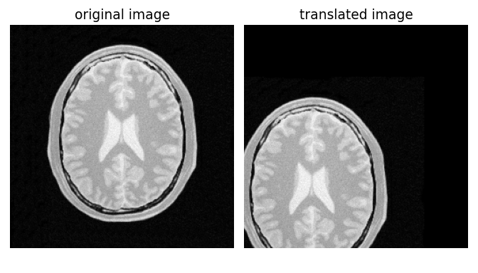
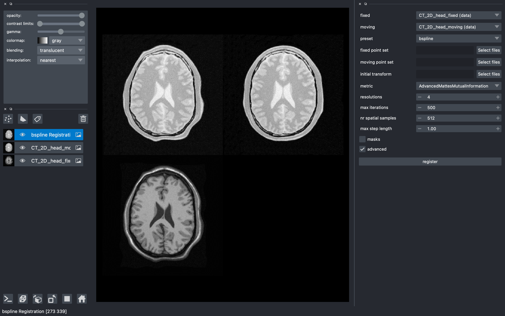

:author: Konstantinos Ntatsis
:email: k.ntatsis@lumc.nl
:institution: Department of Radiology, Leiden University Medical Center, Leiden, the Netherlands

:author: Niels Dekker
:email: c.e.dekker@lumc.nl
:institution: Department of Radiology, Leiden University Medical Center, Leiden, the Netherlands

:author: Viktor van der Valk
:email: v.o.van_der_valk@lumc.nl
:institution: Department of Radiology, Leiden University Medical Center, Leiden, the Netherlands

:author: Tom Birdsong
:email: tom.birdsong@kitware.com
:institution: Medical Computing Group, Kitware, Inc, Carrboro, NC, USA

:author: Dženan Zukić
:email: dzenan.zukic@kitware.com
:institution: Medical Computing Group, Kitware, Inc, Carrboro, NC, USA

:author: Stefan Klein
:email: s.klein@erasmusmc.nl
:institution: Department of Radiology & Nuclear Medicine, Erasmus MC, Rotterdam, the Netherlands

:author: Marius Staring
:email: m.staring@lumc.nl
:institution: Department of Radiology, Leiden University Medical Center, Leiden, the Netherlands

:author: Matthew McCormick
:email: matt.mccormick@kitware.com
:institution: Medical Computing Group, Kitware, Inc, Carrboro, NC, USA

:bibliography: mybib

-----------------------------------------------------------------
Obtain quantitative insights through image registration in python
-----------------------------------------------------------------

.. class:: abstract

Image registration plays a vital role in understanding changes that occur in 2D and 3D scientific imaging datasets. It involves finding a spatial transformation that aligns one image to another by optimizing relevant image similarity metrics. In this paper, we introduce ``itk-elastix``, a user-friendly python wrapping of the mature ``elastix`` registration toolbox. The open-source tool supports rigid, affine, and B-spline deformable registration, making it versatile for various imaging datasets. By utilizing ``itk-elastix``'s modular design, users can efficiently configure and compare different registration methods.

.. class:: keywords

   medical imaging, image analysis, registration, elastix, ITK, wrapping

Introduction
------------

Image Registration
++++++++++++++++++
Image registration is a fundamental process in the field of scientific imaging that enables the alignment and comparison of images, facilitating the understanding of changes that occur within datasets. It involves finding a spatial transformation that optimizes relevant image similarity metrics, ensuring accurate alignment between images. Medical imaging heavily relies on image registration techniques to gain valuable insights and quantitative measurements. By registering medical images acquired at different time points or using various imaging modalities such as MRI and CT, researchers can analyze and quantify changes in anatomical structures, track disease progression, and assess treatment efficacy. For instance, image registration allows the alignment of medical volumes across subjects to evaluate the impact of specific treatments, or the registration of sequential brain images to monitor tumor growth and response to therapy.

elastix
+++++++++++++
``elastix`` :cite:`klein2009elastix` :cite:`shamonin2014fast` is a well-known and widely used open-source toolbox dedicated to image registration. It provides a comprehensive range of algorithms and utilities designed for aligning images using diverse transformation models, similarity measures, and optimization strategies. One of its key strengths is its modular design, enabling users to easily configure and combine different registration methods to suit their specific needs. Configuration is performed using parameter files or in-memory parameter maps, which govern the registration process by specifying transformation models, similarity measures, optimization strategies, and related parameters. By customizing these configurations, users can seamlessly adapt ``elastix`` to their specific requirements, ensuring optimal registration outcomes.

For example, when aligning an MRI brain scan with a CT scan using ``elastix``, users can configure the transformation model, such as choosing between affine or B-spline, to capture the geometric relationships between the images. They can also specify the similarity measure, like mutual information or normalized correlation, to evaluate the quality of alignment. Additionally, users have the flexibility to adjust optimization strategies, including parameters like the maximum number of iterations or convergence criteria, to fine-tune the registration process and achieve optimal results.

The ``elastix`` codebase is implemented in C++ and serves as an extension to the Insight Toolkit (ITK) :cite:`mccormick2014itk`. Having undergone nearly two decades of development, ``elastix`` has achieved a mature state, characterized by stability, maintenance, and general backward compatibility. ITK Images play a crucial role within ``elastix``, representing multi-dimensional pixel data augmented with spatial information. Acting as a vital link between the digital pixel space and the physical space of the imaged object, ITK Images facilitate accurate registration. By computing transformations that map points from the physical space of one image to corresponding points in another, ``elastix`` achieves precise and meaningful alignment outcomes within the physical space. Complementing ``elastix``, a utility software named `transformix` has been developed, enabling the application of registration results to additional images.

The original and still-supported method of utilizing ``elastix`` and transformix involves their usage as executables. This approach offers the advantage of being independent of external dependencies, ensuring ease of deployment. However, one limitation of this executable-based approach is its reliance on file input/output (I/O) operations. To address this limitation and enable more efficient in-memory operations, a C++ API was developed for ``elastix`` and transformix. This API follows the paradigm established by ITK and its processing filters. By adopting this design approach, ``elastix`` and transformix gained the ability to perform operations directly in memory. This enhancement provides users with greater flexibility and efficiency in their image registration workflows.

To further accommodate the needs of the users in the continuously developing scientific computing ecosystem, wrappings of the C++ code to other languages was developed in the form SimpleElastix :cite:`marstal2016simpleelastix`, which still exists as part of the SimpleITK :cite:`lowekamp2013design` package. Recently, we have started working on a python-specific ``elastix`` wrapping, ``itk-elastix``, a continuously expanding collection of jupyter examples and its integration with other scientific processing libraries or visualisation software. We will discuss these aspects in the remainder of this paper.

``itk-elastix``: python wrapping
--------------------------------
The backend C++ ``elastix`` code is wrapped into python code using the Simplified Wrapper and Interface Generator (SWIG :cite:`swig`). The python wrapping of ``elastix``, ``itk-elastix``, brings the power of ``elastix`` to the python ecosystem, providing effortless integration with other scientific processing libraries and visualization software. This enables users to leverage the rich functionality of ``elastix`` within their python workflows, benefiting from its advanced image registration capabilities alongside popular python libraries such as NumPy :cite:`numpy`, SciPy :cite:`scipy`, and MONAI :cite:`cardoso2022monai` :cite:`diaz2022monai`.

After incorporating a significant number of bug fixes, enhancements, and feature implementations into the C++ ``elastix`` repository, a pull request is initiated in the ``itk-elastix`` repository to update its version. Subsequently, the ``itk-elastix`` Continuous Integration (CI) system is triggered, enabling the building of the python package across different python versions (currently ranging from 3.7 to 3.10) and major platforms such as Windows, Linux, and macOS. When a git version tag is provided, the wrapped ``itk-elastix`` is automatically uploaded to PyPi, accompanied by a comprehensive summary of updates made between the versions. As a result, users can simply install ``itk-elastix`` by executing ``pip install itk-elastix`` within their python environment. It is important to note that the elastix backend functionality undergoes continuous testing, with hundreds of tests performed in each pull request or commit, utilizing the CI system of the C++ repository.

The python wrapping for any ITK filter including ``elastix`` and transformix, offers two APIs: one functional and one object-oriented. We will describe the two API options and demonstrate the ``itk-elastix`` functionality with examples in the two following sections.

Functionality
-------------
Registration/transformation example
+++++++++++++++++++++++++++++++++++
We will register 2D CT brain images using ``elastix`` and then transform the corresponding moving mask using transformix to compare the overlap measure between the fixed mask and the transformed moving mask. In the first stage, we read the fixed and moving images from the disk, configure a default B-spline registration and perform the registration:

.. code-block:: python

   import itk
   from scipy.spatial.distance import dice

   # Load the moving and the fixed image from disk
   fixed_image = itk.imread('./data/fixed.mha', itk.F)
   moving_image = itk.imread('./data/moving.mha', itk.F)

   # Configure a (default) parameter map with all the
   # registration parameters
   par_obj = itk.ParameterObject.New()
   par_map = par_obj.GetDefaultParameterMap('bspline')
   par_obj.AddParameterMap(par_map)

   # Run the registration
   # 1. The Object Oriented way
   # elastix_obj = itk.ElastixRegistrationMethod.New(
   #                  fixed_image,
   #                  moving_image)
   # elastix_obj.SetParameterObject(param_obj)
   # elastix_obj.Update()
   # result_image = elastix_obj.GetOutput()
   # rtp = elastix_obj.GetTransformParameterObject()

   # 2. The functional way
   # rtp: result transform parameter object
   result_image, rtp = itk.elastix_registration_method(
                              fixed_image, 
                              moving_image,
                              parameter_object=par_obj)
    
Before we visualize the resulting image coming from the registration, we will load also the masks from the disk and transform the moving mask using the transformation parameters that were calculated during the registration. We also override the `ResampleInterpolaror` to use nearest interopolation since the masks are binary images.

.. code-block:: python

   # Load the corresponding masks
   fixed_mask = itk.imread('./data/f_mask.mha', itk.UC)
   moving_mask = itk.imread('./data/m_mask.mha', itk.UC)

   # Transform the moving mask using the result from the
   # registration
   rpt.SetParameter(0, 
         'ResampleInterpolator',
         'FinalNearestNeighborInterpolator')
   result_mask = itk.transformix_filter(moving_mask, rtp)

   # Compute dice on masks
   initial_dice = 1 - dice(fixed_mask[:].ravel(), 
                           moving_mask[:].ravel())
   result_dice = 1 - dice(fixed_mask[:].ravel(), 
                           result_mask[:].ravel())

   print(initial_dice, result_dice)

The last part of the code above calculates the Dice coefficient between the fixed mask and the transformed moving mask by converting the pixel arrays of the ITK images into views of numpy arrays, and then calling ``scipy.distance.dice()`` on them. The initial Dice score was **97.88%** which increased to **99.37%** after registration. We visualize the fixed, moving and result image as well as an overlay of the fixed image and the transformed mask below:

.. figure:: images/brain-registraiton-result.png
   :align: center
   :figclass: w
   :scale: 50%
   
   Example of 2D brain regisration and transformation of masks :label:`brain-registration-example`

Additional features
+++++++++++++++++++
In addition to the core registration and transformation functionality demonstrated above, ``itk-elastix`` offers other features as well such as:

* specifying masks or point sets for the registration 
* transforming point sets and meshes 
* group-wise registration where no image is specified as fixed but an implicit mean image is used instead
* logging options
* saving output to disk options
* calculation of spatial jacobian
* calculation of deformation field

We offer an evolving collection of jupyter notebooks so that new users accustom themselves to these and other features offered by ``itk-elastix``.

Interoperability with other packages
------------------------------------
ITK Transforms
++++++++++++++
In addition to the fact that ``elastix`` is based on ITK, there is an ongoing effort to increase the compatibility between the two libraries even further. One particular example is the transform classes. In the following example, we show that ITK transforms can be used directly by `transformix`:

.. code-block:: python

   # Create an ITK (translation) transform
   transform = itk.TranslationTransform.New()
   transform.SetOffset([50, -60])

   # Specify the image space of the transform
   sp = moving_image.shape
   parameter_map = {
                    "Direction": ("1", "0", "0", "1"),
                    "Index": ("0", "0"),
                    "Origin": ("0", "0"),
                    "Size": (str(sp[1]), str(sp[0])),
                    "Spacing": ("1", "1")
                   }

   par_obj = itk.ParameterObject.New()
   par_obj.AddParameterMap(parameter_map)

   # Pass an ITK transform directly to transformix
   transformix_obj = itk.TransformixFilter.New(
                           moving_image)
   transformix_obj.SetTransformParameterObject(par_obj)
   transformix_obj.SetTransform(transform)
   transformix_obj.Update()

   # Get transformed (translated) image
   translated_image = transformix_obj.GetOutput()

   Traslating an image by passing an ITK Transform directly to ``transformix`` :label:`translated-image`

NumPy & SciPy
+++++++++++++
The interoperability with NumPy and consequently with the SciPy libraries come from the ITK functionality of converting ITK images to numpy arrays and vice versa. The relevant code is:

.. code-block:: python

   # itk image -> numpy array (deep copy)
   image_array = itk.array_from_image(image_itk)

   # itk image -> numpy array (shallow copy / view)
   image_array = image_itk[:]

   # numpy array -> itk image
   image_itk = itk.image_from_array(image_array)

Project MONAI
+++++++++++++
More and more people work on the application of deep learning in medical imaging research. To that end, we have developed `itk_monai_bridge` as part of the MONAI codebase that allows conversion 1) of an itk image to a MONAI MetaTensor and the reverse, and 2) an ITK transform to a MONAI transform and back. In addition, we have created tutorials that show the combined use of ``elastix`` and MONAI. The tutorials are the topic of the next section.

.. code-block:: python

   from monai.data import itk_torch_bridge as itb
   import torch

   # itk image <-> MONAI metatensor
   image_mt = itb.itk_image_to_metatensor(image_itk)
   image_itk = itb.metatensor_to_itk_image(image_mt)

   # Transform: monai space <-> itk space
   # affine_matrix: 3x3 matrix 
   # matrix: 2x2 matrix
   # translation: 2-element vector
   matrix, translation = itb.monai_to_itk_affine(
                           image=image, 
                           affine_matrix=affine_matrix)

Integration with other software
-------------------------------
Continuous efforts have been made to make ``itk-elastix`` accessible to users of various tools. One notable community-driven initiative is SlicerElastix, which seamlessly integrates ``elastix`` (as an executable) into the 3D Slicer :cite:`fedorov20123d` medical image visualization software. In addition to this, recent endeavors have focused on developing the ``elastix-napari`` plugin for the napari :cite:`napari` visualization software, which is written in python. The image below illustrates the ``napari`` user interface, showcasing the ``elastix`` widget on the right side, along with an example visualization of two input images and a transformed image at the center.

   The user interface of the ``elastix-napari`` plugin :label:`elastix-napari`

Concluding remarks
------------------
We have presented ``itk-elastix``, an easy-to-install and easy-to-use python package that lowers the barrier for medical image registration. Its key features are 1) a robust and well-established backend codebase, ensuring stability and reliability, 2) an extensive collection of tutorials, a parameter file model zoo, and up-to-date documentation, providing comprehensive resources for users, 3) seamless interoperability with popular scientific libraries in python, including NumPy, SciPy, and MONAI, and 4) integration into 3D visualization software, facilitating visual analysis and interpretation of registered images. With ``itk-elastix``, researchers and practitioners can effortlessly leverage the strengths of python and seamlessly integrate it with a wide range of scientific software, unlocking new possibilities and accelerating advancements in medical image registration.

Acknowledgment 
--------------
We gratefully acknowledge the financial support received from the Chan Zuckerberg Initiative (CZI) through the Essential Open Source Software for Science award for Open Source Image Registration: The elastix Toolbox, numbers 2020-218571 and 2021-237680. 

Useful resources
----------------
* itk-elastix repository: https://github.com/InsightSoftwareConsortium/ITKElastix
* jupyter notebook examples: https://github.com/InsightSoftwareConsortium/ITKElastix/tree/main/examples
* elastix-napari plugin: https://github.com/SuperElastix/elastix-napari
* elastix community forum: https://github.com/SuperElastix/elastix/discussions
* parameter file model zoo: https://elastix.lumc.nl/modelzoo/
* elastix manual: https://elastix.lumc.nl/doxygen/index.html
