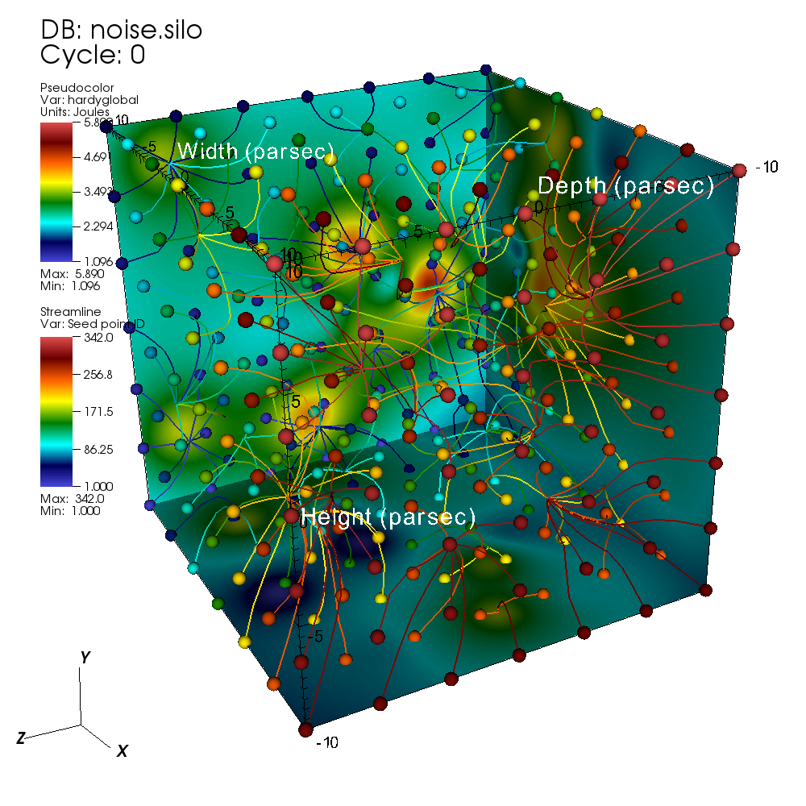
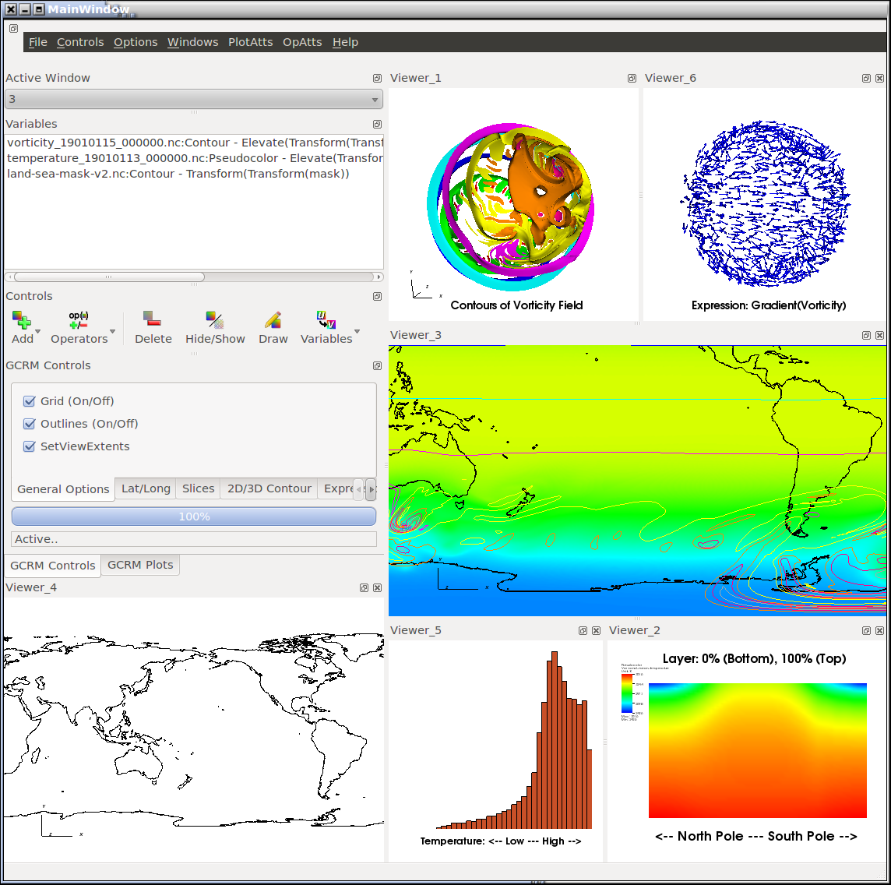
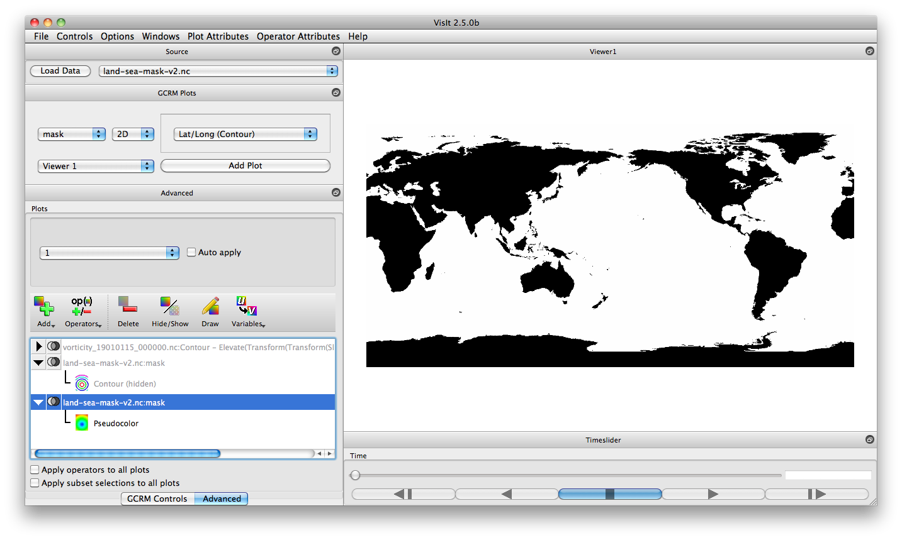
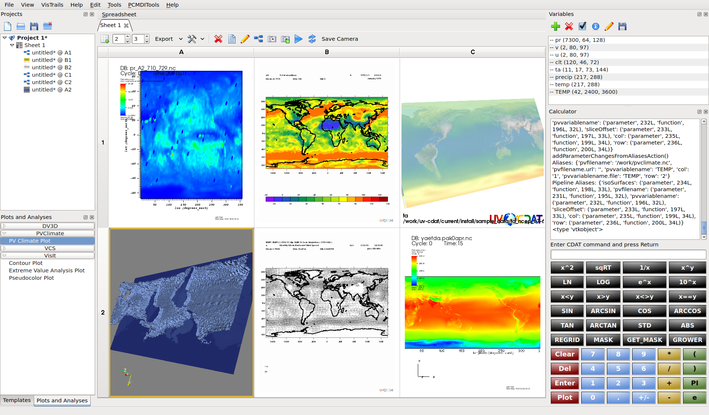

:author: Cyrus Harrison
:email: cyrush@llnl.gov
:institution: Lawrence Livermore National Laboratory

:author: Harinarayan Krishnan 
:email: hkrishnan@lbl.gov
:institution: Lawrence Berkeley National Laboratory 

-------------------------------------------------------
Python's Role in VisIt
-------------------------------------------------------

.. class:: abstract

VisIt is an open source, turnkey application for scientific data analysis and visualization that runs on a wide variety of platforms from desktops to petascale class supercomputers. VisIt's core software infrastructure is written in C++, however Python plays a vital role in enabling custom workflows. Recent work has extended Python's use in VisIt beyond scripting, enabling custom Python UIs and Python filters for low-level data manipulation. The ultimate goal of this work is to evolve Python into a true peer to our core C++ plugin infrastructure. This paper provides an overview of Python’s role in VisIt with a focus on use cases of scripted rendering, data analysis, and custom application development.

.. class:: keywords

   visualization, hpc, python

Introduction
---------------------------

VisIt [VisIt05]_, like EnSight [EnSight09]_ and ParaView [ParaView05]_, is an application designed for post processing of mesh based scientific data. VisIt's core infrastructure is written in C++ and it uses VTK [VTK96]_ for its underlying mesh data model. Its distributed-memory parallel architecture is tailored to process domain decomposed meshes created by simulations on large-scale HPC clusters.

Early in development, the VisIt team adopted Python as the foundation of VisIt’s primary scripting interface. The scripting interface is available from both a standard Python interpreter and a custom command line client. The interface provides access to all features available through VisIt’s GUI. It also includes support for macro recording of GUI actions to Python snippets and full control of windowless batch processing.

While Python has always played an important scripting role in VisIt, two recent development efforts have greatly expanded VisIt’s Python capabilities:

1. We now support custom UI development using Qt via PySide [PySide]_. This allows users to embed VisIt’s visualization windows into their own Python applications. This provides a path to extend VisIt’s existing GUI and for rapid development of streamlined UIs for specific use cases.

2. We recently enhanced VisIt by embedding Python interpreters into our data flow network pipelines. This provides fine grained access, allowing users to write custom algorithms in Python that manipulate mesh data via VTK’s Python wrappers and leverage packages such as NumPy [NumPy]_ and SciPy [SciPy]_. Current support includes the ability to create derived mesh quantities and execute data summarization operations.

This paper provides an overview of how VisIt leverages Python in its software architecture, outlines these two recent Python feature enhancements, and introduces several examples of use cases enabled by Python.

Python Integration Overview
-------------------------------
VisIt employs a client-server architecture composed of several interacting software components:

- A *viewer* process coordinates the state of the system and provides the visualization windows used to display data. 
- A set of *client* processes, including a Qt-based GUI and Python-based command line interface (CLI),  are used to setup plots and direct visualization operations.
- A parallel *compute engine* executes the visualization pipelines. This component employs a data flow network design and uses MPI for communication in distributed-memory parallel environments. 

.. This component employs a data flow network design that uses a contract construct to allow each filter in the pipeline to modify the set of optimizations used.

.. figure:: overview.pdf
   :scale: 55%
   :align: center
   
   Python integration with VisIt's components. :label:`arch`

*Client* and *viewer* proceses are typically run on a desktop machine and connect to a parallel *compute engine* running remotely on a HPC cluster. For smaller data sets, a local serial or parallel *compute engine* is also commonly used. 

Figure :ref:`arch` outlines how Python is integrated into VisIt's components. VisIt both extends and embeds Python. State control of the *viewer* is provided by a Python Client Interface, available as Python/C extension module. This interface is outlined in the `Python Client Interface`_ section, and extensions to support custom UIs written in Python are described in the `Custom Python UIs`_ section. Direct access to low-level mesh data structures is provided by a Python Filter Runtime, embedded in VisIt's *compute engine* processes. This runtime is described in the `Python Filter Runtime`_ section.

.. _Python Client Interface:

Python Client Interface
---------------------------
VisIt clients interact with the *viewer* process to control the state of visualization windows and data processing pipelines. Internally the system uses a collection of state objects that rely on a publish/subscribe design pattern for communication among components. These state objects are wrapped by a
Python/C extension module to expose a Python state control API. The function calls are typically imperative: *Add a new plot*, *Find the maximum value of a scalar field*, etc. The client API is documented extensively in the VisIt Python Interface Manual [VisItPyRef]_.  To introduce the API in this paper we provide a simple example script, `Listing 1`_, that demonstrates VisIt's five primary visualization building blocks:
 
.. This client API allows you to drive the, analogous to interacting with VisIt's GUI.
 
- **Databases**: File readers and data sources.
- **Plots**: Data set renderers.
- **Operators**: Filters implementing data set transformations.
- **Expressions**: Framework enabling the creation of derived quantities from existing mesh fields.
- **Queries**: Data summarization operations.

.. _Listing 1:

Listing 1: Trace streamlines along the gradient of a scalar field.
+++++++++++++++++++++++++++++++++++++++++++++++++++++++++++++++++++
.. code-block:: python

    # Open an example file
    OpenDatabase("noise.silo")
    # Create a plot of the scalar field 'hardyglobal'
    AddPlot("Pseudocolor","hardyglobal")
    # Slice the volume to show only three 
    # external faces.
    AddOperator("ThreeSlice")
    tatts = ThreeSliceAttributes()
    tatts.x = -10
    tatts.y = -10
    tatts.z = -10
    SetOperatorOptions(tatts)
    DrawPlots()
    # Find the maximum value of the field 'hardyglobal'
    Query("Max")
    val = GetQueryOutputValue()
    print "Max value of 'hardyglobal' = ", val 
    # Create a streamline plot that follows 
    # the gradient of 'hardyglobal'
    DefineVectorExpression("g","gradient(hardyglobal)")
    AddPlot("Streamline","g")
    satts = StreamlineAttributes()
    satts.sourceType = satts.SpecifiedBox
    satts.sampleDensity0 = 7
    satts.sampleDensity1 = 7    
    satts.sampleDensity2 = 7
    satts.coloringMethod = satts.ColorBySeedPointID
    SetPlotOptions(satts)
    DrawPlots()

   
   Pseudocolor and Streamline plots setup using the script in `Listing 1`. :label:`stream`

In this example, the Silo database reader is automatically selected to read meshes from the input file 'noise.silo'. A *Pseudocolor* plot is created to display the scalar field named 'hardyglobal'. The mesh is transformed by a *ThreeSlice* operator to limit the volume displayed by the *Pseudocolor* plot to three external faces.  We use a query to obtain and print the maximum value of the 'hardyglobal' field. An expression is defined to extract the gradient of the 'hardyglobal' scalar field. Finally, this gradient vector is used as the input field for a second plot, which traces streamlines. Figure :ref:`stream` shows the resulting visualization which includes both the *Pseudocolor* and *Streamline* plots. 

Accessing the Python Client Interface
++++++++++++++++++++++++++++++++++++++
For convenience, you can access the client interface from a custom binary or a standalone Python interpreter. 

.. **CLI** 

VisIt provides a command line interface (CLI) binary that embeds a Python interpreter and automatically imports the client interface module. There are several ways to access this binary:

- From VisIt's GUI, you can start a CLI instance from the "Launch CLI" entry in the "Options" menu.
- Invoking VisIt from the command line with the ``-cli`` option starts the CLI and launches a connected *viewer* process:

    ``>visit -cli``

- For batch processing, the ``-nowin`` option launches the viewer in an offscreen mode and you can select a Python script file to run using the ``-s`` option:

    ``>visit -cli -nowin -s <script_file.py>``

.. **Standalone** 

You can also import the interface into a standalone Python interpreter and use the module to launch and control a new instance of VisIt. `Listing 2`_ provides example code for this use case. The core implementation of the VisIt module is a Python/C extension module, so normal caveats for binary compatibly with your Python interpreter apply. 

The features of the VisIt interface are dependent on the version of VisIt selected, so the import process is broken into two steps. First, a small front end module is imported. This module allows you to select the options used to launch VisIt. Examples include: using ``-nowin`` mode for the *viewer* process, selecting a specific version of VisIt, ``-v 2.5.1``, etc. After these options are set the *Launch()* method creates the appropriate Visit components. During the launch, the interfaces to the available state objects are enumerated and dynamically imported into the *visit* module.
 
.. _Listing 2:

Listing 2: Launch and control VisIt from a standalone Python interpreter. 
++++++++++++++++++++++++++++++++++++++++++++++++++++++++++++++++++++++++++
.. code-block:: python

    import sys
    import os
    from os.path import join as pjoin
    vpath = "path/to/visit/<ver>/<arch>/"
    # or for an OSX bundle version
    # "path/to/VisIt.app/Contents/Resources/<ver>/<arch>"
    vpath = pjoin(vpath,"lib","site-packages")
    sys.path.insert(0,vpath)
    import visit
    visit.Launch()
    # use the interface
    visit.OpenDatabase("noise.silo")
    visit.AddPlot("Pseudocolor","hardyglobal")

Macro Recording
++++++++++++++++++++++++++++++++++++++
VisIt's GUI provides a *Commands* window that allows you to record GUI actions
into short Python snippets. While the client interface supports standard Python introspection methods (``dir()``, ``help()``, etc), the *Commands* window provides a powerful learning tool for VisIt's Python API. You can access this window from the "Commands" entry in the "Options" menu. From this window you can record your actions into one of several source scratch pads and convert common actions into macros that can be run using the *Marcos* window. 

.. _Custom Python UIs:

Custom Python UIs
-------------------------------
VisIt provides 100+ database readers, 60+ operators, and over 20 different plots. This toolset makes it a robust application well suited 
to analyze problem sets from a wide variety of scientific domains. However, in many cases users would like to utilize only a specific subset of VisIt's features  
and understanding the intricacies of a large general purpose tool can be a daunting task.  For example, climate scientists require specialized functionality such as viewing information on Lat/Long grids bundled with computations of zonal averages. Whereas, scientists in the fusion energy science community require visualizations of interactions between magnetic and particle velocity fields within a tokomak simulation. To make it easier to target specific user communities, we extended VisIt with ability to create custom UIs in Python. 
Since we have an investment in our existing Qt user interface, we choose PySide, an LGPL Python Qt wrapper, as our primary Python UI framework.
Leveraging our existing Python Client Interface along with new PySide support allows us to easily and quickly create custom user interfaces that provide specialized analysis routines and directly target the core needs of specific user communities. Using Python allows us to do this in a fraction of the time it would take to do so using our C++ APIs.

.. Adding support for Python UIs allowed us effectively address this problem. 
.. One of the challenges with providing a general visualization toolset is a steep learning curve for domain scientists to discern which subset of visualization .. algorithms and analysis tools provides them with accurate results in an efficient manner. 
.. Generally, scientists in a specific domain use a subset of the rich set of features that VisIt has to offer, and 

VisIt provides two major components to its Python UI interface: 

- The ability to embed VisIt's render windows.
- The ability to reuse VisIt's existing set of GUI widgets. 

The ability to utilize renderers as Qt widgets allows VisIt's visualization windows to be embedded in custom PySide GUIs and other third party applications. Re-using VisIt's existing generic widget toolset, which provides functionally such as remote filesystem browsing and a visualization pipeline editor, allows custom applications to incorporate advanced features with little difficulty. 

One important note, a significant number of changes went into adding Python UI support into VisIt. Traditionally, VisIt uses a component-based architecture where the Python command line interface, the graphical user interface, and the *viewer* exist as separate applications that communicate over sockets. Adding Python UI functionality required these three separate components to work together as single unified application. This required components that once communicated only over sockets to also be able to directly interact with each other. Care is needed when sharing data in this new scenario, we are still refactoring parts of VisIt to better support embedded use cases.

To introduce VisIt's Python UI interface, we start with `Listing 3`_,  which provides a simple PySide visualization application that utilizes VisIt under the hood. We then describe two complex applications that use VisIt's Python UI interface with several embedded renderer windows.

.. _Listing 3:

Listing 3: Custom application that animates an Isosurface with a sweep across Isovalues.
+++++++++++++++++++++++++++++++++++++++++++++++++++++++++++++++++++++++++++++++++++++++++
.. code-block:: python

    class IsosurfaceWindow(QWidget):
        def __init__(self):
            super(IsosurfaceWindow,self).__init__()
            self.__init_widgets()
            # Setup our example plot.
            OpenDatabase("noise.silo")
            AddPlot("Pseudocolor","hardyglobal")
            AddOperator("Isosurface")
            self.update_isovalue(1.0)
            DrawPlots()
        def __init_widgets(self):
            # Create Qt layouts and widgets.
            vlout = QVBoxLayout(self)
            glout = QGridLayout()
            self.title   = QLabel("Iso Contour Sweep Example")
            self.title.setFont(QFont("Arial", 20, bold=True))
            self.sweep   = QPushButton("Sweep")
            self.lbound  = QLineEdit("1.0")
            self.ubound  = QLineEdit("99.0")
            self.step    = QLineEdit("2.0")
            self.current = QLabel("Current % =")
            f = QFont("Arial",bold=True,italic=True)
            self.current.setFont(f)
            self.rwindow = pyside_support.GetRenderWindow(1)
            # Add title and main render winodw.
            vlout.addWidget(self.title)
            vlout.addWidget(self.rwindow,10)
            glout.addWidget(self.current,1,3)
            # Add sweep controls.
            glout.addWidget(QLabel("Lower %"),2,1)
            glout.addWidget(QLabel("Upper %"),2,2)
            glout.addWidget(QLabel("Step %"),2,3)
            glout.addWidget(self.lbound,3,1)
            glout.addWidget(self.ubound,3,2)
            glout.addWidget(self.step,3,3)
            glout.addWidget(self.sweep,4,3)
            vlout.addLayout(glout,1)
            self.sweep.clicked.connect(self.exe_sweep)
            self.resize(600,600)
        def update_isovalue(self,perc):
            # Change the % value used by
            # the isosurface operator.
            iatts = IsosurfaceAttributes()
            iatts.contourMethod = iatts.Percent 
            iatts.contourPercent = (perc)
            SetOperatorOptions(iatts)
            txt = "Current % = "  + "%0.2f" % perc
            self.current.setText(txt)
        def exe_sweep(self):
            # Sweep % value accoording to 
            # the GUI inputs.
            lbv  = float(self.lbound.text())
            ubv  = float(self.ubound.text())
            stpv = float(self.step.text())
            v = lbv
            while v < ubv:
                self.update_isovalue(v)
                v+=stpv

    # Create and show our custom window.
    main = IsosurfaceWindow()
    main.show()

In this example, a VisIt render window is embedded in a QWidget to provide a *Pseudocolor* view of an *Isosurface* of
the scalar field 'hardyglobal'. We create a set of UI controls that allow the user to select 
values that control a sweep animation across a range of Isovalues.  The *sweep* button initiates the animation. To run this example, 
the ``-pysideviewer`` flag is passed to VisIt at startup to select a unified *viewer* and CLI process. 

 ``> visit -cli -pysideviewer``

This example was written to work as standalone script to illustrate the use of the PySide API for this paper. For most custom 
applications, developers are better served by using QtDesigner for UI design, in lieu of hand coding the layout of UI elements. 
`Listing 4`_  provides a small example showing how to load a QtDesigner UI file using PySide.

.. _Listing 4:

Listing 4: Loading a custom UI file created with Qt Designer.
+++++++++++++++++++++++++++++++++++++++++++++++++++++++++++++++++++++++++++++++++++++++++
.. code-block:: python

    from PySide.QtUiTools import *
    # example slot
    def on_my_button_click():
        print "myButton was clicked"

    # Load a UI file created with QtDesigner
    loader = QUiLoader()
    uifile = QFile("custom_widget.ui")
    uifile.open(QFile.ReadOnly)
    main = loader.load(uifile)
    # Use a string name to locate 
    # objects from Qt UI file.
    button = main.findChild(QPushButton, "myButton")
    # After loading the UI, we want to 
    # connect Qt slots to Python functions
    button.clicked.connect(on_my_button_click)
    main.show()

Advanced Custom Python UI Examples
++++++++++++++++++++++++++++++++++++++++++++++++++++++++++++++++++++++++++++++++++++++++++++++++++++++++++++++

   Climate Skins for the Global Cloud Resolving Model Viewer. :label:`climate-skin`

   Example showing integration of VisIt's components in UV-CDAT. :label:`embedded`
   

To provide more context for VisIt's Python UI interface, we now discuss two applications that
leverage this new infrastructure: the Global Cloud Resolving Model (GCRM) [GCRM]_ Viewer and Ultra Visualization - Climate Data Analysis Tools (UV-CDAT) [UVCDAT]_, 

VisIt users in the climate community involved with the global cloud resolving model project (GCRM) mainly required a custom NetCDF reader and a small subset of domain specific plots and operations. Their goal for climate analysis was to quickly visualize models generated from simulations, and perform specialized analysis on these modules. Figure :ref:`climate-skin` shows two customized skins for the GCRM community developed in QtDesigner and loaded using PySide from VisIt's Python UI client. The customized skins embed VisIt rendering windows and reuse several of VisIt's GUI widgets. We also wrote several new analysis routines in Python for custom visualization and analysis tasks targeted for the climate community. This included providing Lat/Long grids with continental outlines and computing zonal means. Zonal mean computation was achieved by computing averages across the latitudes for each layer of elevation for a given slice in the direction of the longitude.

UV-CDAT is a multi-institutional project geared towards addressing the visualization needs of climate scientists around the world. Unlike the GCRM project which was targeted towards one specific group and file format, for UV-CDAT all of VisIt's functionality needs to be exposed and embedded alongside several other visualization applications. The goal of UV-CDAT is to bring together all the visualization and analysis routines provided within several major visualization frameworks inside one application. This marks one of the first instances where several separate fully-featured visualization packages, including VisIt, ParaView, DV3D, and VisTrails all function as part of one unified application. Figure :ref:`embedded` shows an example of using VisIt plots, along with plots from several other packages, within UV-CDAT. The core UV-CDAT application utilizes PyQt [PyQt]_ as its central interface and Python as the intermediate bridge between the visualization applications. The infrastructure changes made to VisIt to support custom Python UIs via PySide also allowed us to easily interface with PyQt. Apart from creating PyQt wrappers for the project, we also made significant investments in working out how to effectively share resources created within Python using NumPy & VTK Python data objects.

.. _Python Filter Runtime:

Python Filter Runtime
---------------------------
The Python Client Interface allows users to assemble visualization pipelines 
using VisIt's existing building blocks. While VisIt provides a wide range of filters, 
there are of course applications that require special purpose algorithms or need direct access to low-level mesh data structures. VisIt's Database, Operator, and Plot primitives are extendable via a C++ plugin infrastructure. This infrastructure allows new instances of these building blocks to be developed against an installed version of VisIt, without access to VisIt's full source tree. Whereas, creating new Expression and Query primitives in C++ currently requires VisIt's full source tree.  To provide more flexibility for custom work flows and special purpose algorithms, we extended our data flow network pipelines with a Python Filter Runtime. This extension provides two important benefits:

* Enables runtime prototyping/modification of filters.
* Reduces development time for special purpose/one-off filters.

To implement this runtime, each MPI process in VisIt's *compute engine* embeds a Python interpreter. The interpreter coordinates with the rest of the pipeline using Python/C wrappers for existing pipeline control data structures. These data structures also allow requests for pipeline optimizations, for example a request to generate ghost zones. VisIt's pipelines use VTK mesh data structures internally, allowing us to pass VTK objects zero-copy between C++ and the Python interpreter using Kitware's existing VTK Python wrapper module. Python instances of VTK data arrays can also be wrapped zero-copy into *ndarrays*, opening up access to the wide range of algorithms available in NumPy and SciPy. 

To create a custom filter, the user writes a Python script that implements a class that extends a base filter class for the desired VisIt building block. The base filter classes mirror VisIt's existing C++ class hierarchy. The exact execution pattern varies according the to selected building 
block,  however they loosely adhere to the following basic data-parallel execution pattern:

* Submit requests for pipeline constraints or optimizations.
* Initialize the filter before parallel execution. 
* Process mesh data sets in parallel on all MPI tasks. 
* Run a post-execute method for cleanup and/or summarization. 

To support the implementation of distributed-memory algorithms, the Python Filter Runtime provides a simple Python MPI wrapper module, named *mpicom*. This module includes support for collective and point-to-point messages. The interface provided by *mpicom* is quite simple, and is not as optimized or extensive as other Python MPI interface modules, as such *mpi4py* [Mpi4Py]_. We would like to eventually adopt *mpi4py* for communication, either directly or as a lower-level interface below the existing *mpicom* API.

VisIt's Expression and Query filters are the first constructs exposed by the Python Filter Runtime. These primitives were selected because they are not currently extensible via our C++ plugin infrastructure. Python Expressions and Queries can be invoked from VisIt's GUI or the Python Client Interface. To introduce these filters, this paper will outline a simple Python Query example and discuss how a Python Expression was used to research a new OpenCL Expression Framework.

.. _Listing 5:

Listing 5: Python Query filter that calculates the average of a cell centered scalar field.
++++++++++++++++++++++++++++++++++++++++++++++++++++++++++++++++++++++++++++++++++++++++++++

.. code-block:: python

    class CellAverageQuery(SimplePythonQuery):
        def __init__(self):
            # basic initialization
            super(CellAverageQuery,self).__init__()
            self.name = "Cell Average Query"
            self.description = "Calculating scalar average."
        def pre_execute(self):
            # called just prior to main execution
            self.local_ncells = 0
            self.local_sum    = 0.0
        def execute_chunk(self,ds_in,domain_id):
            # called per mesh chunk assigned to 
            # the local MPI task.
            ncells = ds_in.GetNumberOfCells()
            if ncells == 0:
                return
            vname  = self.input_var_names[0]
            varray = ds_in.GetCellData().GetArray(vname)
            self.local_ncells += ncells
            for i in range(ncells):
                self.local_sum += varray.GetTuple1(i)
        def post_execute(self):
            # called after all mesh chunks on all 
            # processors have been processed.
            tot_ncells = mpicom.sum(self.local_ncells)
            tot_sum    = mpicom.sum(self.local_sum)
            avg = tot_sum  / float(tot_ncells)
            if mpicom.rank() == 0:
                vname = self.input_var_names[0]
                msg = "Average value of %s = %s"
                msg = msg % (vname,str(avg))
                self.set_result_text(msg)
                self.set_result_value(avg)

    # Tell the Python Filter Runtime which class to use 
    # as the Query filter.
    py_filter = CellAverageQuery

.. _Listing 6:

Listing 6: Python Client Interface code to invoke the Cell Average Python Query on a example data set.
+++++++++++++++++++++++++++++++++++++++++++++++++++++++++++++++++++++++++++++++++++++++++++++++++++++++

.. code-block:: python

    # Open an example data set.
    OpenDatabase("multi_rect3d.silo")
    # Create a plot to query
    AddPlot("Pseudocolor","d")
    DrawPlots()
    # Execute the Python query
    PythonQuery(file="listing_5_cell_average.vpq",
                vars=["default"])

`Listing 5`_ provides an example Python Query script, and `Listing 6`_ provides example host code that can be used to invoke the Python Query from VisIt's Python Client Interface. In this example, the *pre_execute* method initializes a cell counter and a variable to hold the sum of all scalar values provided by the host MPI task.  After initialization,  the *execute_chunk* method is called for each mesh chunk assigned to the host MPI task. *execute_chunk* examines these meshes via VTK's Python wrapper interface, obtaining the number of cells and the values from a cell centered scalar field. After all chunks have been processed by the *execute_chunk* method on all MPI tasks, the *post_execute* method is called. This method uses MPI reductions to obtain the aggregate number of cells and total scalar value sum. It then calculates the average value and sets an output message and result value on the root MPI process. 

Using a Python Expression to host a new OpenCL Expression Framework.
+++++++++++++++++++++++++++++++++++++++++++++++++++++++++++++++++++++++++++++++
The HPC compute landscape is quickly evolving towards accelerators and many-core CPUs. The complexity of porting existing codes to the new programming models supporting these architectures is a looming concern. We have an active research effort exploring OpenCL [OpenCL]_ for visualization and analysis applications on GPU clusters. 

One nice feature of OpenCL is the that it provides runtime kernel compilation.
This opens up the possibility of assembling custom kernels that dynamically encapsulate multiple steps of a visualization pipeline into a single GPU kernel. A subset of our OpenCL research effort is focused on exploring this concept, with the goal of creating a framework that uses OpenCL as a backend for user defined expressions. This research is joint work with Maysam Moussalem and Paul Navrátil at the Texas Advanced Computing Center, and Ming Jiang at Lawrence Livermore National Laboratory. 

For productivity reasons we chose Python to prototype this framework. We dropped this framework into VisIt's existing data parallel infrastructure using a Python Expression. This allowed us to test the viability of our framework on large data sets in a distributed-memory parallel setting. Rapid development and testing of this framework leveraged the following Python modules:

- *PLY* [PLY]_ was used to parse our expression language grammar. PLY provides an easy to use Python lex/yacc implementation that allowed us to implement a  front-end parser and integrate it with the Python modules used to generate and execute OpenCL kernels. 

- *PyOpenCL* [PyOpenCL]_ was used to interface with OpenCL and launch GPU kernels. PyOpenCL provides a wonderful interface to OpenCL that saved us an untold amount of time over the OpenCL C-API. PyOpenCL also uses *ndarrays* for data transfer between the CPU and GPU, and this was a great fit because we can easily access our data arrays as *ndarrays* using the VTK Python wrapper module.

We are in the process of conducting performance studies and writing a paper with the full details of the framework. For this paper we provide a high-level execution overview and a few performance highlights:

**Execution Overview:** 

An input expression, defining a new mesh field, is parsed by a PLY front-end and translated into a data flow network specification. The data flow network specification is passed to a Python data flow module that dynamically generates a single OpenCL kernel for the operation. By dispatching a single kernel that encapsulates several pipeline steps to the GPU, the framework mitigates CPU-GPU I/O bottlenecks and boosts performance over both  existing CPU pipelines and a naive dispatch of several small GPU kernels.

**Performance Highlights:**

- Demonstrated speed up of up to ~20x vs an equivalent VisIt CPU expression, including transfer of data arrays to and from the GPU.

- Demonstrated use in a distributed-memory parallel setting, processing a 24 billion zone rectilinear mesh using 256 GPUs on 128 nodes of LLNL’s Edge cluster. 

Python, PLY, PyOpenCL, and VisIt's Python Expression capability allowed us to create and test this framework with a much faster turn around time than would have been possible using C/C++ APIs. Also, since the bulk of the processing was executed on GPUs, we were able to demonstrate impressive speedups. 

Conclusion
---------------------------
In this paper we have presented an overview of the various roles that Python plays in VisIt's software infrastructure and a few examples of visualization and analysis use cases enabled by Python in VisIt.  Python has long been an asset to VisIt as the foundation of VisIt's scripting language. We have recently extended our infrastructure to enable custom application development and low-level mesh processing algorithms in Python.  

For future work, we are refactoring VisIt's component infrastructure to better support unified process Python UI clients. We also hope to provide more example scripts to help developers bootstrap custom Python applications that embed VisIt. We plan to extend our Python Filter Runtime to allow users to write new Databases and Operators in Python.  We would also like to provide new base classes for Python Queries and Expressions that encapsulate the VTK to *ndarray* wrapping process, allowing users to write streamlined scripts using NumPy.

For more detailed info on VisIt and its Python interfaces, we recommend: the VisIt Website [VisItWeb]_, the VisIt Users' Wiki [VisItWiki]_, VisIt's user and developer mailing lists, and the VisIt Python Client reference manual [VisItPyRef]_.

Acknowledgments
---------------------------
This work performed under the auspices of the U.S. DOE by Lawrence Livermore
National Laboratory under Contract DE-AC52-07NA27344. LLNL-CONF-564292.

References
----------

.. [VisIt05]
   Childs, H. et al, 2005. A Contract Based System For Large Data Visualization.
   *VIS '05: Proceedings of the conference on Visualization '05*

.. [ParaView05]
   Ahrens, J. et al, 2005. Visualization in the ParaView Framework.
   *The Visualization Handbook*, 162-170
   
.. [EnSight09]
   EnSight User Manual. Computational Engineering International, Inc. Dec 2009.
 
.. [OpenCL] Kronos Group, OpenCL parallel programming framework.

      http://www.khronos.org/opencl/

.. [PLY] Beazley, D., Python Lex and Yacc.

           http://www.dabeaz.com/ply/

.. [NumPy] Oliphant, T., NumPy Python Module.

           http://numpy.scipy.org

.. [SciPy] Scientific Tools for Python. 

            http://www.scipy.org.

.. [PyOpenCL] Klöckner, A., Python OpenCL Module.

          http://mathema.tician.de/software/pyopencl
          
.. [PySide] PySide Python Bindings for Qt. 

        http://www.pyside.org/

.. [Mpi4Py] Dalcin, L., mpi4py: MPI for Python. 

        http://mpi4py.googlecode.com/

.. [VTK96] Schroeder, W. et al, 1996. The design and implementation of an object-oriented toolkit for 3D graphics and visualization.
   *VIS '96: Proceedings of the 7th conference on Visualization '96*

.. [VisItPyRef] Whitlock, B. et al. VisIt Python Reference Manual.  

    http://portal.nersc.gov/svn/visit/trunk/releases/2.3.0/VisItPythonManual.pdf

.. [PyQt] PyQt Python Bindings for Qt. 

    http://www.riverbankcomputing.co.uk/software/pyqt/

.. [UVCDAT] Ultra Visualization - Climate Data Analysis Tools.

    http://uv-cdat.llnl.gov 

.. [GCRM] Global Cloud Resolving Model.

    http://kiwi.atmos.colostate.edu/gcrm/

.. [VisItWiki] VisIt Users' Wiki. 

    http://www.visitusers.org/

.. [VisItWeb] VisIt Website. 

    https://wci.llnl.gov/codes/visit/
