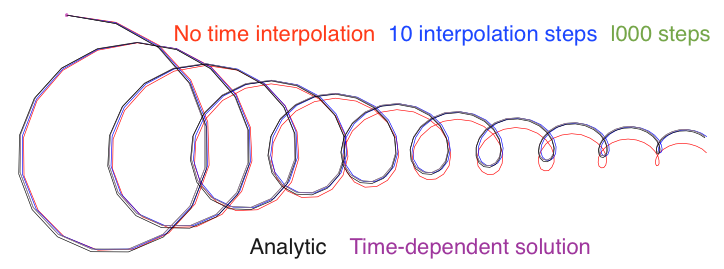

:author: Kristen M. Thyng
:email: kthyng@tamu.edu
:institution: Texas A&M University

:author: Robert D. Hetland
:email: hetland@tamu.edu
:institution: Texas A&M University

.. :author: Jarrod Millman
.. :email: millman@rome.it
.. :institution: Egyptian Embassy, S.P.Q.R.

.. :video: http://www.youtube.com/watch?v=dhRUe-gz690

-----------------------------------------------------------------
TracPy: Wrapping the FORTRAN Lagrangian trajectory model TRACMASS
-----------------------------------------------------------------

.. class:: abstract

   abstract

   .. A short version of the long version that is way too long to be written as a
   .. short version anyway.  Still, when considering the facts from first
   .. principles, we find that the outcomes of this introspective approach is
   .. compatible with the guidelines previously established.

   .. In such an experiment it is then clear that the potential for further
   .. development not only depends on previous relationships found but also on
   .. connections made during exploitation of this novel new experimental
   .. protocol.

.. class:: keywords

   Lagrangian tracking, numerical drifters, Python wrapper

Introduction
------------

.. introduce and motivate Lagrangian tracking

Drifters are used in oceanography and atmospherics *in situ* in order to demonstrate flow patterns in the fluid they are in. For example, in the ocean, drifters will often be deposited on the surface and allowed to passively be transported with the flow, reporting their location via GPS at regular intervals. In this way, drifters are gathering data in a Lagrangian perspective. GIVE EXAMPLES OF IN SITU DRIFTER DATA AND WHAT CAN BE LEARNED

Lagrangian trajectory modeling is a method of moving parcels through a fluid based on numerically modeled circulation fields. GIVE EXAMPLES OF NUMERICAL DRIFTERS AND WHAT CAN BE LEARNED

Numerical drifters may be calculated online, while a circulation model is running, in order to use the highest resolution model-predicted velocity fields available in time (on the order of seconds to minutes). Often, however, Lagrangian trajectories are calculated offline, using the velocity fields at the stored temporal resolution (on the order of minutes to hours). 

A given drifter's trajectory is calculated using velocity fields that are not perfectly resolved in space, either, given any numerical model grid's spatial resolution. To move the drifter, the velocity fields must be extended to the drifter's location, which in general will not be colocated with all necessary velocity information. Many Lagrangian trajectory models use interpolation in space to accomplish this, and may use low or high orders of interpolation. The algorithm discussed in this work has a somewhat different approach.

WANT A LAGRANGIAN TRAJECTORY MODEL TO PERFORM AS BEST AS POSSIBLE, BUT SHOULD ACKNOWLEDGE THE MANY SOURCES OF ERROR

.. introduce TRACMASS with links to places it has been used

TRACMASS is a Lagrangian trajectory model that runs natively on velocity fields that have been calculated on a staggered Arakawa C grid. Originally written about 2 decades ago, it has been used in many applications. APPLICATIONS OF TRACMASS

.. introduce TracPy

The core algorithm for TRACMASS is written in Fortran for speed, and has been wrapped in Python for increased usability. This code package together is called TracPy. LINK TO GITHUB AND DOI

TRACMASS
--------

.. Explain algorithm

The TRACMASS algorithm for stepping numerical drifters in space is distinct from many algorithms because it runs natively on a staggered Arakawa C grid. This grid is used in ocean modeling codes, including the Regional Ocean Modeling System (ROMS) CITE, MITGCM CITE, and HyCOM CITE. In the staggered Arakawa C grid, the west-east or zonal velocity, :math:`u`, is located at the west and east walls of a grid cell; the north-south or meridional velocity, :math:`v`, is located at the north and south walls; and the vertical velocity, :math:`w`, is located at the vertically top and bottom cell walls (Figure :ref:`tracmass1`). Note that the algorithm is calculated using fluxes through grid cell walls instead of the velocities themselves to account for differences in cell wall size due to a curvilinear grid or :math:`\sigma` coordinates being used in the vertical direction. The drifter is stepped as follows:

.. figure:: tracmass1.pdf
   :scale: 40%

   A single rectangular grid cell is shown in :math:`x-y`. Zonal :math:`u(v)` velocities are calculated at the east/west (north/south) cell walls. In the vertical direction, :math:`w` velocities are calculated at the top and bottom cell walls. After (CITE TRACMASS DOCUMENTATION). :label:`tracmass1`

1. To calculate the time required for the drifter to exit the grid cell in the :math:`x` direction:

   a. Linearly interpolate the velocity across the cell in the zonal direction to find :math:`u(x)`.
   b. Solve the ordinary differential equation :math:`u(x)=\frac{dx}{dt}` for :math:`x(t)`.
   c. Back out the time required to exit the grid cell in the zonal direction, :math:`t_x`. 

#. Follow the same methodology in the meridional and vertical directions to find :math:`t_y` and :math:`t_z`.
#. The minimum time :math:`t_{min}` is when the drifter would first exit the grid cell
#. The subsequent :math:`(x,y,z)` position for the drifter is calculated using :math:`t_{min}`.

This process occurs for each drifter each time it is moved forward from one grid cell edge to the next. If a drifter will not reach a grid cell edge, it stops in the grid cell. Calculations for the drifter trajectories are done in grid index space so that it is rectangular, which comes with a number of simplifications. The velocity fields are linearly interpolated in time for each subsequent stepping of each drifter. Because a drifter is moved according to its distinct time and location, each drifter is stepped separately, and the time step between field reinterpolation can be different. To account for this, the location of all drifters is sampled at regular intervals between the available circulation model outputs. Because reading in the model output is one of the more time-consuming parts of the process, all drifters are stepped between the velocity fields at two subsequent times, then the next one is read in in order to continue stepping in time.

Drifters can be stepped forward or backward in time; this is accomplished essentially by multiplying the velocity fields by -1. Because of the analytic nature of the TRACMASS algorithm, the trajectories found forward and backward in time are the same. 

.. Explain options like subgrid diffusion, time interpolation, and time-dependent algorithm

Time is assumed to be steady while a drifter is being stepped through a grid cell |---| how much this will affect the resulting trajectory depends on the size of the grid cell relative to the speed of the drifter. When a drifter reaches another grid cell wall, the fields are re-interpolated. The user may choose to interpolate the velocity fields at shorter intervals if desired. Additionally, a time-dependent algorithm has been developed (CITE) to address this, but previous researchers have found that the steady approximation is adequate in many cases (CITE). 

The capability of the TRACMASS algorithm has been demonstrated by creating synthetic model output with known trajectory solutions and comparing (Figure :ref:`validation`).  
A damped inertial oscillation is used in the test, for which the analytic solutions for both the velocity fields and a particle's trajectory are known (CITE). Cases of a drifter trajectory calculated with different levels of interpolation between model outputs are shown along with the analytic solution and a trajectory calculated using the time-dependent TRACMASS algorithm. All trajectories generally following the analytic solution, but the case with no time interpolation of the fields clearly deviates. The case with 10 interpolation steps in times performs well, and with 1000 interpolation steps, the curves are indistinuishable. Note that in this case, the size of the grid cell relative to the motion of the trajectory emphasizes the effect of time interpolation.

   A trajectory from a damped inertial oscillation is shown from several simulated cases with the analytic solution. Cases shown are trajectories calculated using TRACMASS with zero [red], 10 [blue], and 1000 [green] time interpolation between model outputs; the analytic solution [black]; and the time-dependent algorithm [purple]. The green, black, and purple curves are indistinguishable. From (CITE). :label:`validation`

Options are available to complement the basic algorithm of TRACMASS. For example, it can be important to consider whether or not to add additional subgrid diffusion to drifters. Energy at scales below a few grid spatial grid cells is not included in an ocean circulation model except through some turbulence closure scheme or other means. This energy is included in the numerical scheme and implemented in the simulation, and in this regard is included in the saved velocity fields from the circulation model. From this perspective, adding any additional subgrid energy is duplicating the energy that is already included in the simulation. However, without including some small-scale energy to drifter tracks, drifters starting at the same time and location will follow the same path, which is clearly not realistic |---| adding a small amount of energy to drifter tracks acts to stir drifters in a way that often looks more realistic than when subgrid diffusion is not included. This added energy will also affect Lagrangian metrics that are calculated from drifter trajectories (CITE Doos PAPER, e.g.).

To address this issue, there are several optional means of including subgrid diffusion in TRACMASS, all of which are low order schemes (CITE LACASCE 2008). Drifter trajectories may be stepped using not the basic velocity fields (:math:`u,v`) but with the velocity fields plus some small random velocity fluctuation (:math:`u',v'`) (Figure :ref:`turb`). Alternatively, drifter trajectory locations can be given an added random walk |---| randomly moved a small distance away from their location each step up to some radial distance away that is controlled by an input parameter (Figure :ref:`diff`). Drifters can be moved preferentially along an ellipse that aligns with the local bathymetric isobaths instead of a circle, which improves performance in some large-scale simulations (not shown) (CITE SOMEONE?). Note that when using additional subgrid diffusion, drifter tracks will not be the same forward and backward in time. 

.. figure:: tracmassTurb.pdf
   :scale: 40%

   MORE. After (CITE TRACMASS DOCUMENTATION). :label:`turb`

.. figure:: tracmassDiff.pdf
   :scale: 40%

   MORE. After (CITE TRACMASS DOCUMENTATION). :label:`diff`

TracPy
------

.. Explain approach

The goal of TracPy is to take advantage of the speed and cleverness of the TRACMASS algorithm, written in Fortran, but have access to the niceties of Python and for running batches of simulations. Being a scientific research code, TRACMASS has been developed over time by different researchers and with a specific research purpose in mind outside of how well the code itself may or may not be written. TracPy was written to include the important basic elements of calculating drifter trajectories from TRACMASS, and do the rest in Python.

.. What have I added? Non-global variables, TracPy class, iPython user manual, test cases, unit tests

TracPy uses a class for a given simulation of drifters. The TracPy class is initialized with all necessary parameters for the simulation itself, *e.g.*, number of days to run the simulation, how many times to be sure to reinterpolated between available circulation model outputs, whether to use subgrid diffusion, and whether to run in 2D or 3D. The class has methods for reading in the numerical grid, preparing for the simulation, preparing for each model step (*e.g.*, reading in the velocity fields at the next time step), stepping the drifters forward between the two time steps of velocity fields stored in memory, wrapping up the time step, and wrapping up the simulation. Utilities are provided in TracPy for necessary computations, such as moving between spaces of the drifter locations. Drifter locations may, in general, be given both in geographic space (*i.e.*, longitude/latitude) or in projected space (*e.g.*, Universal Traverse Mercator or Lambert ConiC SOMETHING) to be in meters, and positions are converted using packages Basemap or Pyproj. Additionally, drifter locations will need to be transformed between grid index space, how they are calculated in TRACMASS, and some real space. Plotting functions and common calculations are also included in the suite of code making up TracPy.

Other improvements in the code system:

- Global variables have been removed from the set of code in moving from the original set of TRACMASS code to the leaner TRACMASS algorithm that exists in TracPy, and have been replaced with variables that are passed directly between functions as needed. 

- A user manual has been implemented in an iPython notebook (GIVE LINK?)

- A few simple test cases have been provided for users to experiment with and as a set of unit tests to improve stability during code development.

.. Discuss parallelization: a lot of usage is about running lots of cases, and it is relatively easy to distribute simulations separately amongst processes. Not set up to send different drifters to different processes, but would be difficult in the amount of model output that would be required to send different places though in some cases might be helpful

The parallelization of an offline Lagrangian trajectory model could be relatively straight-forward. Each drifter trajectory in any given simulation is independent of every other drifter. However, one of the slowest parts of drifter tracking is often reading in the velocity fields |---| separating out drifter trajectory calculations into different processes would most likely increase the input/output requirement. Still, there is an easy way to take advantage of the inherent decoupling of drifter calculations: running different simulations on different processes. This is demonstrated in a number of project repositories available (*e.g.*, LINK TO SOME GITHUB REPOS?) and basically just involves starting different sets of simulations on different processes. Many times, the goal of running a set of drifter simulations is to run a large amount of different simulations, in which case these separate simulations can all be distributed to different processes |---| as opposed to subdividing individual simulations to calculate different trajectories in different processes.

.. Explain existing level of usage (?)

.. Performance: change number of drifters and plot timing for each part of the simulation, then do the same changing the number of grid nodes

.. Want to test a simulation compared to times for just using TRACMASS ideal vs. with TracPy

.. Examples of use: time res paper, shelf eddy tracking, cross-shelf transport, lagrangian metrics

The TracPy suite of code has been used to learn about a number of problems.

.. Future work (GNOME, parallelization? other stuff in my list, not storing everything at once, better ways of storing drifters since many end up as NANs? or maybe ok with netCDF4?)

Conclusions
-----------

Acknowledgements
----------------

Chris Barker

.. Twelve hundred years ago  |---| in a galaxy just across the hill...

.. Lorem ipsum dolor sit amet, consectetur adipiscing elit. Vestibulum sapien
.. tortor, bibendum et pretium molestie, dapibus ac ante. Nam odio orci, interdum
.. sit amet placerat non, molestie sed dui. Pellentesque eu quam ac mauris
.. tristique sodales. Fusce sodales laoreet nulla, id pellentesque risus convallis
.. eget. Nam id ante gravida justo eleifend semper vel ut nisi. Phasellus
.. adipiscing risus quis dui facilisis fermentum. Duis quis sodales neque. Aliquam
.. ut tellus dolor. Etiam ac elit nec risus lobortis tempus id nec erat. Morbi eu
.. purus enim. Integer et velit vitae arcu interdum aliquet at eget purus. Integer
.. quis nisi neque. Morbi ac odio et leo dignissim sodales. Pellentesque nec nibh
.. nulla. Donec faucibus purus leo. Nullam vel lorem eget enim blandit ultrices.
.. Ut urna lacus, scelerisque nec pellentesque quis, laoreet eu magna. Quisque ac
.. justo vitae odio tincidunt tempus at vitae tortor.

.. Of course, no paper would be complete without some source code.  Without
.. highlighting, it would look like this::

..    def sum(a, b):
..        """Sum two numbers."""

..        return a + b

.. With code-highlighting:

.. .. code-block:: python

..    def sum(a, b):
..        """Sum two numbers."""

..        return a + b

.. Maybe also in another language, and with line numbers:

.. .. code-block:: c
..    :linenos:

..    int main() {
..        for (int i = 0; i < 10; i++) {
..            /* do something */
..        }
..        return 0;
..    }

.. Or a snippet from the above code, starting at the correct line number:

.. .. code-block:: c
..    :linenos:
..    :linenostart: 2

..    for (int i = 0; i < 10; i++) {
..        /* do something */
..    }
 
.. Important Part
.. --------------

.. It is well known [Atr03]_ that Spice grows on the planet Dune.  Test
.. some maths, for example :math:`e^{\pi i} + 3 \delta`.  Or maybe an
.. equation on a separate line:

.. .. math::

..    g(x) = \int_0^\infty f(x) dx

.. or on multiple, aligned lines:

.. .. math::
..    :type: eqnarray

..    g(x) &=& \int_0^\infty f(x) dx \\
..         &=& \ldots

.. The area of a circle and volume of a sphere are given as

.. .. math::
..    :label: circarea

..    A(r) = \pi r^2.

.. .. math::
..    :label: spherevol

..    V(r) = \frac{4}{3} \pi r^3

.. We can then refer back to Equation (:ref:`circarea`) or
.. (:ref:`spherevol`) later.

.. Mauris purus enim, volutpat non dapibus et, gravida sit amet sapien. In at
.. consectetur lacus. Praesent orci nulla, blandit eu egestas nec, facilisis vel
.. lacus. Fusce non ante vitae justo faucibus facilisis. Nam venenatis lacinia
.. turpis. Donec eu ultrices mauris. Ut pulvinar viverra rhoncus. Vivamus
.. adipiscing faucibus ligula, in porta orci vehicula in. Suspendisse quis augue
.. arcu, sit amet accumsan diam. Vestibulum lacinia luctus dui. Aliquam odio arcu,
.. faucibus non laoreet ac, condimentum eu quam. Quisque et nunc non diam
.. consequat iaculis ut quis leo. Integer suscipit accumsan ligula. Sed nec eros a
.. orci aliquam dictum sed ac felis. Suspendisse sit amet dui ut ligula iaculis
.. sollicitudin vel id velit. Pellentesque hendrerit sapien ac ante facilisis
.. lacinia. Nunc sit amet sem sem. In tellus metus, elementum vitae tincidunt ac,
.. volutpat sit amet mauris. Maecenas diam turpis, placerat at adipiscing ac,
.. pulvinar id metus.

.. .. figure:: figure1.png

..    This is the caption. :label:`egfig`

.. .. figure:: figure1.png
..    :align: center
..    :figclass: w

..    This is a wide figure, specified by adding "w" to the figclass.  It is also
..    center aligned, by setting the align keyword (can be left, right or center).

.. .. figure:: figure1.png
..    :scale: 20%
..    :figclass: bht

..    This is the caption on a smaller figure that will be placed by default at the
..    bottom of the page, and failing that it will be placed inline or at the top.
..    Note that for now, scale is relative to a completely arbitrary original
..    reference size which might be the original size of your image - you probably
..    have to play with it. :label:`egfig2`

.. As you can see in Figures :ref:`egfig` and :ref:`egfig2`, this is how you reference auto-numbered
.. figures.

.. .. table:: This is the caption for the materials table. :label:`mtable`

..    +------------+----------------+
..    | Material   | Units          |
..    +------------+----------------+
..    | Stone      | 3              |
..    +------------+----------------+
..    | Water      | 12             |
..    +------------+----------------+
..    | Cement     | :math:`\alpha` |
..    +------------+----------------+

.. We show the different quantities of materials required in Table
.. :ref:`mtable`.

.. .. The statement below shows how to adjust the width of a table.

.. .. raw:: latex

..    \setlength{\tablewidth}{0.8\linewidth}

.. .. table:: This is the caption for the wide table.
..    :class: w

..    +--------+----+------+------+------+------+--------+
..    | This   | is |  a   | very | very | wide | table  |
..    +--------+----+------+------+------+------+--------+

.. Perhaps we want to end off with a quote by Lao Tse:

..   *Muddy water, let stand, becomes clear.*

.. .. Customised LaTeX packages
.. .. -------------------------

.. .. Please avoid using this feature, unless agreed upon with the
.. .. proceedings editors.

.. .. ::

.. ..   .. latex::
.. ..      :usepackage: somepackage

.. ..      Some custom LaTeX source here.

.. References
.. ----------
.. .. [Atr03] P. Atreides. *How to catch a sandworm*,
..            Transactions on Terraforming, 21(3):261-300, August 2003.

