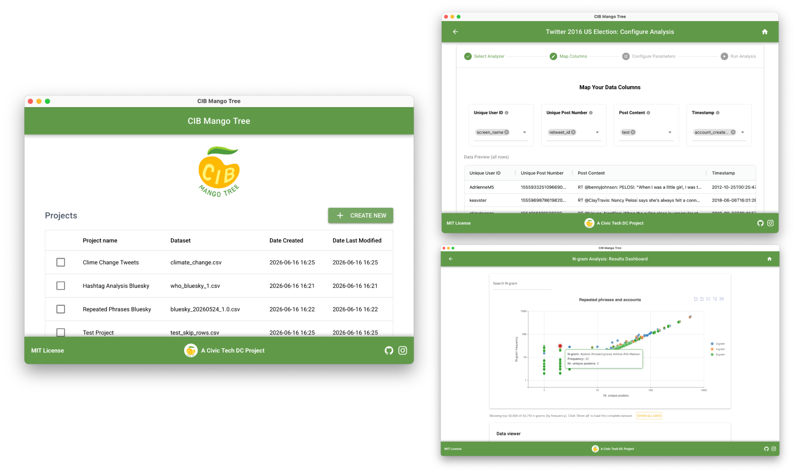

---
# Ensure that this title is the same as the one in `myst.yml`
title: "Commit to Community: Open Source as Social Infrastructure in Volunteer Civic Tech"
abstract: |
  Most scientific Python maintainers build for users who will pip install their package. In civic tech, your community members are policy researchers, journalists, or NGO advocates who may never touch a Python environment. This changes how to approach maintainership: traditional open source practices do double duty as engineering and social infrastructure. Here we share lessons learned in maintaining the CIB Mango Tree project, a Python toolkit for detecting inauthentic behavior in social media datasets. By looking at examples like release cycles and continuous integration, I'll show how technical choices initially intended for code quality unexpectedly helped engage the volunteer community and sustain cross-team momentum.
---

## Introduction

Civic tech and open source are aligned in both values and practice. Civic tech (short for civic technology) is a broad movement of technologists, public policy experts, and civic institutions for advancing public good through digital technology. In the US, civic tech finds its origins in the open data movement of the late 2000's when the first volunteer-run civic hackathons coalesced around the idea that government-created datasets should be made publicly available, channeling cultural and philosophical values of openness and collaboration inherited from the earlier open source software movement [@harrell_civic_2020].

From a practical standpoint, open and collaborative tools promise to be more robust than their more centralized and closed counterparts due to increased public scrutiny and efficient reuse of existing open solutions. But collaborative _development_ is just one side of the coin: building publicly-available technology also requires _maintenance_, reviewing bug reports and contributions, updating dependencies, managing releases etc., in order to keep open source technology reliable and functional [@eghbal_working_2020; @fogel_producing_2023].

The Scientific Python ecosystem[^scipy_org], a collection of community-developed open source coding libraries for scientific computing and data analysis, is an example of a community that has nourished both. Over time, it has not only developed a family of essential data science libraries, but also contributed guidelines, governance structures, and maintainership playbooks that keep the community and tools sustainable. Given the strong cultural alignment between open source software and civic tech, it is perhaps not surprising that Scientific Python libraries are a common choice for data science tools in civic tech.

Yet, the communities civic tech tools serve are different. Scientific Python maintainers largely build with and for technically-minded users: researchers and developers who install code packages from source, report bugs to developers, or propose a solution to a failing pipeline. In civic tech, the team members and end-users are often policy researchers, outreach specialists, journalists, or NGO advocates who may never interact with the codebase directly. This raises the question: how does civic tech context shape open source maintenance?

We explore this by sharing lessons learned in maintaining the CIB Mango Tree project, an early stage interactive open source toolkit for detecting coordinated inauthentic behavior (CIB) in datasets of social media activity. We begin by examining three design characteristics of civic tech communities: continuous onboarding of volunteers, strong stakeholder proximity, and multidisciplinary participation. We then discuss how familiar open source engineering practices, like release cycles and continuous integration, primarily intended for code quality, take on a more pronounced social layer in this context: facilitating communicating progress, promoting volunteer visibility, and maintaining team momentum beyond developers alone.

[^scipy_org]: https://scientific-python.org

## Civic Tech DC: A mix of voices and skills for public good

Civic Tech DC[^ctdcsite] is a non-partisan, nonprofit community of volunteer technologists, policy experts, researchers, designers, and community leaders passionate about using open-source technology for public good in the Washington, DC area. Founded in 2012 as Code for DC, through Code for America’s Brigade program[^codeforamerica], a network of local volunteer chapters, it eventually spun out into an independent nonprofit in 2023 under its current name and brand.

[^ctdcsite]: https://civictechdc.org
[^codeforamerica]: https://codeforamerica.org

**In-person project nights.** The core programming of Civic Tech DC is its biweekly in-person project nights. These take place during the evening after work and are open to volunteers of all backgrounds and experience and require only prior online registration. During project nights, current organizers provide a general introduction and outline the structure of the evening. This is followed by short (approximately 30-second) pitches from each active project (typically 7–8 at a given time) introducing their work and the skills they are currently seeking. After the pitches, attendees break out into project groups. New volunteers can join a project if they already know what they are interested in, or attend a general onboarding session where leads provide an overview of civic tech and help match participants’ skills to their interests. Either way, no formal commitment is required from volunteers.

### Community design characteristics

These in-person events provide the structural context in which several key design characteristics of the community become visible and reinforced over time. Collectively, they shape the ways of working and technical decisions in maintainership. We will explore three such characteristics (see @table_design for overview).

:::{table} Design characteristics of Civic Tech DC community and their effects on maintainership
:label: table_design
:align: left

| Community design characteristic | Description | Effect on maintainership |
| --- | --- | --- |
| Continuous onboarding | New volunteers join projects every two weeks at in-person events | Streamlined onboarding, frequent releases, well-scoped tasks, credit contribution as soon as possible |
| Stakeholder-proximity | Projects develop to address the need of a validated community partner and have a well-defined use case | Focusing on applications, developing tools for bespoke needs, egagement with domain experts |
| Diverse modes of contribution | Projects attract volunteers with a mix of professional backgrounds (e.g. developers, UX researchers, outreach specialists) | Showcase technical progress with tangible outcomes, communicate practical imports of technical decisions, enable access to latest development features to non-technical team members |

:::

**New volunteers, continuous onboarding.** Because project nights are open and run on a biweekly cadence, Civic Tech DC is in a constant state of onboarding new volunteers. At every event, new participants join teams with varying levels of experience, while returning members continue ongoing work. This creates a "continuous onboarding" environment in which project teams must quickly pitch the main project goals and introduce new volunteers to the team every two weeks without sacrificing the momentum of ongoing work with recurrent members.

**Stakeholder proximity and focus on end-users.** Second, all projects are required to be developed in partnership with a validated community partner who helps guide project design and implementation. These partners are nonprofits, community organizations, and advocacy groups with specific real-world needs that can be addressed with digital technology. The "stakeholder-proximity" and focus on bespoke _applications_ contrasts with open source projects in scientific computing, characteristic of the Scientific Python community, where developed tools are commonly _general-purpose libraries_ serving a broad audience.

For example, maintainers of a scientific visualization library do not need to be _directly_ concerned with how any downstream community will be using the visualizations.[^userfeedback] In contrast, developing a bespoke civic tech application, such as a visualization tool that helps a legal NGO make sense of their portfolio, requires ongoing engagement with domain experts and a deeper understanding of how the tools will be used in practice.

[^userfeedback]: Of course, open source communities building general purpose tools very much care about how their tools are being used by collecting bug reports, issues etc. This is critical to make tools useful. But this type of feedback is geared to make tools more robust rather than tailor them to specific use cases.

**Flat team structure, diverse modes of contributions.** Project teams at Civic Tech DC events are typically small and have a relatively flat structure, especially when first taking off. The design is intentional as it lowers the barrier to entry and allows volunteers with different levels of experience to join and contribute quickly. This, combined with the requirement that all projects must have a validated community partner, which can span policy, design, or advocacy disciplines, means developers and coders commonly represent only a subset of the professional backgrounds and expertise involved.

At CIB Mango Tree (see section @cib-mango-tree below) we distinguish three groups of participants: _technical contributors_ who develop and maintain the Python codebase, _non-technical contributors_ (including researchers, designers, and outreach volunteers) who help shape the design of the tests and communicate them to the public, and _end users_ who are the target audience. A strong Python development team alone would struggle to build an application that meets the needs of the communities it is trying to serve (e.g. journalists, social media scholars) without consistent outreach and feedback. While true for many open source projects, civic tech projects in particular rely on multiple pathways for contribution beyond code, including research, design, communications, and community engagement [@harrell_civic_2020].

(cib-mango-tree)=
## CIB Mango Tree

CIB Mango Tree[^cibmtsite][^cibmtrepo] is a Python-based, open source toolkit for analyzing and detecting coordinated inauthentic behavior in social media datasets. Founded in the summer of 2024, it is designed for researchers, data journalists, fact-checkers, and watchdogs working to identify manipulation and inauthentic activity online. The mission of CIB Mango Tree is to provide non-technical users with a battery of tests to interactively explore and analyze datasets of social media activity for evidence of coordinated inauthentic behavior in their reporting. There are several reasons why the development of open source CIB tools is pertinent.

**The research-to-newsroom gap.** Originally coined by Facebook around 2018 [@gleicher_removing_2018], the term _coordinated inauthentic behavior_ in its various definitions generally refers to a group of inauthentic users performing coordinated activity online (e.g. posting, repositing, liking etc.) with a strategic goal to mislead and manipulate public opinion [@starbird_disinformation_2019; @romero_vicente_coordinated_2024]. The field of computational social science is rich with sophisticated methods to analyze the social media datasets for insights about coordinated behavior [@mannocci_detection_2024]. Yet, the experts who research and report on CIB rarely have either the time, resources, or technical capacity to implement such methods from scratch or to execute publicly-available analysis code. In addition, many of the peer-reviewed analyses are specifically tailored to the dataset that the was used in research (e.g. a Twitter dataset). In most cases, such analyses likely need to be refactored to be applicable to new datasets beyond the original — even if the core analyses rely on general-purpose data science methods.

**A library of tests.** CIB Mango Tree tries to fill this gap by implementing simple, but effective methods (referred as "tests" in our parlance) into a coherent toolkit. There is no single test that can definitively determine whether a snapshot of activity on social media is coordinated and/or inauthentic. Therefore -- at its core -- the goal of CIB Mango Tree is to be a library of complementary tests, each of which leverages and highlights different aspects of potential coordination patterns (e.g. copy-pasted content, trending hashtag usage, temporal coordination etc.).

:::{figure}
:label: cibmt_screen

(fig-cibmt-startpage)=

Graphical user interface of the CIB Mango Tree desktop app (version `v0.11.0`). Users can create and review projects (left), import a dataset and interactively configure chosen analysis (top right) and explore the results in an integrated dashboard (bottom right).
:::

Through an end-to-end interactive worfklow, accessible as a standalone desktop app, CIB Mango Tree allows users to import tabular datasets (`.csv`, `.xlsx`), create a project, select and configure one or multiple tests, run the test and explore the results in an integrated dashboard (@cibmt_screen). As of version `v0.11.0`, CIB Mango Tree relies on NumPy [@harris_array_2020] for numerical computing and Polars[^polars] for working with tabular data, TinyDB[^tinydb] for storage, and NiceGUI[^nicegui] for the graphical user interface and dashboards.

[^cibmtsite]: https://cibmangotree.org
[^cibmtrepo]: https://github.com/civictechdc/cib-mango-tree
[^polars]: https://pola.rs/
[^tinydb]: https://tinydb.readthedocs.io
[^nicegui]: https://nicegui.io/

## Community-focused maintainership in civic tech

Maintainership in open source is sometimes, if not frequently, experienced and portrayed as thankless, invisible work lacking recognition of the effort [@meluso_invisible_2025; @buytaert_25_2026]. Given the diversity of backgrounds in civic tech where most team members will not look at the commit history, this tension could be expected to be even more pronounced. Yet, three practices most open source maintainers are familiar with all turned out to have elements of double duty as engineering and social practices. We discuss each in turn: release management and schedules as social signals, continuous integration (CI) as external progress visibility, and dependency selection as an onboarding policy.

### Release management and schedules as social signal

Release management and release schedules are standard practice in software development. The primary goal is to distribute a certain version of software to end-users [@sommerville_software_2016]. Teams and projects can adopt different strategies to manage the release schedules, either creating releases at pre-defined times, at regular intervals or in a so-called agile fashion, as soon as new features are added [@cesar_frequent_2017].

**Occasional, ad-hoc releases.** In the very early stages of the project, the release schedule was ad-hoc. An occasional release was created (with a downloadable standalone application as the output) whenever a new feature (e.g. project storage) was added to the toolbox. In this initial ad-hoc workflow, the release had first and foremost the engineering impact: allowing the (then) maintainer to keep track of the changes and to streamline the distribution of the application with the new feature to the rest of the team. As the project evolved and gained traction, however, the needs have outgrown this approach.

**Increasing frequency, decreasing the scope.** One of the main challenges was that our project "users" were mainly internal contributors, consisting of (mostly non-developer) volunteers. They took part in decision-making at the in-person project nights and were thus actively involved in the overall development process. The rather loose connection between the broader team dynamics and development improvements meant that discussions over needed features often felt disconnected. Every two weeks, the project team would discuss many ideas without referring to the current software version or how any would translate to a development roadmap. Over the course of the past year, we decided to adopt a more regular release schedule which included smaller but more frequent releases that keep pace with regular in-person nights.[^cibmt_releases]

**Community impact: streamlining communication, crediting contributors**. Whereas the engineering output of the release remained unchanged (downloadable standalone application), we want to highlight the changes in community dynamics that we observed. First, the more frequent iteration of version labels streamlined the communication in project channels. Over time, we saw non-developer team members adopt the versioning vocabulary in internal discussions beyond debugging issues. For example, our project managers became comfortable referring to a specific version (e.g. `v0.10.0`) when roadmapping the work for the next few months. This made it easier to scope future work. Lightweight urgent bug fixes in `v0.10.0` would be planned for `v0.10.1` whereas new features would go to `v0.11.0` etc. Prior to us having a regular release schedule---and thus a common mental model and vocabulary---this type of prioritization and scoping was more challenging to achieve across diverse team members.

Another important community impact of having a release schedule is that it creates the opportunity to formally credit ongoing volunteer contributions early. A large majority of volunteers who join us in project nights cannot commit to the project long-term. A more frequent release cadence allows us to credit all contributions in the release notes and communications. This also reflects the fact, that, in addition to  intrinsic motivation (e.g. contributing to tech for public good), many volunteers also have extrinsic motivation for contributing -- a demonstrable contribution to an open source project can be a badge of honor or a signal of skills. Over time, in fact, crediting the contributors has become an important driver when deciding to cut a new release.

[^cibmt_releases]: Given the volunteer nature of the project and thus limited bandwidth, our releases are spaced a few months appart. Relative to many open source communities, this is still a rather slow release cycle.

### Continuous integration as external progress visibility

Introducing frequent changes to software requires the ability to continuously test parts of code for accuracy. This practice, continuous integration (CI), allows developers to iterate rapidly [@eghbal_working_2020]. Nowadays, software tests can be initiated automatically as soon as new contributions are included. As with other practices discussed here, the primary goal of CI is its engineering impact: to ensure ongoing software accuracy without sacrificing developer bandwidth. It's an essential component of a maintainer's toolkit.

**Hampering team bandwidth.** Prior to setting up the testing infrastructure and a CI pipeline, ongoing CIB Mango Tree releases would regularly contain bugs that were only discovered once another team member attempted to launch the application (e.g. for a demo at an upcoming project night). While such organic bug discovery is part and parcel of improving (open source) software, the lack of testing, however, also carried a community cost. Even fundamental bugs pertaining to the application's core architecture and build systems were frequently discovered by non-developer team members who had limited insight into the internal workings of the application. This, in turn, meant that a non-negligible amount of time was spent coordinating between developers and other team members in order to accurately report and diagnose the issues.

**Community impact: early progress visibility.** We eventually set up a minimal suite of unit tests and integration tests of the app.[^github_ci] While arguing for CI from an engineering perspective is self-evident, what CI enabled implicitly beyond that was team momentum and progress visibility. Consistent, lengthy troubleshooting discussions, while strictly speaking productive, can leave everyone on the team with a sense of stalled progress. Setting up a test suite and CI allowed us to discover obvious bugs (e.g. related to build failures) early and properly test each release artifact prior to creating download links. This in turn, allowed us to reliably distribute an internal _preview_ of development version of the application. All team members are able to try the most recent features right as they are added to the development branch thus making most recent progress visible and tangible across the entire team, not just developers.

[^github_ci]: In our case, we used GitHub Actions which are a popular choice at the time of writing, but the main point is not specific to this choice.

### Dependency selection as onboarding policy

Open source software allows other developers to inspect the source code, reuse it and innovate on top or with it. This philosophy is frequently hailed as efficient, as developers can focus on their contribution without having to reinvent the wheel for every problem they encounter. As with any tool, a new dependency in the chain introduces both opportunity (e.g. speed-up in processing time) and risk (if dependency fails, the project fails). Maintainers and developer communities in open source projects thus have to make judicious choices when deciding on introducing new project dependencies. Many factors come into play and to name a few: Does the dependency solve the core problem? Is the project actively maintained? Is it well-scoped for the needs?

**Community impact: lowering barriers to entry.** When choosing dependencies at CIB Mango Tree, we frequently hit on another, community-informed criterion: how easy will it be for volunteers to contribute to the project? To take an example: building interactive dashboards. Given our target audience (researchers and journalists who do not code), it is important that the application allows interactive exploration of results. How many ways are there to build a dashboard in Python? It turns out, many. Some frameworks emphasize the quick-and-easy setup, while others focus on customizability, scalability, and industry-grade performance. Depending on a team's technical maturity, capacity, and needs one or the other framework might be a better fit.

As an early stage volunteer-driven open source project whose goals are both to deliver a minimal working prototype while _facilitating_ successful contributions of new volunteers to civic tech, technical leadership must factor in whether specific coding frameworks and tools have broad familiarity and accessibility within the volunteer community. Decisions often need to be made quickly, with a strong preference for tools that lower barriers to entry, since there is limited time to train new contributors before the next group of participants arrives at project night. As such, maintainability and ease of adoption of each dependency matter in order to have an onboarding process with minimal friction.

## Conclusion

Design characteristics of volunteer-run projects in the Civic Tech DC reshape how successful open source maintainership looks like. Small teams with limited hierarchy, high turnover of volunteers, mix of professional interests beyond coders, and a focus on developing applications all bring to the fore the social angle of open source maintainership and practices. Maintainership effectively blends with elements of community management [@sharan_professionalising_2024]: how we adopt a certain practice depends not only on its technical merits but also on whether it facilitates participation, sustains engagement, and builds a sense of shared ownership and agency across a diverse volunteer community. In our experince, the emphasized social angle also naturally leads to a greater visibility of maintainers' work, bringing in aspects of developer relations (DevRel) roles [@oliveira_developer_2021] where the needs of maintainers and developers are continuously communicated with the broader team.

## Disclosures

_Portions of this work were assisted using generative AI tools (Qwen 3.6 Plus, author KA). The tools were used for brainstorming and reviewing narrative structure and refining language. All outputs were reviewed, verified, and revised by the author(s), who take full responsibility for the accuracy and integrity of the final content._
