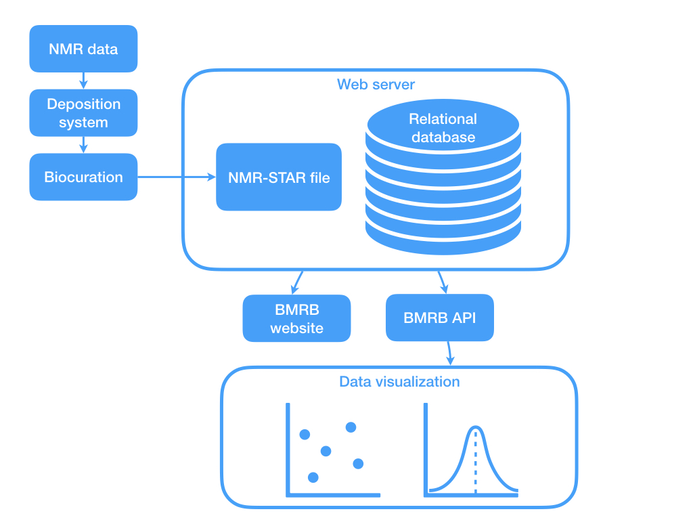
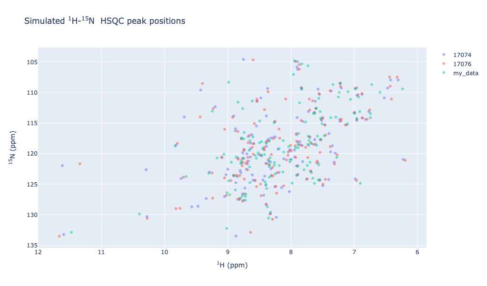
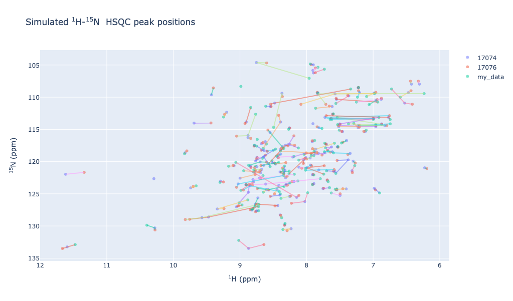
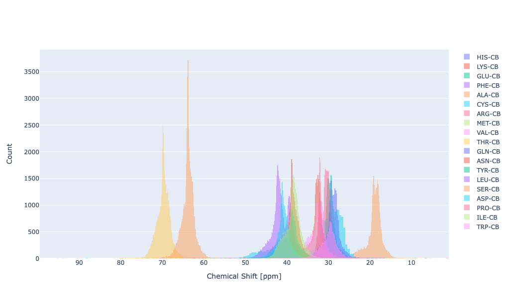
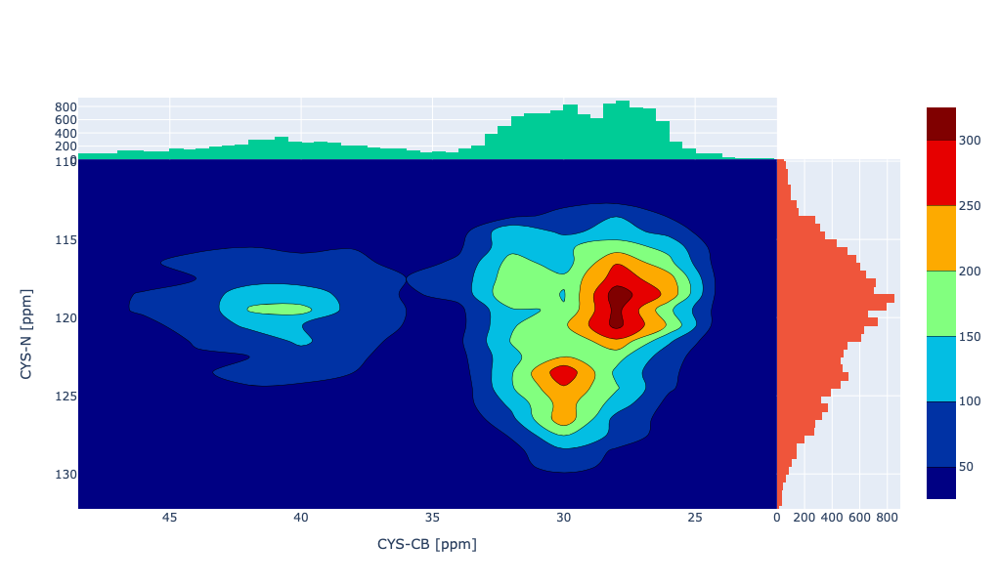
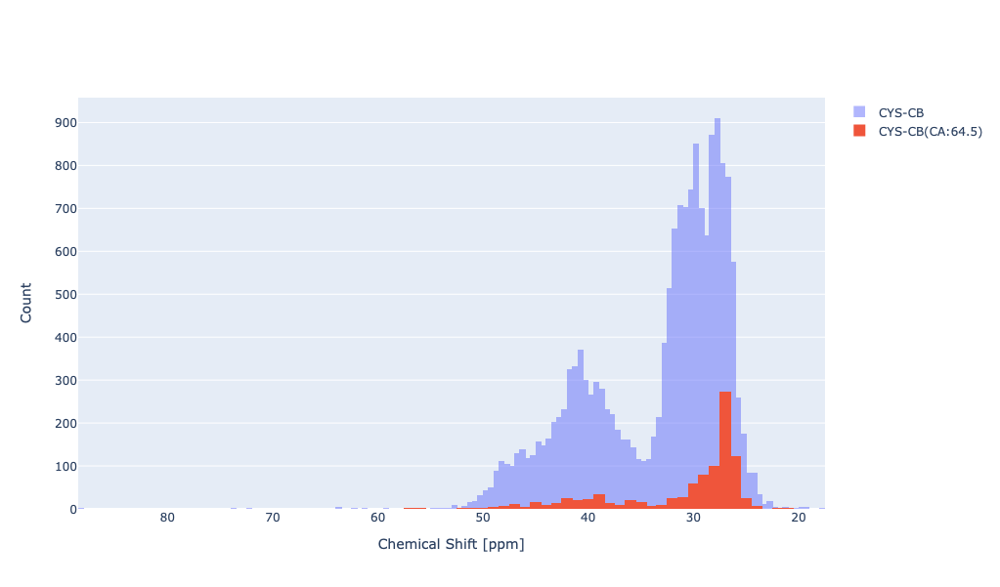

:author: Kumaran Baskaran
:email: baskaran@uchc.edu
:institution: UCONN Health, Molecular Biology and Biophysics
:institution: 263 Farmington Ave. Farmington, CT 06030-3305, USA

:author: Jonathan R Wedell
:email: wedell@uchc.edu
:institution: UCONN Health, Molecular Biology and Biophysics
:institution: 263 Farmington Ave. Farmington, CT 06030-3305, USA

:author: Eldon L. Ulrich
:email: ulrich@uchc.edu
:institution: UCONN Health, Molecular Biology and Biophysics
:institution: 263 Farmington Ave. Farmington, CT 06030-3305, USA

:author: Jeffery C. Hoch
:email: hoch@uchc.edu
:institution: UCONN Health, Molecular Biology and Biophysics
:institution: 263 Farmington Ave. Farmington, CT 06030-3305, USA

:author: John L. Markley
:email: markley@biochem.wisc.edu
:institution: Department of Biochemistry, University of Wisconsin-Madison
:institution: 433 Babcock Drive, Madison, Wisconsin 53606-1544, USA
:bibliography: mybib

-------------------------------------------------
PyBMRB: Data visualization tool for BioMagResBank
-------------------------------------------------

.. class:: abstract

   The Biological Magnetic Resonance Data Bank (BioMagResBank or BMRB https://bmrb.io), founded in 1988, serves as the archive for data generated by Nuclear Magnetic Resonance (NMR) spectroscopy of biological systems. NMR spectroscopy is unique among biophysical approaches in its ability to provide a broad range of atomic and higher-level information relevant to the structural, dynamic, and chemical properties of biological macromolecules, as well as report on metabolite and natural product concentrations in complex mixtures and their chemical structures. NMR-STAR is the official data format of BMRB and BMRB provides python parser (PyNMRSTAR https://github.com/uwbmrb/PyNMRSTAR), a data visualization tool (PyBMRB https://github.com/uwbmrb/PyBMRB) and an Application Program Interface (API)(BMRB-API https://github.com/uwbmrb/BMRB-API) to access the BMRB archive. PyBMRB is designed to visualize the chemical shifts data in each entry as a simulated NMR spectra and to generate database wide chemical shift histograms of different atom types in proteins and nucleic acids. PyBMRB grants easy access to BMRB data through the API and generates portable and interactive visualizations. It also supports to create data visualization workflows using Jupyter Notebooks, which can be easily shared among the scientific community.

.. class:: keywords

   NMR Spectroscopy, chemical shifts, proteins, Biological Magnetic Resonance data Bank(BMRB),NMR-STAR, chemical shift histogram, HSQC

Nuclear Magnetic Resonance (NMR) spectroscopy provides atom-level information relevant to the structural, dynamic, and chemical properties of molecules. The BioMagResBank (BMRB) :cite:`ulrich2007`  provides high-quality, curated NMR spectroscopic data collected from biologically important molecules such as proteins, nucleic acids, carbohydrates, and metabolites and other small compounds. BMRB, which was founded in 1988, became a core member of World Wide Protein Data Bank (wwPDB) :cite:`Burley2017` in 2007, and the BMRB Archive became a Core Archive of the wwPDB in 2018. BMRB uses the NMR-STAR :cite:`Ulrich2019` data format to represent experiments, spectral and derived data, and supporting metadata. NMR-STAR is constructed along the lines of an object-relational data model using a subset of the Self-defining Text Archival and Retrieval (STAR) specification :cite:`Hall1995STARDD`. Following validation and annotation via BMRB’s biocuration pipeline (Figure :ref:`workflow`), user-deposited data are stored as flat files in NMR-STAR format as well as in a relational database. 

To achieve the full power of the BMRB database it is important to be able to retrieve and visualize the data in different scientifically relevant ways. For example, it is much more useful to compare multidimensional NMR data from the same or different BMRB entries in graphical (spectral) format rather than as lists of numerical values in text format. In addition, to understand how chemical shifts of different types of atoms are affected by structural and environmental factors, it is useful to display them as histograms. When browser vendor security policies changed to stop allowing Java Web Applets, BMRB’s original visualization tool (DEVise) :cite:`livny1997` written in Java and C++ stopped running. BMRB originally addressed this by updating DEVise to run as a Java Web Start application. However, in mid 2015 most web browsers stopped supporting Java Web Start and some operating system made it impossible to use without changing operating system security settings.

   
   BMRB data processing workflow. :label:`workflow`

In response to the demise of DEVise, BMRB developed graphic libraries in Python (PyBMRB)  that utilize more modern interactive visualization tools, such as the Plotly visualization tool kit, in reproducing the most commonly used features of DEVise with interactive visualizations. PyBMRB features single-entry (peak position simulation for NMR spectrum) and database-wide visualizations (histograms). 

The main motivation behind the project is to provide user friendly access to BMRB data for biologists and biochemists, who find it difficult to understand the NMR-STAR data model. NMR-STAR is a metadata rich data format, which includes all necessary meta data about the NMR sample, sample condition, instrument details, author details and experimental details in addition to the measured chemical shift values. These chemical shifts are measured using several multidimensional NMR experiments and expressed  as a one dimensional assigned chemical shift lists in NMR-STAR data format. Biologists and biochemists prefer to view the chemical shift data as a spectra rather than a list of values. 

One of the most common and widely used NMR experiment in protein NMR spectroscopy is the :math:`^{1}H-^{15}N` Heteronuclear Single Quantum Coherence( :math:`^{1}H-^{15}N` HSQC) :cite:`BODENHAUSEN1980185` experiment. This 2D NMR experiment gives cross peaks between nitrogen and hydrogen for each amino acid in the sequence, which strongly depends on its three dimensional structure. In spectroscopic perspective :math:`^{1}H-^{15}N` HSQC spectrum is considered as the signature of the protein. It helps to identify whether the protein sample is in good shape or aggregated and to detect the structural changes during ligand biding studies. PyBMRB library generates 2D chemical shift list by combining the relevant chemical shift values from the given one dimensional chemical shift list in NMR-STAR format.    

The single-entry visualization method can be used, for example, to simulate :math:`^{1}H-^{15}N` HSQC peak positions from an NMR-STAR file (from one or more specified BMRB entries or from the user’s own data) (Figures :ref:`hsqc1` and :ref:`hsqc2`). It is much easier to detect the chemical shift changes by overlaying multiple :math:`^{1}H-^{15}N` HSQC  rather than by scanning lists of chemical shifts. The most useful feature is that the user may easily compare their NMR measurements with any of the protein of interest in the BMRB database. The Figures :ref:`hsqc1` and :ref:`hsqc2` show the comparison of user data with two similar entries from BMRB database. This comparison can be done with the following code

.. code-block:: python

 from pybmrb import csviz
 s=csviz.Spectra()
 s.n15hsqc(bmrbid=[17074,17076],
	filename='my_data.str')

The chemical shift changes can be traced for each residue by using ``groupbyres`` option. (Figures :ref:`hsqc2`)

.. code-block:: python

 s.n15hsqc(bmrbid=[17074,17076],
	filename='my_data.str',
	groupbyres=True) 

   
   Comparison of :math:`^{1}H-^{15}N` HSQC spectra of arsenate reductase data from user with arsenate reductase entries in the BMRB  :label:`hsqc1`

  
   The cross peaks in the :math:`^{1}H-^{15}N` HSQC spectra  are connected based on matching sequence order.  :label:`hsqc2`

BMRB is well known for its chemical shift statistics, which are widely used by NMR spectroscopists and NMR software developers in various ways. The chemical shift histogram of a given atom type help us to understand how strongly it depends on the secondary structure elements like alpha helices and beta sheets.  These histograms can be easily generated using a simple code using PyBMRB library

.. code-block:: python

 from pybmrb import csviz
 h=csviz.Histogram()
 h.hist(atom='CB')

   
   Chemical shift distribution of CB atoms in different amino acids.  :label:`hist`

Figure :ref:`hist` shows the comparison of CB chemical shifts for the twenty standard amino acids. The chemical shift histogram of a single atom in a given amino acid or list of atoms from different amino acids can be easily generated using PyBMRB.

PyBMRB provides options for filtering data, for example, according to chemical shift ambiguity code or cutoff values based on standard deviation to exclude outliers. Bond correlation experiments are very common in NMR spectroscopy, and this library can be used to visualize patterns of chemical shift correlations between specified atom types in NMR spectra of proteins or nucleic acids as 2D histograms. For example the chemical shift correlation between Cystidin CB and N is shown in Figure :ref:`hist2d`.

.. code-block:: python

 h.hist2d(residue='CYS',atom1='CB',atom2='N')

   

   Chemical shift correlation of CYS-CB and CYS-N :label:`hist2d`

The conditional histogram is another useful feature, helpful during the resonance assignment process to estimate the prior probability for an assignment. The process of labeling each cross peak in the multidimensional NMR spectra to the relevant atoms is the most important step in the structure determination process. If the chemical shift value of one or more atoms for a given amino acid in a protein sequence are know than one can generate the distribution of the chemical shifts of the other atoms in the amino acid using the known chemical shifts as a filter. For example if the chemical shift of CA of Cystidin is known, then the distribution of CB chemical shift at the BMRB database can be calculated using the following code 

.. code-block:: python

 h.conditional_hist(residue='CYS',
	atom='CB',
	atomlist=['CA'],
	cslist=[64.5])

   
   Conditional histogram of CYS-CB for  CYS-CA=64.5ppm :label:`cond-hist`

The overall and the filtered distribution of CYS-CB is shown in Figure :ref:`cond-hist`. The overall bimodal distribution of Cystidin CB indicates that its chemical shifts are strongly depend on secondary structures and for the given value of CA (64.5 ppm) it falls into one of secondary structure element like alpha helix or beta sheet. 

The visualizations generated using PyBMRB library are interactive and portable. It can be opened in any modern web browser and  zoomed in and out using the mouse. The tool tip  will show the underlying sources of displayed data. These visualizations work as a standalone web page, which can be shared via email or website. Since the visualization tools obtain data directly from the BMRB API each time they are generated, there is no need to download or parse the data, and all underlying data are fully up to date. High quality static images can be extracted from the interactive visualizations with a single click and saved or printed.

As a final note, the Jupyter Notebook :cite:`soton403913` is becoming more and more popular among scientists :cite:`perkel2018`. Jupyter is a free, open-source, interactive web tool, known as a computational notebook, that researchers can use to combine software code, computational output, explanatory text and multimedia resources into a single document.  PyBMRB can be used in a Jupyter Notebook environment, which enables one to design and document a BMRB data analysis workflow and share it with others. For testing purposes, BMRB provides easy access to the PyBMRB library in a Jupyter Notebook environment from its homepage (https://bmrb.io/). This live BMRB Jupyter Notebook was created by using a third party software tool called Binder :cite:`project_jupyter-proc-scipy-2018`, which puts PyBMRB and Jupyter Notebook together in a docker container. Examples of BMRB Jupyter Notebooks with access to PyBMRB are available for trial without any needed installation at https://github.com/uwbmrb/PyBMRB/blob/master/jupyter.md.

BMRB is constantly working to improve PyBMRB visualization tool. The next update aims to include simulation of more NMR experiment types and include visualization options for other data types like  distance and dihedral-angle restraints present in the BMRB database. BMRB is supported by grant R01GM109046 from NIH/NIGMS. 

