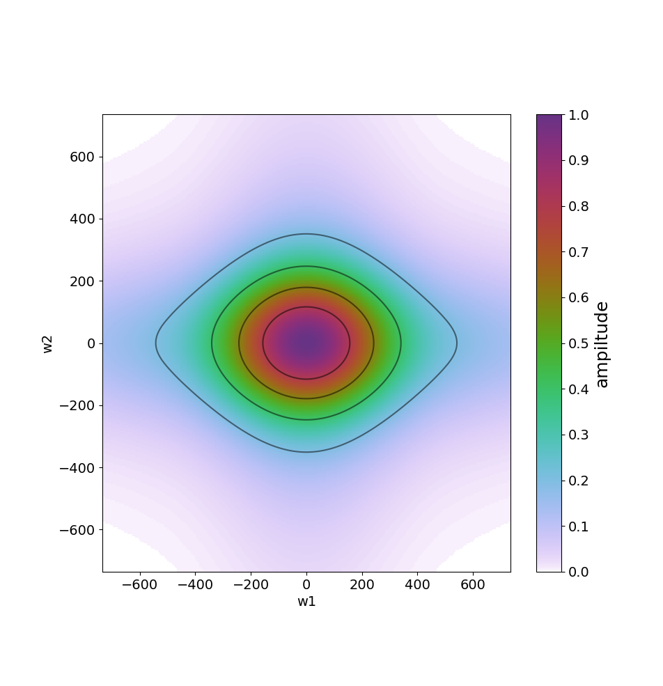
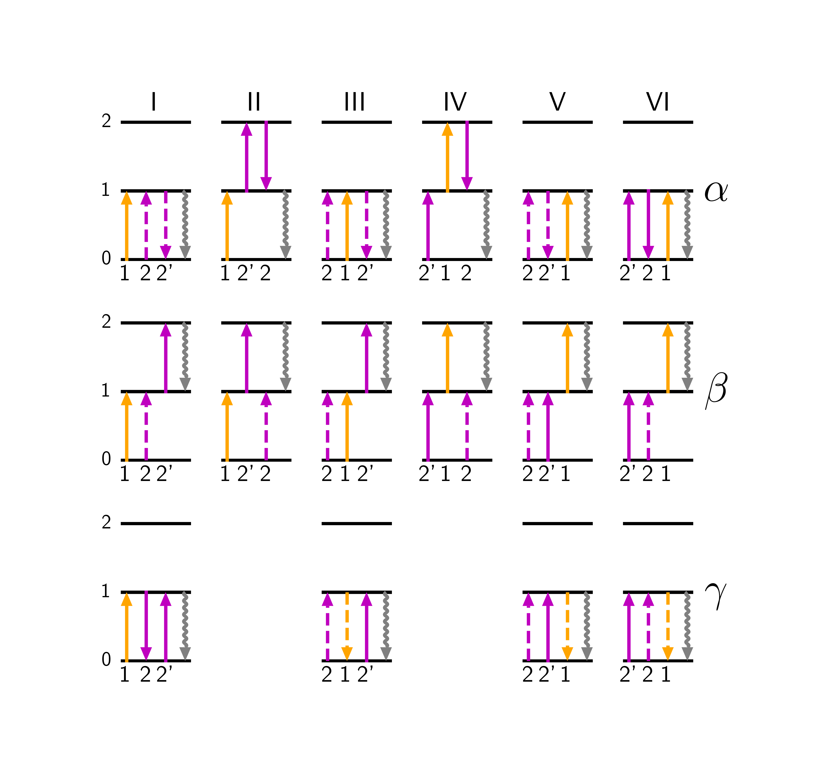
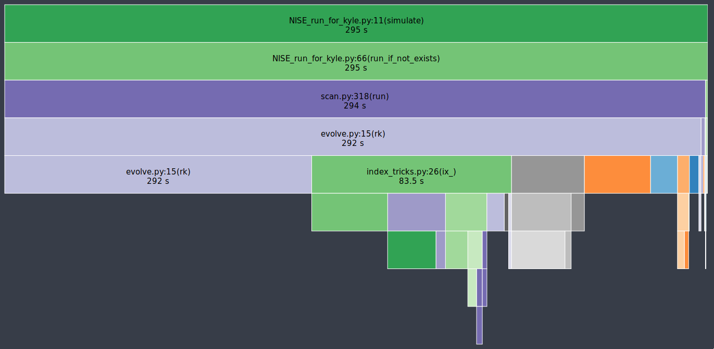
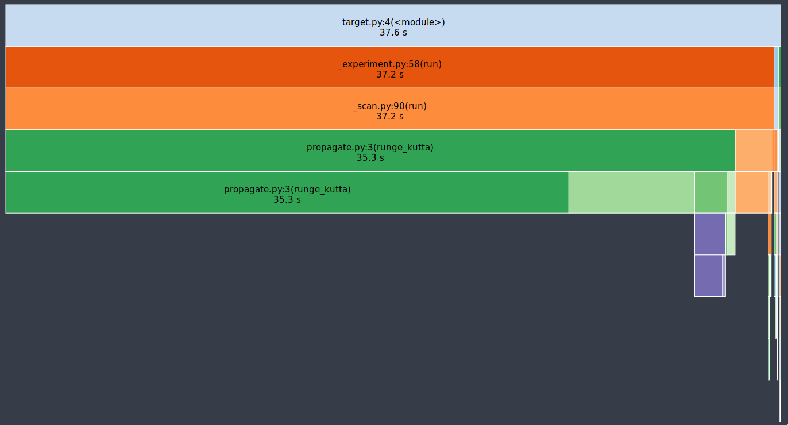
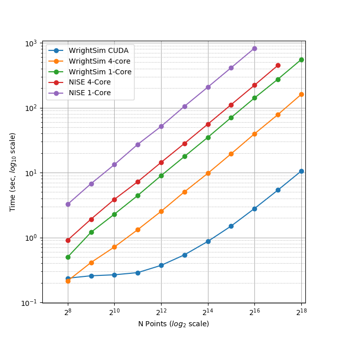

:author: Kyle F Sunden
:email: sunden@wisc.edu
:institution: University of Wisconsin--Madison

:author: Blaise J Thompson
:email: blaise@untzag.com
:institution: University of Wisconsin--Madison

:author: John C Wright
:email: wright@chem.wisc.edu
:institution: University of Wisconsin--Madison

:bibliography: bib

------------------------------------------------------------------------
WrightSim: Numerical Integration for Simulating Multidimensional Spectra
------------------------------------------------------------------------

.. class:: abstract

    We present a Python package designed to simulate multidimesional
    nonlinear spectra: ``WrightSim`` .
    ``WrightSim`` uses the densitry matrix formulation of quantum mechanics.
    A Hamiltonian describes all of the ways that a set of states interact with
    each-other and with externally applied electric fields in the course of a
    spectroscopic experiment.
    Numerical integration (of the Liouville-von Neumann equation) is used to
    evolve the density state vector over time as the system interacts with
    several electric fields in the course of a multidimensional experiment.
    This numerical approach allows ``WrightSim`` to fully account for finite pulse
    effects that are commonly ignored.
    ``WrightSim`` is made using modules that can be exchanged to accomidate many
    different experimental setups.
    Simulations are accomplished through a Python interface that is designed
    to be intuitive for experimentalists and theorists.
    We have worked to ensure that the integration itself is performant.
    We report several algorithimic improvements that make ``WrightSim`` faster
    than previous implementations.
    The effect of parallelizing the simulation, both at the CPU and GPU
    (CUDA) levels, is demonstrated. 
    Taken together, algorithmic improvements and parallization has made
    ``WrightSim`` multiple orders of magnitude faster than previous
    implementations.
    ``WrightSim`` represents a large step forward towards the goal of a fast,
    accuarate, and easy to use general purpose simulation package for the
    multidimensional spectroscopy commmunity.
    To our knowledge, ``WrightSim`` is the first openly licensed software package
    for these kinds of simulations.
    Potential further improvements are discussed.

Introduction
============

Nonlinear multidimensional spectroscopy (MDS) is an increasingly important
analytical technique for the analysis of complex chemical material systems.
MDS can directly observe fundemental physics that are not possible to record in
any other way.
With recent advancements in lasers and optics, MDS experiments are becoming
routine.
Applications of MDS in semiconductor physics, drug screening, and other
domains are currently being developed.
Ultimately, MDS may become a key research tool akin to multidimensional
nuclear magnetic resonance spectroscopy.

A generic MDS experiment involves exiting a sample with multiple pulses of
light and measuring the magnitude of the sample response (the signal).
The dependence of this signal on the properties of the excitation pulses
(frequency, delay, fluence, polarization etc.) contains information about
the microscopic physics of the material.
However, this information cannot be directly "read off" of the spectrum.
Instead, MDS practitioners typically compare the measured spectrum with model
spectra.
A quantitative microscopic model is developed based on this comparison between
experiment and theory.
Here, we focus on this crucial modeling step.
We present a general-purpose simulation package for MDS: ``WrightSim`` [#]_.

.. [#] Source code available at https://github.com/wright-group/WrightSim, released under MIT License.

    Simulated spectrum at normalized coordinates :label:`fig:examplespectrum`

Figure :ref:`fig:examplespectrum` shows an example visualization of a
spectrum in 2-Dimensional frequency space.
The axes are two different frequencies for the input electric fields, the axes
are normalized such that there is a resonance around :math:`0.0` in both
frequencies.
This system that we have chosen for this simulation is very simple, with a single
resonance.
This two-dimensional simulation is merely representative of ``WrightSim``'s ability
to traverse through many aspects of experimental space.
Every concievable pulse paramater (delay, fluence, frequency, chirp etc.) can
become an axis in the simulation.

``WrightSim`` is designed with the experimentalist in mind, allowing users
to parameterize their simulations in much the same way that they would collect
a similar spectrum in the laboratory. 
WrightSim is modular and flexible---it is capable of simulating different
kinds of MDS, and it is easy to extend to new kinds.
WrightSim uses a numerical integration approach that captures the full
interaction between material and electric field without making common limiting
assumptions.
This approach makes ``WrightSim`` flexible, accurate, and interpretable.

While the numerical approach we use is more accurate, it does demand
significantly more computational time.
We have focused on performance as a critical component of ``WrightSim``.
Here we report algorithmic improvements which have significantly decreased 
computational time relative to prior implementations.
We also discuss parallelzation approaches we have taken, and show how the
symmetry of the simulation can be exploited.

Theory
======

The information presented in this section is largely a reproduction,
edited for brevity, of that which was presented by Kohler, Thompson, and
Wright :cite:`Kohler_2017`. Readers interested in finer
grained detail are encouraged to reference that work, in particular the
supplemental information. Below, we discuss the broader goals of this
project, provide an insight into the mathematics underlying the
simulation, and discuss an existing implementation of a software package
to perform the simulations.

A Brief Introduction on Relevant Quantum Mechanics
--------------------------------------------------

If you are interested in a more full understanding, please refer to
Kohler, Thompson, and Wright :cite:`Kohler_2017`. This
introduction is intended to very quickly introduce *what* is being done,
but not *why*.

Here, we are simulating the interactions of three electric fields to
induce an output electric field. These fields can interact in a
combinatorially large number of fashions. For three fields, there are
six possible time orderings for the pulses to interact and create
superpositions or populations in the material system. We are restricting
this simulation to have two positive interactions (solid up arrows or
dashed down arrows) and one negative interaction (dashed up arrow or
solid down arrow). This results in 16 independently resolvable possible
pathways which result in a productive emission. Figure :ref:`fig:WMELs` shows
these 16 pathways, arranged by their time ordering (I - VI). For the
purposes of this paper it is not necessary to fully understand what is
meant by this diagram, the intent is simply to show the complexity of
the problem at hand. Experimentalists can isolate the time orderings by
introducing delays between pulses to preferentially follow the according
pathways. Simulation allows us to fully separate these time orderings
and pathways, to as fine a detail as desired.

    Independent Lioville pathways simulated. Excitations from
    :math:`\omega_1` are in yellow, excitations from
    :math:`\omega_2 = \omega_{2^\prime}` are shown in purple. Figure was
    originally published as Figure 1 of Kohler, Thompson, and
    Wright :cite:`Kohler_2017` :label:`fig:WMELs`

.. figure:: flow_diagram.pdf

    Finite state automata of the interactions with the density matrix
    elements. Matrix elements are denoted by their coherence/population
    state (the subscript) and the pulses which they have already interacted
    with (the superscript). Arrows indicate interactions with
    :math:`\omega_1` (blue), :math:`\omega_{2^\prime}` (red), and
    :math:`\omega_2` (green). Figure was originally published as Figure S1
    of Kohler, Thompson, and Wright :cite:`Kohler_2017` :label:`fig:fsa` 

Figure :ref:`fig:fsa` shows a finite state automata, starting at
the ground state (:math:`\rho_{00}`). Encoded within each node is both
the quantum mechanical state and the fields with which the system has
already interacted. Interactions occur along the arrows, which generate
density in the resulting state. Here, the fields must each interact exactly once.
Output is generated by the rightmost two nodes, which have interacted with all
three fields. These nine states represent all possible states which
match the criterion described by the process we are simulating. We can
take these nine states and collect them into a state density vector,
:math:`\overline{\rho}` (Equation 1.1).

.. math::

   \overline{\rho} \equiv
   \begin{bmatrix}
   \tilde{\rho}_{00} \\
   \tilde{\rho}_{01}^{(-2)} \\
   \tilde{\rho}_{10}^{(2^\prime)} \\
   \tilde{\rho}_{10}^{(1)} \\
   \tilde{\rho}_{20}^{(1+2^\prime)} \\
   \tilde{\rho}_{11}^{(1-2)} \\
   \tilde{\rho}_{11}^{(2^\prime-2)} \\
   \tilde{\rho}_{10}^{(1-2+2^\prime)} \\
   \tilde{\rho}_{21}^{(1-2+2^\prime)}
   \end{bmatrix}

Next we need to quantitate the transitions within these states. This is the
Hamiltonian matrix. Since we have nine states in our density vector, the
Hamiltonian is a nine by nine matrix. To assist in representing the
matrix, six time dependent variables are defined:

.. math::

   \begin{aligned}
   A_1 &\equiv& \frac{i}{2}\mu_{10}e^{-i\omega_1\tau_1}c_1(t-\tau_1)e^{i(\omega_1-\omega_{10})t} \\
   A_2 &\equiv& \frac{i}{2}\mu_{10}e^{i\omega_2\tau_2}c_2(t-\tau_2)e^{-i(\omega_2-\omega_{10})t} \\
   A_{2^\prime} &\equiv& \frac{i}{2}\mu_{10}e^{-i\omega_{2^\prime}\tau_{2^\prime}}c_{2^\prime}(t-\tau_{2^\prime})e^{i(\omega_{2^\prime}-\omega_{10})t} \\
   B_1 &\equiv& \frac{i}{2}\mu_{21}e^{-i\omega_1\tau_1}c_1(t-\tau_1)e^{i(\omega_1-\omega_{21})t} \\
   B_2 &\equiv& \frac{i}{2}\mu_{21}e^{i\omega_2\tau_2}c_2(t-\tau_2)e^{-i(\omega_2-\omega_{21})t} \\
   B_{2^\prime} &\equiv& \frac{i}{2}\mu_{21}e^{-i\omega_{2^\prime}\tau_{2^\prime}}c_{2^\prime}(t-\tau_{2^\prime})e^{i(\omega_{2^\prime}-\omega_{21})t}\end{aligned}

These variables each consist of a constant factor of
:math:`\frac{i}{2}`, a dipole moment term (:math:`\mu_{10|21}`), an
electric field phase and amplitude (the first exponential term), an
envelope function (:math:`c`, a Gaussian function here), and a final
exponential term. These variables can then be used to populate the
matrix:

.. math::

   \overline{\overline{Q}} \equiv
   \setlength{\arraycolsep}{2pt}
   \begin{bmatrix}
       0 & 0 & 0 & 0 & 0 & 0 & 0 & 0 & 0 \\
       -A_2 & -\Gamma_{10} & 0 & 0 & 0 & 0 & 0 & 0 & 0 \\
       A_{2^\prime} & 0 & -\Gamma_{10} & 0 & 0 & 0 & 0 & 0 & 0 \\
       A_1 & 0 & 0 & -\Gamma_{10} & 0 & 0 & 0 & 0 & 0 \\
       0 & 0 & B_1 & B_{2^\prime} & -\Gamma_{20} & 0 & 0 & 0 & 0 \\
       0 & A_1 & 0 & -A_2 & 0 & -\Gamma_{11} & 0 & 0 & 0 \\
       0 & A_{2^\prime} & -A_2 & 0 & 0 & 0 & -\Gamma_{11} & 0 & 0 \\
       0 & 0 & 0 & 0 & B_2 & -2A_{2^\prime} & -2A_1 & -\Gamma_{10} & 0 \\
       0 & 0 & 0 & 0 & -A_2 & B_{2^\prime} & B_1 & 0 & -\Gamma_{21}
   \end{bmatrix}
   \label{eq:single_Q}

The :math:`\Gamma` values along the diagonal represent dephasing, that
is, loss of coherence, which happens without any interaction. The
:math:`\Gamma` for populations is the population decay rate. To isolate
a given time ordering, we can simply set the value of elements which do
not correspond to that time ordering to zero.

At each time step, the dot product of the matrix with the
:math:`\overline{\rho}` vector is the change in the
:math:`\overline{\rho}` vector to the next time step (when multiplied by
the differential). Both ``NISE`` and ``WrightSim`` use a more advanced,
second order technique (Runge-Kutta) for determining the change in the
:math:`\overline{\rho}` vector, but the idea is the same. The core of
the simulations is to take the :math:`\overline{\rho}` vector and
multiply by the Hamiltonian at each time step (noting that the
Hamiltonian is time dependant, as are the electric fields, themselves). This process
repeats over a large number of small time steps, and must be performed
separately for any change in the inputs (e.g. frequency [:math:`\omega`]
or delay[:math:`\tau`]). As a result, the operation is ripe to be performed
in parallel.

``NISE``: Numerical Integration of the Shrödinger Equation
----------------------------------------------------------

``NISE`` :cite:`nise` is the open-source package written by
Kohler and Thompson while preparing their manuscript
:cite:`Kohler_2017`. ``NISE`` uses a slight variation on the
technique described above, whereby they place a restriction on the time
ordering represented by the matrix, and can thus use a seven element
state vector rather than a 9 element state vector. This approach is
mathematically equivalent to that presented above. The approach
presented is what is used in ``WrightSim``. The trade off is that to
obtain a full picture, they must build in a mechanism to perform two
simulations at the same time, increasing complexity, and actually
reducing performance.

``NISE`` is included here as a reference for the performance of previous
simulations of this kind.

Usage
=====

``WrightSim`` is designed in a modular, extensible manner in order to be 
friendly to experimentalists and theorists alike.
The key steps to running a basic simulation are: 

- Define the experimental space
- Select a hamiltonian for propagation
- Run the scan
- Process the results

Experimental spaces are defined in an INI format that defines a set of parameters
and specifies their defaults and relationships.
Here, we are using a space called ``trive`` which provides, among other settings,
two independent frequency axes and two independent delay axes, controlling a total of
three incident pulses.
The frequency axes are called ``w1`` and ``w2``, the delays are termed ``d1`` and ``d2``.
To scan a particular axis, simply set the ``points`` array to a ``NumPy`` array and set it's ``active``
attribute to ``True``.
You can also set a static value for any available axis, by setting the ``points`` attribute to 
a single number (and keeping ``active`` set to ``False``.
Finally, the ``experiment`` class tracks the timing in the simulation.
Three main parameters control this: ``timestep``, which controls the size of each numerical integration step,
``early_buffer``, which defines how long to integrate before the first pulse maximum, and
``late_buffer``, which defines how long to inytegrate after the last pulse maximum.
Here is an example of setting up a 3-D (shape :math:`64x64x32`) scan with an additional static parameter set:

.. code-block:: python

    import WrightSim as ws
    import numpy as np

    dt = 50.  # pulse duration (fs)
    nw = 64  # number of frequency points (w1 and w2)
    nt = 32  # number of delay points (d2)

    # create experiment
    exp = ws.experiment.builtin('trive')

    # Set the scan ranges, tell WrightSim to treat the axis as scanned
    exp.w1.points = np.linspace(-500., 500., nw)
    exp.w2.points = np.linspace(-500., 500., nw)
    exp.d2.points = np.linspace(-2 * dt, 8 * dt, nt)
    exp.w1.active = exp.w2.active = exp.d2.active = True

    # Set a non-default delay time for the 'd1' axis
    exp.d1.points = 4 * dt  # fs
    exp.d1.active = False

    # Set time between iterations, buffers
    exp.timestep = 2.  # fs
    exp.early_buffer = 100.0  # fs
    exp.late_buffer  = 400.0  # fs

Hamiltonians define a time-dependant matrix used to propagate electric fields and their
effect on the density matrix elements.
The matrix can also be used to obtain a subset of the time orderings by holding particular elements at 0.
It is responsible for the density vector and the holding on to the propagation function
used when the experiment is run.
Included in the density vector responsibility is the identity of which columns will be returned
in the end result array.
Hamiltonians may have arbitrary parameters to define themselves in intuitive ways.
Under the hood, the Hamiltonian class also holds the C struct and source code for the ``PyCUDA``
implementation and a method to send itself to the CUDA device.
Here is an example of setting up a Hamiltonian object with restricted pathways and explicitly set 
recorded element parameters:

.. code-block:: python

    # create hamiltonian
    ham = ws.hamiltonian.Hamiltonian(w_central=0.)

    # Select particular pathways
    ham.time_orderings = [4, 5, 6]
    # Select particular elements to be returned
    ham.recorded_elements = [7,8]

Finally, all that is left is to run the experiment itself.
The run method takes the hamiltonian object and a keyword argument ``mp``, short for "multiprocess".
In general, any value that evaluates to ``False`` will run non-multiprocessed (i.e. single threaded).
Almost all values that evalueates to ``True`` with run CPU - multiprocessed with the number of processes
determined by the number of cores of the machine.
The exception is the special string ``'gpu'``, which will cause ``WrightSim`` to run using ``PyCUDA``.

.. code-block:: python

    # do scan, using PyCUDA
    scan = exp.run(ham, mp='gpu')
    
    # obtain results as a NumPy array
    gpuSig = scan.sig.copy()

Running returns a ``Scan`` object, which allows for interrogation of several internal features of the scan 
including the electric field values themselves.
The important part, however is the signal array that is generated.
In this example, the complex floating point number array is of shape :math:`(2x64x64x32)` (i.e. the number of 
``recorded_elements`` followed by the shape of the experiment itself.
These numbers can be manipulated and visualized to produce spectra like that seen in :ref:`fig:examplespectrum`.
The Wright Group also maintains a library for working with multidimensional data, ``WrightTools``. 
This library will be integrated more fully to provide even easier access to visualization and 
archival storage of simulation results.

Algorithmic Improvements
========================

When first translating the code from ``NISE`` into the paradigm of
``WrightSim``, we sought to understand why it took so long to compute. We
used Python’s standard library package ``cProfile`` to produce traces of
execution, and visualized them with
``SnakeViz`` :cite:`snakeviz`. Figure :ref:`fig:snakeviz`
shows the trace obtained from a single-threaded run of ``NISE``
simulating a :math:`32 x 32 x 16` frequency-frequency-delay space. This
trace provided some interesting insights into how the algorithm could be
improved. First, 99.5% of the time is spent inside of a loop which is
highly parallelizable. Second, almost one third of that time was spent
in a specific function of NumPy, ``ix_``. Further inspection of the code
revealed that this function was called in the very inner most loop, but
always had the same, small number of parameters. Lastly, approximately
one tenth of the time was spent in a particular function called
``rotor`` (the bright orange box in Figure :ref:`fig:snakeviz`). This
function computed :math:`cos(theta) + 1j * sin(theta)`, which could be
replaced by the equivalent, but more efficient :math:`exp(1j * theta)`.
Additional careful analysis of the code revealed that redundant
computations were being performed when generating matrices, which could
be stored as variables and reused.

When implementing ``WrightSim``, we took into account all of these
insights. we simplified the code for matrix generation and propagation by
only having the one 9 by 9 element matrix rather than two 7 by 7
matrices. The function that took up almost one third the time (``ix_``)
was removed in favor of a simpler scheme for denoting which values to
record. We used variables to store the values needed for matrix
generation, rather than recalculating each element. As a result, solely
by algorithmic improvements, almost an order of magnitude speedup was
obtained (See Figure :ref:`fig:snakeviz2`). Still, 99% of the time was
spent within a highly parallelizable inner loop.

    Profile trace of a single threaded simulation from ``NISE``. :label:`fig:snakeviz`

    Profile trace of a single threaded simulation from ``WrightSim``. :label:`fig:snakeviz2`

CPU and GPU Parallel Implementations
====================================

``NISE`` already had, and ``WrightSim`` inherited, CPU multiprocessed
parallelism using the Python standard library multiprocessing interface.
Since almost all of the program is parallelizable, this incurs a four
times speedup on a machine with four processing cores (limited more by
the operating system scheduling other tasks than by Amdahl’s law). This
implementation required little adjustmen outside of minor API tweaks.

In order to capitalize as much as possible on the amount of parallelism
possible, an implementation using Nvidia CUDA
:cite:`Nickolls_2008` was performed. In order to make the
implementation as easy to use as possible, and maintainable over the
lifetime of ``WrightSim``, ``PyCUDA`` :cite:`Klockner_2012` was used to integrate the call
from within python to a CUDA kernel. ``PyCUDA`` allows the source code
for the device side functions (written in C/C++) to exist as strings
within the python source files. These strings are just in time compiled
(using ``nvcc``) immediately prior to calling the kernel. For the
initial work with the CUDA implementation, only one Hamiltonian and one
propagation function were written, however it is extensible to
additional methods. The just-in-time compilation makes it easy to
replace individual functions as needed (a simple form of
metaprogramming).

The CUDA implementation is slightly different from the pure Python
implementation. It only holds in memory the Hamiltonian matrices for the
current and next step, where the Python implementation computes all of
the Matrices prior to entering the loop. This was done to conserve
memory on the GPU. Similarly, the electric fields are computed in the
loop, rather than computing all ahead of time. These two optimizations
reduce the memory overhead, and allow for easier to write functions,
without the help of numpy do perform automatic broadcasting of shapes.

Scaling Analysis
----------------

Scaling analysis, tests of the amount of time taken by each simulation
versus the number of points simulated, were conducted for each of the
following: ``NISE`` single threaded, ``NISE`` Multiprocessed using four
cores, ``WrightSim`` Single threaded, ``WrightSim`` Multiprocessed using
four cores, and ``WrightSim`` CUDA implementation. A machine with an
Intel Core i5-7600 (3.5 GHz) CPU and an Nvidia GTX 1060 graphics card,
running Arch Linux was used for all tests. The simulations were functionally
identical, with the same number of time steps and same recorded values.
The ``NISE`` simulations use two seven by seven
matrices for the Hamiltonian, while the ``WrightSim`` simulations use a
single nine by nine matrix. The results are summarized in Figure
:ref:`fig:scaling`.

    Scaling Comparison of ``WrightSim`` and ``NISE`` :label:`fig:scaling`

The log-log plot shows that the time scales linearly with number of
points. All lines have approximately the same slope at high values of N,
though the CUDA implementation grows slower at low N. The Algorithmic
improvements alone offer doubled performance over even 4-Core
multiprocessed ``NISE`` simulation. The CUDA implementation has a
positive intercept at approximately 200 milliseconds. This is due, in
large part, to the compilation overhead.

Limitations
-----------

The CUDA implementation faces limitations at both ends in terms of
number of points. On the low side, the cost of compilation and transfer
of data makes it slower than the 4-Core CPU Multiprocessing
implementation. This crossover point is approximately 256 points (for
this simulation, all other parameters being equal). Incidentally, that
is also a hard coded block size for the CUDA kernel call. While this
could be modified to ensure no illegal memory accesses occur on smaller
cases, the fact that you are not saving by using CUDA (and even single
core performance is under a second) means it is not worth the effort at
this time. The hard-coded block size also means that multiples of 256
points must be used in the current implementation.

With larger number of points, we are limited by the amount of
memory available to be allocated on the GPU. For each pixel in the
simulations presented here, 250 complex numbers represented as doubles
must be allocated. Additional space is needed, however
it is dominated by this array, which contains the outputs
which are then transferred back to the host. Each CUDA thread
additionally dynamically allocates the arrays it needs to perform the
computation. The current implementation has a limit somewhere between
:math:`2^{18}` and :math:`2^{19}` points. This limit could be increased
by using single precision floating point numbers to represent the
complex arrays, if the precision trade-off is acceptable (which is yet to be determined).

Future Work
===========

This is still quite early days for ``WrightSim``. While it is already a
startling proof of concept display of how ``PyCUDA`` can be applied to this
problem, there is still much room for improvement. In general, there are
improvements to be made in terms of features, API/ease of use, and indeed further algorithmic
improvements.

Features
--------

``NISE`` had implemented a few additional features which were not
carried over to ``WrightSim`` during the development efforts which
focused on performance thus far.

There was support for chirped electric field pulses, which behave in
less ideal fashions than the true sinusoids and Gaussian peaks used thus
far. These non-ideal perturbations can have a real effect in spectra
collected in the lab, and accurately modelling them helps to interpret
these spectra.

Samples in laboratory experiments may have some amount of inhomogeneity
within the sample, resulting in broader than would otherwise be expected
peaks. This inhomogeneity can be modeled by storing the response array
which is calculated by numerical integration, and translating the points
slightly. The original ``NISE`` implementation would perform the
simulation multiple times, where that is not needed as a simple
translation will do. At one point we considered generating a library of
responses in well known coordinates and saving them for future use,
avoiding the expensive calculation all together. That seems to be less
needed, given the speed of the CUDA code.

``NISE`` provided a powerful and flexible set of tools to “Measure" the
signal, using Fourier transforms and produce arrays that even further
mimic what is observed experimentally. That system needs to be added to
``WrightSim`` for it to be feature-complete. More naïve methods of
visualizing work in this case, but a true measurement would allow for more
complex, detailed analysis and interpretation.

Some new features could be added, including saving intermediate
responses using an HDF5 based file format. The CUDA implementation
itself would benefit from some way of saving the compiled code for
multiple runs, removing the 0.2 second overhead. Current implementation
compiles directly before calling the kernel, whether it has compiled it
before or not. If performing many simulations in quick succession (e.g. 
a simulation larger than the memory allows in a single kernel call) with
the same C code, the savings would add up.

The just in time compilation enables some fancy metaprogramming
techniques which could be explored. The simple case is using separately
programmed functions which have the same signature to do tasks in
different ways. Currently there is a small shortcut in the propagation
function which uses statically allocated arrays and pointers to those
arrays rather than using dynamically allocated arrays. This relies on
knowing the size at compilation time. The numbers could be replaced by
preprocessor macros which are also fed to the compiler to assign this
value "pseudo-dynamically" at compilation time. A much more advanced
metaprogramming technique could, theoretically, generate the C struct
and Hamiltonian generation function by inspecting the python code and
performing a translation. Such a technique would mean that new
Hamiltonians would only have to be implemented once, in Python, and
users who do not know C would be able to run CUDA code.

Usability
---------

One of the primary reasons for reimplementing the simulation package is
to really think about how users interact with the package. As much as
possible, the end user shouldn’t need to be an experienced programmer to
be able to get a simulation. One of the next steps for ``WrightSim`` is
to take a step back and ensure that our API is sensible and easy to
follow. We wish to, as much as possible, provide ways of communicating
through configuration files, rather than code. Ultimately, a GUI front
end may be desirable, especially as the target audience is primarily
experimentalists.

Additional Hamiltonians would make the package significantly more
valuable as well. To add more Hamiltonians will require ensuring the
code is robust, that values are transferred as expected. A few small
assumptions were made in the interest of efficiency in the original
implementation. Certain values represented by the Hamiltonian were
hard-coded on the device code.

Further Algorithmic Improvements
--------------------------------

While great strides were taken in improving the algorithms from previous
implementations, there are several remaining avenues to gain even
further. The CUDA implementation is memory bound, both in terms of what
can be dispatched, and in terms of time of execution. The use of single
precision complex numbers (and other floating point values) would save
roughly half of the space. One of the inputs is a large array with
parameters for the each electric field at each pixel. This array
contains much redundant data, which could be compressed with the parsing
done in parallel on the device.

If the computed values could be streamed out of the GPU once computed,
while others use the freed space, then there would be almost no limit on
the number of points. This relies on the ability to stream data back
while computation is still going, which we do not have experience doing,
and are not sure CUDA even supports. The values are not needed once they
are recorded, so there is no need from the device side to keep the
values around until computation is complete.

Additional memory could be conserved by using a bit field instead of an
array of chars for determining which time orderings are used as a
boolean array. This is relatively minimal, but is a current waste of
bits. The Python implementation could potentially see a slight
performance bump from using a boolean array rather than doing list
searches for this same purpose.

The CUDA implementation does not currently take full advantage shared
cache. Most of the data needed is completely separated, but there are
still a few areas where it could be useful. The Hamiltonian itself is
shared, and if the electric field parameters array is sent in a more
compressed format, it would be shared as well.

The current CUDA implementation fills the Hamiltonian with zeros at
every time step. The values which are nonzero after the first call are
always going to be overwritten anyway, so this wastes time inside of of
nested loop. This zeroing could be done only before the first call,
removing the nested loop. Additionally, many matrices have a lot of zero values. Often
they are triangular matrices, which would allow for a more optimized dot
product computation which ignores the zeros in the half which is not
populated. Some matrices could even benefit by being represented as
sparse matrices, though these are more difficult to use.

Finally, perhaps the biggest, but also most challenging, remaining
possible improvement would be to capitalize on the larger symmetries of
the system. It’s a non-trivial task to know which axes are symmetric,
but if it could be done, the amount that actually needs to be simulated
would be much smaller. Take the simulation in Figure
:ref:`fig:examplespectrum`. This was computed as it is displayed, but there
are two orthogonal axes of symmetry, which would cut the amount actually
needed to replicate the spectrum down by a factor of four. Higher
dimensional scans with similar symmetries would benefit even more.

Conclusions
===========

``WrightSim``, as implemented today, represents the first major step
towards a cohesive, easy to use, fast simulation suite for quantum
mechanical numerically integrated simulations. Solely algorithmic
improvements enabled the pure python implementation to be an order of
magnitude faster than the previous implementation. The algorithm is
highly parallelizable, enabling easy CPU level parallelism. A new
implementation provides further improvement than the CPU parallel code,
taking advantage of the GP-GPU CUDA library. This implementation
provides approximately 2.5 orders of magnitude improvement over the
existing ``NISE`` serial implementation. There are still ways that this
code can be improved, both in performance and functionality, but it is a
truly amazing start to this project.
