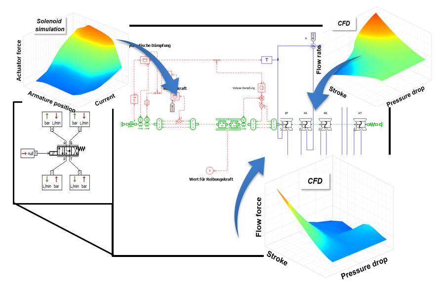
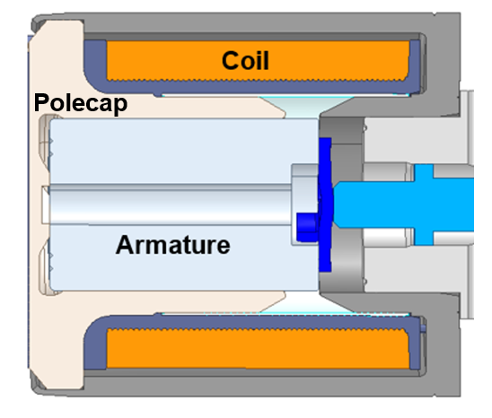

:author: Zoufiné Lauer-Baré
:email: zoufine.lauer-bare@hilite.com
:institution: Hilite International, Weberstrasse 17, Nürtingen, Germany

:author: Erich Gaertig
:email: erich.gaertig@hilite.com
:institution: Hilite International, Weberstrasse 17, Nürtingen, Germany

------------------------------------------------------------------------------------
Conformal Mappings with SymPy: Towards Python-driven Analytical Modeling in Physics
------------------------------------------------------------------------------------

.. class:: abstract

   This contribution shows how the symbolic computing Python library ``SymPy`` can be used to improve flow force modeling due to a Couette-type flow, i.e. a flow of viscous fluid in the region between two bodies, where one body is in tangential motion relative to the other. This motion imposes shear stresses on the fluid and leads to a corresponding fluid flow. The flow forces exerted on the moving component are of interest in many applications, for example in system simulations of electrohydraulic valves. There, an eccentrically mounted cylindrical core (the armature) moves within an oil-filled tube (the polecap), experiencing fluid forces due to the viscous oil. ``SymPy`` can help to understand the range of validity as well as the limitations of analytical relations that are commonly used as standard approximations for these type of forces in many leading system simulation tools. In order to motivate these approaches, this contribution elucidates how the velocity of the flow is determined analytically by solving the Stokes equation in an eccentric annulus with a conformal mapping-approach. Afterwards analytical postprocessing leads to the corresponding flow force. The results obtained with ``SymPy`` are then checked against full 3D computational fluid dynamics (CFD) simulations. This work concludes with the combination of new Couette flow force approximations and similar results for the known Poiseuille flow (i.e. fluid flow induced by a pressure difference) to derive new relations for a combined Couette-Poiseuille flow force. This article is addressed to natural scientists and engineers that are interested in the application of conformal mappings and Taylor-expansions with the help of ``SymPy`` when solving partial differential equations analytically.

.. class:: keywords

   Physical modeling, Stokes equation, Eccentric annulus, Flow force, Conformal mapping, SymPy

Introduction
------------

In times of digitization and wide use of numerical methods in physics, the question emerges whether analytical tools, such as Taylor-expansions or conformal mappings, are still of interest and how they can be utilized in industrial and academic research.

Computational power has increased significantly in the last years and many physical problems, ranging from electromagnetism to fluid dynamics and structural mechanics, can be solved directly by numerically integrating the corresponding three-dimensional PDEs, i.e. the Maxwell, Navier-Stokes or elasticity equations.
However, when modeling physical systems such as hydraulic valves, transmission systems, engines, cars or planes, a direct 3D-approach for all relevant physical effects is still too difficult. In these situations, look-up tables containing a limited set of 3D-results are often included into 1D-system models for later interpolation. Alternatively, analytical approximations are used which are already included in the corresponding system simulation tools (e.g. Simcenter Amesim, [K19]_, [LGK21]_).

Figure :ref:`system` schematically shows such a valve system with input data from look-up tables and 1D-component symbols.

   Valve system model with input data from look-up tables and 1D-component symbols as used in standard system simulation tools :label:`system` 
   
Hence, in modern system modeling there are currently two main applications of analytical approximations:

* Analytical approximations are included in the system simulation software components themselves, or
* The user includes look-up tables for interpolation, entirely or partially generated with analytical approximations.   
   
In this work we will focus on analytical approximations of flow forces that act upon the inner cylinder in an eccentric annular flow domain. Such forces are of interest in, for example, hydraulic valves that are electromagnetically actuated; see Figure :ref:`armature`. When the armature moves within the oil-filled interior of the polecap, that movement causes a Couette-type annular flow, i.e. a viscous flow due to motion of a solid body, between both components.

   Armature and polecap in an electromagnetic actuator; the interior of the polecap is filled with oil (not shown here) :label:`armature` 

For an analytical treatment, this geometry has to be simplified considerably. Both armature and polecap are therefore modeled as solid and hollow cylinders respectively. Since in realistic scenarios, perfect concentricity between these two parts is rarely obtained, the armature can be supported eccentrically within the poletube. A cross-sectional cut perpendicular to the symmetry axes of both cylinders then leads to Figure :ref:`fig2`. 

.. figure:: eccentric_z_new.pdf
   :scale: 20%
   :figclass: bht

   Cross-section of the simplified geometry of Figure :ref:`armature`, leading to an eccentric annular flow domain :label:`fig2`  

It shows the general case where an inner cylinder of radius :math:`R_1` is vertically displaced by a distance :math:`b` from the center of an outer cylinder with radius :math:`R_2`. The eccentric annular flow domain is contained in the region between these two cylinders.
   
In leading system simulation tools, the flow force that acts upon the inner cylinder in Figure :ref:`fig2` is typically approximated by the relation

.. math::
   :label: ForceSystemTool

   F_{system} = - 2\pi\,\frac{R_{1}l \mu u_R}{\delta}\,.

Here :math:`\mu` denotes the viscosity of the fluid, :math:`l` the common length of both cylinders, :math:`u_R` the velocity and :math:`\delta=R_2-R_1` the annular gap, i.e. the difference between outer and inner radius.
Utilizing the capabilities of the open-source Computer Algebra System ``SymPy`` (as done e.g. in [MSP17]_), we answer the following two questions:

1. How is Equation (:ref:`ForceSystemTool`) related to the corresponding Stokes equation?
2. Does eccentricity :math:`\varepsilon = b/\delta` change this dependency and, if so, how exactly?

Furthermore, the velocities and forces obtained by solving the Stokes problem (i.e. the linear part of the Navier-Stokes system) with ``SymPy`` are compared to corresponding numerical solutions of the full, nonlinear Navier-Stokes equations, obtained from the commercially available Finite Volume tool ANSYS-CFX.
Finally this article concludes with a note on the eccentric annular Poiseuille flow (that is a flow due to a pressure difference) and finishes with a comment on combined Couette-Poiseuille flow velocities and forces.
 

Material and methods
--------------------

In order to solve the Stokes problem

.. math::
   :label: stokesPoisseuilleCouette
   :type: eqnarray
  
    -\mu\Delta u & = & \frac{dp}{l}\quad\text{for $R_1<\sqrt{x^2+(y+b)^2}$ and $\sqrt{x^2+y^2}<R_2$}\nonumber\\
	u & = & 0 \quad\;\;\;\;\text{for $\sqrt{x^2+y^2}=R_2$}\nonumber \\
	u & = & u_R \quad\;\;\text{for $\sqrt{x^2+(y+b)^2}=R_1$}\,,

the following ``SymPy`` functions and libraries were used: ``im``, ``re``, ``subs``, ``simplify`` and ``lambdify``. For the postprocessing the ``SymPy`` functions ``diff`` and ``series`` were particularly useful. Additionally, the ``latex`` function allowed to use the latex code of the formulae. For the interactive development with ``SymPy`` the ``Jupyter Notebook`` is used as GUI; there the ``latex`` math rendering proved to be very useful. The visualization is done with ``NumPy`` [HMW20]_ and ``Matplotlib`` [H07]_. Code snippets are provided within the text in the subsequent sections. In addition, supplemental Python examples are available at this `public GitHub repository <https://github.com/zolabar/ConformalMappingSympy>`_ [#]_.

.. [#] `<https://github.com/zolabar/ConformalMappingSympy>`_ 

The theoretical methods used here are conformal mappings (inspired by [PHW33]_ and [BC09]_) and Taylor-expansions, following [LGK21]_. Equations (:ref:`stokesPoisseuilleCouette`) describe *Couette flow* when :math:`dp=0` and :math:`u_R\neq 0` and *Poiseuille flow*, when :math:`dp\neq 0` and :math:`u_R=0`. Furthermore, Equations (:ref:`stokesPoisseuilleCouette`) describe *Couette-Poiseuille flow* when :math:`dp\neq 0` and :math:`u_R\neq 0`.

Solution of the Stokes problem within a concentric annulus for Couette-type flow
--------------------------------------------------------------------------------
The solution of the Stokes problem within a concentric annulus for a Couette-type flow is well known, e.g. [LL87]_, and given by

.. math::
   :label: concentricU

   u(r)=u_R\,\frac{\ln(r/R_2)}{\ln(R_1/R_2)}\,,
   
where :math:`r = \sqrt{x^2 + y^2}`. This can easily be checked by using the ``diff`` function of ``SymPy``. Keep in mind, that the natural logarithm in Equation (:ref:`concentricU`)  is denoted by ``log`` there.

.. code-block:: python

    import sympy as sym
    u_R, R1, R2, x, y = sym.symbols('u_r, R1, R2, x,
                                    y', real=True)
    u = u_R * sym.log(sym.sqrt(x**2 + y**2)/R2)
            / sym.log(R1/R2)
    laplacian = sym.diff(u, x, 2) + sym.diff(u, y, 2)

It then follows that

>>> sym.simplify(laplacian)

.. math::
   0

as expected. Further analytical solutions to the Laplace problem for other simple domains such as circles or rectangles can be found in e.g. [G13]_, [CB81]_ or [PP12]_.

Transformation of the eccentric annulus to a simple domain with conformal mappings
----------------------------------------------------------------------------------

In the following two Sections we will show with ``SymPy`` how the Couette flow problem within an eccentric annular domain can be transformed into a problem within a concentric annular region or within a rectangle.
In these simple geometries analytical solutions to this problem are well-known. In order to transform the domains we make use of complex analysis, inspired by the French mathematician Jacques Hadamard (1865-1963):

    *The shortest path between two truths in the real domain passes through the complex domain.*
    

The ideas and strategies of conformal mappings using ``SymPy`` are mostly described in the following Section, where a Möbius transform is used.

Transformation to a concentric annulus with Möbius transforms
~~~~~~~~~~~~~~~~~~~~~~~~~~~~~~~~~~~~~~~~~~~~~~~~~~~~~~~~~~~~~~

Using a Möbius transform (also called a bilinear transformation) in the form of

.. math::
   :label: moebius1
   
   w(z) = \xi + \textrm{i}\,\eta = \frac{z+\textrm{i}\,a}{az+\textrm{i}}\;\;\;\;(\textrm{with}\;\; z = x + \textrm{i}\, y)\,,

an eccentric annulus in the complex *z*-plane can be mapped onto a concentric annulus in the corresponding *w*-plane. The Möbius transform used here is a slightly adapted version of the one presented in [BC09]_; :math:`a` is a constant (given in [BC09]_) and will be defined further down in this Section.

First of all, we will need some additional symbols for working with complex numbers and for the constant :math:`a`.

.. code-block:: python

    z, a = sym.symbols('z, a', real=True)

Scaling the geometry in such a way that the outer circle ends up having a radius of 1

 .. code-block:: python

    w = (z + sym.I * a)/(a * z + sym.I)
    w = w.subs(z, x/R2 + sym.I * y/R2)

and separating real and imaginary part with ``SymPy`` functions

 .. code-block:: python

    xi_ = sym.simplify(re(w))
    eta_ = sym.simplify(im(w))

    
one arrives at

.. math::
   :label: zeta1
   :type: eqnarray
  
    \xi&=&\frac{a x^{2} + \left(R_{2} + a y\right) \left(R_{2} a + y\right)}{a^{2} x^{2} + \left(R_{2} + a y\right)^{2}} \\
    \eta&=&\frac{x \left(- R_{2} - a y + a \left(R_{2} a + y\right)\right)}{a^{2} x^{2} + \left(R_{2} + a y\right)^{2}}\,. 
    
The ``latex`` rendering in the ``Jupyter Notebook`` shows directly the result of code in proper mathematical symbols, for instance

>>> sym.simplify(im(w))

.. math::

    \frac{x \left(- R_{2} - a y + a \left(R_{2} a + y\right)\right)}{a^{2} x^{2} + \left(R_{2} + a y\right)^{2}} 
    
After the scaling, the Möbius transform constant :math:`a` reads as  

.. math::
   :label: constant_a
   
   a = \frac{R_{2} \left(\sqrt{\left(1 - \left(- \frac{R_{1}}{R_{2}} + \frac{b}{R_{2}}\right)^{2}\right) \left(1 - \left(\frac{R_{1}}{R_{2}} + \frac{b}{R_{2}}\right)^{2}\right)} + c_M\right)}{2 b}

with :math:`c_M` given by

.. math::
	:label: constant_c
	
	c_M = \left(- \frac{R_{1}}{R_{2}} + \frac{b}{R_{2}}\right) \left(\frac{R_{1}}{R_{2}} + \frac{b}{R_{2}}\right) + 1\,.

Applying the Möbius transformation (:ref:`moebius1`) to the boundaries leads to a concentric annular flow domain in the *w*-plane with inner radius 1 and outer radius :math:`R`, given by
   
.. math::
   :label: constantR
   
   R=\frac{R_{2} \left(\sqrt{\left(1 - \left(- \frac{R_{1}}{R_{2}} + \frac{b}{R_{2}}\right)^{2}\right) \left(1 - \left(\frac{R_{1}}{R_{2}} + \frac{b}{R_{2}}\right)^{2}\right)} - c_M\right)}{2 R_{1}}\,.   
   
This new flow domain is depicted in Figure :ref:`concentricW`.  
   
.. figure:: concentric_w_new.pdf
   :scale: 20%
   :figclass: bht
   
   Concentric annular flow domain after Möbius transformation; keep in mind that armature and polecap are swapped in the w-plane :label:`concentricW`       
   
Conformal mappings preserve harmonic functions, so the Stokes equation in the *w*-plane is of the same form as in the *z*-plane. However, Equation (:ref:`moebius1`) interchanges inner and outer boundaries. This will affect the corresponding boundary conditions one needs to specify there so that the Stokes-problem in the *w*-plane is given by

.. math::
   :label: stokesConcentricW
   :type: eqnarray
   
    -\Delta u & = & 0 \quad\quad\text{for $1<\rho<R$}\nonumber\\
    u & = & 0 \quad\;\;\;\;\,\text{for $\rho=1$}\nonumber\\
    u & = & u_R \quad\;\;\text{for $\rho=R$}\,. 
   

Using the structure of Equation (:ref:`concentricU`), the velocity in the *w*-plane is given by  
    
.. math::
   :label: concentricUinW

    u(\rho)=u_R\,\frac{\ln(\rho)}{\ln(R)}\,,   
 
where :math:`\rho=\sqrt{\xi^2+\eta^2}`.

With the parameters specified in Table :ref:`data1`, the velocity in the *w*-plane (i.e. Equation (:ref:`concentricUinW`)) can be used as an example for visualization and further evaluation.

.. table:: Geometry parametrization and imposed velocity for the simulations presented in this Section :label:`data1`

   +------------+----------------+-------------------------+
   | Parameter  | Value          |Unit                     |
   +============+================+=========================+
   |:math:`R_1` | 5              |mm                       |
   +------------+----------------+-------------------------+
   |:math:`R_2` | 7.6            |mm                       |
   +------------+----------------+-------------------------+
   |:math:`b`   | 1.3            |mm                       |
   +------------+----------------+-------------------------+
   |:math:`u_R` | 0.4            |:math:`\text{m}/\text{s}`|
   +------------+----------------+-------------------------+

The very convenient ``SymPy`` function ``lambdify`` is used to compute numerical values that are postprocessed by ``Matplotlib`` and depicted in Figure :ref:`concentricWU`. The term ``R_`` in the following code block denotes the numerical expression of the outer radius in the w-plane (see Equation (:ref:`constantR`)).

 .. code-block:: python
 
    xi, eta = sym.symbols(xi, eta, u_R, real=True)
    u_w = u_R * sym.log(sym.sqrt(xi**2 + eta**2))
              / sym.log(R)
    u_w = u_w.subs(u_R, 0.4).subs(R, R_)
    u_w = sym.lambdify((xi, eta), u)

.. figure:: u_moebius1_w.pdf
   :scale: 20%
   :figclass: bht
   
   Flow velocity in concentric annulus (w-plane); the boundary condition (:math:`u_R = \text{0.4 m}/\text{s}`) is applied to the outer cylinder, see Equation (:ref:`stokesConcentricW`) :label:`concentricWU` 

At this stage it is pointed out that when working symbolically with ``SymPy`` one has to separate consistently between *expressions* and *symbols*. For instance ``xi`` and ``eta`` are symbols whereas ``xi_`` and ``eta_`` are expressions. The user can replace symbols by corresponding expressions when it best suits him/her.
To avoid confusion, in this work the associated expression to a symbol ``s`` is tagged with an underline ``s_``.
   
Now simply expressing :math:`\xi,\eta` in (:ref:`concentricUinW`) in terms of :math:`x` and :math:`y` (see Equation (:ref:`zeta1`)), one easily obtains the fluid velocity in the eccentric annulus.

 .. code-block:: python
   
    u = u_w.subs(xi, xi_).subs(eta, eta_)
    u = sym.lambdify((x, y), u)
 
Figure :ref:`concentricZU` depicts the velocity distribution in the original *z*-plane. As one can see, the fluid gets dragged along the inner cylinder with the prescribed speed of :math:`\text{0.4 m}/\text{s}`. The velocity distribution then continuously drops down when moving radially outwards until it reaches zero along the outer cylinder.    

.. figure:: u_moebius1_z.pdf
   :scale: 20%
   :figclass: bht
   
   Flow velocity in eccentric annulus (z-plane); here the fluid moves with :math:`u_R = \text{0.4 m}/\text{s}` along the inner cylinder, as required by Equation (:ref:`stokesPoisseuilleCouette`)  :label:`concentricZU` 
 

Mapping rectangles onto eccentric annuli by bipolar coordinate transformations
~~~~~~~~~~~~~~~~~~~~~~~~~~~~~~~~~~~~~~~~~~~~~~~~~~~~~~~~~~~~~~~~~~~~~~~~~~~~~~

Another way of solving this problem utilizes conformal mappings related to bipolar coordinates. These coordinates are described in [PHW33]_ and are commonly used in elasticity theory (e.g. [L13]_ and [TG10]_). For this contribution, we slighty adapted this transformation in such a way that it can be applied to the eccentric annulus of Figure :ref:`fig2`. The mapping is given by  

.. math::
   :label: bipolar

   z = c\cdot\tan\left(\frac{w}{2}\right) - \textrm{i}\,\gamma\;\;\;\;(\textrm{with}\;\; w = \xi + \textrm{i}\,\eta)\,,
   
where :math:`\gamma,\,c` are constants from [PHW33]_ which are explicitly given in [W06]_ and [SL78]_; the term :math:`\textrm{i}\,\gamma` is added by the authors. Using this transformation, a properly chosen rectangular domain gets mapped onto an eccentric annulus; see Figure :ref:`rectangularW` for the domain in the *w*-plane. The boundaries are color-coded in order to visualize how the mapped borders are traversed in the *z*-plane. In addition the vertices are labelled and some coordinate lines are highlighted as well. 

.. figure:: rectangle_w.pdf
   :scale: 32%
   :figclass: bht
   
   Rectangular domain in w-plane with color-coded boundaries, labelled vertices and some coordinate lines :label:`rectangularW` 

This domain gets transformed as shown in Figure :ref:`eccAnnulusZ`. The vertices *A* and *C* (as well as *D* and *F*) are mapped onto the same respective points, i.e. :math:`A^\prime = C^\prime` and :math:`D^\prime = F^\prime`. The color-coding shows that inner and outer cylinder are traversed counter-clockwise when moving in positive :math:`\xi`-direction in the *w*-plane.

Furthermore the left and right vertical boundaries in the *w*-plane are identified in the *z*-plane, so periodic boundary conditions need to be applied to any PDE one wants to solve on the simple rectangle.   

.. figure:: ecc_annulus_z.pdf
    :scale: 41%
    :figclass: bht

    Mapped boundaries and coordinate lines in z-plane; the color-coding visualizes how the mapped borders are traversed here :label:`eccAnnulusZ`

Please note that for demonstrational purposes the radius of the inner circle in Figure :ref:`eccAnnulusZ` is reduced in order to indicate how the coordinate lines are distorted. For conformal mappings however, although distances between corresponding points and lengths of curves are changing, the intersecting angle between any two curves is preserved.

Further details on the relation between conformal mappings and bipolar coordinates can be found in e.g. [CTL09]_.
Inverting Equation (:ref:`bipolar`) and separating real and imaginary parts as in the previous Section one gets

.. math::
   :label: zeta2
   :type: eqnarray
  
    \xi & = & -\operatorname{\arctan_{2}}{\left(2 c x,c^{2} - x^{2} - \left(\gamma + y\right)^{2} \right)} \\
    \eta & = & \frac{1}{2}\ln\left(\frac{x^2 + (y + \gamma + c)^2}{x^2 + (y + \gamma - c)^2} \right)\,.

Here, :math:`\operatorname{\arctan_{2}}(y,x)` is the 2-argument arctangent which returns the polar angle of a point with Cartesian coordinates :math:`(x,y)`. 

The constants from [W06]_ and [SL78]_ read as    

.. math::
   :label: constantsBipolar
   :type: eqnarray 
   
   F &=& \frac{1}{2b}\left({R_2}^{\! 2} - {R_1}^{\! 2} + b^2\right)\\
   c &=& \sqrt{F^2 - {R_2}^{\! 2}}\\
   \alpha &=& \frac{1}{2}\ln\left(\frac{F + c}{F - c}\right)\\
   \beta &=& \frac{1}{2}\ln\left(\frac{F - b + c}{F - b - c}\right)\\
   \gamma&=& c\, \coth(\alpha)\,.  

In the *w*-plane the corresponding Stokes-problem within the rectangular domain of Figure :ref:`rectangularW` is then prescribed by

.. math::
   :label: stokesRectangleCouette
   :type: eqnarray

    -\mu\Delta u & = & 0 \quad\quad\text{for $\xi,\eta \in [-\pi,\pi]\times[\alpha,\beta]$}\nonumber\\
    u & = & 0 \quad\quad\text{for $\eta=\alpha$}\nonumber\\
    u & = & u_R \quad\;\;\text{for $\eta=\beta$}\nonumber\\
    u(-\pi,\eta) & = & u(\pi,\eta) \nonumber\\
    \frac{\partial u(-\pi,\eta)}{\partial \xi} & = & \frac{\partial u(\pi,\eta)}{\partial \xi}\,.
   
The last two equations specify the periodic boundary conditions one has to supply additionally. The solution to the system of equations (:ref:`stokesRectangleCouette`) is easily obtained and given by the simple relation

.. math::
   :label: rectangularUinW

    u(\xi,\eta)=\frac{u_{R} \left(\eta - \alpha\right)}{\beta - \alpha}\,.   
 
Figure :ref:`rectangularWU` shows a ``Matplotlib``-visualization of the velocity distribution in the *w*-plane which is constant along :math:`\xi` and increases linearly with :math:`\eta`.

  
.. figure:: u_bipolar_w.pdf
   :scale: 19%
   :figclass: bht
   
   Flow velocity in rectangular domain (w-plane); here the proper boundary condition :math:`u_R = \text{0.4 m}/\text{s}` is applied to the upper boundary :label:`rectangularWU`   

By again expressing :math:`\eta` in terms of :math:`x` and :math:`y`, one obtains the very same velocity distribution in the eccentric annulus (in the *z*-plane) as already depicted in Figure :ref:`concentricZU`.

   
It is interesting to remark, that Equations (:ref:`concentricUinW`) and (:ref:`rectangularUinW`) look somehow related to each other due to the logarithm in both relations. However it is not immediately evident that they are actually identical. Nevertheless, due to existence and uniqueness theorems for the Stokes equation from [L14]_, one knows that relations (:ref:`concentricUinW`) and (:ref:`rectangularUinW`) are in fact the same. 

Figure :ref:`largeGapCouette` compares these two analytically obtained velocities with results from a 3D computational fluid dynamics simulation (using ANSYS CFX) solving the full Navier-Stokes system. For these computations a velocity of :math:`u_R=-0.4` :math:`\text{m}/\text{s}` is prescribed onto the inner cylinder as boundary condition. All obtained velocities are evaluated along the symmetry axis of the annulus across the larger gap. The inner boundary is then reached on the left side, the outer boundary is hit on the right side of this Figure.  

.. figure:: largeGapCouette.pdf
   :scale: 42% 
   :figclass: bht
   
   Flow velocity across the large gap within an eccentric annulus (eccentricity :math:`\epsilon = 0.5`); armature on the left, polecap on the right :label:`largeGapCouette`

As one can see, the two analytical approaches lead to the same velocity distribution across the larger gap and both boundary conditions are met exactly. On the other hand, due to the finite mesh size particularly at the outer radius :math:`R_2`, the boundary condition there is only approximately satisfied.

In the next Section, the corresponding flow force is obtained with ``SymPy``-driven postprocessing and then compared again to the forces obtained by 3D-CFD and numerical evaluation.
  
Postprocessing 
--------------

Force calculation and comparison with 3D-CFD
~~~~~~~~~~~~~~~~~~~~~~~~~~~~~~~~~~~~~~~~~~~~

The relation for the annular flow force that acts upon the armature in Figure :ref:`concentricW` is well known ([PHW33]_ or a more recent work [LGK21]_) and is given by

.. math::
   :label: Fwe
  
   F_e =-\int\limits_0^l \int\limits_0^{2\pi} \left(\mu\,\rho \frac{\mathrm d}{\mathrm{d}\rho} u(\rho)\right)_{\rho = R}\textrm{d}\varphi\,\textrm{d}z\,.

This equation can be implemented in ``SymPy`` using the velocity distribution from Equation (:ref:`concentricUinW`).

>>> u_w = u_R * sym.log(rho)/sym.log(R)
>>> u_w  
 
.. math::
   u_R\,\frac{\ln(\rho)}{\ln(R)}

Using the ``diff``, ``subs`` and ``integrate`` functions from ``SymPy`` then leads to

>>> Fe = mu * sym.diff(u_w, rho)
>>> Fe = (rho * Fe).subs(rho, R)
>>> Fe = sym.integrate(Fe, (z, 0, l))
>>> Fe = -sym.integrate(Fe, (phi, 0, 2 * pi))
>>> Fe   
 
.. math::
   -2\pi\,\frac{l \mu u_{R}}{\ln(R)}
   
Substituting the relation for :math:`R` into :math:`F_e`, the flow force of the eccentric annular Couette flow is obtained. It can be manually adapated to the esthetic preferences of the authors, e.g.

.. math::
   :label: Fcouette
   :type: eqnarray
  
   F_{Couette} &=& - 2\pi\,\frac{l \mu u_{R}}{\ln[(c_f\,R_{2})/R_{1}]}\\
   c_f&=& -\frac{1}{2}\left(c_{1} c_{2} + \sqrt{\left(1 - c_{1}^{2}\right) \left(1 - c_{2}^{2}\right)} + 1\right) \nonumber\\
   c_1&=&\frac{R_{1}}{R_{2}} + \frac{b}{R_{2}} \nonumber\\
   c_2&=& - \frac{R_{1}}{R_{2}} + \frac{b}{R_{2}}\,. \nonumber

Equation (:ref:`Fcouette`) therefore answers the second question posed in the Introduction: *The flow force is decisively influenced by the eccentricity*. 

Alternatively, the Couette flow force can be derived from Equation (:ref:`rectangularUinW`), which is obtained from solving the equivalent Stokes-problem in bipolar coordinates and for this case it is given by

.. math::
   :label: FcouetteBipolar
   
   F_{Couette2} = -2\pi\,\frac{l \mu u_{R}}{\beta - \alpha}\,.

With the data in Table :ref:`data1` and Table :ref:`data2`, Figure :ref:`flowForceCouette` shows a comparison between the analytically obtained relations (:ref:`Fcouette`) and (:ref:`FcouetteBipolar`) and results from 3D-CFD simulations of the full Navier-Stokes system for a wide range of different eccentricities.

.. table:: Additional fluid- and geometry-parameters used for the 3D-CFD simulations :label:`data2`

   +---------------+----------------+-------------------------------+
   | Parameter     |Value           |Unit                           |
   +===============+================+===============================+
   |:math:`\mu`    |11.53           |:math:`\text{mPa}\cdot\text{s}`|
   +---------------+----------------+-------------------------------+
   |:math:`l`      |11.95           |mm                             |
   +---------------+----------------+-------------------------------+
   |:math:`\varrho`|807             |:math:`\text{kg}/\text{m}^3`   |
   +---------------+----------------+-------------------------------+

.. figure:: F_comparison.pdf
   :scale: 42%
   :figclass: bht
   
   Flow force according to Equation (:ref:`Fwe`), acting on the inner cylinder of an annulus with varying eccentricity :math:`\varepsilon` :label:`flowForceCouette`

Again, both analytical relations agree perfectly but since the numerical CFD-results for the velocity slightly diverge from the analytical solution especially towards the outer boundary (as seen in Figure :ref:`largeGapCouette`), the flow force computed from this data also shows smaller deviations.  
   
   
Taylor-expansions and small gaps
~~~~~~~~~~~~~~~~~~~~~~~~~~~~~~~~

Equation (:ref:`Fcouette`) is even defined for the concentric case. Substituting :math:`b=0` into this relation and simplifying the resulting expression leads to

.. math::
   :label: Fzc

   F_c=-u_R\,\frac{2\pi \mu l}{\ln(R_2/R_1)}\,.

   
In order to finally answer the first question of the Introduction, i.e. how Equation (:ref:`ForceSystemTool`) is related to the Stokes equation, the ``series`` function of ``SymPy`` is used. 
With ``series``, a Taylor-expansion of :math:`F_c` in :math:`\delta = R_2 - R_1` around :math:`\delta = 0` can be performed
 
>>> sym.series(Fc.subs(R2, R1 + delta), delta, 0, 2)

.. math::
   :label: FcSeries
   
   \frac{\pi \delta l \mu u_{R}}{6 R_{1}} - \pi l \mu u_{R} - \frac{2 \pi R_{1} l \mu u_{R}}{\delta} + O\left(\delta^{2}\right)

The answer to the aforementioned question then is: (:ref:`ForceSystemTool`) *is the leading term of a Taylor-expansion of the concentric annular Couette flow force around* :math:`\delta = 0`.    

The contribution of this article closes with some additional remarks on eccentric annular Poiseuille flow and new possibilities of combining the results of the last Sections with results from [PHW33]_ and [LGK21]_.

Additional remarks on Poiseuille flow
-------------------------------------

Eccentric annular Poiseuille flow velocity
~~~~~~~~~~~~~~~~~~~~~~~~~~~~~~~~~~~~~~~~~~

In various circumstances Couette flow may also induce a secondary flow driven by a pressure difference; a so-called *Poiseuille flow*. This particular type is of interest in many areas and we'll briefly show how the corresponding solution presented in [PHW33]_ is derived conceptually as well as how it can be implemented with the help of ``SymPy``. 

As far as we know, most of the current literature either refers to the aforementioned paper only by using its derived results (e.g. the volume flow relation found in [W06]_) or by solving the Poiseuille problem numerically (as done in [TKM19]_). The fact, that in the current context blood coagulation and hemodynamics are omnipresent in the media, eccentric annular blood flow in arteries is extensively studied ([TKM19]_) and flow forces that act upon the arteries are of great medical interest (e.g. [S11]_), makes it even more interesting to retrace the existing formulae of [PHW33]_, which are tedious to use when implemented by hand.

In the case of Poiseuille flow, the righthand-side of the corresponding Stokes equation is non-homogeneous (:math:`dp\neq 0; u_R= 0`); see also Equation (:ref:`stokesPoisseuilleCouette`). Hence, we need to deal with a different mathematical problem here compared to the previous Sections.

However, it possible to reduce the Poiseuille problem to an equivalent Couette problem with prescribed velocities on the boundaries (e.g. [M96]_). That is the idea followed by [PHW33]_, who seek a solution of the form

.. math::
   :label: uPiercyIdea
   
   u=\Psi - \frac{dp}{4\mu l}(x^2+y^2)\,.
 
Here, :math:`\Psi` is a harmonic function in the *w*-plane found by solving Laplace's equation in :math:`\xi` and :math:`\eta`. By using the conformal mapping of Equation (:ref:`bipolar`) an appropriately chosen rectangle in the *w*-plane gets mapped onto an eccentric annulus in the *z*-plane, thereby preserving the harmonicity of :math:`\Psi`.

It then follows that :math:`\Delta u=dp/(\mu l)` in the *z*-plane and the boundary conditions for :math:`\Psi` result from the task of eliminating the auxiliary term :math:`- \frac{dp}{4\mu l}(x^2+y^2)` on the boundaries associated with inner and outer radius.

..
   From [PHW33]_ one can deduce, that these boundary values for :math:`\Psi` in the *w*-plane are given by
..
   .. math::
   :label: uPiercyBC
   :type: eqnarray

    \Psi\vert_{\eta = \alpha}&=&\frac{dp\cdot c^2}{4\mu l}\frac{\cosh{\left(\alpha \right)}-\cos{\left(\xi \right)}}{\cosh{\left(\alpha \right)}+\cos{\left(\xi \right)}}\\
    \Psi\vert_{\eta = \beta}&=&\frac{dp\cdot c^2}{4\mu l}\frac{\cosh{\left(\beta \right)}-\cos{\left(\xi \right)}}{\cosh{\left(\beta \right)}+\cos{\left(\xi \right)}}\,.
 
..
      Here, :math:`\alpha` and :math:`\beta` correspond to the constant values of :math:`\eta` for the outer and inner radius of the eccentric annulus in the *w*-plane; compare with Figure :ref:`rectangularW` and Figure :ref:`eccAnnulusZ`.

For further evaluation, :math:`\Psi` is decomposed by [PHW33]_ into a sum of three harmonic functions 

.. math::
   :label: PSI

   \Psi=4\cdot\Psi_1+4\cdot A\cdot\eta+ 4\cdot B\,.

Using this particular form of :math:`\Psi`, the final relation for the Poisseuille-flow velocity derived in [PHW33]_ can be symbolically expressed via

.. code-block:: python

    xi, eta, b = sym.symbols('xi, eta, b', real=True)
    A, B, C = sym.symbols('A, B, C', real=True)
    alpha, beta, c = sym.symbols('alpha, beta, c',
                                 real=True)
    Psi_1, mu, l, dp = sym.symbols('Psi_1, mu, l, dp',
                                   real=True)
    k, m, n = sym.symbols('k m n', integer=True)
    
>>> u = Psi_1 + A * eta + B
>>> u = u - (sym.cosh(eta) - sym.cos(xi))
          / (4 * (sym.cosh(eta) + sym.cos(xi)))
>>> u = (dp/(mu * l)) * c**2 * u
>>> u

.. math::
   :label: velocityPiercy
   
   \frac{c^{2} dp \left(A \eta + B + \Psi_1 - \frac{- \cos{\left(\xi \right)} + \cosh{\left(\eta \right)}}{4 \cos{\left(\xi \right)} + 4 \cosh{\left(\eta \right)}}\right)}{l \mu} 

Afterwards the expressions for the three separate components :math:`A`, :math:`B` and :math:`\Psi_1` can finally be substituted into (:ref:`velocityPiercy`). In the following code the ``SymPy`` function ``Sum`` is used, which simplifies the implementation of Fourier-type series in analytical formulae significantly.

.. code-block:: python

    s1, s2 = sym.symbols('s1, s2', real=True)
    Psi_1_ = sym.cos(n * xi)
             / (sym.sinh(n * (beta - alpha))) * (s1 + s2)
    Psi_1_ = sym.Sum((-1)**n * (Psi_1_), (n, 1, m))

>>> Psi_1_  
 
.. math::
   :label: psi
   
   \sum_{n=1}^{m} \frac{\left(-1\right)^{n} \left(s_{1} + s_{2}\right) \cos{\left(n \xi \right)}}{\sinh{\left(n \left(\beta - \alpha\right) \right)}}
 
with

.. math::
   :label: auxSummands
   :type: eqnarray  
   
   s_1 & = & e^{- \beta n} \sinh{\left(n \left(\eta - \alpha\right) \right)} \coth{\left(\beta \right)}\nonumber\\
   s_2 & = & - e^{- \alpha n} \sinh{\left(n \left(\eta - \beta\right) \right)} \coth{\left(\alpha \right)}\,.\nonumber
 
The constants from [W06]_, [SL78]_ and [PHW33]_ read as    

.. math::
   :label: constantsBipolar
   :type: eqnarray  
   
   A&=&\frac{\coth{\left(\alpha \right)} - \coth{\left(\beta \right)}}{2 \alpha - 2 \beta}\nonumber\\
   B&=&\frac{- \alpha \left(1 - 2 \coth{\left(\beta \right)}\right) + \beta \left(1 - 2 \coth{\left(\alpha \right)}\right)}{4 \alpha - 4 \beta}\,.\nonumber

 
..
   As an example, taking the data from Table :ref:`data3`, Piercy's auxiliary harmonic function :math:`\Psi` in the *w*-plane is shown in Figure :ref:`rectangularPsiPiercy`. 

   .. table:: Geometry and fluid parameters for the Poiseuille flow simulations in this Section :label:`data3`

   +------------+----------------+-------------------------------+
   | Parameter  | Value          |Unit                           |
   +============+================+===============================+
   |:math:`R_2` | 7.6            |mm                             |
   +------------+----------------+-------------------------------+
   |:math:`R_1` | :math:`R_2/4`  |mm                             |
   +------------+----------------+-------------------------------+
   |:math:`b`   | :math:`R_1`    |mm                             |
   +------------+----------------+-------------------------------+
   |:math:`dp`  | 50             |Pa                             |
   +------------+----------------+-------------------------------+
   |:math:`l`   | 11.95          |:math:`\text{m}/\text{s}`      |
   +------------+----------------+-------------------------------+
   |:math:`\mu` | 11.529         |:math:`\text{mPa}\cdot\text{s}`|
   +------------+----------------+-------------------------------+

..
   .. figure:: PSI_W_Poisseuille.pdf
   :scale: 20%
   :figclass: bht
   
   Auxiliary, harmonic function :math:`\Psi` in rectangular domain (w-plane) used by [PHW33]_ as an intermediate step to solve the Poiseuille problem :label:`rectangularPsiPiercy`
 
 
Adding the various pieces together, an example of Piercy's Poiseuille flow velocity (Equation (:ref:`uPiercyIdea`)) in the *w*-plane is depicted in Figure :ref:`rectangularWUpiercy`.

.. figure:: piercyW.pdf
   :scale: 20%
   :figclass: bht
   
   Flow velocity for the Poiseuille problem in rectangular domain (w-plane); it vanishes on upper and lower boundary and is periodic in :math:`\xi` :label:`rectangularWUpiercy`   
   
And last but not least, again expressing :math:`\xi,\eta` in :math:`x` and :math:`y`, the velocity distribution in the eccentric annulus (i.e. in the *z*-plane) together with some isocontours is shown in Figure :ref:`rectangularZUpiercy`.

.. figure:: piercyZ.pdf
   :scale: 19%
   :figclass: bht
   
   Flow velocity and isocontours for the Poiseuille problem in eccentric annulus (z-plane); most of the fluid flow occurs through the large gap :label:`rectangularZUpiercy`
   
   
The method described here is not only restricted to fluid dynamics. In elasticity theory, which inspired the work of [PHW33]_, :math:`\Psi` is the harmonic conjugate of the so-called warping- or St. Venant torsion-function :math:`\phi` (see [L13]_ or [M77]_), specified by 

.. math::

   \frac{\partial \Psi}{\partial y}=\frac{\partial \phi}{\partial x}\;\;\;\textrm{and}\;\;\;\frac{\partial \Psi}{\partial x}=-\frac{\partial \phi}{\partial y}\,.

The warping function helps to describe the elongation of an elastic cylinder that is also twisted.
A practical implementation of :math:`\phi` can be found in e.g. [B14]_ and [BPO16]_ where it is called :math:`n_{1,4}^{inner}` and where analytical approximations are compared to results from 3D-simulations obtained with COMSOL.   

Eccentric Couette-Poiseuille flow: Superposition
~~~~~~~~~~~~~~~~~~~~~~~~~~~~~~~~~~~~~~~~~~~~~~~~

The velocity for eccentric Couette-Poiseuille flow can easily be found by superposing Equation (:ref:`velocityPiercy`) with one of the two Couette flow velocities derived in this contribution by utilizing ``SymPy``.

The following relation 

.. math::
   :label: velocityPiercyLauerBareGaertig
   
   u_{Coue-Pois} = \frac{c^{2} dp \left(\Psi - \frac{- \cos{\left(\xi \right)} + \cosh{\left(\eta \right)}}{ \cos{\left(\xi \right)} +  \cosh{\left(\eta \right)}}\right)}{4 l \mu} + \frac{u_{d} \left(\eta - \alpha\right)}{\beta - \alpha}  

shows such a superposed Couette-Poiseuille flow velocity, where both velocities where obtained by using the bipolar coordinate transformation (:ref:`bipolar`) that maps rectangles onto eccentric annuli.

Combining Equation (:ref:`FcouetteBipolar`) with the flow force from [PHW33]_, the overall exact analytical eccentric annular Couette-Poiseuille flow force that acts upon the inner cylinder is given by
 
.. math::
   :label: forceCouePois
   
   F_{Coue-Pois}=F_{piercy}- \frac{2 \pi l \mu u_{R}}{\beta - \alpha}
 
where

.. math::
   :label: forcePiercy
   
   F_{Piercy}=-\pi \Delta p \left( {R_1}^{\! 2} - \frac{b\cdot c}{\beta -\alpha}\right)\,. 

Since the conformal mapping (:ref:`bipolar`) is not defined for the concentric case :math:`b=0`, this drawback also translates to the corresponding forces in Equations (:ref:`forceCouePois`) and (:ref:`forcePiercy`). The relation above therefore is only defined for eccentric cases.

However, the Couette flow force obtained with the Möbius transform, i.e. Equation (:ref:`Fcouette`), is defined for the concentric case as well. But since, to our knowledge, no one has ever constructed the Poiseuille flow velocity using a Möbius transform, the equivalent flow force (most likely defined for :math:`b = 0` too) is not available.

Therefore, the best analytical approximation for the eccentric Couette-Poiseuille flow force, defined both for the eccentric and concentric case, that we can present here, is a combination of Equation (:ref:`Fcouette`) and a Taylor-expansion of Equation (:ref:`forcePiercy`) in the relative eccentricity :math:`\varepsilon=b/(R_2-R_1)` around :math:`\varepsilon = 0`. 

.. math::
   :label: forcePiercyLauerBareGaertig 
   
   F_{Coue-Pois}\approx F_{Couette}+F_c\left( 1 + a(\kappa)\,\varepsilon^2\right)\,.

Here, :math:`F_c` is the well known Poiseuille flow force that acts upon the inner cylinder in the concentric case (e.g. [BSL07]_) and  :math:`a(\kappa)` is a function of the ratio :math:`\kappa=R_1/R_2` given by  

.. math::
   :label: forceLauerBareGaertig 
   :type: eqnarray
   
   F_c&=&-\pi \Delta p\left({R_1}^{\! 2} - \frac{\left({R_2}^{\! 2} - {R_1}^{\! 2}\right)}{2\, \ln\left(R_2/R_1\right)}\right)\\
   a(\kappa)&=&- (1 - \kappa) \frac{\left(1 - \kappa^2\right) +\left(1 + \kappa^2\right) \ln\kappa}{2\left(\kappa^2 + \displaystyle{\frac{\left(1 - \kappa^2\right)}{2\ln\kappa}}\right)\left(1 + \kappa\right)\ln^2\kappa}\,.

The particular approximation for the eccentric flow force due to a pressure gradient, i.e. :math:`F_{Piercy}\approx F_c\left( 1 + a(\kappa)\,\varepsilon^2\right)`, was obtained for the first time in [LGK21]_.

To conclude this Section it is remarked, that again the useful ``SymPy`` function ``series`` can help in figuring out how :math:`a(\kappa)` is approximated in the relevant practical case where :math:`R_1\approx R_2`.

As shown in [LGK21]_, :math:`a(\kappa)` can be expanded in a Taylor-series around :math:`\kappa=1`.

>>> sym.series(alpha, kappa, 1, 3)

.. math::
 
   - \frac{1}{6} - \frac{5 \left(\kappa - 1\right)^{2}}{36} + \frac{\kappa}{6} + O\left(\left(\kappa - 1\right)^{3}; \kappa\rightarrow 1\right)
   
Hence, for :math:`\kappa\approx 1`  

.. math::

   a(\kappa)\approx \frac{\kappa-1}{6}
   
and (:ref:`forcePiercyLauerBareGaertig`) reduces to

.. math::
   :label: forceLauerBareGaertigSimple  
   
   F_{Coue-Pois}\approx F_{Couette}+F_c\left( 1 + \frac{\kappa-1}{6}\,\varepsilon^2\right)\,.  
  
 
Conclusion
----------

This article showed that classical tools from mathematical physics, such as conformal mappings and Taylor-expansions, are still relevant and indispensable in times of digitization and wide use of numerics.

As an example, ``SymPy`` was used as a tool for symbolic mathematics in order to demonstrate that a popular approximation of the eccentric annular Couette flow force in modern system simulation tools is actually the leading-order term in a Taylor-expansion of the corresponding concentric annular force. 

This force is calculated as special case of the more general eccentric annular Couette flow by postprocessing the resulting velocity distribution. Here, the velocity profile is analytically obtained by solving the equivalent Stokes problem with the help of conformal mappings, i.e. holomorphic functions in the complex plane.

..   
   The main ``SymPy`` functions used in the solving process are ``im, re, subs, Sum, simplify`` and ``lambdify`` and the main routines in the postprocessing are ``diff, integrate`` and ``series``.

   Two different conformal mappings are utilized to solve the Stokes problem within an eccentric annulus by finding the equivalent harmonic solution in a much simpler geometric domain. The first conformal map is a Möbius transform that maps the eccentric annular flow domain onto a concentric one while the second conformal mapping disussed in this work is related to bipolar coordinates. By a slight modification of the original bipolar transformation function, an appropriately chosen rectangle gets mapped onto an eccentric annulus with the center of the larger circle at the origin of the coordinate system.

   Both, the eccentric annular Couette velocity and flow force are validated with numerical CFD-results that are obtained by solving the full nonlinear Navier-Stokes system in the flow domain between the two cylinders.

   The article concludes with an application of the conformal bipolar map to an eccentric Poiseuille problem. Although the solution is known, it is seldomly implemented and visualized. With the help of ``SymPy`` however, the implementation of such methods is much easier.
   Finally, the authors combine their results on eccentric annular Couette flow with known results on eccentric annular Poiseuille flow, deriving new expressions for the eccentric annular Couette-Poiseuille flow.

   ``SymPy`` performed particularly well in the application of a bilinear conformal mapping (i.e. the Möbius transform). In case of the bipolar transformation, manual assistance had to be provided when separating real and imaginary parts of the conformal map. Furthermore, the authors realized that the ``series``- and ``simplify``-routines have some difficulties with terms involving square roots. 

The utilization of analytical methods is not solely restricted to fluid dynamics. Another application of ``SymPy`` in the context of PDEs in general could be homogenization. There, asymptotic expansions are substituted into the PDE and limiting problems are obtained in an algorithmical way, so ``SymPy`` might prove to be a valuable supporting tool. 
A starting point could be the introductory example from [BP89]_, which is worked out and compared to a FEM-solution obtained by COMSOL in [B14]_. Furthermore, due to similar equations in axisymmetric electromagnetic problems (e.g. [LL84]_), corresponding usage of conformal mappings and Taylor-expansions with ``SymPy`` is certainly possible there.

The authors think, that these methods may not only be applicable to mathematical physics but could be helpful in other areas as well, e.g. for understanding neural networks. Already available work described in [H10]_ and [H12]_ points in that direction and ``SymPy`` might be of great help in such areas, too.

References
----------

.. [BP89]  Bakhvalov NS, Panasenko G. *Homogenisation: averaging processes in periodic media: mathematical problems in the mechanics of composite materials*,
           Kluwer Academic Publisher; 1989,
           https://doi.org/10.1007/978-94-009-2247-1
           
.. [B14]   Bare Contreras DZ. *Asymptotic Analysis for Linearized Contact Problems in Thin Beams*,
           Fraunhofer Verlag; 2014,
           ISBN 978-3-8396-0762-6     

.. [BPO16] Bare Z, Orlik J, Panasenko G. *Non homogeneous Dirichlet conditions for an elastic beam: an asymptotic analysis*,
           Applicable Analysis, 2016, 2625-36,
           https://doi.org/10.1080/00036811.2015.1105960           

.. [BSL07] Bird RB, Stewart WE, Lightfoot EN. *Transport phenomena*,
           John Wiley & Sons; 2007,
           ISBN 978-0-470-11539-8
       
.. [BC09]  Brown JW, Churchill RV. *Complex variables and applications*,
           McGraw-Hill, NY; 2009,
           ISBN 978-0-0733-8317-0

.. [CTL09] Chen JT, Tsai MH, Liu CS. *Conformal mapping and bipolar coordinate for eccentric Laplace problems*,
           Computer Applications in Engineering Education, 2009, 314-22,
           https://doi.org/10.1002/cae.20208

.. [CB81]  Churchill RV, Brown JW. *Fourier series and boundary value problems*,
           McGraw-Hill, NY; 1981,
           ISBN 978-0-0780-3597-5
           
.. [G13]   Greenberg MD. *Foundations of applied mathematics*, 
           Dover; 2013,
           ISBN 978-0-4864-9279-7

.. [HMW20] Harris CR, Millman KJ, van der Walt SJ et al. *Array programming with NumPy*,
           Nature 585, 2020, 357–362,
           https://doi.org/10.1038/s41586-020-2649-2
           
.. [H10]   Hirose A. *Recent progress in applications of complex-valued neural networks*,
           International Conference on Artificial Intelligence and Soft Computing, 2010,
           https://doi.org/10.1007/978-3-642-13232-2_6
           
.. [H12]   Hirose A. *Complex-valued neural networks*,
           Springer Science & Business Media; 2012,
           https://doi.org/10.1007/978-3-642-27632-3
	   
.. [H07]   Hunter JD. *Matplotlib: A 2D Graphics Environment*,
           Computing in Science & Engineering, 2007, vol. 9, no. 3, 90-95,
           https://doi.org/10.5281/zenodo.592536
                                 
.. [K19]   Krebs J. *Optislang in functional development of hydraulic valves*,
           RDO Journal Issue 2, 2019

.. [L14]   Ladyzhenskaya OA. *The mathematical theory of viscous incompressible flow*,
           Martino Publishing; 2014,
           ISBN 978-1-6142-7671-5     

.. [LL84]  Landau LD, Lifshitz EM. *Electrodynamics of continuous media*,
           Pergamon Press, NY; 1984,
           ISBN 978-0-08-030275-1           

.. [LL87]  Landau LD, Lifshitz EM. *Fluid Mechanics*,
           Pergamon Press, NY; 1987,
           https://doi.org/10.1016/C2013-0-03799-1
           
.. [LGK21] Lauer-Baré Z, Gaertig E, Krebs J, Arndt C, Sleziona C, Gensel A. *A note on leakage jet forces: Application in the modelling of digital twins of hydraulic valves*, 
           International Journal of Fluid Power, 2021, Vol. 22 (1), 113–146,
           https://doi.org/10.13052/ijfp1439-9776.2214
           
.. [L13]   Love AEH. *A treatise on the mathematical theory of elasticity*,
           Cambridge University Press; 2013,
           ISBN 978-1-1076-1809-1
           
.. [MSP17] Meurer A, Smith CP, Paprocki M, Čertík O, Kirpichev SB, Rocklin M, Kumar A, Ivanov S, Moore JK, Singh S, Rathnayake T. *SymPy: symbolic computing in Python*,
           PeerJ Computer Science; 2017,
           https://doi.org/10.7717/peerj-cs.103
           
.. [M96]   Milne-Thomson LM. *Theoretical Hydrodynamics*,
           Courier Corporation; 1996,
           ISBN 978-0-4866-8970-8                
           
.. [M77]   Muskhelishvili NI. *Some basic problems of mathematical elasticity theory*,
           Springer Science & Business Media; 1977,
           https://doi.org/10.1007/978-94-017-3034-1

.. [PHW33] Piercy NAV, Hooper MS, Winny HF. *LIII. Viscous flow through pipes with cores*, 
           The London, Edinburgh, and Dublin Philosophical Magazine and Journal of Science, 1933,
           https://doi.org/10.1080/14786443309462212
           
.. [PP12]  Pikulin VP, Pohozaev SI. *Equations in mathematical physics: a practical course*,
           Springer Science & Business Media; 2012,
           https://doi.org/10.1007/978-3-0348-8285-9
           
.. [S11]   Secomb TW. *Hemodynamics*, 
           Comprehensive Physiology, 2011 Jan 17;6(2):975-1003,
           https://doi.org/10.1002/cphy.c150038
           
.. [SL78]  Shah RK, London AL. *Laminar flow forced convection in ducts*,
           Supplement 1 to Advances in Heat Transfer, Academic Press, NY; 1978,
           https://doi.org/10.1016/C2013-0-06152-X
           
.. [TG10]  Timoshenko S, Goodier JN. *Theory of elasticity*, 
           McGraw-Hill, NY; 2010,
           ISBN 978-0-0707-0122-9            
           
.. [TKM19] Tithof J, Kelley DH, Mestre H, Nedergaard M, Thomas JH. *Hydraulic resistance of periarterial spaces in the brain*,
           Fluids and Barriers of the CNS, 16, 2019,
           https://doi.org/10.1186/s12987-019-0140-y           
           
.. [W06]   White FM. *Viscous fluid flow*,
           McGraw-Hill, NY; 2006,
           ISBN 978-0-0724-0231-5         
