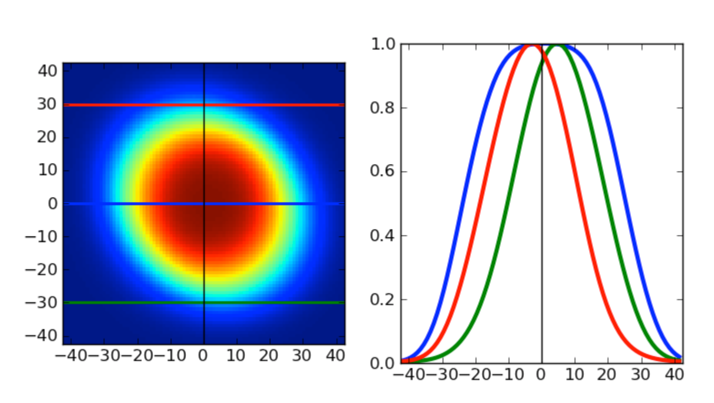
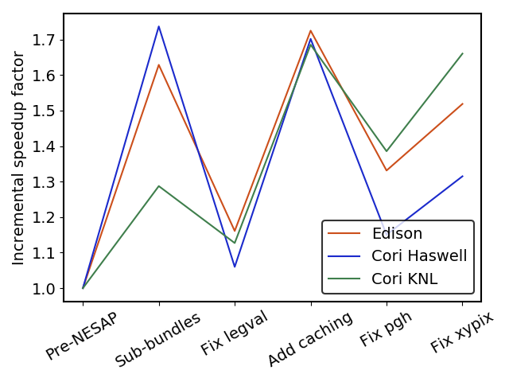

:author: Laurie A. Stephey
:email: lastephey@lbl.gov
:institution: NERSC
:corresponding:

:author: Rollin C. Thomas
:email: rcthomas@lbl.gov
:institution: NERSC

:author: Stephen J. Bailey
:email: stephenbailey@lbl.gov
:institution: LBL
:bibliography: scipy_bib

-----------------------------------------------------------------------------
Optimizing Python-Based Spectroscopic Data Processing on NERSC Supercomputers
-----------------------------------------------------------------------------

.. class:: abstract

   We present a case study of optimizing a python-based cosmology data processing
   pipeline designed to run in parallel on thousands of cores using supercomputers
   at the National Energy Research Scientific Computing Center (NERSC).

   The goal of the Dark Energy Spectroscopic Instrument (DESI) experiment is to
   better understand dark energy by making the most detailed 3D map of the
   universe to date. The images (many spectra on a CCD) obtained nightly over a
   period of 5 years starting this year (2019) will be sent to the NERSC Cori
   supercomputer for processing and scientific analysis.

   The DESI spectroscopic pipeline for processing these data is written almost
   exclusively in Python. Writing in Python allows the DESI scientists to write
   very readable scientific code in a relatively short amount of time, which is
   important due to limited DESI developer resources. However, the drawback is
   that Python can be substantially slower than more traditional high performance
   computing languages like C and Fortran.

   The goal of this work is to increase the efficiency of the DESI
   spectroscopic data processing at NERSC while satisfying their requirement that
   the software remain in Python. Within this space we have obtained throughput
   improvements of over 5x and 6x on the Cori Haswell and KNL partitions,
   respectively. Several profiling techniques were used to determine potential
   areas for improvement including Python's cProfile, line_profiler, Intel Vtune,
   and Tau. Once we identified expensive kernels, we used the following
   techniques: 1) JIT-compiling hotspots using Numba (the most successful strategy
   so far) and 2) re-structuring the code to compute and store important data
   rather than repeatedly calling expensive functions. We have considered Dask as
   a more flexible and robust alternative to MPI for parallelism in the DESI
   extraction code, but have found that once a code has been designed with MPI in
   mind, it is non-trivial to transition to another kind of parallelism. We will
   also explore the requirements for transitioning the DESI image processing to
   GPUs (coming in the next NERSC system in 2020).

.. class:: keywords

   numpy, scipy, numba, compiling, spectroscopy, hpc

Introduction
------------

Though dark energy is estimated to comprise over 70 percent of our universe, it
is not currently well-understood (stephen which papers should i cite for
this?). Many experiments are seeking to uncover more information about the
nature of dark energy; once such experiment is DESI (the Dark Energy
Spectroscopic Instrument) :cite:`noauthor_dark_nodate`. The goal of the DESI
experiment is, over 5 years, to map 30 million galaxies and use
spectroscopically obtained redshift data to obtain their distances. This
information will allow create the most detailed 3D map of the universe to be
constructed. It is hoped that this 3D map will help support or rule out some of
the current theories of dark energy. An image of the Mayall telescope, in Kitt
Peak, Arizona, where the DESI instrument is installed, is shown in Figure
:ref:`kittpeak`

.. figure:: figures/desi_kitt_peak.png

   A photograph of the Mayall telescope (large dome in the center of the
   image), where the DESI instrument has been installed, in Kitt Peak, Arizona.
   :label:`kittpeak`

In late 2019 DESI will begin sending batches of CCD images nightly to NERSC for
data processing. The CCD images contain many spectra; one for each object at
which the fiber was pointed. Through the DESI extraction pipeline, the
redshifts of many objects like galaxies and quasars will be determined,
ultimately yielding the information to construct the 3D map.

Five years worth of image processing on a shared supercomputer should be as
efficient as possible, both for the sake of the DESI project but also the many
other users who share the NERSC systems. Through a collaborative effort between
the NERSC NESAP program :cite:`ronaghi_python_2017` and DESI, NESAP was tasked
with improving the efficiency of the DESI code without rewriting the code in
another language like C. An image of the Mayall telescope, in Kitt Peak,
Arizona, where the DESI instrument is installed, is shown in Figure
:ref:`kittpeak`.

DESI has a large and complex image processing pipeline to transform raw images
from the CCD into meaningful scientific results. This study focuses on only a
small portion of this pipeline: that part that obtains the spectral extraction.
The spectral extraction is performed in two dimensions using a technique
known as "spectroperfectionism" :cite:`bolton_spectro-perfectionism:_2010`. The
DESI spectral extraction code performs a variety of eigenvalue decomposition,
evaluating special functions, and all the necessary bookkeeping required to
manage the spectral data in each exposure (30 frames, which total about 6GB).

   A cartoon that demonstrates the spectroperfectionism technique that is used
   in the DESI spectral extraction code. Since the point spread functions are
   often 2D in nature, a full 2-D fitting is required to accurately capture their
   shape. Image courtesy of S. J. Bailey. :label:`spectroperfectionism`

The purpose of this paper is to provide a case study that describes how a
Python image processing pipeline was optimized for increased throughput of 5-7x
on a high-performance system.  The workflow of using profiling tools to find
candidate kernels for optimization and the techniques for speeding up these
kernels will be described. The most successful method used to obtain speedup
was just-in-time compiling using Numba; several successful examples will be
provided.  Parallelization strategies using MPI and Dask will be compared, and
preliminary considerations for moving the code to GPUs will be discussed.

Profiling the code to find problem spots
----------------------------------------

Our first step in this study was to use profiling tools to take data on the
code to determine places where it was worthwhile to spend our time. We made
heavy use of tools designed especially for Python. In general our process was
to start with the simplest tools and then, when we knew what we were looking
for, use the more complex tools.

cProfile
~~~~~~~~

.. figure:: figures/cpu_2.png
   :align: center
   :scale: 20%
   :figclass: wt

   This is an example image created from data collected using cProfile and
   visualized using gprof2dot. This profile was obtained from an early stage in
   the DESI python optimization effort. :label:`gprof2dot`

Python's built-in cProfile :cite:`noauthor_26.3._nodate` was the first tool we
used for collecting profiling data. We found cProfile simple and quick to use
because it didn't require any additions or changes to the code. cProfile can
write data to a human-readable file, but we found that using either Snakeviz
:cite:`noauthor_snakeviz_nodate` or gprof2dot :cite:`fonseca_converts_2019` to
visualize the profiling data was substantially more clear and useful.  An
example of data collected using cProfile and visualized with gprof2dot is shown
in Figure :ref:`gprof2dot`.

Examining the visualized cProfile data allowed us to identify expensive kernels
in the DESI calculation. In Figure :ref:`gprof2dot`, the functions are
color-coded according to how much total time is spent in each of them. In this
example, the function "traceset" accounts for approximately 37 percent of the
total runtime and was a good candidate for optimization efforts.

line_profiler
~~~~~~~~~~~~~

Information like that shown in Figure :ref:`gprof2dot` is somewhat incomplete
in that it can only provide detail at the function level. From these data alone
it was difficult to know what in the function "traceset" was so time-consuming.
At this point we switched to line_profiler :cite:`kern_line-by-line_2019`, a
tool which provides line-by-line profiling information for a Python function.
One difference major between line_profiler and cProfile is that line_profiler
requires the user to manually decorate functions that he or she wishes to
profile.

This requires the user to have some knowledge of which functions are expected to
be time-consuming, so for this reason we recommend starting with cProfile and
then moving to line_profiler once the user has identified a few key functions
of interest. Once decorated, line_profiler provides a great deal of information
for each line of the function, including how many times each line was invoked
and the total amount of time spent on each line. An example of line_profiler
output for the function "xypix" is shown in Figure :ref:`lineprofiler`.  This
information was vital to our optimization efforts because it could point to
functions that were particularly expensive, such as numpy's legval or scipy's
erf. Once we had this information, we could make decisions about how to try to
reduce the time spent in these functions, either by speeding up the functions
themselves through JIT-compiling, or by restructuring the code to avoid calling
these expensive functions as often. We will describe both approaches in the
sections that follow.

.. figure:: figures/line_profiler_xypix.png

   Here is a sample output window from line_profiler for the function "xypix".
   :label:`lineprofiler`

Vtune and Tau
~~~~~~~~~~~~~

Using a combination of cProfile and line_profiler were sufficient for almost
all of the performance optimization work that we performed during the course of
this work. However, because the DESI extraction code is an MPI code, these
profilers do have some limitations.  Both of these tools can be used to collect
data for each MPI rank, but visualizing and using the information in a
meaningful way is challenging, especially when there are 68 outputs from a KNL
core, for example.

In the situation where we began to care about what all the MPI were doing and
whether they were being appropriately utilized and load-balanced, we needed
more powerful profiling tools like Intel Vtune :cite:`admin_python*_nodate` and
Tau :cite:`noauthor_tau_nodate`.  Because only a subset of the Vtune
capabilities are available for Python codes, we ultimately found the Tau
profiler more useful and well-suited for our application.  Tau provided clear
information about how each MPI rank was occupied and how each rank compared to
the others. A sample Tau output window is shown in Figure :ref:`tau`. These
profiling data were obtained before the DESI frame was parallelized over
subbundles, leaving 12 of the 32 Haswell ranks unoccupied. It is clear from
this Tau visualization that we were not making good use of processor resources.

.. figure:: figures/tau_main.png

   A sample Tau profiling output for the DESI spectral extraction code on a
   Haswell processor (which has 32 ranks). It is clear from this output that only
   20 of the ranks are being utilized. This motivated the re-structure to allow
   parallelization of subbundles, rather than bundles, which could more flexibly
   utilize the whole processor's resources. :label:`tau`

Optimization strategies
-----------------------

We have employed two overarching strategies to make the DESI spectral extraction
code run faster. The first has been to make the expensive functions we identified
through profiling themselves faster through just-in-time (JIT) compiling. The
second has been to restructure the code in ways that mitigate the impact
of these expensive functions. We will discuss both of these strategies in greater
detail in the two sections that follow.

Just-in-time (JIT) compilation with Numba
------------------------------------------

The other major approach to achieve speedups in this work has been to
focus on making expensive functions run more quickly. To achieve this,
we have used Numba :cite:`lam_numba:_2015` is a just-in-time compiler for Python.

We used Numba on three functions that, through profiling, we identified as
expensive. These functions were 1) numpy.polynomial.legendre.legval, 2)
scipy.special.erf, and 3) scipy.special.hermitenorm. Henceforth we will refer
to these functions as legval, erf, and hermitenorm.

legval was perhaps the most straightforward of these three to JIT compile.
Unlike Python, Numba will note tolerate type inference. The types and sizes
of all variables must be known prior to compile time. This required several
small changes to the legval algorithm to put it in the form required by Numba.
Several other lines of the function that performed type checking were removed.
The onus is therefore on the user to make sure the correct types are supplied.
The original and modified legval functions are shown in Figure :ref:`legval`.

.. figure:: figures/legval_old_vs_new.png
   :align: center
   :scale: 50%
   :figclass: wt

   (A) The official numpy.polynomial.legendre.legval function. Profiling data
   indicated that this was an expensive function. To conserve space the docstring
   has been removed. (B) Our modified legval function that was much faster than
   its original numpy counterpart. Note the removal of the type checking and the
   addition of the np.ones array to instruct Numba about the sizes of each array
   (and prevent them from changing during every iteration.) :label:`legval`

The two scipy functions were also somewhat challenging to implement in Numba.
At the time of this writing, Numba does not yet support directly compiling
scipy functions.  This meant that we needed to extract the core part of these
scipy functions and mold them into a form that Numba will accept. For scipy
erf, this meant translating the Fortran source code into Python. For scipy
hermitenorm which was fortunately already in Python, algorithmic changes
similar to those we made in legval were necessary to remove all type inference
and prevent variables/arrays from changing size.  The overall speedup that
resulted from JIT compiling numpy legval was approximately 10 percent, the
speedup from JIT compiling scipy erf was approximately 30 percent, and the
speedup from JIT compiling scipy hermitenorm was approximately 40 percent.

Restructuring the code
----------------------

Implement subbundles
~~~~~~~~~~~~~~~~~~~~

Through a collaboration with Intel, the team attended a (or several?) "dungeon
sessions" at Intel in 2017 where experts helped to study the code and recommended
changes to improve performance. One recommendation made at this dungeon session
was to reduce the number of fibers processed from bundles (25 fibers at a time)
into subbundles of 6 fibers at a time. These smaller matrix sizes resulted in
faster matrix operations such as multiplication and transposes. Fit better in
cache? Why did this help? probably i could profile this with vtune, although
i don't really want to...

Add cached legval values
~~~~~~~~~~~~~~~~~~~~~~~~

The problem with legval wasn't just that it was an expensive function; rather,
it was also contributing to a large fraction of the total runtime because it
was called millions of times for each CCD image in the DESI spectral extraction
calculation. Worse, legval was called with scalar values even though it was
able to handle vector inputs. For this reason the Intel engineers at the
dungeon session recommended a major code restructuring to call legval fewer
times with vector arguments. (or maybe that was just rollin and stephen,
correct me if i'm wrong)

This restructuring required us to modify several major functions and redefine
some of the bookkeeping that keeps track of which data corresponds to which
part of the image on the CCD. The goal was to call legval 60 times for each
frame instead of 1.5 million. For each image patch (of 60 total), legval was
called with 25,000 values (instead of the previous single value), and these
calculated values were stored as key-value pairs in a dictionary. We then
modified the part of the code that previously calculated legval to instead look
up the required values stored in the dictionary.  This change was by far the
most cumbersome that we made, but it also resulted in the greatest incremental
speedup of this project thus far: 1.7x faster.

Parallelize over bundles instead of subbundles
~~~~~~~~~~~~~~~~~~~~~~~~~~~~~~~~~~~~~~~~~~~~~~

The current DESI MPI framework is to split the original communicator into n
bundle communicators where n is the number of processors per chip. This is
inefficient on a single processor because 20 bundles only use a fraction of the
available processors on either a Haswell or KNL. To process additional frames
(and additional multiples of 20 bundles), a specific number of nodes must be
carefully chosen to fill the processors as much as possible. This means to
process a full exposure of 30 frames (600 bundles), 19 Haswell nodes and 9 KNL
nodes are required to efficiently use the processors.

show subbundle scan that shows we can get away with this
make nice subbundle scan plot

In this case, the goal was to restructure the code to
divide the spectral extraction into smaller, more flexible pieces. This would
relax the previous requirement that each frame be divided into 20 bundles,
which is an awkward number for NERSC hardware (Haswell has 32 processors and
KNL has 68 processors). Furthermore, it meant that only certain numbers of
nodes could be chosen to efficiently process an exposure (30 frames). For
example, on Haswell, this number is 19 (ceil 600/32), and on KNL, this number
is 9 (ceil 600/68).

Dividing the workload into subbundles (smaller bundles) means that about 500
spectra are now more evenly doled out to 32 processors (about 16 spectra each)
or 68 processors (about 7 spectra each). The comm.world communicator
orchestrates all 30 frames within a single exposure, and the frame level
communicator orchestrates the subbundle processing within the frame.
Implementing this change was nontrivial but the speedup and flexibility gains
made it worthwhile to the DESI team. Using all processors more efficiently 
resulted in a per-frame speedup for both Haswell and KNL. For Haswell, 
the previous runtime was approximately 2 minutes and is now about 1 minute
and 15 seconds, which is almost exactly consistent with using all 32 Haswel
l cores as compared to the previous 20 (a factor of 1.6 improvement). 
For KNL, the previous
runtime was approximately 9 minutes and it is now 4 minutes, again roughly
consistent with increasing the number of processors from 20 to 68 but with
somewhat more overhead than for Haswell. 

need to actually run a desi exposure with subbundle division
how fast?

show tau plots before and after that show we are now using the full number of
cores

need to actually tau profile the new code

Optimization results
--------------------

Several speedup metrics were of interest to DESI. The first speedup metric
on which we focused what the time it took to process a single frame. We tracked
this processing time over the course of our optimization effort. The runtime
of the frame processing is plotted against our various efforts.

Table 1 summarizes these efforts in the order in which they were performed.
It also categorizes them by type (either JIT compile or restructure). The speedups
that were obtained from each optimzation are plotted in Figures :ref:`singlenode`,
:ref:`incremental`, and :ref:`framespernodehour`.

.. raw:: latex

   \begin{table}

     \begin{longtable}{|c|c|}
     \hline
     \textbf{Optimization}  & \textbf{Type}\tabularnewline
     \hline
     Add subbundles & Restructure\tabularnewline
     \hline
     Fix legval & JIT compile\tabularnewline
     \hline
     Add caching & Restructure\tabularnewline
     \hline
     Fix pgh & JIT compile\tabularnewline
     \hline
     Fix xypix & JIT compile\tabularnewline
     \hline
     Divide by subbundles & Restructure\tabularnewline
     \hline
     \end{longtable}

     \caption{Optimization efforts performed in this study.}

   \end{table}

Perhaps the most straightforward benchmark is one in which raw speed is
measured. In this case, it is the time to complete the processing of a single
DESI frame on Edison, Cori Haswell, and Cori KNL. Over the course of this work
the runtime for a single frame was decreased from 4000 s to 240 s for KNL and
from ? to 75 seconds for Haswell. However, DESI will need to process many
frames at a time, so a single frame isn't a very representative test of how
much their processing capabilities have improved.  Figure :ref:`singlenode`
shows how the processing time per frame on a single node was affected by each
change we made to the code. This figure shows that the first few changes we
made had the largest overall effect: the later optimizations exhibited some
diminishing returns as we continued to implement them. One major goal of the
NERSC NESAP program was to reduce the DESI runtime on KNL to below the original
NERSC Edison benchmark, which is indicated by the red dotted line. Once we
implemented our xypix fix, we achieved this goal.

.. figure:: figures/single_node_benchmark.png

   have to play with it. :label:`singlenode`

A more meaningful benchmark for DESI is the number of frames they can process
during a given amount of time using a given number of nodes.  We call this
metric "frames per node hour", which encapsulates the number of frames that can
be processed per node per hour.  We performed these frames per node hour
benchmarks with a full exposure (30 frames) instead of a single frame on either
19 or 9 nodes for Haswell and KNL, respectively. Though a single exposure is
still a relatively small test because DESI expects to collect 50 or more
exposures per night (is this right stephen?) it much more closely approaches
the real DESI workload than the single exposure.  One feature encoded in this
benchmark which is not captured in the speed benchmark is the increasingly
important role that MPI overhead begins to play in multi-node jobs, which is a
real factor the DESI will have to contend with during its large processing
runs. 

.. figure:: figures/frames_per_node_hour.png

   This figure shows the improvement over the course of this study in the DESI 
   spectral extraction throughput. :label:`framespernodehour`

The frames per node hour results are plotted in Figure :ref:`framespernodehour`. 
While the increases
in throughput we have obtained are more modest than the raw speedup,
we emphasize these values because they are a more accurate representation of the
actual improvements in DESI's processing capability. 

   This plot compares the incremental speedups obtained by the various
   optimizations that were implemented in this study. :label:`incremental`

Finally, we have have one additional metric which is perhaps more generally applicable. 
We have examined the incremental improvements in speedup
for each of the optimizations we implemented. This plot gives us some insight
into which types of optimizations were more and less effective. These results
are shown in Figure :ref:`incremental`. It is clear from this plot that though
our JIT compiled functions were relatively painless, they were also not as
valuable in terms of speedup. Conversely, our more painful restructuring optimizations
were in fact very valuable in terms of speedup. The takeaway from this plot might
be that if a developer has enough time, the larger, more complex restructuring
optimizations may be extremely worthwhile. The flip side is that if the developer
has limited time, small fixes like JIT compiling can still provide reasonable gains
without a major time investment. 

   
Dask considerations
-------------------

A few problems with the current MPI implementation of the DESI spectral
extraction code prompted us to take a step back and consider if perhaps Dask
:cite:`noauthor_dask:_nodate` would be a better solution for paralellization
within DESI. The first was the relative inflexibility of the division of work
between bundles (although this has been addressed now in the subbundle
division). The second was the issue of resiliency: if a node goes down, it will
take the entire MPI job with it. (This is not an issue in Dask, in which dead
workers can be revived and the calculation can continue.) An additional feature
we liked about Dask is the ability to monitor Dask jobs in real time with their
Bokeh status page. We thought Dask seemed promising enough that it was worth
taking a careful look at what it would mean to replace the DESI MPI with Dask.

Dask is a task-based parallelization system for Python. It is comprised
of a scheduler and some number of workers which communicate with each
other via a client. Dask is more flexible than traditional MPI because
it can start workers and collect their results via a concurrent
futures API. (It should be noted that this is also possible in MPI with
dynamic process management, but we haven't tried this yet. is it even
officially supported? Rollin what should I say here?)

What we discovered during this process is that it is non-trivial to convert a
code already written in MPI to Dask, and it would likely be difficult to
convert from Dask to MPI as well. (It would likely be easier to convert from
dynamic process management MPI to Dask, but the DESI spectral extraction code
is not written with this API.) One major difference between MPI and Dask is at
what point the decision of how to divide the problem must be made. In MPI since
all ranks are generally passing over the code, dividing the data and performing
some operation on it in parallel can be done on the fly. In Dask, however, the
scheduler needs to know which work to assign to workers. This means that the
work must already be divided in sensible way. To say it in a different way: in
Dask it must be done in advance, whereas in MPI it can be done at any time.
Collecting the information required for Dask-style parallelism in advance would
have required a substantial re-structuring on the order of what was performed
for legval, if not more intrusive. At this point we decided that if the DESI
code had been written from the start with Dask-type parellelism in mind it
would have been a good choice, but converting existing MPI code into Dask was
unfortunately not a reasonable solution for us.

Thinking about the future: GPUs
-------------------------------

Because HPC systems are becoming increasingly heterogeneous, it is important to
consider how the DESI code will run on future architectures. The next NERSC
system Perlmutter "cite:`noauthor_perlmutter_nodate` will include a CPU and GPU
partition that will provide a large fraction of the system's overall FLOPS, so
it is pertinent to examine if and how the DESI code could take advantage of
these accelerated nodes.

Since GPUs are fundamentally different than CPUs, it may be necessary to
rethink much of the way in which the DESI spectral extraction is performed. At
the moment, each CCD frame is divided into 60 patches, and each of those 60
patches is divided into 6 smaller subbundles. Though this division of a larger
frame into smaller pieces makes sense for CPU architectures, it doesn't make
sense for GPU architectures. In fact for GPUs often the opposite is true: the
programmer should give the GPU as much work as possible to keep it occupied.
This means that to help the DESI extraction code run efficiently on GPUs it
will likely require a major restructuring to better adapt the problem for the
capabilities of the hardware.

Preliminary testing is underway to give some indication of what we might expect
from a major overhaul. From profiling information we expect that the
scipy.linalg.eigh function will constitute a major part of the workload as
matrix sizes increase.

idea: test eigh solve for several sizes of matrices on cpu vs gpu
see how the gpu is able to handle this with cupy
gives us some idea if refactoring in this way for gpu is advantageous

get some testing done before we submit the paper...

Conclusions and Future Work
---------------------------

Over the course of this work, we have achieved our goal of speeding up the DESI
spectral extraction code on NERSC Cori Haswell and KNL processors.  Our
strategy was as follows: we employed profiling tools, starting with the most
simple tools and progressing as necessary to more complex tools, to get an idea
of which kernels are most expensive and what types of structural changes could
help improve runtime and flexibility. We used Numba to JIT compile several
expensive functions. This was a relatively quick way to obtain some speedup
without changing many lines of code. We also made larger structural changes to
avoid calling expensive functions and also to increase the flexibility and
efficiency of the parallelism. In general these larger structural changes were
more complex to implement, as well as more time consuming, but also resulted
in the biggest payoff in terms of speedup. We considered changing the
parallelism strategy from MPI to Dask, but ultimately found that changing an
existing code is non-trivial due to the fundamentally different strategies of
dividing the workload, and decided to continue using MPI. Finally, we are now
investigating how the DESI code could run effectively on GPUs since the next
NERSC system will include a large CPU and GPU partition. Exploratory studies on
how the DESI code can be optimized for this new architecture are being
performed now and will continue as future work.

Acknowledgments
---------------

The authors thank their partners at Intel, the Intel Python Team, Intel tools
developers, performance engineers, and their management. This work used
resources of the National Energy Research Scientific Computing Center, a DOE
Office of Science User Facility supported by the Office of Science of the U.S.
Department of Energy under Contract No. DE-AC02-05CH11231. Additionally, this
research is supported by the Director, Office of Science, Office of High Energy
Physics of the U.S. Department of Energy under Contract No.  DE–AC02–05CH1123,
and by the National Energy Research Scientific Computing Center, a DOE Office
of Science User Facility under the same contract; additional support for DESI
is provided by the U.S. National Science Foundation, Division of Astronomical
Sciences under Contract No.  AST-0950945 to the National Optical Astronomy
Observatory; the Science and Technologies Facilities Council of the United
Kingdom; the Gordon and Betty Moore Foundation; the Heising-Simons Foundation;
the National Council of Science and Technology of Mexico, and by the DESI
Member Institutions.  The authors are honored to be permitted to conduct
astronomical research on Iolkam Du’ag (Kitt Peak), a mountain with particular
significance to the Tohono O’odham Nation.  

