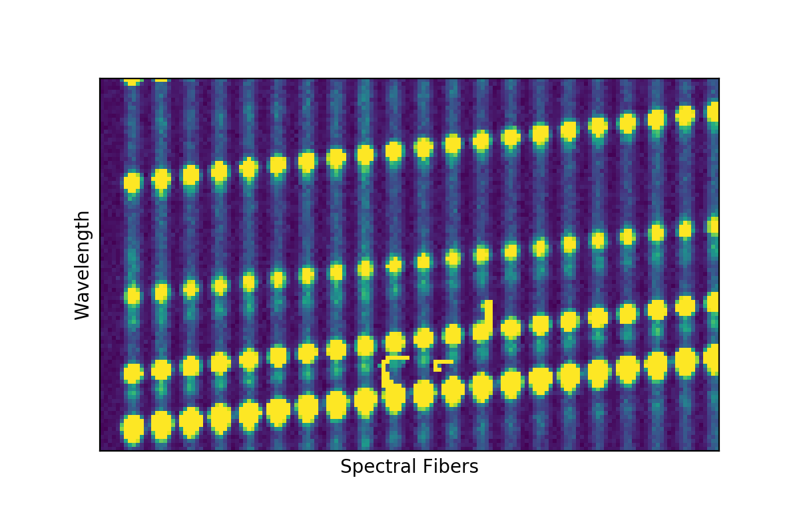
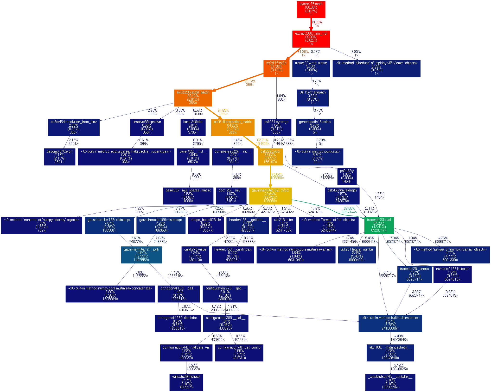
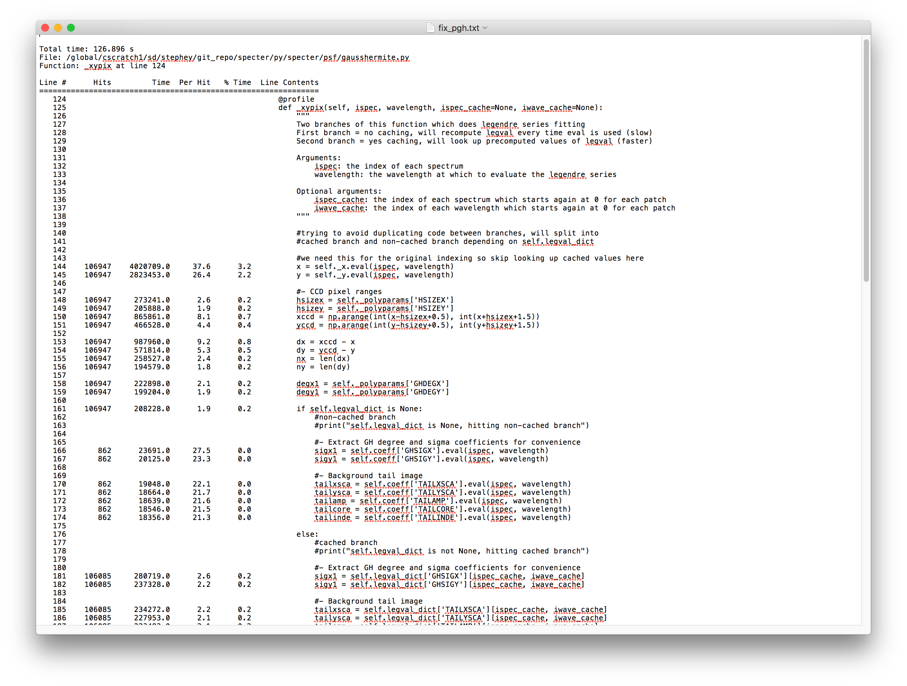
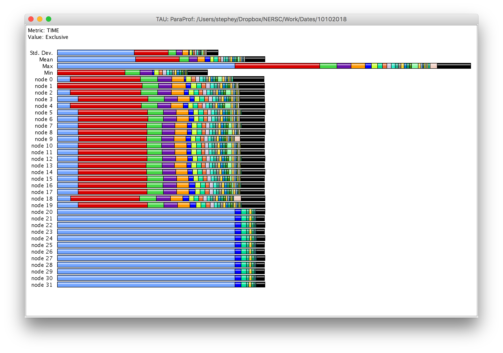
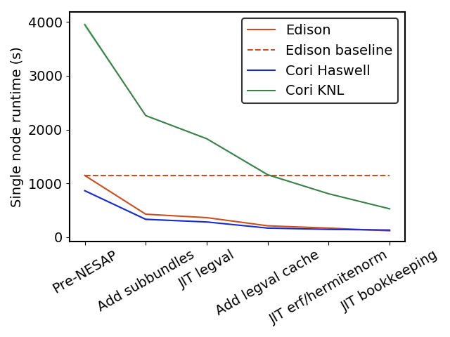
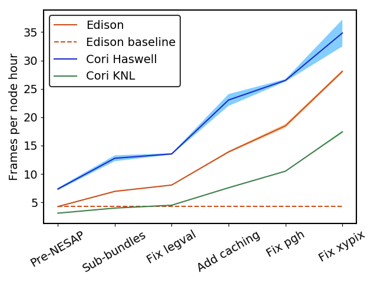
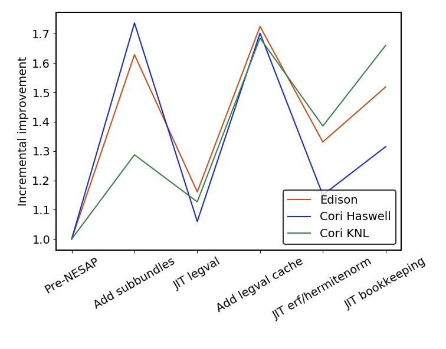
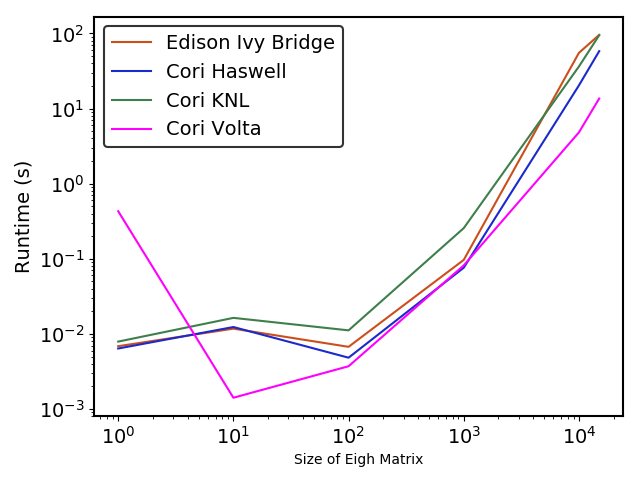

:author: Laurie A. Stephey
:email: lastephey@lbl.gov
:institution: NERSC
:corresponding:

:author: Rollin C. Thomas
:email: rcthomas@lbl.gov
:institution: NERSC

:author: Stephen J. Bailey
:email: stephenbailey@lbl.gov
:institution: LBL
:bibliography: scipybib

-----------------------------------------------------------------------------
Optimizing Python-Based Spectroscopic Data Processing on NERSC Supercomputers
-----------------------------------------------------------------------------

.. class:: abstract

   We present a case study of optimizing a Python-based cosmology data processing
   pipeline designed to run in parallel on thousands of cores using supercomputers
   at the National Energy Research Scientific Computing Center (NERSC).

   The goal of the Dark Energy Spectroscopic Instrument (DESI) experiment is to
   better understand dark energy by making the most detailed 3D map of the
   universe to date. Over a five-year period starting this year (2019), around 
   1000 CCD frames per night (30 per exposure) will be read out from the 
   instrument and transferred to NERSC for processing and analysis on the Cori and 
   Perlmutter supercomputers in near-real time. This fast turnaround helps DESI 
   monitor survey progress and update the next night's observing schedule.

   The DESI spectroscopic pipeline for processing these data is written almost
   exclusively in Python. Using Python allows DESI scientists to write
   very readable and maintainable scientific code in a relatively short amount of 
   time, which is important due to limited DESI developer resources. However, the 
   drawback is that Python can be substantially slower than more traditional high 
   performance computing languages like C, C++, and Fortran.

   The goal of this work is to improve the performance of DESI's
   spectroscopic data processing pipeline at NERSC while satisfying their productivity requirement that
   the software remain in Python. Within this space we have obtained specific (per node-hour) throughput
   improvements of over 5x and 6x on the Cori Haswell and Knights Landing partitions,
   respectively. Several profiling techniques were used to determine potential
   areas for improvement including Python's cProfile and line_profiler packages, 
   and other tools like Intel VTune and Tau. Once we identified expensive kernels, 
   we used the following techniques: 1) JIT-compiling hotspots using Numba
   and 2) restructuring the code to lessen the impact of calling expensive functions.
   Additionally, we seriously considered substituting MPI parallelism for Dask, a more 
   flexible and robust alternative, but have found that once a code has been designed 
   with MPI in mind, it is non-trivial to transition it to another kind of parallelism. 
   We will also show initial considerations for transitioning DESI spectroscopic 
   extraction to GPUs (coming in the next NERSC system, Perlmutter, in 2020).

.. class:: keywords

   NumPy, SciPy, Numba, JIT compile, spectroscopy, HPC, MPI, Dask

Introduction
------------

DESI is the Dark Energy Spectroscopic Instrument :cite:`noauthor_dark_nodate`.
Though dark energy is estimated to comprise over 70 percent of our universe, it
is not currently well-understood
:cite:`peebles_cosmological_2003,mortonson_dark_2013`.  Many experiments,
including DESI, are seeking to uncover more information about the nature of
dark energy. The goal of the DESI experiment is, over 5 years, to map 30
million galaxies and use spectroscopically obtained redshift data to measure
their distances. The statistical properties of this 3D galaxy map
will help shed light on the physical nature of dark energy and its role in
the evolution of the universe. An image of the Mayall
telescope, on Kitt Peak, Arizona, where the DESI instrument is installed, is
shown in Figure :ref:`kittpeak`.

.. figure:: figures/desi_kitt_peak.png
   :scale: 17%

   A photograph of the Mayall telescope (large dome in the center of the
   image), where the DESI instrument has been installed, on Kitt Peak, Arizona.
   :label:`kittpeak`

In fall 2019 DESI will begin sending batches of CCD images nightly to the
National Energy Research Scientific Computing Center (NERSC) for data processing.
Each exposure contains the data from 5000 galaxies, quasars,
stars, and reference calibrators, routed by fiber optic cables from the
telescope to 10 spectrographs with 3 CCDs (red, blue, and infrared) and 500
spectra each. This means that each exposure contains 30 individual images (with
each exposure totaling about 6 GB). DESI expects to collect over 30 exposures
in a typical night, resulting in over 1000 images.

A small subset of example data are shown in Figure :ref:`exampledata` with 21
spectra distributed horizontally and different wavelengths of light dispersed
vertically. This image represents less than one millionth of the DESI data
obtained per night. Most spectra look the same since all fibers see the same
night sky. The slight excess in the middle of the leftmost fiber is the signal
from a distant galaxy. Even though this is faint compared to the sky
background, this example is in the brightest 15% of galaxies that DESI will
observe.

   Example DESI data showing spectra from 21 of the 5000 fibers distributed
   horizontally, with wavelengths dispersed vertically. Most spectra look the
   same since they all see the same sky background light. The slight excess
   of light in the middle of the leftmost spectrum is the signal from a distant
   galaxy.
   :label:`exampledata`

Compared to prior galaxy redshift surveys, DESI will observe fainter, more
distant objects at lower signal-to-noise, necessitating more sophisticated
algorithms to optimally extract the signal from the data. This requires a full
2D modeling of the data, fitting multiple spectra and wavelengths
simultaneously using the "spectroperfectionism" algorithm
:cite:`bolton_spectro-perfectionism:_2010`, which is only computationally
feasible due to a divide-and-conquer technique. This case study focuses on this
spectral extraction part of the data processing pipeline since it is the
algorithmically most expensive step; it includes eigenvalue decomposition,
special function evaluation, and all the necessary bookkeeping required to
manage the spectral data in each exposure.

The overarching goal of this work is to speed up the DESI experiment's Python
spectroscopic data processing pipeline on the Cori supercomputer's KNL
partition at NERSC.  NERSC :cite:`noauthor_national_nodate` is the largest
Department of Energy computing facility in terms of number of users (7000) and
scientific output :cite:`noauthor_publications_nodate`. Cori is NERSC's current
flagship supercomputer, a Cray XC40 with a theoretical peak performance of 28
PF, comprised of approximately 20 percent Intel Haswell nodes and 80 percent
manycore Intel Knights Landing (KNL) nodes.

Achieving good performance with the manycore KNL nodes has proven difficult for
many science teams. Because the Haswell nodes are "easier" to use (i.e.
applications often run faster on them out of the box), they are increasingly crowded.
For this reason NERSC established a program called NESAP (NERSC Exascale
Science Applications Program, :cite:`noauthor_nesap_nodate`) to help science
teams transition successfully to the KNL nodes. NESAP provides
technical expertise from NERSC staff and vendors like Intel and Cray to science
teams to improve the performance of their application on the Cori KNL partition
and prepare for the manycore future of high-performance computing (HPC).
NESAP's goal is to help move a large fraction of the NERSC workload from the
Haswell to the KNL partition; this will ease queue wait times and help increase
job throughput for all users.

Achieving optimal Python performance on KNL is especially challenging due its
slower clock speed and difficulty taking advantage of the KNL AVX-512 vector
units (which is not possible in native Python). A more detailed discussion of
the difficulties of extracting Python performance on KNL can be found in
:cite:`ronaghi_python_2017`. This case study is borne out of DESI's
participation in the NERSC NESAP program.

Despite these difficulties, DESI requested that their code should not be
re-written in another language like C due to their own limited developer
resources. They did consider both Cython :cite:`noauthor_cython:_nodate` and
Numba :cite:`noauthor_numba:_nodate` as options for improving performance, but
after some initial testing they found that both delivered approximately
equivalent speedups for their specific test cases. Citing Numba's ease of use,
automatic compilation, and ability to gracefully fall back to non-compiled
code, they requested that NESAP proceed with Numba-based optimizations where
necessary.

In what follows we will present a case study that describes how a Python image
processing pipeline was optimized *without rewriting the code in another
language like C* for increased throughput of 5-7x on a high-performance system.
We will describe our workflow of using profiling tools to find candidate
kernels for optimization and we will describe how we used just in time compiling
to speed up these kernels. We will also describe our efforts to restructure the
code to minimize the impact of calling expensive kernels. We will compare
parallelization strategies using MPI and Dask, and finally, we will discuss a
preliminary study for moving the DESI code to GPUs.

Profiling the Code
------------------

Our first step in this study was to use profiling tools to determine places in
the DESI code where it was worthwhile to target our optimization efforts. We
made heavy use of tools designed especially for Python. In general our process
was to start with the simplest tools and then, when we knew what we were
looking for, use the more complex tools.

We should note that we profiled the DESI code on both Cori Haswell and KNL
nodes. There were some minor differences in the relative time spent in each
kernel between the two architectures, but overall the same patterns were
present on both Haswell and KNL.

cProfile
~~~~~~~~

   This is an example image created from data collected using cProfile and
   visualized using gprof2dot :cite:`fonseca_converts_2019`.
   This profile was obtained from an early stage in
   the NESAP optimization effort. :label:`gprof2dot`

Python's built-in cProfile package :cite:`noauthor_26.3._nodate` was the first tool we
used for collecting profiling data. We found cProfile simple and quick to use
because it didn't require any additions or changes to the DESI code. cProfile
can write data to a human-readable file, but we found that using either
Snakeviz :cite:`noauthor_snakeviz_nodate` or gprof2dot
:cite:`fonseca_converts_2019` to visualize the profiling data was substantially
more clear and useful.

An example of data collected using cProfile and visualized with gprof2dot is
shown in Figure :ref:`gprof2dot`. We prefer gprof2dot to Snakeviz
visualizations because they are static images instead of browser-based. This
makes them easier to store, share, quickly view, and embed in papers and talks.
If you prefer accessing the cProfile data interactively, and clicking on a
function to see all of its children, for example, Snakeviz can provide this
functionality. However, we found the several extra steps required to use
Snakeviz, and the difficulty storing and sharing the visualizations, made it
less appealing than gprof2dot.

Examining the visualized cProfile data allowed us to identify expensive kernels
in the DESI calculation. In Figure :ref:`gprof2dot`, the functions are
color-coded according to how much total time is spent in each of them. In this
example, the function :code:`traceset` accounts for approximately 37 percent of the
total runtime and was a good candidate for optimization efforts.

Information like that shown in Figure :ref:`gprof2dot` is nevertheless
incomplete in that it can only provide detail at the function level. From
these data alone it was difficult to know what specifically in the function
"traceset" was so time-consuming. Once we had a list of expensive kernels from
our cProfile/gprof2dot analysis, we started using the line_profiler tool.

line_profiler
~~~~~~~~~~~~~

line_profiler :cite:`kern_line-by-line_2019` is an extremely useful tool which
provides line-by-line profiling information for a Python function. However,
this more detailed information comes at a cost: the user must manually decorate
functions that he or she wishes to profile. For a small code this exercise
might be trivial, but for the many thousand line DESI code 1) hand-decorating
every function would have been extremely time-consuming and 2) searching
through the line_profiler output data to find expensive functions would have
also been cumbersome and potentially error-prone. For this reason we recommend
starting with cProfile and then moving to line_profiler once the user has
identified a few key functions of interest.

Once decorated, line_profiler provides a great deal of information for each
line of the function, including how many times each line was invoked and the
total amount of time spent on each line. An example of line_profiler output for
the function :code:`xypix` is shown in Figure :ref:`lineprofiler`. This information
was vital to our optimization efforts because it could point to functions that
were particularly expensive, such as numpy's :code:`legval` or scipy's :code:`erf`. Once we had
this information, we could make decisions about how to reduce the time spent in
these functions, either by speeding up the functions themselves through JIT
compiling, or by restructuring the code to make the functions either less
expensive or avoid calling them as often. We will describe these approaches in
the sections that follow.

Together, cProfile and line_profiler were sufficient for almost all of the
performance optimization work in this case study. However,
because the DESI extraction code is an MPI code, these profiling tools do have
some limitations. Both of these tools can be used to collect data for each MPI
rank, but visualizing and using the information in a meaningful way is
challenging, especially when there are 68 outputs from a KNL chip, for example.

   Here is a sample output window from line_profiler
   :cite:`kern_line-by-line_2019` for the function "xypix". The clear,
   human-readable output files produced by line_profiler
   are a very nice feature.
   :label:`lineprofiler`

VTune and Tau
~~~~~~~~~~~~~

Once we reached the point where we wanted to investigate 1) each individual MPI
rank and 2) whether all ranks were appropriately load-balanced, we needed more
powerful profiling tools like Intel VTune :cite:`admin_python*_nodate` and Tau
:cite:`noauthor_tau_nodate`.  While VTune is a very powerful general tool for 
studying code, we found that it was difficult to get the information we wanted in 
a clear, understandable format. For example, VTune would often display extremely 
low-level information that obfuscated the higher-level Python calls we were trying 
to investigate. We found gprof2dot and Snakeviz visualizations easier to navigate
than the VTune GUI.  We ultimately found the Tau profiler more useful and
well-suited for our application, although we should note that we required the
help of the Tau developers to build it. (Tau works best when it is built for
the type of application you will profile. In our case it was a Python MPI code
running on a Cray system, all of which are configurations that Tau supports.)
Though building a profiling tool from scratch was non-trivial, it was also very
possible with the help of the Tau team. Once built, Tau provided clear
information about how each MPI rank was occupied and how each rank compared to
the others. A sample Tau output window is shown in Figure :ref:`tau`. These
profiling data were obtained while the DESI frame was parallelized over
bundles which left 12 of the 32 Haswell ranks unoccupied. It is clear from
this Tau visualization that we were not making good use of processor resources.

   A sample Tau :cite:`noauthor_tau_nodate` output for the DESI spectral
   extraction code on a
   Haswell processor (which has 32 ranks). It is clear from this output that only
   20 of the ranks are being utilized. This motivated the restructure to allow
   parallelization of subbundles, rather than bundles, which could more flexibly
   utilize the whole processor's resources. :label:`tau`

Just-in-time (JIT) Compilation with Numba
-----------------------------------------

The first major approach to achieve speedups in this work has been to focus on
making expensive functions run more quickly. To achieve this, we have used
Numba :cite:`lam_numba:_2015`, a just-in-time compiler for Python.

We used Numba for three functions that, through profiling, we identified as
expensive. These functions were 1) :code:`numpy.polynomial.legendre.legval`
:cite:`noauthor_numpy.polynomial.legendre.legval_nodate`, 2) :code:`scipy.special.erf`
:cite:`noauthor_scipy.special.erf_nodate`, and 3) :code:`scipy.special.hermitenorm`
:cite:`noauthor_scipy.special.hermitenorm_nodate`, which henceforth we will
refer to as :code:`legval`, :code:`erf`, and :code:`hermitenorm`.

:code:`legval` was perhaps the most straightforward of these three to JIT compile.
Unlike Python, Numba requires that all variables and arrays cannot change type,
nor can they change size (e.g. this information must be known prior at compile
time). This necessitated several small changes to the :code:`legval` algorithm to put
it in the form required by Numba. Several other lines of the function that
performed type checking were removed. This placed the onus on the developer to
make sure the correct types are supplied, which was acceptable for us. The
original and modified :code:`legval` functions are shown in Figure :ref:`legval`.

.. figure:: figures/legval_old_vs_new.png
   :align: center
   :scale: 40%
   :figclass: wt

   (A) The official :code:`numpy.polynomial.legendre.legval` function. Profiling data
   indicated that this was an expensive function. To conserve space the docstring
   has been removed. (B) Our modified :code:`legval` function that was much faster than
   its original numpy counterpart. Note the removal of the type checking and the
   addition of the :code:`np.ones` array to instruct Numba about the sizes of each array
   (and prevent them from changing during every iteration.) :label:`legval`

The two scipy functions were also somewhat challenging to implement in Numba.
At the time of this writing, Numba does not yet support directly compiling
scipy functions. This meant that we needed to extract the core part of these
scipy functions and mold them into a form that Numba would accept. For scipy
:code:`erf`, this meant translating the Fortran source code into Python. For scipy
:code:`hermitenorm`, which was fortunately already in Python, algorithmic changes
similar to those we made in :code:`legval` were necessary to ensure all variables
were a constant type and size.

We should note that we tried to cache the compiled Numba functions with the
:code:`cache=True` option to save time, but with larger numbers of MPI ranks, we found
that this sometimes caused a data race between the Numba caches written by each
rank. To avoid this problem we considered using ahead of time (AOT) instead of
JIT compiling but since implementing this change was somewhat awkward, for now we have removed
the :code:`cache=True` setting and will consider using AOT in the future.

Restructuring the Code
----------------------

Restructuring the code was the second major optimization strategy we used. In
the three subsections that follow, we will describe three types of restructuring
efforts that we have completed or will soon complete. In the first restructure,
we have altered the code to process smaller matrices at a time to reduce the
performance hit we take in the :code:`scipy.linalg.eigh` function. In the second
restructure, we have changed the code to avoid calling an expensive function,
:code:`numpy.polynomial.legendre.legval`. In the third restructure, which is currently
in progress, we are changing the structure of parallelism to divide the problem
by subbundle rather than by bundle. This restructure doesn't itself provide a
performance boost, but it does provide substantially increased flexibility for the DESI code.

Implement Subbundles
~~~~~~~~~~~~~~~~~~~~

Profiling data indicated that when matrix sizes were large, :code:`scipy.linalg.eigh`,
a key part of the spectroperfectionism extraction, was extremely slow. This is
not surprising because Jacobi eigenvalue algorithms scale as :math:`O(n^{3})`
:cite:`press_numerical_1992`. One recommendation from an Intel Dungeon session
(a collaborative hack session between NESAP teams and Intel engineers) was to
reduce the number of fibers processed at a time. This meant dividing a single
bundle of 25 fibers into 6 smaller groups known as subbundles. By computing the
eigenvalues of more, but smaller, covariance matrices, DESI was able to reduce
their computation time. It is important to mention that DESI can only use this
type of approach because they have been careful to design their experiment so
as to minimize crosstalk between individual fibers, which results in a sparse
covariance matrix. We will also note that there was nothing magical about the
number 6; anywhere from 2 to 10 subbundles provided a similar performance
increase on both KNL and Haswell. While this strategy was successful on CPUs,
we will revisit this strategy in the section "Does it Make Sense to Run DESI Code on
GPUs".

Add Cached :code:`legval` Values
~~~~~~~~~~~~~~~~~~~~~~~~~~~~~~~~

Another outcome from the Intel Dungeon session was the recommendation to
restructure the code to avoid calling :code:`legval`. The problem with :code:`legval` wasn't
just that it was an expensive function; rather, it was also contributing to a
large fraction of the total runtime because it was called millions of times for
each CCD image in the DESI spectral extraction calculation. Worse, :code:`legval` was
called with scalar values even though it was able to handle vector inputs.

This restructuring required us to modify several major functions and redefine
some of the bookkeeping that keeps track of which data corresponds to which
part of the image on the CCD. Prior to the restructure, profiling data indicated
that :code:`legval` was called approximately 7 million times per frame with scalar values.

The code was restructured so that :code:`legval` was now called 800,000 times per
frame. Of course this is still a large number, but it is almost an order of
magnitude fewer times than the original implementation. The calculated values
were stored as key-value pairs in a dictionary. We then modified the part of
the code that previously calculated :code:`legval` to instead look up the required
values stored in the dictionary.

Parallelize over Subbundles Instead of Bundles
~~~~~~~~~~~~~~~~~~~~~~~~~~~~~~~~~~~~~~~~~~~~~~

Desipte these optimizations, the DESI code still has several known issues: poor
load-balancing and rigid requirements for job sizes (9 nodes for KNL and 19
Nodes for Haswell, for example). We are in the process of addressing these
issues and thought that our efforts were worth mentioning.

The goal of parallelizing over subbundles, rather than bundles, is to
restructure the code to divide the spectral extraction into smaller, more
flexible pieces. This will relax the previous requirement that each frame be
divided into 20 bundles, which is an awkward number for NERSC hardware (and a
restrictive condition in general). When completed, the 500 spectra will be more
evenly doled out to 32 processors (about 16 spectra each) or 68 processors
(about 7 spectra each). This means that all processors can be used for any
given job size, not just for a carefully chosen job size. However, like the
other restructuring efforts, we have found that implementing this change is
nontrivial.

Additionally, this refactor will help improve load balancing. Since the
processing time differs for the three types of DESI frames (blue, red, and
infrared), prior to the refactor, the processors assigned to the blue frames
finished before the infrared frames, wasting both valuable processor resources
and time. In this new design, frame types will be grouped together so processor
time is not wasted.

Optimization Results
--------------------

How effective were all these different optimization efforts we just described?
The most straightforward benchmark is one in which raw runtime (and hopefully
speedup) is measured. In this case, we measured the time to complete the
processing of a single DESI frame on a single Edison, Cori Haswell, and Cori
KNL node. In Figure :ref:`singlenode` we show how each optimization affected
the single frame runtime. The optimizations are plotted chronologically against
the overall runtime of the frame on each architecture.

Figure :ref:`singlenode` shows that the first few changes we made had the
largest overall impact: the later optimizations exhibited some diminishing
returns. Over the course of this work the
runtime for a single frame was decreased from 4000 to 525 seconds for KNL, from 862
to 130 seconds for Haswell, and from 1146 to 116 seconds for Ivy Bridge
(the processor architecture on NERSC's now retired Edison system). The
overall increases in raw speed varied between 7-10x for each architecture. One
major goal of the NESAP program was to reduce the DESI runtime on KNL to below
the original Edison Ivy Bridge benchmark, which is indicated by the red dotted
line. Once we implemented our :code:`legval` cache fix, we achieved this goal.

   The single-node speedup achieved on Intel Ivy Bridge, Haswell, and KNL architectures
   throughout the course of this study. :label:`singlenode`

A more informative benchmark for DESI is specific processing throughput, stated
in frames processed per node-hour.  Measuring this quantity makes it clear how
much of DESI's computing allocation is needed to complete a given amount of
processing. Higher specific throughput indicates more effective use of
computing resources. We measure this benchmark using a full exposure (30
frames), instead of a single frame. We also measure on either 19 or 9 nodes for
Haswell and KNL, respectively, due to the limitations we described earlier (in
the Parallelize over Subbundles Instead of Bundles subsection). Though a single exposure is still a
relatively small test because DESI expects to collect 30 or more exposures per
night (approximately 1000 frames), it much more closely approaches the real
DESI workload than the single frame benchmark. One feature encoded in this
benchmark which is not captured in the speed benchmark is the increasingly
important role that MPI overhead begins to play in multi-node jobs, which is a
real factor with which DESI will have to contend during its large processing
runs. The frames per node-hour results are plotted in Figure
:ref:`framespernodehour`. While the increases in specific throughput we have
obtained are more modest than the raw speedup, these values are a more accurate
representation of the actual improvements in DESI's processing capability. For
this reason we emphasize that we were able to achieve a 5-7x specific
throughput increase instead of the (more exciting but less meaningful) 7-10x in
raw processing speed.

   This figure shows the improvement over the course of this study in the DESI
   spectral extraction specific throughput. :label:`framespernodehour`

It is worth mentioning that using Numba allowed us to make notable improvements
specifically on KNL, which was of course the main goal of this study. For
:code:`legval` in particular, shown in Figure :ref:`legval`, we found that JIT
compiling this function provided 15x speedup on KNL vs only 5x speedup on
Haswell. This additional speedup on KNL was because Numba was able to target
the KNL AVX-512 vector units. We therefore strongly recommend investigating Numba to any
developer trying to optimize Python code to run on a system with vectorization
capabilities.

Finally, in Figure :ref:`incremental` we summarize the incremental specific
throughput improvements we obtained throughout this study on Edison Ivy Bridge,
Cori Haswell, and Cori KNL. The code optimizations are plotted in chronological order.
Perhaps these results are
the most generally instructive. First, they demonstrate that the
restructuring-based optimizations were more valuable than the JIT-based
optimizations. For example, the overall speedup of adding the :code:`legval`
cached values was approximately 1.7x, although this was also the most difficult
of all the optimizations implemented in this study. In contrast, our relatively painless
JIT compiled optimizations were not as effective in terms of speedup, averaging
between a factor of 1.1-1.5x improvement. The takeaway from these results might
be that if a developer has enough time, the larger, more complex restructuring
optimizations may be extremely worthwhile. The flip side is that if the
developer has limited time, small fixes like JIT compiling can still provide
reasonable gains without a major time investment.

    Types of optimization efforts performed in this study and their
    resulting incremental specific throughput improvements on Intel 
    Ivy Bridge, Haswell, and Knights Landing architectures. These 
    optimizations are listed in chronological order. :label:`incremental`

Alternatives to MPI?
--------------------

A few problems with the current MPI implementation of the DESI spectral
extraction code prompted us to take a step back and consider if newer frameworks like Dask
:cite:`noauthor_dask:_nodate` would be a better solution for parallelization
within DESI. The reason we considered Dask, and not Apache Spark or similar frameworks,
was 1) because converting to Dask would require a less extreme refactor and 2) the Dask
adpatations would not preclude smaller-scale users from running DESI processing
routines on their laptops, which would have been the case with Spark.

The first problem we hoped to address was the relative inflexibility of the division of work
between bundles [#]_ . The second was the issue of resiliency: if a node goes down, it will
take the entire MPI job with it [#]_ . An additional feature
we liked about Dask is the ability to monitor Dask jobs in real time with their
Bokeh status page. We thought Dask seemed promising enough that it was worth
taking a careful look at what it would mean to replace the DESI MPI with Dask.

.. [#] Although this is currently being addressed in the subbundle division restructure.
.. [#] This is not an issue in Dask, in which dead workers can be seamlessly revived while the calculation continues.

Dask is a task-based parallelization system for Python. It is comprised of a
scheduler and some number of workers which communicate with each other via a
client. Dask is more flexible than traditional MPI because it can start workers
and collect their results via a concurrent futures API. It should be noted
that this is also possible in MPI with dynamic process management, but since
Cray does not yet support dynamic process management under the Slurm workload manager,
we haven't been able to try it at NERSC.

During this process, we discovered that it is non-trivial to convert a
code already written in MPI to Dask, and it would likely be difficult to
convert from Dask to MPI as well. (It would likely be easier to convert from
dynamic process management MPI to Dask, but the DESI spectral extraction code
is not written with this API.)

One major difference between MPI and Dask is the point at which the decision of
how to divide the problem occurs. In MPI since all ranks are generally passing
over the code, dividing the data and performing some operation on it in
parallel can be done on the fly. In Dask, however, the scheduler needs to know
in advance which work to assign to workers. This means that the work must
already be divided in sensible way. Collecting the information required for
Dask-style parallelism in advance would have required a substantial
restructuring on the order of what was performed for :code:`legval`, if not more
ambitious. At this point we decided that if the DESI code had been written from
the start with Dask-type parallelism in mind using Dask would have been a good
choice, but converting existing MPI code into Dask was unfortunately not a
reasonable solution for us.

Does it Make Sense to Run DESI Code on GPUs?
--------------------------------------------

Because HPC systems are becoming increasingly heterogeneous, it is important to
consider how the DESI code will run on future architectures. The next NERSC
system Perlmutter :cite:`noauthor_perlmutter_nodate` will include a CPU and GPU
partition that will provide a large fraction of the system's overall FLOPS, so
it is pertinent to examine if and how the DESI code could take advantage of
these accelerated nodes.

Since GPUs are fundamentally different from CPUs, it may be necessary to
rethink much of the way in which the DESI spectral extraction is performed. At
the moment, each CCD frame is divided into 7200 overlapping subregions such
that each matrix to solve is typically 400x400 elements. Though this division
of a larger frame into smaller pieces makes sense for CPU architectures, it may
not be optimal for GPU architectures. In fact for GPUs often the opposite is
true: the programmer should give the GPU as much work as possible to keep it
occupied; thus it may be beneficial to operate on a smaller number of larger
matrices.  Additionally, it may be necessary to change the code so that the
matrices are both constructed and solved on the GPU to bypass inefficient
subregion bookkeeping, which is currently interleaved between constructing and
solving the matrices, and avoid expensive data transfer. This means that
helping the DESI extraction code run efficiently on GPUs could require a major
restructuring to better adapt the problem for the capabilities of the hardware.

Preliminary testing is underway to give some indication of what we might expect
from a major overhaul. From profiling information we expect that the
:code:`scipy.linalg.eigh` function will constitute a larger part of the workload as
matrix sizes increase. We have measured the runtime of :code:`scipy.lialg.eigh` and
:code:`cupy.linalg.eigh` :cite:`noauthor_cupy.linalg.eigh_nodate` as an initial test
case on Cori Haswell, KNL, and the new Cori Volta GPUs. (We could not make
these measurements on Edison Ivy Bridge because it has now been
decommissioned.) Figure :ref:`eigh` shows the :code:`eigh` runtime for various sizes of
positive definite input matrices. These data show that for larger matrix sizes
(above approximately 1000) the Volta begins to outperform the CPUs. However,
these data do not include any possible gains from a divide-and-conquer approach
(which has proven very successful for DESI). Investigating this strategy is
near-term future work.

This :code:`eigh` study is just the first of many planned GPU experiments. DESI has
additional matrix preparation steps, bookkeeping, and special function
evaluations (like :code:`legval`) which also constitute a large part of their total
workload. At this time it is unclear which of these might perform well on the
GPU and make the relatively expensive host to device data transfer worthwhile.
We will perform many experiments to evaluate how well each of these are suited
to the GPU (or perhaps not suited to the GPU) as future work.

We should note that one of the major conclusions of this case study has been
that large restructuring efforts have been worthwhile for DESI. If indeed we
choose to embark upon another major restructure for GPUs, what is the best
approach? As we have detailed above, we have had reasonably good success with
Numba, which also supports GPU offloading. Other options are CuPy
:cite:`noauthor_cupy_nodate`, which aims to be a drop-in replacement for NumPy,
pyCUDA :cite:`noauthor_pycuda_nodate`, and pyOpenCL
:cite:`noauthor_pyopencl_nodate`. How best to support GPU offloading without
having to fill the DESI code with distinct CPU and GPU blocks, and additionally
to avoid being tied to a particular vendor, is still an open question for us.

   Data from performing an eigh matrix decomposition of various sizes on Edison
   Ivy Bridge, Cori Haswell, Cori KNL, and Cori Volta. We used CuPy to perform
   eigh on the Volta GPU. :label:`eigh`

Conclusions and Future Work
---------------------------

Over the course of this work, we have achieved our goal of speeding up the
throughput of the DESI spectral extraction code on NERSC Cori Haswell and KNL
processors by a factor of 5-7x without rewriting their Python code in another
language. DESI will process its data at NERSC both in semi-realtime and
additionally, it will reprocess all of its data each year (at least) with the latest
pipeline version. At the start of this work, the final data processing would
have taken 33 million CPU hours. The work presented in this study has reduced
that to 6.5 million hours, making much more efficient use of the resources
available at NERSC, thus benefitting both the DESI project and also the many
other users who share the NERSC systems. Additionally, this algorithm speedup
lets DESI process a night's data in a matter of hours instead of days, enabling
the ability to use one night of data as feedback to the survey operations the
following night. This results in more efficient survey operations, reducing the
time to completion.

Our strategy was as follows: we employed profiling tools, starting
with the most simple tools (cProfile + gprof2dot) and progressing as necessary
to more complex tools (line_profiler and Tau), to get an idea of which kernels
are most expensive and what types of structural changes could help improve
runtime and flexibility. We used Numba to JIT compile several expensive
functions. This was a relatively quick way to obtain some speedup without
changing many lines of code. We also made larger structural changes to avoid
calling expensive functions and also to increase the flexibility and efficiency
of the parallelism. In general these larger structural changes were more
complex to implement, as well as more time consuming, but also resulted in the
biggest payoff in terms of speedup.

We considered changing the parallelism strategy from MPI to Dask, but
ultimately found that changing an existing code is non-trivial due to the
fundamentally different strategies of dividing the workload, and decided to
continue using MPI. Work is in progress to address two remaining issues:
load-balancing and inflexible job size. Finally, we are now investigating how
the DESI code could run effectively on GPUs by since the next NERSC system
Perlmutter will include a large CPU and GPU partition. Exploratory studies for
how the DESI code can be optimized are being performed using
:code:`scipy.linalg.eigh` and :code:`cupy.linlg.eigh` as a test case now and
will continue as future work.

Acknowledgments
---------------

The authors thank their partners at Intel, the Intel Python Team, Intel tools
developers, performance engineers, and their management. The authors also would
like to thank the Tau Performance System team at the University of Oregon for
their help in building Tau for our application. This work used resources of the
National Energy Research Scientific Computing Center, a DOE Office of Science
User Facility supported by the Office of Science of the U.S.  Department of
Energy under Contract No. DE-AC02-05CH11231. Additionally, this research is
supported by the Director, Office of Science, Office of High Energy Physics of
the U.S.  Department of Energy under Contract No.  DE–AC02–05CH1123, and by the
National Energy Research Scientific Computing Center, a DOE Office of Science
User Facility under the same contract; additional support for DESI is provided
by the U.S. National Science Foundation, Division of Astronomical Sciences
under Contract No.  AST-0950945 to the National Optical Astronomy Observatory;
the Science and Technologies Facilities Council of the United Kingdom; the
Gordon and Betty Moore Foundation; the Heising-Simons Foundation; the National
Council of Science and Technology of Mexico, and by the DESI Member
Institutions.  The authors are honored to be permitted to conduct astronomical
research on Iolkam Du’ag (Kitt Peak), a mountain with particular significance
to the Tohono O’odham Nation.

