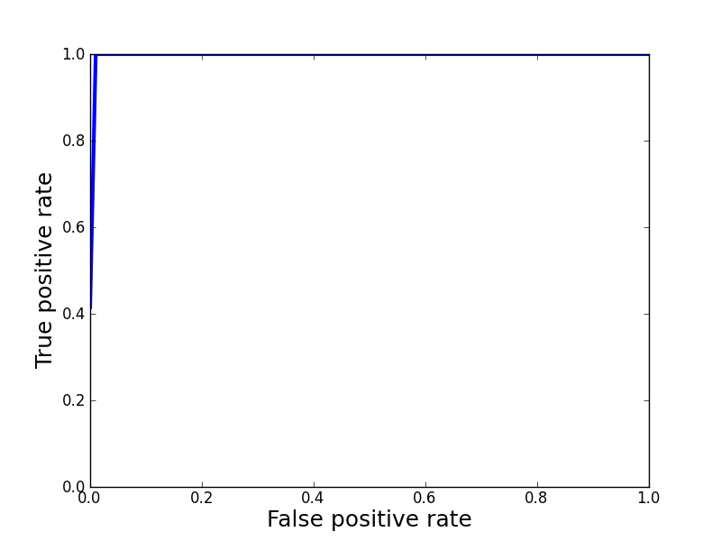

:author: Minwoo Lee
:email: lemin@cs.colostate.edu
:institution: Colorado State University

:author: Charles W. Anderson
:email: anderson@cs.colostate.edu
:institution: Colorado State University

:author: Mark DeMaria
:email: Mark.DeMaria@noaa.gov 
:institution: NOAA/NESDIS/STAR

------------------------------------------------
Hurricane Prediction with Python
------------------------------------------------

.. class:: abstract

The National Centers for Environmental Prediction (NCEP) Global Forecast System (GFS) is a global spectral model used for aviation weather forecast. It produces forecasts of wind speed and direction, temperature, humidity and precipitation out to 192 hr every 6 hours over the entire globe. The horizontal resolution in operational version of the GFS is about 25 km. Much longer integrations of similar global models are run for climate applications but with much lower horizontal resolution. Although not specifically designed for tropical cyclones, the model solutions contain smoothed representations of these storms. One of the challenges in using global atmospheric model for hurricane applications is objectively determining what is a tropical cyclone, given the three dimensional solutions of atmospheric variables. This is especially difficult in the lower resolution climate models. 
To address this issue, without manually selecting features of intersts, the initial conditions from a low resolution version of the GFS (2 degree latitude-longitude grid) are examined at 6 hour periods and compared with the known positions of tropical cyclones. 
Several Python modules are used to build a prototype model quickly, and the prototype model shows fast and accurate prediction with the low resolution GFS data. 

.. class:: keywords

   hurricane, prediction, GFS, SVM

Introduction
------------

The devastating effects from tropical storms, hurricanes [#f1]_ , and typhoons on life and property places great importance on forecasting and warning systems [CAM02]. To minimize the possible damages from hurricanes, we need fast and accurate forecasts as early as possible. Even with the significance of predicting a hurricane, the procedure for indentifying the initial position and intensity of tropical cyclones is not fully automated. From direct measures from aircraft, ships and surface stations and remote sensing observations, including satellite imagery and Doppler radar that is collected over time, meteorologists identify a storm, and it is cumbersome process. 

.. [#f1] In this paper, the term hurricane is used generically to represent tropical cyclones of all intensities, even though, technically speaking, a tropical cyclone must have winds greater than 63 kt to be classified as a hurricane.

Numerical models are used to forecast the future position, intensity and structure of hurricanes. For climate applications, the resolution of these models is marginal for representation of hurricanes. Different schemes are proposed to detect tropical cyclone-like vortices (TCLVs) in general circulation model (GCM) simulations, which rely on threshold values of observed  characteristics of actual tropical cyclones. However, it is ad-hoc to use a different threshold for hurricane prediction [WAL04]. Although there is some research ongoing to improve the reanalysis approach that determines the threshold, currently there is no good representation of actual hurricane structure for reanalysis. Furthermore, considering potential changes of hurricane intensity [WAL04], faster and simple approaches are required for practical use. 

This paper examines a method to automate the objective identification of hurricanes in global model forecast fields by using a machine learning approach, support vector machines (SVM), based on Global Forecast System (GFS) analyses. The outputs from GFS [SAH06, EMC03] that produce forecasts of wind speed and direction, humidity, and temperature are used as source for hurricane prediction without any filtering based on previous knowledge. From these features at each grid point, SVMs can be trained to make an accurate prediction of hurricane occurrence. 

.. figure:: process.png

   Hurricane prediction procedure. :label:`process`

Figure :ref:`process` shows the sequential procedure for hurricane prediction from data conversion to final hurricane prediction.
Python provides useful packages to reduce the time for prototyping this hurricane prediction procedure.
Using Numpy, the basic data matrices for meteorological features in each grid are stored and manipulated. Matplotlib is used to analyze the patterns of the data features, and the data is trained and classified by using PyML SVM. PyGTK with Glade and Basemap generate the graphical user interface to connect the sequential process of preparing data, training a classifier, predicting hurricanes and presenting prediction results to users. 

Global Forecast System and Hurricane Tracks
-------------------------------------------

To predict hurricanes, the first step is to access the weather data. In this paper, we choose the output from the U.S. National Centers for Environmental Prediction (NCEP) Global Forecast System (GFS). For this initial prototype, low resolution GFS analysis fields are used, rather than the GFS model forecasts. Similar GFS analysis data are available in real time from NCEP (http://www.nco.ncep.noaa.gov/pmb/products/gfs/) along with the foreacst fields. 

The GFS data set contains wind speed and direction, temperature, geopotential height deviation and relative humidity in a meteorological 3-D grid along with the year, month-day, time, longitude, and latitude. The vertical coordinate of the 3-D grid represents pressure level, where 100 hPa is near the top of the atmosphere and 1000 hPa is near the surface. Figure :ref:`gfs` shows example wind vectors at fixed vertical level (850 hPa of presssure). 

This paper uses a low resolution GFS data with the longitude and latitude intervals of 2 degrees and recording interval of 6 hours (0, 6, 12 or 18 UTC). This is similar to what might be obtained from a long-term climate simulation. Along with GFS outputs, hurricane tracks are used as labels for hurricane locations. Hurricane tracks contain storm number, year, month, day, time, and storm information such as latitude, longitude, maximum winds, minium pressure at the storm center, storm type, and basin. For this research, each storm location and time information is extracted to use them as labels for hurricane prediction training.

.. figure:: hurricane.jpg

   The wind component and humidity 2-D plot at a fixed vertical pressure level. (http://mag.ncep.noaa.gov/NCOMAGWEB/appcontroller) :label:`gfs`

Data Preprocessing for Hurricane Detection
------------------------------------------

Raw GFS data and hurricane tracks cannot be used directly; data preprocessing is necessary for efficient hurricane prediction. Since the goal of the research is predicting the longitudinal and latitudinal location of hurricanes, all the vertical coordinates  can be combined at each grid point. 
Each location on the earth, specified by its latitude and longitude, is covered by a 3-D grid cell of GFS data. We chose to combine the GFS data from the four grid cell corners at all 11 heights by concatenating them into one vector, as illustrated in Figure :ref:`convert`. The presence or absence of a hurricane at each location is indicated by a 1 or -1, respectively, as the first element of the vector. Thus, each sample contains :math:`1+11 \times 4 \times 8 = 353` values. 

From July 1st, 2008 through Just 4th, 2008, there are 194,400 sample grid cells, and only 33 of them contains hurricanes.
To examine the difference between hurricane cells and the others, the preprocessed data representation can be visualized by combining samples as the rows of a Numpy array and displayed as an image using Matplotlib. 
In Figure :ref:`data`, the first 33 rows represent locations with hurricanes during the time period, and the other rows are randomly selected locations that do not have hurricanes. The image shows that the data patterns are significantly different between hurricane locations and the other samples. 
There is less variation in some columns in the first 33 rows, the locations contain hurricanes, than in the last 66 rows, locations without hurricanes. 

.. figure:: preprocessing.png

   Converting GFS data and hurricane tracks for hurricane prediction. :label:`convert`

   Image map for the converted data. First 33 rows are the grids that have hurricanes, and the rest rows are randomly sampled grids. :label:`data`

Numpy and Matplotlib for Data Preprocessing and Analysis
--------------------------------------------------------

Numpy is the fundamental package that is used as a multi-dimensional container. 
In this research, Numpy provides the basic data structure for converted data representations and operations. It includes various tools for data handling such as reading and storing files, linear algebra, and matrix manipulation. Data conversion in Figure :ref:`convert` is easily implemented by using Numpy functions and array object. 
The matshow() function in Matplotlib is used to generate the image in Figure :ref:`data` and gives a first look at the data pattern. Although eye observation of data is not always successful for the general machine learning approaches, it is useful for the GFS data. 

Support Vector Machine
----------------------

Support Vector Machine (SVM) [ASA08,BIS06] is a popular tool for classification, regression, and novelty detection. An important property of support vector machines is that the determination of the model parameters corresponds to a convex optimization problem, thus a local solution is a global optimum [BIS06].  
Figure :ref:`svm` shows the binary SVM margin maximizer for classification and is explained below. 

.. figure:: svm.png

   Support Vector Machine. :label:`svm`

Support vector machine is characterized by its margin: it looks for the hyperplane that separates data into two classes with maximum margin. Let the training data be :math:`(x_i, y_i)` with :math:`m` input vectors :math:`x_i` and target values :math:`y_i \in {-1, 1}`. 
The hyperplane can be defined

.. math::
   :label: eqn-disc

   f(x) = w^T \Phi(x) + b

where :math:`\Phi(x)` denotes a nonlinear function. The :math:`w` is the weight vector, and scalar :math:`b` is the bias. 
Thus, the margin separation into two half spaces can be defined

.. math::

  \left\{ \begin{array}{l l}
    y_i = -1 & \quad \text{if }w^T \Phi(x_i) + b \leq -1\\
    y_i = 1 & \quad \text{if }w^T \Phi(x_i) + b \geq 1
  \end{array} \right.

If the data is linearly separable, we can find a hyperplane such that 

.. math::

  y_i f(x_i) \geq 1

If we scale the hyperplane in Equation :ref:`eqn-disc`, we get the margin that is :math:`\frac{2}{\|w\|}`. 
Since maximizing :math:`\frac{2}{\|w\|}` is equivalent to minimizing :math:`\frac{\|w\|}{2}`, the hard margin SVM that seeks a maximum margin can be written as a linear program:  

.. math::

  \begin{array}{l l}
  \mbox{minimize} \quad & \frac{\| w \|}{2} \\
  \\
  \mbox{subject to} \quad & y_i ( w^T \Phi(x) + b) \geq 1
  \end{array} 

In practice, the data is not always linearly separable. In such data, by allowing some misclassified points, we can get larger margins. Some previous theoretical and experimental study shows that larger margin will generally perform better than hard margin SVM [ASA08]. We can define the slack variables :math:`\xi_i>0` to allow errors. 

.. math::

  y_i (w^T \Phi(x) + b) \geq 1 - \xi_i

Now, adding control parameter :math:`C`, we can rewrite the previous linear program: 

.. math::

  \begin{array}{l l}
  \mbox{minimize} \quad & \frac{\|w\|}{2} + C \sum_{i=1}^{m} \xi_i \\
  \\
  \mbox{subject to} \quad &y_i ( w^T \Phi(x) + b) \geq 1 - \xi_i \\
					& \xi_i > 0 
  \end{array}

where :math:`m` is the number of points.
:math:`C` controls the conflicting objectives, maximizing the margin and minimizing the sum of errors. When :math:`C` is large, a large penalty is given to errors, it reduces the margin that minimizes the error term. When :math:`C` is small, it allows more errors resulting in margin increase. 

PyML
----

PyML is a machine learning library that focuses on SVM and kernel methods. 
As other python packages such as scikit-learn, shogun, orange, and mlpy, PyML efficiently wraps the state of the art SVM library, libsvm. 
PyML provides several dataset containers that hold class labels and a collection of data patterns. The Numpy array object concatenating our hurricane data can be easily converted to VectorDataSet in PyML. Since we have observed the significant difference between hurricane and non-hurricane data patterns, we apply a simple linear kernel for classification. Based on the dataset and linear kernel, the SVM is trained for hurricane prediction.

PyGTK and Glade for User Interface
----------------------------------

.. figure:: glade-3.png
   :figclass: t

   Glade-3 for creating the GUI for hurricane prediction. :label:`glade`

For converting the raw data, training SVM, and finally predicting hurricanes, a simple interface prototype can be easily constructed by using PyGTK and Glade-3. Glade is a rapid application development tool to enable fast user interface design. Glade-3 tool in Figure :ref:`glade` makes it easy to create the base UI for hurricane prediction. Instead of writing the codes for the placement, color, or type of each widget, the UI created in Glade-3 is stored in XML, and the XML file is loaded in the python program with PyGTK. This saves a fair amount of time for creating the GUI. The user interface is composed of right side inputs and buttons for GFS data and tracks file selection and converting with some options and for training a classifier and saving or loading the trained classifier. When a trained classifier is ready, the bottom interface is used to predict hurricanes after selecting the GFS data to apply to the classifer. The major part of the UI plots prediction results on a map by using Basemap. Check buttons on the bottom menu are for plotting options.
The following code snippet shows the simple usage to load the glade UI (the prototype codes will be available on http://www.cs.colostate.edu/~lemin/hurricane/):

.. code-block:: python

   import gtk, gobject, cairo
   import gtk.glade

   gladefile = "HurricaneUI.glade"
   builder = gtk.Builder()
   builder.add_from_file(gladefile)
   self.window = builder.get_object("mainWindow")
   builder.connect_signals(self)

Basemap to locate hurricane and prediction
------------------------------------------

Basemap is an add-on toolkit for Matplotlib that enables plotting data over map projections. Coastlines, political boundaries, longitude and latitude grid lines are available in several different resolutions. Provided map projection coordinates and plotting functions make it easy to visualize predicted locations and actual hurricanes on the globe. 
Figure :ref:`predict` shows the GUI for hurricane prediction. Orthogonal Basemap for the globe is projected in the middle of the interface and when the trained SVM is applied to the test data, it can show the hurricane locations as well as the predicted hurricane locations depending on the display options.
Basemap on the interface can be loaded as below:

.. code-block:: python

   from mpl_toolkits.basemap import Basemap

   self.map = Basemap(projection='ortho',
                      lat_0 = lat, lon_0 = lon,
                      resolution = 'l', 
                      area_thresh = 1000., ax=ax)

   self.map.drawcoastlines(ax=self.ax)
   self.map.drawcountries(ax=self.ax)
   self.map.drawlsmask(land_color='yellowgreen',
                       ocean_color='#CCFFFF',
                       lakes=True, ax=self.ax)

Hurricane Prediction
--------------------

Using 2008 GFS data and hurricane tracks, we ran a simple experiment for hurricane prediction.
Running the codes below for 5-fold cross-validation achieves 0.9998 of success rate (0.8458 balanced success rate). 
The almost square ROC curve (Figure :ref:`roc`) shows the accuracy of the proposed framework.
The computed ROC/ROC_50 scores are 0.999808 and 0.916524 respectively.

.. code-block:: python

   import PyML as pyml

   data = pyml.VectorDataSet(filen, labelsColumn=0)
   s = pyml.SVM()
   result = s.cv(data)

   ROC curve for the support vector machine. :label:`roc`

Now, we train SVM with four days of GFS data and hurricane tracks from July 1st to July 4th in 2008.
The trained SVM predicts hurricane locations of one and half months later. It is tested on the data for August 29th when Hurricane Gustav neared the west side of Cuba, and it predict the actual hurricane or near hurricane locations successfully. 
Even with a short peiord time for training samples, it found all hurricane locations without an error in testing data: the prediction picks 21 grid cells including all four hurricane locations. Figure :ref:`predict` shows that even with over estimation of hurricane locations, it predicts all the hurricanes. Furthermore, the false positives are neighboring locations that can be the area that hurricanes affect the atmospheric conditions close to the data pattern of true hurricane locations.  
Training and prediction is done simply by reading data files and calling train() and test() functions:

.. code-block:: python

   import PyML as pyml

   data = pyml.VectorDataSet(filen, labelsColumn=0)
   s = pyml.SVM()
   s.train(data) # training
   test_data = pyml.VectorDataSet(testfn, labelsColumn=0)
   result = s.test(test_data) # prediction

.. figure:: ui_hurricanes.png
   :figclass: t

   Hurricane prediction and actual hurricanes. Blue circles indicate predicted hurricane locations, and red circles indicate the actual hurricane locations. :label:`predict`

Conclusion
----------

In summary, we presented the hurricane prediction problem, how it can be tackled objectively with a machine learning approach, and how python packages are applied to prototype the hurricane prediction. 
For the proposed approached, metheologists do not need to select features of interests anymore. 
To show this, various python packages are used for fast and efficient prototyping that solves the hurricane prediction problem: Numpy for converting GFS data and hurricane tracks, Matplotlib for analyzing the data patterns, PyML for binary classification of hurricanes, and PyGTK, Glade, and Basemap for the graphical user interface. 

This machine learning approach will be able to contribute developing fast and objective adaptation model for hurricane prediction without manual feature selection. Although the connection between global warming and hurricanes is not clear, some research such as [WAL04] points out that changes in the number of storms and the maximum intensities are likely to happen as climate changes. Considering the hurricane changes over time, online adaptation models for hurricane prediction needs to be investigated. The various python packages will be an excellent choice for use in future research as well.

References
----------
.. [SAH06] Saha S, Nadiga S, Thiaw C, Wang J, Wang W, Zhang Q, Van den Dool HM, Pan H-L, Moorthi S, Behringer D, Stokes D, Pena M, Lord S, White G, Ebisuzaki W, Peng P, Xie P. *The NCEP climate forecast system*, 
	   J Clim 19(15):3483–3517. doi: 10.1175/JCLI3812.1, 2006. 

.. [EMC03] Environmental Modeling Center. *The GFS Atmospheric Model*, 
	   NOAA/NCEP/Environmental Modeling Center Office Note 442, 14 pp. 2003
	   [Available online at http://www.emc.ncep.noaa.gov/officenotes/FullTOC.html.].

.. [CAM02] Camargo SJ, Zebiak SE. *Improving the detection and tracking of tropical cyclones in atmospheric general circulation models*, 
	   Technical Report No. 02–02. International Research Institute for Climate Prediction, Palisades, NY, 2002.

.. [WAL04] K. Walsh. *Tropical cyclones and climate change: Unresolved issues*,
	   Climate Res., 27, 78–83, 2004.

.. [HOU01] J.T. Houghton, Y. Ding, D.J. Griggs, M. Noguer, P.J. van der Linden, X. Dai, K. Maskell, C.A. Johnson, *Climate Change 2001: The Scientific Basis*, 
       Contribution of Working Group I to the Third Assessment Report of the Intergovernmental Panel on Climate Change (IPCC). Cambridge University Press, Cambridge and New York, 2001.

.. [ASA08] A. Ben-Hur, C.S. Ong, S. Sonnenburg, B. Sch\"{o}lkopf, and G. R\"{a}tsch. *Support vector machines and kernels for computational biology*, 
	   PLoS Comput Biol, 4(10):e1000173, 2008.

.. [BIS06] C.M. Bishop. *Pattern recognition and machine learning*, 
	   volume 4. Springer New York, 2006.
